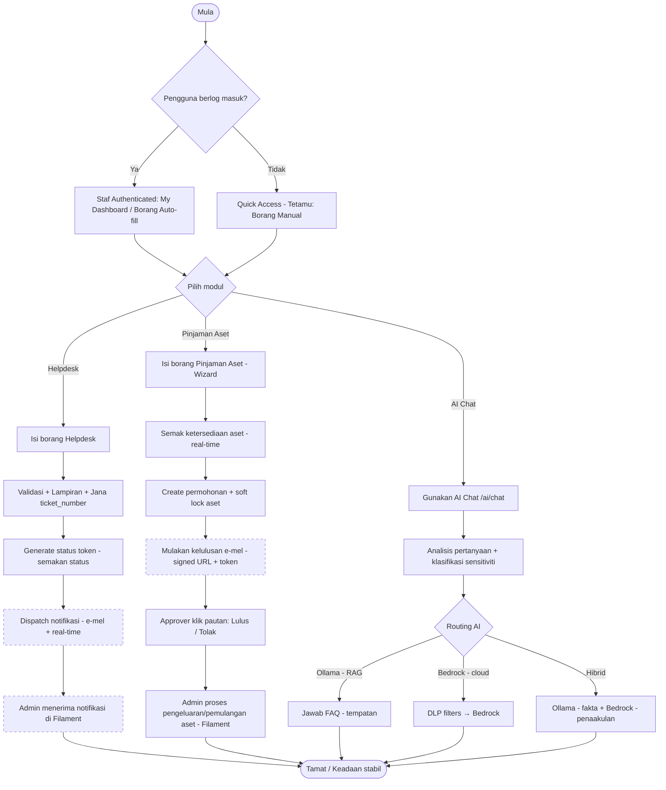
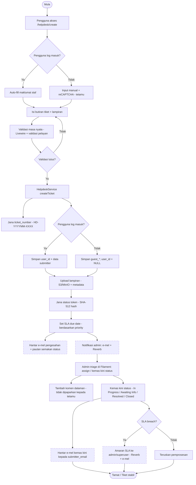
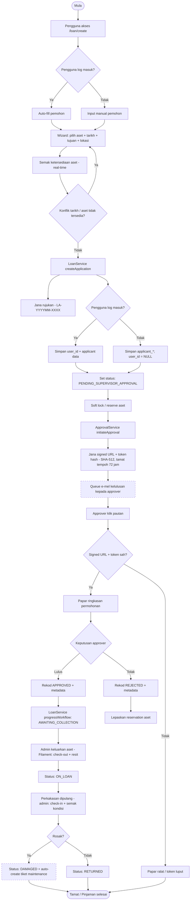
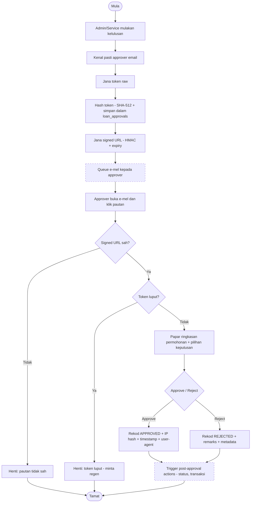
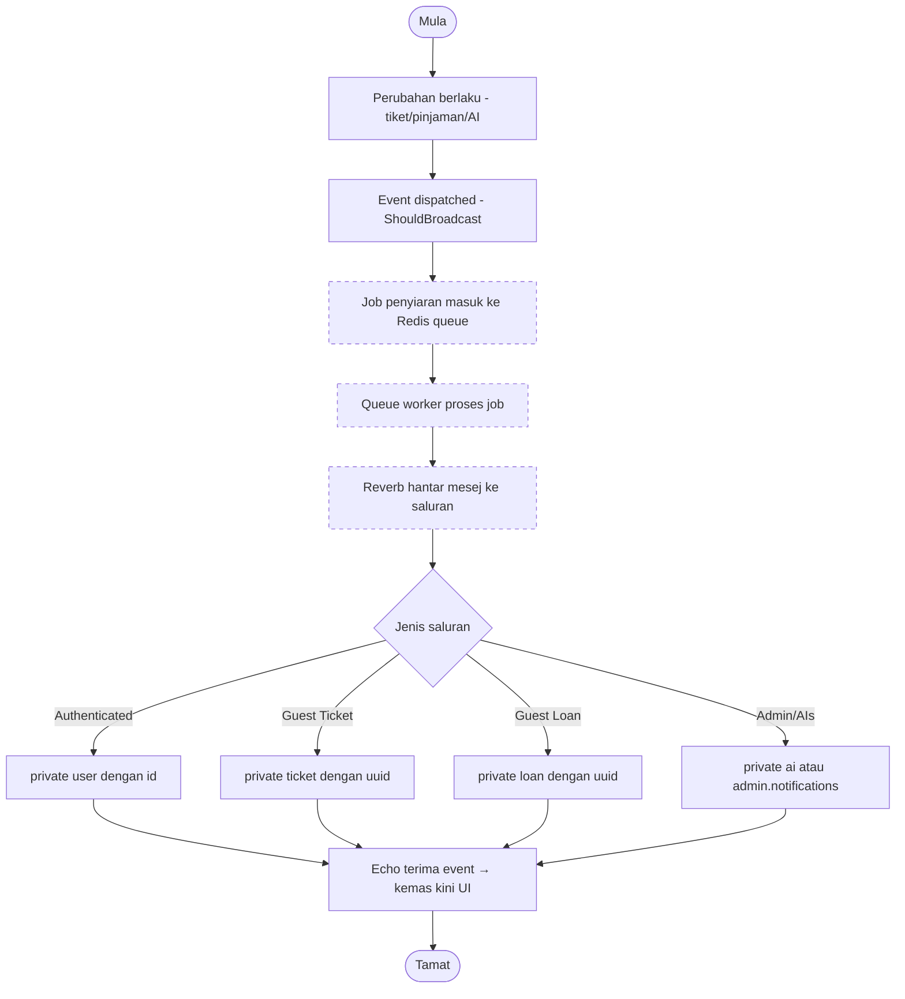
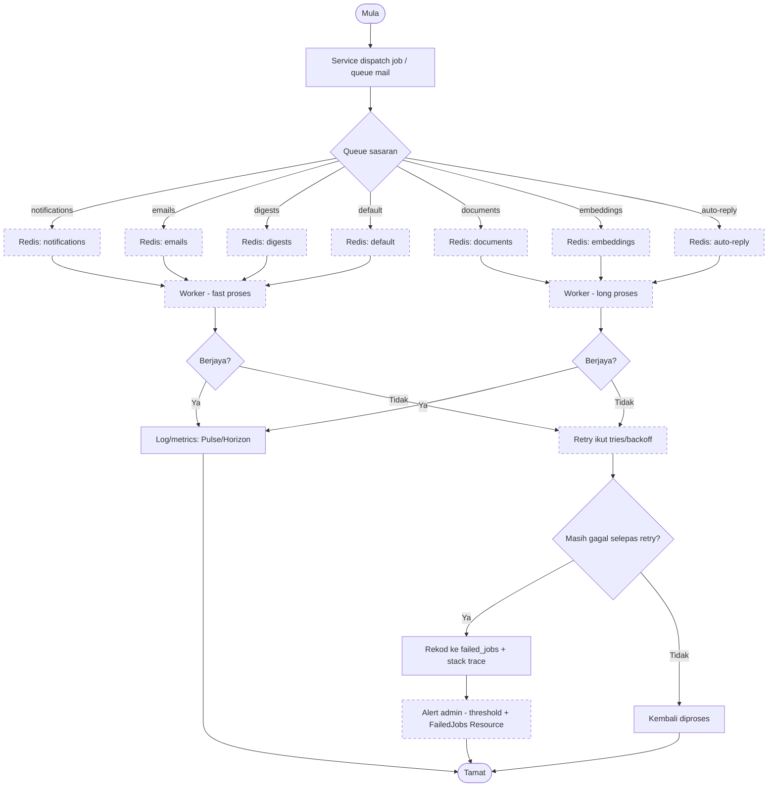
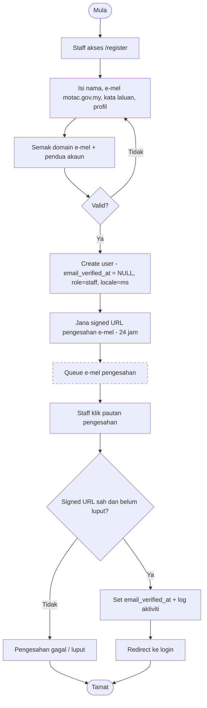
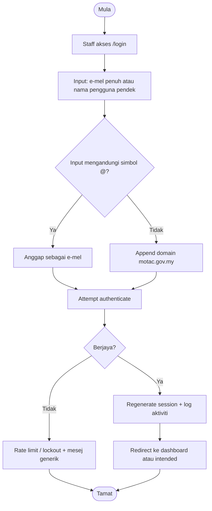
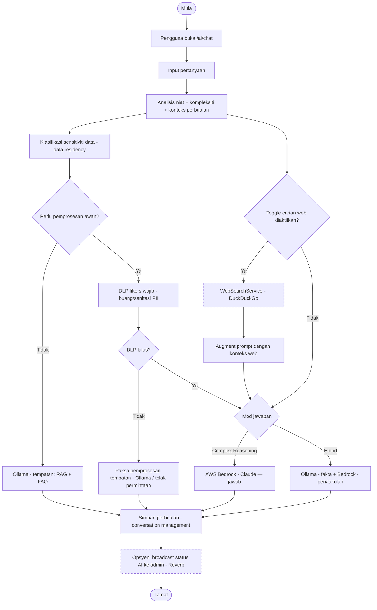

# Rajah Aliran Kerja (Workflow Diagrams) — ICTServe v3.6.1

**Versi sistem:** 3.6.1
**Tarikh:** 2025-12-29
**Nota:** Dokumen ini mengandungi rajah *workflow* (bukan swimlane) menggunakan Mermaid.

---

## Notasi

- Nod keputusan menggunakan bentuk berlian (contoh: `X{Soalan?}`)
- Aktiviti asinkron (queue/broadcast) ditanda dengan gaya `async`

```mermaid
flowchart TD
  classDef async stroke-dasharray: 5 5;
```

---

## 1) Workflow Sistem Menyeluruh (High-Level)



---

## 2) Workflow Helpdesk (Hybrid) — Cipta Tiket hingga Penutupan

Berdasarkan D04 §4.1 dan D03 §5.1.



---

## 3) Workflow Pinjaman Aset (Hybrid) — Permohonan hingga Pemulangan

Berdasarkan D04 §4.2 dan D03 §5.2.



---

## 4) Workflow Kelulusan Pautan E-mel (Signed Approval Link)

Fokus pada token bertandatangan dan audit metadata (D04 §4.2, D03 SRS-LOAN-004 hingga SRS-LOAN-006).



---

## 5) Workflow Notifikasi Masa Nyata (Reverb/Echo)

Berdasarkan D16 (strategi saluran dwi + aliran penyiaran).



---

## 6) Workflow Queue & Pemantauan (Redis + Horizon)

Berdasarkan D17.



---

## 7) Workflow Pendaftaran Staff & Pengesahan E-mel

Berdasarkan D04 §4.6.



---

## 8) Workflow Log Masuk Fleksibel (E-mel/Nama Pengguna)

Berdasarkan D04 §4.7.



---

## 9) Workflow AI Chat (Cloud Hybrid) — Ollama + AWS Bedrock

Berdasarkan D18 (routing + DLP + web augmentation + conversation management).


