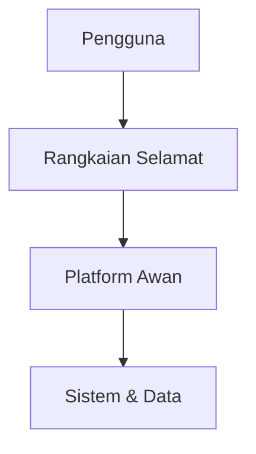
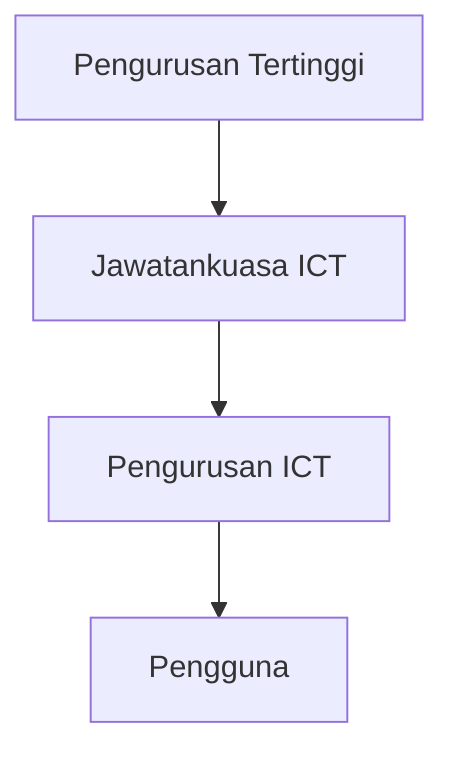
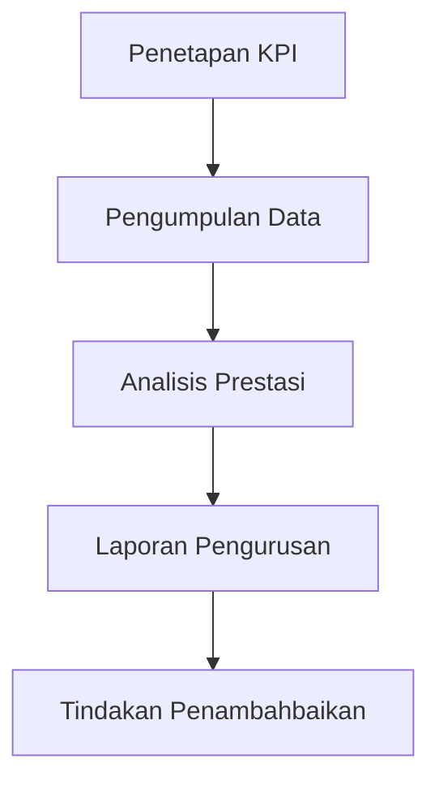

# RINGKASAN EKSEKUTIF  
# PELAN STRATEGIK PENDIGITALAN  
# KEMENTERIAN PELANCONGAN, SENI DAN BUDAYA (MOTAC)  
# 2022 – 2026

---

## MAKLUMAT DOKUMEN

**Nama Dokumen:**  
Ringkasan Eksekutif Pelan Strategik Pendigitalan MOTAC 2022–2026

**Agensi:**  
Kementerian Pelancongan, Seni dan Budaya (MOTAC)

**Bahagian Peneraju:**  
Bahagian Pengurusan Maklumat (BPM)

**Tempoh Pelaksanaan:**  
Tahun 2022 hingga 2026

---

## HAK CIPTA

Hak cipta terpelihara.  
Tiada mana-mana bahagian daripada dokumen ini boleh diterbitkan semula, disalin, disimpan dalam sistem perolehan semula atau diedarkan dalam apa jua bentuk tanpa kebenaran bertulis daripada Kementerian Pelancongan, Seni dan Budaya.

---

## PERUTUSAN

Pelan Strategik Pendigitalan MOTAC 2022–2026 dibangunkan sebagai panduan strategik dalam memperkukuhkan penggunaan teknologi digital sebagai pemangkin utama transformasi penyampaian perkhidmatan MOTAC. Pelaksanaan pendigitalan ini adalah selari dengan aspirasi Kerajaan Digital serta usaha pemulihan dan pemerkasaan sektor pelancongan, seni dan budaya negara.

Pendigitalan bukan sahaja meningkatkan kecekapan operasi dan produktiviti, malah membolehkan perkhidmatan yang lebih responsif, bersepadu dan berorientasikan rakyat serta industri. Pelan ini menyediakan hala tuju yang jelas bagi tempoh lima tahun, merangkumi strategi, inisiatif dan pelan pelaksanaan yang menyeluruh.

Komitmen dan sokongan semua pihak adalah amat penting bagi memastikan kejayaan pelaksanaan Pelan Strategik Pendigitalan MOTAC ini.

---

## CALL TO ACTION

Transformasi digital sektor pelancongan, seni dan budaya memerlukan kerjasama padu semua pihak berkepentingan. Semua warga MOTAC, agensi berkaitan serta pemain industri diseru untuk bersama-sama menjayakan Pelan Strategik Pendigitalan MOTAC 2022–2026.

Pendigitalan bukan lagi satu pilihan, tetapi satu keperluan strategik bagi memastikan daya saing, kelestarian dan kemampanan industri pelancongan dan kebudayaan negara dalam era digital.

---

## PENGENALAN

Kementerian Pelancongan, Seni dan Budaya (MOTAC) berperanan penting dalam membangunkan dan memperkasa ekosistem pelancongan dan kebudayaan negara. Dalam era digital, penggunaan teknologi maklumat dan komunikasi (ICT) menjadi pemangkin utama kepada transformasi organisasi dan penyampaian perkhidmatan yang berkesan.

Pelan Strategik Pendigitalan MOTAC 2022–2026 dirangka bagi:

- Menyokong agenda pendigitalan sektor awam
- Mempertingkat kecekapan operasi dalaman
- Menyediakan perkhidmatan digital yang bersepadu dan berfokuskan pelanggan
- Memanfaatkan teknologi digital dalam pembangunan industri pelancongan dan kebudayaan

Pelan ini mengambil kira landskap semasa ICT MOTAC, keperluan perniagaan, serta perkembangan teknologi dan dasar nasional.

---

## OBJEKTIF PELAN STRATEGIK PENDIGITALAN

Pelan Strategik Pendigitalan MOTAC 2022–2026 bertujuan untuk:

1. Menyediakan hala tuju strategik pendigitalan MOTAC bagi tempoh lima tahun.  
2. Menyokong pencapaian visi dan misi MOTAC melalui pemerkasaan ICT.  
3. Memastikan penjajaran dengan dasar dan inisiatif pendigitalan nasional.  
4. Meningkatkan kecekapan penyampaian perkhidmatan dan pengurusan dalaman.  
5. Menggalakkan penggunaan data dan teknologi digital secara optimum.

---

## SKOP PELAN STRATEGIK PENDIGITALAN

Skop pelan ini merangkumi semua fungsi teras dan sokongan MOTAC, termasuk:

- **Domain Pelancongan**  
  Sistem dan perkhidmatan berkaitan pengurusan industri pelancongan, promosi dan sokongan pemain industri.

- **Domain Kebudayaan**  
  Pendigitalan program, warisan budaya, seni dan kandungan kebudayaan.

- **Domain Pengurusan**  
  Sistem sokongan pengurusan seperti kewangan, sumber manusia dan pentadbiran.

- **Domain Sokongan ICT**  
  Infrastruktur, keselamatan siber, tadbir urus dan pembangunan keupayaan ICT.

---

## PENDEKATAN PEMBANGUNAN PELAN

Pelan Strategik Pendigitalan MOTAC dibangunkan melalui pendekatan berstruktur yang melibatkan:

```mermaid
flowchart LR
A[Analisis Persekitaran Semasa] --> B[Penilaian Keperluan Perniagaan]
B --> C[Pembangunan Strategi Pendigitalan]
C --> D[Penyediaan Pelan Pelaksanaan]
D --> E[Pemantauan & Penambahbaikan]
````

Pendekatan ini memastikan pelan yang dibangunkan adalah praktikal, relevan dan berdaya laksana.

---

# LATAR BELAKANG, PENJARAHAN DASAR NASIONAL & LANDSKAP ICT MOTAC

## LATAR BELAKANG PENDIGITALAN MOTAC

Pendigitalan MOTAC merupakan inisiatif strategik bagi menyokong pemulihan dan pertumbuhan sektor pelancongan, seni dan budaya negara. Seiring dengan perubahan landskap digital global dan peningkatan jangkaan pelanggan, MOTAC perlu memanfaatkan teknologi digital untuk memastikan perkhidmatan yang cekap, bersepadu dan berdaya saing.

Pendigitalan juga berperanan sebagai pemangkin kepada inovasi, pengurusan data yang lebih efektif serta penyampaian perkhidmatan yang berorientasikan rakyat dan industri.

---

## CABARAN PENDIGITALAN

Antara cabaran utama yang dihadapi MOTAC dalam melaksanakan pendigitalan termasuk:

- Sistem ICT yang beroperasi secara silo
- Tahap integrasi sistem yang terhad
- Kekangan sumber dan kepakaran ICT
- Isu keselamatan siber dan perlindungan data
- Keperluan perubahan budaya kerja dan kemahiran digital

Pelan Strategik Pendigitalan ini dirangka bagi menangani cabaran tersebut secara menyeluruh.

---

## PENJARAHAN DENGAN DASAR NASIONAL

Pelan Strategik Pendigitalan MOTAC 2022–2026 dijajarkan dengan dasar dan inisiatif digital peringkat nasional bagi memastikan keselarasan dan sokongan berterusan.

---

### MYDIGITAL

Pelan ini menyokong aspirasi MyDIGITAL dalam mempercepatkan transformasi digital sektor awam dan meningkatkan kecekapan penyampaian perkhidmatan digital kepada rakyat dan industri.

Fokus utama penjajaran termasuk:

- Perkhidmatan digital bersepadu
- Penggunaan teknologi awan
- Pengurusan dan analitik data
- Keselamatan siber dan kepercayaan digital

---

### PELAN STRATEGIK PENDIGITALAN SEKTOR AWAM (PSPSA)

Pelan ini turut menyokong Pelan Strategik Pendigitalan Sektor Awam melalui:

- Pendigitalan proses kerja
- Penyampaian perkhidmatan digital end-to-end
- Tadbir urus dan pengurusan perubahan ICT
- Pemerkasaan modal insan digital

---

### DASAR REVOLUSI PERINDUSTRIAN KEEMPAT (4IR)

Pendigitalan MOTAC mengambil kira elemen 4IR dengan menggalakkan penggunaan:

- Automasi proses
- Analitik data dan kecerdasan buatan
- Platform digital dan ekosistem bersepadu
- Teknologi inovatif bagi sektor pelancongan dan kebudayaan

---

## LANDSKAP SEMASA ICT MOTAC

Analisis landskap semasa ICT MOTAC memberi gambaran menyeluruh terhadap keadaan semasa sistem, infrastruktur dan keupayaan ICT kementerian.

---

### SISTEM APLIKASI

- Terdapat pelbagai sistem aplikasi yang menyokong fungsi teras dan sokongan.
- Sebahagian sistem dibangunkan secara berasingan tanpa integrasi menyeluruh.
- Keperluan penyeragaman dan integrasi sistem dikenal pasti sebagai keutamaan.

---

### INFRASTRUKTUR ICT

- Infrastruktur ICT MOTAC merangkumi pusat data, rangkaian dan peranti pengguna.
- Terdapat keperluan untuk menaik taraf infrastruktur bagi menyokong perkhidmatan digital moden.
- Penggunaan teknologi awan dikenal pasti sebagai peluang penambahbaikan.

---

### PENGURUSAN DATA

- Data wujud dalam pelbagai sistem dan format.
- Kekurangan platform data bersepadu menyukarkan analisis dan perkongsian data.
- Keperluan kepada tadbir urus data yang lebih kukuh dikenal pasti.

---

### KESELAMATAN SIBER

- Keselamatan siber menjadi keutamaan dalam pelaksanaan pendigitalan.
- Keperluan kepada kawalan keselamatan yang lebih menyeluruh dan bersepadu dikenal pasti.
- Kesedaran dan pematuhan keselamatan siber perlu diperkukuh.

---

## RUMUSAN LANDSKAP SEMASA

```mermaid
graph TD
A[Landskap ICT MOTAC]
A --> B[Sistem Aplikasi]
A --> C[Infrastruktur ICT]
A --> D[Pengurusan Data]
A --> E[Keselamatan Siber]
````

Analisis landskap semasa ini menjadi asas kepada pembangunan strategi dan inisiatif pendigitalan MOTAC bagi tempoh 2022–2026.

---

# VISI, MISI & KERANGKA  
# PELAN STRATEGIK PENDIGITALAN MOTAC 2022–2026

---

## VISI PENDIGITALAN MOTAC

**Pendigitalan sebagai pemangkin kecemerlangan penyampaian perkhidmatan dan pemerkasaan ekosistem pelancongan, seni dan budaya negara.**

Visi ini menggambarkan aspirasi MOTAC untuk memanfaatkan teknologi digital sebagai tonggak strategik dalam meningkatkan kecekapan organisasi serta menyokong pertumbuhan industri secara mampan.

---

## MISI PENDIGITALAN MOTAC

Misi pendigitalan MOTAC adalah untuk:

- Menyediakan perkhidmatan digital yang bersepadu dan berfokuskan pelanggan.
- Memanfaatkan data dan teknologi digital dalam pembuatan keputusan.
- Memperkukuh keupayaan ICT dan tadbir urus digital.
- Memastikan keselamatan dan kebolehpercayaan sistem ICT.

---

## PRINSIP STRATEGIK PENDIGITALAN

Pelaksanaan pendigitalan MOTAC berteraskan prinsip berikut:

1. **Berfokuskan Pelanggan**  
   Penyampaian perkhidmatan digital yang mudah diakses dan mesra pengguna.

2. **Berpacukan Data**  
   Penggunaan data sebagai asas kepada perancangan dan keputusan strategik.

3. **Berinovasi dan Fleksibel**  
   Mengadaptasi teknologi baharu dan pendekatan inovatif.

4. **Keselamatan dan Kepercayaan**  
   Melindungi data dan sistem melalui kawalan keselamatan siber yang kukuh.

5. **Kolaborasi dan Integrasi**  
   Perkongsian data dan integrasi sistem merentas domain dan agensi.

---

## HALA TUJU STRATEGIK PENDIGITALAN

Hala tuju strategik pendigitalan MOTAC memberi tumpuan kepada:

- Transformasi proses kerja melalui automasi dan digitalisasi.
- Pembangunan perkhidmatan digital end-to-end.
- Pemerkasaan pengurusan data dan analitik.
- Pengukuhan infrastruktur dan keselamatan ICT.
- Pembangunan keupayaan dan budaya digital.

---

## KERANGKA PELAN STRATEGIK PENDIGITALAN MOTAC

Kerangka Pelan Strategik Pendigitalan MOTAC dibangunkan berasaskan empat teras utama yang saling melengkapi.

```mermaid
graph TB
A[Pelan Strategik Pendigitalan MOTAC]
A --> B[Teras Aplikasi]
A --> C[Teras Data]
A --> D[Teras Infrastruktur ICT]
A --> E[Teras Tadbir Urus & Keupayaan]
````

---

## PERINCIAN TERAS STRATEGIK

### TERAS 1: APLIKASI

Fokus kepada pembangunan dan penambahbaikan sistem aplikasi bagi menyokong perkhidmatan digital yang bersepadu, cekap dan berorientasikan pengguna.

### TERAS 2: DATA

Memperkasa pengurusan data melalui tadbir urus data, integrasi dan penggunaan analitik bagi menyokong pembuatan keputusan strategik.

### TERAS 3: INFRASTRUKTUR ICT

Menyediakan infrastruktur ICT yang selamat, berskala dan berdaya tahan untuk menyokong keperluan pendigitalan.

### TERAS 4: TADBIR URUS & KEUPAYAAN

Memperkukuh tadbir urus ICT, keselamatan siber serta pembangunan keupayaan dan kemahiran digital warga MOTAC.

---

## PENJARAHAN TERAS DENGAN OBJEKTIF STRATEGIK

```mermaid
flowchart LR
A[Teras Aplikasi] --> E[Perkhidmatan Digital Berkualiti]
B[Teras Data] --> F[Keputusan Berpacukan Data]
C[Teras Infrastruktur ICT] --> G[Operasi Stabil & Selamat]
D[Teras Tadbir Urus & Keupayaan] --> H[Tadbir Urus Digital Mantap]
```

Kerangka ini menjadi asas kepada perancangan strategi, inisiatif dan pelan pelaksanaan pendigitalan MOTAC bagi tempoh 2022–2026.

---

# TERAS STRATEGIK & STRATEGI  
# PELAN STRATEGIK PENDIGITALAN MOTAC 2022–2026

---

## PENGENALAN

Bahagian ini memperincikan setiap teras strategik pendigitalan MOTAC serta strategi utama yang digariskan bagi menyokong pencapaian visi dan misi pendigitalan kementerian.

Empat teras strategik ini merangkumi keseluruhan aspek pendigitalan organisasi dan disokong oleh strategi serta inisiatif yang menyeluruh.

---

## TERAS 1: APLIKASI

### OBJEKTIF TERAS APLIKASI

- Menyediakan perkhidmatan digital yang bersepadu dan mesra pengguna.
- Meningkatkan kecekapan proses kerja melalui automasi.
- Mengurangkan kebergantungan kepada proses manual.

---

### STRATEGI TERAS APLIKASI

1. **Pembangunan dan Penambahbaikan Aplikasi Digital**  
   - Menaik taraf sistem sedia ada.
   - Membangunkan aplikasi baharu berdasarkan keperluan perniagaan.

2. **Integrasi Sistem dan Perkhidmatan**  
   - Mengurangkan silo sistem.
   - Melaksanakan integrasi sistem merentas domain.

3. **Automasi Proses Kerja**  
   - Mendigitalisasikan proses kerja teras dan sokongan.
   - Menggunakan teknologi automasi bagi meningkatkan produktiviti.

---

### RANGKAIAN APLIKASI DIGITAL

```mermaid
graph LR
A[Pengguna] --> B[Portal Digital MOTAC]
B --> C[Sistem Pelancongan]
B --> D[Sistem Kebudayaan]
B --> E[Sistem Pengurusan Dalaman]
````

---

## TERAS 2: DATA

### OBJEKTIF TERAS DATA

- Memperkasa penggunaan data dalam pembuatan keputusan.
- Mewujudkan pengurusan data yang bersepadu dan berstandard.
- Meningkatkan kualiti dan kebolehpercayaan data.

---

### STRATEGI TERAS DATA

1. **Tadbir Urus Data**

   - Menetapkan dasar, piawaian dan peranan pengurusan data.

2. **Integrasi dan Perkongsian Data**

   - Membina platform data bersepadu.
   - Menggalakkan perkongsian data secara selamat.

3. **Analitik dan Pelaporan**

   - Menggunakan analitik bagi menyokong perancangan dan pemantauan.
   - Menyediakan papan pemuka pengurusan.

---

### EKOSISTEM DATA MOTAC

```mermaid
graph TD
A[Sumber Data] --> B[Platform Data Bersepadu]
B --> C[Analitik & Pelaporan]
C --> D[Keputusan Strategik]
```

---

## TERAS 3: INFRASTRUKTUR ICT

### OBJEKTIF TERAS INFRASTRUKTUR

- Menyediakan infrastruktur ICT yang stabil, selamat dan berskala.
- Menyokong keperluan perkhidmatan digital dan data.
- Meningkatkan kebolehpercayaan dan ketersediaan sistem.

---

### STRATEGI TERAS INFRASTRUKTUR ICT

1. **Pemodenan Infrastruktur ICT**

   - Naik taraf rangkaian, pelayan dan storan.
   - Menggunakan teknologi awan secara optimum.

2. **Keselamatan dan Ketahanan ICT**

   - Memperkukuh keselamatan siber.
   - Menyediakan pelan pemulihan bencana dan kesinambungan perkhidmatan.

3. **Sokongan Persekitaran Kerja Digital**

   - Menyokong mobiliti dan kolaborasi digital.

---

### SENIBINA INFRASTRUKTUR DIGITAL



---

## TERAS 4: TADBIR URUS & KEUPAYAAN

### OBJEKTIF TERAS TADBIR URUS & KEUPAYAAN

- Memperkukuh tadbir urus ICT dan keselamatan siber.
- Membangunkan keupayaan dan kemahiran digital warga MOTAC.
- Menyokong pengurusan perubahan dan pematuhan.

---

### STRATEGI TERAS TADBIR URUS & KEUPAYAAN

1. **Pengukuhan Tadbir Urus ICT**

   - Menambah baik dasar, polisi dan proses ICT.

2. **Pembangunan Modal Insan Digital**

   - Latihan dan peningkatan kemahiran ICT.

3. **Pengurusan Perubahan**

   - Menggalakkan penerimaan teknologi dan budaya digital.

---

### MODEL TADBIR URUS ICT



---

# INISIATIF STRATEGIK, QUICK WINS  
# & PETA JALAN PELAKSANAAN

---

## PENGENALAN

Bahagian ini menghuraikan inisiatif strategik pendigitalan MOTAC yang dikenal pasti bagi menyokong setiap teras strategik. Inisiatif ini dirancang secara berfasa sepanjang tempoh pelaksanaan 2022 hingga 2026, termasuk pelaksanaan inisiatif berimpak tinggi jangka pendek (Quick Wins).

---

## INISIATIF STRATEGIK PENDIGITALAN

Inisiatif strategik dibangunkan berdasarkan keutamaan perniagaan, keupayaan ICT dan impak kepada penyampaian perkhidmatan.

---

### INISIATIF TERAS APLIKASI

Antara inisiatif utama di bawah Teras Aplikasi ialah:

- Pembangunan portal digital bersepadu MOTAC
- Penaiktarafan sistem teras pelancongan dan kebudayaan
- Pendigitalan proses kerja utama
- Pembangunan aplikasi mudah alih terpilih

---

### INISIATIF TERAS DATA

Inisiatif di bawah Teras Data merangkumi:

- Pembangunan platform data bersepadu MOTAC
- Pelaksanaan tadbir urus data
- Pembangunan papan pemuka pengurusan
- Penggunaan analitik data bagi sokongan keputusan

---

### INISIATIF TERAS INFRASTRUKTUR ICT

Inisiatif utama termasuk:

- Pemodenan infrastruktur rangkaian dan pusat data
- Penggunaan teknologi awan
- Pengukuhan keselamatan siber
- Pelaksanaan pelan pemulihan bencana

---

### INISIATIF TERAS TADBIR URUS & KEUPAYAAN

Inisiatif utama merangkumi:

- Penambahbaikan tadbir urus ICT
- Pembangunan polisi dan garis panduan ICT
- Program latihan dan peningkatan kemahiran digital
- Pengurusan perubahan organisasi

---

## QUICK WINS

Quick Wins dikenal pasti sebagai inisiatif jangka pendek yang:

- Berimpak tinggi
- Boleh dilaksanakan dengan cepat
- Memberi nilai segera kepada organisasi

---

### SENARAI QUICK WINS

1. **Portal Digital Bersepadu MOTAC**  
   Menyediakan satu pintu masuk kepada perkhidmatan digital MOTAC.

2. **Automasi Proses Dalaman Terpilih**  
   Pendigitalan proses kerja yang berulang dan manual.

3. **Papan Pemuka Pengurusan**  
   Penyediaan laporan dan visualisasi data masa nyata.

4. **Pengukuhan Keselamatan Siber Asas**  
   Penambahbaikan kawalan keselamatan siber dan kesedaran pengguna.

---

## PETA JALAN PELAKSANAAN 2022–2026

Peta jalan pelaksanaan pendigitalan MOTAC dibahagikan kepada beberapa fasa.

```mermaid
gantt
title Peta Jalan Pelaksanaan Pendigitalan MOTAC 2022–2026
dateFormat  YYYY
section Fasa 1: Asas
Quick Wins & Persediaan        :a1, 2022, 1y
section Fasa 2: Pengukuhan
Integrasi Sistem & Data        :a2, 2023, 2y
section Fasa 3: Pemerkasaan
Analitik & Inovasi Digital    :a3, 2025, 2y
````

---

## KEUTAMAAN PELAKSANAAN

Keutamaan pelaksanaan inisiatif ditentukan berdasarkan:

- Impak kepada perkhidmatan dan operasi
- Tahap kesediaan organisasi
- Keupayaan dan sumber ICT
- Risiko dan kebergantungan

---

## PENYELARASAN INISIATIF

```mermaid
flowchart TD
A[Inisiatif Strategik] --> B[Pelan Pelaksanaan Tahunan]
B --> C[Pelaksanaan Projek]
C --> D[Pemantauan & Pelaporan]
```

---

# TADBIR URUS PELAKSANAAN  
# PENGURUSAN PERUBAHAN & PEMANTAUAN

---

## PENGENALAN

Pelaksanaan Pelan Strategik Pendigitalan MOTAC 2022–2026 memerlukan struktur tadbir urus yang jelas, mekanisme pengurusan perubahan yang berkesan serta pemantauan berterusan bagi memastikan semua inisiatif dilaksanakan mengikut perancangan, bajet dan sasaran yang ditetapkan.

---

## TADBIR URUS PELAKSANAAN

Tadbir urus pelaksanaan diwujudkan bagi memastikan penyelarasan, akauntabiliti dan kawalan yang berkesan terhadap semua inisiatif pendigitalan MOTAC.

---

### STRUKTUR TADBIR URUS PELAKSANAAN

```mermaid
graph TD
A[Jawatankuasa Pemandu Pendigitalan MOTAC]
B[Jawatankuasa Teknikal ICT]
C[Pejabat Pengurusan Projek (PMO)]
D[Pemilik Inisiatif / Projek]
E[Pasukan Pelaksana]

A --> B
A --> C
B --> D
C --> D
D --> E
````

---

### PERANAN DAN TANGGUNGJAWAB

#### Jawatankuasa Pemandu Pendigitalan

- Menentukan hala tuju strategik pendigitalan.
- Meluluskan perancangan, keutamaan dan sumber.
- Memantau pencapaian keseluruhan pelan strategik.

#### Jawatankuasa Teknikal ICT

- Memberi panduan teknikal dan nasihat kepakaran.
- Menilai keperluan teknologi dan seni bina ICT.
- Memastikan pematuhan kepada piawaian ICT.

#### Pejabat Pengurusan Projek (PMO)

- Menyelaras pelaksanaan projek pendigitalan.
- Memantau kemajuan, kos dan risiko projek.
- Menyediakan laporan status berkala.

#### Pemilik Inisiatif / Projek

- Bertanggungjawab terhadap pencapaian objektif projek.
- Mengurus skop, jadual dan sumber projek.
- Melaporkan kemajuan dan isu kepada PMO.

---

## PENGURUSAN PERUBAHAN

Pengurusan perubahan adalah elemen kritikal bagi memastikan penerimaan dan kejayaan pelaksanaan inisiatif pendigitalan.

---

### OBJEKTIF PENGURUSAN PERUBAHAN

- Mengurangkan rintangan terhadap perubahan.
- Meningkatkan tahap penerimaan pengguna.
- Memastikan perubahan dilaksanakan secara terkawal.
- Menyokong transformasi budaya kerja digital.

---

### PENDEKATAN PENGURUSAN PERUBAHAN

```mermaid
flowchart LR
A[Kesedaran] --> B[Pemahaman]
B --> C[Penerimaan]
C --> D[Pengamalan]
```

---

### AKTIVITI PENGURUSAN PERUBAHAN

- Program komunikasi dan hebahan
- Latihan dan peningkatan kemahiran
- Sokongan pengguna dan khidmat bantuan
- Penglibatan pihak berkepentingan

---

## PEMANTAUAN & PENGUKURAN PRESTASI

Pemantauan prestasi adalah penting bagi menilai keberkesanan pelaksanaan pelan strategik pendigitalan.

---

### PETUNJUK PRESTASI UTAMA (KPI)

Antara KPI yang dikenal pasti termasuk:

- Tahap kemajuan pelaksanaan inisiatif
- Tahap penggunaan perkhidmatan digital
- Tahap kepuasan pengguna
- Kecekapan operasi dan penjimatan kos
- Tahap keselamatan dan ketersediaan sistem

---

### PROSES PEMANTAUAN PRESTASI



---

## PELAPORAN

- Laporan kemajuan disediakan secara berkala.
- Laporan dibentangkan kepada Jawatankuasa Pemandu.
- Isu dan risiko utama dikenal pasti untuk tindakan segera.

---

## PENGURUSAN RISIKO PELAKSANAAN

- Risiko pelaksanaan dikenal pasti dan dinilai.
- Pelan mitigasi risiko disediakan.
- Risiko dipantau sepanjang tempoh pelaksanaan.

---

# IMPAK, MANFAAT, RISIKO  
# & PENUTUP  
# PELAN STRATEGIK PENDIGITALAN MOTAC 2022–2026

---

## PENGENALAN

Bahagian akhir ini merumuskan impak dan manfaat pelaksanaan Pelan Strategik Pendigitalan MOTAC 2022–2026 serta mengenal pasti risiko utama dan langkah mitigasi bagi memastikan pelaksanaan yang mampan dan berkesan.

---

## IMPAK PELAKSANAAN PENDIGITALAN

Pelaksanaan pelan strategik ini dijangka memberi impak positif yang signifikan kepada MOTAC dan ekosistem pelancongan, seni dan budaya negara.

---

### IMPAK KEPADA ORGANISASI MOTAC

- Peningkatan kecekapan operasi dan produktiviti.
- Pengurangan kebergantungan kepada proses manual.
- Penyampaian perkhidmatan yang lebih pantas dan responsif.
- Tadbir urus ICT yang lebih mantap dan bersepadu.
- Peningkatan tahap keselamatan dan kebolehpercayaan sistem ICT.

---

### IMPAK KEPADA INDUSTRI & PIHAK BERKEPENTINGAN

- Akses lebih mudah kepada perkhidmatan digital MOTAC.
- Penyampaian maklumat yang lebih tepat dan masa nyata.
- Sokongan digital yang lebih berkesan kepada pemain industri.
- Pengukuhan ekosistem digital pelancongan dan kebudayaan.

---

## MANFAAT STRATEGIK

Pelaksanaan Pelan Strategik Pendigitalan MOTAC memberikan manfaat strategik seperti berikut:

### MANFAAT OPERASI

- Automasi proses kerja dan penjimatan masa.
- Pengoptimuman penggunaan sumber.
- Pengurangan kos operasi jangka panjang.

### MANFAAT STRATEGIK

- Pembuatan keputusan berasaskan data.
- Keupayaan bertindak balas terhadap perubahan dengan lebih pantas.
- Peningkatan daya saing sektor pelancongan dan kebudayaan.

### MANFAAT KEPADA RAKYAT & INDUSTRI

- Perkhidmatan digital yang mudah, telus dan mesra pengguna.
- Peningkatan kepuasan pelanggan.
- Akses kepada perkhidmatan dan maklumat tanpa sempadan masa dan lokasi.

---

## RISIKO PELAKSANAAN

Pelaksanaan pendigitalan melibatkan beberapa risiko yang perlu diurus secara proaktif.

---

### RISIKO UTAMA

1. **Risiko Perubahan Budaya Kerja**  
   Rintangan pengguna terhadap perubahan proses dan teknologi baharu.

2. **Risiko Kekangan Sumber**  
   Kekurangan sumber kewangan dan kepakaran ICT.

3. **Risiko Teknologi**  
   Kegagalan sistem, integrasi dan kebergantungan teknologi.

4. **Risiko Keselamatan Siber**  
   Ancaman siber dan kebocoran data.

---

## LANGKAH MITIGASI RISIKO

```mermaid
flowchart TD
A[Pengenalpastian Risiko] --> B[Penilaian Risiko]
B --> C[Pelan Mitigasi]
C --> D[Pemantauan Berterusan]
D --> A
````

Langkah mitigasi termasuk:

- Program pengurusan perubahan dan latihan.
- Perancangan sumber dan keutamaan projek.
- Pemilihan teknologi yang sesuai dan berskala.
- Pengukuhan kawalan keselamatan siber.

---

## FAKTOR KEJAYAAN KRITIKAL

Faktor kejayaan pelaksanaan Pelan Strategik Pendigitalan MOTAC termasuk:

- Komitmen dan sokongan pengurusan tertinggi.
- Tadbir urus pelaksanaan yang jelas dan berkesan.
- Penglibatan aktif pihak berkepentingan.
- Pengurusan perubahan yang sistematik.
- Pemantauan prestasi dan penambahbaikan berterusan.

---

## PENUTUP

Pelan Strategik Pendigitalan MOTAC 2022–2026 merupakan dokumen rujukan strategik yang menetapkan hala tuju pendigitalan kementerian bagi tempoh lima tahun. Pelan ini dirangka bagi memastikan MOTAC dapat memanfaatkan teknologi digital secara optimum dalam meningkatkan penyampaian perkhidmatan, kecekapan operasi dan pembangunan ekosistem pelancongan, seni dan budaya negara.

Kejayaan pelaksanaan pelan ini memerlukan komitmen berterusan, kerjasama padu dan kesediaan untuk berubah dalam menghadapi cabaran era digital. Dengan pelaksanaan yang berkesan, MOTAC berupaya menjadi organisasi digital yang berdaya saing, inovatif dan berfokuskan pelanggan.

---

**TAMAT DOKUMEN**
**RINGKASAN EKSEKUTIF
PELAN STRATEGIK PENDIGITALAN MOTAC 2022–2026**
