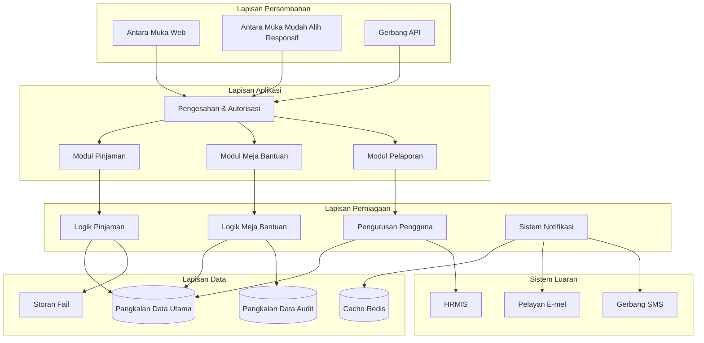
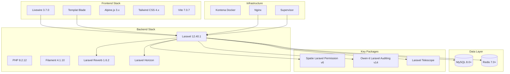
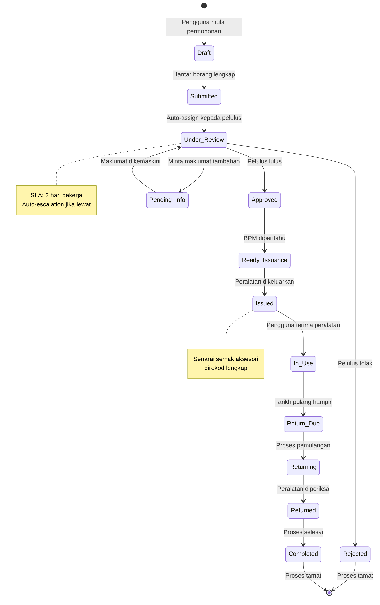
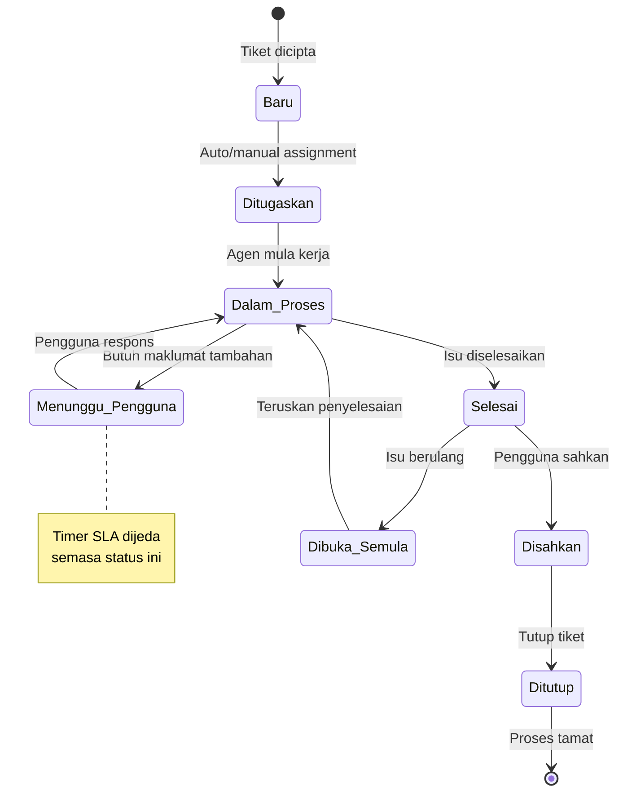
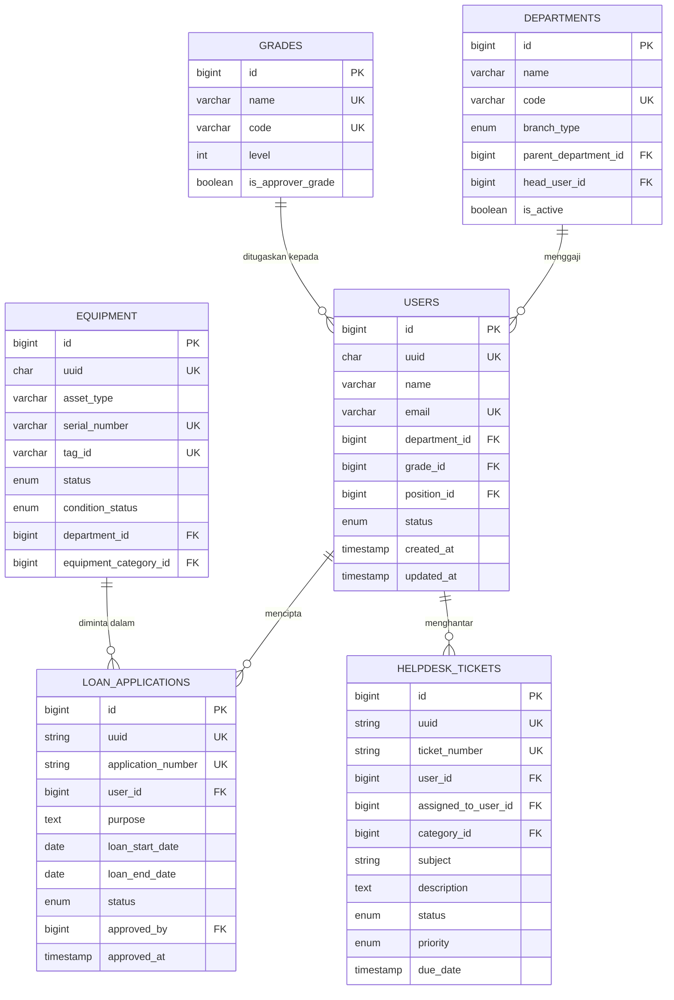

# Dokumentasi Induk Sistem ICTServe (iServe)

**Sistem Helpdesk & ICT Asset Loan MOTAC BPM**
**Versi:** 3.1.0 (SemVer)
**Tarikh Kemaskini:** 29 November 2025
**Status:** Aktif - Penyeragaman Mengikut D00-D17
**Klasifikasi:** Terhad - Dalaman MOTAC
**Penulis:** Pasukan Pembangunan BPM MOTAC
**Standard Rujukan:** ISO/IEC/IEEE 12207, ISO/IEC/IEEE 29148, ISO/IEC/IEEE 15288

---

## Maklumat Dokumen

| Atribut          | Nilai                                                      |
| ---------------- | ---------------------------------------------------------- |
| Versi Dokumen    | 3.1.0 (SemVer)                                             |
| Tarikh Kemaskini | 29 November 2025                                           |
| Status           | Aktif - Penyeragaman D00-D17 Lengkap                       |
| Klasifikasi      | Terhad - Dalaman MOTAC                                     |
| Pematuhi         | ISO/IEC/IEEE 12207, ISO/IEC/IEEE 29148, ISO/IEC/IEEE 15288 |
| Penulis          | Pasukan Pembangunan BPM MOTAC                              |
| Bahasa           | Bahasa Melayu (utama) dengan istilah Inggeris              |

> **Notis Penggunaan Dalaman:** Sistem ICTServe/iServe adalah untuk kegunaan dalaman
> Kementerian Pelancongan, Seni dan Budaya (MOTAC) sahaja dan tidak ditujukan untuk
> kegunaan awam (internal use only).

---

## Sejarah Perubahan (Changelog)

| Versi | Tarikh           | Perubahan                                                         | Penulis     |
| ----- | ---------------- | ----------------------------------------------------------------- | ----------- |
| 3.1.0 | 29 November 2025 | Kemaskini D00-D17, tambah D16 Broadcasting & D17 Queue Management | Pasukan BPM |
| 3.0.0 | 25 Januari 2025  | Integrasi Docker deployment, pemodenan infrastruktur              | Pasukan BPM |
| 2.1.1 | 31 Oktober 2025  | Penyeragaman mengikut D00-D14                                     | Pasukan BPM |
| 2.0.0 | 17 Oktober 2025  | Penyeragaman mengikut D00-D14, tambah cross-reference lengkap     | Pasukan BPM |
| 1.0.0 | September 2025   | Versi awal dokumentasi induk sistem                               | Pasukan BPM |

---

## Rujukan Dokumen Berkaitan (D00-D17)

| Dokumen | Penerangan                       | Pautan                                                                                   |
| ------- | -------------------------------- | ---------------------------------------------------------------------------------------- |
| D00     | Ringkasan Sistem                 | [D00_SYSTEM_OVERVIEW.md](D00_SYSTEM_OVERVIEW.md)                                         |
| D01     | Pelan Pembangunan Sistem         | [D01_SYSTEM_DEVELOPMENT_PLAN.md](D01_SYSTEM_DEVELOPMENT_PLAN.md)                         |
| D02     | Spesifikasi Keperluan Perniagaan | [D02_BUSINESS_REQUIREMENTS_SPECIFICATION.md](D02_BUSINESS_REQUIREMENTS_SPECIFICATION.md) |
| D03     | Spesifikasi Keperluan Perisian   | [D03_SOFTWARE_REQUIREMENTS_SPECIFICATION.md](D03_SOFTWARE_REQUIREMENTS_SPECIFICATION.md) |
| D04     | Dokumen Rekabentuk Perisian      | [D04_SOFTWARE_DESIGN_DOCUMENT.md](D04_SOFTWARE_DESIGN_DOCUMENT.md)                       |
| D05     | Pelan Migrasi Data               | [D05_DATA_MIGRATION_PLAN.md](D05_DATA_MIGRATION_PLAN.md)                                 |
| D06     | Spesifikasi Migrasi Data         | [D06_DATA_MIGRATION_SPECIFICATION.md](D06_DATA_MIGRATION_SPECIFICATION.md)               |
| D07     | Pelan Integrasi Sistem           | [D07_SYSTEM_INTEGRATION_PLAN.md](D07_SYSTEM_INTEGRATION_PLAN.md)                         |
| D08     | Spesifikasi Integrasi Sistem     | [D08_SYSTEM_INTEGRATION_SPECIFICATION.md](D08_SYSTEM_INTEGRATION_SPECIFICATION.md)       |
| D09     | Dokumentasi Pangkalan Data       | [D09_DATABASE_DOCUMENTATION.md](D09_DATABASE_DOCUMENTATION.md)                           |
| D10     | Dokumentasi Kod Sumber           | [D10_SOURCE_CODE_DOCUMENTATION.md](D10_SOURCE_CODE_DOCUMENTATION.md)                     |
| D11     | Dokumentasi Rekabentuk Teknikal  | [D11_TECHNICAL_DESIGN_DOCUMENTATION.md](D11_TECHNICAL_DESIGN_DOCUMENTATION.md)           |
| D12     | Panduan Rekabentuk UI/UX         | [D12_UI_UX_DESIGN_GUIDE.md](D12_UI_UX_DESIGN_GUIDE.md)                                   |
| D13     | Rangka Kerja Frontend UI/UX      | [D13_UI_UX_FRONTEND_FRAMEWORK.md](D13_UI_UX_FRONTEND_FRAMEWORK.md)                       |
| D14     | Panduan Gaya UI/UX               | [D14_UI_UX_STYLE_GUIDE.md](D14_UI_UX_STYLE_GUIDE.md)                                     |
| D15     | Penyetempatan Bahasa (MS/EN)     | [D15_LANGUAGE_MS_EN.md](D15_LANGUAGE_MS_EN.md)                                           |
| D16     | Persediaan Broadcasting          | [D16_BROADCASTING_SETUP.md](D16_BROADCASTING_SETUP.md)                                   |
| D17     | Pengurusan Queue (Horizon)       | [D17_QUEUE_MANAGEMENT_HORIZON.md](D17_QUEUE_MANAGEMENT_HORIZON.md)                       |

---

## Tujuan Dokumen Induk

Dokumen ini berfungsi sebagai pusat rujukan utama untuk semua dokumentasi berkaitan
dengan sistem ICTServe (iServe). Ia menyediakan ringkasan sistem dan pautan kepada
dokumen-dokumen terperinci yang merangkumi pelbagai aspek sistem.

Tujuan utama dokumen induk ini adalah untuk:

- **Memusatkan Akses:** Menyediakan satu titik permulaan untuk mencari semua maklumat berkaitan sistem
- **Memudahkan Navigasi:** Membolehkan pengguna mencari dan mengakses dokumen spesifik dengan mudah
- **Memastikan Konsistensi:** Menjadi rujukan utama untuk versi dan status terkini bagi setiap dokumen

---

## Ringkasan Sistem

ICTServe (iServe) v3.0.0 adalah platform digital bersepadu yang direka khusus untuk
mengurus perkhidmatan ICT di Kementerian Pelancongan, Seni dan Budaya Malaysia (MOTAC).
Sistem ini menggantikan proses manual tradisional dengan penyelesaian digital yang
cekap, selamat, dan mesra pengguna.

### Modul Utama

| Modul                      | Penerangan                                                             | Rujukan        |
| -------------------------- | ---------------------------------------------------------------------- | -------------- |
| Modul Pinjaman Aset ICT    | Pengurusan permohonan, kelulusan, pengeluaran, dan pemulangan aset ICT | D03 §4, D04 §5 |
| Modul Meja Bantuan         | Sistem tiket untuk pengurusan aduan dan permintaan sokongan teknikal   | D03 §5, D04 §6 |
| Panel Pentadbir (Filament) | Pengurusan sistem, pengguna, dan konfigurasi                           | D04 §7, D13    |

### Teknologi Teras

| Komponen               | Teknologi       | Versi   |
| ---------------------- | --------------- | ------- |
| Backend Framework      | Laravel         | 12.40.1 |
| PHP Runtime            | PHP             | 8.2.12  |
| Admin Panel            | Filament        | 4.1.10  |
| Frontend Components    | Livewire        | 3.7.0   |
| Single-File Components | Livewire Volt   | 1.10.1  |
| CSS Framework          | Tailwind CSS    | 4.1.17  |
| Build Tool             | Vite            | 7.0.7   |
| WebSocket Server       | Laravel Reverb  | 1.6.2   |
| Queue Management       | Laravel Horizon | Latest  |
| Database               | MySQL           | 8.x     |
| Cache/Queue            | Redis           | 7.x     |

---

## Kandungan Dokumentasi

### Bahagian 1: Pengenalan dan Keperluan

- [1.1 Ringkasan Eksekutif](#11-ringkasan-eksekutif)
- [1.2 Visi dan Misi](#12-visi-dan-misi)
- [1.3 Objektif Sistem](#13-objektif-sistem)
- [1.4 Sasaran Pengguna](#14-sasaran-pengguna)

### Bahagian 2: Seni Bina dan Rekabentuk

- [2.1 Seni Bina Keseluruhan](#21-seni-bina-keseluruhan)
- [2.2 Corak Seni Bina](#22-corak-seni-bina)
- [2.3 Teknologi Storan](#23-teknologi-storan)

### Bahagian 3: Modul Sistem

- [3.1 Modul Pinjaman Aset ICT](#31-modul-pinjaman-aset-ict)
- [3.2 Modul Meja Bantuan](#32-modul-meja-bantuan)

### Bahagian 4: Pangkalan Data

- [4.1 Gambaran Keseluruhan Skema](#41-gambaran-keseluruhan-skema)
- [4.2 Jadual Utama](#42-jadual-utama)

### Bahagian 5: Keselamatan dan Pematuhan

- [5.1 Kerangka Keselamatan](#51-kerangka-keselamatan)
- [5.2 Pematuhan Standard](#52-pematuhan-standard)

### Bahagian 6: Operasi dan Penyelenggaraan

- [6.1 Pemantauan Sistem](#61-pemantauan-sistem)
- [6.2 Sokongan dan Bantuan](#62-sokongan-dan-bantuan)

### Bahagian 7: Lampiran

- [7.1 Glosari Istilah](#71-glosari-istilah)
- [7.2 Rujukan Teknikal](#72-rujukan-teknikal)

---

## 1.1 Ringkasan Eksekutif

ICTServe (iServe) v3.0.0 adalah platform digital bersepadu yang direka khusus untuk
mengurus perkhidmatan ICT di Kementerian Pelancongan, Seni dan Budaya Malaysia (MOTAC).

### Manfaat Utama

| Manfaat               | Penerangan                                    | Impak Kuantitatif |
| --------------------- | --------------------------------------------- | ----------------- |
| Peningkatan Kecekapan | Pengurangan masa pemprosesan permohonan       | 60% lebih pantas  |
| Ketelusan Operasi     | Jejak audit lengkap dan status masa nyata     | 100% keterlihatan |
| Kepuasan Pengguna     | Antara muka yang intuitif dan mudah digunakan | Skor > 4.0/5.0    |
| Penggunaan Sumber     | Pengoptimuman penggunaan aset ICT             | 35% peningkatan   |

## 1.2 Visi dan Misi

**Visi:** Menjadi platform perkhidmatan ICT terunggul yang mempermudah operasi harian
MOTAC melalui teknologi moden.

**Misi:** Menyediakan sistem yang mudah digunakan, cekap, dan selamat untuk pengurusan
pinjaman aset ICT dan perkhidmatan sokongan teknikal.

## 1.3 Objektif Sistem

### Objektif Strategik

| Objektif                 | Penerangan                       | Metrik Kejayaan           | Tempoh  |
| ------------------------ | -------------------------------- | ------------------------- | ------- |
| Transformasi Digital     | Mendigitalkan proses manual      | 95% proses didigitalkan   | 6 bulan |
| Peningkatan Produktiviti | Mengurangkan masa pemprosesan    | 50% pengurangan masa      | 3 bulan |
| Ketelusan Tadbir Urus    | Jejak audit lengkap              | 100% transaksi direkodkan | Segera  |
| Kepuasan Pengguna        | Meningkatkan pengalaman pengguna | Skor kepuasan > 4.0/5.0   | 6 bulan |

### Objektif Operasi

- **Kebolehcapaian:** Sistem tersedia 99.9% masa operasi
- **Prestasi:** Masa respons < 2 saat untuk semua transaksi
- **Skalabiliti:** Menyokong pertumbuhan pengguna sehingga 1000+ serentak
- **Keselamatan:** Pematuhan penuh dengan standard keselamatan kerajaan
- **Kebolehselenggaraan:** Sistem mudah dikemas kini dan dipelihara

## 1.4 Sasaran Pengguna

| Kategori Pengguna | Peranan Teknikal | Tanggungjawab                                             |
| ----------------- | ---------------- | --------------------------------------------------------- |
| Pengguna Akhir    | `user`           | Semua warga kerja MOTAC yang membuat permohonan dan tiket |
| Pegawai Penyokong | `approver`       | Meluluskan permohonan pinjaman (Gred 41 ke atas)          |
| Staf BPM          | `bpm-staff`      | Menguruskan inventori, transaksi, dan operasi harian      |
| Sokongan IT       | `it-support`     | Memberi sokongan teknikal dan menguruskan tiket           |
| Pentadbir Sistem  | `admin`          | Menguruskan konfigurasi sistem, pengguna, dan peranan     |
| Super Admin       | `super-admin`    | Akses penuh ke semua fungsi sistem dan penyelenggaraan    |

> **Nota:** Panel pentadbir menggunakan Filament v4. Staf BPM dan Pentadbir IT akan
> menggunakan antara muka Filament sebagai kaedah utama untuk pengurusan inventori,
> pengeluaran aset, semakan transaksi, dan operasi pentadbiran harian.

---

## 2.1 Seni Bina Keseluruhan



## 2.2 Corak Seni Bina

ICTServe menggunakan corak seni bina berlapis (Layered Architecture) dengan prinsip berikut:

| Corak              | Implementasi                               | Faedah                                    |
| ------------------ | ------------------------------------------ | ----------------------------------------- |
| MVC Pattern        | Laravel Controllers, Models, Views         | Pemisahan logik yang jelas                |
| Repository Pattern | Abstraksi lapisan akses data               | Mudah untuk pengujian dan penyelenggaraan |
| Observer Pattern   | Notifikasi berasaskan peristiwa            | Penggandingan longgar antara komponen     |
| Strategy Pattern   | Aliran kerja kelulusan yang boleh dipasang | Fleksibiliti dalam logik perniagaan       |
| Facade Pattern     | Antara muka lapisan perkhidmatan           | API yang dipermudahkan                    |

## 2.3 Teknologi Storan



### Jadual Teknologi Terperinci

| Kategori       | Teknologi         | Versi   | Tujuan Utama                            |
| -------------- | ----------------- | ------- | --------------------------------------- |
| Backend        | Laravel           | 12.40.1 | Rangka kerja utama aplikasi             |
| Backend        | PHP               | 8.2.12  | Bahasa pengaturcaraan pelayan           |
| Backend        | Filament          | 4.1.10  | Panel pentadbir dan pembina UI          |
| Frontend       | Livewire          | 3.7.0   | Komponen UI yang dinamik dan reaktif    |
| Frontend       | Livewire Volt     | 1.10.1  | Single-file Livewire components         |
| Frontend       | Alpine.js         | 3.x     | Rangka kerja JavaScript yang ringan     |
| Frontend       | Tailwind CSS      | 4.1.17  | Rangka kerja CSS utility-first          |
| Frontend       | Vite              | 7.0.7   | Alat binaan untuk aset frontend         |
| Real-time      | Laravel Reverb    | 1.6.2   | WebSocket server untuk ciri masa nyata  |
| Real-time      | Laravel Echo      | 2.2.6   | WebSocket client                        |
| Queue          | Laravel Horizon   | Latest  | Pengurusan queue Redis                  |
| Database       | MySQL             | 8.0+    | Pangkalan data utama (Relasional)       |
| Cache          | Redis             | 7.0+    | Cache, Sesi, dan Barisan                |
| Infrastructure | Docker            | Latest  | Kontainerisasi aplikasi                 |
| Infrastructure | Nginx             | 1.24+   | Pelayan web dan proksi terbalik         |
| Packages       | Spatie Permission | 6.x     | Pengurusan peranan dan kebenaran (RBAC) |
| Packages       | Laravel Auditing  | 14.x    | Jejak audit untuk model Eloquent        |
| Packages       | Laravel Breeze    | 2.3.8   | Authentication scaffolding              |

---

## 3.1 Modul Pinjaman Aset ICT

### Aliran Kerja Permohonan Pinjaman



### Tahap Proses Pinjaman

| Tahap          | Pelaku            | Tindakan                           | Output Sistem               | SLA            |
| -------------- | ----------------- | ---------------------------------- | --------------------------- | -------------- |
| 1. Permohonan  | Pengguna          | Isi borang permohonan pinjaman     | Status: Draf → Dihantar     | 15 minit       |
| 2. Validasi    | Sistem            | Semak kelengkapan dan ketersediaan | Laporan pengesahan          | Masa nyata     |
| 3. Kelulusan   | Pegawai Penyokong | Semak dan lulus/tolak permohonan   | Status: Diluluskan/Ditolak  | 2 hari bekerja |
| 4. Persiapan   | Staf BPM          | Sediakan aset untuk diambil        | Status: Sedia untuk diambil | 4 jam          |
| 5. Pengeluaran | Staf BPM          | Rekod pengeluaran aset             | Transaksi dicipta           | 30 minit       |
| 6. Pemulangan  | Pengguna/BPM      | Pulang dan periksa aset            | Transaksi selesai           | 30 minit       |

### Peraturan Perniagaan Pinjaman

```php
class LoanBusinessRules
{
    /**
     * Tentukan sama ada pengguna layak memohon.
     */
    public static function isEligibleApplicant(User $user): bool
    {
        return $user->status === 'active'
            && $user->department_id !== null
            && !self::hasOutstandingLoans($user);
    }

    /**
     * Dapatkan pihak berkuasa kelulusan berdasarkan gred.
     */
    public static function getApprovalAuthority(User $applicant): ?User
    {
        $gradeLevel = $applicant->grade->level ?? 0;

        if ($gradeLevel <= 41) {
            return $applicant->department->getOfficerWithMinGrade(41);
        }

        if ($gradeLevel <= 48) {
            return $applicant->department->getOfficerWithMinGrade(48);
        }

        return $applicant->department->head; // Untuk gred JUSA
    }

    /**
     * Dapatkan tempoh pinjaman maksimum mengikut kategori.
     */
    public static function getMaxLoanPeriod(User $user, string $equipmentType): int
    {
        $limits = [
            'laptop' => ['standard' => 14, 'senior' => 30],
            'projector' => ['standard' => 7, 'senior' => 14],
            'tablet' => ['standard' => 30, 'senior' => 60],
        ];

        $userCategory = $user->grade->level >= 44 ? 'senior' : 'standard';

        return $limits[$equipmentType][$userCategory] ?? 7;
    }
}
```

## 3.2 Modul Meja Bantuan

### Sistem Pengurusan Tiket



### Matriks SLA Meja Bantuan

| Keutamaan | Masa Respons | Masa Penyelesaian | Eskalasi Tahap 1 | Eskalasi Tahap 2 |
| --------- | ------------ | ----------------- | ---------------- | ---------------- |
| Kritikal  | 30 minit     | 4 jam             | 2 jam            | 3 jam            |
| Tinggi    | 2 jam        | 8 jam             | 4 jam            | 6 jam            |
| Sederhana | 4 jam        | 24 jam            | 12 jam           | 18 jam           |
| Rendah    | 8 jam        | 72 jam            | 48 jam           | 60 jam           |

### Kategori Tiket

```yaml
Perkakasan:
  subkategori:
    - Komputer/Laptop
    - Pencetak/Pengimbas
    - Telefon/Faks
    - Peralatan Rangkaian
    - Peralatan Persidangan

Perisian:
  subkategori:
    - Sistem Operasi
    - Aplikasi Pejabat
    - Aplikasi Khusus
    - Lesen Perisian
    - Kemas Kini/Pemasangan

Kesambungan_Rangkaian:
  subkategori:
    - Akses Internet
    - Sambungan WiFi
    - Isu VPN
    - Akses E-mel
    - Pemacu Rangkaian

Akses_Akaun:
  subkategori:
    - Set Semula Kata Laluan
    - Akaun Disekat
    - Permintaan Kebenaran
    - Kemas Kini Profil
    - Penciptaan Akaun

Storan_Data:
  subkategori:
    - Pemulihan Fail
    - Permintaan Sandaran
    - Peruntukan Storan
    - Migrasi Data
    - Permintaan Arkib
```

---

## 4.1 Gambaran Keseluruhan Skema



## 4.2 Jadual Utama

### Strategi Pengindeksan

| Jadual            | Indeks Utama                      | Tujuan                                 | Jenis    |
| ----------------- | --------------------------------- | -------------------------------------- | -------- |
| users             | `(department_id, status)`         | Carian pengguna aktif mengikut jabatan | Komposit |
| loan_applications | `(status, created_at)`            | Papan pemuka senarai permohonan        | Komposit |
| equipment         | `(status, category_id)`           | Carian aset tersedia                   | Komposit |
| helpdesk_tickets  | `(assigned_to, status, priority)` | Papan pemuka ejen IT                   | Komposit |
| audit_logs        | `(created_at, user_id)`           | Jejak audit berdasarkan masa           | Komposit |

### Strategi Audit dan Log

Sistem menggunakan pakej `owen-it/laravel-auditing` v14 untuk jejak audit komprehensif:

```php
// Model dengan audit trail
class LoanApplication extends Model implements Auditable
{
    use \OwenIt\Auditing\Auditable;

    protected $auditInclude = [
        'status',
        'approved_by',
        'approved_at',
        'rejection_reason',
    ];

    protected $auditTimestamps = true;
}
```

---

## 5.1 Kerangka Keselamatan

### Aspek Keselamatan

| Aspek         | Keperluan                               | Standard  | Implementasi          |
| ------------- | --------------------------------------- | --------- | --------------------- |
| Pengesahan    | Pengesahan berpusat melalui direktori   | ISO 27001 | LDAP/Active Directory |
| Autorisasi    | Kawalan Akses Berasaskan Peranan (RBAC) | RBAC      | Spatie Permission v6  |
| Enkripsi Data | AES-256 untuk data at rest              | NIST      | MySQL TDE             |
| Komunikasi    | TLS 1.3 untuk data in transit           | OWASP     | SSL/TLS               |
| Pengauditan   | Jejak audit yang komprehensif           | ISO 27001 | Laravel Auditing v14  |

### Kawalan Akses Berasaskan Peranan (RBAC)

```php
// Definisi peranan dan kebenaran
$roles = [
    'super-admin' => ['*'], // Semua kebenaran
    'admin' => [
        'users.manage',
        'equipment.manage',
        'loans.manage',
        'tickets.manage',
        'reports.view',
    ],
    'bpm-staff' => [
        'equipment.view',
        'equipment.issue',
        'loans.process',
        'tickets.view',
    ],
    'approver' => [
        'loans.approve',
        'loans.reject',
        'loans.view',
    ],
    'user' => [
        'loans.create',
        'loans.view-own',
        'tickets.create',
        'tickets.view-own',
    ],
];
```

## 5.2 Pematuhan Standard

| Standard            | Organisasi | Aplikasi               | Status         |
| ------------------- | ---------- | ---------------------- | -------------- |
| WCAG 2.2 AA         | W3C        | Kebolehcapaian web     | Dipatuhi       |
| OWASP Top 10        | OWASP      | Keselamatan web        | Dipatuhi       |
| ISO 27001           | ISO        | Pengurusan keselamatan | Dalam kemajuan |
| PDPA 2010           | Malaysia   | Perlindungan data      | Dipatuhi       |
| Garis Panduan MAMPU | MAMPU      | IT Kerajaan            | Dipatuhi       |
| PSR-12              | PHP-FIG    | Gaya kod               | Dipatuhi       |

### Senarai Semak Pematuhan WCAG 2.2 AA

- Sokongan navigasi papan kekunci
- Keserasian pembaca skrin
- Pematuhan kontras warna (4.5:1 teks, 3:1 UI)
- Teks alternatif untuk imej
- Label borang yang boleh diakses
- Focus indicators yang jelas
- Skip links untuk navigasi

---

## 6.1 Pemantauan Sistem

### Metrik Pemantauan Utama

| Metrik        | Sasaran | Amaran | Kritikal |
| ------------- | ------- | ------ | -------- |
| CPU Usage     | < 70%   | > 80%  | > 90%    |
| Memory Usage  | < 75%   | > 85%  | > 95%    |
| Disk Usage    | < 80%   | > 85%  | > 95%    |
| Response Time | < 2s    | > 3s   | > 5s     |
| Error Rate    | < 1%    | > 2%   | > 5%     |
| Queue Depth   | < 100   | > 500  | > 1000   |

### Alat Pemantauan

| Alat              | Tujuan                         | Rujukan      |
| ----------------- | ------------------------------ | ------------ |
| Laravel Telescope | Debug dan profil (pembangunan) | D10          |
| Laravel Horizon   | Pemantauan queue Redis         | D17          |
| Laravel Reverb    | WebSocket monitoring           | D16          |
| Application Logs  | Log aplikasi                   | storage/logs |

## 6.2 Sokongan dan Bantuan

### Struktur Sokongan

| Tahap   | Skop                  | Masa Respons | Eskalasi |
| ------- | --------------------- | ------------ | -------- |
| Tahap 1 | Sokongan asas, FAQ    | 30 minit     | 2 jam    |
| Tahap 2 | Isu teknikal kompleks | 2 jam        | 4 jam    |
| Tahap 3 | Isu kritikal sistem   | 30 minit     | 1 jam    |

### Maklumat Hubungan

| Jenis Sokongan      | Hubungan                          | Waktu Operasi      |
| ------------------- | --------------------------------- | ------------------ |
| Sokongan Teknikal   | <support@ictserve.motac.gov.my>   | 24/7               |
| Sokongan Perniagaan | <business@ictserve.motac.gov.my>  | 8:00 PG - 5:00 PTG |
| Kecemasan Sistem    | <emergency@ictserve.motac.gov.my> | 24/7               |
| Dokumentasi         | <docs@ictserve.motac.gov.my>      | 8:00 PG - 5:00 PTG |

---

## 7.1 Glosari Istilah

| Istilah      | Definisi                                                               | Konteks       |
| ------------ | ---------------------------------------------------------------------- | ------------- |
| API          | Application Programming Interface - Antara muka untuk integrasi sistem | Teknikal      |
| BPM          | Bahagian Pengurusan Maklumat                                           | Organisasi    |
| Broadcasting | Penyiaran mesej masa nyata melalui WebSocket                           | Teknikal      |
| CRUD         | Create, Read, Update, Delete - Operasi data asas                       | Teknikal      |
| DRP          | Disaster Recovery Plan - Pelan Pemulihan Bencana                       | Operasi       |
| Filament     | Rangka kerja panel pentadbir untuk Laravel                             | Teknikal      |
| HA           | High Availability - Ketersediaan Tinggi                                | Teknikal      |
| Horizon      | Laravel Horizon - Pengurusan queue Redis                               | Teknikal      |
| HRMIS        | Human Resource Management Information System                           | Sistem        |
| ICT          | Information and Communication Technology                               | Am            |
| Livewire     | Rangka kerja komponen reaktif untuk Laravel                            | Teknikal      |
| MOTAC        | Kementerian Pelancongan, Seni dan Budaya Malaysia                      | Organisasi    |
| MVC          | Model-View-Controller - Corak seni bina perisian                       | Teknikal      |
| ORM          | Object-Relational Mapping - Pemetaan objek-relasi                      | Teknikal      |
| PDPA         | Personal Data Protection Act - Akta Perlindungan Data Peribadi         | Undang-undang |
| Queue        | Barisan tugas latar belakang untuk pemprosesan asinkron                | Teknikal      |
| RBAC         | Role-Based Access Control - Kawalan Akses Berasaskan Peranan           | Keselamatan   |
| REST         | Representational State Transfer - Gaya seni bina web                   | Teknikal      |
| Reverb       | Laravel Reverb - Pelayan WebSocket untuk Laravel                       | Teknikal      |
| RTO          | Recovery Time Objective - Objektif Masa Pemulihan                      | Operasi       |
| RPO          | Recovery Point Objective - Objektif Titik Pemulihan                    | Operasi       |
| SLA          | Service Level Agreement - Perjanjian Tahap Perkhidmatan                | Operasi       |
| SSL/TLS      | Secure Sockets Layer/Transport Layer Security                          | Keselamatan   |
| UUID         | Universally Unique Identifier - Pengecam Unik Sejagat                  | Teknikal      |
| Volt         | Livewire Volt - Single-file Livewire components                        | Teknikal      |
| WCAG         | Web Content Accessibility Guidelines                                   | Standard      |
| WebSocket    | Protokol komunikasi dua hala masa nyata                                | Teknikal      |

## 7.2 Rujukan Teknikal

### Dokumentasi Rasmi

| Sumber            | URL                                         | Versi  | Tujuan                           |
| ----------------- | ------------------------------------------- | ------ | -------------------------------- |
| Laravel Framework | <https://laravel.com/docs>                  | 12.x   | Dokumentasi rangka kerja         |
| Livewire          | <https://livewire.laravel.com/docs>         | 3.x    | Pustaka komponen frontend        |
| Filament          | <https://filamentphp.com/docs>              | 4.x    | Rangka kerja panel pentadbir     |
| Laravel Reverb    | <https://laravel.com/docs/reverb>           | 1.x    | WebSocket server                 |
| Laravel Horizon   | <https://laravel.com/docs/horizon>          | Latest | Queue management                 |
| Laravel Telescope | <https://laravel.com/docs/telescope>        | Latest | Debug dan profil                 |
| Spatie Permission | <https://spatie.be/docs/laravel-permission> | 6.x    | Pengurusan peranan dan kebenaran |
| Laravel Auditing  | <https://laravel-auditing.com>              | 14.x   | Implementasi jejak audit         |
| MySQL             | <https://dev.mysql.com/doc/refman/8.0/en/>  | 8.0    | Dokumentasi pangkalan data       |
| Redis             | <https://redis.io/documentation>            | 7.x    | Caching dan sesi                 |
| Tailwind CSS      | <https://tailwindcss.com/docs>              | 4.x    | Rangka kerja CSS                 |
| Alpine.js         | <https://alpinejs.dev/start-here>           | 3.x    | JavaScript framework             |

### Standard dan Garis Panduan

| Standard            | Organisasi | Aplikasi                        | Status         |
| ------------------- | ---------- | ------------------------------- | -------------- |
| WCAG 2.2 AA         | W3C        | Kebolehcapaian web              | Dipatuhi       |
| OWASP Top 10        | OWASP      | Keselamatan web                 | Dipatuhi       |
| ISO 27001           | ISO        | Pengurusan keselamatan          | Dalam kemajuan |
| ISO/IEC 12207       | ISO/IEC    | Proses kitaran hayat perisian   | Dipatuhi       |
| ISO/IEC 15288       | ISO/IEC    | Proses kitaran hayat sistem     | Dipatuhi       |
| ISO/IEC 29148       | ISO/IEC    | Kejuruteraan keperluan          | Dipatuhi       |
| PDPA 2010           | Malaysia   | Perlindungan data               | Dipatuhi       |
| Garis Panduan MAMPU | MAMPU      | IT Kerajaan                     | Dipatuhi       |
| PSR-12              | PHP-FIG    | Gaya kod PHP                    | Dipatuhi       |
| IEEE 1016           | IEEE       | Dokumentasi rekabentuk perisian | Dipatuhi       |

### Rujukan Dokumen Sistem (D00-D17)

| Dokumen | Tajuk                               | Skop                                 |
| ------- | ----------------------------------- | ------------------------------------ |
| D00     | System Overview                     | Ringkasan sistem keseluruhan         |
| D01     | System Development Plan             | Pelan pembangunan dan jadual         |
| D02     | Business Requirements Specification | Keperluan perniagaan                 |
| D03     | Software Requirements Specification | Keperluan perisian terperinci        |
| D04     | Software Design Document            | Rekabentuk seni bina dan komponen    |
| D05     | Data Migration Plan                 | Pelan migrasi data                   |
| D06     | Data Migration Specification        | Spesifikasi migrasi terperinci       |
| D07     | System Integration Plan             | Pelan integrasi sistem               |
| D08     | System Integration Specification    | Spesifikasi integrasi terperinci     |
| D09     | Database Documentation              | Dokumentasi pangkalan data           |
| D10     | Source Code Documentation           | Dokumentasi kod sumber               |
| D11     | Technical Design Documentation      | Rekabentuk teknikal infrastruktur    |
| D12     | UI/UX Design Guide                  | Panduan rekabentuk UI/UX             |
| D13     | UI/UX Frontend Framework            | Rangka kerja frontend                |
| D14     | UI/UX Style Guide                   | Panduan gaya visual                  |
| D15     | Language (MS/EN)                    | Penyetempatan bahasa                 |
| D16     | Broadcasting Setup                  | Persediaan WebSocket dan real-time   |
| D17     | Queue Management (Horizon)          | Pengurusan queue dan background jobs |

---

## Sejarah Perubahan Dokumen

| Versi | Tarikh            | Penulis          | Perubahan Utama                                                     |
| ----- | ----------------- | ---------------- | ------------------------------------------------------------------- |
| 3.1.0 | 29 November 2025  | Pasukan ICTServe | Kemaskini D00-D17, tambah D16 Broadcasting dan D17 Queue Management |
| 3.0.0 | 25 Januari 2025   | Pasukan ICTServe | Integrasi Docker deployment, pemodenan infrastruktur                |
| 2.2.0 | 26 September 2025 | Pasukan ICTServe | Integrasi Filament, Vite, Telescope                                 |
| 2.1.0 | 26 September 2025 | Pasukan ICTServe | Segmentasi audiens, tag Audiens, stub Panduan Pengguna              |
| 2.0.0 | 17 Oktober 2025   | Pasukan ICTServe | Penyeragaman mengikut D00-D14                                       |
| 1.0.0 | September 2025    | Pasukan ICTServe | Versi awal dokumentasi induk sistem                                 |

---

**Tarikh Kemaskini Terakhir:** 29 November 2025
**Diselenggara Oleh:** Pasukan ICT BPM MOTAC
