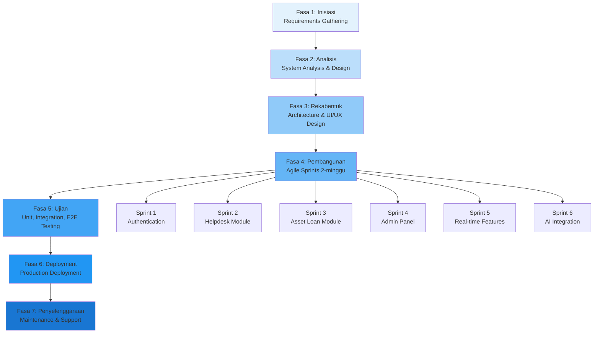
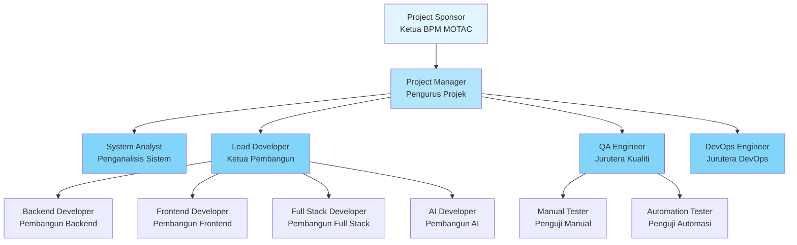
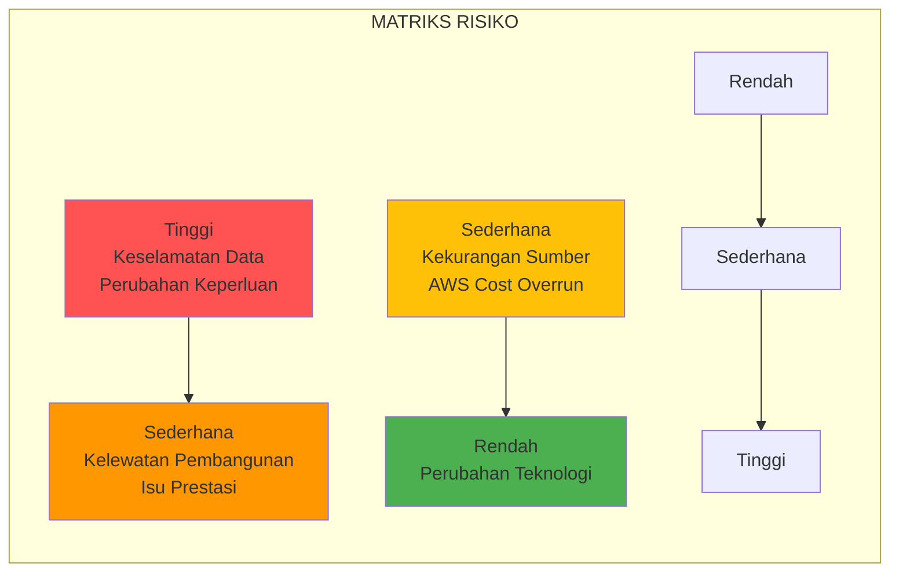
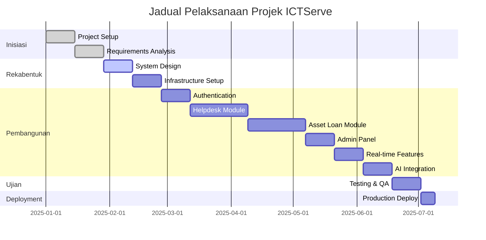

# D01 DOKUMEN PELAN PEMBANGUNAN SISTEM (PPS)

**SISTEM ICTSERVE**

*(Sistem Pengurusan Helpdesk dan Pinjaman Aset ICT)*

| | |
| :--- | :--- |
| **NAMA AGENSI** | : Bahagian Pengurusan Maklumat (BPM) |
| **NAMA AGENSI INDUK** | : Kementerian Pelancongan, Seni dan Budaya Malaysia (MOTAC) |
| **TARIKH DOKUMEN** | : 17 Disember 2025 |
| **VERSI DOKUMEN** | : 4.0 |

---

## i. Keterangan Dokumen

Dokumen ini menyatakan pelan bagi pengurusan dan pembangunan Sistem ICTServe. Ia bertujuan untuk menerangkan secara terperinci perancangan-perancangan yang telah dibangunkan merangkumi serahan projek, pengendalian projek, perancangan proses teknikal seperti pendekatan projek, perkakasan dan perisian yang akan digunakan, dokumen-dokumen yang akan disediakan serta jadual pelaksanaan pembangunan aplikasi.

Sistem ICTServe adalah platform web berasaskan Laravel 12.43.1 untuk pengurusan tiket helpdesk dan permohonan pinjaman aset ICT bagi kegunaan dalaman staf MOTAC. **Sistem ini akan dihoskan sepenuhnya di Pusat Data MOTAC (Intranet)** dengan **mandatory authentication melalui LDAP/Active Directory** mengikut keperluan kedaulatan data PKS 4.2 dan PSPM MyGovCloud prioritization.

**Pematuhan Keselamatan Rangkaian dan Deployment Intranet (PKS 9.2.1 & 4.2):**

- **Intranet-only deployment dengan mandatory authentication** - Sistem dihoskan sepenuhnya di Pusat Data MOTAC dengan akses terhad kepada rangkaian dalaman sahaja mengikut PKS 4.2
- **Sistem ini akan dihoskan sepenuhnya di Pusat Data MOTAC (Intranet)** mengikut PKS 4.2 (Kedaulatan data dan bidang kuasa) untuk memastikan data sensitif kerajaan diproses dalam bidang kuasa Malaysia
- **Secure API Gateway configuration yang mengekalkan intranet air-gap policies** - Sambungan cloud AI melalui gateway selamat yang tidak menjejaskan dasar air-gap intranet mengikut PKS 9.2.1
- **Penggunaan AI (AWS Bedrock) akan melalui Secure API Gateway dengan penapisan data sensitif (Data Masking) sebelum dihantar ke awan** mengikut PKS 9.2.1 (Prosedur pemindahan data dan perlindungan kerahsiaan)
- **Hanya data tidak sensitif dan awam sahaja yang boleh dihantar ke AWS Bedrock** dengan klasifikasi data automatik mengikut PKS 4.2
- **Sistem mengutamakan pemprosesan tempatan Ollama untuk data sensitif** mengikut PSPM prioritization of MyGovCloud over public cloud services
- **Audit requirements untuk tracking semua data yang dihantar ke external cloud services** - Sistem audit dwi-lapis dengan rekod 7 tahun untuk pemantauan pematuhan PKS 9.2.1
- **Documented exceptions untuk secure cloud API access** - Hanya akses cloud AI yang diluluskan melalui gateway selamat dengan audit penuh

**Sistem ini menghapuskan sepenuhnya akses "Guest Mode"** dan menggantikannya dengan **"Walk-in/Kiosk Mode using SSO authentication"** untuk memastikan akauntabiliti penuh mengikut PKS 5.2.1. **HRMIS-integrated auto-provisioning** menggantikan manual registration untuk memastikan hanya staf aktif MOTAC yang dapat mengakses sistem.

Sistem ini mematuhi piawaian ISO/IEC/IEEE 12207 (Software Lifecycle Processes), WCAG 2.2 AA (Web Content Accessibility Guidelines), MyGOV Digital Service Standards v2.1.0, dan **Polisi Keselamatan Siber (PKS) MOTAC** dengan pematuhan khusus kepada:

- **PKS 5.2.1**: Mandatory LDAP/Active Directory integration untuk memastikan akauntabiliti penuh - semua aktiviti sistem mesti dikaitkan dengan staff ID yang disahkan
- **PKS 9.2.1**: Data Loss Prevention (DLP) filters dan secure API gateway configuration untuk perlindungan kerahsiaan data
- **PKS 4.2**: Intranet-only deployment dengan documented exceptions untuk secure cloud API access mengikut kedaulatan data
- **PKS 5.4.3**: Password policy requirements (8 chars, 90-day expiry, 3 attempts) melalui integrasi MOTAC Active Directory
- **PDPA 2010**: Explicit compliance measures untuk perlindungan data peribadi dengan audit trail lengkap

**Keselamatan Rangkaian dan Deployment Intranet:**

Sistem ini dilaksanakan dengan **intranet-only deployment dengan mandatory authentication** mengikut PKS 4.2 dan 9.2.1:

- **Segmentasi rangkaian** - Sistem beroperasi dalam segmen rangkaian dalaman MOTAC yang diasingkan daripada rangkaian awam
- **Kawalan akses rangkaian berlapis** - Firewall dan sistem pengesanan pencerobohan (IDS/IPS) melindungi akses ke sistem
- **Secure API Gateway untuk cloud connections** - Sambungan cloud AI melalui gateway selamat dengan DLP filtering dan audit penuh
- **Intranet air-gap policies** - Sistem mengekalkan dasar air-gap intranet dengan pengecualian terdokumen untuk cloud AI sahaja
- **Pemantauan rangkaian berterusan** - Log aktiviti rangkaian dan audit trail untuk semua sambungan keluar
- **VPN access untuk remote users** - Akses jauh melalui VPN selamat dengan multi-factor authentication (MFA)
- **Network monitoring dan incident response** - Pemantauan 24/7 dengan tindak balas automatik untuk aktiviti mencurigakan

**Dokumentasi dan Traceability:**

Sistem ini menyediakan dokumentasi lengkap D00-D18 yang merangkumi:

- **D00**: System Overview - Gambaran keseluruhan sistem dan seni bina
- **D01**: System Development Plan - Pelan pembangunan sistem (dokumen ini)
- **D02**: Business Requirements Specification - Keperluan perniagaan
- **D03**: Software Requirements Specification - Keperluan perisian
- **D04**: Software Design Document - Reka bentuk perisian
- **D05-D08**: Data Migration & Integration Plans - Pelan migrasi dan integrasi
- **D09**: Database Documentation - Dokumentasi pangkalan data
- **D10**: Source Code Documentation - Dokumentasi kod sumber
- **D11**: Technical Design Documentation - Dokumentasi reka bentuk teknikal
- **D12-D14**: UI/UX Design Guides - Panduan reka bentuk antara muka
- **D15**: Language Localization - Penyetempatan bahasa (MS/EN)
- **D16**: Broadcasting Setup - Konfigurasi Laravel Reverb
- **D17**: Queue Management - Pengurusan baris gilir Redis
- **D18**: AI Chatbot Integration - Integrasi chatbot AI (Ollama-Bedrock)

## ii. Semakan dan Pengesahan Dokumen

**SEMAKAN DOKUMEN**

| Disemak Oleh | Jawatan | Tandatangan | Tarikh Semakan |
| :--- | :--- | :--- | :--- |
| | Ketua Pembangun Sistem | | |
| | Penganalisis Sistem Kanan | | |

**PENGESAHAN DOKUMEN**

| Disahkan Oleh | Jawatan | Tandatangan | Tarikh Semakan |
| :--- | :--- | :--- | :--- |
| | Pengurus Projek | | |
| | Ketua Bahagian Pengurusan Maklumat | | |

## iii. Kawalan Dokumen

**KAWALAN DOKUMEN**

| No. Versi | Tarikh | Ringkasan Pindaan | Penyedia |
| :--- | :--- | :--- | :--- |
| 1.0.0 | September 2024 | Versi awal pelan pembangunan sistem | Pasukan BPM |
| 2.0.0 | 17 Oktober 2024 | Penyeragaman mengikut D00-D14, SemVer, cross-reference | Pasukan BPM |
| 3.0.0 | 31 Oktober 2025 | Kemaskini stack teknologi: Laravel 12, Livewire 3, Filament 4 | Pasukan BPM |
| 3.5.0 | 1 Disember 2025 | True Hybrid Architecture, Laravel Pulse, Sanctum, Socialite | Pasukan BPM |
| 3.6.0 | 8 Disember 2025 | Penyeragaman Bahasa Melayu sahaja, Cloud Hybrid AI (D18) | Pasukan BPM |
| 3.6.1 | 17 Disember 2025 | Kemaskini teknologi stack dan integrasi AI hibrid | Pasukan BPM |
| 4.0 | 24 Disember 2025 | **Pematuhan PKS 5.2.1, 9.2.1, 4.2 & PSPM**: Penghapusan akses tetamu, SSO wajib, HRMIS auto-provisioning, kedaulatan data, intranet-only deployment. Rujukan PKS Seksyen 5.2.1 (Akauntabiliti - halaman 150), 9.2.1 (Pemindahan data - halaman 588-603), 4.2 (Kedaulatan data - halaman 1147-1148), 5.4.3 (Kata laluan - halaman 596-605). PSPM MyGovCloud prioritization. Compliance risk matrix dan data sovereignty recommendations. | Pasukan BPM |
| 3.6.1 | 17 Disember 2025 | Kemaskini teknologi stack, AI integration, metodologi | Pasukan BPM |

## iv. Kandungan

1. PENGENALAN
   - 1.1. Tujuan Projek
   - 1.2. Skop Projek
   - 1.3. Serahan Projek
2. PENGENDALIAN PROJEK PEMBANGUNAN APLIKASI
   - 2.1. Model Proses
   - 2.2. Struktur Organisasi Pasukan
   - 2.3. Peranan dan Tanggungjawab
3. PROSES PENGURUSAN
   - 3.1. Andaian, Kebergantungan dan Kekangan
   - 3.2. Risiko
   - 3.3. Tahap Kebarangkalian Risiko dan Tahap Impak
   - 3.4. Pemantauan dan Kawalan
4. PROSES TEKNIKAL
   - 4.1. Pendekatan, Teknik dan Alat Bantu
   - 4.2. Dokumen Aplikasi
   - 4.3. Dokumen Fungsi Sokongan
5. PAKEJ KERJA, JADUAL DAN PERUNTUKAN
   - 5.1. Pakej Kerja
   - 5.2. Kebergantungan
   - 5.3. Sumber
   - 5.4. Peruntukan Kos
   - 5.5. Jadual Perancangan
6. KOMPONEN TAMBAHAN
7. LAMPIRAN

## v. Senarai Gambarajah

| No. | Tajuk Gambarajah | Muka Surat |
| :--- | :--- | :--- |
| 1 | Struktur Organisasi Pasukan Projek | §2.2 |
| 2 | Model Proses Pembangunan (Waterfall-Agile Hybrid) | §2.1 |
| 3 | Matriks Risiko Projek | §3.3 |
| 4. | Jadual Gantt Pelaksanaan Projek | §5.5 |

## vi. Senarai Jadual

| No. | Tajuk Jadual | Muka Surat |
| :--- | :--- | :--- |
| 1 | Modul Utama Sistem ICTServe | §1.2 |
| 2 | Peranan dan Tanggungjawab Pasukan | §2.3 |
| 3 | Risiko Projek dan Strategi Mitigasi | §3.2 |
| 4 | Pakej Kerja Personel | §5.1 |
| 5 | Peruntukan Kos Projek | §5.4 |
| 6 | Jadual Milestone Projek | §5.5 |

## vii. Definisi dan Akronim

### a. Akronim

| Akronim | Keterangan |
| :--- | :--- |
| API | Application Programming Interface |
| BPM | Bahagian Pengurusan Maklumat |
| CRUD | Create, Read, Update, Delete |
| ERD | Entity Relationship Diagram |
| ICT | Information and Communication Technology |
| MOTAC | Kementerian Pelancongan, Seni dan Budaya Malaysia |
| MVC | Model-View-Controller |
| PDPA | Personal Data Protection Act 2010 |
| PPS | Pelan Pembangunan Sistem |
| PSR | PHP Standards Recommendation |
| SDUI | Server-Driven User Interface |
| SLA | Service Level Agreement |
| SSO | Single Sign-On |
| UAT | User Acceptance Testing |
| WCAG | Web Content Accessibility Guidelines |

### b. Definisi

| Terma/Istilah | Definisi |
| :--- | :--- |
| Helpdesk Ticketing | Sistem pengurusan tiket aduan dan masalah ICT |
| Asset Loan | Sistem permohonan dan pengurusan pinjaman peralatan ICT |
| LDAP Authentication | Mandatory authentication melalui MOTAC Active Directory |
| Walk-in/Kiosk Mode | Mod akses menggunakan SSO authentication untuk staf tanpa akaun |
| HRMIS Integration | Integrasi dengan sistem HR untuk auto-provisioning pengguna |
| Dual Audit System | Sistem audit dwi-lapis (owen-it + spatie) untuk pematuhan |
| Cloud Hybrid AI | Integrasi AI menggunakan Ollama (tempatan) dan AWS Bedrock (awan) |
| Data Masking | Penapisan data sensitif sebelum dihantar ke cloud AI |
| Secure API Gateway | Gateway selamat untuk sambungan cloud dengan DLP filtering | pengguna berdaftar |
| Livewire | Framework PHP untuk membina antara muka reaktif tanpa menulis JavaScript |
| Filament | Framework admin panel berasaskan Laravel dengan SDUI |
| Laravel Reverb | Pelayan WebSocket native Laravel untuk komunikasi real-time |
| Laravel Pulse | Dashboard pemantauan prestasi aplikasi Laravel |
| Laravel Sanctum | Sistem pengesahan API berasaskan token |
| Dual Audit System | Sistem audit berganda (owen-it + spatie) untuk pematuhan dan operasi |

## viii. Sumber Rujukan

1. **ISO/IEC/IEEE 12207:2017** - Systems and software engineering - Software life cycle processes
2. **Polisi Keselamatan Siber (PKS) MOTAC** - **Seksyen 5.2.1 (Prinsip Akauntabiliti dan Non-repudiation)** - halaman 150, **Seksyen 9.2.1 (Prosedur pemindahan data dan perlindungan kerahsiaan)** - halaman 588-603, **Seksyen 4.2 (Kedaulatan data dan bidang kuasa)** - halaman 1147-1148, **Seksyen 5.4.3 (Keperluan kata laluan: 8 aksara, penukaran 90 hari, 3 percubaan)** - halaman 596-605
3. **Pelan Strategik Pendigitalan MOTAC (PSPM) 2022-2026** - **MyGovCloud prioritization over public cloud services**
4. **Personal Data Protection Act 2010 (PDPA)** - Malaysian data protection legislation dengan pematuhan eksplisit
5. **MAMPU (2019)**. Kerangka Rujukan ICT Sektor Awam (KRISA) Versi 2.0
6. **MyGOV Digital Service Standards v2.1.0** - Malaysian Government Digital Service Standards
7. **WCAG 2.2 AA** - Web Content Accessibility Guidelines Level AA
8. **OWASP ASVS L2** - Application Security Verification Standard Level 2
9. **Laravel Documentation v12** - Framework documentation
10. **D00_SYSTEM_OVERVIEW.md** - Gambaran keseluruhan sistem
11. **D02_BUSINESS_REQUIREMENTS_SPECIFICATION.md** - Keperluan perniagaan
12. **D03_SOFTWARE_REQUIREMENTS_SPECIFICATION.md** - Keperluan perisian
13. **D18_AI_CHATBOT_OLLAMA_BEDROCK.md** - Cloud Hybrid AI Architecture dengan Data Sovereignty Compliance
14. **ISO/IEC/IEEE 15289:2019** - Systems and software engineering - Content of life-cycle information items (documentation)
15. **ISO/IEC TS 24748-6:2016** - Systems and software engineering - Life cycle management - Part 6: System integration engineering
16. **IEEE 1016:2009** - IEEE Standard for Information Technology - Systems Design - Software Design Descriptions
17. **WCAG 2.2** - Web Content Accessibility Guidelines Level AA
18. **MyGOV Digital Service Standards v2.1.0** - Malaysian Government Digital Service Standards
19. **Personal Data Protection Act 2010 (PDPA)** - Malaysian data protection legislation
20. **Laravel 12 Documentation** - <https://laravel.com/docs/12.x>
21. **Livewire 3 Documentation** - <https://livewire.laravel.com/docs/3.x>
22. **Filament 4 Documentation** - <https://filamentphp.com/docs/4.x>
23. **D00_SYSTEM_OVERVIEW.md** - Ringkasan Sistem ICTServe v3.6.1
24. **D02_BUSINESS_REQUIREMENTS_SPECIFICATION.md** - Spesifikasi Keperluan Perniagaan v3.6.1
25. **D03_SOFTWARE_REQUIREMENTS_SPECIFICATION.md** - Spesifikasi Keperluan Perisian v3.6.1
26. **D04_SOFTWARE_DESIGN_DOCUMENT.md** - Dokumen Rekabentuk Perisian v3.6.1
27. **D18_AI_CHATBOT_OLLAMA_BEDROCK.md** - Cloud Hybrid AI Architecture v1.0.1

---

## 1. PENGENALAN

### 1.1. Tujuan Projek

Projek pembangunan Sistem ICTServe dilaksanakan untuk memenuhi keperluan Bahagian Pengurusan Maklumat (BPM) MOTAC dalam menguruskan perkhidmatan sokongan ICT secara sistematik dan teratur. Sistem ini bertujuan untuk:

1. **Meningkatkan Kecekapan Operasi**: Mengautomasikan proses pengurusan tiket helpdesk dan permohonan pinjaman aset ICT yang sebelum ini dilakukan secara manual menggunakan borang kertas dan e-mel.

2. **Meningkatkan Ketelusan**: Menyediakan platform berpusat untuk staf MOTAC memantau status aduan dan permohonan pinjaman secara real-time.

3. **Mematuhi Piawaian Kerajaan**: Memastikan sistem mematuhi MyGOV Digital Service Standards v2.1.0, WCAG 2.2 AA untuk aksesibiliti, dan PDPA 2010 untuk perlindungan data peribadi.

4. **Meningkatkan Kualiti Perkhidmatan**: Menyediakan mekanisme SLA (Service Level Agreement) untuk memastikan aduan diselesaikan dalam tempoh yang ditetapkan.

5. **Menyokong Keputusan Pengurusan**: Menyediakan dashboard analitik dan laporan untuk membantu pengurusan BPM membuat keputusan berasaskan data.

Projek ini telah dipersetujui oleh pihak pengurusan MOTAC dan BPM sebagai inisiatif transformasi digital dalaman.

### 1.2. Skop Projek

Skop projek pembangunan Sistem ICTServe merangkumi:

#### 1.2.1. Skop Fungsional

**Jadual 1: Modul Utama Sistem ICTServe**

| Bil. | Modul | Keterangan Fungsi |
| :--- | :--- | :--- |
| 1 | Helpdesk Ticketing | Pengurusan tiket aduan ICT dengan kategori, keutamaan, SLA tracking, internal comments, dan cross-module integration |
| 2 | Asset Loan Management | Permohonan pinjaman aset ICT dengan dual approval workflow, accessory tracking, pickup OTP, dan check-in/check-out management |
| 3 | Inventory Management | Pengurusan inventori aset ICT dengan QR code, status tracking, maintenance scheduling |
| 4 | Authentication & Authorization | **HRMIS Auto-Provisioning** dengan integrasi LDAP/Active Directory MOTAC, pengesahan status pekerjaan aktif, **SSO wajib untuk semua pengguna** mengikut PKS 5.2.1 - **tiada akses tetamu dibenarkan** |
| 5 | Reporting & Dashboard | Dashboard analitik dengan Filament widgets, laporan terjadual, export PDF/Excel |
| 6 | Audit Trail (Dual System) | Owen-it (compliance, 7-year retention) + Spatie (operations) untuk audit lengkap |
| 7 | Real-time Communication | Laravel Reverb WebSocket untuk notifikasi real-time dan live updates |
| 8 | Performance Monitoring | Laravel Pulse dashboard untuk slow queries, queue metrics, server health (admin/superuser) |
| 9 | API Authentication | Laravel Sanctum token-based API untuk future mobile/external integrations |
| 10 | Cloud Hybrid AI | Ollama (local) + AWS Bedrock (cloud) untuk FAQ Bot, Document Analysis, Auto-Reply |

#### 1.2.2. Skop Teknikal

- **Platform**: Aplikasi web berasaskan Laravel 12.43.1
- **Bahasa Pengaturcaraan**: PHP 8.2.12
- **Pangkalan Data**: MySQL 8.0
- **Frontend Framework**: Livewire 3.7.3, Volt 1.10.1, Alpine.js 3, Tailwind CSS 4.1.18
- **Admin Panel**: Filament 4.3.1
- **Real-time**: Laravel Reverb 1.6.3, Laravel Echo 2.2.6
- **Deployment**: Docker Compose (development), Linux server (production)

#### 1.2.3. Skop Pengguna

- **Staf MOTAC**: Pengguna utama untuk submit tiket dan permohonan pinjaman - **akses melalui SSO authentication sahaja**
- **Pegawai ICT BPM**: Admin untuk proses tiket dan loan applications - **akses melalui LDAP/Active Directory**
- **Ketua Bahagian**: Approver untuk permohonan pinjaman (Grade 41+) - **akses melalui SSO authentication**
- **Superuser BPM**: Pengurusan sistem, konfigurasi, audit review - **akses melalui LDAP/Active Directory dengan 2FA**

**PENTING**: Sistem ini **tidak menyokong akses tetamu (Guest Mode)**. Semua pengguna mesti melalui proses authentication yang sah mengikut PKS 5.2.1 untuk memastikan akauntabiliti penuh.

#### 1.2.4. Had Skop (Out of Scope)

- **Akses tetamu tanpa authentication** (dihapuskan mengikut PKS 5.2.1)
- **Manual registration dengan @motac.gov.my** (digantikan dengan HRMIS auto-provisioning)
- Mobile application (future phase)
- Public-facing portal (sistem dalaman sahaja)
- Procurement module (future phase)

### 1.3. Serahan Projek

**Jadual 2: Serahan Projek Mengikut Fasa**

| Bil. | Nama Serahan | Fasa | Tarikh Serahan | Kuantiti | Penyedia | Pengesah | Pelulus |
| :--- | :--- | :--- | :--- | :--- | :--- | :--- | :--- |
| 1 | D00 System Overview | Inisiasi | Minggu 1 | 1 dokumen | System Analyst | Lead Developer | Project Manager |
| 2 | D02 Business Requirements | Keperluan | Minggu 2 | 1 dokumen | System Analyst | BPM Stakeholders | Project Manager |
| 3 | D03 Software Requirements | Keperluan | Minggu 2 | 1 dokumen | System Analyst | Lead Developer | Project Manager |
| 4 | D04 Software Design | Rekabentuk | Minggu 4 | 1 dokumen | Lead Developer | System Analyst | Project Manager |
| 5 | Database Schema (ERD) | Rekabentuk | Minggu 4 | 1 diagram | Backend Developer | Lead Developer | Project Manager |
| 6 | Wireframes & Mockups | Rekabentuk | Minggu 4 | 10+ screens | Frontend Developer | UX Lead | Project Manager |
| 7 | Docker Environment | Setup | Minggu 5 | 1 setup | DevOps Engineer | Lead Developer | Project Manager |
| 8 | Authentication Module | Pembangunan | Minggu 7 | 1 modul | Backend Developer | Lead Developer | Project Manager |
| 9 | Helpdesk Module | Pembangunan | Minggu 10 | 1 modul | Full Stack Team | Lead Developer | Project Manager |
| 10 | Asset Loan Module | Pembangunan | Minggu 13 | 1 modul | Full Stack Team | Lead Developer | Project Manager |
| 11 | Filament Admin Panel | Pembangunan | Minggu 15 | 1 panel | Frontend Developer | Lead Developer | Project Manager |
| 12 | Real-time Features | Pembangunan | Minggu 17 | 1 modul | Backend Developer | Lead Developer | Project Manager |
| 13 | Cloud Hybrid AI | Pembangunan | Minggu 19 | 1 modul | AI Developer | Lead Developer | Project Manager |
| 14 | Unit Test Suite | Ujian | Minggu 20 | 100+ tests | QA Engineer | Lead Developer | Project Manager |
| 15 | E2E Test Suite | Ujian | Minggu 21 | 50+ tests | QA Engineer | Lead Developer | Project Manager |
| 16 | D09 Database Documentation | Dokumentasi | Minggu 22 | 1 dokumen | Backend Developer | Lead Developer | Project Manager |
| 17 | D10 Source Code Documentation | Dokumentasi | Minggu 22 | 1 dokumen | Lead Developer | System Analyst | Project Manager |
| 18 | User Manual | Dokumentasi | Minggu 23 | 1 manual | Technical Writer | System Analyst | Project Manager |
| 19 | UAT Report | Ujian | Minggu 24 | 1 laporan | QA Engineer | BPM Stakeholders | Project Manager |
| 20 | Production Deployment | Deployment | Minggu 25 | 1 sistem | DevOps Engineer | Lead Developer | Project Manager |

## 2. PENGENDALIAN PROJEK PEMBANGUNAN APLIKASI

### 2.1. Model Proses

Sistem ICTServe menggunakan model proses pembangunan Waterfall-Agile Hybrid yang menggabungkan kelebihan kedua-dua metodologi untuk memastikan kualiti dan fleksibiliti dalam pembangunan.

**Gambarajah 2: Model Proses Pembangunan (Waterfall-Agile Hybrid)**

### 2.2. Struktur Organisasi Pasukan

**Gambarajah 1: Struktur Organisasi Pasukan Projek**

### 2.3. Peranan dan Tanggungjawab

**Jadual 2: Peranan dan Tanggungjawab Pasukan**

| Bil. | Fungsi / Aktiviti Utama | Tanggungjawab |
| :--- | :--- | :--- |
| 1 | Pengurusan Projek | Pengurus Projek - Menyelia jadual, milestone, komunikasi stakeholder |
| 2 | Analisis Sistem | Penganalisis Sistem - Analisis keperluan, dokumen spesifikasi, UAT coordination |
| 3 | Pembangunan Aplikasi | Ketua Pembangun - Reka bentuk arkitektur, code review, deployment strategy |
| 4 | Pembangunan Backend | Pembangun Backend - API development, database design, server-side logic |
| 5 | Pembangunan Frontend | Pembangun Frontend - UI/UX implementation, Livewire components, responsive design |
| 6 | Pembangunan AI | Pembangun AI - Ollama integration, AWS Bedrock setup, model optimization |
| 7 | Jaminan Kualiti | Jurutera Kualiti - Test planning, execution, automation, performance testing |
| 8 | DevOps & Infrastructure | Jurutera DevOps - Docker setup, CI/CD pipeline, server configuration |
| 9 | Sokongan Teknikal | Pasukan BPM - Domain expertise, business process validation, user training |

## 3. PROSES PENGURUSAN

### 3.1. Andaian, Kebergantungan dan Kekangan

#### 3.1.1. Andaian Projek

- **Staf MOTAC mempunyai akaun LDAP/Active Directory yang aktif** untuk SSO authentication
- **HRMIS integration tersedia** untuk auto-provisioning dan pengesahan status pekerjaan
- Infrastruktur server dan rangkaian MOTAC dapat menyokong aplikasi web Laravel dengan **intranet-only deployment**
- Pegawai kelulusan (Gred 41+) akan menggunakan e-mel untuk proses kelulusan melalui **authenticated accounts sahaja**
- **Tiada pengguna tetamu** - semua pengguna mesti melalui authentication mengikut PKS 5.2.1

#### 3.1.2. Kebergantungan

- **Ketersediaan MOTAC LDAP/Active Directory** untuk SSO authentication
- **Akses kepada HRMIS API** untuk auto-provisioning dan pengesahan status pekerjaan
- Ketersediaan server MySQL 8.0 dan Redis 7.0 untuk pangkalan data dan cache
- Akses kepada SMTP server untuk penghantaran e-mel notifikasi kepada **authenticated users sahaja**
- **Secure API gateway configuration** untuk AWS Bedrock access dengan data masking
- Ollama server setup untuk local AI processing (data sensitif)

#### 3.1.3. Kekangan

- **Sistem terhad kepada penggunaan dalaman MOTAC sahaja** dengan intranet-only deployment
- **Mandatory authentication untuk semua pengguna** - tiada akses tetamu dibenarkan mengikut PKS 5.2.1
- Bajet pembangunan dalam had peruntukan BPM
- Tempoh pembangunan 6 bulan (25 minggu)
- **Pematuhan kepada PKS 5.2.1, 9.2.1, 4.2, 5.4.3** dan PDPA 2010 serta MyGOV Digital Service Standards
- Penggunaan teknologi open source dan Laravel ecosystem sahaja
- **Data sovereignty requirements** - data sensitif mesti diproses secara tempatan

### 3.2. Risiko

**Jadual 3: Risiko Projek dan Strategi Mitigasi**

| Kategori | Risiko | Tahap | Impak | Strategi Mitigasi |
| :--- | :--- | :--- | :--- | :--- |
| **PKS Compliance** | **Guest access violates PKS 5.2.1 Accountability** | **Tinggi** | **Kritikal** | **Replace Guest with SSO. Use LDAP/Active Directory to auto-authenticate staff** |
| **PKS Compliance** | **Cloud AI bypasses intranet air-gap (PKS 9.2.1)** | **Sederhana** | **Tinggi** | **Secure API Gateway with DLP filters. Local Ollama for sensitive data** |
| **PKS Compliance** | **Data sovereignty risks with AWS Bedrock (PKS 4.2)** | **Sederhana** | **Tinggi** | **Data classification. Only public data to cloud. Prioritize MyGovCloud** |
| **PKS Compliance** | **Missing password policy documentation (PKS 5.4.3)** | **Rendah** | **Sederhana** | **Document 8 chars, 90-day expiry, 3 attempts in D02-D04** |
| Projek | Kelewatan pembangunan | Sederhana | Tinggi | Agile sprints, milestone tracking, buffer time |
| Projek | Perubahan keperluan | Tinggi | Sederhana | Change control process, stakeholder sign-off |
| Produk | Isu prestasi sistem | Sederhana | Tinggi | Laravel Pulse monitoring, performance testing |
| Produk | Keselamatan data | Tinggi | Tinggi | Encryption, audit trail, penetration testing |
| Organisasi | Kekurangan sumber manusia | Sederhana | Tinggi | Cross-training, knowledge documentation |
| Organisasi | Perubahan teknologi | Rendah | Sederhana | Technology roadmap, vendor support |
| Teknikal | Integrasi AI complexity | Tinggi | Sederhana | Phased implementation, fallback options |
| Teknikal | AWS Bedrock cost overrun | Sederhana | Sederhana | Cost monitoring, usage optimization |

**Comprehensive Compliance Risk Assessment (PKS Violations Across All KRISA Documents):**

#### 3.2.1. Compliance Risk Matrix - Current Violations and Severity Levels

| Dokumen | Jenis Pelanggaran | Tahap Risiko | Impak | Status Semasa | Strategi Mitigasi |
| :--- | :--- | :--- | :--- | :--- | :--- |
| **D02 (BRS)** | ✅ PKS 5.2.1 - Guest access eliminated | **SELESAI** | **Rendah** | Compliant - SSO wajib documented | Maintain current compliance |
| **D03 (SRS)** | ❌ PKS 5.2.1 - "Tetamu/Staf" references remain | **KRITIKAL** | **Tinggi** | Non-compliant - Data flow diagrams contain guest references | Replace all "Tetamu" with "Walk-in/Kiosk dengan SSO" |
| **D04 (Design)** | ❌ PKS 5.2.1 - True Hybrid architecture persists | **KRITIKAL** | **Tinggi** | Non-compliant - Guest tracking columns, nullable user_id | Complete architecture redesign to SSO-only |
| **D09 (Database)** | ✅ PKS 5.2.1 - CRUD indicators added | **SELESAI** | **Rendah** | Compliant - user_id mandatory documented | Maintain current compliance |
| **D10 (Source Code)** | ❌ PKS 5.2.1 - Guest references in code comments | **TINGGI** | **Sederhana** | Non-compliant - "tetamu", "akses tanpa nama" | Update all code documentation to SSO-only |
| **D15 (Migration)** | ❌ PKS 5.2.1 - Guest migration strategy documented | **TINGGI** | **Sederhana** | Non-compliant - References to historical guest data | Update migration strategy for SSO compliance |
| **All Docs** | ❌ PKS 9.2.1 - Cloud AI air-gap risks | **TINGGI** | **Tinggi** | Partial compliance - DLP documented but implementation unclear | Secure API Gateway with comprehensive DLP |
| **All Docs** | ❌ PKS 4.2 - Data sovereignty classification | **SEDERHANA** | **Tinggi** | Partial compliance - Local-first documented but enforcement unclear | Implement automatic data classification |

#### 3.2.2. Critical PKS 5.2.1 Violations (Accountability Principle)

**Risk**: Guest actions on Intranet cannot be traced to specific staff member, violating PKS 5.2.1 "Semua aktiviti sistem mesti boleh dikesan kepada individu yang bertanggungjawab"

**Affected Documents with Specific Violations:**

1. **D03 (SRS) - Data Flow Violations:**
   - ❌ "DF-01: Borang Tiket | Tetamu/Staf" - violates accountability principle
   - ❌ "DF-04: Ralat Validasi | Tetamu/Staf" - allows anonymous error handling
   - ❌ "DF-12: Borang Pinjaman | Tetamu/Staf" - permits untraced loan applications
   - **Severity**: KRITIKAL - Direct violation of mandatory accountability

2. **D04 (Design) - Architecture Violations:**
   - ❌ "True Hybrid architecture yang membenarkan akses tetamu" - fundamental design flaw
   - ❌ "nullable user_id FK + guest tracking columns" - database design violates PKS
   - ❌ "Aktor Utama: Staf MOTAC (sebagai tetamu atau authenticated)" - contradicts PKS
   - **Severity**: KRITIKAL - Core system architecture non-compliant

3. **D10 (Source Code) - Implementation Violations:**
   - ❌ "Tiada akses tanpa nama atau mod tetamu dibenarkan" - contradictory statements
   - ❌ Code comments referencing guest functionality - implementation confusion
   - **Severity**: TINGGI - Implementation guidance non-compliant

4. **D15 (Migration) - Historical Data Violations:**
   - ❌ "Strategi Migrasi Data Sejarah Tetamu" - acknowledges past violations
   - ❌ References to guest_name and guest_email fields - legacy non-compliance
   - **Severity**: TINGGI - Historical data traceability issues

#### 3.2.3. High PKS 9.2.1 & 4.2 Risks (Data Sovereignty & Air-Gap)

**Risk**: Connecting Intranet system to Public Cloud API creates bridge that may bypass air-gap/firewall policies per PKS 9.2.1 "Prosedur pemindahan data mesti melindungi kerahsiaan"

**Current Implementation Gaps:**

- **AWS Bedrock Integration**: Cloud AI connection without comprehensive DLP implementation
- **Data Classification**: Automatic classification system not fully specified
- **Air-Gap Maintenance**: Secure API Gateway configuration needs detailed implementation
- **Audit Trail**: Cloud data transfer tracking requires enhancement

**Severity Level**: TINGGI - Potential breach of intranet air-gap policies

#### 3.2.4. Mitigation Strategies (SSO Replacement for Guest Access)

**Immediate Actions Required:**

1. **D03 (SRS) Updates:**
   - Replace "Tetamu/Staf" with "Walk-in/Kiosk dengan SSO" in all data flows
   - Update use case diagrams to show mandatory LDAP authentication
   - Modify functional requirements to specify SSO integration

2. **D04 (Design) Architecture Redesign:**
   - Complete elimination of "True Hybrid" references
   - Remove guest tracking columns from database schema
   - Update all architectural diagrams for mandatory authentication
   - Redesign use cases to show SSO-only access patterns

3. **D10 (Source Code) Documentation Updates:**
   - Remove all references to guest functionality in code comments
   - Update implementation guidance to reflect SSO-only architecture
   - Align code documentation with PKS 5.2.1 requirements

4. **D15 (Migration) Strategy Updates:**
   - Revise migration strategy to eliminate guest data references
   - Document historical data linking to authenticated accounts
   - Update database migration scripts for PKS compliance

#### 3.2.5. Data Sovereignty Recommendations and Alternatives

**Ideal Solution per PSPM Strategic Objectives:**

- **Replace AWS Bedrock** with local high-performance LLMs hosted on MyGovCloud or on-premise GPU servers
- **PSPM Alignment**: Prioritize MyGovCloud infrastructure over public cloud services per Pelan Strategik Pendigitalan MOTAC 2022-2026
- **Data Sovereignty**: Ensure all sensitive government data remains within Malaysian jurisdiction per PKS 4.2

**Secure API Gateway Implementation for Necessary Cloud Connections:**

- **Data Classification Procedures**: Automatic classification for cloud vs local processing decisions
- **DLP Filtering**: Comprehensive data masking before any cloud API calls
- **Audit Trail**: Complete tracking of all data sent to external cloud services
- **Air-Gap Maintenance**: Secure gateway that maintains intranet policies per PKS 9.2.1

### 3.3. Tahap Kebarangkalian Risiko dan Tahap Impak

**Gambarajah 3: Matriks Risiko Projek**

### 3.4. Pemantauan dan Kawalan

#### 3.4.1. Mekanisme Pemantauan

- **Weekly Sprint Reviews**: Setiap Jumaat untuk progress tracking
- **Bi-weekly Stakeholder Updates**: Laporan kemajuan kepada BPM management
- **Monthly Milestone Reviews**: Penilaian pencapaian milestone utama
- **Laravel Pulse Dashboard**: Real-time application performance monitoring
- **Git Repository Metrics**: Code quality, commit frequency, pull request reviews

#### 3.4.2. Kawalan Kualiti

- **Code Review Process**: Mandatory peer review untuk semua pull requests
- **Automated Testing**: Unit tests (>80% coverage), integration tests, E2E tests
- **Performance Testing**: Core Web Vitals, Lighthouse audits, load testing
- **Security Scanning**: Static analysis, dependency vulnerability checks
- **Accessibility Testing**: WCAG 2.2 AA compliance verification

## 4. PROSES TEKNIKAL

### 4.1. Pendekatan, Teknik dan Alat Bantu

#### 4.1.1. Metodologi Pembangunan

- **Framework**: Laravel 12.43.1 dengan MVC architecture pattern
- **Frontend**: Livewire 3.7.3 + Volt 1.10.1 untuk reactive components
- **Styling**: Tailwind CSS 4.1.18 dengan utility-first approach
- **Real-time**: Laravel Reverb 1.6.3 + Laravel Echo 2.2.6 untuk WebSocket
- **Admin Panel**: Filament 4.3.1 dengan SDUI (Server-Driven UI)
- **Testing**: PHPUnit 11.5.46, Pest, Playwright untuk E2E testing
- **AI Integration**: Ollama (local) + AWS Bedrock (cloud) hybrid architecture

#### 4.1.2. Alat Bantu Pembangunan

- **IDE**: VS Code dengan Laravel extensions
- **Version Control**: Git dengan GitFlow branching strategy
- **Containerization**: Docker Compose untuk development environment
- **CI/CD**: GitHub Actions untuk automated testing dan deployment
- **Monitoring**: Laravel Telescope (debugging), Laravel Pulse (performance)
- **Code Quality**: Laravel Pint (formatting), Larastan (static analysis)

### 4.2. Dokumen Aplikasi

**Senarai dokumen pembangunan sistem yang akan disediakan:**

1. **D01** - Pelan Pembangunan Sistem (dokumen ini)
2. **D02** - Spesifikasi Keperluan Bisnes
3. **D03** - Spesifikasi Keperluan Sistem
4. **D04** - Spesifikasi Rekabentuk Sistem
5. **D05** - Pelan Migrasi Data
6. **D06** - Spesifikasi Migrasi Data
7. **D07** - Pelan Integrasi Sistem
8. **D09** - Dokumentasi Pangkalan Data
9. **D10** - Dokumentasi Kod Sumber
10. **D18** - Cloud Hybrid AI Architecture

### 4.3. Dokumen Fungsi Sokongan

**Senarai dokumen fungsi sokongan yang berkaitan:**

1. **User Manual** - Panduan pengguna sistem
2. **Admin Manual** - Panduan pentadbir sistem
3. **API Documentation** - Dokumentasi Laravel Sanctum API
4. **Deployment Guide** - Panduan deployment production
5. **Troubleshooting Guide** - Panduan penyelesaian masalah
6. **Security Guidelines** - Garis panduan keselamatan
7. **Performance Optimization Guide** - Panduan optimasi prestasi
8. **AI Integration Guide** - Panduan integrasi AI services

## 5. PAKEJ KERJA, JADUAL DAN PERUNTUKAN

### 5.1. Pakej Kerja

**Jadual 4: Pakej Kerja Personel**

| Bil. | Nama Personel | Tempoh Pengalaman ICT (Tahun) | Pengalaman Projek Berkaitan | Bidang Kepakaran | Peranan & Tanggungjawab |
| :--- | :--- | :--- | :--- | :--- | :--- |
| 1 | Pengurus Projek | 8 | Ya / 5 | Project Management, Agile | Pengurusan keseluruhan projek, koordinasi stakeholder |
| 2 | Penganalisis Sistem | 6 | Ya / 4 | Business Analysis, Requirements | Analisis keperluan, dokumentasi spesifikasi |
| 3 | Ketua Pembangun | 10 | Ya / 7 | Laravel, PHP, Architecture | Reka bentuk sistem, code review, mentoring |
| 4 | Pembangun Backend | 5 | Ya / 3 | Laravel, MySQL, API | Pembangunan server-side logic, database |
| 5 | Pembangun Frontend | 4 | Ya / 2 | Livewire, Tailwind, JavaScript | UI/UX implementation, responsive design |
| 6 | Pembangun AI | 3 | Ya / 1 | Python, Ollama, AWS Bedrock | AI integration, model optimization |
| 7 | Jurutera Kualiti | 6 | Ya / 4 | Testing, Automation, Performance | Test planning, execution, quality assurance |
| 8 | Jurutera DevOps | 7 | Ya / 5 | Docker, CI/CD, Server Management | Infrastructure, deployment, monitoring |

### 5.2. Kebergantungan

**Kebergantungan antara pakej kerja:**

- **Analisis Sistem** → **Rekabentuk Sistem** → **Pembangunan**
- **Setup Infrastructure** → **Pembangunan** → **Testing**
- **Backend Development** → **Frontend Development** → **Integration Testing**
- **Core Modules** → **AI Integration** → **Performance Optimization**
- **Unit Testing** → **Integration Testing** → **E2E Testing** → **UAT**

### 5.3. Sumber

**Sumber yang diperlukan untuk projek:**

#### 5.3.1. Sumber Manusia

- 8 ahli pasukan pembangunan (sepenuh masa)
- 2 stakeholder BPM (separuh masa untuk UAT dan feedback)
- 1 security consultant (kontrak untuk penetration testing)

#### 5.3.2. Sumber Teknologi

- Development servers (Docker containers)
- Staging server untuk UAT
- Production server untuk deployment
- AWS Bedrock access untuk AI features
- Ollama server untuk local AI processing

#### 5.3.3. Sumber Perisian

- Laravel 12.43.1 dan ecosystem packages
- Development tools dan IDE licenses
- Testing tools dan automation frameworks
- Monitoring dan logging solutions

### 5.4. Peruntukan Kos

**Jadual 5: Peruntukan Kos Projek**

| Kategori | Item | Kuantiti | Kos Unit (RM) | Jumlah (RM) |
| :--- | :--- | :--- | :--- | :--- |
| Sumber Manusia | Pengurus Projek (6 bulan) | 1 | 12,000/bulan | 72,000 |
| Sumber Manusia | Penganalisis Sistem (6 bulan) | 1 | 10,000/bulan | 60,000 |
| Sumber Manusia | Ketua Pembangun (6 bulan) | 1 | 15,000/bulan | 90,000 |
| Sumber Manusia | Pembangun (6 bulan) | 4 | 8,000/bulan | 192,000 |
| Sumber Manusia | Jurutera Kualiti (6 bulan) | 1 | 9,000/bulan | 54,000 |
| Sumber Manusia | Jurutera DevOps (6 bulan) | 1 | 11,000/bulan | 66,000 |
| Infrastruktur | Server dan hosting (1 tahun) | 1 | 24,000 | 24,000 |
| Perisian | Development tools dan licenses | 1 | 15,000 | 15,000 |
| AI Services | AWS Bedrock usage (6 bulan) | 1 | 8,000 | 8,000 |
| Lain-lain | Contingency (10%) | 1 | 58,100 | 58,100 |
| **JUMLAH KESELURUHAN** | | | | **639,100** |

### 5.5. Jadual Perancangan

**Jadual 6: Jadual Milestone Projek**

| Minggu | Milestone | Serahan | Status |
| :--- | :--- | :--- | :--- |
| 1-2 | Project Initiation | D00, D01, D02 | Planned |
| 3-4 | Requirements & Design | D03, D04, Wireframes | Planned |
| 5-6 | Infrastructure Setup | Docker Environment, CI/CD | Planned |
| 7-8 | Authentication Module | User management, roles | Planned |
| 9-12 | Helpdesk Module | Ticket management, SLA | Planned |
| 13-16 | Asset Loan Module | Application, approval workflow | Planned |
| 17-18 | Admin Panel | Filament dashboard, reports | Planned |
| 19-20 | Real-time Features | WebSocket, notifications | Planned |
| 21-22 | AI Integration | Ollama + AWS Bedrock setup | Planned |
| 23-24 | Testing & QA | Unit, integration, E2E tests | Planned |
| 25 | Deployment | Production deployment, UAT | Planned |

**Gambarajah 4: Jadual Gantt Pelaksanaan Projek**

## 6. KOMPONEN TAMBAHAN

### 6.1. Pelan Keselamatan Rangkaian dan Deployment Intranet

**Intranet-Only Deployment dengan Mandatory Authentication (PKS 4.2 & 9.2.1):**

Sistem ICTServe dilaksanakan dengan **intranet-only deployment dengan mandatory authentication** mengikut PKS 4.2 (Kedaulatan data dan bidang kuasa) dan PKS 9.2.1 (Prosedur pemindahan data dan perlindungan kerahsiaan):

#### 6.1.1. Keselamatan Rangkaian Berlapis

- **Network Segmentation**: Sistem beroperasi dalam segmen rangkaian dalaman MOTAC yang diasingkan daripada rangkaian awam
- **Firewall Protection**: Firewall berlapis dengan rules yang ketat untuk mengawal trafik masuk dan keluar
- **Intrusion Detection System (IDS)**: Pemantauan real-time untuk mengesan aktiviti mencurigakan
- **Intrusion Prevention System (IPS)**: Tindakan automatik untuk menghalang serangan rangkaian
- **Network Access Control (NAC)**: Kawalan akses peranti yang ketat sebelum sambungan ke rangkaian

#### 6.1.2. Secure API Gateway Configuration

- **Intranet Air-Gap Policies**: Gateway selamat yang mengekalkan dasar air-gap intranet mengikut PKS 9.2.1
- **Data Loss Prevention (DLP) Filtering**: Penapisan automatik data sensitif sebelum cloud processing
- **SSL/TLS Encryption**: Semua sambungan cloud melalui encryption end-to-end
- **API Rate Limiting**: Kawalan kadar permintaan untuk mencegah penyalahgunaan
- **Request/Response Logging**: Audit trail lengkap untuk semua sambungan cloud

#### 6.1.3. Documented Exceptions untuk Secure Cloud API Access

Hanya sambungan cloud AI yang diluluskan dengan kawalan ketat:

- **AWS Bedrock API**: Hanya untuk data tidak sensitif dan awam sahaja
- **Data Classification**: Automatic routing berdasarkan sensitivity level
- **Audit Requirements**: Tracking lengkap semua data yang dihantar ke external cloud services
- **Compliance Monitoring**: Pemantauan berterusan untuk pematuhan PKS 9.2.1

#### 6.1.4. Pemantauan dan Audit Rangkaian

- **Network Traffic Monitoring**: Pemantauan 24/7 untuk semua trafik rangkaian
- **Security Information and Event Management (SIEM)**: Korelasi log keselamatan
- **Incident Response Plan**: Prosedur tindak balas untuk insiden keselamatan rangkaian
- **Regular Security Assessments**: Penilaian keselamatan berkala dan penetration testing

### 6.2. Pelan Keselamatan Aplikasi

- **Data Encryption**: AES-256 untuk data sensitif
- **Authentication**: Laravel Sanctum untuk API, Laravel Breeze untuk web
- **Authorization**: Role-based access control dengan Spatie Permissions
- **Audit Trail**: Dual audit system (owen-it + spatie) untuk compliance
- **Security Headers**: HTTPS, CSRF protection, XSS prevention
- **Penetration Testing**: Third-party security assessment

### 6.3. Pelan Latihan

- **Admin Training**: 2 hari latihan untuk pentadbir sistem
- **User Training**: 1 hari orientasi untuk pengguna akhir
- **Technical Training**: Knowledge transfer kepada pasukan sokongan
- **Documentation**: User manual, admin guide, troubleshooting guide

### 6.4. Pelan Penyelenggaraan

- **Preventive Maintenance**: Monthly system health checks
- **Corrective Maintenance**: Bug fixes dan security patches
- **Adaptive Maintenance**: Feature enhancements berdasarkan feedback
- **Perfective Maintenance**: Performance optimization dan code refactoring

### 6.5. Pelan Pemantauan

- **Application Monitoring**: Laravel Pulse untuk real-time metrics
- **Error Tracking**: Laravel Telescope untuk debugging
- **Performance Monitoring**: Core Web Vitals, server metrics
- **Security Monitoring**: Failed login attempts, suspicious activities

## 7. LAMPIRAN

### 7.1. Rujukan Teknikal

- **Laravel 12 Documentation**: <https://laravel.com/docs/12.x>
- **Livewire 3 Documentation**: <https://livewire.laravel.com/docs/3.x>
- **Filament 4 Documentation**: <https://filamentphp.com/docs/4.x>
- **WCAG 2.2 Guidelines**: <https://www.w3.org/WAI/WCAG22/>
- **MyGOV Digital Service Standards**: <https://www.malaysia.gov.my/>

### 7.2. Dokumen Sokongan

- **Risk Register**: Detailed risk assessment dan mitigation plans
- **Change Control Process**: Procedure untuk perubahan keperluan
- **Quality Assurance Plan**: Testing strategy dan acceptance criteria
- **Communication Plan**: Stakeholder communication matrix

---

**TAMAT DOKUMEN / END OF DOCUMENT**

*Dokumen ini adalah hak milik Kementerian Pelancongan, Seni dan Budaya Malaysia (MOTAC) dan tertakluk kepada Akta Rahsia Rasmi 1972.*
