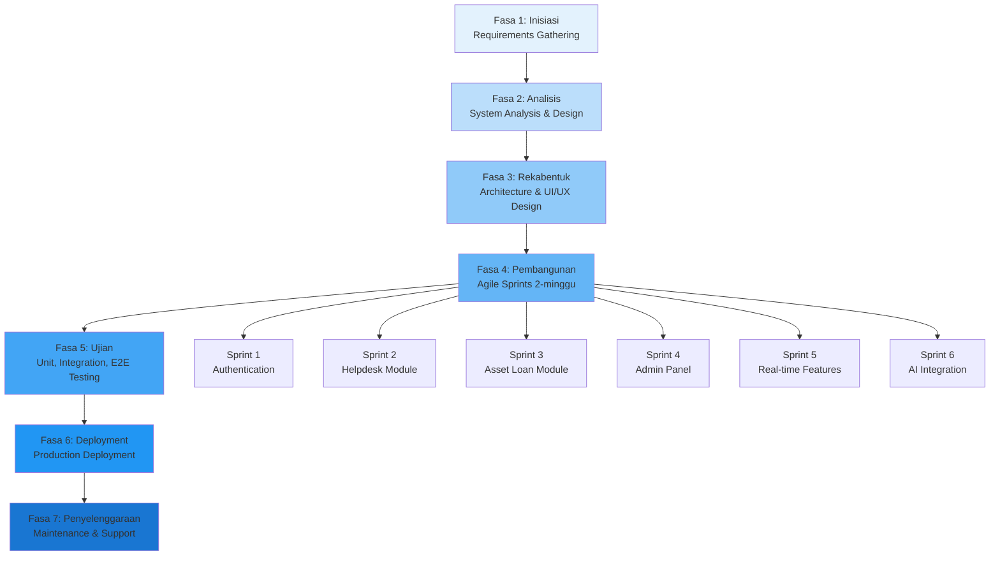
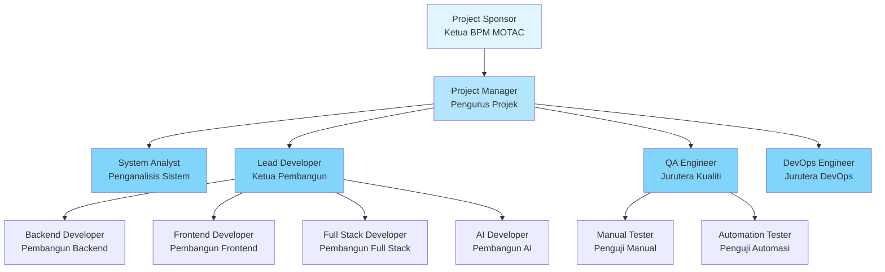
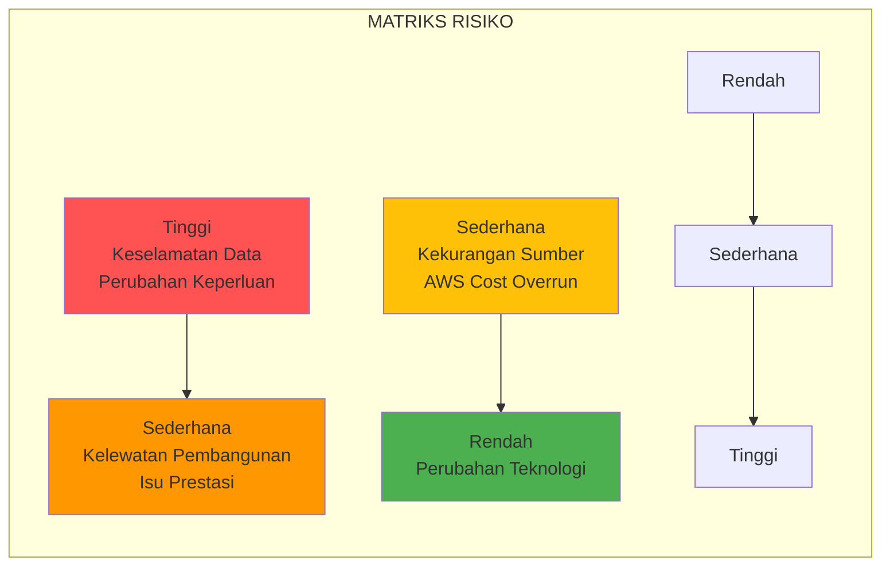
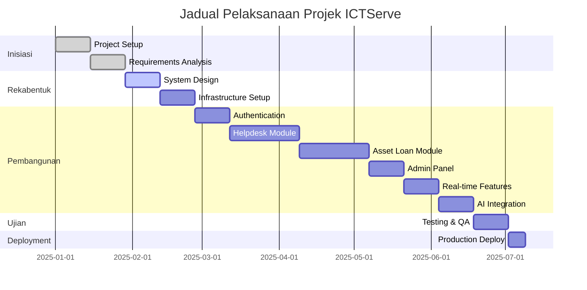

# D01 DOKUMEN PELAN PEMBANGUNAN SISTEM (PPS)

**SISTEM ICTSERVE**  
*(Sistem Pengurusan Helpdesk dan Pinjaman Aset ICT)*

| | |
| :--- | :--- |
| **NAMA AGENSI** | : Bahagian Pengurusan Maklumat (BPM) |
| **NAMA AGENSI INDUK** | : Kementerian Pelancongan, Seni dan Budaya Malaysia (MOTAC) |
| **TARIKH DOKUMEN** | : 24 Disember 2025 |
| **VERSI DOKUMEN** | : 4.0 |

---

## i. Keterangan Dokumen

Dokumen ini menyatakan pelan bagi pengurusan dan pembangunan Sistem ICTServe. Ia bertujuan untuk menerangkan secara terperinci perancangan-perancangan yang telah dibangunkan merangkumi serahan projek, pengendalian projek, perancangan proses teknikal seperti pendekatan projek, perkakasan dan perisian yang akan digunakan, dokumen-dokumen yang akan disediakan serta jadual pelaksanaan pembangunan aplikasi.

## ii. Semakan dan Pengesahan Dokumen

**SEMAKAN DOKUMEN**

| Disemak Oleh | Jawatan | Tandatangan | Tarikh Semakan |
| :--- | :--- | :--- | :--- |
| | Ketua Pembangun Sistem | | |
| | Penganalisis Sistem Kanan | | |

**PENGESAHAN DOKUMEN**

| Disahkan Oleh | Jawatan | Tandatangan | Tarikh Semakan |
| :--- | :--- | :--- | :--- |
| | Pengurus Projek | | |
| | Ketua Bahagian Pengurusan Maklumat | | |

## iii. Kawalan Dokumen

**KAWALAN DOKUMEN**

| No. Versi | Tarikh | Ringkasan Pindaan | Penyedia |
| :--- | :--- | :--- | :--- |
| 1.0 | September 2024 | Versi awal pelan pembangunan sistem | Pasukan BPM |
| 2.0 | Oktober 2024 | Kemaskini struktur dokumen dan cross-reference | Pasukan BPM |
| 3.0 | Oktober 2025 | Kemaskini teknologi dan metodologi | Pasukan BPM |
| 4.0 | Disember 2025 | Kemaskini pematuhan dan keselamatan | Pasukan BPM |
| 3.6.1 | 17 Disember 2025 | Kemaskini teknologi stack, AI integration, metodologi | Pasukan BPM |

## iv. Kandungan

1. [PENGENALAN](#1-pengenalan)
   - 1.1 [Tujuan Projek](#11-tujuan-projek)
   - 1.2 [Skop Projek](#12-skop-projek)
   - 1.3 [Serahan Projek](#13-serahan-projek)

2. [PENGENDALIAN PROJEK PEMBANGUNAN APLIKASI](#2-pengendalian-projek-pembangunan-aplikasi)
   - 2.1 [Model Proses](#21-model-proses)
   - 2.2 [Struktur Organisasi Pasukan](#22-struktur-organisasi-pasukan)
   - 2.3 [Peranan dan Tanggungjawab](#23-peranan-dan-tanggungjawab)

3. [PROSES PENGURUSAN](#3-proses-pengurusan)
   - 3.1 [Andaian, Kebergantungan dan Kekangan](#31-andaian-kebergantungan-dan-kekangan)
   - 3.2 [Risiko](#32-risiko)
   - 3.3 [Tahap Kebarangkalian Risiko dan Tahap Impak](#33-tahap-kebarangkalian-risiko-dan-tahap-impak)
   - 3.4 [Pemantauan dan Kawalan](#34-pemantauan-dan-kawalan)

4. [PROSES TEKNIKAL](#4-proses-teknikal)
   - 4.1 [Pendekatan, Teknik dan Alat Bantu](#41-pendekatan-teknik-dan-alat-bantu)
   - 4.2 [Dokumen Aplikasi](#42-dokumen-aplikasi)
   - 4.3 [Dokumen Fungsi Sokongan](#43-dokumen-fungsi-sokongan)

5. [PAKEJ KERJA, JADUAL DAN PERUNTUKAN](#5-pakej-kerja-jadual-dan-peruntukan)
   - 5.1 [Pakej Kerja](#51-pakej-kerja)
   - 5.2 [Kebergantungan](#52-kebergantungan)
   - 5.3 [Sumber](#53-sumber)
   - 5.4 [Peruntukan Kos](#54-peruntukan-kos)
   - 5.5 [Jadual Perancangan](#55-jadual-perancangan)

6. [KOMPONEN TAMBAHAN](#6-komponen-tambahan)

7. [LAMPIRAN](#7-lampiran)

## v. Senarai Gambarajah

| No. | Tajuk Gambarajah | Muka Surat |
| :--- | :--- | :--- |
| 1 | Struktur Organisasi Pasukan Projek | §2.2 |
| 2 | Model Proses Pembangunan (Waterfall-Agile Hybrid) | §2.1 |
| 3 | Matriks Risiko Projek | §3.3 |
| 4. | Jadual Gantt Pelaksanaan Projek | §5.5 |

## vi. Senarai Jadual

| No. | Tajuk Jadual | Muka Surat |
| :--- | :--- | :--- |
| 1 | Modul Utama Sistem ICTServe | §1.2 |
| 2 | Peranan dan Tanggungjawab Pasukan | §2.3 |
| 3 | Risiko Projek dan Strategi Mitigasi | §3.2 |
| 4 | Pakej Kerja Personel | §5.1 |
| 5 | Peruntukan Kos Projek | §5.4 |
| 6 | Jadual Milestone Projek | §5.5 |

## vii. Definisi dan Akronim

### a. Akronim

| Akronim | Keterangan |
| :--- | :--- |
| API | Application Programming Interface |
| BPM | Bahagian Pengurusan Maklumat |
| CRUD | Create, Read, Update, Delete |
| ERD | Entity Relationship Diagram |
| ICT | Information and Communication Technology |
| MOTAC | Kementerian Pelancongan, Seni dan Budaya Malaysia |
| MVC | Model-View-Controller |
| PDPA | Personal Data Protection Act 2010 |
| PPS | Pelan Pembangunan Sistem |
| PSR | PHP Standards Recommendation |
| SDUI | Server-Driven User Interface |
| SLA | Service Level Agreement |
| UAT | User Acceptance Testing |
| WCAG | Web Content Accessibility Guidelines |

### b. Definisi

| Terma/Istilah | Definisi |
| :--- | :--- |
| Helpdesk Ticketing | Sistem pengurusan tiket aduan dan masalah ICT |
| Asset Loan | Sistem permohonan dan pengurusan pinjaman peralatan ICT |
| Dual Audit System | Sistem audit dwi-lapis (owen-it + spatie) untuk pematuhan |
| Livewire | Framework PHP untuk membina antara muka reaktif tanpa menulis JavaScript |
| Filament | Framework admin panel berasaskan Laravel dengan SDUI |
| Laravel Reverb | Pelayan WebSocket native Laravel untuk komunikasi real-time |
| Laravel Pulse | Dashboard pemantauan prestasi aplikasi Laravel |
| Laravel Sanctum | Sistem pengesahan API berasaskan token |
| Dual Audit System | Sistem audit berganda (owen-it + spatie) untuk pematuhan dan operasi |

## viii. Sumber Rujukan

1. **ISO/IEC/IEEE 12207:2017** - Systems and software engineering - Software life cycle processes
2. **MAMPU (2019)**. Kerangka Rujukan ICT Sektor Awam (KRISA) Versi 2.0
3. **MyGOV Digital Service Standards v2.1.0** - Malaysian Government Digital Service Standards
4. **WCAG 2.2 AA** - Web Content Accessibility Guidelines Level AA
5. **Personal Data Protection Act 2010 (PDPA)** - Malaysian data protection legislation
6. **Laravel Documentation** - Framework documentation
7. **Polisi Keselamatan Siber (PKS) MOTAC** - MOTAC Cybersecurity Policy

---

# 1. PENGENALAN

## 1.1 Tujuan Projek

Projek pembangunan Sistem ICTServe dilaksanakan untuk memenuhi keperluan Bahagian Pengurusan Maklumat (BPM) MOTAC dalam menguruskan perkhidmatan sokongan ICT secara sistematik dan teratur. Sistem ini bertujuan untuk:

1. **Meningkatkan Kecekapan Operasi**: Mengautomasikan proses pengurusan tiket helpdesk dan permohonan pinjaman aset ICT yang sebelum ini dilakukan secara manual.

2. **Meningkatkan Ketelusan**: Menyediakan platform berpusat untuk staf MOTAC memantau status aduan dan permohonan pinjaman secara real-time.

3. **Mematuhi Piawaian Kerajaan**: Memastikan sistem mematuhi MyGOV Digital Service Standards, WCAG 2.2 AA untuk aksesibiliti, dan PDPA 2010 untuk perlindungan data peribadi.

4. **Meningkatkan Kualiti Perkhidmatan**: Menyediakan mekanisme SLA untuk memastikan aduan diselesaikan dalam tempoh yang ditetapkan.

5. **Menyokong Keputusan Pengurusan**: Menyediakan dashboard analitik dan laporan untuk membantu pengurusan BPM membuat keputusan berasaskan data.

Projek ini telah dipersetujui oleh pihak pengurusan MOTAC dan BPM sebagai inisiatif transformasi digital dalaman.

## 1.2 Skop Projek

Skop projek pembangunan Sistem ICTServe merangkumi:

### 1.2.1 Skop Fungsional

**Jadual 1: Modul Utama Sistem ICTServe**

| Bil. | Modul | Keterangan Fungsi |
| :--- | :--- | :--- |
| 1 | Helpdesk Ticketing | Pengurusan tiket aduan ICT dengan kategori, keutamaan, dan SLA tracking |
| 2 | Asset Loan Management | Permohonan pinjaman aset ICT dengan workflow kelulusan |
| 3 | Inventory Management | Pengurusan inventori aset ICT dengan status tracking |
| 4 | Authentication & Authorization | Integrasi LDAP/Active Directory MOTAC untuk pengesahan pengguna |
| 5 | Reporting & Dashboard | Dashboard analitik dengan laporan dan export PDF/Excel |
| 6 | Audit Trail | Sistem audit untuk pematuhan dan operasi |
| 7 | Real-time Communication | Notifikasi real-time dan live updates |

### 1.2.2 Skop Teknikal

- **Platform**: Aplikasi web berasaskan Laravel
- **Bahasa Pengaturcaraan**: PHP
- **Pangkalan Data**: MySQL
- **Frontend Framework**: Livewire, Alpine.js, Tailwind CSS
- **Admin Panel**: Filament
- **Deployment**: Docker Compose (development), Linux server (production)

### 1.2.3 Skop Pengguna

- **Staf MOTAC**: Pengguna utama untuk submit tiket dan permohonan pinjaman
- **Pegawai ICT BPM**: Admin untuk proses tiket dan loan applications
- **Ketua Bahagian**: Approver untuk permohonan pinjaman
- **Superuser BPM**: Pengurusan sistem, konfigurasi, audit review

### 1.2.4 Had Skop (Out of Scope)

- Mobile application (future phase)
- Public-facing portal (sistem dalaman sahaja)
- Procurement module (future phase)

## 1.3 Serahan Projek

**Jadual 2: Serahan Projek Mengikut Fasa**

| Bil. | Nama Serahan | Fasa | Tarikh Serahan | Kuantiti | Penyedia | Pengesah | Pelulus |
| :--- | :--- | :--- | :--- | :--- | :--- | :--- | :--- |
| 1 | D00 System Overview | Inisiasi | Minggu 1 | 1 dokumen | System Analyst | Lead Developer | Project Manager |
| 2 | D02 Business Requirements | Keperluan | Minggu 2 | 1 dokumen | System Analyst | BPM Stakeholders | Project Manager |
| 3 | D03 Software Requirements | Keperluan | Minggu 2 | 1 dokumen | System Analyst | Lead Developer | Project Manager |
| 4 | D04 Software Design | Rekabentuk | Minggu 4 | 1 dokumen | Lead Developer | System Analyst | Project Manager |
| 5 | Database Schema (ERD) | Rekabentuk | Minggu 4 | 1 diagram | Backend Developer | Lead Developer | Project Manager |
| 6 | Wireframes & Mockups | Rekabentuk | Minggu 4 | 10+ screens | Frontend Developer | UX Lead | Project Manager |
| 7 | Docker Environment | Setup | Minggu 5 | 1 setup | DevOps Engineer | Lead Developer | Project Manager |
| 8 | Authentication Module | Pembangunan | Minggu 7 | 1 modul | Backend Developer | Lead Developer | Project Manager |
| 9 | Helpdesk Module | Pembangunan | Minggu 10 | 1 modul | Full Stack Team | Lead Developer | Project Manager |
| 10 | Asset Loan Module | Pembangunan | Minggu 13 | 1 modul | Full Stack Team | Lead Developer | Project Manager |
| 11 | Filament Admin Panel | Pembangunan | Minggu 15 | 1 panel | Frontend Developer | Lead Developer | Project Manager |
| 12 | Real-time Features | Pembangunan | Minggu 17 | 1 modul | Backend Developer | Lead Developer | Project Manager |
| 13 | Cloud Hybrid AI | Pembangunan | Minggu 19 | 1 modul | AI Developer | Lead Developer | Project Manager |
| 14 | Unit Test Suite | Ujian | Minggu 20 | 100+ tests | QA Engineer | Lead Developer | Project Manager |
| 15 | E2E Test Suite | Ujian | Minggu 21 | 50+ tests | QA Engineer | Lead Developer | Project Manager |
| 16 | D09 Database Documentation | Dokumentasi | Minggu 22 | 1 dokumen | Backend Developer | Lead Developer | Project Manager |
| 17 | D10 Source Code Documentation | Dokumentasi | Minggu 22 | 1 dokumen | Lead Developer | System Analyst | Project Manager |
| 18 | User Manual | Dokumentasi | Minggu 23 | 1 manual | Technical Writer | System Analyst | Project Manager |
| 19 | UAT Report | Ujian | Minggu 24 | 1 laporan | QA Engineer | BPM Stakeholders | Project Manager |
| 20 | Production Deployment | Deployment | Minggu 25 | 1 sistem | DevOps Engineer | Lead Developer | Project Manager |

# 2. PENGENDALIAN PROJEK PEMBANGUNAN APLIKASI

## 2.1 Model Proses

Sistem ICTServe menggunakan model proses pembangunan Waterfall-Agile Hybrid yang menggabungkan kelebihan kedua-dua metodologi untuk memastikan kualiti dan fleksibiliti dalam pembangunan.

**Gambarajah 2: Model Proses Pembangunan (Waterfall-Agile Hybrid)**

## 2.2 Struktur Organisasi Pasukan

**Gambarajah 1: Struktur Organisasi Pasukan Projek**

## 2.3 Peranan dan Tanggungjawab

**Jadual 2: Peranan dan Tanggungjawab Pasukan**

| Bil. | Fungsi / Aktiviti Utama | Tanggungjawab |
| :--- | :--- | :--- |
| 1 | Pengurusan Projek | Pengurus Projek - Menyelia jadual, milestone, komunikasi stakeholder |
| 2 | Analisis Sistem | Penganalisis Sistem - Analisis keperluan, dokumen spesifikasi, UAT coordination |
| 3 | Pembangunan Aplikasi | Ketua Pembangun - Reka bentuk arkitektur, code review, deployment strategy |
| 4 | Pembangunan Backend | Pembangun Backend - API development, database design, server-side logic |
| 5 | Pembangunan Frontend | Pembangun Frontend - UI/UX implementation, Livewire components, responsive design |
| 6 | Pembangunan AI | Pembangun AI - Ollama integration, AWS Bedrock setup, model optimization |
| 7 | Jaminan Kualiti | Jurutera Kualiti - Test planning, execution, automation, performance testing |
| 8 | DevOps & Infrastructure | Jurutera DevOps - Docker setup, CI/CD pipeline, server configuration |
| 9 | Sokongan Teknikal | Pasukan BPM - Domain expertise, business process validation, user training |

# 3. PROSES PENGURUSAN

## 3.1 Andaian, Kebergantungan dan Kekangan

### 3.1.1 Andaian Projek

- Staf MOTAC mempunyai akaun LDAP/Active Directory yang aktif untuk authentication
- Infrastruktur server dan rangkaian MOTAC dapat menyokong aplikasi web Laravel
- Pegawai kelulusan akan menggunakan e-mel untuk proses kelulusan
- Semua pengguna mesti melalui proses authentication yang sah

### 3.1.2 Kebergantungan

- Ketersediaan MOTAC LDAP/Active Directory untuk authentication
- Ketersediaan server MySQL dan Redis untuk pangkalan data dan cache
- Akses kepada SMTP server untuk penghantaran e-mel notifikasi

### 3.1.3 Kekangan

- Sistem terhad kepada penggunaan dalaman MOTAC sahaja
- Bajet pembangunan dalam had peruntukan BPM
- Tempoh pembangunan 6 bulan (25 minggu)
- Pematuhan kepada piawaian kerajaan dan PDPA 2010
- Penggunaan teknologi open source dan Laravel ecosystem sahaja

## 3.2 Risiko

Risiko dalam pembangunan sistem perlu dikenal pasti dan disenaraikan. Risiko boleh dikategorikan kepada 3 kategori berikut:

i) **Risiko Projek** iaitu risiko yang memberi kesan kepada jadual, aktiviti dan sumber projek;  
ii) **Risiko Produk** iaitu risiko yang memberi kesan kualiti perisian yang sedang dibangunkan; dan  
iii) **Risiko Organisasi** iaitu risiko yang memberi kesan kepada organisasi pemilik perisian.

**Jadual 3: Risiko Projek dan Strategi Mitigasi**

| Kategori | Risiko | Tahap | Impak | Strategi Mitigasi |
| :--- | :--- | :--- | :--- | :--- |
| Projek | Kelewatan pembangunan | Sederhana | Tinggi | Agile sprints, milestone tracking, buffer time |
| Projek | Perubahan keperluan | Tinggi | Sederhana | Change control process, stakeholder sign-off |
| Produk | Isu prestasi sistem | Sederhana | Tinggi | Performance testing, monitoring |
| Produk | Keselamatan data | Tinggi | Tinggi | Encryption, audit trail, penetration testing |
| Organisasi | Kekurangan sumber manusia | Sederhana | Tinggi | Cross-training, knowledge documentation |
| Organisasi | Perubahan teknologi | Rendah | Sederhana | Technology roadmap, vendor support |

## 3.3 Tahap Kebarangkalian Risiko dan Tahap Impak

**Gambarajah 3: Matriks Risiko Projek**

## 3.4 Pemantauan dan Kawalan

### 3.4.1 Mekanisme Pemantauan

- **Weekly Sprint Reviews**: Setiap Jumaat untuk progress tracking
- **Bi-weekly Stakeholder Updates**: Laporan kemajuan kepada BPM management
- **Monthly Milestone Reviews**: Penilaian pencapaian milestone utama
- **Laravel Pulse Dashboard**: Real-time application performance monitoring
- **Git Repository Metrics**: Code quality, commit frequency, pull request reviews

### 3.4.2 Kawalan Kualiti

- **Code Review Process**: Mandatory peer review untuk semua pull requests
- **Automated Testing**: Unit tests (>80% coverage), integration tests, E2E tests
- **Performance Testing**: Core Web Vitals, Lighthouse audits, load testing
- **Security Scanning**: Static analysis, dependency vulnerability checks
- **Accessibility Testing**: WCAG 2.2 AA compliance verification

# 4. PROSES TEKNIKAL

## 4.1 Pendekatan, Teknik dan Alat Bantu

### 4.1.1 Metodologi Pembangunan

- **Framework**: Laravel dengan MVC architecture pattern
- **Frontend**: Livewire untuk reactive components
- **Styling**: Tailwind CSS dengan utility-first approach
- **Real-time**: Laravel WebSocket untuk komunikasi real-time
- **Admin Panel**: Filament untuk pengurusan sistem
- **Testing**: PHPUnit untuk unit testing dan integration testing

### 4.1.2 Alat Bantu Pembangunan

- **IDE**: VS Code dengan Laravel extensions
- **Version Control**: Git dengan GitFlow branching strategy
- **Containerization**: Docker Compose untuk development environment
- **CI/CD**: Automated testing dan deployment
- **Monitoring**: Laravel debugging dan performance monitoring
- **Code Quality**: Code formatting dan static analysis

## 4.2 Dokumen Aplikasi

**Senarai dokumen pembangunan sistem yang akan disediakan:**

1. **D01** - Pelan Pembangunan Sistem (dokumen ini)
2. **D02** - Spesifikasi Keperluan Bisnes
3. **D03** - Spesifikasi Keperluan Sistem
4. **D04** - Spesifikasi Rekabentuk Sistem
5. **D05** - Pelan Migrasi Data
6. **D06** - Spesifikasi Migrasi Data
7. **D07** - Pelan Integrasi Sistem
8. **D09** - Dokumentasi Pangkalan Data
9. **D10** - Dokumentasi Kod Sumber
10. **D18** - Cloud Hybrid AI Architecture

## 4.3 Dokumen Fungsi Sokongan

**Senarai dokumen fungsi sokongan yang berkaitan:**

1. **User Manual** - Panduan pengguna sistem
2. **Admin Manual** - Panduan pentadbir sistem
3. **API Documentation** - Dokumentasi Laravel Sanctum API
4. **Deployment Guide** - Panduan deployment production
5. **Troubleshooting Guide** - Panduan penyelesaian masalah
6. **Security Guidelines** - Garis panduan keselamatan
7. **Performance Optimization Guide** - Panduan optimasi prestasi
8. **AI Integration Guide** - Panduan integrasi AI services

# 5. PAKEJ KERJA, JADUAL DAN PERUNTUKAN

## 5.1 Pakej Kerja

**Jadual 4: Pakej Kerja Personel**

| Bil. | Nama Personel | Tempoh Pengalaman ICT (Tahun) | Pengalaman Projek Berkaitan | Bidang Kepakaran | Peranan & Tanggungjawab |
| :--- | :--- | :--- | :--- | :--- | :--- |
| 1 | Pengurus Projek | 8 | Ya / 5 | Project Management, Agile | Pengurusan keseluruhan projek, koordinasi stakeholder |
| 2 | Penganalisis Sistem | 6 | Ya / 4 | Business Analysis, Requirements | Analisis keperluan, dokumentasi spesifikasi |
| 3 | Ketua Pembangun | 10 | Ya / 7 | Laravel, PHP, Architecture | Reka bentuk sistem, code review, mentoring |
| 4 | Pembangun Backend | 5 | Ya / 3 | Laravel, MySQL, API | Pembangunan server-side logic, database |
| 5 | Pembangun Frontend | 4 | Ya / 2 | Livewire, Tailwind, JavaScript | UI/UX implementation, responsive design |
| 6 | Pembangun AI | 3 | Ya / 1 | Python, Ollama, AWS Bedrock | AI integration, model optimization |
| 7 | Jurutera Kualiti | 6 | Ya / 4 | Testing, Automation, Performance | Test planning, execution, quality assurance |
| 8 | Jurutera DevOps | 7 | Ya / 5 | Docker, CI/CD, Server Management | Infrastructure, deployment, monitoring |

## 5.2 Kebergantungan

**Kebergantungan antara pakej kerja:**

- **Analisis Sistem** → **Rekabentuk Sistem** → **Pembangunan**
- **Setup Infrastructure** → **Pembangunan** → **Testing**
- **Backend Development** → **Frontend Development** → **Integration Testing**
- **Core Modules** → **AI Integration** → **Performance Optimization**
- **Unit Testing** → **Integration Testing** → **E2E Testing** → **UAT**

## 5.3 Sumber

**Sumber yang diperlukan untuk projek:**

### 5.3.1 Sumber Manusia

- 8 ahli pasukan pembangunan (sepenuh masa)
- 2 stakeholder BPM (separuh masa untuk UAT dan feedback)
- 1 security consultant (kontrak untuk penetration testing)

### 5.3.2 Sumber Teknologi

- Development servers (Docker containers)
- Staging server untuk UAT
- Production server untuk deployment
- AWS Bedrock access untuk AI features
- Ollama server untuk local AI processing

### 5.3.3 Sumber Perisian

- Laravel 12.43.1 dan ecosystem packages
- Development tools dan IDE licenses
- Testing tools dan automation frameworks
- Monitoring dan logging solutions

## 5.4 Peruntukan Kos

**Jadual 5: Peruntukan Kos Projek**

| Kategori | Item | Kuantiti | Kos Unit (RM) | Jumlah (RM) |
| :--- | :--- | :--- | :--- | :--- |
| Sumber Manusia | Pengurus Projek (6 bulan) | 1 | 12,000/bulan | 72,000 |
| Sumber Manusia | Penganalisis Sistem (6 bulan) | 1 | 10,000/bulan | 60,000 |
| Sumber Manusia | Ketua Pembangun (6 bulan) | 1 | 15,000/bulan | 90,000 |
| Sumber Manusia | Pembangun (6 bulan) | 4 | 8,000/bulan | 192,000 |
| Sumber Manusia | Jurutera Kualiti (6 bulan) | 1 | 9,000/bulan | 54,000 |
| Sumber Manusia | Jurutera DevOps (6 bulan) | 1 | 11,000/bulan | 66,000 |
| Infrastruktur | Server dan hosting (1 tahun) | 1 | 24,000 | 24,000 |
| Perisian | Development tools dan licenses | 1 | 15,000 | 15,000 |
| AI Services | AWS Bedrock usage (6 bulan) | 1 | 8,000 | 8,000 |
| Lain-lain | Contingency (10%) | 1 | 58,100 | 58,100 |
| **JUMLAH KESELURUHAN** | | | | **639,100** |

## 5.5 Jadual Perancangan

**Jadual 6: Jadual Milestone Projek**

| Minggu | Milestone | Serahan | Status |
| :--- | :--- | :--- | :--- |
| 1-2 | Project Initiation | D00, D01, D02 | Planned |
| 3-4 | Requirements & Design | D03, D04, Wireframes | Planned |
| 5-6 | Infrastructure Setup | Docker Environment, CI/CD | Planned |
| 7-8 | Authentication Module | User management, roles | Planned |
| 9-12 | Helpdesk Module | Ticket management, SLA | Planned |
| 13-16 | Asset Loan Module | Application, approval workflow | Planned |
| 17-18 | Admin Panel | Filament dashboard, reports | Planned |
| 19-20 | Real-time Features | WebSocket, notifications | Planned |
| 21-22 | AI Integration | Ollama + AWS Bedrock setup | Planned |
| 23-24 | Testing & QA | Unit, integration, E2E tests | Planned |
| 25 | Deployment | Production deployment, UAT | Planned |

**Gambarajah 4: Jadual Gantt Pelaksanaan Projek**

# 6. KOMPONEN TAMBAHAN

## 6.1 Pelan Keselamatan

- **Data Encryption**: Encryption untuk data sensitif
- **Authentication**: Integrasi LDAP/Active Directory untuk pengesahan
- **Authorization**: Role-based access control
- **Audit Trail**: Sistem audit untuk pematuhan
- **Security Headers**: HTTPS, CSRF protection, XSS prevention
- **Penetration Testing**: Third-party security assessment

## 6.2 Pelan Latihan

- **Admin Training**: Latihan untuk pentadbir sistem
- **User Training**: Orientasi untuk pengguna akhir
- **Technical Training**: Knowledge transfer kepada pasukan sokongan
- **Documentation**: User manual, admin guide, troubleshooting guide

## 6.3 Pelan Penyelenggaraan

- **Preventive Maintenance**: System health checks berkala
- **Corrective Maintenance**: Bug fixes dan security patches
- **Adaptive Maintenance**: Feature enhancements berdasarkan feedback
- **Perfective Maintenance**: Performance optimization

## 6.4 Pelan Pemantauan

- **Application Monitoring**: Real-time metrics dan performance
- **Error Tracking**: Debugging dan error logging
- **Performance Monitoring**: Server metrics dan response time
- **Security Monitoring**: Failed login attempts, suspicious activities

# 7. LAMPIRAN

## 7.1 Rujukan Teknikal

- **Laravel Documentation**: Framework documentation
- **Livewire Documentation**: Frontend framework documentation
- **Filament Documentation**: Admin panel framework documentation
- **WCAG 2.2 Guidelines**: Web accessibility guidelines
- **MyGOV Digital Service Standards**: Malaysian Government standards

## 7.2 Dokumen Sokongan

- **Risk Register**: Detailed risk assessment dan mitigation plans
- **Change Control Process**: Procedure untuk perubahan keperluan
- **Quality Assurance Plan**: Testing strategy dan acceptance criteria
- **Communication Plan**: Stakeholder communication matrix

---

**TAMAT DOKUMEN / END OF DOCUMENT**

*Dokumen ini adalah hak milik Kementerian Pelancongan, Seni dan Budaya Malaysia (MOTAC) dan tertakluk kepada Akta Rahsia Rasmi 1972.*
