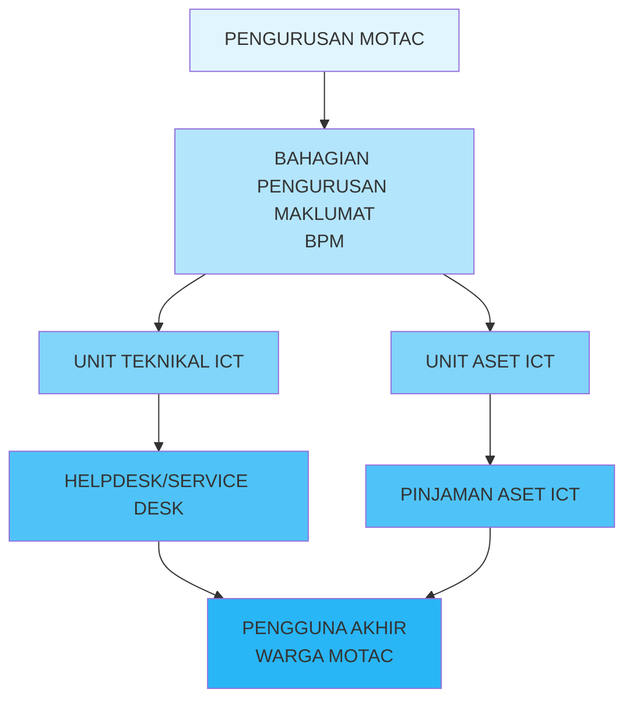
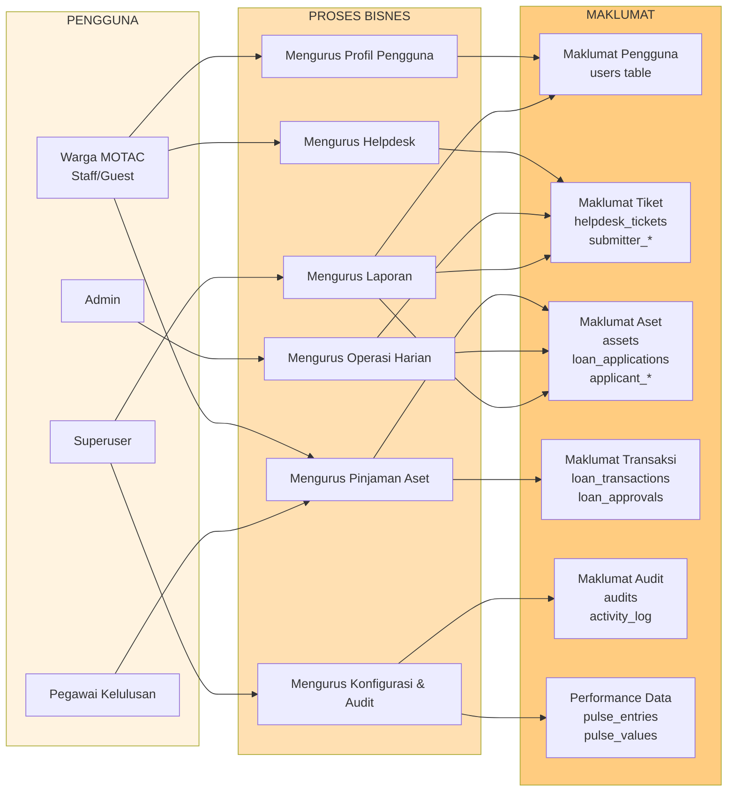
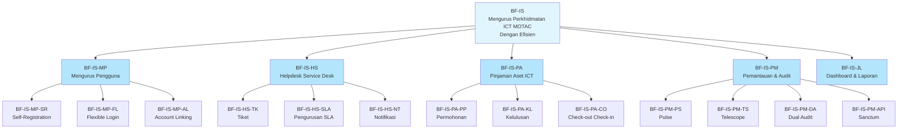
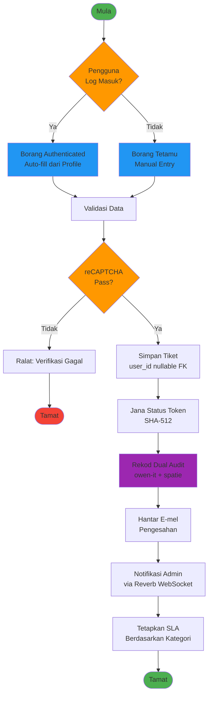
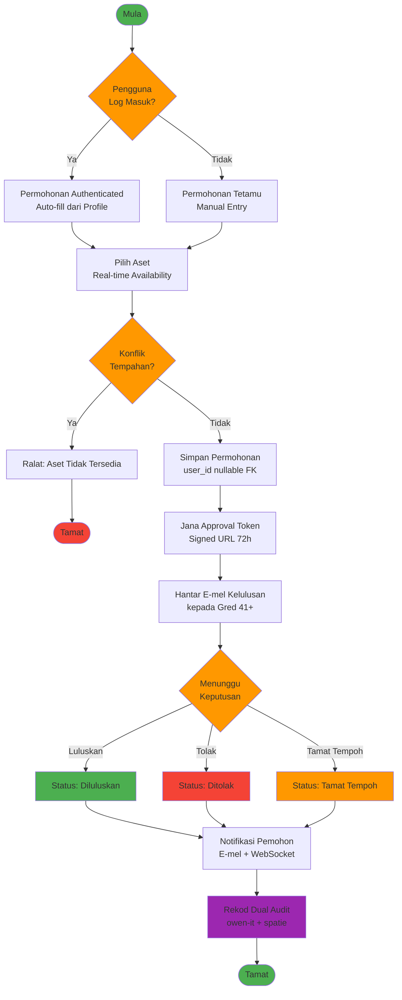

# D02 DOKUMEN SPESIFIKASI KEPERLUAN BISNES (BRS)

**SISTEM ICTSERVE**  
**Platform Pengurusan Helpdesk & Pinjaman Aset ICT**

| | |
| :--- | :--- |
| **NAMA AGENSI** | : Bahagian Pengurusan Maklumat (BPM) |
| **NAMA AGENSI INDUK** | : Kementerian Pelancongan, Seni dan Budaya Malaysia (MOTAC) |
| **TARIKH DOKUMEN** | : 17 Disember 2025 |
| **VERSI DOKUMEN** | : 3.6.1 |

---

## i. Keterangan Dokumen

Dokumen ini menyatakan spesifikasi keperluan bisnes bagi Sistem ICTServe yang digunakan secara dalaman oleh warga kerja MOTAC. Ia mentakrifkan matlamat perniagaan, skop, keperluan fungsional dan bukan fungsional, serta kriteria kejayaan yang memacu pembangunan modul Helpdesk & Asset Loan.

Sistem ICTServe adalah platform web berasaskan Laravel 12.43.1 untuk pengurusan tiket helpdesk dan permohonan pinjaman aset ICT bagi kegunaan dalaman staf MOTAC. Sistem ini menggunakan True Hybrid Architecture yang menyokong akses tetamu (tanpa log masuk) dan akses berdaftar (dengan log masuk) untuk fleksibiliti maksimum. Sistem mematuhi piawaian ISO/IEC/IEEE 29148 (Requirements Engineering), WCAG 2.2 AA (Web Content Accessibility Guidelines), MyGOV Digital Service Standards v2.1.0, dan PDPA 2010.

## ii. Semakan dan Pengesahan Dokumen

**SEMAKAN DOKUMEN**

| Disemak Oleh | Jawatan | Tandatangan | Tarikh Semakan |
| :--- | :--- | :--- | :--- |
| | Penganalisis Sistem Kanan | | |
| | Ketua Pembangun Sistem | | |

**PENGESAHAN DOKUMEN**

| Disahkan Oleh | Jawatan | Tandatangan | Tarikh Semakan |
| :--- | :--- | :--- | :--- |
| | Pengurus Projek | | |
| | Ketua Bahagian Pengurusan Maklumat | | |

## iii. Kawalan Dokumen

**KAWALAN DOKUMEN**

| No. Versi | Tarikh | Ringkasan Pindaan | Penyedia |
| :--- | :--- | :--- | :--- |
| 1.0.0 | September 2025 | Versi awal dokumen keperluan perniagaan | Pasukan BPM |
| 2.0.0 | 17 Oktober 2025 | Penyeragaman mengikut D00-D14, SemVer, cross-reference | Pasukan BPM |
| 3.0.0 | 31 Oktober 2025 | Penjajaran penuh kepada seni bina dalaman (internal-only) | Pasukan BPM |
| 3.5.0 | 30 November 2025 | True Hybrid Architecture, Laravel Pulse, Sanctum, Socialite | Pasukan BPM |
| 3.6.0 | 8 Disember 2025 | Penyeragaman Bahasa Melayu sahaja, Cloud Hybrid AI (D18) | Pasukan BPM |
| 3.6.1 | 17 Disember 2025 | Kemaskini teknologi stack, AI integration, metodologi | Pasukan BPM |

## iv. Kandungan

1. PENGENALAN
   - 1.1. Tujuan Bisnes
   - 1.2. Skop Bisnes
   - 1.3. Gambaran Keseluruhan Projek
   - 1.4. Senarai Pemegang Taruh
2. KEPERLUAN PENGURUSAN BISNES
   - 2.1. Matlamat dan Objektif
   - 2.2. Arkitektur Bisnes
   - 2.3. Arkitektur Maklumat
3. KEPERLUAN PENGOPERASIAN BISNES
   - 3.1. Keperluan Fungsi Bisnes
   - 3.2. Keperluan Proses Bisnes
   - 3.3. Pengiraan Saiz Sistem Aplikasi
4. LAMPIRAN

## v. Senarai Gambarajah

| No. | Tajuk Gambarajah | Muka Surat |
| :--- | :--- | :--- |
| 1 | Struktur Organisasi Projek | §1.3 |
| 2 | Arkitektur Bisnes ICTServe | §2.2 |
| 3 | Arkitektur Maklumat | §2.3 |
| 4 | Hierarki Fungsi Bisnes | §3.1.2 |
| 5 | Model Proses Helpdesk Ticketing | §3.2.2 |
| 6 | Model Proses Asset Loan Management | §3.2.2 |

## vi. Senarai Jadual

| No. | Tajuk Jadual | Muka Surat |
| :--- | :--- | :--- |
| 1 | Senarai Pemegang Taruh | §1.4 |
| 2 | Objektif Terukur Sistem | §2.1 |
| 3 | Modul Utama Sistem ICTServe | §3.1.2 |
| 4 | Senarai Pengguna dan Peranan | §3.1.3 |
| 5 | Notasi Model Proses Bisnes | §3.2.1 |
| 6 | Pengiraan Function Points | §3.3 |

## vii. Definisi dan Akronim

### a. Akronim

| Akronim | Keterangan |
| :--- | :--- |
| API | Application Programming Interface |
| BPM | Bahagian Pengurusan Maklumat |
| BRS | Business Requirements Specification |
| CRUD | Create, Read, Update, Delete |
| FP | Function Points |
| ICT | Information and Communication Technology |
| MOTAC | Kementerian Pelancongan, Seni dan Budaya Malaysia |
| PDPA | Personal Data Protection Act 2010 |
| SLA | Service Level Agreement |
| SSO | Single Sign-On |
| UAT | User Acceptance Testing |
| WCAG | Web Content Accessibility Guidelines |

### b. Definisi

| Terma/Istilah | Definisi |
| :--- | :--- |
| True Hybrid Architecture | Seni bina sistem yang menyokong akses tetamu (tanpa log masuk) dan pengguna berdaftar (dengan log masuk) secara serentak |
| Helpdesk Ticketing | Sistem pengurusan tiket aduan dan masalah ICT dengan SLA tracking |
| Asset Loan | Sistem permohonan dan pengurusan pinjaman peralatan ICT |
| Self-Registration | Pendaftaran kendiri staf menggunakan e-mel @motac.gov.my dengan pengesahan e-mel |
| Flexible Login | Sistem log masuk yang menerima e-mel penuh atau username pendek |
| Account Linking | Proses menghubungkan submission tetamu terdahulu dengan akaun staf baharu |
| Dual Audit System | Sistem audit berganda menggunakan owen-it (compliance) dan spatie (operations) |
| Laravel Pulse | Dashboard pemantauan prestasi aplikasi Laravel secara masa nyata |
| Laravel Sanctum | Sistem pengesahan API berasaskan token untuk integrasi luaran |

## viii. Sumber Rujukan

1. **ISO/IEC/IEEE 29148:2018** - Systems and software engineering - Life cycle processes - Requirements engineering
2. **ISO/IEC/IEEE 15288:2015** - Systems and software engineering - System life cycle processes
3. **WCAG 2.2** - Web Content Accessibility Guidelines Level AA
4. **MyGOV Digital Service Standards v2.1.0** - Malaysian Government Digital Service Standards
5. **Personal Data Protection Act 2010 (PDPA)** - Malaysian data protection legislation
6. **ISO 9241-210:2019** - Ergonomics of human-system interaction - Human-centred design for interactive systems
7. **MyGovEA 18 Prinsip** - Malaysian Government Enterprise Architecture Principles
8. **Laravel 12 Documentation** - https://laravel.com/docs/12.x
9. **Livewire 3 Documentation** - https://livewire.laravel.com/docs/3.x
10. **Filament 4 Documentation** - https://filamentphp.com/docs/4.x
11. **D00_SYSTEM_OVERVIEW.md** - Ringkasan Sistem ICTServe v3.6.1
12. **D01_SYSTEM_DEVELOPMENT_PLAN.md** - Pelan Pembangunan Sistem v3.6.1
13. **D03_SOFTWARE_REQUIREMENTS_SPECIFICATION.md** - Spesifikasi Keperluan Perisian v3.6.1
14. **D04_SOFTWARE_DESIGN_DOCUMENT.md** - Dokumen Rekabentuk Perisian v3.6.1
15. **D18_AI_CHATBOT_OLLAMA_BEDROCK.md** - Cloud Hybrid AI Architecture v1.0.1

---

## 1. PENGENALAN

### 1.1. Tujuan Bisnes

Projek pembangunan Sistem ICTServe dilaksanakan untuk memenuhi keperluan Bahagian Pengurusan Maklumat (BPM) MOTAC dalam menguruskan perkhidmatan sokongan ICT secara sistematik dan teratur. Sistem ini bertujuan untuk:

1. **Meningkatkan Kecekapan Operasi**: Mengautomasikan proses pengurusan tiket helpdesk dan permohonan pinjaman aset ICT yang sebelum ini dilakukan secara manual menggunakan borang kertas dan e-mel.

2. **Meningkatkan Ketelusan**: Menyediakan platform berpusat untuk staf MOTAC memantau status aduan dan permohonan pinjaman secara real-time dengan True Hybrid Architecture yang fleksibel.

3. **Mematuhi Piawaian Kerajaan**: Memastikan sistem mematuhi MyGOV Digital Service Standards v2.1.0, WCAG 2.2 AA untuk aksesibiliti, dan PDPA 2010 untuk perlindungan data peribadi.

4. **Meningkatkan Kualiti Perkhidmatan**: Menyediakan mekanisme SLA (Service Level Agreement) untuk memastikan aduan diselesaikan dalam tempoh yang ditetapkan dengan pemantauan proaktif melalui Laravel Pulse.

5. **Menyokong Keputusan Pengurusan**: Menyediakan dashboard analitik dan laporan untuk membantu pengurusan BPM membuat keputusan berasaskan data.

6. **Menyediakan Sokongan AI Pintar**: Mengintegrasikan Cloud Hybrid AI (Ollama + AWS Bedrock) untuk FAQ Bot dan auto-reply generation dengan 82% penjimatan kos berbanding cloud-only.

Projek ini telah dipersetujui oleh pihak pengurusan MOTAC dan BPM sebagai inisiatif transformasi digital dalaman.

### 1.2. Skop Bisnes

Skop projek pembangunan Sistem ICTServe merangkumi:

1. **Helpdesk Ticketing (Dalaman)**: Borang dalaman untuk aduan kerosakan ICT dengan hybrid submission (authenticated/guest), pengurusan SLA, notifikasi multi-channel, dan audit trail berganda.

2. **ICT Asset Loan (Dalaman)**: Borang dalaman untuk permohonan pinjaman aset dengan hybrid application, kelulusan berperingkat via e-mel, asset check-out/check-in, dan accessory tracking.

3. **Pentadbiran Filament**: Operasi back-office oleh `admin` (pengurusan harian) dan `superuser` (governance, audit, konfigurasi) melalui panel Filament 4.3.1.

4. **Portal Staf Dalaman**: Pengguna log masuk untuk akses fungsi penuh (dashboard, history, profile) atau gunakan borang tetamu untuk akses pantas tanpa log masuk.

5. **Pemantauan Prestasi**: Dashboard Laravel Pulse untuk pemantauan prestasi aplikasi secara masa nyata (slow queries, queue jobs, server health).

6. **Infrastruktur API**: Laravel Sanctum untuk pengesahan API bagi integrasi masa depan dengan aplikasi mudah alih atau sistem luaran.

7. **Pengesahan Sosial (Pilihan)**: Laravel Socialite untuk Google Workspace SSO terhad kepada domain @motac.gov.my.

8. **Cloud Hybrid AI Services**: FAQ Bot, auto-reply generation, document analysis dengan model routing pintar (Ollama local + AWS Bedrock cloud) untuk optimasi kos dan kedaulatan data.

### 1.3. Gambaran Keseluruhan Projek

Bahagian Pengurusan Maklumat (BPM) MOTAC bertanggungjawab mengurus perkhidmatan ICT untuk kakitangan dalaman. Sistem ICTServe v3.6.1 menyediakan platform bersepadu untuk pengurusan helpdesk dan pinjaman aset dengan seni bina True Hybrid yang fleksibel.

**Gambarajah 1: Struktur Organisasi Projek**

### 1.4. Senarai Pemegang Taruh

**Jadual 1: Senarai Pemegang Taruh**

| Pemegang Taruh | Peranan / Tanggungjawab | Kepentingan |
| :--- | :--- | :--- |
| Pengurusan MOTAC | Menetapkan polisi, memerlukan laporan KPI & statistik untuk keputusan strategik | Tinggi |
| Bahagian Pengurusan Maklumat (BPM) | Pemilik Sistem: pengurusan keseluruhan, skop dan kawalan proses bisnes | Tinggi |
| Unit Teknikal ICT | Mengendalikan operasi helpdesk/servicedesk, menyelesaikan kes teknikal, pemantauan SLA | Tinggi |
| Unit Aset ICT | Mengurus inventori aset, proses pengeluaran dan pemulangan aset, penyelenggaraan | Tinggi |
| Pentadbir Sistem (Admin) | Pentadbiran sistem, pengurusan tiket dan pinjaman, konfigurasi operasi harian | Tinggi |
| Pentadbir Sistem (Superuser) | Konfigurasi sistem, audit, keselamatan, akses Laravel Telescope dan Pulse, pengurusan penuh | Tinggi |
| Warga MOTAC (Staff) | Pengguna akhir yang membuat aduan, permohonan pinjaman, self-registration, akses dashboard | Sederhana |
| Warga MOTAC (Guest) | Pengguna tetamu yang menggunakan borang tanpa log masuk untuk akses pantas | Sederhana |
| Pegawai Kelulusan (Gred 41+) | Meluluskan/menolak permohonan pinjaman aset melalui pautan e-mel bertanda tangan | Sederhana |
| AI Services Team | Pengurusan Ollama server, AWS Bedrock configuration, model optimization, AI response quality | Tinggi |
| Data Residency Officer | Memastikan pematuhan data sovereignty, klasifikasi data untuk pemprosesan tempatan vs cloud | Tinggi |
| Cost Management Officer | Pemantauan kos AWS Bedrock, optimization budget AI services, ROI analysis | Sederhana |
| Pembekal / Vendor | Sokongan luaran, pembaikan perkhidmatan, penyelenggaraan peralatan (jika diperlukan) | Rendah |
| Unit Sumber Manusia | Maklumat perubahan staf (pindah/persaraan) untuk pengurusan profil pengguna | Rendah |

---

## 2. KEPERLUAN PENGURUSAN BISNES

### 2.1. Matlamat dan Objektif

#### 2.1.1. Matlamat Utama

Menyediakan sistem pengurusan helpdesk, servicedesk, dan pinjaman aset ICT yang bersepadu, cekap, dan telus untuk meningkatkan kualiti perkhidmatan ICT di MOTAC dengan seni bina True Hybrid yang fleksibel.

#### 2.1.2. Objektif Terukur

**Jadual 2: Objektif Terukur Sistem**

| Bil. | Objektif | Sasaran Terukur | Tempoh |
| :--- | :--- | :--- | :--- |
| 1 | Memudahkan akses dalaman | Portal intranet dengan login selamat atau akses tetamu pantas | Fasa 1 |
| 2 | Memastikan ketelusan dan auditabiliti | Rekod automatik, cap masa, dual audit system (owen-it + spatie) | Fasa 1 |
| 3 | Mematuhi standard kebolehcapaian & prestasi | WCAG 2.2 AA, Lighthouse ≥90, LCP <2.5s, Core Web Vitals | Fasa 2 |
| 4 | Menguatkuasakan dasar peminjaman & SLA | Pengesanan konflik automatik dan peringatan masa nyata | Fasa 2 |
| 5 | Melindungi data peribadi | Token bertanda tangan, encryption AES-256, polisi retention PDPA | Fasa 1 |
| 6 | Meningkatkan kecekapan operasi | Mengurangkan masa pemprosesan helpdesk ≥40%, pinjaman aset ≥50% | 6 bulan |
| 7 | Menyediakan pemantauan proaktif | Laravel Pulse untuk mengesan isu prestasi sebelum memberi kesan | Fasa 2 |
| 8 | Mempersiapkan integrasi masa depan | Infrastruktur API (Laravel Sanctum) untuk aplikasi mudah alih | Fasa 3 |
| 9 | Meningkatkan kepuasan pengguna | Sasaran ≥85% kepuasan pelanggan melalui maklum balas | 6 bulan |
| 10 | Menyediakan sokongan AI pintar | FAQ Bot untuk mengurangkan beban helpdesk ≥30%, respons <5 saat | Fasa 3 |
| 11 | Mengoptimumkan kos operasi AI | Model routing pintar untuk 82% penjimatan kos berbanding cloud-only | Fasa 3 |
| 12 | Memastikan kedaulatan data | Pemprosesan tempatan untuk data sensitif (PDPA 2010 compliance) | Fasa 3 |

### 2.2. Arkitektur Bisnes

**Gambarajah 2: Arkitektur Bisnes ICTServe**

```mermaid
graph TB
    subgraph MEDIUM["MEDIUM PERKHIDMATAN"]
        M1[Aplikasi Web]
        M2[Portal Dalaman]
        M3[E-mel]
        M4[Notifikasi Push]
        M5[API Future]
    end
    
    subgraph PENGGUNA["PENGGUNA PERKHIDMATAN"]
        P1[Warga MOTAC<br/>Staff/Guest]
        P2[Admin]
        P3[Superuser]
        P4[Pegawai Kelulusan]
    end
    
    subgraph PERKHIDMATAN["PERKHIDMATAN UTAMA"]
        S1[Pengurusan Helpdesk]
        S2[Pengurusan Pinjaman Aset]
        S3[Pemantauan Prestasi]
        S4[Pengurusan Pengguna]
        S5[Audit & Keselamatan]
        S6[Laporan & Dashboard]
    end
    
    subgraph APLIKASI["SISTEM APLIKASI"]
        A1[Modul Helpdesk]
        A2[Modul Pinjaman Aset]
        A3[Modul Pengguna]
        A4[Modul Pemantauan]
        A5[Modul API]
        A6[Modul Laporan]
    end
    
    subgraph MAKLUMAT["MAKLUMAT DATA"]
        D1[Pengguna]
        D2[Tiket]
        D3[Aset]
        D4[Pinjaman]
        D5[Audit]
        D6[Performance Metrics]
    end
    
    subgraph TEKNOLOGI["TEKNOLOGI"]
        T1[Laravel 12.43.1]
        T2[PHP 8.2.12]
        T3[MySQL 8.0]
        T4[Redis 7.0]
        T5[Livewire 3.7.3]
        T6[Filament 4.3.1]
    end
    
    MEDIUM --> PENGGUNA
    PENGGUNA --> PERKHIDMATAN
    PERKHIDMATAN --> APLIKASI
    APLIKASI --> MAKLUMAT
    MAKLUMAT --> TEKNOLOGI
    
    style MEDIUM fill:#e3f2fd
    style PENGGUNA fill:#bbdefb
    style PERKHIDMATAN fill:#90caf9
    style APLIKASI fill:#64b5f6
    style MAKLUMAT fill:#42a5f5
    style TEKNOLOGI fill:#2196f3
```

### 2.3. Arkitektur Maklumat

**Gambarajah 3: Arkitektur Maklumat**

---

## 3. KEPERLUAN PENGOPERASIAN BISNES

### 3.1. Keperluan Fungsi Bisnes

#### 3.1.1. Penggunaan Notasi

| Notasi | Keterangan |
| :--- | :--- |
| [ ] | Fungsi utama — menunjukkan modul atau domain perniagaan utama |
| [ ]-[ ] | Fungsi dan subfungsi — hubungan fungsi utama dengan subfungsi |
| [ ]-[ ]-[ ] | Fungsi, subfungsi dan aktiviti — langkah spesifik dalam subfungsi |
| BF-IS-* | Penamaan kod fungsi (contoh: BF-IS-HS untuk Helpdesk/ServiceDesk) |

#### 3.1.2. Model Fungsi Bisnes

**Jadual 3: Modul Utama Sistem ICTServe**

| Bil. | Modul | Keterangan Fungsi |
| :--- | :--- | :--- |
| 1 | Helpdesk Ticketing | Pengurusan tiket aduan ICT dengan kategori, keutamaan, SLA tracking, internal comments, dan cross-module integration |
| 2 | Asset Loan Management | Permohonan pinjaman aset ICT dengan dual approval workflow, accessory tracking, pickup OTP, dan check-in/check-out management |
| 3 | Inventory Management | Pengurusan inventori aset ICT dengan QR code, status tracking, maintenance scheduling |
| 4 | Authentication & Authorization | True Hybrid: Self-registration (@motac.gov.my), flexible login (email/username), optional Google SSO, role-based access control |
| 5 | Reporting & Dashboard | Dashboard analitik dengan Filament widgets, laporan terjadual, export PDF/Excel |
| 6 | Audit Trail (Dual System) | Owen-it (compliance, 7-year retention) + Spatie (operations) untuk audit lengkap |
| 7 | Real-time Communication | Laravel Reverb WebSocket untuk notifikasi real-time dan live updates |
| 8 | Performance Monitoring | Laravel Pulse dashboard untuk slow queries, queue metrics, server health (admin/superuser) |
| 9 | API Authentication | Laravel Sanctum token-based API untuk future mobile/external integrations |
| 10 | Cloud Hybrid AI Services | FAQ Bot, auto-reply generation, document analysis dengan model routing pintar (Ollama + AWS Bedrock) |

**Gambarajah 4: Hierarki Fungsi Bisnes**

#### 3.1.3. Senarai Pengguna

**Jadual 4: Senarai Pengguna dan Peranan**

| Pengguna | Peranan / Kebenaran Akses |
| :--- | :--- |
| Pentadbir Sistem (Superuser) | Akses pentadbiran penuh: konfigurasi, kawalan akses, audit, Laravel Telescope, Laravel Pulse, backup |
| Pentadbir Sistem (Admin) | Akses pengurusan operasi: tiket, aset, notifikasi, laporan, Laravel Pulse, konfigurasi harian |
| Pengurus BPM | Akses laporan KPI, dashboard eksekutif, kemampuan menjana & menjadual laporan |
| Kakitangan Teknikal | Akses pengurusan kes: lihat/kemaskini/resolve tiket, catat tindakan, SLA monitoring |
| Pengurus Aset ICT | Akses inventori, semak/kelulusan permohonan pinjaman, sediakan aset, damage reporting |
| Kakitangan Aset ICT | Akses pengeluaran/penerimaan aset, rekod check-out/check-in, accessory tracking |
| Pegawai Kelulusan (Gred 41+) | Akses kelulusan via e-mel: approve/reject loan applications melalui signed approval link |
| Warga MOTAC (Staff) | Akses authenticated: self-register, login, dashboard, submission history, profile, auto-fill |
| Warga MOTAC (Guest) | Akses tetamu: submit forms tanpa login, track status via token, quick access untuk urgent submissions |

### 3.2. Keperluan Proses Bisnes

#### 3.2.1. Penggunaan Notasi

**Jadual 5: Notasi Model Proses Bisnes**

| Notasi | Simbol | Keterangan |
| :--- | :--- | :--- |
| Proses | Segi empat tepat | Aktiviti atau proses yang dilaksanakan |
| Keputusan | Berlian | Titik keputusan dengan pilihan Ya/Tidak |
| Data | Parallelogram | Input atau output data |
| Permulaan/Tamat | Oval | Titik mula atau tamat proses |
| Aliran | Anak panah | Arah aliran proses |

#### 3.2.2. Model Proses Bisnes

**Gambarajah 5: Model Proses Helpdesk Ticketing**

**Gambarajah 6: Model Proses Asset Loan Management**

### 3.3. Pengiraan Saiz Sistem Aplikasi

Pengiraan saiz sistem menggunakan kaedah Function Point Analysis (FPA) untuk anggaran awal perancangan projek.

**Jadual 6: Pengiraan Function Points**

| Komponen | Rendah (Bil×FP) | Sederhana (Bil×FP) | Tinggi (Bil×FP) | Jumlah FP |
| :--- | :--- | :--- | :--- | :--- |
| EI (External Input) | 8×3 = 24 | 15×4 = 60 | 3×6 = 18 | 102 |
| EO (External Output) | 5×4 = 20 | 10×5 = 50 | 3×7 = 21 | 91 |
| EQ (External Inquiry) | 6×3 = 18 | 12×4 = 48 | 4×6 = 24 | 90 |
| ILF (Internal Logical File) | 10×7 = 70 | 3×10 = 30 | 1×15 = 15 | 115 |
| EIF (External Interface File) | 2×5 = 10 | 2×7 = 14 | 0×10 = 0 | 24 |
| **Jumlah Unadjusted Function Points (UFP)** | | | | **422** |

**Value Adjustment Factor (VAF)**: 1.22 (berdasarkan 14 General System Characteristics)

**Adjusted Function Points (AFP)**: 422 × 1.22 = **515 FP**

#### 3.3.1. Anggaran Usaha dan Kos

Berdasarkan 515 Function Points:

- **Anggaran Usaha**: 515 FP × 6 jam/FP = **3,090 jam** ≈ **387 hari manusia**
- **Anggaran Tempoh**: 387 hari ÷ 3 pembangun = **129 hari** ≈ **6 bulan**
- **Anggaran Kos** (RM 150/jam): 3,090 jam × RM 150 = **RM 463,500**

*Nota: Anggaran ini adalah indikatif untuk perancangan awal. Perincian terperinci akan dimuktamadkan semasa peringkat analisis dan perancangan projek.*

#### 3.3.2. Perincian Komponen Function Points

**External Inputs (EI) - 102 FP:**
- Self-Registration Form (Sederhana: 4 FP)
- Login Email/Username (Rendah: 3 FP)
- Helpdesk Ticket Submission Auth/Guest (Sederhana: 4 FP × 2)
- Loan Application Auth/Guest (Tinggi: 6 FP × 2)
- Email Approval Decision (Sederhana: 4 FP)
- Asset Check-out/Check-in (Sederhana: 4 FP × 2)
- Profile Update (Rendah: 3 FP)
- Account Linking Request (Sederhana: 4 FP)
- Ticket Status Update Admin (Sederhana: 4 FP)
- SLA Configuration (Rendah: 3 FP)
- Email Template Configuration (Rendah: 3 FP)
- User Feedback Submission (Rendah: 3 FP)
- API Token Creation (Sederhana: 4 FP)
- Notification Preferences (Rendah: 3 FP)

**External Outputs (EO) - 91 FP:**
- Email Confirmation Ticket/Loan (Sederhana: 5 FP × 2)
- Email Approval Request (Tinggi: 7 FP)
- SLA Breach Alert (Sederhana: 5 FP)
- Dashboard KPI Report (Tinggi: 7 FP)
- Ticket Statistics Report (Sederhana: 5 FP)
- Asset Usage Report (Sederhana: 5 FP)
- Audit Trail Export CSV (Tinggi: 7 FP)
- Performance Report Pulse (Sederhana: 5 FP)
- WebSocket Notification (Rendah: 4 FP)
- PDF Reports (Sederhana: 5 FP)
- Email Digests (Sederhana: 5 FP)

**External Inquiries (EQ) - 90 FP:**
- Ticket Status Check Token (Rendah: 3 FP)
- Loan Status Check Token (Rendah: 3 FP)
- My Dashboard Staff (Tinggi: 6 FP)
- Asset Availability Search (Sederhana: 4 FP)
- Ticket List Admin (Sederhana: 4 FP)
- Loan Application List Admin (Sederhana: 4 FP)
- Audit Log Viewer Superuser (Tinggi: 6 FP)
- Laravel Pulse Dashboard (Tinggi: 6 FP)
- Laravel Telescope Viewer (Tinggi: 6 FP)
- Asset Inventory List (Sederhana: 4 FP)
- User Search (Sederhana: 4 FP)
- Division Lookup (Rendah: 3 FP)

**Internal Logical Files (ILF) - 115 FP:**
- users (Sederhana: 10 FP)
- helpdesk_tickets (Sederhana: 10 FP)
- loan_applications (Tinggi: 15 FP)
- assets (Rendah: 7 FP)
- loan_approvals (Rendah: 7 FP)
- loan_transactions (Sederhana: 10 FP)
- audits owen-it (Rendah: 7 FP)
- activity_log spatie (Rendah: 7 FP)
- pulse_entries (Rendah: 7 FP)
- pulse_values (Rendah: 7 FP)
- personal_access_tokens (Rendah: 7 FP)
- notifications (Rendah: 7 FP)
- divisions (Rendah: 7 FP)
- categories (Rendah: 7 FP)
- sla_configurations (Rendah: 7 FP)

**External Interface Files (EIF) - 24 FP:**
- Google Workspace API SSO (Sederhana: 7 FP)
- Email Gateway SMTP (Sederhana: 7 FP)
- LDAP Directory Future (Rendah: 5 FP)
- External API Future (Rendah: 5 FP)

#### 3.3.3. General System Characteristics (GSC)

| No. | Karakteristik | Nilai | Justifikasi |
| :--- | :--- | :--- | :--- |
| 1 | Data Communications | 5 | Real-time WebSocket, API, email integration |
| 2 | Distributed Data Processing | 4 | Redis queue, background jobs, WebSocket server |
| 3 | Performance | 5 | Core Web Vitals, LCP <2.5s, Laravel Pulse monitoring |
| 4 | Heavily Used Configuration | 4 | Multi-user concurrent access, real-time updates |
| 5 | Transaction Rate | 4 | Moderate transaction volume, peak during office hours |
| 6 | Online Data Entry | 5 | All forms online, hybrid submission modes |
| 7 | End-User Efficiency | 5 | Auto-fill, flexible login, guest mode, responsive UI |
| 8 | Online Update | 5 | Real-time status updates, WebSocket notifications |
| 9 | Complex Processing | 4 | SLA calculation, conflict detection, dual audit |
| 10 | Reusability | 3 | Modular design, reusable components |
| 11 | Installation Ease | 3 | Standard Laravel deployment |
| 12 | Operational Ease | 4 | Laravel Pulse, Telescope, comprehensive logging |
| 13 | Multiple Sites | 2 | Single deployment (MOTAC internal) |
| 14 | Facilitate Change | 4 | Modular architecture, API-ready, extensible |

**Total Degree of Influence (TDI)**: 57  
**Value Adjustment Factor (VAF)**: 0.65 + (0.01 × 57) = **1.22**

---

## 4. LAMPIRAN

### 4.1. Borang Rujukan

- **Helpdesk Ticket Form**: `app/Livewire/Helpdesk/TicketForm.php` - Implementasi mapping borang helpdesk → `helpdesk_tickets` (termasuk pemetaan `submitter_*` → `guest_*`)
- **Loan Application Form**: `app/Livewire/Forms/LoanApplicationForm.php` - Implementasi mapping borang pinjaman → `loan_applications` (validasi & logik kelulusan)

### 4.2. Carta Alir & Diagram

- Carta alir kelulusan e-mel (rujuk D04 §4.2, D11 §6)
- Diagram proses SLA (rujuk D11 §7)
- Diagram True Hybrid Architecture (rujuk D04 §3.1)

### 4.3. Dokumen Sokongan

- `docs/reference/FILAMENT_UPDATE_STATUS.md` - Bukti/status pematuhan panel pentadbir (Filament)
- `tests/e2e/ACCESSIBILITY_TEST_RESULTS.md` - Ringkasan hasil ujian kebolehcapaian (E2E)
- `docs/reference/performance-optimization-guide.md` - Panduan optimasi prestasi
- `tests/e2e/performance/core-web-vitals.spec.ts` - Ujian Core Web Vitals
- `tests/e2e/performance/lighthouse-audit.spec.ts` - Ujian Lighthouse

### 4.4. Piawaian dan Garis Panduan

- **WCAG 2.2 Level AA** - Web Content Accessibility Guidelines
- **MyGOV Digital Service Standards v2.1.0** - Malaysian Government Digital Service Standards
- **ISO/IEC/IEEE 29148:2018** - Requirements Engineering
- **ISO/IEC/IEEE 15288:2015** - System Life Cycle Processes
- **PDPA 2010** - Personal Data Protection Act
- **ISO 9241-210:2019** - Human-Centred Design
- **MyGovEA 18 Prinsip** - Malaysian Government Enterprise Architecture

### 4.5. Matriks Pemetaan Keperluan (Requirements Traceability Matrix)

RTM diselenggara dalam:
- `docs/reference/rtm/loan_requirements_rtm.csv` - Pemetaan keperluan pinjaman aset
- `docs/reference/rtm/helpdesk_requirements_rtm.csv` - Pemetaan keperluan helpdesk

Semua keperluan baharu bercap ID `BRS-3.x` dan dipetakan kepada:
- SRS (D03) - Software Requirements Specification
- SDD (D04) - Software Design Document
- Kes ujian berkaitan (PHPUnit, Livewire, Lighthouse)

Kemas kini RTM hendaklah mematuhi D01 §9.3 untuk penjejakan perubahan.

### 4.6. Glosari Istilah Bisnes

| Istilah | Takrif |
| :--- | :--- |
| **True Hybrid Architecture** | Seni bina sistem yang menyokong akses tetamu (tanpa log masuk) dan pengguna berdaftar (dengan log masuk) secara serentak dengan nullable user_id FK |
| **Tetamu** | Individu yang mengemukakan borang tanpa akaun aplikasi, tracked via email token |
| **Pautan Kelulusan Bertanda Tangan** | URL unik dengan token hashed dan tarikh luput untuk membuat keputusan kelulusan (72 jam validity) |
| **Admin** | Pegawai BPM yang mengurus operasi harian melalui Filament (ticket management, asset management, notifications) |
| **Superuser** | Pegawai BPM yang mengawal konfigurasi, audit, dan integrasi dengan akses penuh Laravel Telescope |
| **SLA** | Service Level Agreement untuk tindak balas dan penyelesaian tiket helpdesk |
| **Laravel Pulse** | Dashboard pemantauan prestasi masa nyata untuk menjejaki query perlahan, queue jobs, dan kesihatan pelayan |
| **Laravel Sanctum** | Sistem pengesahan token API untuk akses API yang selamat dengan keupayaan dan tamat masa yang boleh dikonfigurasi |
| **Laravel Socialite** | Perpustakaan pengesahan sosial OAuth 2.0 untuk integrasi Google Workspace SSO |
| **Dual Audit System** | Sistem audit berganda menggunakan owen-it (compliance, field-level, 7-year retention) dan spatie (operations, activity logging) |
| **Self-Registration** | Pendaftaran kendiri staf menggunakan e-mel @motac.gov.my dengan pengesahan e-mel (24-hour validity) |
| **Flexible Login** | Sistem log masuk yang menerima e-mel penuh atau username pendek (extracted from email) |
| **Account Linking** | Proses menghubungkan submission tetamu terdahulu (user_id = NULL) dengan akaun staf baharu |
| **Nullable FK** | Foreign Key yang boleh NULL untuk menyokong hybrid data association (guest vs authenticated) |
| **Cloud Hybrid AI** | Seni bina AI yang menggabungkan Ollama (local, percuma) dan AWS Bedrock (cloud, berbayar) untuk optimasi kos dan kedaulatan data |
| **Model Routing** | Sistem pintar yang menganalisis pertanyaan dan menghalakan kepada model AI yang sesuai berdasarkan kompleksiti |
| **Data Sovereignty** | Kedaulatan data yang memastikan data sensitif diproses secara tempatan (Ollama) dan data awam di cloud (Bedrock) |

### 4.7. Akronim Tambahan

| Akronim | Keterangan |
| :--- | :--- |
| AFP | Adjusted Function Points |
| DET | Data Element Type |
| EI | External Input |
| EIF | External Interface File |
| EO | External Output |
| EQ | External Inquiry |
| FPA | Function Point Analysis |
| GSC | General System Characteristics |
| ILF | Internal Logical File |
| KPI | Key Performance Indicator |
| OAuth | Open Authorization |
| OTP | One-Time Password |
| RET | Record Element Type |
| RTM | Requirements Traceability Matrix |
| SAL | Signed Approval Link |
| TDI | Total Degree of Influence |
| UFP | Unadjusted Function Points |
| VAF | Value Adjustment Factor |

### 4.8. Rujukan Kod Sumber

**Implementasi Hybrid Architecture:**
- `app/Models/User.php` - User model dengan nullable FK support
- `app/Models/HelpdeskTicket.php` - Helpdesk model dengan hybrid data association
- `app/Models/LoanApplication.php` - Loan model dengan hybrid data association
- `app/Services/Helpdesk/HelpdeskService.php` - Business logic untuk hybrid submission
- `app/Services/Loan/LoanService.php` - Business logic untuk hybrid application

**Implementasi Dual Audit:**
- `config/audit.php` - Owen-it Laravel Auditing configuration
- `config/activitylog.php` - Spatie Activity Log configuration
- `app/Filament/Pages/UnifiedAuditLog.php` - Unified audit viewer (superuser only)

**Implementasi Performance Monitoring:**
- `config/pulse.php` - Laravel Pulse configuration
- `app/Providers/PulseServiceProvider.php` - Pulse access control (admin/superuser)
- `app/Filament/Widgets/PerformanceMetricsWidget.php` - Performance dashboard widget

**Implementasi API Authentication:**
- `config/sanctum.php` - Laravel Sanctum configuration
- `app/Services/Api/ApiTokenService.php` - Token management service
- `routes/api.php` - API routes dengan Sanctum middleware

**Implementasi Cloud Hybrid AI:**
- `app/Services/AI/ModelRoutingService.php` - Smart model routing logic
- `app/Services/AI/OllamaService.php` - Local Ollama integration
- `app/Services/AI/BedrockService.php` - AWS Bedrock integration
- `config/ai.php` - AI services configuration

### 4.9. Keperluan Bukan Fungsi (Non-Functional Requirements)

**Kebolehcapaian (Accessibility):**
- Mematuhi WCAG 2.2 AA
- 44x44px touch target minimum
- 3px focus outline untuk keyboard navigation
- Struktur ARIA yang betul
- Rujuk: D12–D14, `tests/e2e/accessibility.comprehensive.spec.ts`

**Prestasi (Performance):**
- LCP <2.5s untuk borang utama
- TTI <4s untuk interactive elements
- Skor Lighthouse ≥90 (Desktop/Mobile)
- Rujuk: `tests/e2e/performance/core-web-vitals.spec.ts`, `docs/reference/performance-optimization-guide.md`

**Keselamatan (Security):**
- reCAPTCHA Enterprise untuk borang tetamu
- Rate limiting (60 req/min untuk guest routes, 60 req/min untuk API)
- Storage token hashed (SHA-512)
- Audit log penuh (dual system)
- Rujuk: D09 §8, D11 §8

**Kebolehskalaan (Scalability):**
- Boleh menambah borang tetamu baharu tanpa menambah peranan pengguna
- Redis queue untuk background jobs
- WebSocket server (Laravel Reverb) untuk real-time updates
- Horizontal scaling support

**Kebolehgunaan (Usability):**
- UI Bahasa Melayu sahaja (v3.6.0+)
- Navigasi jelas dan konsisten
- Panduan inline untuk tetamu
- Status real-time untuk submissions
- Responsive design (mobile-first)

**Pemulihan (Recovery):**
- Backup harian automatik
- Pelan pemulihan 4 jam (RTO)
- Kehilangan data maksimum 1 jam (RPO)
- Disaster recovery procedures

### 4.10. Keperluan Data dan Privasi

**Kategori Data Utama:**
- Data Tetamu: Nama, e-mel, telefon, bahagian, gred, maklumat aduan/permohonan, lampiran
- Data Pentadbir: Rekod `users` untuk `admin` dan `superuser` (nama, e-mel dalaman, telefon, status)
- Data Kelulusan: `approver_email`, `approver_grade`, keputusan, catatan, token
- Data Audit & Prestasi: Rekod SLA, masa tindak balas, masa penyelesaian, log akses

**Implikasi Privasi Data & PDPA:**
- Data Peribadi: Tetamu dan pegawai kelulusan diklasifikasi sebagai data peribadi; simpanan terhad kepada tujuan proses
- Consent: Borang menyertakan notis PDPA & checkbox perakuan
- Retention: Data tetamu kekal 7 tahun (selari PDPA & Arkib Negara); lampiran dibersihkan jika tidak relevan selepas 24 bulan kecuali kes audit
- Hak Individu: Tetamu boleh memohon pemadaman maklumat lampiran melalui saluran rasmi BPM; log audit mengekalkan rekod perubahan

### 4.11. Kriteria Kejayaan (Success Criteria)

| ID | Kriteria | Sasaran | Tempoh |
| :--- | :--- | :--- | :--- |
| SC-01 | 100% permohonan & aduan dihantar melalui sistem | Tiada lagi pengumpulan manual/e-mel untuk tiket & pinjaman | 3 bulan |
| SC-02 | SLA tindak balas helpdesk (4 jam kerja) | ≥ 90% dicapai setiap bulan | 6 bulan |
| SC-03 | Kelulusan Gred 41 melalui pautan e-mel | ≥ 95% tanpa bantuan manual | 6 bulan |
| SC-04 | Skor Lighthouse (Desktop/Mobile) | ≥ 90 untuk borang utama | Fasa 2 |
| SC-05 | Pematuhan audit PDPA & ICT MOTAC | Tiada ketakpatuhan kritikal semasa audit tahunan | Berterusan |
| SC-06 | Pemantauan prestasi Laravel Pulse | Dashboard diakses oleh admin/superuser untuk pengesanan isu proaktif | Fasa 2 |
| SC-07 | Infrastruktur API (Laravel Sanctum) | Token API berfungsi untuk integrasi masa depan | Fasa 3 |
| SC-08 | Google Workspace SSO (jika diaktifkan) | ≥ 80% staf menggunakan SSO untuk log masuk | 6 bulan |
| SC-09 | AI FAQ Bot response time | <5 saat untuk 90% pertanyaan | Fasa 3 |
| SC-10 | AI cost optimization | 82% penjimatan kos berbanding cloud-only | Fasa 3 |
| SC-11 | Kepuasan pengguna | ≥ 85% kepuasan melalui survey | 6 bulan |
| SC-12 | Kecekapan operasi | Mengurangkan masa pemprosesan helpdesk ≥40%, pinjaman ≥50% | 6 bulan |

---

**TAMAT DOKUMEN D02**

*Dokumen ini disediakan mengikut format KRISA/MAMPU untuk Kementerian Pelancongan, Seni dan Budaya Malaysia (MOTAC). Semua maklumat adalah terhad untuk kegunaan dalaman BPM MOTAC sahaja.*
