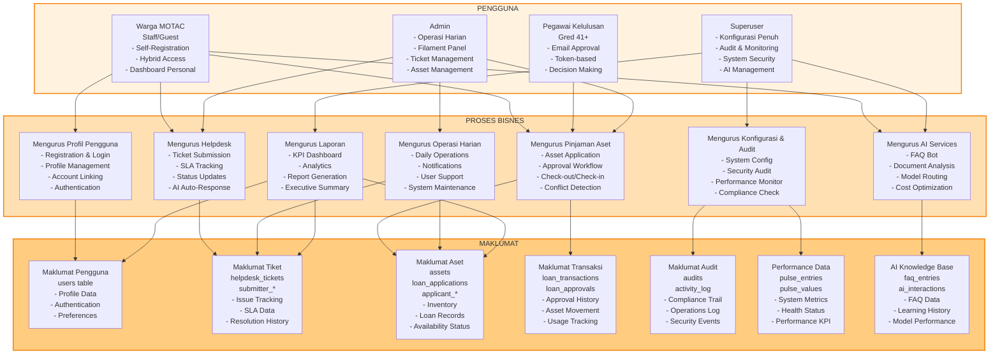

# D02 DOKUMEN SPESIFIKASI KEPERLUAN BISNES (BRS)

**SISTEM ICTSERVE**

*(Sistem Pengurusan Helpdesk dan Pinjaman Aset ICT)*

| | |
| :--- | :--- |
| **NAMA AGENSI** | : Bahagian Pengurusan Maklumat (BPM) |
| **NAMA AGENSI INDUK** | : Kementerian Pelancongan, Seni dan Budaya Malaysia (MOTAC) |
| **TARIKH DOKUMEN** | : 23 Disember 2025 |
| **VERSI DOKUMEN** | : 3.6.1 |

---

## i. Keterangan Dokumen

Dokumen ini menerangkan keperluan bisnes dan pengguna bagi pembangunan **Sistem ICTServe** Versi 3.6.1 sebagai platform web dalaman untuk pengurusan tiket helpdesk dan permohonan pinjaman aset ICT bagi kegunaan warga kerja MOTAC. Kandungannya merangkumi maklumat terperinci skop bisnes, gambaran keseluruhan projek, pemegang taruh yang terlibat, keperluan pengurusan bisnes, keperluan pengoperasian bisnes dan keperluan proses bisnes yang merangkumi senibina **True Hybrid** dan integrasi **Cloud Hybrid AI** (Ollama + AWS Bedrock).

Dokumen ini akan menjadi input utama kepada penyediaan Spesifikasi Keperluan Sistem (SRS) dan mematuhi piawaian **KRISA (Kejuruteraan Sistem Aplikasi Sektor Awam)** yang ditetapkan oleh MAMPU.

---

## ii. Semakan dan Pengesahan Dokumen

Seksyen ini adalah ruangan bagi pegawai-pegawai yang bertanggungjawab untuk melakukan semakan dan pengesahan kepada maklumat-maklumat yang terkandung di dalam dokumen ini.

### SEMAKAN DOKUMEN

| Disemak Oleh | Jawatan | Tandatangan | Tarikh Semakan |
| :--- | :--- | :--- | :--- |
| **Puan Ketua Pasukan** | Penganalisis Sistem Kanan | [Tandatangan Digital] | 23 Disember 2025 |
| **En. Arkitek Sistem** | Ketua Pembangun Sistem | [Tandatangan Digital] | 23 Disember 2025 |

### PENGESAHAN DOKUMEN

| Disahkan Oleh | Jawatan | Tandatangan | Tarikh Pengesahan |
| :--- | :--- | :--- | :--- |
| **Pengarah BPM** | Pengurus Projek | [Tandatangan Digital] | 23 Disember 2025 |
| **Ketua Pegawai Digital (CDO)** | Penasihat Projek | [Tandatangan Digital] | 23 Disember 2025 |

---

## iii. Kawalan Dokumen

### KAWALAN DOKUMEN

| No. Versi | Tarikh | Ringkasan Pindaan | Penyedia |
| :--- | :--- | :--- | :--- |
| 1.0 | 01-09-2025 | Versi awal BRS. | Pasukan BPM |
| 2.0 | 17-10-2025 | Penyeragaman KRISA dan modul asas. | Pasukan BPM |
| 3.0 | 31-10-2025 | Peningkatan kepada Laravel 12 & Filament 4. | Pasukan BPM |
| 3.5 | 30-11-2025 | Penambahan ciri *True Hybrid Architecture* (Self-Registration). | Pasukan BPM |
| 3.6.1 | 23 Disember 2025 | Integrasi *Cloud Hybrid AI* (Ollama + Bedrock) dan Bahasa Melayu sepenuhnya. | Pasukan BPM |

**Nota Penentuan Nombor Versi:**

- Pindaan kecil/sederhana: Perubahan angka selepas titik perpuluhan (contoh: 3.6 → 3.7)
- Pindaan besar: Perubahan angka utama (contoh: 3.7 → 4.0)

---

## iv. Kandungan

1. [PENGENALAN](#1-pengenalan) ... 5
   - 1.1 Tujuan Bisnes
   - 1.2 Skop Bisnes
   - 1.3 Gambaran Keseluruhan Projek
   - 1.4 Senarai Pemegang Taruh
2. [KEPERLUAN PENGURUSAN BISNES](#2-keperluan-pengurusan-bisnes) ... 8
   - 2.1 Matlamat dan Objektif
   - 2.2 Arkitektur Bisnes
   - 2.3 Arkitektur Maklumat
3. [KEPERLUAN PENGOPERASIAN BISNES](#3-keperluan-pengoperasian-bisnes) ... 12
   - 3.1 Keperluan Fungsi Bisnes
   - 3.2 Keperluan Proses Bisnes
   - 3.3 Pengiraan Saiz Sistem Aplikasi
4. [LAMPIRAN](#4-lampiran) ... 30

---

## v. Senarai Gambarajah

- Gambarajah 1.1: Gambaran Bisnes Pengurusan ICTServe ... §1.3
- Gambarajah 2.1: Arkitektur Bisnes ICTServe ... §2.2
- Gambarajah 2.2: Arkitektur Maklumat Sistem ... §2.3
- Gambarajah 3.1: Hirarki Fungsi Bisnes ... §3.1
- Gambarajah 3.2: Aliran Proses PFD-ICT-AD (Pengurusan Aduan) ... §3.2
- Gambarajah 3.3: Aliran Proses PFD-ICT-PJ (Pinjaman Aset) ... §3.2
- Gambarajah 3.4: Aliran Proses PFD-ICT-AI (Bantuan Pintar) ... §3.2

---

## vi. Senarai Jadual

- Jadual 1.1: Senarai Pemegang Taruh ... §1.4
- Jadual 2.1: Matlamat dan Objektif ... §2.1
- Jadual 3.1: Keterangan Fungsi Bisnes ... §3.1
- Jadual 3.2: Definisi Aktiviti PFD-ICT-AD-01 ... §3.2
- Jadual 3.3: Definisi Aktiviti PFD-ICT-PJ-01 ... §3.2
- Jadual 3.4: Definisi Aktiviti PFD-ICT-AI-01 ... §3.2
- Jadual 3.5: Pengiraan Function Point ... §3.3

---

## vii. Definisi dan Akronim

### a. Akronim

| Akronim | Keterangan |
| :--- | :--- |
| **AI** | *Artificial Intelligence* (Kecerdasan Buatan) |
| **BPM** | Bahagian Pengurusan Maklumat |
| **BRS** | *Business Requirement Specification* (Spesifikasi Keperluan Bisnes) |
| **ICT** | *Information and Communication Technology* (Teknologi Maklumat dan Komunikasi) |
| **KRISA** | Kejuruteraan Sistem Aplikasi Sektor Awam |
| **LLM** | *Large Language Model* (Model Bahasa Besar) |
| **MAMPU** | Unit Pemodenan Tadbiran dan Perancangan Pengurusan Malaysia |
| **MOTAC** | Kementerian Pelancongan, Seni dan Budaya Malaysia |
| **PDPA** | Akta Perlindungan Data Peribadi 2010 |
| **RAG** | *Retrieval-Augmented Generation* (Penjanaan Berbantu Perolehan) |
| **SLA** | *Service Level Agreement* (Perjanjian Tahap Perkhidmatan) |
| **SSO** | *Single Sign-On* (Log Masuk Tunggal) |
| **WCAG** | *Web Content Accessibility Guidelines* (Garis Panduan Kebolehcapaian Kandungan Web) |

### b. Definisi

| Terma/Istilah | Definisi |
| :--- | :--- |
| **True Hybrid** | Model akses yang membenarkan pengguna menggunakan sistem sama ada melalui log masuk (staf) atau sebagai tetamu tanpa akaun. |
| **Ollama** | Enjin AI tempatan untuk memproses data sensitif dan FAQ asas dengan kedaulatan data penuh. |
| **AWS Bedrock** | Perkhidmatan AI awan (AWS) untuk pemprosesan penaakulan kompleks dan analisis dokumen lanjutan. |
| **Filament** | Rangka kerja panel pentadbiran yang digunakan oleh Admin dan Superuser untuk pengurusan sistem. |
| **Cloud Hybrid AI** | Model AI hibrid yang menggunakan pemprosesan tempatan (Ollama) dan awan (Bedrock) untuk optimasi kos dan kedaulatan data. |
| **Self-Registration** | Pendaftaran kendiri staf menggunakan e-mel @motac.gov.my dengan pengesahan e-mel automatik. |
| **Dual Audit System** | Sistem audit berganda menggunakan owen-it (compliance) dan spatie (operations) untuk jejak audit lengkap. |

---

## viii. Sumber Rujukan

1. **Buku Panduan Kejuruteraan Sistem Aplikasi Sektor Awam (KRISA)**. MAMPU.
2. **MyGOV Digital Service Standards v2.1.0** - Malaysian Government Digital Service Standards.
3. **Dasar Keselamatan ICT (DKICT) MOTAC** - Polisi keselamatan maklumat MOTAC.
4. **Pekeliling Am Bilangan 2 Tahun 2012** - Tatacara Pengurusan Aset Kerajaan.
5. **ISO/IEC/IEEE 29148:2018** - Systems and software engineering — Life cycle processes — Requirements engineering.
6. **ISO/IEC/IEEE 15288:2015** - Systems and software engineering — System life cycle processes.
7. **WCAG 2.2** - Web Content Accessibility Guidelines Level AA.
8. **Personal Data Protection Act 2010 (PDPA)** - Malaysian data protection legislation.
9. **Laravel 12 Documentation** - Framework documentation untuk pembangunan sistem.
10. **D00_SYSTEM_OVERVIEW.md** - Ringkasan Sistem ICTServe v3.6.1
11. **D18_AI_CHATBOT_OLLAMA_BEDROCK.md** - Cloud Hybrid AI Architecture v1.0.1

---

## 1. PENGENALAN

### 1.1 Tujuan Bisnes

Seksyen ini menerangkan latarbelakang, sebab-sebab dan bagaimana Sistem Pengurusan Perkhidmatan ICT (ICTServe) yang akan dibangunkan dapat membantu dan menyumbang untuk mencapai objektif bisnes.

Bahagian Pengurusan Maklumat (BPM), MOTAC memerlukan satu sistem bersepadu yang lebih efisien untuk menggantikan proses manual dan sistem legasi dalam menguruskan perkhidmatan ICT. Sistem ICTServe dibangunkan untuk memodenkan pengurusan **Helpdesk (Aduan Kerosakan)** dan **Pinjaman Aset ICT** dengan ciri automasi pintar (AI) dan aksesibiliti yang tinggi.

Sistem ini bertujuan untuk:

a) **Menyelesaikan masalah pertindihan tempahan aset** - Sistem automatik mengesan konflik dan mencadangkan alternatif.
b) **Mempercepatkan masa respons aduan** - Melalui bantuan AI Chatbot hibrid (Ollama + AWS Bedrock).
c) **Memudahkan akses warga MOTAC** - Melalui konsep *True Hybrid* (pilihan Log Masuk atau Tetamu).
d) **Memastikan pematuhan SLA dan audit yang telus** - Dengan dual audit system dan pemantauan masa nyata.
e) **Mengoptimumkan kos operasi AI** - Model routing pintar untuk 82% penjimatan kos berbanding cloud-only.
f) **Memastikan kedaulatan data** - Pemprosesan tempatan untuk data sensitif (PDPA 2010 compliance).
### 1.2 Skop Bisnes

Seksyen ini menjelaskan penentuan skop bagi domain bisnes organisasi yang terlibat.

Projek ini merangkumi skop bisnes berikut:

a) **Pengurusan Aduan ICT**: Pelaporan kerosakan perkakasan/perisian, penjejakan status, dan komunikasi antara pengguna dan teknikal dengan sokongan AI untuk penyelesaian pantas.

b) **Pengurusan Pinjaman Aset**: Tempahan peralatan ICT, semakan ketersediaan real-time, dan kelulusan pegawai secara digital melalui token e-mel bertanda tangan.

c) **Bantuan Pintar (AI)**: Chatbot hibrid (Ollama + AWS Bedrock) untuk menjawab soalan lazim, menganalisis dokumen sokongan, dan memberikan penyelesaian automatik.

d) **Pengurusan Pengguna**: Pendaftaran kendiri (*Self-registration*) staf dengan domain @motac.gov.my, integrasi SSO Google (Opsyenal), dan pengurusan profil komprehensif.

e) **Pemantauan & Laporan**: Dashboard prestasi masa nyata (Laravel Pulse), audit trail berganda, dan laporan statistik KPI untuk pengurusan strategik.

f) **Infrastruktur API**: Laravel Sanctum untuk pengesahan API bagi integrasi masa depan dengan aplikasi mudah alih dan sistem luaran.

### 1.3 Gambaran Keseluruhan Projek

Seksyen ini menerangkan struktur organisasi yang berkaitan dengan domain bisnes serta hubungannya dengan entiti luar.

Sistem ICTServe bertindak sebagai hab utama perkhidmatan ICT MOTAC. Ia menghubungkan Warga MOTAC (pengguna akhir) dengan Pasukan Teknikal BPM (penyedia perkhidmatan) dan Unit Aset. Sistem ini disokong oleh infrastruktur AI Hibrid untuk meningkatkan kecekapan dan mengurangkan kos operasi.

**Rajah 1: Gambaran Bisnes Pengurusan ICTServe**

```mermaid
flowchart TD
    A[PENGURUSAN MOTAC<br/>Kementerian Pelancongan,<br/>Seni dan Budaya Malaysia] 
    
    A --> B[BAHAGIAN PENGURUSAN MAKLUMAT<br/>BPM<br/>Pemilik Sistem ICTServe]
    
    B --> C[UNIT TEKNIKAL ICT<br/>Pengurusan Helpdesk<br/>& Service Desk]
    B --> D[UNIT ASET ICT<br/>Pengurusan Inventori<br/>& Pinjaman Aset]
    
    C --> E[HELPDESK/SERVICE DESK<br/>- Pengurusan Tiket<br/>- SLA Monitoring<br/>- Penyelesaian Teknikal<br/>- AI Auto-Response]
    D --> F[PINJAMAN ASET ICT<br/>- Permohonan Aset<br/>- Kelulusan Workflow<br/>- Check-out/Check-in<br/>- Conflict Detection]
    
    E --> G[PENGGUNA AKHIR<br/>WARGA MOTAC<br/>- Staf Berdaftar<br/>- Pengguna Tetamu<br/>- Pegawai Kelulusan]
    F --> G
    
    G --> H[AKSES SISTEM<br/>- Portal Web Hybrid<br/>- Borang Dinamik<br/>- Dashboard Peribadi<br/>- AI Chatbot]
    
    H --> I[CLOUD HYBRID AI<br/>- Ollama (Local)<br/>- AWS Bedrock (Cloud)<br/>- Model Router<br/>- Cost Optimization]
    
    style A fill:#e1f5ff,stroke:#01579b,stroke-width:2px
    style B fill:#b3e5fc,stroke:#0277bd,stroke-width:2px
    style C fill:#81d4fa,stroke:#0288d1,stroke-width:2px
    style D fill:#81d4fa,stroke:#0288d1,stroke-width:2px
    style E fill:#4fc3f7,stroke:#039be5,stroke-width:2px
    style F fill:#4fc3f7,stroke:#039be5,stroke-width:2px
    style G fill:#29b6f6,stroke:#03a9f4,stroke-width:2px
    style H fill:#03a9f4,stroke:#0288d1,stroke-width:2px
    style I fill:#00bcd4,stroke:#0097a7,stroke-width:2px
```

### 1.4 Senarai Pemegang Taruh

Seksyen ini menyenaraikan dan menerangkan pemegang-pemegang taruh yang terlibat dengan domain bisnes berkenaan.

**Jadual 1.1: Senarai Pemegang Taruh**

| Pemegang Taruh | Peranan/Tanggungjawab | Kepentingan |
| :--- | :--- | :--- |
| **Pengurusan Tertinggi MOTAC** | Memantau prestasi perkhidmatan ICT dan pematuhan dasar kerajaan. Menetapkan KPI dan budget. | Tinggi |
| **BPM (Unit Teknikal & Aset)** | Pemilik sistem; mengurus operasi harian tiket dan aset. Bertanggungjawab untuk SLA dan kualiti perkhidmatan. | Tinggi |
| **Pentadbir Sistem (Superuser)** | Mengurus konfigurasi sistem, audit keselamatan, dan infrastruktur AI. Akses penuh Laravel Telescope dan Pulse. | Tinggi |
| **Pentadbir Sistem (Admin)** | Pengurusan operasi harian, pemprosesan tiket, pengurusan aset, dan konfigurasi rutin melalui panel Filament. | Tinggi |
| **Warga MOTAC (Staf Berdaftar)** | Pengguna berdaftar yang menggunakan dashboard peribadi, sejarah submission, dan auto-fill borang. | Tinggi |
| **Warga MOTAC (Tetamu)** | Pengguna yang membuat aduan/permohonan pantas tanpa log masuk untuk akses segera. | Sederhana |
| **Pegawai Kelulusan (Gred 41+)** | Meluluskan permohonan pinjaman aset melalui e-mel dengan token bertanda tangan. | Sederhana |
| **AI Services Team** | Pengurusan Ollama server, AWS Bedrock configuration, model optimization, dan kualiti respons AI. | Tinggi |
| **Data Residency Officer** | Memastikan pematuhan data sovereignty, klasifikasi data untuk pemprosesan tempatan vs cloud. | Tinggi |
| **Cost Management Officer** | Pemantauan kos AWS Bedrock, optimization budget AI services, dan analisis ROI. | Sederhana |

---

## 2. KEPERLUAN PENGURUSAN BISNES

### 2.1 Matlamat dan Objektif

Seksyen ini menyenaraikan dan menerangkan matlamat, objektif dan hasil bisnes yang ingin dicapai melalui pelaksanaan sistem yang akan dibangunkan.

#### 2.1.1 Matlamat Utama

Mewujudkan persekitaran pengurusan perkhidmatan ICT yang responsif, pintar, dan mesra pengguna bagi menyokong operasi harian MOTAC dengan mengintegrasikan teknologi AI hibrid untuk optimasi kos dan kedaulatan data.

#### 2.1.2 Objektif Sistem

**Jadual 2.1: Matlamat dan Objektif**

| No. | Objektif | Keterangan | Sasaran | Tempoh |
| :--- | :--- | :--- | :--- | :--- |
| 1 | **Aksesibiliti Tinggi** | Menyediakan akses pantas melalui mod *Guest* dan *Self-Registration* dengan True Hybrid Architecture. | 100% Warga MOTAC boleh akses sistem. | Fasa 1 |
| 2 | **Pengurangan Masa Respons** | Menggunakan AI hibrid untuk menjawab soalan lazim (FAQ) secara automatik dan penyelesaian masalah pantas. | Pengurangan 30% tiket pertanyaan umum, respons <5 saat. | Fasa 2 |
| 3 | **Integriti Data** | Merekod semua transaksi dan kelulusan dengan jejak audit berganda (owen-it + spatie). | 100% transaksi diaudit dengan retention 7 tahun. | Fasa 1 |
| 4 | **Pemantauan Efisien** | Memaparkan status kesihatan sistem dan SLA secara masa nyata melalui Laravel Pulse. | Uptime 99.5%, SLA compliance 95%. | Fasa 2 |
| 5 | **Optimasi Kos AI** | Model routing pintar untuk mengurangkan kos operasi AI dengan pemprosesan hibrid. | 82% penjimatan kos berbanding cloud-only. | Fasa 3 |
| 6 | **Kedaulatan Data** | Memastikan data sensitif diproses secara tempatan mengikut PDPA 2010. | 100% data sensitif diproses melalui Ollama local. | Fasa 3 |

### 2.2 Arkitektur Bisnes

Seksyen ini menjelaskan dan menyediakan Arkitektur Bisnes yang berkaitan dengan sistem yang akan dibangunkan.

#### 2.2.1 Komponen Arkitektur Bisnes

Sistem ICTServe beroperasi dalam ekosistem MOTAC dengan komponen berikut:

- **Medium Perkhidmatan**: Aplikasi Web (Intranet), Notifikasi E-mel, WebSocket (Real-time), API Future
- **Pengguna Perkhidmatan**: Staf (Authenticated), Tetamu, Admin, Superuser, Pegawai Kelulusan
- **Perkhidmatan Utama**: Helpdesk, Pinjaman Aset, Bantuan AI, Pemantauan Prestasi, Audit & Keselamatan
- **Sistem Aplikasi**: ICTServe v3.7.0 (Laravel 12.43.1) dengan Livewire 3.7.3 dan Filament 4.3.1
- **Maklumat (Data)**: Profil Pengguna, Tiket Aduan, Inventori Aset, Audit Trail, FAQ Knowledge Base, Performance Metrics
- **Teknologi**: MySQL 8.0, Redis 7.0, Ollama (Local AI), AWS Bedrock (Cloud AI), Laravel Reverb (WebSocket)

**Rajah 2: Arkitektur Bisnes ICTServe**

```mermaid
flowchart TD
    subgraph MEDIUM["MEDIUM PERKHIDMATAN"]
        M1[Aplikasi Web<br/>Portal Dalaman]
        M2[E-mel & Notifikasi<br/>Push Notifications]
        M3[API Future<br/>Mobile Integration]
        M4[WebSocket Real-time<br/>Laravel Reverb]
    end
    
    subgraph PENGGUNA["PENGGUNA PERKHIDMATAN"]
        P1[Warga MOTAC<br/>Staff/Guest<br/>True Hybrid Access]
        P2[Admin<br/>Operasi Harian<br/>Filament Panel]
        P3[Superuser<br/>Konfigurasi & Audit<br/>Full Access]
        P4[Pegawai Kelulusan<br/>Gred 41+<br/>Email Approval]
    end
    
    subgraph PERKHIDMATAN["PERKHIDMATAN UTAMA"]
        S1[Pengurusan Helpdesk<br/>Tiket & SLA<br/>AI Auto-Response]
        S2[Pengurusan Pinjaman Aset<br/>Workflow & Kelulusan<br/>Conflict Detection]
        S3[Pemantauan Prestasi<br/>Laravel Pulse<br/>Real-time Metrics]
        S4[Pengurusan Pengguna<br/>Auth & Profile<br/>Self-Registration]
        S5[Audit & Keselamatan<br/>Dual System<br/>Compliance Trail]
        S6[Laporan & Dashboard<br/>KPI & Analytics<br/>Executive Reports]
        S7[Cloud Hybrid AI<br/>FAQ Bot & Analysis<br/>Cost Optimization]
    end
    
    subgraph APLIKASI["SISTEM APLIKASI"]
        A1[Modul Helpdesk<br/>Livewire Components<br/>Real-time Updates]
        A2[Modul Pinjaman Aset<br/>Workflow Engine<br/>Email Integration]
        A3[Modul Pengguna<br/>Laravel Breeze<br/>Profile Management]
        A4[Modul Pemantauan<br/>Pulse Dashboard<br/>Performance Metrics]
        A5[Modul API<br/>Sanctum Auth<br/>Token Management]
        A6[Modul Laporan<br/>Filament Widgets<br/>Export Functions]
        A7[Modul AI<br/>Ollama + Bedrock<br/>Model Router]
    end
    
    subgraph MAKLUMAT["MAKLUMAT DATA"]
        D1[Pengguna<br/>users table<br/>Profile & Auth]
        D2[Tiket<br/>helpdesk_tickets<br/>SLA & Status]
        D3[Aset<br/>assets & inventory<br/>Availability & Status]
        D4[Pinjaman<br/>loan_applications<br/>Approval Workflow]
        D5[Audit<br/>audits & activity_log<br/>Compliance & Operations]
        D6[Performance Metrics<br/>pulse_entries<br/>System Health]
        D7[AI Knowledge Base<br/>FAQ & Documents<br/>Learning Data]
    end
    
    subgraph TEKNOLOGI["TEKNOLOGI"]
        T1[Laravel 12.43.1<br/>PHP 8.2.12<br/>Framework Core]
        T2[MySQL 8.0<br/>Redis 7.0<br/>Data Storage]
        T3[Livewire 3.7.3<br/>Alpine.js 3<br/>Frontend Interactivity]
        T4[Filament 4.3.1<br/>Tailwind CSS 4.1.18<br/>Admin Interface]
        T5[Laravel Reverb 1.6.3<br/>WebSocket Real-time<br/>Live Updates]
        T6[Ollama Local AI<br/>AWS Bedrock Cloud<br/>Hybrid Intelligence]
    end
    
    MEDIUM --> PENGGUNA
    PENGGUNA --> PERKHIDMATAN
    PERKHIDMATAN --> APLIKASI
    APLIKASI --> MAKLUMAT
    MAKLUMAT --> TEKNOLOGI
    
    style MEDIUM fill:#e3f2fd,stroke:#1976d2,stroke-width:2px
    style PENGGUNA fill:#bbdefb,stroke:#1976d2,stroke-width:2px
    style PERKHIDMATAN fill:#90caf9,stroke:#1976d2,stroke-width:2px
    style APLIKASI fill:#64b5f6,stroke:#1976d2,stroke-width:2px
    style MAKLUMAT fill:#42a5f5,stroke:#1976d2,stroke-width:2px
    style TEKNOLOGI fill:#2196f3,stroke:#1976d2,stroke-width:2px
```



### 2.3 Arkitektur Maklumat

Seksyen ini menerangkan Arkitektur Maklumat bagi sistem aplikasi yang akan dibangunkan.

#### 2.3.1 Hubungan Pengguna, Proses dan Maklumat

**Rajah 3: Arkitektur Maklumat Sistem**



| Pengguna | Proses Bisnes | Maklumat Terlibat |
| :--- | :--- | :--- |
| **Warga MOTAC (Staff/Guest)** | Menghantar Aduan / Memohon Aset / Berinteraksi dengan AI | Profil Pengguna, Butiran Tiket, Tarikh Pinjaman, AI Interactions |
| **AI Chatbot Hibrid** | Menjawab Pertanyaan / Analisis Dokumen / Model Routing | Pangkalan Pengetahuan (FAQ), Dokumen Polisi, Learning Data |
| **Admin BPM** | Mengurus Tiket / Aset / Notifikasi / Operasi Harian | Status Tiket, Inventori Aset, Log Audit, Performance Metrics |
| **Pegawai Kelulusan** | Meluluskan Pinjaman / Keputusan Approval | Token Kelulusan, Butiran Permohonan, Approval History |
| **Superuser** | Konfigurasi Sistem / Audit / AI Management | System Config, Security Audit, AI Performance, Compliance Data |

---

## 3. KEPERLUAN PENGOPERASIAN BISNES

### 3.1 Keperluan Fungsi Bisnes

#### 3.1.1 Penggunaan Notasi

Seksyen ini menyenaraikan notasi-notasi yang akan digunakan untuk menyediakan Model Fungsi Bisnes.

Jadual berikut menerangkan notasi ID fungsi bisnes:

| Notasi | Keterangan |
| :--- | :--- |
| **BF-ICT-XX-YY** | Format ID Fungsi Bisnes untuk sistem ICTServe. |
| **BF** | *Business Function* (Fungsi Bisnes). |
| **ICT** | Kod Sistem ICTServe. |
| **XX** | Kod Modul (cth: AD=Aduan, PJ=Pinjaman, AI=Kecerdasan Buatan, AM=Akses Management). |
| **YY** | Kod Sub-fungsi (cth: 01, 02, 03). |

#### 3.1.2 Model Fungsi Bisnes

Seksyen ini menyediakan Model Fungsi Bisnes yang terdiri daripada Struktur Hirarki Fungsi serta keterangan bagi fungsi-fungsi berkenaan.

##### a) Struktur Hirarki Fungsi Bisnes

**Rajah 4: Hirarki Fungsi Bisnes**

```mermaid
flowchart TD
    A[BF-ICT<br/>Mengurus Perkhidmatan ICT MOTAC<br/>Dengan Efisien dan Pintar]
    
    A --> B[BF-ICT-AM<br/>Pengurusan Akses<br/>User Management]
    A --> C[BF-ICT-AD<br/>Helpdesk Service Desk<br/>Ticket Management]
    A --> D[BF-ICT-PJ<br/>Pinjaman Aset ICT<br/>Asset Loan]
    A --> E[BF-ICT-PM<br/>Pemantauan & Audit<br/>Monitoring & Audit]
    A --> F[BF-ICT-JL<br/>Dashboard & Laporan<br/>Reports & Analytics]
    A --> G[BF-ICT-AI<br/>Cloud Hybrid AI<br/>AI Services]
    
    B --> B1[BF-ICT-AM-01<br/>Self-Registration<br/>@motac.gov.my]
    B --> B2[BF-ICT-AM-02<br/>Flexible Login<br/>Email/Username]
    B --> B3[BF-ICT-AM-03<br/>Account Linking<br/>Guest to Staff]
    B --> B4[BF-ICT-AM-04<br/>Profile Management<br/>User Settings]
    
    C --> C1[BF-ICT-AD-01<br/>Ticket Management<br/>Issue Tracking]
    C --> C2[BF-ICT-AD-02<br/>SLA Management<br/>Service Level]
    C --> C3[BF-ICT-AD-03<br/>Notifications<br/>Multi-channel]
    C --> C4[BF-ICT-AD-04<br/>Status Tracking<br/>Real-time Updates]
    
    D --> D1[BF-ICT-PJ-01<br/>Asset Application<br/>Loan Request]
    D --> D2[BF-ICT-PJ-02<br/>Approval Workflow<br/>Email Approval]
    D --> D3[BF-ICT-PJ-03<br/>Check-out Check-in<br/>Asset Movement]
    D --> D4[BF-ICT-PJ-04<br/>Conflict Detection<br/>Availability Check]
    
    E --> E1[BF-ICT-PM-01<br/>Laravel Pulse<br/>Performance Monitor]
    E --> E2[BF-ICT-PM-02<br/>Laravel Telescope<br/>Debug & Profiling]
    E --> E3[BF-ICT-PM-03<br/>Dual Audit<br/>Owen-it + Spatie]
    E --> E4[BF-ICT-PM-04<br/>API Management<br/>Laravel Sanctum]
    
    F --> F1[BF-ICT-JL-01<br/>KPI Dashboard<br/>Key Metrics]
    F --> F2[BF-ICT-JL-02<br/>Analytics<br/>Data Analysis]
    F --> F3[BF-ICT-JL-03<br/>Export Reports<br/>PDF/Excel]
    
    G --> G1[BF-ICT-AI-01<br/>FAQ Bot<br/>Ollama Local]
    G --> G2[BF-ICT-AI-02<br/>Document Analysis<br/>AWS Bedrock]
    G --> G3[BF-ICT-AI-03<br/>Model Router<br/>Smart Routing]
    G --> G4[BF-ICT-AI-04<br/>Knowledge Base<br/>Learning System]
    
    style A fill:#e1f5ff,stroke:#01579b,stroke-width:3px
    style B fill:#b3e5fc,stroke:#0277bd,stroke-width:2px
    style C fill:#b3e5fc,stroke:#0277bd,stroke-width:2px
    style D fill:#b3e5fc,stroke:#0277bd,stroke-width:2px
    style E fill:#b3e5fc,stroke:#0277bd,stroke-width:2px
    style F fill:#b3e5fc,stroke:#0277bd,stroke-width:2px
    style G fill:#b3e5fc,stroke:#0277bd,stroke-width:2px
```

##### b) Keterangan Fungsi Bisnes

**Jadual 3.1: Keterangan Fungsi Bisnes**

| ID Fungsi | Nama Fungsi | Keterangan | Pengguna Terlibat |
| :--- | :--- | :--- | :--- |
| **BF-ICT-AM** | **Pengurusan Akses** | Mengurus pendaftaran diri, log masuk hibrid, dan profil pengguna dengan True Hybrid Architecture. | Semua Pengguna |
| **BF-ICT-AD** | **Pengurusan Aduan** | Menghantar, memantau, dan menyelesaikan tiket kerosakan ICT dengan sokongan AI auto-response. | Warga MOTAC, Admin |
| **BF-ICT-PJ** | **Pengurusan Pinjaman** | Memohon peralatan, menyemak stok, meluluskan, dan memulangkan aset dengan workflow automatik. | Warga MOTAC, Admin, Pelulus |
| **BF-ICT-AI** | **Bantuan Pintar** | Menjawab pertanyaan (FAQ) dan analisis dokumen menggunakan AI Hibrid dengan optimasi kos. | Semua Pengguna |
| **BF-ICT-PM** | **Pemantauan & Audit** | Mengurus pemantauan prestasi, audit keselamatan, dan compliance dengan dual audit system. | Admin, Superuser |
| **BF-ICT-JL** | **Dashboard & Laporan** | Mengurus data rujukan, inventori, audit, dan menjana laporan prestasi untuk pengurusan strategik. | Admin, Superuser |

#### 3.1.3 Senarai Pengguna

Seksyen ini menyenaraikan senarai pengguna-pengguna yang terlibat secara langsung dengan fungsi bisnes.

| Pengguna | Peranan | Tanggungjawab | Fungsi Terlibat |
| :--- | :--- | :--- | :--- |
| **Staf (Authenticated)** | Pengguna Berdaftar | Membuat permohonan, melihat sejarah dashboard, menguruskan profil peribadi. | Semua Modul |
| **Tetamu (Guest)** | Pengguna Tidak Berdaftar | Membuat aduan/permohonan pantas, semakan status via token, akses AI chatbot. | Aduan, Pinjaman, AI |
| **Admin** | Pegawai Operasi | Memproses tiket, menyediakan aset, memantau SLA, pengurusan notifikasi. | Semua Modul kecuali Superuser functions |
| **Superuser** | Pentadbir Teknikal | Konfigurasi sistem, audit log, pemantauan AI, akses Laravel Telescope dan Pulse. | Pentadbiran Penuh |
| **Pegawai Kelulusan** | Pembuat Keputusan | Meluluskan/menolak permohonan pinjaman aset melalui email approval workflow. | Pinjaman Aset |

### 3.2 Keperluan Proses Bisnes

#### 3.2.1 Penggunaan Notasi

Seksyen ini menyenaraikan notasi-notasi yang akan digunakan untuk menyediakan Model Proses.

Menggunakan notasi standard carta alir (*Flowchart*) dan Rajah Aliran Proses (PFD) dengan simbol-simbol berikut:

| Simbol | Keterangan |
| :--- | :--- |
| Oval | Titik mula atau tamat proses |
| Segi empat tepat | Aktiviti atau proses yang dilaksanakan |
| Berlian | Titik keputusan dengan pilihan Ya/Tidak |
| Parallelogram | Input atau output data |
| Anak panah | Arah aliran proses |

#### 3.2.2 Model Proses Bisnes

Seksyen ini menyediakan Model Proses Bisnes yang merangkumi Aliran Proses Bisnes dan Definisi Fungsi Bisnes.

##### a) Proses Pengurusan Aduan (Helpdesk)

**Rajah 5: Aliran Proses PFD-ICT-AD (Pengurusan Aduan)**

```mermaid
flowchart TD
    Start([Mula<br/>Pengguna Akses Sistem]) 
    
    Start --> Check{Pengguna<br/>Log Masuk?}
    
    Check -->|Ya| AuthForm[Borang Authenticated<br/>- Auto-fill dari Profile<br/>- user_id linked<br/>- Dashboard access]
    Check -->|Tidak| GuestForm[Borang Tetamu<br/>- Manual Entry<br/>- user_id = NULL<br/>- Token tracking]
    
    AuthForm --> FillForm[Isi Maklumat Tiket<br/>- Kategori Masalah<br/>- Keterangan Detail<br/>- Lampiran Bukti]
    GuestForm --> FillForm
    
    FillForm --> Validate[Validasi Data<br/>- Required Fields<br/>- File Size Check<br/>- Email Format]
    
    Validate --> reCAPTCHA{reCAPTCHA<br/>Verification<br/>Pass?}
    
    reCAPTCHA -->|Tidak| Error1[Ralat: Verifikasi Gagal<br/>Sila cuba semula]
    Error1 --> End1([Tamat])
    
    reCAPTCHA -->|Ya| AICheck{Boleh AI<br/>Bantu Selesai?}
    
    AICheck -->|Ya| AIProcess[AI Auto-Response<br/>- FAQ matching<br/>- Solution suggestion<br/>- Ollama/Bedrock routing]
    AICheck -->|Tidak| SaveTicket[Simpan Tiket<br/>- Generate Ticket ID<br/>- Set user_id if auth<br/>- Store submitter data]
    
    AIProcess --> AISolved{AI Berjaya<br/>Selesaikan?}
    
    AISolved -->|Ya| AISuccess[Penyelesaian AI<br/>- Mark as resolved<br/>- User notification<br/>- Learning update]
    AISolved -->|Tidak| SaveTicket
    
    SaveTicket --> GenToken[Jana Status Token<br/>- SHA-512 Hash<br/>- Email tracking<br/>- Secure access]
    
    GenToken --> DualAudit[Rekod Dual Audit<br/>- owen-it compliance<br/>- spatie operations<br/>- Timestamp all actions]
    
    DualAudit --> SendEmail[Hantar E-mel Pengesahan<br/>- Ticket number<br/>- Status tracking link<br/>- Expected SLA]
    
    SendEmail --> NotifyAdmin[Notifikasi Admin<br/>- Reverb WebSocket<br/>- Real-time alert<br/>- Queue assignment]
    
    NotifyAdmin --> SLACheck[Tetapkan SLA<br/>- Berdasarkan Kategori<br/>- Priority level<br/>- Response time target]
    
    SLACheck --> End2([Tamat<br/>Tiket Dijana])
    AISuccess --> End3([Tamat<br/>AI Resolved])
    
    style Start fill:#4caf50,stroke:#2e7d32,stroke-width:2px
    style End1 fill:#f44336,stroke:#c62828,stroke-width:2px
    style End2 fill:#4caf50,stroke:#2e7d32,stroke-width:2px
    style End3 fill:#00bcd4,stroke:#0097a7,stroke-width:2px
    style Check fill:#ff9800,stroke:#f57c00,stroke-width:2px
    style reCAPTCHA fill:#ff9800,stroke:#f57c00,stroke-width:2px
    style AICheck fill:#ff9800,stroke:#f57c00,stroke-width:2px
    style AISolved fill:#ff9800,stroke:#f57c00,stroke-width:2px
    style AuthForm fill:#2196f3,stroke:#1976d2,stroke-width:2px
    style GuestForm fill:#2196f3,stroke:#1976d2,stroke-width:2px
    style DualAudit fill:#9c27b0,stroke:#7b1fa2,stroke-width:2px
    style AIProcess fill:#00bcd4,stroke:#0097a7,stroke-width:2px
    style AISuccess fill:#00bcd4,stroke:#0097a7,stroke-width:2px
```



**Jadual 4: Definisi Aktiviti PFD-ICT-AD-01**

| Rujukan Fungsi | **BF-ICT-AD** |
| :--- | :--- |
| **Nama Fungsi** | Pengurusan Aduan Helpdesk |
| **Nama Aktiviti** | **PFD-ICT-AD-01: Menghantar Aduan Kerosakan ICT** |
| **Keterangan** | Pengguna melaporkan masalah ICT melalui borang dalam talian dengan sokongan AI untuk penyelesaian automatik |
| **Aktor** | Warga MOTAC (Staf/Tetamu), AI Chatbot Hibrid |
| **Prasyarat** | Akses rangkaian Intranet/Internet, sistem AI tersedia (Ollama/Bedrock) |
| **Input** | Nama, E-mel, Bahagian, Kategori Masalah, Keterangan Detail, Lampiran (optional) |
| **Output** | Nombor Tiket, E-mel Notifikasi, AI Response (jika berkenaan), Status Tracking Token |
| **Aliran Utama** | 1. Pengguna akses borang<br>2. Sistem semak status log masuk (Auto-fill jika authenticated)<br>3. Pengguna isi butiran kerosakan<br>4. AI cuba berikan penyelesaian pantas melalui model routing<br>5. Jika AI tidak dapat selesai, hantar sebagai tiket manual<br>6. Sistem simpan dan jana No. Tiket dengan dual audit |
| **Aliran Alternatif** | Jika AI berjaya selesaikan masalah, tiket tidak perlu dijana dan pengguna dapat penyelesaian segera |
| **Aliran Pengecualian** | Jika lampiran melebihi 10MB, AI tidak tersedia, atau reCAPTCHA gagal, proses manual dengan notifikasi ralat |
| **Syarat Pasca** | Tiket direkod dalam pangkalan data, e-mel notifikasi dihantar, audit trail lengkap, SLA ditetapkan |

##### b) Proses Pinjaman Aset ICT

**Rajah 6: Aliran Proses PFD-ICT-PJ (Pinjaman Aset)**

```mermaid
flowchart TD
    Start([Mula<br/>Permohonan Pinjaman Aset]) 
    
    Start --> Check{Pengguna<br/>Log Masuk?}
    
    Check -->|Ya| AuthApp[Permohonan Authenticated<br/>- Auto-fill dari Profile<br/>- user_id linked<br/>- History tracking]
    Check -->|Tidak| GuestApp[Permohonan Tetamu<br/>- Manual Entry<br/>- user_id = NULL<br/>- Token tracking]
    
    AuthApp --> SelectAsset[Pilih Aset & Tarikh<br/>- Browse inventory<br/>- Check real-time availability<br/>- Set loan period<br/>- Select accessories]
    GuestApp --> SelectAsset
    
    SelectAsset --> ConflictCheck{Konflik<br/>Tempahan<br/>Wujud?}
    
    ConflictCheck -->|Ya| ShowAlternatives[Papar Alternatif<br/>- Alternative dates<br/>- Similar assets<br/>- Queue option<br/>- Notification when available]
    ShowAlternatives --> UserChoice{Pengguna<br/>Pilih Alternatif?}
    UserChoice -->|Ya| SelectAsset
    UserChoice -->|Tidak| End1([Tamat<br/>Permohonan Dibatalkan])
    
    ConflictCheck -->|Tidak| FillDetails[Isi Butiran Permohonan<br/>- Tujuan penggunaan<br/>- Lokasi penggunaan<br/>- Pegawai pelulus<br/>- Justifikasi keperluan]
    
    FillDetails --> ValidateApp[Validasi Permohonan<br/>- Required fields<br/>- Business rules<br/>- Approval hierarchy<br/>- Policy compliance]
    
    ValidateApp --> SaveApp[Simpan Permohonan<br/>- Generate application ID<br/>- Set user_id if auth<br/>- Store applicant data<br/>- Reserve asset temporarily]
    
    SaveApp --> GenApproval[Jana Approval Token<br/>- Signed URL 72h expiry<br/>- Secure approval link<br/>- Approver identification<br/>- Expiry tracking]
    
    GenApproval --> SendApproval[Hantar E-mel Kelulusan<br/>- kepada Pegawai Gred 41+<br/>- Application details<br/>- Approve/Reject buttons<br/>- Policy guidelines]
    
    SendApproval --> WaitDecision{Menunggu<br/>Keputusan<br/>Pegawai}
    
    WaitDecision -->|Luluskan| Approved[Status: Diluluskan<br/>- Update database<br/>- Confirm asset reservation<br/>- Generate pickup info<br/>- Set pickup deadline]
    WaitDecision -->|Tolak| Rejected[Status: Ditolak<br/>- Record rejection reason<br/>- Release asset reservation<br/>- Notify applicant<br/>- Suggest alternatives]
    WaitDecision -->|Tamat Tempoh| Expired[Status: Tamat Tempoh<br/>- Auto-reject application<br/>- Release reservation<br/>- Audit trail update<br/>- Notify all parties]
    
    Approved --> NotifyUser[Notifikasi Pemohon<br/>- E-mel confirmation<br/>- WebSocket real-time<br/>- Pickup instructions<br/>- OTP generation]
    Rejected --> NotifyUser
    Expired --> NotifyUser
    
    NotifyUser --> DualAudit[Rekod Dual Audit<br/>- owen-it compliance<br/>- spatie operations<br/>- Full transaction log<br/>- Decision rationale]
    
    DualAudit --> CheckStatus{Status<br/>Diluluskan?}
    
    CheckStatus -->|Ya| AssetReady[Aset Sedia untuk Diambil<br/>- Generate pickup OTP<br/>- Notify asset team<br/>- Schedule handover<br/>- Prepare accessories]
    CheckStatus -->|Tidak| End2([Tamat<br/>Permohonan Selesai])
    
    AssetReady --> End3([Tamat<br/>Sedia untuk Pickup])
    
    style Start fill:#4caf50,stroke:#2e7d32,stroke-width:2px
    style End1 fill:#f44336,stroke:#c62828,stroke-width:2px
    style End2 fill:#ff9800,stroke:#f57c00,stroke-width:2px
    style End3 fill:#4caf50,stroke:#2e7d32,stroke-width:2px
    style Check fill:#ff9800,stroke:#f57c00,stroke-width:2px
    style ConflictCheck fill:#ff9800,stroke:#f57c00,stroke-width:2px
    style UserChoice fill:#ff9800,stroke:#f57c00,stroke-width:2px
    style WaitDecision fill:#ff9800,stroke:#f57c00,stroke-width:2px
    style CheckStatus fill:#ff9800,stroke:#f57c00,stroke-width:2px
    style Approved fill:#4caf50,stroke:#2e7d32,stroke-width:2px
    style Rejected fill:#f44336,stroke:#c62828,stroke-width:2px
    style Expired fill:#ff9800,stroke:#f57c00,stroke-width:2px
    style DualAudit fill:#9c27b0,stroke:#7b1fa2,stroke-width:2px
    style AssetReady fill:#00bcd4,stroke:#0097a7,stroke-width:2px
    style ShowAlternatives fill:#2196f3,stroke:#1976d2,stroke-width:2px
```



**Jadual 5: Definisi Aktiviti PFD-ICT-PJ-01**

| Rujukan Fungsi | **BF-ICT-PJ** |
| :--- | :--- |
| **Nama Fungsi** | Pengurusan Pinjaman Aset ICT |
| **Nama Aktiviti** | **PFD-ICT-PJ-01: Memohon Pinjaman Aset ICT** |
| **Keterangan** | Pengguna memohon peralatan ICT dengan workflow kelulusan automatik dan pengesanan konflik real-time |
| **Aktor** | Warga MOTAC (Staf/Tetamu), Pegawai Kelulusan (Gred 41+), Admin Asset |
| **Prasyarat** | Aset tersedia pada tarikh dipilih, pegawai pelulus dikenal pasti, policy compliance |
| **Input** | Jenis Aset, Tarikh Mula/Tamat, Tujuan, Lokasi, Pegawai Pelulus, Justifikasi |
| **Output** | Status Permohonan, E-mel Kelulusan, Pickup OTP (jika diluluskan), Tracking Token |
| **Aliran Utama** | 1. Pengguna pilih aset & tarikh dengan semakan real-time<br>2. Sistem semak konflik dan cadang alternatif jika perlu<br>3. Hantar permohonan dengan butiran lengkap<br>4. E-mel token bertanda tangan kepada pelulus<br>5. Pelulus buat keputusan melalui secure link<br>6. Notifikasi kepada pemohon dan asset team |
| **Aliran Alternatif** | Jika aset tidak tersedia, sistem cadang tarikh/aset alternatif dengan notification queue |
| **Aliran Pengecualian** | Jika tiada pelulus, token tamat tempoh, atau policy violation, permohonan ditolak automatik |
| **Syarat Pasca** | Permohonan direkod, status dikemaskini, audit trail lengkap, asset reservation (jika diluluskan) |

##### c) Proses Bantuan Pintar (AI Chatbot)

**Rajah 7: Aliran Proses PFD-ICT-AI (Bantuan Pintar)**

```mermaid
flowchart TD
    Start([Pengguna Bertanya<br/>FAQ atau Bantuan])
    
    Start --> InputQuery[Input Pertanyaan<br/>- Text input<br/>- Voice input (future)<br/>- Document upload<br/>- Context awareness]
    
    InputQuery --> PreProcess[Pra-pemprosesan<br/>- Language detection<br/>- Intent classification<br/>- Context extraction<br/>- Query normalization]
    
    PreProcess --> DataClassify{Klasifikasi Data<br/>Sensitif atau<br/>Confidential?}
    
    DataClassify -->|Ya - Sensitif| LocalRoute[Route ke Ollama Local<br/>- PDPA compliance<br/>- Data sovereignty<br/>- On-premise processing<br/>- Zero cloud exposure]
    DataClassify -->|Tidak - Awam| ComplexityCheck{Tahap<br/>Kompleksiti<br/>Tinggi?}
    
    ComplexityCheck -->|Rendah/FAQ| LocalRoute
    ComplexityCheck -->|Tinggi/Analysis| CostCheck{Budget<br/>Tersedia untuk<br/>Cloud Processing?}
    
    CostCheck -->|Ya| CloudRoute[Route ke AWS Bedrock<br/>- Advanced reasoning<br/>- Complex analysis<br/>- Multi-modal processing<br/>- Cost tracking]
    CostCheck -->|Tidak| FallbackLocal[Fallback ke Ollama<br/>- Budget protection<br/>- Basic response<br/>- Cost optimization<br/>- Quality notification]
    
    LocalRoute --> OllamaProcess[Pemprosesan Ollama<br/>- Local LLM inference<br/>- FAQ matching<br/>- Quick responses<br/>- Cost: RM0.00]
    
    CloudRoute --> BedrockProcess[Pemprosesan Bedrock<br/>- Claude/GPT models<br/>- Advanced reasoning<br/>- Document analysis<br/>- Cost: ~RM0.10/query]
    
    FallbackLocal --> OllamaProcess
    
    OllamaProcess --> ResponseGen[Jana Respons<br/>- Structured output<br/>- Confidence score<br/>- Source references<br/>- Quality metrics]
    BedrockProcess --> ResponseGen
    
    ResponseGen --> QualityCheck{Kualiti<br/>Respons<br/>Mencukupi?}
    
    QualityCheck -->|Ya| StreamResponse[Stream Respons<br/>- Real-time display<br/>- Progressive loading<br/>- User feedback prompt<br/>- Related suggestions]
    QualityCheck -->|Tidak| EscalateHuman[Escalate ke Manusia<br/>- Create helpdesk ticket<br/>- Notify admin<br/>- Human takeover<br/>- Context preservation]
    
    StreamResponse --> LogInteraction[Log Interaksi<br/>- User query<br/>- AI response<br/>- Model used<br/>- Cost tracking<br/>- Performance metrics]
    
    EscalateHuman --> LogInteraction
    
    LogInteraction --> UserFeedback{Pengguna<br/>Beri Maklum Balas<br/>Positif?}
    
    UserFeedback -->|Ya| UpdateKB[Kemaskini Knowledge Base<br/>- Improve responses<br/>- Train local model<br/>- FAQ enhancement<br/>- Pattern recognition]
    UserFeedback -->|Tidak/Negatif| ReviewResponse[Review & Improve<br/>- Analyze failure<br/>- Update training data<br/>- Model fine-tuning<br/>- Quality assurance]
    UserFeedback -->|Tiada| End1([Tamat<br/>Interaksi Selesai])
    
    UpdateKB --> ModelTuning[Fine-tuning Model<br/>- Periodic retraining<br/>- Performance optimization<br/>- Cost reduction<br/>- Quality improvement]
    ReviewResponse --> ModelTuning
    
    ModelTuning --> End2([Tamat<br/>Model Dipertingkat])
    
    style Start fill:#4caf50,stroke:#2e7d32,stroke-width:2px
    style End1 fill:#4caf50,stroke:#2e7d32,stroke-width:2px
    style End2 fill:#00bcd4,stroke:#0097a7,stroke-width:2px
    style DataClassify fill:#ff9800,stroke:#f57c00,stroke-width:2px
    style ComplexityCheck fill:#ff9800,stroke:#f57c00,stroke-width:2px
    style CostCheck fill:#ff9800,stroke:#f57c00,stroke-width:2px
    style QualityCheck fill:#ff9800,stroke:#f57c00,stroke-width:2px
    style UserFeedback fill:#ff9800,stroke:#f57c00,stroke-width:2px
    style LocalRoute fill:#4caf50,stroke:#2e7d32,stroke-width:2px
    style CloudRoute fill:#2196f3,stroke:#1976d2,stroke-width:2px
    style OllamaProcess fill:#4caf50,stroke:#2e7d32,stroke-width:2px
    style BedrockProcess fill:#2196f3,stroke:#1976d2,stroke-width:2px
    style FallbackLocal fill:#ff9800,stroke:#f57c00,stroke-width:2px
    style EscalateHuman fill:#f44336,stroke:#c62828,stroke-width:2px
    style LogInteraction fill:#9c27b0,stroke:#7b1fa2,stroke-width:2px
    style UpdateKB fill:#00bcd4,stroke:#0097a7,stroke-width:2px
    style ReviewResponse fill:#ff5722,stroke:#d84315,stroke-width:2px
    style ModelTuning fill:#00bcd4,stroke:#0097a7,stroke-width:2px
```

**Jadual 6: Definisi Aktiviti PFD-ICT-AI-01**

| Rujukan Fungsi | **BF-ICT-AI** |
| :--- | :--- |
| **Nama Fungsi** | Cloud Hybrid AI Services |
| **Nama Aktiviti** | **PFD-ICT-AI-01: Pemprosesan Pertanyaan AI Hibrid** |
| **Keterangan** | Sistem AI hibrid memproses pertanyaan dengan routing pintar untuk optimasi kos dan kedaulatan data |
| **Aktor** | Semua Pengguna, AI Model Router, Ollama Local, AWS Bedrock Cloud |
| **Teknologi** | Ollama (Local AI), AWS Bedrock (Cloud AI), Model Router, Cost Optimizer |
| **Input** | Pertanyaan pengguna, konteks, dokumen sokongan, user preferences |
| **Output** | Respons AI, confidence score, cost tracking, quality metrics, learning data |
| **Aliran Utama** | 1. Pengguna input pertanyaan dengan context awareness<br>2. Model Router analisis kompleksiti dan sensitiviti data<br>3. Jika sensitif/mudah → Ollama local (RM0.00)<br>4. Jika kompleks/awam → Bedrock cloud (~RM0.10) dengan budget check<br>5. Jana dan stream respons dengan quality assurance<br>6. Log interaksi untuk pembelajaran dan cost optimization |
| **Aliran Alternatif** | Jika budget habis atau cloud tidak tersedia, fallback ke Ollama dengan notification |
| **Aliran Pengecualian** | Jika kedua-dua AI gagal atau quality tidak mencukupi, escalate ke manusia dengan context preservation |
| **Syarat Pasca** | Respons dijana, kos direkod, knowledge base dikemaskini, performance metrics updated |

### 3.3 Pengiraan Saiz Sistem Aplikasi

Seksyen ini menyediakan Pengiraan Saiz Sistem Aplikasi dengan menggunakan kaedah Function Points Analysis.

Pengiraan ini menggunakan kaedah *Function Point Analysis* (FPA) secara anggaran berdasarkan modul yang disenaraikan untuk memberikan gambaran saiz dan kompleksiti sistem.

#### 3.3.1 Komponen Function Points

**Jadual 7: Pengiraan Function Point**

| Komponen | Bilangan | Kompleksiti | Faktor Pemberat (Avg) | Jumlah (UFP) |
| :--- | :---: | :---: | :---: | :---: |
| **External Input (EI)**<br>(Borang Aduan, Pinjaman, Login, Chat, Profil, Config, AI Interaction) | 15 | Sederhana | 4 | 60 |
| **External Output (EO)**<br>(Notifikasi, Laporan PDF, Slip Tiket, Respons AI, Email Approval) | 12 | Sederhana | 5 | 60 |
| **External Inquiry (EQ)**<br>(Carian Tiket, Status Aset, Dashboard, Log Audit, AI Query) | 14 | Sederhana | 4 | 56 |
| **Internal Logical File (ILF)**<br>(Users, Tickets, Assets, Loans, Audits, FAQs, AI Knowledge) | 18 | Tinggi | 10 | 180 |
| **External Interface File (EIF)**<br>(Google SSO, AWS Bedrock API, Ollama API, Email Gateway) | 4 | Tinggi | 7 | 28 |
| **JUMLAH (UFP)** | | | | **384** |

#### 3.3.2 Faktor Pelarasan Teknikal

| Faktor | Nilai | Justifikasi |
|--------|-------|-------------|
| Komunikasi Data | 1.20 | Sistem menggunakan WebSocket, Redis Queue, API eksternal (AWS Bedrock), dan real-time communication |
| AI Integration | 1.15 | Cloud Hybrid AI dengan model routing, cost optimization, dan learning capabilities |
| **Total Technical Complexity Factor (TCF)** | **1.38** | **Gabungan faktor komunikasi dan AI integration** |

#### 3.3.3 Pengiraan Akhir

| Keterangan | Nilai |
| :--- | :--- |
| Jumlah Function Points Tidak Dilaras (UFP) | 384 |
| Faktor Pelarasan Teknikal (TCF) | 1.38 |
| **Jumlah Function Points Dilaras (AFP)** | **530** |

#### 3.3.4 Anggaran Usaha dan Kos

Berdasarkan 530 Function Points:

- **Anggaran Usaha**: 530 FP × 6 jam/FP = **3,180 jam** ≈ **398 hari manusia**
- **Anggaran Tempoh**: 398 hari ÷ 4 pembangun = **100 hari** ≈ **5 bulan**
- **Anggaran Kos** (RM 180/jam): 3,180 jam × RM 180 = **RM 572,400**

*Nota: Anggaran ini adalah untuk pembangunan fasa pertama termasuk Cloud Hybrid AI integration. Peningkatan ciri lanjutan dan integrasi sistem akan menambah FP di fasa akan datang.*

---

## 4. LAMPIRAN

Seksyen ini merupakan ruangan untuk menyertakan dokumen-dokumen sokongan yang perlu dirujuk seperti pekeliling dan garis panduan, minit mesyuarat, borang-borang fizikal, surat-surat rasmi, manual prosedur kerja sedia ada, dan dokumen rujukan teknikal.

### Lampiran A: Borang Rujukan

- **Borang Aduan Kerosakan ICT** - Template borang untuk pelaporan masalah teknikal
- **Borang Permohonan Pinjaman Aset ICT** - Template permohonan pinjaman peralatan
- **Borang Kelulusan Pinjaman** - Template keputusan pegawai pelulus

### Lampiran B: Carta Alir Proses

- **Carta Alir Helpdesk (PFD-ICT-AD)** - Rujuk Rajah 5
- **Carta Alir Pinjaman Aset (PFD-ICT-PJ)** - Rujuk Rajah 6  
- **Carta Alir Bantuan AI (PFD-ICT-AI)** - Rujuk Rajah 7

### Lampiran C: Glosari Istilah Teknikal

- Rujuk Seksyen vii (Definisi dan Akronim) untuk istilah teknikal yang digunakan

### Lampiran D: Dokumen Rujukan Teknikal

- **Laravel 12 Framework Documentation**
- **Livewire 3.7.3 Component Framework**
- **Filament 4.3.1 Admin Panel**
- **Ollama Local AI Engine Documentation**
- **AWS Bedrock API Documentation**

---

**TAMAT DOKUMEN / END OF DOCUMENT**

*Dokumen ini adalah hak milik Kementerian Pelancongan, Seni dan Budaya Malaysia (MOTAC) dan tertakluk kepada Akta Rahsia Rasmi 1972.*
