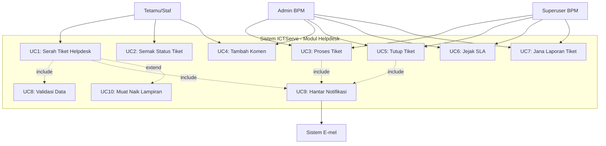
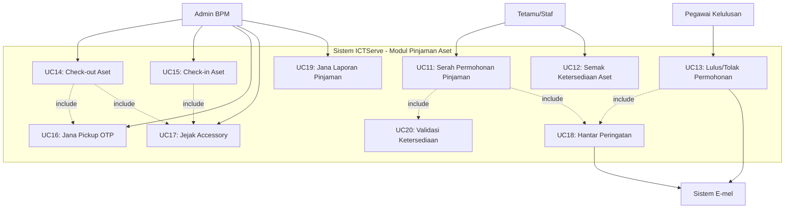
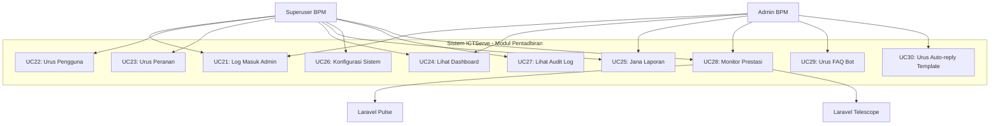
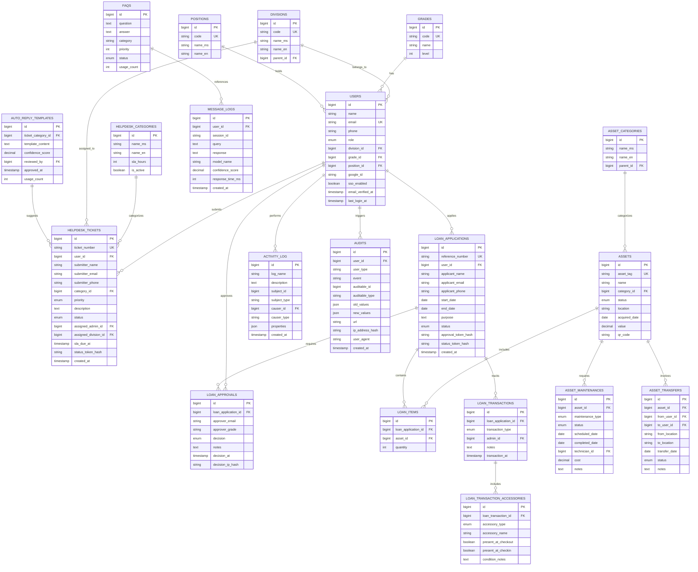
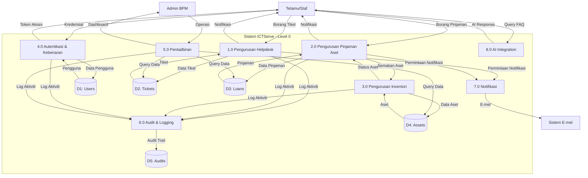
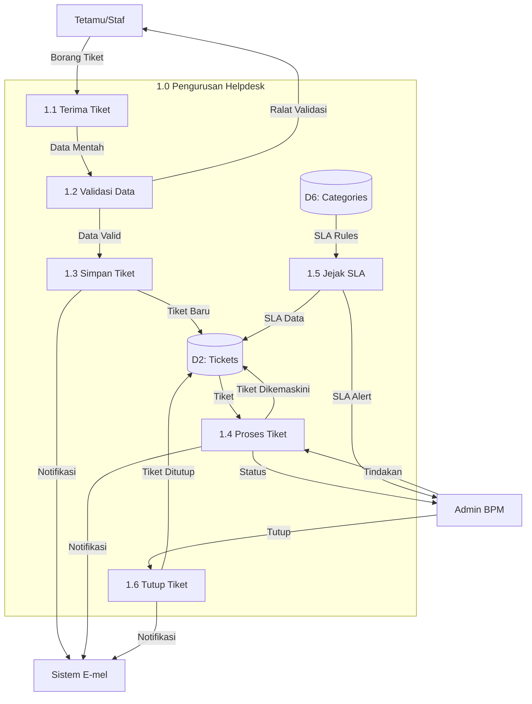
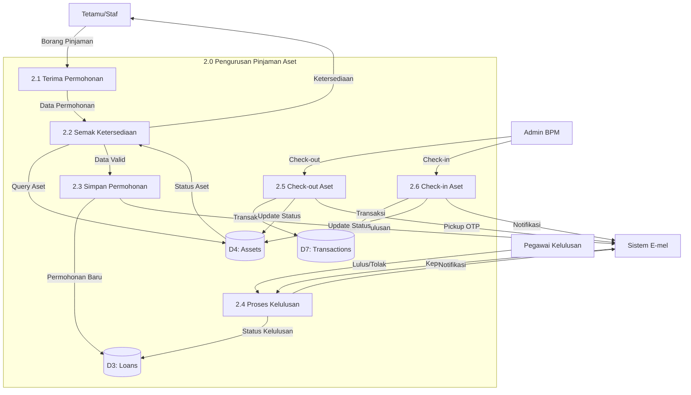

# D03 DOKUMEN SPESIFIKASI KEPERLUAN SISTEM (SRS)

**SISTEM ICTSERVE**

*(Sistem Pengurusan Helpdesk dan Pinjaman Aset ICT)*

| | |
| :--- | :--- |
| **NAMA AGENSI** | : Bahagian Pengurusan Maklumat (BPM) |
| **NAMA AGENSI INDUK** | : Kementerian Pelancongan, Seni dan Budaya Malaysia (MOTAC) |
| **TARIKH DOKUMEN** | : 17 Disember 2025 |
| **VERSI DOKUMEN** | : 3.6.1 |

---

## i. Keterangan Dokumen

Dokumen ini menyatakan spesifikasi keperluan sistem bagi ICTServe, sebuah platform web dalaman untuk pengurusan tiket helpdesk dan permohonan pinjaman aset ICT bagi kegunaan warga kerja MOTAC. Dokumen ini merangkumi keperluan fungsional, keperluan bukan fungsional, pemodelan sistem (use case, data, proses), dan pengiraan saiz sistem menggunakan Function Points Analysis.

Sistem ICTServe dibina menggunakan Laravel 12.43.1, Livewire 3.7.3, Filament 4.3.1, dan mematuhi piawaian ISO/IEC/IEEE 29148 (Requirements Engineering), WCAG 2.2 AA (Web Content Accessibility Guidelines), OWASP ASVS L2 (Application Security Verification Standard), dan MyGOV Digital Service Standards v2.1.0.

## ii. Semakan dan Pengesahan Dokumen

**SEMAKAN DOKUMEN**

| Disemak Oleh | Jawatan | Tandatangan | Tarikh Semakan |
| :--- | :--- | :--- | :--- |
| | Penganalisis Sistem Kanan | | |
| | Ketua Pembangun Sistem | | |

**PENGESAHAN DOKUMEN**

| Disahkan Oleh | Jawatan | Tandatangan | Tarikh Semakan |
| :--- | :--- | :--- | :--- |
| | Pengurus Projek | | |
| | Ketua Bahagian Pengurusan Maklumat | | |

## iii. Kawalan Dokumen

**KAWALAN DOKUMEN**

| No. Versi | Tarikh | Ringkasan Pindaan | Penyedia |
| :--- | :--- | :--- | :--- |
| 1.0.0 | September 2024 | Versi awal spesifikasi keperluan sistem | Pasukan BPM |
| 2.0.0 | 17 Oktober 2024 | Penyeragaman mengikut D00-D14, SemVer, cross-reference | Pasukan BPM |
| 3.0.0 | 31 Oktober 2025 | Penjajaran penuh kepada seni bina dalaman (internal-only) | Pasukan BPM |
| 3.5.0 | 30 November 2025 | True Hybrid Architecture, dual audit system, Laravel Telescope | Pasukan BPM |
| 3.6.0 | 8 Disember 2025 | Bahasa Melayu sahaja, Cloud Hybrid AI (D18) | Pasukan BPM |
| 3.6.1 | 17 Disember 2025 | Kemaskini teknologi stack, AI integration, asset management | Pasukan BPM |

## iv. Kandungan

1. PENGENALAN
   - 1.1. Tujuan Sistem
   - 1.2. Skop Sistem
   - 1.3. Senarai Aktor Sistem
2. PEMODELAN FUNGSI SISTEM
   - 2.1. Penggunaan Notasi
   - 2.2. Rajah Hierarki Fungsian Sistem
   - 2.3. Jadual Pemadanan Aktor Dengan Fungsi Sistem
3. PEMODELAN USE CASE
   - 3.1. Penggunaan Notasi
   - 3.2. Model Use Case
4. PEMODELAN MAKLUMAT
   - 4.1. Penggunaan Notasi
   - 4.2. Model Maklumat
   - 4.3. Definisi Kamus Data
5. PEMODELAN PROSES SISTEM
   - 5.1. Penggunaan Notasi
   - 5.2. Model Proses Sistem
   - 5.3. Definisi Aliran Data
6. PENENTUAN KEPERLUAN BUKAN FUNGSIAN
   - 6.1. Jadual Ciri-ciri Kualiti Sistem
7. PENENTUAN SAIZ SISTEM APLIKASI
8. LAMPIRAN

## v. Senarai Gambarajah

| No. | Tajuk Gambarajah | Muka Surat |
| :--- | :--- | :--- |
| 1 | Rajah Hierarki Fungsian Sistem ICTServe | §2.2 |
| 2 | Use Case Diagram - Modul Helpdesk | §3.2 |
| 3 | Use Case Diagram - Modul Pinjaman Aset | §3.2 |
| 4 | Use Case Diagram - Modul Pentadbiran | §3.2 |
| 5 | Entity Relationship Diagram (ERD) | §4.2 |
| 6 | Rajah Konteks Sistem | §5.2 |
| 7 | Data Flow Diagram Level 0 | §5.2 |
| 8 | Data Flow Diagram Level 1 - Helpdesk | §5.2 |
| 9 | Data Flow Diagram Level 1 - Pinjaman Aset | §5.2 |

## vi. Senarai Jadual

| No. | Tajuk Jadual | Muka Surat |
| :--- | :--- | :--- |
| 1 | Senarai Aktor Sistem | §1.3 |
| 2 | Notasi Hierarki Fungsian | §2.1 |
| 3 | Pemadanan Aktor Dengan Fungsi | §2.3 |
| 4 | Notasi Use Case | §3.1 |
| 5 | Senarai Use Case Helpdesk | §3.2 |
| 6 | Senarai Use Case Pinjaman Aset | §3.2 |
| 7 | Notasi ERD | §4.1 |
| 8 | Definisi Entiti - Users | §4.3 |
| 9 | Definisi Entiti - Helpdesk Tickets | §4.3 |
| 10 | Definisi Entiti - Loan Applications | §4.3 |
| 11 | Notasi Data Flow Diagram | §5.1 |
| 12 | Definisi Aliran Data | §5.3 |
| 13 | Keperluan Bukan Fungsian | §6.1 |
| 14 | Pengiraan Function Points | §7 |

## vii. Definisi dan Akronim

### a. Akronim

| Akronim | Keterangan |
| :--- | :--- |
| API | Application Programming Interface |
| ASVS | Application Security Verification Standard |
| BPM | Bahagian Pengurusan Maklumat |
| CRUD | Create, Read, Update, Delete |
| DFD | Data Flow Diagram |
| ERD | Entity Relationship Diagram |
| ICT | Information and Communication Technology |
| MOTAC | Kementerian Pelancongan, Seni dan Budaya Malaysia |
| MVC | Model-View-Controller |
| OWASP | Open Web Application Security Project |
| PDPA | Personal Data Protection Act 2010 |
| SDUI | Server-Driven User Interface |
| SLA | Service Level Agreement |
| SRS | Software Requirements Specification |
| SSO | Single Sign-On |
| UAT | User Acceptance Testing |
| WCAG | Web Content Accessibility Guidelines |

### b. Definisi

| Terma/Istilah | Definisi |
| :--- | :--- |
| True Hybrid Architecture | Seni bina sistem yang menyokong akses tetamu (tanpa log masuk) dan pengguna berdaftar (dengan log masuk) |
| Authenticated Staff | Staf yang log masuk menggunakan Laravel Breeze untuk akses My Dashboard |
| Guest/Quick Access | Staf yang menggunakan borang tanpa log masuk, dijejaki melalui token |
| Hybrid Data Association | Kaedah penyimpanan data di mana user_id adalah nullable FK - jika log masuk, link ke user_id; jika tetamu, user_id=NULL |
| My Dashboard | Portal peribadi untuk staf berdaftar melihat sejarah penyerahan dan profil |
| Livewire | Framework PHP untuk membina antara muka reaktif tanpa menulis JavaScript |
| Filament | Framework admin panel berasaskan Laravel dengan SDUI |
| Laravel Reverb | Pelayan WebSocket native Laravel untuk komunikasi real-time |
| Dual Audit System | Sistem audit berganda (owen-it + spatie) untuk pematuhan dan operasi |
| Signed Approval Link | Pautan dengan token bertanda tangan (JWT + hash) untuk kelulusan tanpa log masuk |

## viii. Sumber Rujukan

1. **ISO/IEC/IEEE 29148:2018** - Systems and software engineering - Life cycle processes - Requirements engineering
2. **ISO/IEC/IEEE 15288:2015** - Systems and software engineering - System life cycle processes
3. **WCAG 2.2** - Web Content Accessibility Guidelines Level AA
4. **OWASP ASVS L2** - Application Security Verification Standard Level 2
5. **MyGOV Digital Service Standards v2.1.0** - Malaysian Government Digital Service Standards
6. **Personal Data Protection Act 2010 (PDPA)** - Malaysian data protection legislation
7. **Laravel 12 Documentation** - <https://laravel.com/docs/12.x>
8. **Livewire 3 Documentation** - <https://livewire.laravel.com/docs/3.x>
9. **Filament 4 Documentation** - <https://filamentphp.com/docs/4.x>
10. **D00_SYSTEM_OVERVIEW.md** - Ringkasan Sistem ICTServe v3.6.1
11. **D01_SYSTEM_DEVELOPMENT_PLAN.md** - Pelan Pembangunan Sistem v3.6.1
12. **D02_BUSINESS_REQUIREMENTS_SPECIFICATION.md** - Spesifikasi Keperluan Perniagaan v3.6.1
13. **D04_SOFTWARE_DESIGN_DOCUMENT.md** - Dokumen Rekabentuk Perisian v3.6.1
14. **D09_DATABASE_DOCUMENTATION.md** - Dokumentasi Pangkalan Data v3.5.0
15. **D18_AI_CHATBOT_OLLAMA_BEDROCK.md** - Cloud Hybrid AI Architecture v1.0.1

---

## 1. PENGENALAN

### 1.1. Tujuan Sistem

Sistem ICTServe dibangunkan untuk memenuhi keperluan Bahagian Pengurusan Maklumat (BPM) MOTAC dalam menguruskan perkhidmatan sokongan ICT secara sistematik dan teratur. Tujuan utama sistem ini adalah:

1. **Mengautomasikan Proses Helpdesk**: Menggantikan proses manual menggunakan borang kertas dan e-mel dengan sistem tiket digital yang teratur.

2. **Memudahkan Pinjaman Aset ICT**: Menyediakan platform berpusat untuk permohonan pinjaman peralatan ICT dengan aliran kelulusan automatik.

3. **Meningkatkan Ketelusan**: Membolehkan staf MOTAC memantau status aduan dan permohonan pinjaman secara real-time.

4. **Mematuhi Piawaian Kerajaan**: Memastikan sistem mematuhi MyGOV Digital Service Standards v2.1.0, WCAG 2.2 AA untuk aksesibiliti, dan PDPA 2010 untuk perlindungan data peribadi.

5. **Menyokong Keputusan Pengurusan**: Menyediakan dashboard analitik dan laporan untuk membantu pengurusan BPM membuat keputusan berasaskan data.

6. **Meningkatkan Kecekapan Operasi**: Mengurangkan masa pemprosesan tiket dan permohonan pinjaman melalui automasi dan SLA tracking.

### 1.2. Skop Sistem

Skop sistem ICTServe merangkumi:

#### 1.2.1. Skop Fungsional

**Modul Utama:**

1. **Helpdesk Ticketing System**
   - Borang penyerahan tiket (hybrid: tetamu atau authenticated)
   - Pengurusan kategori dan keutamaan tiket
   - SLA tracking dan eskalasi automatik
   - Komunikasi dua hala (admin-pemohon)
   - Lampiran fail dengan virus scanning

2. **Asset Loan Management**
   - Borang permohonan pinjaman (hybrid: tetamu atau authenticated)
   - Pemeriksaan ketersediaan aset real-time
   - Aliran kelulusan e-mel (Gred 41+)
   - Check-out/Check-in aset dengan accessory tracking
   - Pickup OTP untuk keselamatan

3. **Inventory Management**
   - Pengurusan inventori aset ICT
   - QR code generation untuk asset tracking
   - Status tracking (Available, In Use, Maintenance, Retired)
   - Maintenance scheduling

4. **Authentication & Authorization**
   - Self-registration (@motac.gov.my)
   - Flexible login (email/username)
   - Optional Google Workspace SSO
   - Role-based access control (staff, admin, superuser)

5. **Admin Panel (Filament)**
   - Dashboard dengan real-time widgets
   - Pengurusan tiket dan permohonan
   - Laporan dan analitik
   - Konfigurasi sistem

6. **Audit Trail (Dual System)**
   - Owen-it Laravel Auditing (compliance, 7 tahun)
   - Spatie Activity Log (operations, 7 tahun)

7. **Real-time Communication**
   - Laravel Reverb WebSocket server
   - Laravel Echo client
   - Notifikasi real-time

8. **Performance Monitoring**
   - Laravel Pulse (admin/superuser)
   - Slow query detection
   - Queue metrics
   - Server health monitoring

9. **API Authentication**
   - Laravel Sanctum token-based API
   - Configurable abilities
   - Token expiration management

10. **AI Integration (Cloud Hybrid)**
    - FAQ Bot (Ollama + AWS Bedrock)
    - Auto-reply generation
    - Document analysis
    - Conversation management

#### 1.2.2. Skop Teknikal

- **Platform**: Laravel 12.43.1, PHP 8.2.12
- **Frontend**: Livewire 3.7.3, Volt 1.10.1, Alpine.js 3, Tailwind CSS 4.1.18
- **Database**: MySQL 8.0 (utf8mb4)
- **Caching/Queue**: Redis 7.0
- **Real-time**: Laravel Reverb 1.6.3, Laravel Echo 2.2.6
- **Admin Panel**: Filament 4.3.1
- **Monitoring**: Laravel Telescope 5.x (superuser), Laravel Pulse 1.4.7 (admin/superuser)

#### 1.2.3. Skop Pengguna

- **Staf MOTAC**: Pengguna utama sistem (authenticated atau guest)
- **Pegawai Kelulusan (Gred 41+)**: Meluluskan permohonan pinjaman via e-mel
- **Admin BPM**: Memproses tiket dan permohonan
- **Superuser BPM**: Pentadbiran sistem dan konfigurasi

#### 1.2.4. Di Luar Skop

- Portal awam untuk pengguna luar
- Modul self-service untuk kemaskini profil pengguna awam
- Integrasi dengan sistem kewangan MOTAC
- Mobile application (future enhancement)

### 1.3. Senarai Aktor Sistem

**Jadual 1: Senarai Aktor Sistem**

| Bil. | Aktor | Peranan | Keterangan Fungsi |
| :--- | :--- | :--- | :--- |
| 1 | Tetamu (Guest) | Pengguna | Staf MOTAC yang menggunakan borang tanpa log masuk. Akses quick submission untuk tiket dan pinjaman. Dijejaki via token. |
| 2 | Staf Berdaftar (Authenticated Staff) | Pengguna | Staf MOTAC yang log masuk menggunakan Laravel Breeze. Akses My Dashboard, view history, auto-fill forms. |
| 3 | Pegawai Kelulusan (Approver) | Kelulusan | Pegawai Gred 41+ yang meluluskan permohonan pinjaman via signed email link. Tiada log masuk diperlukan. |
| 4 | Admin BPM | Pentadbir | Pegawai BPM yang memproses tiket helpdesk dan permohonan pinjaman melalui Filament panel. Akses operasi penuh. |
| 5 | Superuser BPM | Pentadbir Sistem | Pegawai BPM yang mentadbir konfigurasi sistem, integrasi, audit, dan Laravel Telescope. Akses penuh tanpa sekatan. |
| 6 | Sistem E-mel | Sistem Luaran | SMTP server kerajaan untuk menghantar notifikasi e-mel. |
| 7 | Sistem SMS | Sistem Luaran | SMS gateway BPM untuk menghantar notifikasi SMS (opsyenal). |
| 8 | Google Workspace | Sistem Luaran | OAuth 2.0 provider untuk SSO (opsyenal, @motac.gov.my sahaja). |
| 9 | Ollama AI Server | Sistem Luaran | Local LLM server untuk FAQ bot dan auto-reply generation. |
| 10 | AWS Bedrock | Sistem Luaran | Cloud AI service untuk complex reasoning dan document analysis. |

---

## 2. PEMODELAN FUNGSI SISTEM

### 2.1. Penggunaan Notasi

**Jadual 2: Notasi Hierarki Fungsian**

| Notasi | Keterangan | Contoh |
| :--- | :--- | :--- |
| **S** | Sistem | S - ICTServe |
| **SS** | Subsistem | SS1 - Helpdesk Ticketing |
| **F** | Fungsi | F1.1 - Pengurusan Tiket |
| **M** | Modul | M1.1.1 - Penyerahan Tiket |
| **SM** | Submodul | SM1.1.1.1 - Borang Tiket |
| **T** | Transaksi | T1.1.1.1.1 - Simpan Tiket |

### 2.2. Rajah Hierarki Fungsian Sistem

```mermaid
graph TD
    S[S - ICTServe]
    
    S --> SS1[SS1 - Helpdesk Ticketing]
    S --> SS2[SS2 - Asset Loan Management]
    S --> SS3[SS3 - Inventory Management]
    S --> SS4[SS4 - Authentication & Authorization]
    S --> SS5[SS5 - Admin Panel]
    S --> SS6[SS6 - Audit & Logging]
    S --> SS7[SS7 - Real-time Communication]
    S --> SS8[SS8 - AI Integration]
    
    SS1 --> F1.1[F1.1 - Pengurusan Tiket]
    SS1 --> F1.2[F1.2 - Komunikasi]
    SS1 --> F1.3[F1.3 - SLA Tracking]
    
    F1.1 --> M1.1.1[M1.1.1 - Penyerahan Tiket]
    F1.1 --> M1.1.2[M1.1.2 - Pemprosesan Tiket]
    F1.1 --> M1.1.3[M1.1.3 - Penutupan Tiket]
    
    M1.1.1 --> SM1.1.1.1[SM1.1.1.1 - Borang Tiket]
    M1.1.1 --> SM1.1.1.2[SM1.1.1.2 - Validasi Data]
    M1.1.1 --> SM1.1.1.3[SM1.1.1.3 - Lampiran Fail]
    
    SM1.1.1.1 --> T1.1.1.1.1[T1.1.1.1.1 - Simpan Tiket]
    SM1.1.1.1 --> T1.1.1.1.2[T1.1.1.1.2 - Jana Nombor Tiket]
    SM1.1.1.1 --> T1.1.1.1.3[T1.1.1.1.3 - Hantar Notifikasi]
    
    SS2 --> F2.1[F2.1 - Pengurusan Permohonan]
    SS2 --> F2.2[F2.2 - Aliran Kelulusan]
    SS2 --> F2.3[F2.3 - Pengurusan Aset]
    
    F2.1 --> M2.1.1[M2.1.1 - Penyerahan Permohonan]
    F2.1 --> M2.1.2[M2.1.2 - Semakan Ketersediaan]
    F2.1 --> M2.1.3[M2.1.3 - Check-out/Check-in]
    
    SS3 --> F3.1[F3.1 - Pengurusan Inventori]
    SS3 --> F3.2[F3.2 - Penyelenggaraan Aset]
    SS3 --> F3.3[F3.3 - Pemindahan Aset]
    
    SS4 --> F4.1[F4.1 - Pendaftaran Pengguna]
    SS4 --> F4.2[F4.2 - Autentikasi]
    SS4 --> F4.3[F4.3 - Kawalan Akses]
    
    SS5 --> F5.1[F5.1 - Dashboard]
    SS5 --> F5.2[F5.2 - Laporan]
    SS5 --> F5.3[F5.3 - Konfigurasi]
    
    SS6 --> F6.1[F6.1 - Audit Pematuhan]
    SS6 --> F6.2[F6.2 - Audit Operasi]
    SS6 --> F6.3[F6.3 - Unified Audit View]
    
    SS7 --> F7.1[F7.1 - WebSocket Server]
    SS7 --> F7.2[F7.2 - Notifikasi Real-time]
    SS7 --> F7.3[F7.3 - Live Updates]
    
    SS8 --> F8.1[F8.1 - FAQ Bot]
    SS8 --> F8.2[F8.2 - Auto-reply Generation]
    SS8 --> F8.3[F8.3 - Document Analysis]
```

### 2.3. Jadual Pemadanan Aktor Dengan Fungsi Sistem

**Jadual 3: Pemadanan Aktor Dengan Fungsi**

| Fungsi | Tetamu | Staf | Approver | Admin | Superuser |
| :--- | :---: | :---: | :---: | :---: | :---: |
| **F1.1 - Pengurusan Tiket** | ✓ | ✓ | | ✓ | ✓ |
| M1.1.1 - Penyerahan Tiket | ✓ | ✓ | | | |
| M1.1.2 - Pemprosesan Tiket | | | | ✓ | ✓ |
| M1.1.3 - Penutupan Tiket | | | | ✓ | ✓ |
| **F1.2 - Komunikasi** | ✓ | ✓ | | ✓ | ✓ |
| **F1.3 - SLA Tracking** | | | | ✓ | ✓ |
| **F2.1 - Pengurusan Permohonan** | ✓ | ✓ | | ✓ | ✓ |
| M2.1.1 - Penyerahan Permohonan | ✓ | ✓ | | | |
| M2.1.2 - Semakan Ketersediaan | ✓ | ✓ | | ✓ | ✓ |
| M2.1.3 - Check-out/Check-in | | | | ✓ | ✓ |
| **F2.2 - Aliran Kelulusan** | | | ✓ | ✓ | ✓ |
| **F2.3 - Pengurusan Aset** | | | | ✓ | ✓ |
| **F3.1 - Pengurusan Inventori** | | | | ✓ | ✓ |
| **F3.2 - Penyelenggaraan Aset** | | ✓ | | ✓ | ✓ |
| **F3.3 - Pemindahan Aset** | | | | ✓ | ✓ |
| **F4.1 - Pendaftaran Pengguna** | | ✓ | | | |
| **F4.2 - Autentikasi** | | ✓ | | ✓ | ✓ |
| **F4.3 - Kawalan Akses** | | | | | ✓ |
| **F5.1 - Dashboard** | | ✓ | | ✓ | ✓ |
| **F5.2 - Laporan** | | | | ✓ | ✓ |
| **F5.3 - Konfigurasi** | | | | | ✓ |
| **F6.1 - Audit Pematuhan** | | | | | ✓ |
| **F6.2 - Audit Operasi** | | | | ✓ | ✓ |
| **F6.3 - Unified Audit View** | | | | | ✓ |
| **F7.1 - WebSocket Server** | | | | ✓ | ✓ |
| **F7.2 - Notifikasi Real-time** | | ✓ | | ✓ | ✓ |
| **F8.1 - FAQ Bot** | ✓ | ✓ | | ✓ | ✓ |
| **F8.2 - Auto-reply Generation** | | | | ✓ | ✓ |
| **F8.3 - Document Analysis** | | | | ✓ | ✓ |

---

## 3. PEMODELAN USE CASE

### 3.1. Penggunaan Notasi

**Jadual 4: Notasi Use Case**

| Notasi | Simbol | Keterangan |
| :--- | :--- | :--- |
| **Aktor** | Stick figure | Pengguna atau sistem luaran yang berinteraksi dengan sistem |
| **Use Case** | Oval | Fungsi atau perkhidmatan yang disediakan oleh sistem |
| **Sistem Boundary** | Rectangle | Had sistem yang sedang dimodelkan |
| **Association** | Solid line | Hubungan antara aktor dengan use case |
| **Include** | Dashed arrow (<<include>>) | Use case yang sentiasa dipanggil oleh use case lain |
| **Extend** | Dashed arrow (<<extend>>) | Use case opsyenal yang mungkin dipanggil |
| **Generalization** | Solid arrow | Hubungan pewarisan antara aktor atau use case |

### 3.2. Model Use Case

#### 3.2.1. Use Case Diagram - Modul Helpdesk

**Jadual 5: Senarai Use Case Helpdesk**

| ID | Nama Use Case | Aktor Utama | Keterangan |
| :--- | :--- | :--- | :--- |
| UC1 | Serah Tiket Helpdesk | Tetamu/Staf | Pengguna mengisi borang tiket dengan maklumat aduan ICT. Sistem validasi data dan jana nombor tiket. |
| UC2 | Semak Status Tiket | Tetamu/Staf | Pengguna semak status tiket menggunakan token (tetamu) atau My Dashboard (staf). |
| UC3 | Proses Tiket | Admin/Superuser | Admin memproses tiket: assign, update status, tambah internal comments. |
| UC4 | Tambah Komen | Tetamu/Staf/Admin | Pengguna atau admin tambah komen pada tiket untuk komunikasi dua hala. |
| UC5 | Tutup Tiket | Admin/Superuser | Admin tutup tiket selepas masalah diselesaikan. Sistem hantar notifikasi penutupan. |
| UC6 | Jejak SLA | Admin/Superuser | Sistem jejak masa tindak balas dan penyelesaian mengikut SLA. Eskalasi automatik jika melebihi had. |
| UC7 | Jana Laporan Tiket | Admin/Superuser | Admin jana laporan statistik tiket: kategori, status, masa penyelesaian, SLA compliance. |
| UC8 | Validasi Data | Sistem | Sistem validasi format e-mel, telefon, had lampiran, medan wajib. |
| UC9 | Hantar Notifikasi | Sistem | Sistem hantar notifikasi e-mel kepada pengguna dan admin untuk setiap perubahan status. |
| UC10 | Muat Naik Lampiran | Tetamu/Staf | Pengguna muat naik fail lampiran (PDF, gambar) untuk sokongan tiket. Maksimum 5 fail, 10MB setiap. |

#### 3.2.2. Use Case Diagram - Modul Pinjaman Aset

**Jadual 6: Senarai Use Case Pinjaman Aset**

| ID | Nama Use Case | Aktor Utama | Keterangan |
| :--- | :--- | :--- | :--- |
| UC11 | Serah Permohonan Pinjaman | Tetamu/Staf | Pengguna mengisi borang permohonan pinjaman aset dengan butiran aset, tarikh, tujuan. |
| UC12 | Semak Ketersediaan Aset | Tetamu/Staf | Sistem semak ketersediaan aset real-time berdasarkan tarikh pinjaman. Papar alternatif jika tidak tersedia. |
| UC13 | Lulus/Tolak Permohonan | Pegawai Kelulusan | Pegawai Gred 41+ lulus atau tolak permohonan via signed email link. Tiada log masuk diperlukan. |
| UC14 | Check-out Aset | Admin | Admin check-out aset kepada peminjam. Rekod accessory yang diserahkan. Jana pickup OTP. |
| UC15 | Check-in Aset | Admin | Admin check-in aset selepas dipulangkan. Semak kondisi dan accessory. Rekod kerosakan jika ada. |
| UC16 | Jana Pickup OTP | Admin | Sistem jana 4-digit OTP untuk keselamatan pengambilan aset. Valid 24 jam. |
| UC17 | Jejak Accessory | Admin | Sistem jejak accessory (power adapter, bag, mouse, cable) semasa check-out dan check-in. Detect discrepancy. |
| UC18 | Hantar Peringatan | Sistem | Sistem hantar peringatan e-mel 3 hari sebelum tarikh pulang. Hantar notifikasi overdue jika lewat. |
| UC19 | Jana Laporan Pinjaman | Admin | Admin jana laporan statistik pinjaman: aset popular, kadar kelulusan, overdue rate. |
| UC20 | Validasi Ketersediaan | Sistem | Sistem validasi ketersediaan aset berdasarkan loan_transactions. Detect konflik tempahan. |

#### 3.2.3. Use Case Diagram - Modul Pentadbiran

---

## 4. PEMODELAN MAKLUMAT

### 4.1. Penggunaan Notasi

**Jadual 7: Notasi ERD**

| Notasi | Simbol | Keterangan |
| :--- | :--- | :--- |
| **Entiti** | Rectangle | Objek atau konsep yang menyimpan data |
| **Atribut** | Oval | Ciri-ciri atau sifat entiti |
| **Primary Key** | Underlined | Atribut yang mengenal pasti unik setiap rekod |
| **Foreign Key** | FK | Atribut yang merujuk kepada primary key entiti lain |
| **Relationship** | Diamond | Hubungan antara entiti |
| **Cardinality 1:1** | 1 --- 1 | Satu ke satu |
| **Cardinality 1:N** | 1 --- N | Satu ke banyak |
| **Cardinality M:N** | M --- N | Banyak ke banyak |

### 4.2. Model Maklumat (Entity Relationship Diagram)

### 4.3. Definisi Kamus Data

#### 4.3.1. Entiti USERS

**Jadual 8: Definisi Entiti - Users**

| Atribut | Jenis Data | Panjang | Nullable | Keterangan |
| :--- | :--- | :--- | :--- | :--- |
| id | BIGINT | - | NO | Primary key, auto-increment |
| name | VARCHAR | 255 | NO | Nama penuh pengguna |
| email | VARCHAR | 255 | NO | E-mel rasmi (@motac.gov.my), unique |
| phone | VARCHAR | 20 | YES | Nombor telefon |
| password | VARCHAR | 255 | NO | Password hash (bcrypt) |
| role | ENUM | - | NO | Peranan: staff, admin, superuser |
| division_id | BIGINT | - | YES | FK ke divisions.id |
| grade_id | BIGINT | - | YES | FK ke grades.id |
| position_id | BIGINT | - | YES | FK ke positions.id |
| google_id | VARCHAR | 255 | YES | Google OAuth ID untuk SSO |
| sso_enabled | BOOLEAN | - | NO | Status SSO aktif (default: false) |
| email_verified_at | TIMESTAMP | - | YES | Tarikh verifikasi e-mel |
| last_login_at | TIMESTAMP | - | YES | Tarikh log masuk terakhir |
| created_at | TIMESTAMP | - | NO | Tarikh dicipta |
| updated_at | TIMESTAMP | - | NO | Tarikh dikemaskini |

**Constraint:**

- PRIMARY KEY (id)
- UNIQUE KEY (email)
- FOREIGN KEY (division_id) REFERENCES divisions(id) ON DELETE SET NULL
- FOREIGN KEY (grade_id) REFERENCES grades(id) ON DELETE SET NULL
- FOREIGN KEY (position_id) REFERENCES positions(id) ON DELETE SET NULL
- INDEX (role)
- INDEX (email_verified_at)

#### 4.3.2. Entiti HELPDESK_TICKETS

**Jadual 9: Definisi Entiti - Helpdesk Tickets**

| Atribut | Jenis Data | Panjang | Nullable | Keterangan |
| :--- | :--- | :--- | :--- | :--- |
| id | BIGINT | - | NO | Primary key, auto-increment |
| ticket_number | VARCHAR | 50 | NO | Nombor tiket unik (format: TKT-YYYYMMDD-XXXX) |
| user_id | BIGINT | - | YES | FK ke users.id (nullable untuk hybrid) |
| submitter_name | VARCHAR | 255 | NO | Nama pemohon |
| submitter_email | VARCHAR | 255 | NO | E-mel pemohon |
| submitter_phone | VARCHAR | 20 | YES | Telefon pemohon |
| submitter_division_code | VARCHAR | 50 | YES | Kod bahagian pemohon |
| submitter_grade | VARCHAR | 10 | YES | Gred pemohon |
| category_id | BIGINT | - | NO | FK ke helpdesk_categories.id |
| priority | ENUM | - | NO | Keutamaan: LOW, MEDIUM, HIGH, CRITICAL |
| description | TEXT | - | NO | Deskripsi masalah |
| status | ENUM | - | NO | Status: OPEN, IN_PROGRESS, AWAITING_INFO, RESOLVED, CLOSED |
| assigned_admin_id | BIGINT | - | YES | FK ke users.id (admin yang ditugaskan) |
| assigned_division_id | BIGINT | - | YES | FK ke divisions.id |
| sla_due_at | TIMESTAMP | - | YES | Tarikh tamat SLA |
| status_token_hash | VARCHAR | 128 | NO | SHA-512 hash untuk semakan status tetamu |
| created_at | TIMESTAMP | - | NO | Tarikh dicipta |
| updated_at | TIMESTAMP | - | NO | Tarikh dikemaskini |
| deleted_at | TIMESTAMP | - | YES | Soft delete timestamp |

**Constraint:**

- PRIMARY KEY (id)
- UNIQUE KEY (ticket_number)
- FOREIGN KEY (user_id) REFERENCES users(id) ON DELETE SET NULL
- FOREIGN KEY (category_id) REFERENCES helpdesk_categories(id)
- FOREIGN KEY (assigned_admin_id) REFERENCES users(id) ON DELETE SET NULL
- FOREIGN KEY (assigned_division_id) REFERENCES divisions(id) ON DELETE SET NULL
- INDEX (user_id)
- INDEX (status)
- INDEX (created_at)
- INDEX (sla_due_at)

#### 4.3.3. Entiti LOAN_APPLICATIONS

**Jadual 10: Definisi Entiti - Loan Applications**

| Atribut | Jenis Data | Panjang | Nullable | Keterangan |
| :--- | :--- | :--- | :--- | :--- |
| id | BIGINT | - | NO | Primary key, auto-increment |
| reference_number | VARCHAR | 50 | NO | Nombor rujukan unik (format: LOAN-YYYYMMDD-XXXX) |
| user_id | BIGINT | - | YES | FK ke users.id (nullable untuk hybrid) |
| applicant_name | VARCHAR | 255 | NO | Nama pemohon |
| applicant_email | VARCHAR | 255 | NO | E-mel pemohon |
| applicant_phone | VARCHAR | 20 | YES | Telefon pemohon |
| applicant_division_code | VARCHAR | 50 | YES | Kod bahagian pemohon |
| applicant_grade | VARCHAR | 10 | YES | Gred pemohon |
| start_date | DATE | - | NO | Tarikh mula pinjaman |
| end_date | DATE | - | NO | Tarikh tamat pinjaman |
| purpose | TEXT | - | NO | Tujuan pinjaman |
| status | ENUM | - | NO | Status: PENDING, APPROVED, REJECTED, ACTIVE, COMPLETED, CANCELLED |
| approval_token_hash | VARCHAR | 128 | YES | SHA-512 hash untuk kelulusan e-mel |
| status_token_hash | VARCHAR | 128 | NO | SHA-512 hash untuk semakan status tetamu |
| created_at | TIMESTAMP | - | NO | Tarikh dicipta |
| updated_at | TIMESTAMP | - | NO | Tarikh dikemaskini |

**Constraint:**

- PRIMARY KEY (id)
- UNIQUE KEY (reference_number)
- FOREIGN KEY (user_id) REFERENCES users(id) ON DELETE SET NULL
- INDEX (user_id)
- INDEX (status)
- INDEX (start_date, end_date)
- INDEX (created_at)

---

## 5. PEMODELAN PROSES SISTEM

### 5.1. Penggunaan Notasi

**Jadual 11: Notasi Data Flow Diagram**

| Notasi | Simbol | Keterangan |
| :--- | :--- | :--- |
| **External Entity** | Rectangle | Entiti luaran yang berinteraksi dengan sistem |
| **Process** | Circle/Rounded Rectangle | Proses transformasi data |
| **Data Store** | Open Rectangle | Simpanan data (database, file) |
| **Data Flow** | Arrow | Aliran data antara komponen |

### 5.2. Model Proses Sistem

#### 5.2.1. Rajah Konteks Sistem

```mermaid
graph TD
    subgraph "Sistem ICTServe"
        SYSTEM[Sistem ICTServe]
    end
    
    GUEST[Tetamu/Staf]
    ADMIN[Admin BPM]
    SUPERUSER[Superuser BPM]
    APPROVER[Pegawai Kelulusan]
    EMAIL[Sistem E-mel]
    SMS[Sistem SMS]
    GOOGLE[Google Workspace]
    OLLAMA[Ollama AI]
    BEDROCK[AWS Bedrock]
    
    GUEST -->|Borang Tiket/Pinjaman| SYSTEM
    GUEST -->|Semakan Status| SYSTEM
    SYSTEM -->|Notifikasi E-mel| GUEST
    SYSTEM -->|Notifikasi SMS| GUEST
    
    ADMIN -->|Proses Tiket/Pinjaman| SYSTEM
    ADMIN -->|Jana Laporan| SYSTEM
    SYSTEM -->|Dashboard Data| ADMIN
    SYSTEM -->|Notifikasi Real-time| ADMIN
    
    SUPERUSER -->|Konfigurasi Sistem| SYSTEM
    SUPERUSER -->|Lihat Audit| SYSTEM
    SYSTEM -->|Audit Log| SUPERUSER
    SYSTEM -->|Performance Metrics| SUPERUSER
    
    APPROVER -->|Keputusan Kelulusan| SYSTEM
    SYSTEM -->|Pautan Kelulusan| APPROVER
    
    SYSTEM -->|Hantar E-mel| EMAIL
    EMAIL -->|Status Penghantaran| SYSTEM
    
    SYSTEM -->|Hantar SMS| SMS
    SMS -->|Status Penghantaran| SYSTEM
    
    GOOGLE -->|OAuth Token| SYSTEM
    SYSTEM -->|Permintaan SSO| GOOGLE
    
    SYSTEM -->|Query FAQ| OLLAMA
    OLLAMA -->|Response| SYSTEM
    
    SYSTEM -->|Complex Query| BEDROCK
    BEDROCK -->|AI Response| SYSTEM
```

#### 5.2.2. Data Flow Diagram Level 0

#### 5.2.3. Data Flow Diagram Level 1 - Helpdesk

#### 5.2.4. Data Flow Diagram Level 1 - Pinjaman Aset

### 5.3. Definisi Aliran Data

**Jadual 12: Definisi Aliran Data**

| ID | Nama Aliran | Sumber | Destinasi | Keterangan |
| :--- | :--- | :--- | :--- | :--- |
| DF-01 | Borang Tiket | Tetamu/Staf | 1.1 Terima Tiket | Data penyerahan tiket: nama, e-mel, telefon, kategori, deskripsi, lampiran |
| DF-02 | Data Mentah | 1.1 Terima Tiket | 1.2 Validasi Data | Data tiket sebelum validasi |
| DF-03 | Data Valid | 1.2 Validasi Data | 1.3 Simpan Tiket | Data tiket selepas validasi berjaya |
| DF-04 | Ralat Validasi | 1.2 Validasi Data | Tetamu/Staf | Mesej ralat validasi (format e-mel, medan wajib, dll) |
| DF-05 | Tiket Baru | 1.3 Simpan Tiket | D2: Tickets | Rekod tiket baharu dengan ticket_number, status OPEN |
| DF-06 | Notifikasi E-mel | 1.3 Simpan Tiket | Sistem E-mel | E-mel pengesahan dengan nombor tiket dan pautan status |
| DF-07 | Tiket | D2: Tickets | 1.4 Proses Tiket | Data tiket untuk pemprosesan admin |
| DF-08 | Tindakan Admin | Admin BPM | 1.4 Proses Tiket | Tindakan: assign, update status, tambah komen |
| DF-09 | Tiket Dikemaskini | 1.4 Proses Tiket | D2: Tickets | Rekod tiket selepas dikemaskini |
| DF-10 | SLA Rules | D6: Categories | 1.5 Jejak SLA | Peraturan SLA berdasarkan kategori tiket |
| DF-11 | SLA Alert | 1.5 Jejak SLA | Admin BPM | Amaran SLA breach atau hampir breach |
| DF-12 | Borang Pinjaman | Tetamu/Staf | 2.1 Terima Permohonan | Data permohonan pinjaman: pemohon, aset, tarikh, tujuan |
| DF-13 | Query Aset | 2.2 Semak Ketersediaan | D4: Assets | Permintaan semakan ketersediaan aset |
| DF-14 | Status Aset | D4: Assets | 2.2 Semak Ketersediaan | Status ketersediaan aset (available/booked) |
| DF-15 | Permohonan Baru | 2.3 Simpan Permohonan | D3: Loans | Rekod permohonan baharu dengan reference_number |
| DF-16 | Pautan Kelulusan | 2.3 Simpan Permohonan | Sistem E-mel | E-mel kepada pegawai kelulusan dengan signed link |
| DF-17 | Keputusan Kelulusan | Pegawai Kelulusan | 2.4 Proses Kelulusan | Keputusan: APPROVED/REJECTED dengan catatan |
| DF-18 | Status Kelulusan | 2.4 Proses Kelulusan | D3: Loans | Update status permohonan berdasarkan keputusan |
| DF-19 | Transaksi Check-out | 2.5 Check-out Aset | D7: Transactions | Rekod transaksi check-out dengan accessory list |
| DF-20 | Transaksi Check-in | 2.6 Check-in Aset | D7: Transactions | Rekod transaksi check-in dengan kondisi aset |

---

## 6. PENENTUAN KEPERLUAN BUKAN FUNGSIAN

### 6.1. Jadual Ciri-ciri Kualiti Sistem

**Jadual 13: Keperluan Bukan Fungsian**

| Kategori | Aspek | Keperluan | Metrik | Target |
| :--- | :--- | :--- | :--- | :--- |
| **Prestasi** | Response Time | Masa tindak balas halaman | LCP (Largest Contentful Paint) | < 2.5s |
| | | Masa tindak balas API | Response time | < 200ms (95th percentile) |
| | | Masa pemprosesan queue | Job processing time | < 30s (99th percentile) |
| | Throughput | Bilangan pengguna serentak | Concurrent users | 100 pengguna |
| | | Bilangan transaksi per saat | TPS | 50 TPS |
| **Kebolehskalaan** | Horizontal Scaling | Sokongan multiple app servers | Scalability | Ya (Redis session) |
| | Database | Sokongan read replicas | Database scaling | Ya (Master-Slave) |
| | Storage | Sokongan object storage | File storage | Ya (S3/MinIO) |
| **Keselamatan** | Autentikasi | Self-registration dengan verifikasi | Email verification | 24 jam validity |
| | | Optional Google Workspace SSO | OAuth 2.0 | @motac.gov.my sahaja |
| | | 2FA untuk superuser | TOTP | Wajib |
| | Kebenaran | Role-based access control | RBAC | 4 peranan |
| | Penyulitan | Data at rest | Encryption | AES-256 |
| | | Data in transit | TLS | TLS 1.3 |
| | | Password hashing | Hashing | bcrypt |
| | Audit | Compliance audit | Retention | 7 tahun |
| | | Operations audit | Retention | 7 tahun |
| | Rate Limiting | Guest forms | Rate limit | 60 req/min per IP |
| | | API endpoints | Rate limit | 60 req/min per user |
| **Kebolehcapaian** | WCAG Compliance | Pematuhan WCAG 2.2 AA | Accessibility score | 100 (Lighthouse) |
| | Contrast Ratio | Text contrast | Contrast ratio | ≥ 4.5:1 |
| | | UI component contrast | Contrast ratio | ≥ 3:1 |
| | Keyboard Navigation | Semua elemen interaktif | Keyboard accessible | 100% |
| | Screen Reader | Semantic HTML + ARIA | Screen reader support | Ya |
| **Kebolehgunaan** | Bahasa | Antara muka pengguna | Language | Bahasa Melayu sahaja |
| | Responsif | Sokongan peranti | Responsive design | Mobile/Tablet/Desktop |
| | Onboarding | Guided tour untuk pengguna baharu | Tour completion rate | ≥ 70% |
| | Help System | Contextual help tooltips | Help availability | Semua borang |
| **Kebolehpercayaan** | Uptime | Ketersediaan sistem | System uptime | 99.9% |
| | Backup | Database backup | Backup frequency | Harian |
| | | File backup | Backup frequency | Harian |
| | Recovery | Recovery Time Objective | RTO | < 4 jam |
| | | Recovery Point Objective | RPO | < 24 jam |
| **Kebolehselenggaraan** | Code Quality | PSR-12 compliance | Code style | 100% (Laravel Pint) |
| | | Static analysis | PHPStan level | Level 9 (Larastan) |
| | Testing | Unit test coverage | Code coverage | ≥ 80% |
| | | Feature test coverage | Test coverage | ≥ 90% |
| | Documentation | Code documentation | PHPDoc | Semua public methods |
| | | API documentation | OpenAPI | Ya |
| **Pematuhan** | PDPA 2010 | Data protection | Compliance | Ya |
| | MyGOV DSS | Digital service standards | Compliance | v2.1.0 |
| | OWASP ASVS | Application security | Compliance | Level 2 |
| | ISO/IEC 27701 | Privacy management | Compliance | Ya |

---

## 7. PENENTUAN SAIZ SISTEM APLIKASI

### 7.1. Pengiraan Function Points

Pengiraan saiz sistem menggunakan kaedah Function Points Analysis (FPA) berdasarkan IFPUG (International Function Point Users Group) guidelines.

**Jadual 14: Pengiraan Function Points**

#### 7.1.1. External Inputs (EI)

| Fungsi | Kompleksiti | FP |
| :--- | :--- | ---: |
| Borang Tiket Helpdesk | Sederhana | 4 |
| Borang Pinjaman Aset | Tinggi | 6 |
| Borang Pendaftaran Pengguna | Sederhana | 4 |
| Borang Login | Rendah | 3 |
| Borang Kelulusan E-mel | Sederhana | 4 |
| Borang Check-out Aset | Tinggi | 6 |
| Borang Check-in Aset | Tinggi | 6 |
| Borang Penyelenggaraan Aset | Sederhana | 4 |
| Borang Pemindahan Aset | Tinggi | 6 |
| Borang FAQ Bot Query | Rendah | 3 |
| **Jumlah EI** | | **46** |

#### 7.1.2. External Outputs (EO)

| Fungsi | Kompleksiti | FP |
| :--- | :--- | ---: |
| Laporan Tiket (PDF/Excel) | Tinggi | 7 |
| Laporan Pinjaman (PDF/Excel) | Tinggi | 7 |
| Laporan Inventori (PDF/Excel) | Sederhana | 5 |
| Laporan Audit (PDF/Excel) | Tinggi | 7 |
| Dashboard Statistik | Sederhana | 5 |
| Notifikasi E-mel | Sederhana | 5 |
| Notifikasi SMS | Rendah | 4 |
| QR Code Generation | Rendah | 4 |
| Pickup OTP Generation | Rendah | 4 |
| **Jumlah EO** | | **48** |

#### 7.1.3. External Inquiries (EQ)

| Fungsi | Kompleksiti | FP |
| :--- | :--- | ---: |
| Semakan Status Tiket | Rendah | 3 |
| Semakan Status Pinjaman | Rendah | 3 |
| Semakan Ketersediaan Aset | Sederhana | 4 |
| Carian Tiket | Sederhana | 4 |
| Carian Pinjaman | Sederhana | 4 |
| Carian Aset | Sederhana | 4 |
| Lihat Sejarah Tiket | Sederhana | 4 |
| Lihat Sejarah Pinjaman | Sederhana | 4 |
| Lihat Audit Log | Tinggi | 6 |
| FAQ Bot Response | Sederhana | 4 |
| **Jumlah EQ** | | **40** |

#### 7.1.4. Internal Logical Files (ILF)

| Fail | Kompleksiti | FP |
| :--- | :--- | ---: |
| Users | Sederhana | 10 |
| Helpdesk Tickets | Tinggi | 15 |
| Loan Applications | Tinggi | 15 |
| Assets | Sederhana | 10 |
| Loan Transactions | Sederhana | 10 |
| Audits | Sederhana | 10 |
| Activity Log | Sederhana | 10 |
| FAQs | Rendah | 7 |
| Auto-reply Templates | Rendah | 7 |
| Message Logs | Sederhana | 10 |
| **Jumlah ILF** | | **104** |

#### 7.1.5. External Interface Files (EIF)

| Antara Muka | Kompleksiti | FP |
| :--- | :--- | ---: |
| Sistem E-mel (SMTP) | Sederhana | 7 |
| Sistem SMS Gateway | Rendah | 5 |
| Google Workspace OAuth | Sederhana | 7 |
| Ollama AI Server | Sederhana | 7 |
| AWS Bedrock API | Sederhana | 7 |
| Laravel Pulse | Rendah | 5 |
| Laravel Telescope | Rendah | 5 |
| **Jumlah EIF** | | **43** |

#### 7.1.6. Jumlah Unadjusted Function Points (UFP)

| Komponen | Jumlah FP |
| :--- | ---: |
| External Inputs (EI) | 46 |
| External Outputs (EO) | 48 |
| External Inquiries (EQ) | 40 |
| Internal Logical Files (ILF) | 104 |
| External Interface Files (EIF) | 43 |
| **Jumlah UFP** | **281** |

#### 7.1.7. General System Characteristics (GSC)

| Ciri | Tahap Pengaruh (0-5) |
| :--- | ---: |
| Data Communications | 5 |
| Distributed Data Processing | 4 |
| Performance | 5 |
| Heavily Used Configuration | 4 |
| Transaction Rate | 4 |
| Online Data Entry | 5 |
| End-User Efficiency | 5 |
| Online Update | 5 |
| Complex Processing | 4 |
| Reusability | 4 |
| Installation Ease | 3 |
| Operational Ease | 4 |
| Multiple Sites | 2 |
| Facilitate Change | 4 |
| **Jumlah GSC** | **58** |

**Value Adjustment Factor (VAF)** = 0.65 + (0.01 × 58) = **1.23**

**Adjusted Function Points (AFP)** = UFP × VAF = 281 × 1.23 = **345.63 ≈ 346 FP**

#### 7.1.8. Anggaran Usaha dan Kos

Berdasarkan industry standard (Capers Jones):

- **Productivity Rate**: 10 FP per person-month (Laravel/PHP)
- **Person-Months**: 346 / 10 = **34.6 bulan-orang**
- **Duration**: 34.6 / 6 developers = **5.8 bulan ≈ 6 bulan**
- **Cost per Person-Month**: RM 15,000
- **Total Cost**: 34.6 × RM 15,000 = **RM 519,000**

**Ringkasan:**

- **Adjusted Function Points**: 346 FP
- **Anggaran Usaha**: 34.6 bulan-orang
- **Anggaran Tempoh**: 6 bulan (6 developers)
- **Anggaran Kos**: RM 519,000

---

## 8. LAMPIRAN

### 8.1. Borang Rujukan

- Borang Tiket Helpdesk (PK.(S).MOTAC.07.(L1))
- Borang Permohonan Pinjaman Aset (PK.(S).MOTAC.07.(L3))
- Borang Kelulusan Pinjaman
- Borang Check-out/Check-in Aset

### 8.2. Carta Alir

- Carta Alir Penyerahan Tiket Helpdesk
- Carta Alir Kelulusan Pinjaman Aset
- Carta Alir Check-out/Check-in Aset
- Carta Alir SLA Tracking dan Eskalasi

### 8.3. Dokumen Sokongan

- **D00_SYSTEM_OVERVIEW.md** - Ringkasan Sistem v3.6.1
- **D01_SYSTEM_DEVELOPMENT_PLAN.md** - Pelan Pembangunan v3.6.1
- **D02_BUSINESS_REQUIREMENTS_SPECIFICATION.md** - Keperluan Perniagaan v3.6.1
- **D04_SOFTWARE_DESIGN_DOCUMENT.md** - Rekabentuk Perisian v3.6.1
- **D09_DATABASE_DOCUMENTATION.md** - Dokumentasi Pangkalan Data v3.5.0
- **D11_TECHNICAL_DESIGN_DOCUMENTATION.md** - Rekabentuk Teknikal v3.6.1
- **D12_UI_UX_DESIGN_GUIDE.md** - Panduan Rekabentuk UI/UX v3.5.0
- **D18_AI_CHATBOT_OLLAMA_BEDROCK.md** - Cloud Hybrid AI Architecture v1.0.1

### 8.4. Piawaian dan Garis Panduan

- ISO/IEC/IEEE 29148:2018 - Requirements Engineering
- ISO/IEC/IEEE 15288:2015 - System Life Cycle Processes
- WCAG 2.2 Level AA - Web Content Accessibility Guidelines
- OWASP ASVS L2 - Application Security Verification Standard
- MyGOV Digital Service Standards v2.1.0
- Personal Data Protection Act 2010 (PDPA)
- ISO/IEC 27701:2019 - Privacy Information Management

### 8.5. Requirements Traceability Matrix (RTM)

RTM diselenggara dalam fail berasingan:

- `docs/reference/rtm/helpdesk_requirements_rtm.csv`
- `docs/reference/rtm/loan_requirements_rtm.csv`
- `docs/reference/rtm/coredata_requirements_rtm.csv`

Semua keperluan SRS dipetakan kepada:

- Business Requirements (D02)
- Software Design (D04)
- Test Cases (PHPUnit/Playwright)
- Implementation (Source Code)

---

**TAMAT DOKUMEN / END OF DOCUMENT**

*Dokumen ini adalah hak milik Kementerian Pelancongan, Seni dan Budaya Malaysia (MOTAC) dan tertakluk kepada Akta Rahsia Rasmi 1972.*
