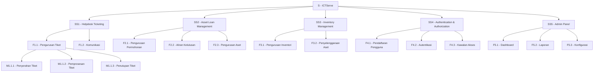
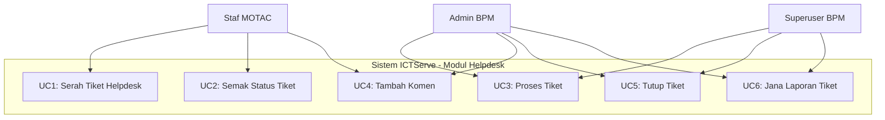
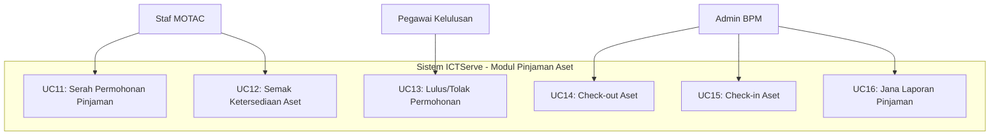
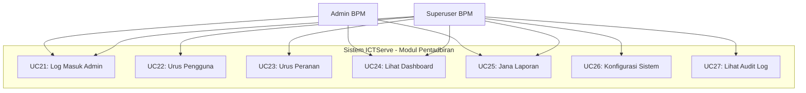
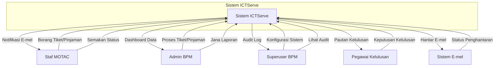
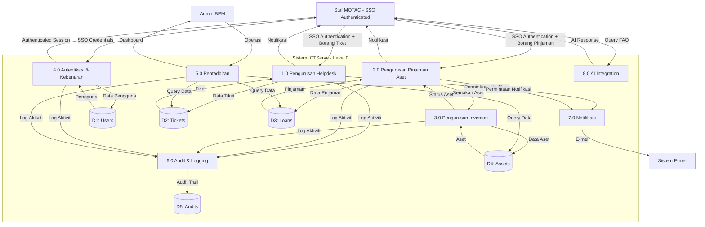
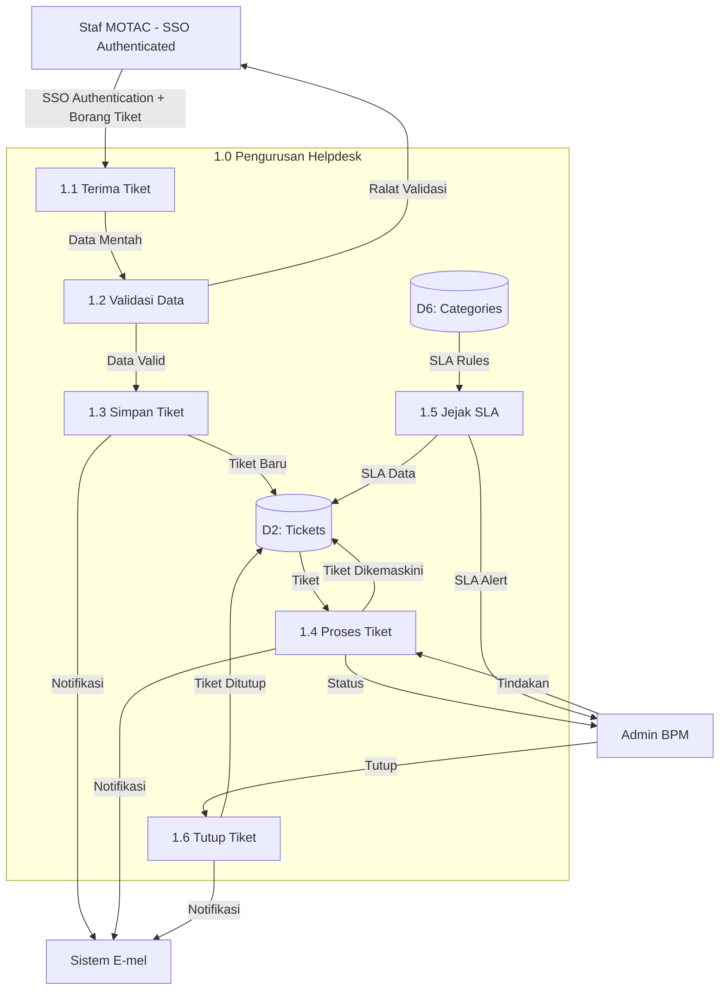

# D03 DOKUMEN SPESIFIKASI KEPERLUAN SISTEM (SRS)

**SISTEM ICTSERVE**

*(Sistem Pengurusan Helpdesk dan Pinjaman Aset ICT)*

| | |
| :--- | :--- |
| **NAMA AGENSI** | : Bahagian Pengurusan Maklumat (BPM) |
| **NAMA AGENSI INDUK** | : Kementerian Pelancongan, Seni dan Budaya Malaysia (MOTAC) |
| **TARIKH DOKUMEN** | : 17 Disember 2025 |
| **VERSI DOKUMEN** | : 4.0 |

---

## i. Keterangan Dokumen

Dokumen ini menyatakan spesifikasi keperluan sistem bagi ICTServe, sebuah sistem pengurusan tiket helpdesk dan permohonan pinjaman aset ICT untuk kegunaan warga kerja MOTAC.

## ii. Semakan dan Pengesahan Dokumen

**SEMAKAN DOKUMEN**

| Disemak Oleh | Jawatan | Tandatangan | Tarikh Semakan |
| :--- | :--- | :--- | :--- |
| | Penganalisis Sistem Kanan | | |
| | Ketua Pembangun Sistem | | |

**PENGESAHAN DOKUMEN**

| Disahkan Oleh | Jawatan | Tandatangan | Tarikh Semakan |
| :--- | :--- | :--- | :--- |
| | Pengurus Projek | | |
| | Ketua Bahagian Pengurusan Maklumat | | |

## iii. Kawalan Dokumen

**KAWALAN DOKUMEN**

| No. Versi | Tarikh | Ringkasan Pindaan | Penyedia |
| :--- | :--- | :--- | :--- |
| 1.0 | September 2024 | Versi awal spesifikasi keperluan sistem | Pasukan BPM |
| 2.0 | Oktober 2024 | Kemaskini keperluan sistem dan pemodelan | Pasukan BPM |
| 3.0 | November 2025 | Penjajaran kepada keperluan dalaman organisasi | Pasukan BPM |
| 4.0 | Disember 2025 | Kemaskini mengikut piawaian KRISA | Pasukan BPM |

## iv. Kandungan

1. PENGENALAN
   - 1.1. Tujuan Sistem
   - 1.2. Skop Sistem
   - 1.3. Senarai Aktor Sistem
2. PEMODELAN FUNGSI SISTEM
   - 2.1. Penggunaan Notasi
   - 2.2. Rajah Hierarki Fungsian Sistem
   - 2.3. Jadual Pemadanan Aktor Dengan Fungsi Sistem
3. PEMODELAN USE CASE
   - 3.1. Penggunaan Notasi
   - 3.2. Model Use Case
4. PEMODELAN MAKLUMAT
   - 4.1. Penggunaan Notasi
   - 4.2. Model Maklumat
   - 4.3. Definisi Kamus Data
5. PEMODELAN PROSES SISTEM
   - 5.1. Penggunaan Notasi
   - 5.2. Model Proses Sistem
   - 5.3. Definisi Aliran Data
6. PENENTUAN KEPERLUAN BUKAN FUNGSIAN
   - 6.1. Jadual Ciri-ciri Kualiti Sistem
7. PENENTUAN SAIZ SISTEM APLIKASI
8. LAMPIRAN

## v. Senarai Gambarajah

| No. | Tajuk Gambarajah | Muka Surat |
| :--- | :--- | :--- |
| 1 | Rajah Hierarki Fungsian Sistem ICTServe | §2.2 |
| 2 | Use Case Diagram - Modul Helpdesk | §3.2 |
| 3 | Use Case Diagram - Modul Pinjaman Aset | §3.2 |
| 4 | Use Case Diagram - Modul Pentadbiran | §3.2 |
| 5 | Entity Relationship Diagram (ERD) | §4.2 |
| 6 | Rajah Konteks Sistem | §5.2 |
| 7 | Data Flow Diagram Level 0 | §5.2 |
| 8 | Data Flow Diagram Level 1 - Helpdesk | §5.2 |
| 9 | Data Flow Diagram Level 1 - Pinjaman Aset | §5.2 |

## vi. Senarai Jadual

| No. | Tajuk Jadual | Muka Surat |
| :--- | :--- | :--- |
| 1 | Senarai Aktor Sistem | §1.3 |
| 2 | Notasi Hierarki Fungsian | §2.1 |
| 3 | Pemadanan Aktor Dengan Fungsi | §2.3 |
| 4 | Notasi Use Case | §3.1 |
| 5 | Senarai Use Case Helpdesk | §3.2 |
| 6 | Senarai Use Case Pinjaman Aset | §3.2 |
| 7 | Notasi ERD | §4.1 |
| 8 | Definisi Entiti - Users | §4.3 |
| 9 | Definisi Entiti - Helpdesk Tickets | §4.3 |
| 10 | Definisi Entiti - Loan Applications | §4.3 |
| 11 | Notasi Data Flow Diagram | §5.1 |
| 12 | Definisi Aliran Data | §5.3 |
| 13 | Keperluan Bukan Fungsian | §6.1 |
| 14 | Pengiraan Function Points | §7 |

## vii. Definisi dan Akronim

### a. Akronim

| Akronim | Keterangan |
| :--- | :--- |
| BPM | Bahagian Pengurusan Maklumat |
| DFD | Data Flow Diagram |
| ERD | Entity Relationship Diagram |
| ICT | Information and Communication Technology |
| MOTAC | Kementerian Pelancongan, Seni dan Budaya Malaysia |
| SLA | Service Level Agreement |
| SRS | Software Requirements Specification |

### b. Definisi

| Terma/Istilah | Definisi |
| :--- | :--- |
| Staf MOTAC | Warga kerja Kementerian Pelancongan, Seni dan Budaya Malaysia |
| Tiket Helpdesk | Permohonan bantuan teknikal yang direkodkan dalam sistem |
| Pinjaman Aset | Permohonan untuk meminjam peralatan ICT untuk kegunaan rasmi |
| Admin BPM | Pegawai Bahagian Pengurusan Maklumat yang menguruskan sistem |

## viii. Sumber Rujukan

1. **Buku Panduan Kejuruteraan Sistem Aplikasi Sektor Awam (KRISA)**. MAMPU.
2. **ISO/IEC/IEEE 29148:2018** - Systems and software engineering — Life cycle processes — Requirements engineering.

---

## 1. PENGENALAN

### 1.1. Tujuan Sistem

Sistem ICTServe dibangunkan untuk memenuhi keperluan Bahagian Pengurusan Maklumat (BPM) MOTAC dalam menguruskan perkhidmatan sokongan ICT secara sistematik dan teratur. Tujuan utama sistem ini adalah:

1. **Mengautomasikan Proses Helpdesk**: Menggantikan proses manual dengan sistem tiket digital yang teratur.

2. **Memudahkan Pinjaman Aset ICT**: Menyediakan platform untuk permohonan pinjaman peralatan ICT dengan aliran kelulusan.

3. **Meningkatkan Ketelusan**: Membolehkan staf MOTAC memantau status aduan dan permohonan pinjaman.

4. **Meningkatkan Kecekapan Operasi**: Mengurangkan masa pemprosesan tiket dan permohonan pinjaman.

### 1.2. Skop Sistem

Skop sistem ICTServe merangkumi:

**Modul Utama:**

- Helpdesk Ticketing System - Penyerahan tiket, pengurusan kategori dan keutamaan, komunikasi antara admin dan pemohon, lampiran fail
- Asset Loan Management - Permohonan pinjaman, semakan ketersediaan aset, aliran kelulusan, pengurusan check-out dan check-in aset
- Inventory Management - Pengurusan inventori aset ICT, pengurusan status dan penyelenggaraan aset
- Authentication & Authorization - Sistem log masuk pengguna dan kawalan akses berdasarkan peranan
- Admin Panel - Dashboard pengurusan, pengurusan tiket dan permohonan, laporan dan analitik

**Skop Pengguna:**

- Staf MOTAC (pengguna utama sistem)
- Pegawai Kelulusan (meluluskan permohonan pinjaman)
- Admin BPM (memproses tiket dan permohonan)
- Superuser BPM (pentadbiran sistem)

### 1.3. Senarai Aktor Sistem

**Jadual 1: Senarai Aktor Sistem**

| Bil. | Aktor | Peranan | Keterangan Fungsi |
| :--- | :--- | :--- | :--- |
| 1 | Staf MOTAC | Pengguna | Staf MOTAC yang menggunakan sistem untuk tiket dan pinjaman aset. |
| 2 | Pegawai Kelulusan | Kelulusan | Pegawai yang meluluskan permohonan pinjaman. |
| 3 | Admin BPM | Pentadbir | Pegawai BPM yang memproses tiket helpdesk dan permohonan pinjaman. |
| 4 | Superuser BPM | Pentadbir Sistem | Pegawai BPM yang mentadbir sistem. |
| 5 | Sistem E-mel | Sistem Luaran | Sistem untuk menghantar notifikasi e-mel. |

---

## 2. PEMODELAN FUNGSI SISTEM

### 2.1. Penggunaan Notasi

Seksyen ini menggunakan notasi standard KRISA untuk menyediakan Model Fungsi Sistem yang mematuhi piawaian MAMPU.

**Jadual 2: Notasi Hierarki Fungsian**

| Notasi | Keterangan | Contoh |
| :--- | :--- | :--- |
| **S** | Sistem | S - ICTServe |
| **SS** | Subsistem | SS1 - Helpdesk Ticketing |
| **F** | Fungsi | F1.1 - Pengurusan Tiket |
| **M** | Modul | M1.1.1 - Penyerahan Tiket |

### 2.2. Rajah Hierarki Fungsian Sistem



### 2.3. Jadual Pemadanan Aktor Dengan Fungsi Sistem

**Jadual 3: Pemadanan Aktor Dengan Fungsi**

| Fungsi | Staf MOTAC | Pegawai Kelulusan | Admin BPM | Superuser BPM |
| :--- | :---: | :---: | :---: | :---: |
| **F1.1 - Pengurusan Tiket** | ✓ | | ✓ | ✓ |
| **F1.2 - Komunikasi** | ✓ | | ✓ | ✓ |
| **F2.1 - Pengurusan Permohonan** | ✓ | | ✓ | ✓ |
| **F2.2 - Aliran Kelulusan** | | ✓ | ✓ | ✓ |
| **F2.3 - Pengurusan Aset** | | | ✓ | ✓ |
| **F3.1 - Pengurusan Inventori** | | | ✓ | ✓ |
| **F3.2 - Penyelenggaraan Aset** | | | ✓ | ✓ |
| **F4.1 - Pendaftaran Pengguna** | | | | ✓ |
| **F4.2 - Autentikasi** | ✓ | ✓ | ✓ | ✓ |
| **F4.3 - Kawalan Akses** | | | | ✓ |
| **F5.1 - Dashboard** | | | ✓ | ✓ |
| **F5.2 - Laporan** | | | ✓ | ✓ |
| **F5.3 - Konfigurasi** | | | | ✓ |

---

## 3. PEMODELAN USE CASE

### 3.1. Penggunaan Notasi

Seksyen ini menggunakan notasi standard KRISA untuk menyediakan Model Use Case yang mematuhi piawaian MAMPU.

**Jadual 4: Notasi Use Case**

| Notasi | Simbol | Keterangan |
| :--- | :--- | :--- |
| **Aktor** | Stick figure | Pengguna atau sistem luaran yang berinteraksi dengan sistem |
| **Use Case** | Oval | Fungsi atau perkhidmatan yang disediakan oleh sistem |
| **Sistem Boundary** | Rectangle | Had sistem yang sedang dimodelkan |
| **Association** | Solid line | Hubungan antara aktor dengan use case |
| **Include** | Dashed arrow (<<include>>) | Use case yang sentiasa dipanggil oleh use case lain |
| **Extend** | Dashed arrow (<<extend>>) | Use case opsyenal yang mungkin dipanggil |

### 3.2. Model Use Case

#### 3.2.1. Use Case Diagram - Modul Helpdesk



**Jadual 5: Senarai Use Case Helpdesk**

| ID | Nama Use Case | Aktor Utama | Keterangan |
| :--- | :--- | :--- | :--- |
| UC1 | Serah Tiket Helpdesk | Staf MOTAC | Pengguna mengisi borang tiket dengan maklumat aduan ICT. |
| UC2 | Semak Status Tiket | Staf MOTAC | Pengguna semak status tiket. |
| UC3 | Proses Tiket | Admin/Superuser | Admin memproses tiket dan kemaskini status. |
| UC4 | Tambah Komen | Staf MOTAC/Admin | Pengguna atau admin tambah komen pada tiket. |
| UC5 | Tutup Tiket | Admin/Superuser | Admin tutup tiket selepas masalah diselesaikan. |
| UC6 | Jana Laporan Tiket | Admin/Superuser | Admin jana laporan statistik tiket. |

#### 3.2.2. Use Case Diagram - Modul Pinjaman Aset



**Jadual 6: Senarai Use Case Pinjaman Aset**

| ID | Nama Use Case | Aktor Utama | Keterangan |
| :--- | :--- | :--- | :--- |
| UC11 | Serah Permohonan Pinjaman | Staf MOTAC | Pengguna mengisi borang permohonan pinjaman aset. |
| UC12 | Semak Ketersediaan Aset | Staf MOTAC | Sistem semak ketersediaan aset berdasarkan tarikh pinjaman. |
| UC13 | Lulus/Tolak Permohonan | Pegawai Kelulusan | Pegawai lulus atau tolak permohonan. |
| UC14 | Check-out Aset | Admin | Admin check-out aset kepada peminjam. |
| UC15 | Check-in Aset | Admin | Admin check-in aset selepas dipulangkan. |
| UC16 | Jana Laporan Pinjaman | Admin | Admin jana laporan statistik pinjaman. |

#### 3.2.3. Use Case Diagram - Modul Pentadbiran



---

## 4. PEMODELAN MAKLUMAT

### 4.1. Penggunaan Notasi

Seksyen ini menggunakan notasi standard KRISA untuk menyediakan Model Maklumat yang mematuhi piawaian MAMPU.

**Jadual 7: Notasi ERD**

| Notasi | Simbol | Keterangan |
| :--- | :--- | :--- |
| **Entiti** | Rectangle | Objek atau konsep yang menyimpan data |
| **Atribut** | Oval | Ciri-ciri atau sifat entiti |
| **Primary Key** | Underlined | Atribut yang mengenal pasti unik setiap rekod |
| **Foreign Key** | FK | Atribut yang merujuk kepada primary key entiti lain |
| **Relationship** | Diamond | Hubungan antara entiti |
| **Cardinality 1:1** | 1 --- 1 | Satu ke satu |
| **Cardinality 1:N** | 1 --- N | Satu ke banyak |
| **Cardinality M:N** | M --- N | Banyak ke banyak |

### 4.2. Model Maklumat (Entity Relationship Diagram)

```mermaid
erDiagram
    USERS ||--o{ HELPDESK_TICKETS : "submits"
    USERS ||--o{ LOAN_APPLICATIONS : "applies"
    
    DIVISIONS ||--o{ USERS : "belongs_to"
    GRADES ||--o{ USERS : "has"
    POSITIONS ||--o{ USERS : "holds"
    
    HELPDESK_CATEGORIES ||--o{ HELPDESK_TICKETS : "categorizes"
    
    ASSETS ||--o{ LOAN_ITEMS : "includes"
    ASSET_CATEGORIES ||--o{ ASSETS : "categorizes"
    
    LOAN_APPLICATIONS ||--o{ LOAN_ITEMS : "contains"
    LOAN_APPLICATIONS ||--o{ LOAN_APPROVALS : "requires"
    
    USERS {
        id PK
        name
        email UK
        phone
        role
        division_id FK
        grade_id FK
        position_id FK
    }
    
    DIVISIONS {
        id PK
        code UK
        name_ms
        name_en
        parent_id FK
    }
    
    GRADES {
        id PK
        code UK
        name
        level
    }
    
    POSITIONS {
        id PK
        code UK
        name_ms
        name_en
    }
    
    HELPDESK_TICKETS {
        id PK
        ticket_number UK
        user_id FK
        submitter_name
        submitter_email
        category_id FK
        priority
        description
        status
        assigned_admin_id FK
    }
    
    HELPDESK_CATEGORIES {
        id PK
        name_ms
        name_en
        sla_hours
        is_active
    }
    
    LOAN_APPLICATIONS {
        id PK
        reference_number UK
        user_id FK
        applicant_name
        applicant_email
        start_date
        end_date
        purpose
        status
    }
    
    LOAN_ITEMS {
        id PK
        loan_application_id FK
        asset_id FK
        quantity
    }
    
    ASSETS {
        id PK
        asset_tag UK
        name
        category_id FK
        status
        location
    }
    
    ASSET_CATEGORIES {
        id PK
        name_ms
        name_en
        parent_id FK
    }
    
    LOAN_APPROVALS {
        id PK
        loan_application_id FK
        approver_email
        decision
        notes
    }
```

### 4.3. Definisi Kamus Data

#### 4.3.1. Entiti USERS

**Jadual 8: Definisi Entiti - Users**

| Atribut | Jenis Data | Panjang | Nullable | Keterangan |
| :--- | :--- | :--- | :--- | :--- |
| id | INTEGER | - | NO | Primary key, auto-increment |
| name | VARCHAR | 255 | NO | Nama penuh pengguna |
| email | VARCHAR | 255 | NO | E-mel rasmi, unique |
| phone | VARCHAR | 20 | YES | Nombor telefon |
| role | VARCHAR | 50 | NO | Peranan: staff, admin, superuser |
| division_id | INTEGER | - | YES | FK ke divisions.id |
| grade_id | INTEGER | - | YES | FK ke grades.id |
| position_id | INTEGER | - | YES | FK ke positions.id |

#### 4.3.2. Entiti HELPDESK_TICKETS

**Jadual 9: Definisi Entiti - Helpdesk Tickets**

| Atribut | Jenis Data | Panjang | Nullable | Keterangan |
| :--- | :--- | :--- | :--- | :--- |
| id | INTEGER | - | NO | Primary key, auto-increment |
| ticket_number | VARCHAR | 50 | NO | Nombor tiket unik |
| user_id | INTEGER | - | NO | FK ke users.id |
| submitter_name | VARCHAR | 255 | NO | Nama pemohon |
| submitter_email | VARCHAR | 255 | NO | E-mel pemohon |
| category_id | INTEGER | - | NO | FK ke helpdesk_categories.id |
| priority | VARCHAR | 20 | NO | Keutamaan: LOW, MEDIUM, HIGH, CRITICAL |
| description | TEXT | - | NO | Deskripsi masalah |
| status | VARCHAR | 50 | NO | Status: OPEN, IN_PROGRESS, RESOLVED, CLOSED |
| assigned_admin_id | INTEGER | - | YES | FK ke users.id (admin yang ditugaskan) |

#### 4.3.3. Entiti LOAN_APPLICATIONS

**Jadual 10: Definisi Entiti - Loan Applications**

| Atribut | Jenis Data | Panjang | Nullable | Keterangan |
| :--- | :--- | :--- | :--- | :--- |
| id | INTEGER | - | NO | Primary key, auto-increment |
| reference_number | VARCHAR | 50 | NO | Nombor rujukan unik |
| user_id | INTEGER | - | NO | FK ke users.id |
| applicant_name | VARCHAR | 255 | NO | Nama pemohon |
| applicant_email | VARCHAR | 255 | NO | E-mel pemohon |
| start_date | DATE | - | NO | Tarikh mula pinjaman |
| end_date | DATE | - | NO | Tarikh tamat pinjaman |
| purpose | TEXT | - | NO | Tujuan pinjaman |
| status | VARCHAR | 50 | NO | Status: PENDING, APPROVED, REJECTED, ACTIVE, COMPLETED |

---

## 5. PEMODELAN PROSES SISTEM

### 5.1. Penggunaan Notasi

**Jadual 11: Notasi Data Flow Diagram**

| Notasi | Simbol | Keterangan |
| :--- | :--- | :--- |
| **External Entity** | Rectangle | Entiti luaran yang berinteraksi dengan sistem |
| **Process** | Circle/Rounded Rectangle | Proses transformasi data |
| **Data Store** | Open Rectangle | Simpanan data (database, file) |
| **Data Flow** | Arrow | Aliran data antara komponen |

### 5.2. Model Proses Sistem

#### 5.2.1. Rajah Konteks Sistem



#### 5.2.2. Data Flow Diagram Level 0



#### 5.2.3. Data Flow Diagram Level 1 - Helpdesk



#### 5.2.4. Data Flow Diagram Level 1 - Pinjaman Aset

```mermaid
graph TD
    STAFF_MOTAC2[Staf MOTAC (Walk-in/Kiosk)]
    APPROVER[Pegawai Kelulusan]
    ADMIN2[Admin BPM]
    EMAIL2[Sistem E-mel]
    
    subgraph "2.0 Pengurusan Pinjaman Aset"
        P2.1[2.1 Terima Permohonan]
        P2.2[2.2 Semak Ketersediaan]
        P2.3[2.3 Simpan Permohonan]
        P2.4[2.4 Proses Kelulusan]
        P2.5[2.5 Check-out Aset]
        P2.6[2.6 Check-in Aset]
        
        DS3[(D3: Loans)]
        DS4[(D4: Assets)]
        DS7[(D7: Transactions)]
    end
    
    STAFF_MOTAC2 -->|SSO Authentication + Borang Pinjaman| P2.1
    P2.1 -->|Data Permohonan| P2.2
    
    P2.2 -->|Query Aset| DS4
    DS4 -->|Status Aset| P2.2
    P2.2 -->|Ketersediaan| STAFF_MOTAC2
    
    P2.2 -->|Data Valid| P2.3
    P2.3 -->|Permohonan Baru| DS3
    P2.3 -->|Pautan Kelulusan| EMAIL2
    
    EMAIL2 -->|Keputusan| P2.4
    APPROVER -->|Lulus/Tolak| P2.4
    P2.4 -->|Status Kelulusan| DS3
    P2.4 -->|Notifikasi| EMAIL2
    
    ADMIN2 -->|Check-out| P2.5
    P2.5 -->|Transaksi| DS7
    P2.5 -->|Update Status| DS4
    P2.5 -->|Pickup OTP| EMAIL2
    
    ADMIN2 -->|Check-in| P2.6
    P2.6 -->|Transaksi| DS7
    P2.6 -->|Update Status| DS4
    P2.6 -->|Notifikasi| EMAIL2
```

### 5.3. Definisi Aliran Data

**Jadual 12: Definisi Aliran Data**

| ID | Nama Aliran | Sumber | Destinasi | Keterangan |
| :--- | :--- | :--- | :--- | :--- |
| DF-01 | Borang Tiket | Walk-in/Kiosk dengan SSO | 1.1 Terima Tiket | Data penyerahan tiket: nama (dari LDAP), e-mel (dari HRMIS), telefon, kategori, deskripsi, lampiran |
| DF-02 | Data Mentah | 1.1 Terima Tiket | 1.2 Validasi Data | Data tiket sebelum validasi |
| DF-03 | Data Valid | 1.2 Validasi Data | 1.3 Simpan Tiket | Data tiket selepas validasi berjaya |
| DF-04 | Ralat Validasi | 1.2 Validasi Data | Walk-in/Kiosk dengan SSO | Mesej ralat validasi (format e-mel, medan wajib, dll) - dikaitkan dengan user_id dari SSO |
| DF-05 | Tiket Baru | 1.3 Simpan Tiket | D2: Tickets | Rekod tiket baharu dengan ticket_number, status OPEN |
| DF-06 | Notifikasi E-mel | 1.3 Simpan Tiket | Sistem E-mel | E-mel pengesahan dengan nombor tiket dan pautan status |
| DF-07 | Tiket | D2: Tickets | 1.4 Proses Tiket | Data tiket untuk pemprosesan admin |
| DF-08 | Tindakan Admin | Admin BPM | 1.4 Proses Tiket | Tindakan: assign, update status, tambah komen |
| DF-09 | Tiket Dikemaskini | 1.4 Proses Tiket | D2: Tickets | Rekod tiket selepas dikemaskini |
| DF-10 | SLA Rules | D6: Categories | 1.5 Jejak SLA | Peraturan SLA berdasarkan kategori tiket |
| DF-11 | SLA Alert | 1.5 Jejak SLA | Admin BPM | Amaran SLA breach atau hampir breach |
| DF-12 | Borang Pinjaman | Walk-in/Kiosk dengan SSO | 2.1 Terima Permohonan | Data permohonan pinjaman: pemohon (dari HRMIS), aset, tarikh, tujuan - user_id wajib dari SSO |
| DF-13 | Query Aset | 2.2 Semak Ketersediaan | D4: Assets | Permintaan semakan ketersediaan aset |
| DF-14 | Status Aset | D4: Assets | 2.2 Semak Ketersediaan | Status ketersediaan aset (available/booked) |
| DF-15 | Permohonan Baru | 2.3 Simpan Permohonan | D3: Loans | Rekod permohonan baharu dengan reference_number |
| DF-16 | Pautan Kelulusan | 2.3 Simpan Permohonan | Sistem E-mel | E-mel kepada pegawai kelulusan dengan signed link |
| DF-17 | Keputusan Kelulusan | Pegawai Kelulusan | 2.4 Proses Kelulusan | Keputusan: APPROVED/REJECTED dengan catatan |
| DF-18 | Status Kelulusan | 2.4 Proses Kelulusan | D3: Loans | Update status permohonan berdasarkan keputusan |
| DF-19 | Transaksi Check-out | 2.5 Check-out Aset | D7: Transactions | Rekod transaksi check-out dengan accessory list |
| DF-20 | Transaksi Check-in | 2.6 Check-in Aset | D7: Transactions | Rekod transaksi check-in dengan kondisi aset |

---

## 6. PENENTUAN KEPERLUAN BUKAN FUNGSIAN

### 6.1. Jadual Ciri-ciri Kualiti Sistem

**Jadual 13: Keperluan Bukan Fungsian**

| Kategori | Aspek | Keperluan | Metrik/Target |
| :--- | :--- | :--- | :--- |
| **Prestasi** | Response Time | Masa tindak balas halaman | < 2.5s (LCP) |
| | | Masa tindak balas API | < 200ms (95th percentile) |
| | Throughput | Bilangan pengguna serentak | 100 pengguna |
| | | Bilangan transaksi per saat | 50 TPS |
| **Kebolehskalaan** | Horizontal Scaling | Sokongan multiple app servers dengan Redis session | Ya |
| | Database | Sokongan read replicas (Master-Slave) | Ya |
| | Storage | Sokongan object storage (S3/MinIO) | Ya |
| **Keselamatan** | Authentication | SSO Authentication (LDAP/Active Directory) | Semua pengguna |
| | | Kawalan akses berdasarkan peranan | 4 peranan (staff, admin, superuser, approver) |
| | Password Policy | Panjang minimum 8 aksara, penukaran berkala 90 hari | Mandatory |
| | | Had percubaan log masuk | 3 percubaan maksimum |
| | Penyulitan | Data at rest (AES-256), data in transit (TLS 1.3) | Ya |
| | | Password hashing | bcrypt |
| | Audit Trail | Sistem audit dwi-lapisan dengan retention 7 tahun | Ya |
| | Rate Limiting | API endpoints | 60 req/min per user |
| **Kebolehcapaian** | WCAG Compliance | Pematuhan WCAG 2.2 Level AA | 100 (Lighthouse) |
| | Contrast Ratio | Text contrast ≥ 4.5:1, UI component ≥ 3:1 | Ya |
| | Keyboard Navigation | Semua elemen interaktif | 100% accessible |
| | Screen Reader | Semantic HTML + ARIA | Fully supported |
| **Kebolehgunaan** | Bahasa | Antara muka pengguna Bahasa Melayu sahaja | Ya |
| | Responsif | Sokongan Mobile/Tablet/Desktop | Ya |
| | Help System | Contextual help tooltips pada semua borang | Ya |
| **Kebolehpercayaan** | Uptime | Ketersediaan sistem | 99.9% |
| | Backup | Database dan file backup harian | Ya |
| | Recovery | RTO < 4 jam, RPO < 24 jam | Ya |
| **Kebolehselenggaraan** | Code Quality | PSR-12 compliance, PHPStan Level 9 | 100% |
| | Testing | Unit test coverage ≥ 80%, Feature test ≥ 90% | Ya |
| | Documentation | Code documentation (PHPDoc), API documentation (OpenAPI) | Ya |
| **Pematuhan** | Standards | PDPA 2010, MyGOV DSS v2.1.0, OWASP ASVS Level 2, ISO/IEC 27701 | Ya |

---

## 7. PENENTUAN SAIZ SISTEM APLIKASI

Pengiraan saiz sistem menggunakan kaedah Function Points Analysis (FPA) berdasarkan IFPUG (International Function Point Users Group) guidelines.

**Jadual 14: Pengiraan Function Points**

### External Inputs (EI)

| Fungsi | Kompleksiti | FP |
| :--- | :--- | ---: |
| Borang Tiket Helpdesk | Sederhana | 4 |
| Borang Pinjaman Aset | Tinggi | 6 |
| Borang Pendaftaran Pengguna | Sederhana | 4 |
| Borang Login | Rendah | 3 |
| Borang Kelulusan E-mel | Sederhana | 4 |
| Borang Check-out Aset | Tinggi | 6 |
| Borang Check-in Aset | Tinggi | 6 |
| Borang Penyelenggaraan Aset | Sederhana | 4 |
| Borang Pemindahan Aset | Tinggi | 6 |
| Borang FAQ Bot Query | Rendah | 3 |
| **Jumlah EI** | | **46** |

### External Outputs (EO)

| Fungsi | Kompleksiti | FP |
| :--- | :--- | ---: |
| Laporan Tiket (PDF/Excel) | Tinggi | 7 |
| Laporan Pinjaman (PDF/Excel) | Tinggi | 7 |
| Laporan Inventori (PDF/Excel) | Sederhana | 5 |
| Laporan Audit (PDF/Excel) | Tinggi | 7 |
| Dashboard Statistik | Sederhana | 5 |
| Notifikasi E-mel | Sederhana | 5 |
| Notifikasi SMS | Rendah | 4 |
| QR Code Generation | Rendah | 4 |
| Pickup OTP Generation | Rendah | 4 |
| **Jumlah EO** | | **48** |

### External Inquiries (EQ)

| Fungsi | Kompleksiti | FP |
| :--- | :--- | ---: |
| Semakan Status Tiket | Rendah | 3 |
| Semakan Status Pinjaman | Rendah | 3 |
| Semakan Ketersediaan Aset | Sederhana | 4 |
| Carian Tiket | Sederhana | 4 |
| Carian Pinjaman | Sederhana | 4 |
| Carian Aset | Sederhana | 4 |
| Lihat Sejarah Tiket | Sederhana | 4 |
| Lihat Sejarah Pinjaman | Sederhana | 4 |
| Lihat Audit Log | Tinggi | 6 |
| FAQ Bot Response | Sederhana | 4 |
| **Jumlah EQ** | | **40** |

### Internal Logical Files (ILF)

| Fail | Kompleksiti | FP |
| :--- | :--- | ---: |
| Users | Sederhana | 10 |
| Helpdesk Tickets | Tinggi | 15 |
| Loan Applications | Tinggi | 15 |
| Assets | Sederhana | 10 |
| Loan Transactions | Sederhana | 10 |
| Audits | Sederhana | 10 |
| Activity Log | Sederhana | 10 |
| FAQs | Rendah | 7 |
| Auto-reply Templates | Rendah | 7 |
| Message Logs | Sederhana | 10 |
| **Jumlah ILF** | | **104** |

### External Interface Files (EIF)

| Antara Muka | Kompleksiti | FP |
| :--- | :--- | ---: |
| Sistem E-mel (SMTP) | Sederhana | 7 |
| Sistem SMS Gateway | Rendah | 5 |
| Google Workspace OAuth | Sederhana | 7 |
| Ollama AI Server | Sederhana | 7 |
| AWS Bedrock API | Sederhana | 7 |
| Laravel Pulse | Rendah | 5 |
| Laravel Telescope | Rendah | 5 |
| **Jumlah EIF** | | **43** |

### Jumlah Unadjusted Function Points (UFP)

| Komponen | Jumlah FP |
| :--- | ---: |
| External Inputs (EI) | 46 |
| External Outputs (EO) | 48 |
| External Inquiries (EQ) | 40 |
| Internal Logical Files (ILF) | 104 |
| External Interface Files (EIF) | 43 |
| **Jumlah UFP** | **281** |

### General System Characteristics (GSC)

| Ciri | Tahap Pengaruh (0-5) |
| :--- | ---: |
| Data Communications | 5 |
| Distributed Data Processing | 4 |
| Performance | 5 |
| Heavily Used Configuration | 4 |
| Transaction Rate | 4 |
| Online Data Entry | 5 |
| End-User Efficiency | 5 |
| Online Update | 5 |
| Complex Processing | 4 |
| Reusability | 4 |
| Installation Ease | 3 |
| Operational Ease | 4 |
| Multiple Sites | 2 |
| Facilitate Change | 4 |
| **Jumlah GSC** | **58** |

**Value Adjustment Factor (VAF)** = 0.65 + (0.01 × 58) = **1.23**

**Adjusted Function Points (AFP)** = UFP × VAF = 281 × 1.23 = **345.63 ≈ 346 FP**

### Anggaran Usaha dan Kos

Berdasarkan industry standard (Capers Jones):

- **Productivity Rate**: 10 FP per person-month (Laravel/PHP)
- **Person-Months**: 346 / 10 = **34.6 bulan-orang**
- **Duration**: 34.6 / 6 developers = **5.8 bulan ≈ 6 bulan**
- **Cost per Person-Month**: RM 15,000
- **Total Cost**: 34.6 × RM 15,000 = **RM 519,000**

**Ringkasan:**

- **Adjusted Function Points**: 346 FP
- **Anggaran Usaha**: 34.6 bulan-orang
- **Anggaran Tempoh**: 6 bulan (6 developers)
- **Anggaran Kos**: RM 519,000

---

## 8. LAMPIRAN

### 8.1. Borang Rujukan

- Borang Tiket Helpdesk (PK.(S).MOTAC.07.(L1))
- Borang Permohonan Pinjaman Aset (PK.(S).MOTAC.07.(L3))
- Borang Kelulusan Pinjaman
- Borang Check-out/Check-in Aset

### 8.2. Carta Alir

- Carta Alir Penyerahan Tiket Helpdesk
- Carta Alir Kelulusan Pinjaman Aset
- Carta Alir Check-out/Check-in Aset
- Carta Alir SLA Tracking dan Eskalasi

### 8.3. Dokumen Sokongan

- **D00_SYSTEM_OVERVIEW.md** - Ringkasan Sistem v3.6.1
- **D01_SYSTEM_DEVELOPMENT_PLAN.md** - Pelan Pembangunan v3.6.1
- **D02_BUSINESS_REQUIREMENTS_SPECIFICATION.md** - Keperluan Perniagaan v3.6.1
- **D04_SOFTWARE_DESIGN_DOCUMENT.md** - Rekabentuk Perisian v3.6.1
- **D09_DATABASE_DOCUMENTATION.md** - Dokumentasi Pangkalan Data v3.5.0
- **D11_TECHNICAL_DESIGN_DOCUMENTATION.md** - Rekabentuk Teknikal v3.6.1
- **D12_UI_UX_DESIGN_GUIDE.md** - Panduan Rekabentuk UI/UX v3.5.0
- **D18_AI_CHATBOT_OLLAMA_BEDROCK.md** - Cloud Hybrid AI Architecture v1.0.1

### 8.4. Piawaian dan Garis Panduan

- ISO/IEC/IEEE 29148:2018 - Requirements Engineering
- ISO/IEC/IEEE 15288:2015 - System Life Cycle Processes
- WCAG 2.2 Level AA - Web Content Accessibility Guidelines
- OWASP ASVS L2 - Application Security Verification Standard
- MyGOV Digital Service Standards v2.1.0
- Personal Data Protection Act 2010 (PDPA)
- ISO/IEC 27701:2019 - Privacy Information Management

---

**TAMAT DOKUMEN / END OF DOCUMENT**

*Dokumen ini adalah hak milik Kementerian Pelancongan, Seni dan Budaya Malaysia (MOTAC) dan tertakluk kepada Akta Rahsia Rasmi 1972.*
