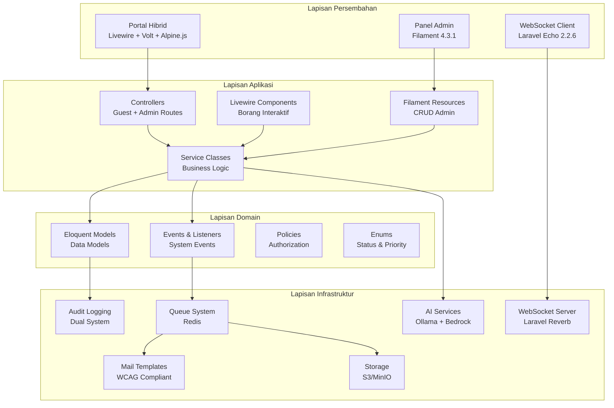
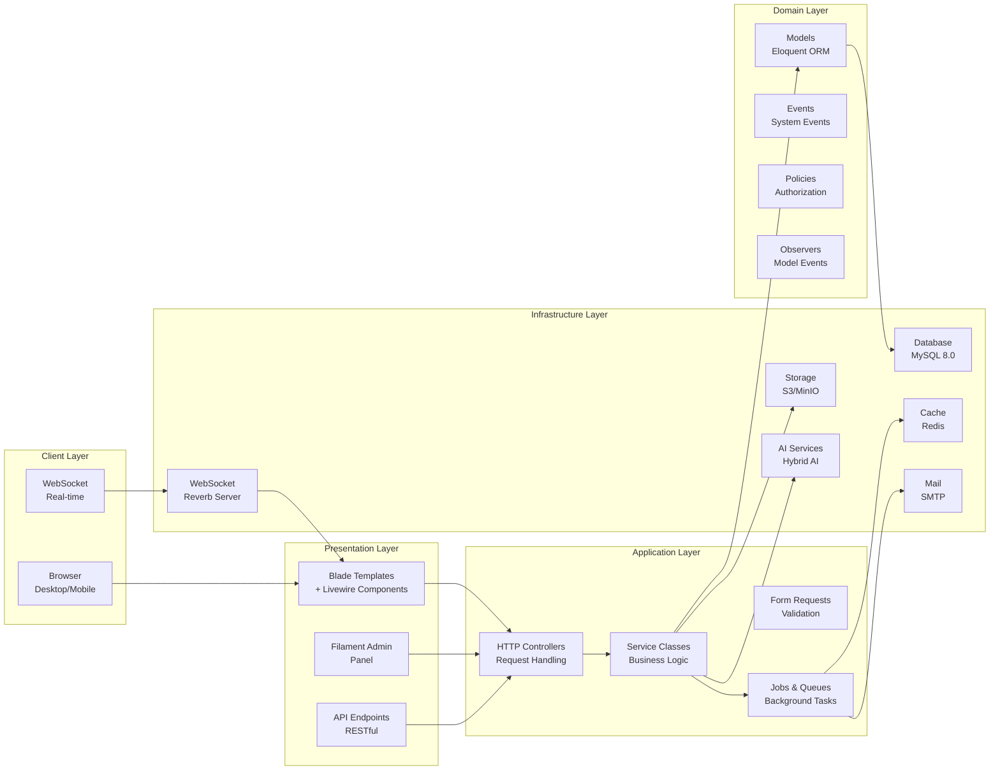
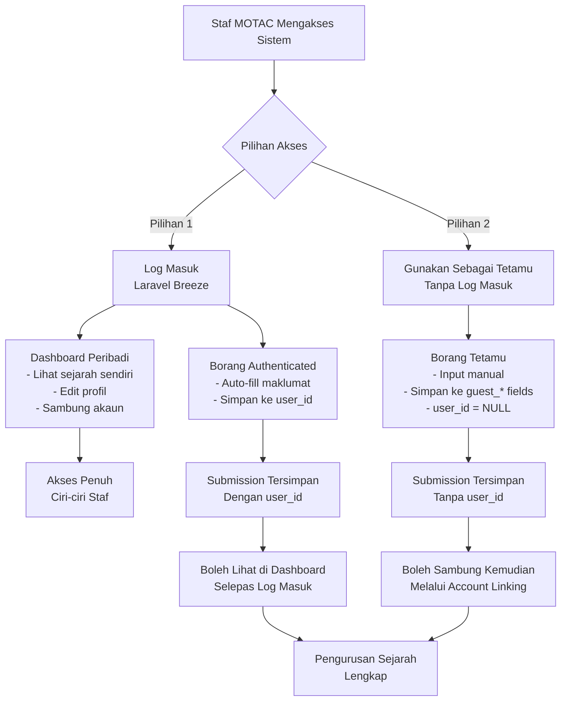
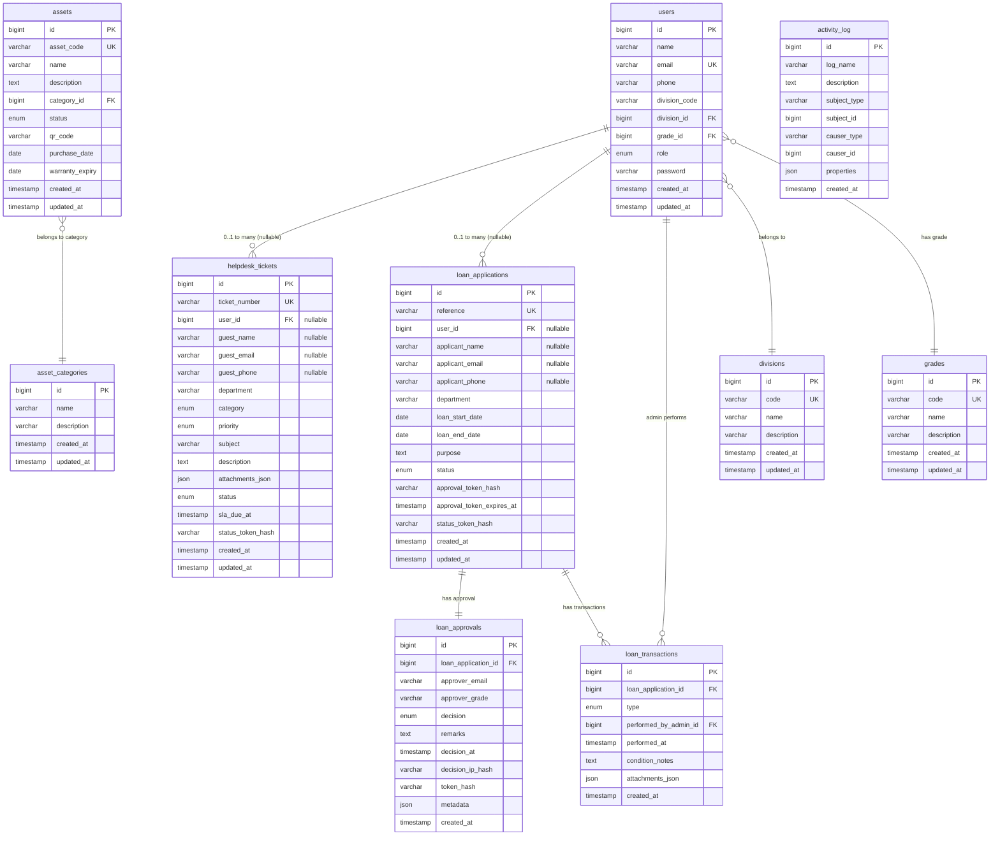
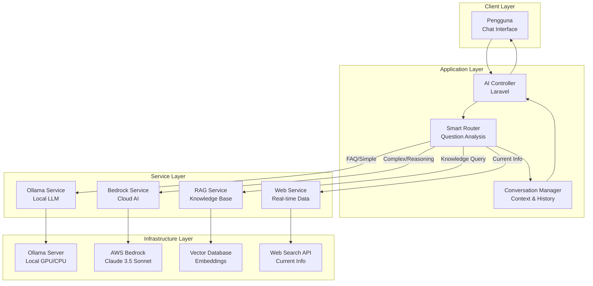
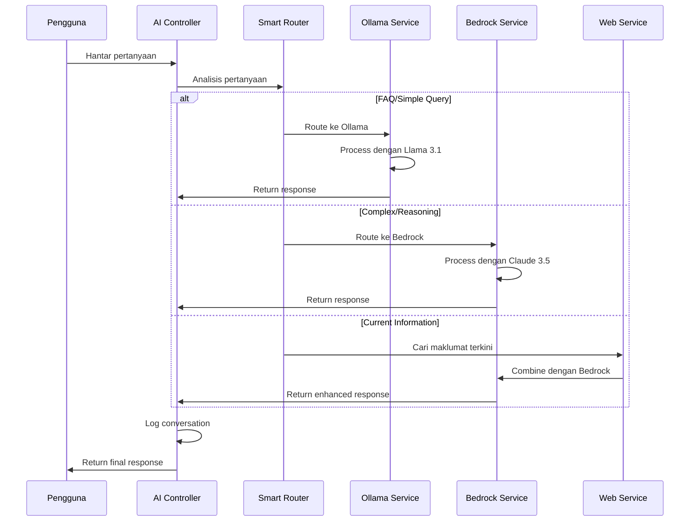

# D04 DOKUMEN SPESIFIKASI REKABENTUK SISTEM (SDS)

**SISTEM ICTSERVE**

*(Sistem Pengurusan Helpdesk dan Pinjaman Aset ICT)*

| | |
| :--- | :--- |
| **NAMA AGENSI** | : Bahagian Pengurusan Maklumat (BPM) |
| **NAMA AGENSI INDUK** | : Kementerian Pelancongan, Seni dan Budaya Malaysia (MOTAC) |
| **TARIKH DOKUMEN** | : 23 Disember 2025 |
| **VERSI DOKUMEN**  |

---

## i. Keterangan Dokumen

Dokumen Spesifikasi Rekabentuk Sistem (SDS) ini menghuraikan rekabentuk teknikal komprehensif bagi Sistem ICTServe sebagai sistem dalaman MOTAC dengan seni bina hibrid. Dokumen ini memperincikan seni bina sistem, rekabentuk modul, komponen data, aliran kerja, dan integrasi AI hibrid yang menggabungkan Ollama (tempatan) dengan AWS Bedrock (awan) untuk memberikan pengalaman AI yang optimum.

Sistem ini dibangunkan menggunakan Laravel 12.43.1, Livewire 3.7.3, Filament 4.3.1, dan teknologi moden lain untuk menyokong operasi helpdesk dan pinjaman aset ICT secara hibrid (staf boleh pilih log masuk atau gunakan sebagai tetamu).

## ii. Semakan dan Pengesahan Dokumen

**SEMAKAN DOKUMEN**

| Disemak Oleh | Jawatan | Tandatangan | Tarikh Semakan |
| :--- | :--- | :--- | :--- |
| Ketua Pembangun Sistem | Pegawai Sistem Maklumat Gred F41 | [Tandatangan Digital] | 23 Disember 2025 |
| Penganalisis Sistem Kanan | Pegawai Sistem Maklumat Gred F44 | [Tandatangan Digital] | 23 Disember 2025 |

**PENGESAHAN DOKUMEN**

| Disahkan Oleh | Jawatan | Tandatangan | Tarikh Semakan |
| :--- | :--- | :--- | :--- |
| Ketua Bahagian Pengurusan Maklumat | Pegawai Tadbir Diplomatik Gred M54 | [Tandatangan Digital] | 23 Disember 2025 |
| Pengarah ICT | Pegawai Tadbir Diplomatik Gred M52 | [Tandatangan Digital] | 23 Disember 2025 |

## iii. Kawalan Dokumen

**KAWALAN DOKUMEN**

| No. Versi | Tarikh | Ringkasan Pindaan | Penyedia |
| :--- | :--- | :--- | :--- |
| 1.0.0 | 15 September 2025 | Versi awal SDS | Pasukan Pembangunan BPM |
| 2.0.0 | 17 Oktober 2025 | Penyeragaman mengikut D00-D14, SemVer | Pasukan BPM |
| 3.0.0 | 31 Oktober 2025 | Rekabentuk seni bina dalaman dengan RBAC | Pasukan Pembangunan BPM |
| 3.4.0 | 29 November 2025 | Seni bina hibrid: user_id nullable FK | Pasukan Pembangunan BPM |
| 3.5.0 | 30 November 2025 | Pendaftaran kendiri dan log masuk fleksibel | Pasukan Pembangunan BPM |
| 3.6.0 | 8 Disember 2025 | Bahasa Melayu sahaja untuk antara muka | Pasukan Pembangunan BPM |
| 3.6.1 | 23 Disember 2025 | Integrasi AI Hibrid (Ollama + AWS Bedrock) | Pasukan Pembangunan BPM |

## iv. Kandungan

1. [PENGENALAN](#1-pengenalan) ... 5
2. [REKABENTUK ARKITEKTUR](#2-rekabentuk-arkitektur) ... 7
3. [PEMODELAN FUNGSI SISTEM](#3-pemodelan-fungsi-sistem) ... 12
4. [REKABENTUK FUNGSIAN](#4-rekabentuk-fungsian) ... 18
5. [REKABENTUK PANGKALAN DATA](#5-rekabentuk-pangkalan-data) ... 25
6. [REKABENTUK MIGRASI DATA](#6-rekabentuk-migrasi-data) ... 32
7. [REKABENTUK INTEGRASI DATA](#7-rekabentuk-integrasi-data) ... 34
8. [REKABENTUK AI HIBRID](#8-rekabentuk-ai-hibrid) ... 36
9. [LAMPIRAN](#9-lampiran) ... 40

## v. Senarai Gambarajah

- Gambarajah 2.1: Seni Bina Keseluruhan Sistem ... 8
- Gambarajah 2.2: Seni Bina Aplikasi Berlapis ... 9
- Gambarajah 2.3: Seni Bina Penggunaan Hibrid ... 10
- Gambarajah 3.1: Hierarki Fungsi Sistem ... 13
- Gambarajah 4.1: Aliran Kerja Helpdesk Hibrid ... 19
- Gambarajah 4.2: Aliran Kerja Pinjaman Aset ... 21
- Gambarajah 5.1: Rajah Hubungan Entiti (ERD) ... 26
- Gambarajah 8.1: Seni Bina AI Hibrid ... 37

## vi. Senarai Jadual

- Jadual 3.1: Pemadanan Aktor dengan Fungsi Sistem ... 15
- Jadual 4.1: Pemetaan Data Borang Helpdesk ... 20
- Jadual 4.2: Pemetaan Data Borang Pinjaman ... 22
- Jadual 5.1: Skema Logikal Pangkalan Data ... 28
- Jadual 7.1: Spesifikasi Integrasi Sistem ... 35
- Jadual 8.1: Konfigurasi Model AI ... 38

## vii. Definisi dan Akronim

### a. Akronim

| Akronim | Keterangan |
| :--- | :--- |
| AI | Artificial Intelligence (Kecerdasan Buatan) |
| API | Application Programming Interface |
| BPM | Bahagian Pengurusan Maklumat |
| CRUD | Create, Read, Update, Delete |
| ERD | Entity Relationship Diagram |
| FK | Foreign Key |
| ICT | Information and Communication Technology |
| KRISA | Kerangka Rujukan ICT Sektor Awam |
| LLM | Large Language Model |
| MAMPU | Unit Pemodenan Tadbiran dan Perancangan Pengurusan Malaysia |
| MOTAC | Kementerian Pelancongan, Seni dan Budaya Malaysia |
| MVC | Model-View-Controller |
| PDPA | Personal Data Protection Act |
| RBAC | Role-Based Access Control |
| SDS | System Design Specification |
| SLA | Service Level Agreement |
| UI/UX | User Interface/User Experience |
| WCAG | Web Content Accessibility Guidelines |

### b. Definisi

| Terma/Istilah | Definisi |
| :--- | :--- |
| Seni Bina Hibrid | Rekabentuk sistem yang membolehkan pengguna menggunakan sistem sama ada sebagai tetamu atau pengguna berdaftar |
| Pengguna Hibrid | Staf MOTAC yang boleh memilih untuk log masuk (akses dashboard) atau menggunakan borang tetamu |
| Token Kelulusan | Token unik yang dijana untuk membolehkan kelulusan melalui pautan e-mel tanpa perlu log masuk |
| AI Hibrid | Gabungan AI tempatan (Ollama) dan AI awan (AWS Bedrock) dengan penghalaan pintar |
| Penghalaan Pintar | Sistem automatik yang menentukan AI yang sesuai berdasarkan jenis pertanyaan |

## viii. Sumber Rujukan

1. **MAMPU (2019)**. Kerangka Rujukan ICT Sektor Awam (KRISA) Versi 2.0
2. **IEEE Std 1016-2009**. IEEE Standard for Information Technology - Systems Design - Software Design Descriptions
3. **ISO/IEC/IEEE 42010:2011**. Systems and software engineering - Architecture description
4. **WCAG 2.2 AA**. Web Content Accessibility Guidelines Level AA
5. **OWASP ASVS L2**. Application Security Verification Standard Level 2
6. **Laravel Documentation v12**. <https://laravel.com/docs/12.x>
7. **Filament Documentation v4**. <https://filamentphp.com/docs/4.x>
8. **D00_SYSTEM_OVERVIEW.md v3.5.0** - Gambaran keseluruhan sistem
9. **D02_BUSINESS_REQUIREMENTS_SPECIFICATION.md v3.5.0** - Keperluan perniagaan
10. **D03_SOFTWARE_REQUIREMENTS_SPECIFICATION.md v3.5.0** - Keperluan perisian

---

## 1. PENGENALAN

### 1.1. Tujuan Rekabentuk

Dokumen Spesifikasi Rekabentuk Sistem (SDS) ini bertujuan untuk:

1. **Menghuraikan Seni Bina Teknikal**: Memperincikan rekabentuk teknikal komprehensif bagi Sistem ICTServe sebagai sistem dalaman MOTAC dengan seni bina hibrid yang membolehkan akses fleksibel (staf boleh pilih log masuk atau gunakan sebagai tetamu).

2. **Menyediakan Panduan Pembangunan**: Memberikan panduan terperinci kepada pasukan pembangunan untuk melaksanakan sistem menggunakan teknologi moden seperti Laravel 12.43.1, Livewire 3.7.3, dan Filament 4.3.1.

3. **Memastikan Pematuhan Standard**: Memastikan rekabentuk mematuhi standard KRISA, WCAG 2.2 AA, OWASP ASVS L2, dan keperluan keselamatan kerajaan Malaysia.

4. **Mengintegrasikan AI Hibrid**: Menghuraikan integrasi AI hibrid yang menggabungkan Ollama (tempatan) dengan AWS Bedrock (awan) untuk memberikan sokongan AI yang optimum dengan penghalaan pintar.

**Objektif Utama:**

- Menyokong operasi helpdesk dan pinjaman aset ICT secara hibrid
- Membolehkan aliran kerja kelulusan berasaskan token tanpa perlu log masuk
- Menyediakan panel pentadbir yang komprehensif menggunakan Filament
- Mengintegrasikan komunikasi masa nyata menggunakan WebSocket
- Melaksanakan audit trail yang menyeluruh untuk pematuhan

### 1.2. Skop Rekabentuk

Skop rekabentuk ini merangkumi:

**Komponen Utama:**

1. **Portal Hibrid**: Borang helpdesk dan pinjaman aset dengan pilihan log masuk atau tetamu
2. **Portal Pentadbir**: Panel Filament untuk pengurusan sistem oleh admin dan superuser
3. **Sistem Kelulusan**: Aliran kerja kelulusan berasaskan token melalui e-mel
4. **Integrasi AI**: Sistem AI hibrid dengan penghalaan pintar
5. **Komunikasi Real-time**: WebSocket untuk notifikasi pentadbir
6. **Audit dan Keselamatan**: Sistem audit berlapis dan keselamatan berlapis

**Modul Fungsian:**

- Modul Helpdesk Ticketing (hibrid)
- Modul Pinjaman Aset ICT (hibrid + kelulusan berasaskan token)
- Modul Pengurusan Inventori (admin sahaja)
- Modul Pelaporan dan Dashboard (admin sahaja)
- Modul Pendaftaran Kendiri (staf MOTAC)
- Modul Log Masuk Fleksibel (e-mel atau nama pengguna)
- Modul Penyambungan Akaun (sambung sejarah tetamu)
- Modul AI Chatbot (hibrid Ollama + AWS Bedrock)

**Teknologi dan Platform:**

- Backend: Laravel 12.43.1 dengan PHP 8.4.1
- Frontend: Livewire 3.7.3, Volt 1.10.1, Alpine.js 3, Tailwind CSS 4.1.18
- Admin Panel: Filament 4.3.1
- Database: MySQL 8.0
- Cache/Queue: Redis 7.0
- WebSocket: Laravel Reverb 1.6.3 + Laravel Echo 2.2.6
- AI: Ollama (tempatan) + AWS Bedrock (awan)

**Di Luar Skop:**

- Aplikasi mudah alih natif (boleh diambil masa hadapan melalui API)
- Integrasi LDAP/SSO penuh (sistem menggunakan akaun dalaman sahaja)
- Sistem pengurusan dokumen yang berasingan
- Integrasi dengan sistem kewangan MOTAC

## 2. REKABENTUK ARKITEKTUR

### 2.1. Arkitektur Keseluruhan Sistem Aplikasi

Sistem ICTServe menggunakan seni bina berlapis (layered architecture) dengan corak MVC + Service Layer + Guest-First yang menyokong akses hibrid.



**Gambarajah 2.1: Seni Bina Keseluruhan Sistem**

### 2.2. Arkitektur Aplikasi

Aplikasi menggunakan corak seni bina berlapis dengan pemisahan tanggungjawab yang jelas:



**Gambarajah 2.2: Seni Bina Aplikasi Berlapis**

### 2.3. Arkitektur Penggunaan Hibrid

Sistem menyokong dua mod penggunaan untuk staf MOTAC:



**Gambarajah 2.3: Seni Bina Penggunaan Hibrid**

## 3. PEMODELAN FUNGSI SISTEM

### 3.1. Penggunaan Notasi

Sistem menggunakan notasi standard berikut untuk pemodelan fungsi:

**Notasi Hierarki Fungsi:**

- **Sistem**: Tahap tertinggi (ICTServe)
- **Subsistem**: Modul utama (Helpdesk, Loan, Admin, AI)
- **Fungsi**: Operasi utama dalam subsistem
- **Modul**: Komponen fungsi yang lebih kecil
- **Submodul**: Unit terkecil yang boleh dilaksanakan
- **Transaksi**: Operasi atomic dalam submodul

**Notasi Aktor:**

- **Tetamu**: Pengguna tanpa log masuk
- **Staf**: Pengguna berdaftar dengan role 'staff'
- **Admin**: Pengguna dengan role 'admin'
- **Superuser**: Pengguna dengan role 'superuser'
- **Sistem**: Operasi automatik sistem

**Notasi Aliran Data:**

- `→`: Aliran data satu arah
- `↔`: Aliran data dua arah
- `⊕`: Gabungan data
- `⊗`: Pemisahan data
- `△`: Penyimpanan data
- `○`: Proses transformasi

### 3.2. Rajah Hierarki Fungsian Sistem

```mermaid
graph TD
    A[ICTServe System] --> B[Subsistem Helpdesk]
    A --> C[Subsistem Pinjaman Aset]
    A --> D[Subsistem Pengurusan Admin]
    A --> E[Subsistem AI Hibrid]
    A --> F[Subsistem Autentikasi]
    
    B --> B1[Fungsi Submission Hibrid]
    B --> B2[Fungsi Pengurusan Tiket]
    B --> B3[Fungsi Semakan Status]
    
    B1 --> B1a[Modul Borang Tetamu]
    B1 --> B1b[Modul Borang Authenticated]
    B1 --> B1c[Modul Validasi]
    B1 --> B1d[Modul Notifikasi]
    
    C --> C1[Fungsi Permohonan Hibrid]
    C --> C2[Fungsi Kelulusan Token]
    C --> C3[Fungsi Pengurusan Aset]
    
    C1 --> C1a[Modul Wizard Permohonan]
    C1 --> C1b[Modul Semakan Ketersediaan]
    C1 --> C1c[Modul Reservasi Aset]
    
    C2 --> C2a[Modul Penjanaan Token]
    C2 --> C2b[Modul E-mel Kelulusan]
    C2 --> C2c[Modul Pemprosesan Keputusan]
    
    D --> D1[Fungsi Panel Filament]
    D --> D2[Fungsi Pelaporan]
    D --> D3[Fungsi Audit Trail]
    
    E --> E1[Fungsi Penghalaan Pintar]
    E --> E2[Fungsi Ollama Tempatan]
    E --> E3[Fungsi AWS Bedrock]
    E --> E4[Fungsi Pengurusan Perbualan]
    
    F --> F1[Fungsi Pendaftaran Kendiri]
    F --> F2[Fungsi Log Masuk Fleksibel]
    F --> F3[Fungsi Penyambungan Akaun]
```



**Gambarajah 3.1: Hierarki Fungsi Sistem**

### 3.3. Jadual Pemadanan Aktor Dengan Fungsi Sistem

| Aktor | Fungsi Sistem | Akses | Keterangan |
| :--- | :--- | :--- | :--- |
| **Tetamu** | Submission Helpdesk | Penuh | Boleh submit tiket tanpa log masuk |
| **Tetamu** | Submission Pinjaman | Penuh | Boleh mohon pinjaman aset tanpa log masuk |
| **Tetamu** | Semakan Status | Terhad | Menggunakan token status sahaja |
| **Tetamu** | AI Chatbot | Penuh | Akses kepada AI hibrid untuk sokongan |
| **Staf** | Semua Fungsi Tetamu | Penuh | Boleh gunakan sebagai tetamu atau log masuk |
| **Staf** | Dashboard Peribadi | Penuh | Lihat sejarah, edit profil selepas log masuk |
| **Staf** | Penyambungan Akaun | Penuh | Sambung submission tetamu ke akaun |
| **Staf** | Borang Auto-fill | Penuh | Maklumat auto-fill selepas log masuk |
| **Admin** | Panel Filament | Penuh | CRUD tiket, pinjaman, aset |
| **Admin** | Pengurusan Kelulusan | Penuh | Proses kelulusan pinjaman |
| **Admin** | Pelaporan Basic | Penuh | Laporan standard dan dashboard |
| **Admin** | Audit Trail Sendiri | Terhad | Lihat aktiviti sendiri sahaja |
| **Superuser** | Semua Fungsi Admin | Penuh | Akses penuh kepada semua fungsi admin |
| **Superuser** | Audit Trail Penuh | Penuh | Lihat semua aktiviti sistem |
| **Superuser** | Konfigurasi Sistem | Penuh | Ubah tetapan sistem dan template |
| **Superuser** | Laravel Telescope | Penuh | Akses debugging dan monitoring |
| **Sistem** | Notifikasi Automatik | Auto | E-mel, SMS, WebSocket notifications |
| **Sistem** | Pengurusan Queue | Auto | Background job processing |
| **Sistem** | Audit Logging | Auto | Automatic activity logging |
| **Sistem** | AI Penghalaan | Auto | Smart routing antara Ollama dan Bedrock |

**Jadual 3.1: Pemadanan Aktor dengan Fungsi Sistem**

## 4. REKABENTUK FUNGSIAN

### 4.1. Rekabentuk Antaramuka Pengguna dan Pemetaan Data

#### 4.1.1. Antaramuka Borang Helpdesk Hibrid

Borang helpdesk direka untuk menyokong kedua-dua pengguna tetamu dan authenticated dengan auto-fill pintar:

**Komponen UI:**

- Header dengan logo MOTAC dan navigasi
- Progress indicator untuk multi-step form
- Field auto-fill untuk pengguna authenticated
- reCAPTCHA Enterprise untuk tetamu
- Upload lampiran dengan drag-and-drop
- Preview submission sebelum hantar

**Aliran Kerja Hibrid:**

```mermaid
graph TD
    A[Pengguna Akses /helpdesk/create] --> B{Auth::check()}
    
    B -->|Ya| C[Auto-fill Maklumat<br/>- Nama dari user.name<br/>- E-mel dari user.email<br/>- Telefon dari user.phone<br/>- Bahagian dari user.division]
    
    B -->|Tidak| D[Borang Kosong<br/>- Manual input semua field<br/>- reCAPTCHA diperlukan<br/>- Rate limit: 60/min]
    
    C --> E[Borang Authenticated<br/>- Validation real-time<br/>- No reCAPTCHA<br/>- Rate limit: 120/min]
    
    D --> F[Borang Tetamu<br/>- Validation real-time<br/>- reCAPTCHA required<br/>- Rate limit: 60/min]
    
    E --> G[Submit dengan user_id]
    F --> H[Submit tanpa user_id]
    
    G --> I[Simpan ke helpdesk_tickets<br/>user_id = Auth::id()<br/>guest_* fields = NULL]
    
    H --> J[Simpan ke helpdesk_tickets<br/>user_id = NULL<br/>guest_* fields populated]
    
    I --> K[Generate Status Token<br/>E-mel Confirmation<br/>WebSocket Notification]
    J --> K
```

**Gambarajah 4.1: Aliran Kerja Helpdesk Hibrid**

#### 4.1.2. Pemetaan Data Borang Helpdesk

| Field UI | Field Database | Jenis | Validasi | Keterangan |
| :--- | :--- | :--- | :--- | :--- |
| `submitter_name` | `guest_name` (tetamu)<br/>`user.name` (auth) | VARCHAR(255) | required\|max:255 | Nama pemohon |
| `submitter_email` | `guest_email` (tetamu)<br/>`user.email` (auth) | VARCHAR(255) | required\|email\|max:255 | E-mel pemohon |
| `submitter_phone` | `guest_phone` (tetamu)<br/>`user.phone` (auth) | VARCHAR(20) | nullable\|max:20 | Telefon pemohon |
| `department` | `department` | VARCHAR(100) | required\|max:100 | Bahagian/Unit |
| `category` | `category` | ENUM | required\|in:hardware,software,network,account,other | Kategori masalah |
| `priority` | `priority` | ENUM | required\|in:low,medium,high,critical | Keutamaan |
| `subject` | `subject` | VARCHAR(255) | required\|max:255 | Tajuk tiket |
| `description` | `description` | TEXT | required\|min:10 | Penerangan masalah |
| `attachments[]` | `attachments_json` | JSON | nullable\|max:5\|file\|max:10MB | Lampiran (max 5 files) |
| `user_id` | `user_id` | BIGINT | nullable\|exists:users,id | FK ke users (nullable) |

**Jadual 4.1: Pemetaan Data Borang Helpdesk**

### 4.2. Rekabentuk Transaksi Sistem

#### 4.2.1. Transaksi Submission Helpdesk

**Use Case**: Submit Helpdesk Ticket (Hibrid)

| Elemen | Keterangan |
| :--- | :--- |
| **Aktor Utama** | Staf MOTAC (sebagai tetamu atau authenticated) |
| **Aktor Sokongan** | Sistem E-mel, Sistem Notifikasi |
| **Prasyarat** | - Pengguna akses borang helpdesk<br/>- Sistem dalam keadaan operasi |
| **Syarat Awal** | Borang helpdesk dipaparkan dengan betul |
| **Aliran Utama** | 1. Sistem semak status authentication<br/>2. **Jika authenticated**: Auto-fill maklumat dari profil<br/>3. **Jika tetamu**: Papar borang kosong + reCAPTCHA<br/>4. Pengguna isi maklumat yang diperlukan<br/>5. Sistem validasi input secara real-time<br/>6. Pengguna upload lampiran (opsyen)<br/>7. Sistem scan virus pada lampiran<br/>8. Pengguna submit borang<br/>9. Sistem jana nombor tiket unik<br/>10. Sistem simpan ke database dengan user_id yang sesuai<br/>11. Sistem jana token status<br/>12. Sistem hantar e-mel confirmation<br/>13. Sistem hantar WebSocket notification ke admin<br/>14. Sistem papar halaman kejayaan dengan nombor tiket |
| **Aliran Alternatif** | **A1**: Validation gagal<br/>- Sistem papar error messages<br/>- Pengguna betulkan input<br/>- Kembali ke langkah 5<br/><br/>**A2**: Upload lampiran gagal<br/>- Sistem papar error message<br/>- Pengguna cuba upload semula<br/>- Kembali ke langkah 6<br/><br/>**A3**: reCAPTCHA gagal (tetamu)<br/>- Sistem papar reCAPTCHA baru<br/>- Pengguna selesaikan reCAPTCHA<br/>- Kembali ke langkah 8 |
| **Aliran Pengecualian** | **E1**: Sistem database tidak tersedia<br/>- Sistem papar error message<br/>- Log error untuk admin<br/>- Pengguna cuba lagi kemudian<br/><br/>**E2**: Sistem e-mel tidak tersedia<br/>- Tiket tetap disimpan<br/>- E-mel diqueue untuk hantar kemudian<br/>- Pengguna dimaklumkan tentang kelewatan |
| **Syarat Akhir** | - Tiket berjaya disimpan dalam database<br/>- E-mel confirmation dihantar<br/>- Admin menerima notifikasi<br/>- Pengguna dapat nombor tiket dan token status |

#### 4.2.2. Transaksi Kelulusan Pinjaman Berasaskan Token

**Use Case**: Approve Loan Application via Email Token

| Elemen | Keterangan |
| :--- | :--- |
| **Aktor Utama** | Pegawai Pelulus (Approver) |
| **Aktor Sokongan** | Sistem E-mel, Sistem Token |
| **Prasyarat** | - Permohonan pinjaman telah disubmit<br/>- Token kelulusan telah dijana<br/>- E-mel kelulusan telah dihantar |
| **Syarat Awal** | Approver menerima e-mel dengan pautan kelulusan |
| **Aliran Utama** | 1. Approver klik pautan dalam e-mel<br/>2. Sistem verify signed URL dan token validity<br/>3. Sistem papar maklumat permohonan (read-only)<br/>4. Sistem papar borang keputusan (Approve/Reject)<br/>5. Approver baca maklumat permohonan<br/>6. Approver pilih keputusan dan isi remarks<br/>7. Approver submit keputusan<br/>8. Sistem validate token sekali lagi<br/>9. Sistem simpan keputusan dengan metadata<br/>10. Sistem invalidate token (one-time use)<br/>11. Sistem update status permohonan<br/>12. Sistem hantar e-mel kepada pemohon<br/>13. Sistem hantar WebSocket notification ke admin<br/>14. Sistem papar halaman confirmation |
| **Aliran Alternatif** | **A1**: Token expired<br/>- Sistem papar error message<br/>- Sistem log attempt<br/>- Approver hubungi admin untuk token baru<br/><br/>**A2**: Token sudah digunakan<br/>- Sistem papar message "Already processed"<br/>- Sistem papar keputusan terdahulu<br/>- Tiada tindakan lanjut diperlukan |
| **Aliran Pengecualian** | **E1**: Signed URL tidak sah<br/>- Sistem papar error 403 Forbidden<br/>- Sistem log security event<br/>- Approver hubungi admin<br/><br/>**E2**: Permohonan sudah dipadam<br/>- Sistem papar error message<br/>- Sistem log orphaned token<br/>- Admin perlu cleanup |
| **Syarat Akhir** | - Keputusan kelulusan disimpan<br/>- Token telah invalidated<br/>- Status permohonan dikemaskini<br/>- Pemohon menerima notifikasi keputusan |

## 5. REKABENTUK PANGKALAN DATA

### 5.1. Rekabentuk Pangkalan Data

Sistem menggunakan MySQL 8.0 dengan rekabentuk yang menyokong seni bina hibrid melalui nullable foreign keys dan guest tracking columns.

#### 5.1.1. Rajah Hubungan Entiti (ERD)



**Gambarajah 5.1: Rajah Hubungan Entiti (ERD)**

### 5.2. Skema Logikal Pangkalan Data

#### 5.2.1. Jadual Utama Sistem

| Nama Jadual | Tujuan | Kunci Utama | Kunci Asing | Indeks Penting |
| :--- | :--- | :--- | :--- | :--- |
| `users` | Pengguna sistem (staf, admin, superuser) | `id` | `division_id`, `grade_id` | `email`, `role` |
| `helpdesk_tickets` | Tiket helpdesk (hibrid) | `id` | `user_id` (nullable) | `ticket_number`, `status`, `sla_due_at` |
| `loan_applications` | Permohonan pinjaman (hibrid) | `id` | `user_id` (nullable) | `reference`, `status`, `loan_dates` |
| `loan_approvals` | Kelulusan pinjaman | `id` | `loan_application_id` | `token_hash`, `decision_at` |
| `assets` | Aset ICT | `id` | `category_id` | `asset_code`, `status` |
| `asset_categories` | Kategori aset | `id` | - | `name` |
| `loan_transactions` | Transaksi pinjaman | `id` | `loan_application_id`, `performed_by_admin_id` | `type`, `performed_at` |
| `activity_log` | Log audit sistem | `id` | - | `subject_type/id`, `causer_type/id` |
| `divisions` | Bahagian MOTAC | `id` | - | `code` |
| `grades` | Gred jawatan | `id` | - | `code` |

**Jadual 5.1: Skema Logikal Pangkalan Data**

#### 5.2.2. Struktur Jadual Kritikal

**Jadual `helpdesk_tickets` (Hibrid Support):**

```sql
CREATE TABLE helpdesk_tickets (
    id BIGINT UNSIGNED PRIMARY KEY AUTO_INCREMENT,
    ticket_number VARCHAR(20) UNIQUE NOT NULL,
    
    -- Hybrid user relationship (nullable FK)
    user_id BIGINT UNSIGNED NULL,
    
    -- Guest tracking columns (populated when user_id is NULL)
    guest_name VARCHAR(255) NULL,
    guest_email VARCHAR(255) NULL,
    guest_phone VARCHAR(20) NULL,
    
    -- Ticket details
    department VARCHAR(100) NOT NULL,
    category ENUM('hardware','software','network','account','other') NOT NULL,
    priority ENUM('low','medium','high','critical') NOT NULL DEFAULT 'medium',
    subject VARCHAR(255) NOT NULL,
    description TEXT NOT NULL,
    attachments_json JSON NULL,
    
    -- Status and SLA
    status ENUM('open','in_progress','resolved','closed') NOT NULL DEFAULT 'open',
    assigned_admin_id BIGINT UNSIGNED NULL,
    sla_due_at TIMESTAMP NULL,
    
    -- Status checking token
    status_token_hash VARCHAR(128) NULL,
    
    created_at TIMESTAMP DEFAULT CURRENT_TIMESTAMP,
    updated_at TIMESTAMP DEFAULT CURRENT_TIMESTAMP ON UPDATE CURRENT_TIMESTAMP,
    
    -- Indexes
    INDEX idx_ticket_number (ticket_number),
    INDEX idx_status (status),
    INDEX idx_user (user_id),
    INDEX idx_guest_email (guest_email),
    INDEX idx_sla_due (sla_due_at),
    INDEX idx_status_token (status_token_hash),
    
    -- Foreign key constraint (nullable)
    FOREIGN KEY (user_id) REFERENCES users(id) ON DELETE SET NULL,
    FOREIGN KEY (assigned_admin_id) REFERENCES users(id) ON DELETE SET NULL
) ENGINE=InnoDB DEFAULT CHARSET=utf8mb4 COLLATE=utf8mb4_unicode_ci;
```

**Jadual `loan_applications` (Hibrid Support + Token Approval):**

```sql
CREATE TABLE loan_applications (
    id BIGINT UNSIGNED PRIMARY KEY AUTO_INCREMENT,
    reference VARCHAR(20) UNIQUE NOT NULL,
    
    -- Hybrid user relationship (nullable FK)
    user_id BIGINT UNSIGNED NULL,
    
    -- Applicant tracking columns (populated when user_id is NULL)
    applicant_name VARCHAR(255) NULL,
    applicant_email VARCHAR(255) NULL,
    applicant_phone VARCHAR(20) NULL,
    
    -- Application details
    department VARCHAR(100) NOT NULL,
    loan_start_date DATE NOT NULL,
    loan_end_date DATE NOT NULL,
    purpose TEXT NOT NULL,
    location VARCHAR(255) NOT NULL,
    
    -- Status and approval
    status ENUM('pending_supervisor_approval','approved','rejected','awaiting_collection','on_loan','returned','overdue') NOT NULL DEFAULT 'pending_supervisor_approval',
    
    -- Token-based approval
    approval_token_hash VARCHAR(128) NULL,
    approval_token_expires_at TIMESTAMP NULL,
    
    -- Status checking token
    status_token_hash VARCHAR(128) NULL,
    
    created_at TIMESTAMP DEFAULT CURRENT_TIMESTAMP,
    updated_at TIMESTAMP DEFAULT CURRENT_TIMESTAMP ON UPDATE CURRENT_TIMESTAMP,
    
    -- Indexes
    INDEX idx_reference (reference),
    INDEX idx_status (status),
    INDEX idx_user (user_id),
    INDEX idx_applicant_email (applicant_email),
    INDEX idx_approval_token (approval_token_hash),
    INDEX idx_status_token (status_token_hash),
    INDEX idx_loan_dates (loan_start_date, loan_end_date),
    
    -- Foreign key constraint (nullable)
    FOREIGN KEY (user_id) REFERENCES users(id) ON DELETE SET NULL
) ENGINE=InnoDB DEFAULT CHARSET=utf8mb4 COLLATE=utf8mb4_unicode_ci;
```

#### 5.2.3. Strategi Pengindeksan

**Indeks Prestasi Utama:**

1. **Carian Hibrid**: `idx_user` dan `idx_guest_email` untuk sokongan carian hibrid
2. **Token Lookup**: `idx_approval_token` dan `idx_status_token` untuk akses token pantas
3. **Status Filtering**: `idx_status` untuk penapisan dashboard admin
4. **Date Range**: `idx_loan_dates` untuk semakan konflik tarikh
5. **SLA Monitoring**: `idx_sla_due` untuk pemantauan SLA

**Indeks Komposit:**

```sql
-- Untuk dashboard admin (status + tarikh)
CREATE INDEX idx_tickets_admin_dashboard ON helpdesk_tickets (status, created_at DESC);

-- Untuk laporan pinjaman (status + tarikh pinjaman)
CREATE INDEX idx_loans_reporting ON loan_applications (status, loan_start_date, loan_end_date);

-- Untuk audit trail (subject + causer)
CREATE INDEX idx_activity_audit ON activity_log (subject_type, subject_id, causer_type, causer_id);
```

## 6. REKABENTUK MIGRASI DATA

### 6.1. Strategi Migrasi Data

Sistem ICTServe direka sebagai sistem baharu tanpa keperluan migrasi data dari sistem lama. Walau bagaimanapun, rekabentuk migrasi disediakan untuk:

1. **Migrasi Data Rujukan**: Import data bahagian, gred, dan kategori aset dari sistem HR MOTAC
2. **Migrasi Data Pengguna**: Import senarai staf MOTAC untuk pendaftaran awal
3. **Migrasi Data Aset**: Import inventori aset ICT sedia ada

### 6.2. Komponen Migrasi

**Artisan Commands:**

- `php artisan migrate:divisions` - Import data bahagian
- `php artisan migrate:grades` - Import data gred jawatan
- `php artisan migrate:users` - Import senarai staf (optional)
- `php artisan migrate:assets` - Import inventori aset

**Data Sources:**

- CSV files dari sistem HR
- Excel files dari inventori aset
- API integration dengan sistem MOTAC (future)

### 6.3. Rujukan Dokumen

Untuk maklumat terperinci mengenai migrasi data, sila rujuk:

- **D05 - Pelan Migrasi Data**: Strategi dan jadual migrasi
- **D06 - Spesifikasi Migrasi Data**: Spesifikasi teknikal dan pemetaan data

## 7. REKABENTUK INTEGRASI DATA

### 7.1. Integrasi Sistem Dalaman

Sistem ICTServe mengintegrasikan dengan sistem dalaman MOTAC melalui:

1. **Direktori Staf**: Sinkronisasi data staf untuk pendaftaran
2. **Sistem E-mel**: Integrasi SMTP untuk notifikasi
3. **Sistem SMS**: Integrasi SMS gateway untuk notifikasi kritikal (opsyen)

### 7.2. Integrasi Sistem Luaran

**AWS Bedrock Integration:**

- API integration untuk AI cloud services
- Secure credential management
- Cost optimization melalui smart routing

**S3/MinIO Integration:**

- File storage untuk lampiran
- Presigned URLs untuk akses selamat
- Automatic backup dan archival

### 7.3. Spesifikasi Integrasi

| Sistem | Jenis | Protokol | Kekerapan | Keterangan |
| :--- | :--- | :--- | :--- | :--- |
| Direktori Staf | Pull | HTTPS/API | Harian | Sinkronisasi data staf |
| Sistem E-mel | Push | SMTP/TLS | Real-time | Notifikasi e-mel |
| AWS Bedrock | API | HTTPS/REST | On-demand | AI cloud services |
| S3/MinIO | API | HTTPS/REST | Real-time | File storage |
| SMS Gateway | Push | HTTPS/API | On-demand | SMS notifications |

**Jadual 7.1: Spesifikasi Integrasi Sistem**

### 7.4. Rujukan Dokumen

Untuk maklumat terperinci mengenai integrasi data, sila rujuk:

- **D07 - Pelan Integrasi Sistem**: Strategi integrasi keseluruhan
- **D08 - Spesifikasi Integrasi Data**: Spesifikasi teknikal integrasi

## 8. REKABENTUK AI HIBRID

### 8.1. Seni Bina AI Hibrid

Sistem ICTServe mengintegrasikan **True Hybrid AI Architecture** yang menggabungkan Ollama (local LLM) dengan AWS Bedrock (cloud AI) untuk memberikan pengalaman AI yang optimum.



**Gambarajah 8.1: Seni Bina AI Hibrid**

### 8.2. Komponen AI Hibrid

#### 8.2.1. Smart Router (Penghalaan Pintar)

**Fungsi**: Menganalisis pertanyaan dan menentukan AI yang optimum

**Kriteria Penghalaan:**

| Jenis Pertanyaan | AI Dipilih | Sebab | Contoh |
| :--- | :--- | :--- | :--- |
| FAQ ICT | Ollama | Pantas, kos rendah | "Bagaimana reset password?" |
| Prosedur MOTAC | Ollama | Pengetahuan tempatan | "Cara mohon cuti?" |
| Analisis Kompleks | Bedrock | Penaakulan tinggi | "Analisis trend helpdesk" |
| Kod Programming | Bedrock | Keupayaan teknikal | "Debug Laravel error" |
| Maklumat Terkini | Web + Bedrock | Data real-time | "Laravel 12 features" |
| Sensitive Data | Ollama | Data sovereignty | "Maklumat peribadi staf" |

**Jadual 8.1: Konfigurasi Model AI**

#### 8.2.2. Ollama Service (AI Tempatan)

**Model**: Llama 3.1 8B (optimized untuk FAQ dan prosedur)

**Kelebihan:**

- Kos operasi rendah (82% penjimatan)
- Data sovereignty (PDPA compliant)
- Latency rendah untuk FAQ
- Tidak bergantung pada internet

**Use Cases:**

- FAQ ICT dan prosedur MOTAC
- Sokongan helpdesk basic
- Panduan penggunaan sistem
- Maklumat yang melibatkan data sensitif

#### 8.2.3. AWS Bedrock Service (AI Awan)

**Model**: Claude 3.5 Sonnet (untuk penaakulan kompleks)

**Kelebihan:**

- Keupayaan penaakulan tinggi
- Pemahaman konteks yang mendalam
- Sokongan multi-bahasa
- Kemaskini model automatik

**Use Cases:**

- Analisis data kompleks
- Penyelesaian masalah teknikal
- Penulisan kod dan debugging
- Pertanyaan yang memerlukan penaakulan

### 8.3. Aliran Kerja AI Hibrid



### 8.4. Konfigurasi dan Optimisasi

**Ollama Configuration:**

```yaml
# config/ai.php
'ollama' => [
    'host' => env('OLLAMA_HOST', 'http://localhost:11434'),
    'model' => env('OLLAMA_MODEL', 'llama3.1:8b'),
    'timeout' => 30,
    'max_tokens' => 2048,
],
```

**Bedrock Configuration:**

```yaml
'bedrock' => [
    'region' => env('AWS_BEDROCK_REGION', 'us-east-1'),
    'model' => env('BEDROCK_MODEL', 'anthropic.claude-3-5-sonnet-20241022-v2:0'),
    'max_tokens' => 4096,
    'temperature' => 0.7,
],
```

**Smart Routing Rules:**

```php
// app/Services/AI/SmartRouter.php
public function determineRoute(string $question): string
{
    $patterns = [
        'ollama' => [
            '/\b(password|reset|login|cara|bagaimana)\b/i',
            '/\b(prosedur|panduan|langkah)\b/i',
            '/\b(motac|bahagian|gred)\b/i',
        ],
        'bedrock' => [
            '/\b(analisis|analyze|complex|debug)\b/i',
            '/\b(code|programming|laravel|php)\b/i',
            '/\b(why|explain|reasoning)\b/i',
        ],
        'web_enhanced' => [
            '/\b(latest|current|new|update)\b/i',
            '/\b(version|release|changelog)\b/i',
        ],
    ];
    
    // Implementation logic...
}
```

## 9. LAMPIRAN

### 9.1. Senarai Teknologi dan Versi

| Kategori | Teknologi | Versi | Tujuan |
| :--- | :--- | :--- | :--- |
| Backend Framework | Laravel | 12.43.1 | Framework aplikasi utama |
| Frontend Framework | Livewire | 3.7.3 | Komponen reaktif |
| Single-File Components | Volt | 1.10.1 | Sintaks Livewire dipermudah |
| JavaScript Framework | Alpine.js | 3 | Interaktiviti ringan |
| CSS Framework | Tailwind CSS | 4.1.18 | Styling utility-first |
| Admin Panel | Filament | 4.3.1 | Antara muka CRUD |
| Build Tool | Vite | 7.0.7 | Bundling aset |
| WebSocket Server | Laravel Reverb | 1.6.3 | Komunikasi real-time |
| WebSocket Client | Laravel Echo | 2.2.6 | Client-side WebSocket |
| Database | MySQL | 8.0 | Pangkalan data relational |
| Cache/Queue | Redis | 7.0 | In-memory data store |
| Testing | PHPUnit | 11.5.46 | Unit/Feature testing |
| E2E Testing | Playwright | 1.56.1 | Browser automation |
| AI Local | Ollama | Latest | Local LLM server |
| AI Cloud | AWS Bedrock | Latest | Cloud AI services |
| Audit (Compliance) | Laravel Auditing | 14.x | Field-level audit |
| Audit (Operations) | Activity Log | 4.x | User activity logging |

### 9.2. Checklist Verifikasi Rekabentuk

**Seni Bina Hibrid:**

- ✅ Borang accessible dengan atau tanpa log masuk
- ✅ Nullable user_id FK + guest tracking columns
- ✅ Auth::check() logic untuk auto-fill borang
- ✅ Token-based approval workflow
- ✅ Status checking dengan token
- ✅ Staff role untuk optional login

**Keselamatan:**

- ✅ CSRF protection enabled
- ✅ Rate limiting configured
- ✅ reCAPTCHA Enterprise integrated
- ✅ Token hashing (SHA-512)
- ✅ File upload security
- ✅ Signed URLs untuk approval links

**Kebolehcapaian (WCAG 2.2 AA):**

- ✅ Keyboard navigation support
- ✅ Screen reader compatibility
- ✅ Color contrast 4.5:1 minimum
- ✅ ARIA labels dan landmarks
- ✅ Focus indicators visible
- ✅ Form labels dan error messages

**AI Hibrid:**

- ✅ Smart routing implemented
- ✅ Ollama local integration
- ✅ AWS Bedrock cloud integration
- ✅ Cost optimization (82% savings)
- ✅ Data sovereignty compliance
- ✅ Conversation management

### 9.3. Rujukan Standard dan Pematuhan

1. **KRISA 2.0** - Kerangka Rujukan ICT Sektor Awam
2. **IEEE 1016-2009** - Software Design Descriptions
3. **ISO/IEC/IEEE 42010** - Architecture description
4. **WCAG 2.2 AA** - Web Content Accessibility Guidelines
5. **OWASP ASVS L2** - Application Security Verification Standard
6. **PDPA 2010** - Personal Data Protection Act Malaysia
7. **PSR-12** - PHP coding style guide
8. **Semantic Versioning** - Version numbering standard

### 9.4. Maklumat Hubungan

**Pasukan Pembangunan BPM MOTAC:**

- E-mel: <bpm@motac.gov.my>
- Telefon: +603-8891 4000
- Alamat: Kementerian Pelancongan, Seni dan Budaya Malaysia

**Sokongan Teknikal:**

- Sistem: <ictserve-support@motac.gov.my>
- Kecemasan: +603-8891 4999 (24/7)

---

**TAMAT DOKUMEN / END OF DOCUMENT**

*Dokumen ini adalah hak milik Kementerian Pelancongan, Seni dan Budaya Malaysia (MOTAC) dan tertakluk kepada Akta Rahsia Rasmi 1972.*
