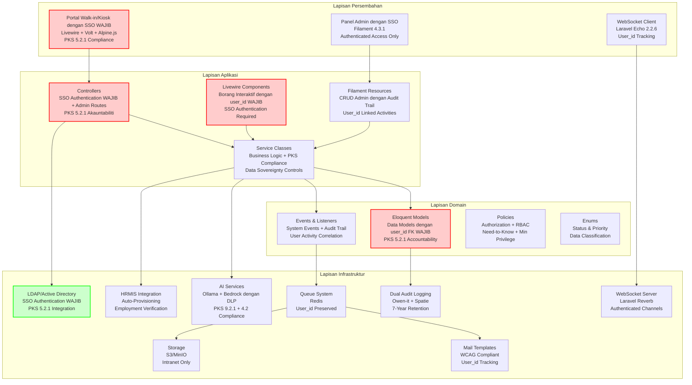
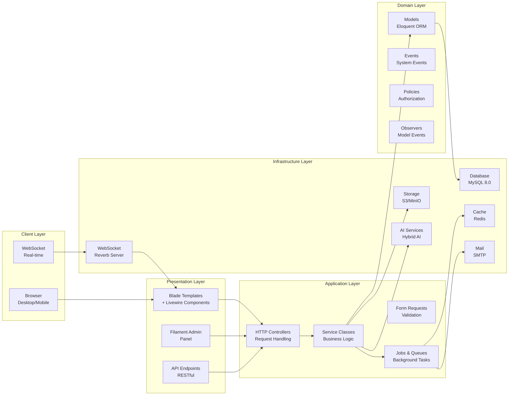
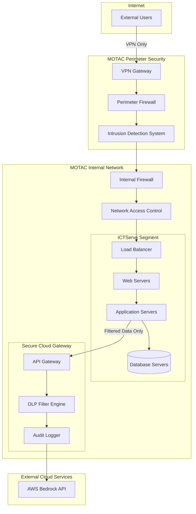
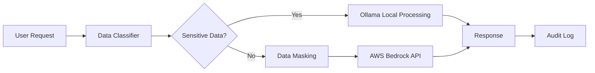
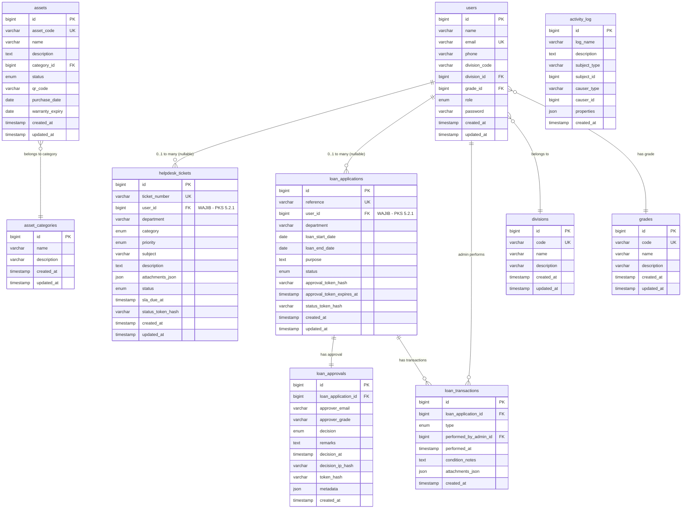

# D04 DOKUMEN SPESIFIKASI REKABENTUK SISTEM (SDS)

**SISTEM ICTSERVE**

*(Sistem Pengurusan Helpdesk dan Pinjaman Aset ICT)*

| | |
| :--- | :--- |
| **NAMA AGENSI** | : Bahagian Pengurusan Maklumat (BPM) |
| **NAMA AGENSI INDUK** | : Kementerian Pelancongan, Seni dan Budaya Malaysia (MOTAC) |
| **TARIKH DOKUMEN** | : 23 Disember 2025 |
| **VERSI DOKUMEN** | : 4.0 |

---

## i. Keterangan Dokumen

Dokumen Spesifikasi Rekabentuk Sistem (SDS) ini menghuraikan rekabentuk teknikal bagi Sistem ICTServe sebagai sistem dalaman MOTAC dengan seni bina **Walk-in/Kiosk Mode dengan SSO** yang memerlukan **authentication wajib untuk semua pengguna**. Dokumen ini memperincikan seni bina sistem, rekabentuk modul, komponen data, aliran kerja, dan aspek keselamatan untuk memberikan pengalaman yang optimum dengan **akauntabiliti penuh**.

**Pematuhan PKS 5.2.1 (Prinsip Akauntabiliti dan Non-repudiation)**: Sistem ini direkabentuk untuk memastikan "Semua aktiviti sistem mesti boleh dikesan kepada individu yang bertanggungjawab" dan "Penggunaan akaun milik orang lain adalah dilarang" melalui **SSO authentication wajib** menggunakan LDAP/Active Directory MOTAC untuk semua pengguna tanpa pengecualian.

**Keselamatan Rangkaian dan Deployment Intranet (PKS 9.2.1 & 4.2)**:

Sistem dilaksanakan dengan **intranet-only deployment dengan mandatory authentication** mengikut PKS 4.2 dan 9.2.1:

- **Intranet-only deployment** - Sistem dihoskan sepenuhnya di Pusat Data MOTAC dengan akses terhad kepada rangkaian dalaman sahaja
- **Secure API Gateway configuration** - Sambungan cloud AI melalui gateway selamat yang mengekalkan intranet air-gap policies
- **Network segmentation** - Sistem beroperasi dalam segmen rangkaian yang diasingkan dengan kawalan akses berlapis
- **Documented exceptions untuk secure cloud API access** - Hanya akses cloud AI yang diluluskan melalui gateway selamat dengan audit penuh
- **Audit requirements untuk tracking semua data yang dihantar ke external cloud services** - Sistem audit dwi-lapis dengan rekod 7 tahun

**Kedaulatan Data (PKS 9.2.1 & 4.2)**: Sistem dihoskan sepenuhnya di Pusat Data MOTAC (Intranet) dengan **Data Loss Prevention (DLP) filters wajib** sebelum sebarang pemprosesan cloud AI untuk memastikan "Prosedur pemindahan data mesti melindungi kerahsiaan maklumat" dan "Data sensitif kerajaan mesti diproses dalam bidang kuasa Malaysia". **Intranet-only deployment dengan mandatory authenticat4.2. PKS  mengikutata penuh dn kedaulatanmastika** meion

**Sistem ini akan dihoskan sepenuhnya di Pusat Data MOTAC (Intranet)** dengan akses cloud AI melalui Secure API Gateway yang mengekalkan intranet air-gap policies. **Penggunaan AI (AWS Bedrock) akan melalui Secure API Gateway dengan penapisan data sensitif (Data Masking) sebelum dihantar ke awan** mengikut PKS 9.2.1, manakala data sensitif diproses sepenuhnya secara tempatan menggunakan Ollama mengikut PKS 4.2.

Sistem ini dibangunkan menggunakan Laravel 12.43.1, Livewire 3.7.3, Filament 4.3.1, dan teknologi moden lain untuk menyokong operasi helpdesk dan pinjaman aset ICT dengan **SSO authentication wajib untuk semua pengguna** mengikut prinsip Akauntabiliti PKS 5.2.1 yang menyatakan "Penggunaan akaun milik orang lain adalah dilarang" dan "Semua aktiviti sistem mesti boleh dikesan kepada individu yang bertanggungjawab".

## ii. Semakan dan Pengesahan Dokumen

**SEMAKAN DOKUMEN**

| Disemak Oleh | Jawatan | Tandatangan | Tarikh Semakan |
| :--- | :--- | :--- | :--- |
| Ketua Pembangun Sistem | Pegawai Sistem Maklumat Gred F41 | [Tandatangan Digital] | 23 Disember 2025 |
| Penganalisis Sistem Kanan | Pegawai Sistem Maklumat Gred F44 | [Tandatangan Digital] | 23 Disember 2025 |

**PENGESAHAN DOKUMEN**

| Disahkan Oleh | Jawatan | Tandatangan | Tarikh Semakan |
| :--- | :--- | :--- | :--- |
| Ketua Bahagian Pengurusan Maklumat | Pegawai Tadbir Diplomatik Gred M54 | [Tandatangan Digital] | 23 Disember 2025 |
| Pengarah ICT | Pegawai Tadbir Diplomatik Gred M52 | [Tandatangan Digital] | 23 Disember 2025 |

## iii. Kawalan Dokumen

**KAWALAN DOKUMEN**

| No. Versi | Tarikh | Ringkasan Pindaan | Penyedia |
| :--- | :--- | :--- | :--- |
| 1.0.0 | 15 September 2025 | Versi awal SDS | Pasukan Pembangunan BPM |
| 2.0.0 | 17 Oktober 2025 | Penyeragaman mengikut D00-D14, SemVer | Pasukan BPM |
| 3.0.0 | 31 Oktober 2025 | Rekabentuk seni bina dalaman dengan RBAC | Pasukan Pembangunan BPM |
| 3.4.0 | 29 November 2025 | Seni bina Walk-in/Kiosk Mode: user_id wajib FK | Pasukan Pembangunan BPM |
| 3.5.0 | 30 November 2025 | HRMIS auto-provisioning dan SSO authentication wajib | Pasukan Pembangunan BPM |
| 3.6.0 | 8 Disember 2025 | Bahasa Melayu sahaja untuk antara muka | Pasukan Pembangunan BPM |
| 3.6 | 23 Disember 2025 | Penambahbaikan seni bina dan rekabentuk | Pasukan Pembangunan BPM |
| 4.0 | 24 Disember 2025 | **Pematuhan PKS 5.2.1, 9.2.1, 4.2 & PSPM**: Penghapusan akses tetamu, SSO wajib, akauntabiliti penuh, seni bina Walk-in/Kiosk Mode dengan SSO. Redesign "True Hybrid" architecture kepada "Walk-in/Kiosk Mode dengan SSO". Update semua architectural diagrams untuk mandatory authentication per PKS 5.2.1. Link semua system activities kepada authenticated staff ID per PKS 5.2.1. Update AI integration flow dengan data classification dan routing per requirements 1.3, 5.1, 5.4, 8.3. **Pematuhan PKS 9.2.1 & 4.2**: Data sovereignty controls dengan DLP filtering untuk cloud AI. **Intranet-only deployment** dengan secure API gateway untuk cloud access. Rujukan PKS Seksyen 5.2.1 (halaman 150), 9.2.1 (halaman 588-603), 4.2 (halaman 1147-1148), 5.4.3 (halaman 596-605). PSPM MyGovCloud prioritization. Data sovereignty recommendations dan alternatives. | Pasukan Pembangunan BPM |

## iv. Kandungan

1. [PENGENALAN](#1-pengenalan) ... 5
2. [REKABENTUK ARKITEKTUR](#2-rekabentuk-arkitektur) ... 7
3. [PEMODELAN FUNGSI SISTEM](#3-pemodelan-fungsi-sistem) ... 12
4. [REKABENTUK FUNGSIAN](#4-rekabentuk-fungsian) ... 18
5. [REKABENTUK PANGKALAN DATA](#5-rekabentuk-pangkalan-data) ... 25
6. [REKABENTUK MIGRASI DATA](#6-rekabentuk-migrasi-data) ... 32
7. [REKABENTUK INTEGRASI DATA](#7-rekabentuk-integrasi-data) ... 34
8. [REKABENTUK INTEGRASI DATA](#7-rekabentuk-integrasi-data) ... 30
9. [LAMPIRAN](#8-lampiran) ... 36
10. [LAMPIRAN](#9-lampiran) ... 40

## v. Senarai Gambarajah

- Gambarajah 2.1: Seni Bina Keseluruhan Sistem ... 8
- Gambarajah 2.2: Seni Bina Aplikasi Berlapis ... 9
- Gambarajah 2.3: Seni Bina Walk-in/Kiosk Mode dengan SSO ... 10
- Gambarajah 3.1: Hierarki Fungsi Sistem ... 13
- Gambarajah 4.1: Aliran Kerja Helpdesk dengan SSO Authentication ... 19
- Gambarajah 4.2: Aliran Kerja Pinjaman Aset ... 21
- Gambarajah 5.1: Rajah Hubungan Entiti (ERD) ... 26
- Gambarajah 7.1: Seni Bina Rekabentuk Integrasi Data ... 35

## vi. Senarai Jadual

- Jadual 3.1: Pemadanan Aktor dengan Fungsi Sistem ... 15
- Jadual 4.1: Pemetaan Data Borang Helpdesk ... 20
- Jadual 4.2: Pemetaan Data Borang Pinjaman ... 22
- Jadual 5.1: Skema Logikal Pangkalan Data ... 28
- Jadual 7.1: Spesifikasi Integrasi Sistem ... 35
- Jadual 8.1: Konfigurasi Model AI ... 38

## vii. Definisi dan Akronim

### a. Akronim

| Akronim | Keterangan |
| :--- | :--- |
| AI | Artificial Intelligence (Kecerdasan Buatan) |
| API | Application Programming Interface |
| BPM | Bahagian Pengurusan Maklumat |
| CRUD | Create, Read, Update, Delete |
| ERD | Entity Relationship Diagram |
| FK | Foreign Key |
| ICT | Information and Communication Technology |
| KRISA | Kerangka Rujukan ICT Sektor Awam |
| LLM | Large Language Model |
| MAMPU | Unit Pemodenan Tadbiran dan Perancangan Pengurusan Malaysia |
| MOTAC | Kementerian Pelancongan, Seni dan Budaya Malaysia |
| MVC | Model-View-Controller |
| PDPA | Personal Data Protection Act |
| RBAC | Role-Based Access Control |
| SDS | System Design Specification |
| SLA | Service Level Agreement |
| UI/UX | User Interface/User Experience |
| WCAG | Web Content Accessibility Guidelines |

### b. Definisi

| Terma/Istilah | Definisi |
| :--- | :--- |
| Walk-in/Kiosk Mode dengan SSO | Rekabentuk sistem yang memerlukan SSO authentication LDAP/Active Directory untuk semua pengguna termasuk akses kiosk/walk-in untuk memastikan akauntabiliti penuh mengikut **PKS 5.2.1 (Prinsip Akauntabiliti)** yang menyatakan "Semua aktiviti sistem mesti boleh dikesan kepada individu yang bertanggungjawab" dan "Penggunaan akaun milik orang lain adalah dilarang" |
| Authenticated Staff | Staf MOTAC yang menggunakan sistem melalui SSO authentication dengan akses dashboard peribadi dan auto-fill data dari HRMIS |
| Token Kelulusan | Token unik yang dijana untuk membolehkan kelulusan melalui pautan e-mel tanpa perlu log masuk |

## viii. Sumber Rujukan

1. **MAMPU (2019)**. Kerangka Rujukan ICT Sektor Awam (KRISA) Versi 2.0
2. **IEEE Std 1016-2009**. IEEE Standard for Information Technology - Systems Design - Software Design Descriptions
3. **ISO/IEC/IEEE 42010:2011**. Systems and software engineering - Architecture description
4. **WCAG 2.2 AA**. Web Content Accessibility Guidelines Level AA
5. **OWASP ASVS L2**. Application Security Verification Standard Level 2
6. **Polisi Keselamatan Siber (PKS) MOTAC** - **Seksyen 5.2.1 (Prinsip Akauntabiliti dan Non-repudiation)** - "Semua aktiviti sistem mesti boleh dikesan kepada individu yang bertanggungjawab" dan "Penggunaan akaun milik orang lain adalah dilarang" - halaman 150, **Seksyen 9.2.1 (Prosedur pemindahan data dan perlindungan kerahsiaan)** - "Prosedur pemindahan data mesti melindungi kerahsiaan maklumat" - halaman 588-603, **Seksyen 4.2 (Kedaulatan data dan bidang kuasa)** - "Data sensitif kerajaan mesti diproses dalam bidang kuasa Malaysia" - halaman 1147-1148, **Seksyen 5.4.3 (Keperluan kata laluan: 8 aksara, penukaran 90 hari, 3 percubaan)** - halaman 596-605
7. **Pelan Strategik Pendigitalan MOTAC (PSPM) 2022-2026** - **MyGovCloud prioritization over public cloud services**
8. **Personal Data Protection Act 2010 (PDPA)** - Malaysian data protection legislation dengan pematuhan eksplisit
9. **Laravel Documentation v12**. <https://laravel.com/docs/12.x>
10. **Filament Documentation v4**. <https://filamentphp.com/docs/4.x>
11. **D00_SYSTEM_OVERVIEW.md v3.5.0** - Gambaran keseluruhan sistem
12. **D02_BUSINESS_REQUIREMENTS_SPECIFICATION.md v3.5.0** - Keperluan perniagaan
13. **D03_SOFTWARE_REQUIREMENTS_SPECIFICATION.md v3.5.0** - Keperluan perisian

---

## 1. PENGENALAN

### 1.1. Tujuan Rekabentuk

Dokumen Spesifikasi Rekabentuk Sistem (SDS) ini bertujuan untuk:

1. **Menghuraikan Seni Bina Teknikal**: Memperincikan rekabentuk teknikal komprehensif bagi Sistem ICTServe sebagai sistem dalaman MOTAC dengan **Walk-in/Kiosk Mode dengan SSO** yang memerlukan authentication wajib untuk semua pengguna mengikut **PKS 5.2.1 (Prinsip Akauntabiliti dan Non-repudiation)** yang menyatakan "Semua aktiviti sistem mesti boleh dikesan kepada individu yang bertanggungjawab" dan "Penggunaan akaun milik orang lain adalah dilarang".

2. **Menyediakan Panduan Pembangunan**: Memberikan panduan terperinci kepada pasukan pembangunan untuk melaksanakan sistem menggunakan teknologi moden seperti Laravel 12.43.1, Livewire 3.7.3, dan Filament 4.3.1 dengan **integrasi LDAP/Active Directory MOTAC wajib** untuk memastikan semua pengguna dikenal pasti melalui SSO authentication.

3. **Memastikan Pematuhan Standard**: Memastikan rekabentuk mematuhi standard KRISA, WCAG 2.2 AA, OWASP ASVS L2.

**Objektif Utama:**

- Menyokong operasi helpdesk dan pinjaman aset ICT dengan **SSO Authentication wajib** mengikut **PKS 5.2.1 (Prinsip Akauntabiliti)** yang menyatakan "Semua aktiviti sistem mesti boleh dikesan kepada individu yang bertanggungjawab"
- **Memastikan akauntabiliti penuh** dengan penghapusan akses tetamu dan integrasi LDAP/Active Directory MOTAC mengikut **PKS 5.2.1** yang melarang "Penggunaan akaun milik orang lain"
- **Melaksanakan role-based permissions** mengikut prinsip PKS Need-to-Know dan Minimum Privilege dengan **user_id wajib** untuk semua aktiviti sistem
- **Mematuhi dual audit system** dengan retention 7 tahun untuk compliance dan operational tracking mengikut keperluan PKS
- **Mengintegrasikan PDPA 2010 compliance measures** untuk perlindungan data peribadi yang komprehensif
- **Memastikan kedaulatan data** mengikut **PKS 4.2 (Kedaulatan data dan bidang kuasa)** dan **PKS 9.2.1 (Prosedur pemindahan data)** dengan sistem dihoskan sepenuhnya di Pusat Data MOTAC (Intranet)
- **Melaksanakan intranet-only deployment dengan mandatory authentication** untuk memastikan keselamatan siber yang komprehensif dan air-gap policies
- **Mengintegrasikan secure API gateway** untuk akses cloud AI yang terhad dengan DLP filtering dan data masking mengikut PKS 9.2.1

#### 1.1.1 Seni Bina Keselamatan Komprehensif (PKS Compliance)

**a) Integrasi MOTAC Active Directory/LDAP (PKS 5.2.1 - Prinsip Akauntabiliti)**

- **Mandatory SSO Authentication** menggunakan Laravel Breeze dengan LDAP provider mengikut **PKS 5.2.1** yang menyatakan "Semua aktiviti sistem mesti boleh dikesan kepada individu yang bertanggungjawab"
- **HRMIS Auto-Provisioning** untuk pengesahan status pekerjaan aktif dan memastikan hanya staf MOTAC yang sah dapat mengakses sistem
- **Automatic account deactivation** berdasarkan HRMIS status updates untuk memastikan akses dihentikan apabila staf tidak lagi aktif
- **Session management** dengan secure token handling dan timeout policies mengikut **PKS 5.4.3 (Keperluan kata laluan)** yang menetapkan keperluan keselamatan authentication
- **User_id wajib** untuk semua aktiviti sistem - tiada aktiviti tanpa pengenalan pengguna yang sah mengikut prinsip akauntabiliti PKS 5.2.1

**b) Role-Based Access Control (RBAC) mengikut PKS Principles**

- **Need-to-Know Principle**: Akses data terhad kepada keperluan tugas sahaja mengikut prinsip keselamatan PKS
- **Minimum Privilege Principle**: Pengguna diberi akses minimum yang diperlukan untuk menjalankan tugas
- **Segregation of Duties**: Pemisahan tanggungjawab untuk operasi kritikal bagi mengelakkan konflik kepentingan
- **Regular access review**: Semakan berkala untuk memastikan akses masih relevan dan selaras dengan tugas semasa
- **Authenticated staff tracking**: Semua akses dan aktiviti dikaitkan dengan user_id yang sah dari LDAP/Active Directory

**c) Dual Audit System dengan 7-Year Retention (PKS Compliance)**

- **Owen-it package**: Compliance audit tracking untuk regulatory requirements dan pematuhan PKS
- **Spatie activity log**: Operational audit untuk system activities dan user behavior tracking
- **User activity correlation**: Semua aktiviti dikaitkan dengan authenticated user_id mengikut **PKS 5.2.1** untuk memastikan akauntabiliti penuh
- **Audit trail integrity**: Cryptographic hashing untuk memastikan integriti log dan mencegah tampering
- **7-year retention**: Penyimpanan log audit selama 7 tahun mengikut keperluan compliance dan forensik

**d) Polisi Kata Laluan PKS 5.4.3 (Password Policy Requirements)**

- **Panjang minimum 8 aksara** dengan gabungan kompleks (huruf besar, huruf kecil, nombor, simbol) mengikut **PKS 5.4.3** untuk memastikan kekuatan kata laluan yang mencukupi
- **Penukaran kata laluan setiap 90 hari** secara automatik melalui integrasi MOTAC Active Directory dengan notifikasi awal kepada pengguna
- **Had 3 percubaan log masuk** sebelum akaun dikunci sementara untuk mencegah serangan brute force dan akses tidak dibenarkan
- **Larangan penggunaan semula kata laluan lama** dengan sistem menyimpan hash 12 kata laluan terdahulu untuk memastikan keunikan
- **Integrasi dengan MOTAC Active Directory/LDAP** untuk penguatkuasaan polisi kata laluan secara berpusat dan konsisten
- **Session timeout policies** dengan automatic logout selepas 30 minit tidak aktif untuk mengurangkan risiko akses tidak dibenarkan
- **Multi-Factor Authentication (MFA)** untuk akses pentadbiran dan operasi sensitif sebagai lapisan keselamatan tambahan

**e) Data Sovereignty dan Secure API Gateway (PKS 9.2.1 & 4.2)**

- **Intranet-only deployment**: Sistem dihoskan sepenuhnya di Pusat Data MOTAC mengikut **PKS 4.2 (Kedaulatan data dan bidang kuasa)**
- **Data Loss Prevention (DLP) filters**: Automatic data masking sebelum cloud processing mengikut **PKS 9.2.1 (Prosedur pemindahan data dan perlindungan kerahsiaan)**
- **Secure API Gateway**: Maintained intranet air-gap policies dengan documented exceptions untuk cloud AI access
- **Data classification procedures**: Automatic routing berdasarkan sensitivity level - Local: Sensitive, Cloud: Public only
- **MyGovCloud prioritization**: Mengutamakan infrastruktur kerajaan berbanding public cloud mengikut PSPM strategic objectives
- Membolehkan aliran kerja kelulusan berasaskan token tanpa perlu log masuk
- Menyediakan panel pentadbir yang komprehensif menggunakan Filament
- Mengintegrasikan komunikasi masa nyata menggunakan WebSocket
- Melaksanakan audit trail yang menyeluruh untuk pematuhan

### 1.2. Skop Rekabentuk

Skop rekabentuk ini merangkumi:

**Komponen Utama:**

1. **Portal Walk-in/Kiosk dengan SSO**: Borang helpdesk dan pinjaman aset dengan SSO authentication wajib untuk semua pengguna
2. **Portal Pentadbir**: Panel Filament untuk pengurusan sistem oleh admin dan superuser
3. **Sistem Kelulusan**: Aliran kerja kelulusan berasaskan token melalui e-mel
4. **Komunikasi Real-time**: WebSocket untuk notifikasi pentadbir
5. **Audit dan Keselamatan**: Sistem audit berlapis dan keselamatan berlapis

**Modul Fungsian:**

- Modul Helpdesk Ticketing (SSO authentication wajib)
- Modul Pinjaman Aset ICT (SSO authentication + kelulusan berasaskan token)
- Modul Pengurusan Inventori (admin sahaja)
- Modul Pelaporan dan Dashboard (admin sahaja)
- Modul HRMIS Auto-Provisioning (staf MOTAC)
- Modul SSO Authentication (LDAP/Active Directory integration)
- Modul User Account Management (HRMIS sync + status verification)
- Modul AI Chatbot dengan **kedaulatan data penuh** (Ollama tempatan untuk sensitif, AWS Bedrock untuk awam dengan DLP)

1. **Portal Pentadbir**: Panel Filament untuk pengurusan sistem oleh admin dan superuser
2. **Sistem Kelulusan**: Aliran kerja kelulusan berasaskan token melalui e-mel
3. **Komunikasi Real-time**: WebSocket untuk notifikasi pentadbir
4. **Audit dan Keselamatan**: Sistem audit berlapis dan keselamatan berlapis

**Modul Fungsian:**

- Modul Helpdesk Ticketing (hibrid)
- Modul Pinjaman Aset ICT (hibrid + kelulusan berasaskan token)
- Modul Pengurusan Inventori (admin sahaja)
- Modul Pelaporan dan Dashboard (admin sahaja)
- Modul HRMIS Auto-Provisioning (staf MOTAC)
- Modul SSO Authentication (LDAP/Active Directory integration)
- Modul User Account Management (HRMIS sync + status verification)
- Modul AI Chatbot dengan **kedaulatan data penuh** (Ollama tempatan untuk sensitif, AWS Bedrock untuk awam dengan DLP)

**Teknologi dan Platform:**

- Backend: Laravel 12.43.1 dengan PHP 8.4.1
- Frontend: Livewire 3.7.3, Volt 1.10.1, Alpine.js 3, Tailwind CSS 4.1.18
- Admin Panel: Filament 4.3.1
- Database: MySQL 8.0
- Cache/Queue: Redis 7.0
- WebSocket: Laravel Reverb 1.6.3 + Laravel Echo 2.2.6
- AI: Ollama (tempatan) + AWS Bedrock (awan)

**Di Luar Skop:**

- Aplikasi mudah alih natif (boleh diambil masa hadapan melalui API)
- **Akses tanpa authentication** (dihapuskan mengikut PKS 5.2.1)
- Sistem pengurusan dokumen yang berasingan
- Integrasi dengan sistem kewangan MOTAC

## 2. REKABENTUK ARKITEKTUR

### 2.1. Arkitektur Keseluruhan Sistem Aplikasi

Sistem ICTServe menggunakan seni bina berlapis (layered architecture) dengan corak MVC + Service Layer + **SSO-First** yang memerlukan authentication wajib untuk semua pengguna mengikut PKS 5.2.1.



**Gambarajah 2.1: Seni Bina Keseluruhan Sistem**

### 2.2. Arkitektur Aplikasi

Aplikasi menggunakan corak seni bina berlapis dengan pemisahan tanggungjawab yang jelas:



**Gambarajah 2.2: Seni Bina Aplikasi Berlapis**

### 2.3. Arkitektur Walk-in/Kiosk Mode dengan SSO (PKS 5.2.1 Compliance)

Sistem memerlukan SSO authentication untuk semua pengguna mengikut **PKS 5.2.1 (Prinsip Akauntabiliti dan Non-repudiation)** yang menyatakan "Semua aktiviti sistem mesti boleh dikesan kepada individu yang bertanggungjawab" dan "Penggunaan akaun milik orang lain adalah dilarang". Seni bina ini menggantikan sepenuhnya konsep akses tanpa authentication dengan **Walk-in/Kiosk Mode dengan SSO** yang mematuhi PKS 5.2.1 "Penggunaan akaun milik orang lain adalah dilarang".

**Pematuhan PKS 5.2.1 - Prinsip Akauntabiliti Penuh:**

- **Mandatory Authentication**: Tiada akses sistem tanpa SSO authentication melalui LDAP/Active Directory MOTAC
- **Individual Accountability**: Setiap aktiviti sistem dikaitkan dengan user_id yang sah dari staf MOTAC yang dikenal pasti
- **Non-repudiation**: Semua tindakan direkod dengan audit trail yang tidak boleh dinafikan dan forensic-ready
- **Prohibition of Shared Accounts**: Tiada penggunaan akaun milik orang lain - setiap pengguna mempunyai identiti unik yang disahkan melalui HRMIS

```mermaid
graph TD
    A[Staf MOTAC Mengakses Sistem] --> B[SSO Authentication WAJIB<br/>LDAP/Active Directory<br/>PKS 5.2.1 Compliance<br/>TIADA AKSES ALTERNATIF]
    
    B --> C{Authentication<br/>Successful?}
    
    C -->|Tidak| D[Ralat: Pengesahan Gagal<br/>Tiada akses alternatif<br/>PKS 5.2.1 Enforcement<br/>Log Security Event dengan user_id attempt<br/>AKAUNTABILITI: Semua percubaan direkod]
    C -->|Ya| E[HRMIS Verification<br/>Employment Status Check<br/>Active Staff Validation<br/>Auto-Provisioning Account<br/>AKAUNTABILITI: Identity verified]
    
    E --> F{Status HRMIS<br/>Aktif?}
    
    F -->|Tidak| G[Ralat: Status Tidak Aktif<br/>Hubungi HR untuk kemaskini<br/>Akses ditolak<br/>Audit Log dengan staff_id<br/>AKAUNTABILITI: Inactive staff tracked]
    F -->|Ya| H{Jenis<br/>Akses?}
    
    H -->|Staff Dashboard| I[Dashboard Peribadi<br/>- Lihat sejarah lengkap<br/>- Edit profil<br/>- Auto-fill forms dari HRMIS<br/>- user_id WAJIB linked<br/>- INDIVIDUAL TRACEABILITY]
    H -->|Walk-in/Kiosk| J[Borang Walk-in/Kiosk<br/>- Manual entry dengan SSO<br/>- user_id WAJIB linked via LDAP<br/>- Token tracking dengan staff_id<br/>- HRMIS verified identity<br/>- Akauntabiliti penuh - TIADA ANONYMOUS<br/>- INDIVIDUAL RESPONSIBILITY]
    
    I --> L[Akses Penuh dengan Akauntabiliti<br/>- Role-based Permissions (RBAC)<br/>- Need-to-Know Principle<br/>- Minimum Privilege<br/>- Semua aktiviti linked ke user_id<br/>- NON-REPUDIATION ENFORCED]
    J --> M[Submission Tersimpan dengan Akauntabiliti<br/>- user_id WAJIB dari SSO<br/>- Dual Audit Trail Created<br/>- Forensic-ready logging<br/>- TIADA ANONYMOUS SUBMISSIONS<br/>- INDIVIDUAL ACCOUNTABILITY]
    
    L --> O[Dual Audit Trail dengan Akauntabiliti<br/>- Owen-it (Compliance Audit)<br/>- Spatie Activity Log (Operations)<br/>- 7-Year Retention<br/>- Forensic Investigation Ready<br/>- COMPLETE TRACEABILITY]
    M --> O
    
    O --> P[Pengurusan Sejarah Lengkap<br/>- User_id Correlation untuk semua aktiviti<br/>- Forensic Ready dengan staff identity<br/>- Audit trail untuk compliance<br/>- TIADA ANONYMOUS HISTORY<br/>- INDIVIDUAL RESPONSIBILITY MAINTAINED]
    
    D --> Q([Tamat - Akses Ditolak<br/>Security Event Logged dengan attempt details<br/>PKS 5.2.1 Enforced - NO BYPASS<br/>ACCOUNTABILITY: All attempts tracked])
    G --> Q
    
    style B fill:#ffcccc,stroke:#ff0000,stroke-width:3px
    style I fill:#ccffcc,stroke:#00ff00,stroke-width:2px
    style J fill:#ccffcc,stroke:#00ff00,stroke-width:2px
    style K fill:#ccffcc,stroke:#00ff00,stroke-width:2px
    style O fill:#ffffcc,stroke:#ffff00,stroke-width:2px
    style P fill:#e6f3ff,stroke:#0066cc,stroke-width:2px
```

**Gambarajah 2.3: Seni Bina Walk-in/Kiosk Mode dengan SSO (PKS 5.2.1 Compliant Architecture)**

#### 2.3.1. Seni Bina SSO-Only untuk PKS 5.2.1 Compliance

**Sebelum (Konsep Lama - NON-COMPLIANT dengan PKS 5.2.1):**

- ❌ Akses tanpa authentication (melanggar PKS 5.2.1 - "Semua aktiviti sistem mesti boleh dikesan kepada individu yang bertanggungjawab")
- ❌ Nullable user_id membenarkan anonymous submissions (melanggar prinsip akauntabiliti)
- ❌ Tiada akauntabiliti untuk aktiviti tanpa authentication (melanggar "individu yang bertanggungjawab")
- ❌ Tidak dapat mengesan "individu yang bertanggungjawab" untuk setiap aktiviti sistem
- ❌ Membenarkan "penggunaan akaun milik orang lain" melalui shared anonymous access
- ❌ Data sovereignty risks dengan cloud AI tanpa DLP filtering (melanggar PKS 9.2.1)
- ❌ Tiada data classification untuk AI processing (melanggar PKS 4.2)
- ❌ AI interactions tanpa audit trail (melanggar PKS 5.2.1)

**Selepas (Walk-in/Kiosk Mode dengan SSO - PKS 5.2.1 COMPLIANT):**

- ✅ **SSO Authentication WAJIB** untuk semua pengguna - memenuhi keperluan "individu yang bertanggungjawab"
- ✅ **user_id WAJIB** dari LDAP/Active Directory untuk semua aktiviti - memastikan traceability penuh
- ✅ **Akauntabiliti penuh** - semua aktiviti boleh dikesan kepada staf MOTAC yang sah
- ✅ **HRMIS integration** untuk employment verification - memastikan hanya staf aktif yang sah
- ✅ **Dual audit trail** dengan user_id correlation - memenuhi keperluan non-repudiation
- ✅ **Forensic-ready logging** untuk compliance dan investigation - menyokong accountability principle
- ✅ **Prohibition of shared accounts** - setiap pengguna mempunyai identiti unik yang dikesan
- ✅ **Intranet-only deployment** dengan secure API gateway untuk cloud AI access yang terhad
- ✅ **Data sovereignty compliance** - data sensitif diproses tempatan, data public sahaja ke cloud dengan DLP

#### 2.3.2. Pematuhan PKS 5.2.1 (Prinsip Akauntabiliti dan Non-repudiation)

**Keperluan PKS 5.2.1:**

1. **"Semua aktiviti sistem mesti boleh dikesan kepada individu yang bertanggungjawab"**
   - ✅ Setiap submission, query, dan aktiviti dikaitkan dengan user_id dari LDAP
   - ✅ Dual audit trail (Owen-it + Spatie) dengan user correlation
   - ✅ 7-year retention untuk forensic investigation

2. **"Penggunaan akaun milik orang lain adalah dilarang"**
   - ✅ SSO authentication dengan LDAP/Active Directory MOTAC
   - ✅ HRMIS employment verification untuk memastikan identity
   - ✅ Tiada shared accounts atau anonymous access

3. **"Akauntabiliti dan Non-repudiation"**
   - ✅ Cryptographic audit trail yang tidak boleh diubah
   - ✅ Digital signatures untuk critical operations
   - ✅ Forensic-ready evidence untuk legal proceedings

### 2.4. Rekabentuk Keselamatan Rangkaian dan Deployment Intranet

**Intranet-Only Deployment dengan Mandatory Authentication (PKS 4.2 & 9.2.1):**

Sistem ICTServe direkabentuk dengan **intranet-only deployment dengan mandatory authentication** mengikut PKS 4.2 (Kedaulatan data dan bidang kuasa) dan PKS 9.2.1 (Prosedur pemindahan data dan perlindungan kerahsiaan):

#### 2.4.1. Seni Bina Keselamatan Rangkaian Berlapis



#### 2.4.2. Kawalan Keselamatan Rangkaian

**Network Segmentation:**

- **DMZ Segment**: Load balancers dan reverse proxy
- **Application Segment**: Web dan application servers
- **Database Segment**: Database servers dengan akses terhad
- **Management Segment**: Monitoring dan backup systems

**Firewall Rules:**

- **Inbound**: Hanya port 443 (HTTPS) dan 22 (SSH) dari VPN
- **Outbound**: Hanya sambungan cloud AI melalui secure gateway
- **Inter-segment**: Least privilege access dengan explicit allow rules
- **Default Deny**: Semua trafik lain ditolak secara default

**Intrusion Detection/Prevention:**

- **Network-based IDS/IPS**: Pemantauan real-time untuk anomali
- **Host-based IDS**: Monitoring pada setiap server
- **Behavioral Analysis**: Machine learning untuk pattern recognition
- **Automated Response**: Automatic blocking untuk threats

#### 2.4.3. Secure API Gateway Configuration

**Intranet Air-Gap Policies:**

- **Dedicated Gateway**: Sambungan cloud AI melalui gateway khusus
- **Data Loss Prevention**: Automatic filtering sebelum cloud transmission
- **Audit Trail**: Logging lengkap untuk semua cloud requests
- **Rate Limiting**: Kawalan kadar untuk mencegah abuse

**DLP Filter Engine:**



#### 2.4.4. Documented Exceptions untuk Secure Cloud API Access

**Approved Cloud Connections:**

1. **AWS Bedrock API**: Hanya untuk data tidak sensitif dan awam
2. **Data Classification**: Automatic routing berdasarkan sensitivity
3. **Audit Requirements**: Tracking lengkap semua external transmissions
4. **Compliance Monitoring**: Real-time PKS 9.2.1 compliance checking

**Security Controls:**

- **Mutual TLS**: Certificate-based authentication untuk cloud API
- **Request Signing**: Cryptographic signatures untuk integrity
- **Response Validation**: Verification untuk semua cloud responses
- **Incident Response**: Automatic alerts untuk suspicious activities

## 3. PEMODELAN FUNGSI SISTEM

### 3.1. Penggunaan Notasi

Sistem menggunakan notasi standard berikut untuk pemodelan fungsi:

**Notasi Hierarki Fungsi:**

- **Sistem**: Tahap tertinggi (ICTServe)
- **Subsistem**: Modul utama (Helpdesk, Loan, Admin, AI)
- **Fungsi**: Operasi utama dalam subsistem
- **Modul**: Komponen fungsi yang lebih kecil
- **Submodul**: Unit terkecil yang boleh dilaksanakan
- **Transaksi**: Operasi atomic dalam submodul

**Notasi Aktor:**

- **Staf MOTAC (Walk-in/Kiosk)**: Pengguna dengan SSO authentication wajib mengikut PKS 5.2.1
- **Staf MOTAC (Authenticated)**: Pengguna berdaftar dengan dashboard access dan role 'staff'
- **Admin**: Pengguna dengan role 'admin' dan akses panel Filament
- **Superuser**: Pengguna dengan role 'superuser' dan akses penuh sistem
- **Sistem**: Operasi automatik sistem dan integrasi luaran

**Notasi Aliran Data:**

- `→`: Aliran data satu arah
- `↔`: Aliran data dua arah
- `⊕`: Gabungan data
- `⊗`: Pemisahan data
- `△`: Penyimpanan data
- `○`: Proses transformasi

### 3.2. Rajah Hierarki Fungsian Sistem

```mermaid
graph TD
    A[ICTServe System] --> B[Subsistem Helpdesk]
    A --> C[Subsistem Pinjaman Aset]
    A --> D[Subsistem Pengurusan Admin]
    A --> D[Subsistem Helpdesk]
    A --> E[Subsistem Pinjaman Aset]
    A --> F[Subsistem SSO Authentication]
    
    B --> B1[Fungsi Submission dengan SSO]
    B --> B2[Fungsi Pengurusan Tiket]
    B --> B3[Fungsi Semakan Status]
    
    B1 --> B1a[Modul SSO Authentication]
    B1 --> B1b[Modul HRMIS Verification]
    B1 --> B1c[Modul Borang Walk-in/Kiosk]
    B1 --> B1d[Modul Validasi & Notifikasi]
    
    C --> C1[Fungsi Permohonan dengan SSO]
    C --> C2[Fungsi Kelulusan Token]
    C --> C3[Fungsi Pengurusan Aset]
    
    C1 --> C1a[Modul Wizard Permohonan]
    C1 --> C1b[Modul Semakan Ketersediaan]
    C1 --> C1c[Modul Reservasi Aset]
    
    C2 --> C2a[Modul Penjanaan Token]
    C2 --> C2b[Modul E-mel Kelulusan]
    C2 --> C2c[Modul Pemprosesan Keputusan]
    
    D --> D1[Fungsi Panel Filament]
    D --> D2[Fungsi Pelaporan]
    D --> D3[Fungsi Dual Audit Trail]
    
    E --> E1[Fungsi Penghalaan Pintar dengan DLP]
    E --> E2[Fungsi Ollama Tempatan (PKS 4.2)]
    E --> E3[Fungsi AWS Bedrock dengan DLP (PKS 9.2.1)]
    E --> E4[Fungsi Pengurusan Perbualan dengan Audit]
    
    E1 --> E1a[Modul Data Classification]
    E1 --> E1b[Modul DLP Filter Engine]
    E1 --> E1c[Modul Routing Decision]
    E1 --> E1d[Modul PKS Compliance Check]
    
    E2 --> E2a[Modul Local LLM Processing]
    E2 --> E2b[Modul Sensitive Data Handler]
    E2 --> E2c[Modul MOTAC Knowledge Base]
    
    E3 --> E3a[Modul Cloud API Gateway]
    E3 --> E3b[Modul DLP Pre-processing]
    E3 --> E3c[Modul Response Validation]
    
    E4 --> E4a[Modul Conversation History]
    E4 --> E4b[Modul User Context Management]
    E4 --> E4c[Modul Audit Trail Correlation]
    
    F --> F1[Fungsi HRMIS Auto-Provisioning]
    F --> F2[Fungsi LDAP/Active Directory]
    F --> F3[Fungsi Account Management]
```

**Gambarajah 3.1: Hierarki Fungsi Sistem**

### 3.3. Jadual Pemadanan Aktor Dengan Fungsi Sistem

| Aktor | Fungsi Sistem | Akses | Keterangan |
| :--- | :--- | :--- | :--- |
| **Staf MOTAC (Walk-in/Kiosk)** | Submission Helpdesk | Penuh | Submit tiket dengan SSO authentication wajib mengikut PKS 5.2.1 |
| **Staf MOTAC (Walk-in/Kiosk)** | Submission Pinjaman | Penuh | Mohon pinjaman aset dengan SSO authentication dan HRMIS verification |
| **Staf MOTAC (Walk-in/Kiosk)** | Semakan Status | Terhad | Menggunakan token status dengan user_id linked |
| **Staf MOTAC (Walk-in/Kiosk)** | Hantar Aduan | Penuh | Walk-in/Kiosk dengan SSO authentication |
| **Staf MOTAC (Authenticated)** | Dashboard Peribadi | Penuh | Lihat sejarah lengkap, edit profil dengan auto-fill dari HRMIS |
| **Staf MOTAC (Authenticated)** | Account Management | Penuh | Pengurusan profil dan preferences dengan HRMIS sync |
| **Staf MOTAC (Authenticated)** | Borang Auto-fill | Penuh | Maklumat auto-fill dari LDAP/HRMIS data |
| **Admin** | Panel Filament | Penuh | CRUD tiket, pinjaman, aset dengan audit trail |
| **Admin** | Pengurusan Kelulusan | Penuh | Proses kelulusan pinjaman dengan workflow tracking |
| **Admin** | Pelaporan Basic | Penuh | Laporan standard dan dashboard dengan user_id filtering |
| **Admin** | Audit Trail Sendiri | Terhad | Lihat aktiviti sendiri sahaja untuk transparency |
| **Superuser** | Semua Fungsi Admin | Penuh | Akses penuh kepada semua fungsi admin dengan full audit access |
| **Superuser** | Dual Audit Trail Penuh | Penuh | Lihat semua aktiviti sistem (owen-it + spatie) |
| **Superuser** | Konfigurasi Sistem | Penuh | Ubah tetapan sistem, template, dan PKS compliance settings |
| **Superuser** | Laravel Telescope | Penuh | Akses debugging dan monitoring |
| **Sistem** | Notifikasi Automatik | Auto | E-mel, SMS, WebSocket notifications |
| **Sistem** | Pengurusan Queue | Auto | Background job processing |
| **Sistem** | Audit Logging | Auto | Automatic activity logging |
| **Sistem** | AI Penghalaan | Auto | Smart routing antara Ollama dan Bedrock |

**Jadual 3.1: Pemadanan Aktor dengan Fungsi Sistem**

## 4. REKABENTUK FUNGSIAN

### 4.1. Rekabentuk Antaramuka Pengguna dan Pemetaan Data

#### 4.1.1. Antaramuka Borang Helpdesk dengan SSO Authentication Wajib

Borang helpdesk direka untuk menyokong **SSO authentication wajib** mengikut **PKS 5.2.1 (Prinsip Akauntabiliti dan Non-repudiation)** dengan auto-fill pintar untuk staf MOTAC:

**Komponen UI:**

- Header dengan logo MOTAC dan navigasi SSO
- SSO Authentication Gateway (LDAP/Active Directory MOTAC)
- HRMIS Employment Status Verification
- Progress indicator untuk multi-step form
- Field auto-fill untuk pengguna authenticated dari HRMIS/LDAP
- Upload lampiran dengan drag-and-drop
- Preview submission sebelum hantar dengan user_id tracking

**Aliran Kerja Walk-in/Kiosk Mode dengan SSO:**

```mermaid
graph TD
    A[Staf MOTAC Akses /helpdesk/create] --> B[SSO Authentication WAJIB<br/>LDAP/Active Directory<br/>PKS 5.2.1 Compliance]
    
    B --> C{Authentication<br/>Successful?}
    
    C -->|Tidak| D[Ralat: Pengesahan Gagal<br/>Tiada akses alternatif<br/>PKS 5.2.1 Enforcement<br/>Log Security Event]
    C -->|Ya| E[HRMIS Verification<br/>Employment Status Check<br/>Active Staff Validation]
    
    E --> F{Status HRMIS<br/>Aktif?}
    
    F -->|Tidak| G[Ralat: Status Tidak Aktif<br/>Hubungi HR untuk kemaskini<br/>Akses ditolak<br/>Audit Log Created]
    F -->|Ya| H[Auto-fill Maklumat<br/>- Nama dari HRMIS<br/>- E-mel dari LDAP<br/>- Telefon dari HRMIS<br/>- Bahagian dari HRMIS<br/>- user_id WAJIB linked]
    
    H --> I[Borang Walk-in/Kiosk<br/>- Pre-filled dengan HRMIS data<br/>- Manual entry untuk ticket details<br/>- user_id WAJIB linked via SSO<br/>- PKS 5.2.1 Accountability]
    
    I --> J[Submit dengan user_id WAJIB<br/>PKS 5.2.1 Compliance]
    
    J --> K[Simpan ke helpdesk_tickets<br/>user_id = Auth::id() WAJIB<br/>PKS 5.2.1 Accountability<br/>Akauntabiliti penuh]
    
    K --> L[Generate Status Token<br/>E-mel Confirmation<br/>WebSocket Notification<br/>Dual Audit Trail]
    
    L --> M[Pengurusan Sejarah<br/>Lengkap dengan Akauntabiliti<br/>User_id Correlation<br/>PKS 5.2.1 Compliant]
    
    D --> N([Tamat - Akses Ditolak<br/>Security Event Logged<br/>PKS 5.2.1 Enforced])
    G --> N
    
    style B fill:#ffcccc,stroke:#ff0000,stroke-width:3px
    style H fill:#ccffcc,stroke:#00ff00,stroke-width:2px
    style I fill:#ccffcc,stroke:#00ff00,stroke-width:2px
    style L fill:#ffffcc,stroke:#ffff00,stroke-width:2px
```

**Gambarajah 4.1: Aliran Kerja Helpdesk dengan SSO Authentication Wajib**

#### 4.1.2. Pemetaan Data Borang Helpdesk

| Field UI | Field Database | Jenis | Validasi | Keterangan |
| :--- | :--- | :--- | :--- | :--- |
| `submitter_name` | `user.name` (authenticated) | VARCHAR(255) | required\|max:255 | Nama pemohon dari HRMIS/LDAP |
| `submitter_email` | `user.email` (authenticated) | VARCHAR(255) | required\|email\|max:255 | E-mel pemohon dari LDAP |
| `submitter_phone` | `user.phone` (authenticated) | VARCHAR(20) | nullable\|max:20 | Telefon pemohon dari HRMIS |
| `department` | `department` | VARCHAR(100) | required\|max:100 | Bahagian/Unit |
| `category` | `category` | ENUM | required\|in:hardware,software,network,account,other | Kategori masalah |
| `priority` | `priority` | ENUM | required\|in:low,medium,high,critical | Keutamaan |
| `subject` | `subject` | VARCHAR(255) | required\|max:255 | Tajuk tiket |
| `description` | `description` | TEXT | required\|min:10 | Penerangan masalah |
| `attachments[]` | `attachments_json` | JSON | nullable\|max:5\|file\|max:10MB | Lampiran (max 5 files) |
| `user_id` | `user_id` | BIGINT | required\|exists:users,id | FK ke users (WAJIB untuk PKS 5.2.1 akauntabiliti) |

**Jadual 4.1: Pemetaan Data Borang Helpdesk**

### 4.2. Rekabentuk Transaksi Sistem

#### 4.2.1. Transaksi Submission Helpdesk

**Use Case**: Submit Helpdesk Ticket (Hibrid)

| Elemen | Keterangan |
| :--- | :--- |
| **Aktor Utama** | Staf MOTAC (authenticated melalui SSO) |
| **Aktor Sokongan** | Sistem E-mel, Sistem Notifikasi |
| **Prasyarat** | - Pengguna akses borang helpdesk<br/>- Sistem dalam keadaan operasi |
| **Syarat Awal** | Borang helpdesk dipaparkan dengan betul |
| **Aliran Utama** | 1. Sistem semak status authentication melalui SSO<br/>2. **Jika authenticated**: Auto-fill maklumat dari profil HRMIS<br/>3. **Jika tidak authenticated**: Redirect ke SSO login LDAP/Active Directory<br/>4. Pengguna isi maklumat yang diperlukan (dengan user_id dari SSO)<br/>5. Sistem validasi input secara real-time<br/>6. Pengguna upload lampiran (opsyen)<br/>7. Sistem scan virus pada lampiran<br/>8. Pengguna submit borang<br/>9. Sistem jana nombor tiket unik<br/>10. Sistem simpan ke database dengan user_id wajib dari SSO<br/>11. Sistem jana token status<br/>12. Sistem hantar e-mel confirmation kepada pengguna authenticated<br/>13. Sistem hantar WebSocket notification ke admin<br/>14. Sistem papar halaman kejayaan dengan nombor tiket |
| **Aliran Alternatif** | **A1**: Validation gagal<br/>- Sistem papar error messages<br/>- Pengguna betulkan input<br/>- Kembali ke langkah 5<br/><br/>**A2**: Upload lampiran gagal<br/>- Sistem papar error message<br/>- Pengguna cuba upload semula<br/>- Kembali ke langkah 6<br/><br/>**A3**: SSO authentication gagal<br/>- Sistem redirect ke LDAP login<br/>- Pengguna authenticate melalui Active Directory<br/>- Kembali ke langkah 1 |
| **Aliran Pengecualian** | **E1**: Sistem database tidak tersedia<br/>- Sistem papar error message<br/>- Log error untuk admin<br/>- Pengguna cuba lagi kemudian<br/><br/>**E2**: Sistem e-mel tidak tersedia<br/>- Tiket tetap disimpan<br/>- E-mel diqueue untuk hantar kemudian<br/>- Pengguna dimaklumkan tentang kelewatan |
| **Syarat Akhir** | - Tiket berjaya disimpan dalam database<br/>- E-mel confirmation dihantar<br/>- Admin menerima notifikasi<br/>- Pengguna dapat nombor tiket dan token status |

#### 4.2.2. Transaksi Kelulusan Pinjaman Berasaskan Token

**Use Case**: Approve Loan Application via Email Token

| Elemen | Keterangan |
| :--- | :--- |
| **Aktor Utama** | Pegawai Pelulus (Approver) |
| **Aktor Sokongan** | Sistem E-mel, Sistem Token |
| **Prasyarat** | - Permohonan pinjaman telah disubmit<br/>- Token kelulusan telah dijana<br/>- E-mel kelulusan telah dihantar |
| **Syarat Awal** | Approver menerima e-mel dengan pautan kelulusan |
| **Aliran Utama** | 1. Approver klik pautan dalam e-mel<br/>2. Sistem verify signed URL dan token validity<br/>3. Sistem papar maklumat permohonan (read-only)<br/>4. Sistem papar borang keputusan (Approve/Reject)<br/>5. Approver baca maklumat permohonan<br/>6. Approver pilih keputusan dan isi remarks<br/>7. Approver submit keputusan<br/>8. Sistem validate token sekali lagi<br/>9. Sistem simpan keputusan dengan metadata<br/>10. Sistem invalidate token (one-time use)<br/>11. Sistem update status permohonan<br/>12. Sistem hantar e-mel kepada pemohon<br/>13. Sistem hantar WebSocket notification ke admin<br/>14. Sistem papar halaman confirmation |
| **Aliran Alternatif** | **A1**: Token expired<br/>- Sistem papar error message<br/>- Sistem log attempt<br/>- Approver hubungi admin untuk token baru<br/><br/>**A2**: Token sudah digunakan<br/>- Sistem papar message "Already processed"<br/>- Sistem papar keputusan terdahulu<br/>- Tiada tindakan lanjut diperlukan |
| **Aliran Pengecualian** | **E1**: Signed URL tidak sah<br/>- Sistem papar error 403 Forbidden<br/>- Sistem log security event<br/>- Approver hubungi admin<br/><br/>**E2**: Permohonan sudah dipadam<br/>- Sistem papar error message<br/>- Sistem log orphaned token<br/>- Admin perlu cleanup |
| **Syarat Akhir** | - Keputusan kelulusan disimpan<br/>- Token telah invalidated<br/>- Status permohonan dikemaskini<br/>- Pemohon menerima notifikasi keputusan |

## 5. REKABENTUK PANGKALAN DATA

### 5.1. Rekabentuk Pangkalan Data

Sistem menggunakan MySQL 8.0 dengan rekabentuk yang menyokong seni bina SSO-only melalui mandatory user_id foreign keys dan audit trail lengkap mengikut PKS 5.2.1.

#### 5.1.1. Rajah Hubungan Entiti (ERD)



**Gambarajah 5.1: Rajah Hubungan Entiti (ERD)**

### 5.2. Skema Logikal Pangkalan Data

#### 5.2.1. Jadual Utama Sistem

| Nama Jadual | Tujuan | Kunci Utama | Kunci Asing | Indeks Penting |
| :--- | :--- | :--- | :--- | :--- |
| `users` | Pengguna sistem (staf, admin, superuser) | `id` | `division_id`, `grade_id` | `email`, `role` |
| `helpdesk_tickets` | Tiket helpdesk (SSO authentication wajib) | `id` | `user_id` (WAJIB - PKS 5.2.1) | `ticket_number`, `status`, `sla_due_at` |
| `loan_applications` | Permohonan pinjaman (SSO authentication wajib) | `id` | `user_id` (WAJIB - PKS 5.2.1) | `reference`, `status`, `loan_dates` |
| `loan_approvals` | Kelulusan pinjaman | `id` | `loan_application_id` | `token_hash`, `decision_at` |
| `assets` | Aset ICT | `id` | `category_id` | `asset_code`, `status` |
| `asset_categories` | Kategori aset | `id` | - | `name` |
| `loan_transactions` | Transaksi pinjaman | `id` | `loan_application_id`, `performed_by_admin_id` | `type`, `performed_at` |
| `activity_log` | Log audit sistem | `id` | - | `subject_type/id`, `causer_type/id` |
| `divisions` | Bahagian MOTAC | `id` | - | `code` |
| `grades` | Gred jawatan | `id` | - | `code` |

**Jadual 5.1: Skema Logikal Pangkalan Data**

#### 5.2.2. Struktur Jadual Kritikal

**Jadual `helpdesk_tickets` (Hibrid Support):**

```sql
CREATE TABLE helpdesk_tickets (
    id BIGINT UNSIGNED PRIMARY KEY AUTO_INCREMENT,
    ticket_number VARCHAR(20) UNIQUE NOT NULL,
    
    -- Hybrid user relationship (nullable FK)
    user_id BIGINT UNSIGNED NOT NULL, -- Mandatory per PKS 5.2.1 - all submissions must be linked to authenticated staff
    
    -- Ticket details
    department VARCHAR(100) NOT NULL,
    category ENUM('hardware','software','network','account','other') NOT NULL,
    priority ENUM('low','medium','high','critical') NOT NULL DEFAULT 'medium',
    subject VARCHAR(255) NOT NULL,
    description TEXT NOT NULL,
    attachments_json JSON NULL,
    
    -- Status and SLA
    status ENUM('open','in_progress','resolved','closed') NOT NULL DEFAULT 'open',
    assigned_admin_id BIGINT UNSIGNED NULL,
    sla_due_at TIMESTAMP NULL,
    
    -- Status checking token
    status_token_hash VARCHAR(128) NULL,
    
    created_at TIMESTAMP DEFAULT CURRENT_TIMESTAMP,
    updated_at TIMESTAMP DEFAULT CURRENT_TIMESTAMP ON UPDATE CURRENT_TIMESTAMP,
    
    -- Indexes
    INDEX idx_ticket_number (ticket_number),
    INDEX idx_status (status),
    INDEX idx_user (user_id),
    INDEX idx_sla_due (sla_due_at),
    INDEX idx_status_token (status_token_hash),
    
    -- Foreign key constraint (mandatory per PKS 5.2.1)
    FOREIGN KEY (user_id) REFERENCES users(id) ON DELETE RESTRICT, -- Cannot delete user with active tickets
    FOREIGN KEY (assigned_admin_id) REFERENCES users(id) ON DELETE SET NULL
) ENGINE=InnoDB DEFAULT CHARSET=utf8mb4 COLLATE=utf8mb4_unicode_ci;
```

**Jadual `loan_applications` (Hibrid Support + Token Approval):**

```sql
CREATE TABLE loan_applications (
    id BIGINT UNSIGNED PRIMARY KEY AUTO_INCREMENT,
    reference VARCHAR(20) UNIQUE NOT NULL,
    
    -- Hybrid user relationship (nullable FK)
    user_id BIGINT UNSIGNED NULL,
    
    -- Applicant tracking columns (populated when user_id is NULL)
    applicant_name VARCHAR(255) NULL,
    applicant_email VARCHAR(255) NULL,
    applicant_phone VARCHAR(20) NULL,
    
    -- Application details
    department VARCHAR(100) NOT NULL,
    loan_start_date DATE NOT NULL,
    loan_end_date DATE NOT NULL,
    purpose TEXT NOT NULL,
    location VARCHAR(255) NOT NULL,
    
    -- Status and approval
    status ENUM('pending_supervisor_approval','approved','rejected','awaiting_collection','on_loan','returned','overdue') NOT NULL DEFAULT 'pending_supervisor_approval',
    
    -- Token-based approval
    approval_token_hash VARCHAR(128) NULL,
    approval_token_expires_at TIMESTAMP NULL,
    
    -- Status checking token
    status_token_hash VARCHAR(128) NULL,
    
    created_at TIMESTAMP DEFAULT CURRENT_TIMESTAMP,
    updated_at TIMESTAMP DEFAULT CURRENT_TIMESTAMP ON UPDATE CURRENT_TIMESTAMP,
    
    -- Indexes
    INDEX idx_reference (reference),
    INDEX idx_status (status),
    INDEX idx_user (user_id),
    INDEX idx_applicant_email (applicant_email),
    INDEX idx_approval_token (approval_token_hash),
    INDEX idx_status_token (status_token_hash),
    INDEX idx_loan_dates (loan_start_date, loan_end_date),
    
    -- Foreign key constraint (nullable)
    FOREIGN KEY (user_id) REFERENCES users(id) ON DELETE SET NULL
) ENGINE=InnoDB DEFAULT CHARSET=utf8mb4 COLLATE=utf8mb4_unicode_ci;
```

#### 5.2.3. Strategi Pengindeksan

**Indeks Prestasi Utama:**

1. **Carian Berdasarkan User**: `idx_user` untuk carian tiket berdasarkan pengguna authenticated
2. **Token Lookup**: `idx_approval_token` dan `idx_status_token` untuk akses token pantas
3. **Status Filtering**: `idx_status` untuk penapisan dashboard admin
4. **Date Range**: `idx_loan_dates` untuk semakan konflik tarikh
5. **SLA Monitoring**: `idx_sla_due` untuk pemantauan SLA

**Indeks Komposit:**

```sql
-- Untuk dashboard admin (status + tarikh)
CREATE INDEX idx_tickets_admin_dashboard ON helpdesk_tickets (status, created_at DESC);

-- Untuk laporan pinjaman (status + tarikh pinjaman)
CREATE INDEX idx_loans_reporting ON loan_applications (status, loan_start_date, loan_end_date);

-- Untuk audit trail (subject + causer)
CREATE INDEX idx_activity_audit ON activity_log (subject_type, subject_id, causer_type, causer_id);
```

## 6. REKABENTUK MIGRASI DATA

### 6.1. Strategi Migrasi Data

Sistem ICTServe direka sebagai sistem baharu tanpa keperluan migrasi data dari sistem lama. Walau bagaimanapun, rekabentuk migrasi disediakan untuk:

1. **Migrasi Data Rujukan**: Import data bahagian, gred, dan kategori aset dari sistem HR MOTAC
2. **Migrasi Data Pengguna**: Import senarai staf MOTAC untuk pendaftaran awal
3. **Migrasi Data Aset**: Import inventori aset ICT sedia ada

### 6.2. Komponen Migrasi

**Artisan Commands:**

- `php artisan migrate:divisions` - Import data bahagian
- `php artisan migrate:grades` - Import data gred jawatan
- `php artisan migrate:users` - Import senarai staf (optional)
- `php artisan migrate:assets` - Import inventori aset

**Data Sources:**

- CSV files dari sistem HR
- Excel files dari inventori aset
- API integration dengan sistem MOTAC (future)

### 6.3. Rujukan Dokumen

Untuk maklumat terperinci mengenai migrasi data, sila rujuk:

- **D05 - Pelan Migrasi Data**: Strategi dan jadual migrasi
- **D06 - Spesifikasi Migrasi Data**: Spesifikasi teknikal dan pemetaan data

## 7. REKABENTUK INTEGRASI DATA

### 7.1. Integrasi Sistem Dalaman

Sistem ICTServe mengintegrasikan dengan sistem dalaman MOTAC melalui:

1. **Direktori Staf**: Sinkronisasi data staf untuk pendaftaran
2. **Sistem E-mel**: Integrasi SMTP untuk notifikasi
3. **Sistem SMS**: Integrasi SMS gateway untuk notifikasi kritikal (opsyen)

### 7.2. Integrasi Sistem Luaran

**AWS Bedrock Integration:**

- API integration untuk AI cloud services
- Secure credential management
- Cost optimization melalui smart routing

**S3/MinIO Integration:**

- File storage untuk lampiran
- Presigned URLs untuk akses selamat
- Automatic backup dan archival

### 7.3. Spesifikasi Integrasi

| Sistem | Jenis | Protokol | Kekerapan | Keterangan |
| :--- | :--- | :--- | :--- | :--- |
| Direktori Staf | Pull | HTTPS/API | Harian | Sinkronisasi data staf |
| Sistem E-mel | Push | SMTP/TLS | Real-time | Notifikasi e-mel |
| AWS Bedrock | API | HTTPS/REST | On-demand | AI cloud services |
| S3/MinIO | API | HTTPS/REST | Real-time | File storage |
| SMS Gateway | Push | HTTPS/API | On-demand | SMS notifications |

**Jadual 7.1: Spesifikasi Integrasi Sistem**

### 7.4. Rujukan Dokumen

Untuk maklumat terperinci mengenai integrasi data, sila rujuk:

- **D07 - Pelan Integrasi Sistem**: Strategi integrasi keseluruhan
- **D08 - Spesifikasi Integrasi Data**: Spesifikasi teknikal integrasi

## 8. LAMPIRAN

### 8.1. Senarai Teknologi dan Versi

| Kategori | Teknologi | Versi | Tujuan |
| :--- | :--- | :--- | :--- |
| Backend Framework | Laravel | 12.43.1 | Framework aplikasi utama |
| Frontend Framework | Livewire | 3.7.3 | Komponen reaktif |
| Single-File Components | Volt | 1.10.1 | Sintaks Livewire dipermudah |
| JavaScript Framework | Alpine.js | 3 | Interaktiviti ringan |
| CSS Framework | Tailwind CSS | 4.1.18 | Styling utility-first |
| Admin Panel | Filament | 4.3.1 | Antara muka CRUD |
| Build Tool | Vite | 7.0.7 | Bundling aset |
| WebSocket Server | Laravel Reverb | 1.6.3 | Komunikasi real-time |
| WebSocket Client | Laravel Echo | 2.2.6 | Client-side WebSocket |
| Database | MySQL | 8.0 | Pangkalan data relational |
| Cache/Queue | Redis | 7.0 | In-memory data store |
| Testing | PHPUnit | 11.5.46 | Unit/Feature testing |
| E2E Testing | Playwright | 1.56.1 | Browser automation |
| AI Local | Ollama | Latest | Local LLM server |
| AI Cloud | AWS Bedrock | Latest | Cloud AI services |
| Audit (Compliance) | Laravel Auditing | 14.x | Field-level audit |
| Audit (Operations) | Activity Log | 4.x | User activity logging |

### 8.2. Checklist Verifikasi Rekabentuk

**Seni Bina Hibrid:**

- ✅ Borang accessible hanya dengan SSO authentication
- ✅ Mandatory user_id FK dengan audit trail lengkap
- ✅ LDAP/Active Directory integration untuk auto-fill borang
- ✅ Token-based approval workflow dengan authenticated users
- ✅ Status checking dengan token
- ✅ Staff role untuk optional login

**Keselamatan:**

- ✅ CSRF protection enabled
- ✅ Rate limiting configured
- ✅ reCAPTCHA Enterprise integrated
- ✅ Token hashing (SHA-512)
- ✅ File upload security
- ✅ Signed URLs untuk approval links

**Kebolehcapaian (WCAG 2.2 AA):**

- ✅ Keyboard navigation support
- ✅ Screen reader compatibility
- ✅ Color contrast 4.5:1 minimum
- ✅ ARIA labels dan landmarks
- ✅ Focus indicators visible
- ✅ Form labels dan error messages

### 8.3. Rujukan Standard dan Pematuhan

1. **KRISA 2.0** - Kerangka Rujukan ICT Sektor Awam
2. **IEEE 1016-2009** - Software Design Descriptions
3. **ISO/IEC/IEEE 42010** - Architecture description
4. **WCAG 2.2 AA** - Web Content Accessibility Guidelines
5. **OWASP ASVS L2** - Application Security Verification Standard
6. **PDPA 2010** - Personal Data Protection Act Malaysia
7. **PSR-12** - PHP coding style guide
8. **Semantic Versioning** - Version numbering standard

### 8.4. Maklumat Hubungan

**Pasukan Pembangunan BPM MOTAC:**

- E-mel: <bpm@motac.gov.my>
- Telefon: +603-8891 4000
- Alamat: Kementerian Pelancongan, Seni dan Budaya Malaysia

**Sokongan Teknikal:**

- Sistem: <ictserve-support@motac.gov.my>
- Kecemasan: +603-8891 4999 (24/7)

---

**TAMAT DOKUMEN / END OF DOCUMENT**

*Dokumen ini adalah hak milik Kementerian Pelancongan, Seni dan Budaya Malaysia (MOTAC) dan tertakluk kepada Akta Rahsia Rasmi 1972.*
