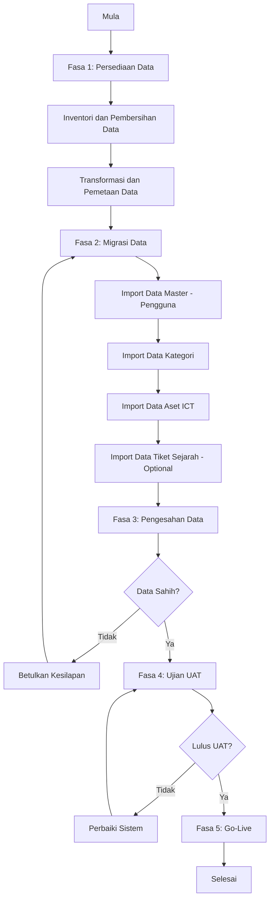

# D05 – DOKUMEN PELAN MIGRASI DATA
**SISTEM PENGURUSAN SOKONGAN PERKHIDMATAN MAKLUMAT DAN KOMUNIKASI TEKNOLOGI (MOTAC)**  
**ICT Service Support Management System**

---

## KAWALAN DOKUMEN

| **Versi** | **Tarikh**     | **Perubahan**                                     | **Disediakan Oleh**          | **Disemak Oleh** | **Diluluskan Oleh** |
|-----------|----------------|--------------------------------------------------|------------------------------|------------------|---------------------|
| 1.0       | 13 Oktober 2023 | Draf awal                                       | Pemaju Sistem                | Pengurusan Projek | Pengurusan Kanan    |
| 1.1       | 22 Oktober 2023 | Penyemakan semula selepas ulasan pengurusan     | Pemaju Sistem                | Pengurusan Projek | Pengurusan Kanan    |
| 2.0       | 03 November 2023 | Versi akhir untuk pelaksanaan                  | Pemaju Sistem                | Pengurusan Projek | Pengurusan Kanan    |

---

## 1. PENGENALAN

### 1.1 Tujuan Dokumen
Dokumen ini menerangkan pelan dan prosedur untuk migrasi data dari sistem lama kepada **Sistem Pengurusan Sokongan Perkhidmatan ICT (MOTAC)**. Pelan ini merangkumi:

- **Inventori dan penilaian data sedia ada**
- **Strategi transformasi data**
- **Pemetaan medan sumber dan destinasi**
- **Proses pelaksanaan migrasi**
- **Prosedur rollback dan pemulihan bencana**
- **Ujian dan pengesahan data**
- **Pengurusan risiko**

### 1.2 Skop Migrasi Data

#### 1.2.1 Data Dalam Skop
Data berikut **akan dimasukkan** dalam proses migrasi:

1. **Data Master Pengguna**:
   - Maklumat kakitangan MOTAC (nama, jawatan, bahagian, jabatan, email)
   - Peranan pengguna (admin, staf, pengguna biasa)
   - Hak akses dan kebenaran

2. **Data Kategori dan Kategori Peralatan**:
   - Kategori tiket (hardware, software, rangkaian, aplikasi)
   - Kategori aset ICT (komputer, peranti mudah alih, pencetak, dll.)
   - Perkara berkaitan kategori

3. **Data Aset ICT Sedia Ada**:
   - Maklumat aset (kod aset, nama, model, nombor siri)
   - Status aset (aktif, tidak aktif, rosak, lupus)
   - Tarikh perolehan dan jaminan
   - Lokasi aset semasa

4. **Data Sejarah Tiket Lalu** (jika berkaitan):
   - Tiket helpdesk lepas (subjek, penerangan masalah, keutamaan)
   - Status tiket (baru, dalam tindakan, selesai, ditutup)
   - Masa balasan dan masa penyelesaian (untuk analisis SLA)

5. **Data Log dan Audit Tertentu**:
   - Log aktiviti penting (login, logout, perubahan profil)
   - Trail audit untuk kepatuhan kerajaan

#### 1.2.2 Data Luar Skop
Data berikut **TIDAK akan dimasukkan** atau **akan dihasilkan semula** selepas pelaksanaan:

1. **Data Transien dan Sementara**:
   - Cache dan data sesi sementara
   - Kata laluan (akan direset melalui mekanisme selamat)

2. **Data Usang atau Tidak Berkaitan**:
   - Rekod tiket lebih dari 5 tahun
   - Aset yang telah dilupuskan dan tiada dalam inventori semasa

3. **Data Uji dan Pembangunan**:
   - Data ujian pemaju
   - Data latihan yang tidak mencerminkan data sebenar pengeluaran

---

## 2. PENDEKATAN MIGRASI

### 2.1 Strategi Migrasi
Sistem ICTServe menggunakan **pendekatan migrasi langsung (*Big Bang*)** dengan fasa peralihan minimum kerana:

- Sistem lama tidak terintegrasi (kebanyakan data dalam spreadsheet Excel/manual)
- Tiada keperluan untuk operasi serentak antara sistem lama dan baru
- Tempoh *downtime* dapat diminimumkan dengan perancangan rapi

**Fasa Strategi**:

1. **Fasa Persediaan**: Inventori data, transformasi data, pemetaan medan
2. **Fasa Migrasi**: Pemindahan data secara beransur-ansur ke pangkalan data baru
3. **Fasa Pengesahan**: Pengesahan integriti data dan ujian UAT
4. **Fasa Go-Live**: Pelancaran sistem pengeluaran selepas pengesahan selesai

### 2.2 Jadual Migrasi

| **Fasa**                     | **Tempoh**        | **Status**        |
|------------------------------|-------------------|-------------------|
| Fasa Persediaan              | 2 minggu          | Dalam perancangan |
| Fasa Migrasi Data            | 1 minggu          | Dalam perancangan |
| Fasa Ujian dan Pengesahan    | 1 minggu          | Dalam perancangan |
| Fasa Go-Live dan Sokongan    | 1 minggu pertama  | Dalam perancangan |

**Tarikh Cadangan Go-Live**: **30 November 2023** (tertakluk kepada pengesahan pengurusan)

### 2.3 Alat dan Teknologi

#### 2.3.1 Alat Migrasi Data

- **SQL Scripts** (Laravel migrations dan seeders untuk MySQL)
- **Laravel Artisan Commands** (skrip khas untuk import data besar-besaran)
- **Excel dan CSV Import Tools** (untuk spreadsheet sedia ada)
- **Backup & Restore Tools** (mysqldump, MySQL Workbench)

#### 2.3.2 Persekitaran Migrasi

- **Persekitaran Ujian (Staging)**: XAMPP/WAMP pada pelayan ujian dalaman
- **Persekitaran Pengeluaran**: Pelayan pengeluaran (Apache/Nginx + MySQL 8.0)

---

## 3. INVENTORI DAN PENILAIAN DATA

### 3.1 Sumber Data Sedia Ada

#### 3.1.1 Format Data Lama
Data MOTAC sedia ada tersimpan dalam pelbagai format:

| **Jenis Data**            | **Format Sedia Ada**         | **Lokasi**                           |
|---------------------------|------------------------------|--------------------------------------|
| Maklumat Kakitangan       | Excel Spreadsheet            | Bahagian HR, fail bersama            |
| Inventori Aset ICT        | Excel Spreadsheet, Dokumen Word | Bahagian ICT, fail bersama        |
| Tiket Helpdesk Lalu       | Email, Dokumen PDF           | E-mel staf ICT, fail arkib           |
| Kategori Tiket/Aset       | Senarai manual dalam Word/Excel | Dokumen prosedur sedia ada       |
| Log Audit Tertentu        | Tiada (akan dihasilkan semula) | N/A                                |

#### 3.1.2 Kualiti Data Sedia Ada

**Isu Kualiti Data Dikenal Pasti**:

1. **Data Berganda**: Kakitangan mungkin mempunyai entri pendua dalam fail Excel yang berbeza
2. **Format Tidak Konsisten**: Tarikh dalam pelbagai format (DD/MM/YYYY, DD-MM-YY, dll.)
3. **Data Tidak Lengkap**: Medan penting seperti nombor siri aset atau email kakitangan mungkin kosong
4. **Data Usang**: Rekod aset atau tiket lama tidak dikemaskini secara berkala

**Tindakan Pembetulan**:

- **Data Cleansing**: Menormalkan format tarikh, menghapus pendua, mengisi medan kosong
- **Data Validation**: Pengesahan melalui pihak berkuasa (Bahagian HR, Bahagian ICT)
- **Data Enrichment**: Menambah maklumat tambahan (contoh: nombor siri aset dari pelabel fizikal)

### 3.2 Destinasi Data Baru

#### 3.2.1 Struktur Pangkalan Data Sasaran
Sistem ICTServe menggunakan **Laravel 12 dengan Eloquent ORM** dan **MySQL 8.0**.

**Pangkalan Data Utama**: `SMPBM` (Sistem Mengurus Permohonan Bilik Mesyuarat - nama pangkalan data sementara)

**Jadual Kunci**:

| **Jadual**            | **Tujuan**                                                     |
|-----------------------|----------------------------------------------------------------|
| `users`               | Maklumat pengguna/kakitangan                                   |
| `roles`, `permissions`| Peranan pengguna dan hak akses (Laravel Spatie Permission)     |
| `ticket_categories`   | Kategori tiket helpdesk                                        |
| `submissions`         | Tiket helpdesk yang dikemukakan                                |
| `asset_categories`    | Kategori aset ICT                                              |
| `assets`              | Inventori aset ICT                                             |
| `asset_loans`         | Permohonan pinjaman aset                                       |
| `approval_matrixes`   | Matriks kelulusan untuk tiket/pinjaman aset                    |
| `activity_log`        | Log aktiviti pengguna (Laravel Spatie Activity Log)            |

---

## 4. PEMETAAN DATA

### 4.1 Pemetaan Data Pengguna

#### 4.1.1 Sumber: Excel Spreadsheet Maklumat Kakitangan (HR)

| **Medan Sumber (Excel)**   | **Medan Destinasi (MySQL: `users`)** | **Transformasi**                       |
|----------------------------|--------------------------------------|----------------------------------------|
| Nama Penuh                 | `name`                               | Trim() white spaces                    |
| No. KP                     | `ic_number`                          | Hapus dash/simbol                      |
| Bahagian                   | `department_id` (foreign key)        | Lookup `departments` table             |
| Jawatan                    | `position`                           | Trim()                                 |
| E-mel                      | `email`                              | Lowercase, validate format             |
| No. Telefon                | `phone`                              | Format: +60XXXXXXXXX                   |
| Peranan                    | role via `model_has_roles` pivot     | Default: 'staff', admin manual assign  |
| Kata Laluan                | `password`                           | Hashed (bcrypt), default: 'Password123'|
| Status                     | `status`                             | Default: 'active'                      |
| Tarikh Dicipta             | `created_at`                         | Timestamp semasa                       |

**Nota**: Kata laluan akan direset kepada `Password123` (hashed) dan pengguna diminta tukar kata laluan pada login pertama (force password reset).

### 4.2 Pemetaan Data Kategori Tiket

#### 4.2.1 Sumber: Senarai Kategori dalam Word/Excel

| **Medan Sumber**           | **Medan Destinasi (MySQL: `ticket_categories`)** | **Transformasi**              |
|----------------------------|--------------------------------------------------|-------------------------------|
| Nama Kategori              | `name_ms`, `name_en`                             | Duplicate (default BM = EN)   |
| Penerangan Kategori        | `description_ms`, `description_en`               | Trim()                        |
| Tahap Keutamaan Lalai      | `default_priority`                               | Enum: 'low', 'medium', 'high' |
| SLA Balasan (jam)          | `response_sla_hours`                             | Integer                       |
| SLA Penyelesaian (jam)     | `resolution_sla_hours`                           | Integer                       |
| Status                     | `is_active`                                      | Boolean (default: true)       |
| Tarikh Dicipta             | `created_at`                                     | Timestamp semasa              |

### 4.3 Pemetaan Data Aset ICT

#### 4.3.1 Sumber: Excel Spreadsheet Inventori Aset ICT

| **Medan Sumber (Excel)**   | **Medan Destinasi (MySQL: `assets`)** | **Transformasi**                       |
|----------------------------|---------------------------------------|----------------------------------------|
| Kod Aset                   | `asset_tag`                           | Trim(), uppercase                      |
| Nama Aset                  | `name`                                | Trim()                                 |
| Kategori Aset              | `asset_category_id` (foreign key)     | Lookup `asset_categories` table        |
| Model                      | `model`                               | Trim()                                 |
| Nombor Siri                | `serial_number`                       | Trim(), uppercase                      |
| Tarikh Perolehan           | `acquired_date`                       | Parse ke format YYYY-MM-DD             |
| Status                     | `status`                              | Enum: 'available','borrowed','retired' |
| Lokasi Semasa              | `location`                            | Trim()                                 |
| Tarikh Dicipta             | `created_at`                          | Timestamp semasa                       |

### 4.4 Pemetaan Data Tiket Helpdesk (Sejarah)

#### 4.4.1 Sumber: Email / PDF Tiket Lalu

| **Medan Sumber**           | **Medan Destinasi (MySQL: `submissions`)** | **Transformasi**                       |
|----------------------------|-------------------------------------------|----------------------------------------|
| Nombor Tiket               | `ticket_number`                           | Generate: TKT-YYYYMMDD-XXXX            |
| Nama Penghantar            | `submitted_by` (foreign key `users`)      | Lookup user ID dari nama/email         |
| Kategori Tiket             | `ticket_category_id`                      | Lookup `ticket_categories`             |
| Subjek                     | `subject`                                 | Trim()                                 |
| Penerangan Masalah         | `description`                             | Trim()                                 |
| Keutamaan                  | `priority`                                | Enum: 'low','medium','high','urgent'   |
| Status                     | `status`                                  | Enum: 'new','in_progress','resolved'   |
| Tarikh Dikemukakan         | `submitted_at`                            | Parse tarikh asal                      |
| Tarikh Diselesaikan        | `resolved_at`                             | Parse tarikh (jika ada)                |
| Tarikh Dicipta             | `created_at`                              | Timestamp asal                         |

**Nota**: Tiket lebih dari 5 tahun akan diarkibkan dan tidak dimasukkan dalam pangkalan data pengeluaran.

---

## 5. PROSES PELAKSANAAN MIGRASI

### 5.1 Carta Alir Migrasi Data



### 5.2 Langkah-Langkah Terperinci

#### 5.2.1 Fasa 1: Persediaan Data (2 minggu)

**Minggu 1: Inventori dan Pembersihan Data**

1. **Kumpul semua fail data sedia ada**:
   - Excel spreadsheet maklumat kakitangan (dari Bahagian HR)
   - Excel inventori aset ICT (dari Bahagian ICT)
   - Email dan PDF tiket helpdesk lalu (dari arkib email staf ICT)
   - Dokumen kategori tiket dan aset (dari prosedur sedia ada)

2. **Data Cleansing (Pembersihan Data)**:
   - Hapus baris kosong dan pendua dalam Excel
   - Normalkan format tarikh kepada `YYYY-MM-DD`
   - Hapus simbol dan ruang putih yang tidak perlu
   - Sahkan alamat email dengan format yang betul
   - Isi medan kosong dengan nilai default (contoh: 'N/A' untuk medan pilihan)

3. **Data Validation (Pengesahan Data)**:
   - Sahkan data pengguna dengan Bahagian HR
   - Sahkan data aset dengan Bahagian ICT (semak nombor siri dengan pelabel fizikal)
   - Sahkan kategori tiket dan aset dengan pengurus ICT

**Minggu 2: Transformasi dan Pemetaan Data**

1. **Export data dari Excel ke format CSV** (untuk import Laravel)
2. **Buat skrip Laravel Seeder untuk import data CSV**:
   - `DatabaseSeeder.php`: Orkestrasi semua seeder
   - `UserSeeder.php`: Import data pengguna
   - `TicketCategorySeeder.php`: Import kategori tiket
   - `AssetCategorySeeder.php`: Import kategori aset
   - `AssetSeeder.php`: Import data aset ICT
   - `SubmissionSeeder.php`: Import tiket sejarah (optional)

3. **Transformasi Data**:
   - Lookup ID untuk foreign keys (contoh: `department_id`, `category_id`)
   - Hash kata laluan pengguna menggunakan `bcrypt()`
   - Generate `ticket_number` dan `asset_tag` jika tiada dalam data lama
   - Assign peranan default (role: 'staff') kepada pengguna

4. **Persediaan Backup**:
   - Backup pangkalan data ujian sebelum import
   - Simpan fail CSV asal sebagai backup

#### 5.2.2 Fasa 2: Pelaksanaan Migrasi Data (1 minggu)

**Hari 1-2: Import Data Master (Pengguna dan Peranan)**

1. **Jalankan Laravel Seeder**:

   ```bash
   php artisan db:seed --class=UserSeeder
   ```

2. **Assign peranan dan kebenaran**:

   ```bash
   php artisan db:seed --class=RoleAndPermissionSeeder
   ```

3. **Sahkan data pengguna**:
   - Semak bilangan rekod dalam `users` table
   - Sahkan peranan dalam `model_has_roles` pivot table
   - Test login untuk beberapa pengguna sampel

**Hari 3: Import Data Kategori**

1. **Import kategori tiket**:

   ```bash
   php artisan db:seed --class=TicketCategorySeeder
   ```

2. **Import kategori aset**:

   ```bash
   php artisan db:seed --class=AssetCategorySeeder
   ```

3. **Sahkan data kategori**:
   - Semak kategori muncul dalam dropdown sistem
   - Test create tiket/aset baru dengan kategori yang diimport

**Hari 4-5: Import Data Aset ICT**

1. **Import aset ICT**:

   ```bash
   php artisan db:seed --class=AssetSeeder
   ```

2. **Sahkan data aset**:
   - Semak bilangan aset dalam `assets` table
   - Sahkan foreign keys (`asset_category_id`) betul
   - Test cari aset mengikut kod aset (`asset_tag`)

**Hari 6-7: Import Data Tiket Sejarah (Optional)**

1. **Import tiket lalu (jika berkaitan)**:

   ```bash
   php artisan db:seed --class=SubmissionSeeder
   ```

2. **Sahkan data tiket**:
   - Semak tiket muncul dalam senarai
   - Sahkan status dan tarikh betul
   - Test laporan SLA (masa balasan dan penyelesaian)

#### 5.2.3 Fasa 3: Pengesahan Data (1 minggu)

**Hari 1-3: Pengesahan Integriti Data**

1. **SQL Queries Pengesahan**:

   ```sql
   -- Semak bilangan pengguna
   SELECT COUNT(*) AS total_users FROM users WHERE status = 'active';

   -- Semak foreign key constraint (pengguna dengan bahagian)
   SELECT u.name, d.name_ms 
   FROM users u 
   LEFT JOIN departments d ON u.department_id = d.id 
   WHERE d.id IS NULL; -- Sepatutnya tiada hasil

   -- Semak kategori tiket
   SELECT COUNT(*) FROM ticket_categories WHERE is_active = 1;

   -- Semak aset ICT dengan kategori
   SELECT a.asset_tag, a.name, ac.name_ms 
   FROM assets a 
   LEFT JOIN asset_categories ac ON a.asset_category_id = ac.id 
   WHERE ac.id IS NULL; -- Sepatutnya tiada hasil
   ```

2. **Manual Spot Check**:
   - Pilih 10 rekod pengguna secara rawak, semak dengan data Excel asal
   - Pilih 10 rekod aset secara rawak, semak dengan inventori fizikal
   - Test login untuk 5 pengguna sampel (admin, staf, pengguna biasa)

3. **Test Business Rules**:
   - Test create tiket baru (kategori, keutamaan, SLA)
   - Test create permohonan pinjaman aset (status 'available' sahaja boleh dipinjam)
   - Test approval matrix (tiket/pinjaman pergi ke approver yang betul)

**Hari 4-7: User Acceptance Testing (UAT)**

1. **Libatkan kakitangan MOTAC** (wakil dari Bahagian HR, Bahagian ICT, pengguna akhir)
2. **Senarai Ujian UAT**:
   - Login dan logout (test hak akses mengikut peranan)
   - Create, view, update tiket helpdesk
   - Create, view, update permohonan pinjaman aset
   - Semak senarai aset dan status aset
   - Test notifikasi email (approval request, status update)
   - Test dashboard dan laporan

3. **Dokumentasi Isu UAT**:
   - Catat sebarang isu ditemui (kesilapan data, fungsi tidak berfungsi)
   - Buat senarai tugasan pembetulan mengikut keutamaan

4. **Pembetulan dan Ujian Semula**:
   - Betulkan isu kritikal segera
   - Jalankan ujian semula untuk isu yang dibetulkan

#### 5.2.4 Fasa 4: Go-Live (1 minggu pertama)

**Hari H-1 (Sehari Sebelum Go-Live)**

1. **Backup Lengkap**:
   - Backup pangkalan data ujian (staging)
   - Backup pangkalan data pengeluaran (production - kosong)

2. **Migrasi ke Persekitaran Pengeluaran**:
   - Deploy aplikasi Laravel ke pelayan pengeluaran
   - Jalankan migrasi pangkalan data:

     ```bash
     php artisan migrate --force
     php artisan db:seed --force
     ```

3. **Pengesahan Terakhir**:
   - Test login admin di pelayan pengeluaran
   - Test create tiket dan aset
   - Test email notification (gunakan alamat email ujian)

**Hari H (Go-Live)**

1. **Pengumuman Go-Live**:
   - Hantar email kepada semua pengguna MOTAC
   - Beritahu URL sistem baru dan tatacara login awal

2. **Pemantauan Aktif** (24 jam pertama):
   - Pantau server logs (Laravel logs, Apache/Nginx logs, MySQL logs)
   - Pantau prestasi sistem (response time, memory usage)
   - Sediakan helpdesk IT untuk sokongan segera

3. **Sokongan Pengguna**:
   - Sediakan panduan pengguna (PDF atau video)
   - Sediakan sesi latihan ringkas untuk staf ICT
   - Hantar FAQ (Soalan Lazim) melalui email

**Hari H+1 hingga H+7 (Minggu Pertama)**

1. **Sokongan Berterusan**:
   - Sediakan helpdesk IT untuk terima aduan/pertanyaan
   - Catat sebarang isu produksi (bugs, performance issues)
   - Hantar laporan harian kepada pengurusan

2. **Pemantauan Prestasi**:
   - Semak dashboard analytics (bilangan tiket, bilangan pinjaman aset)
   - Semak SLA performance (masa balasan, masa penyelesaian)
   - Semak log error dan fix segera

3. **Pembetulan Hotfix** (jika perlu):
   - Buat branch hotfix untuk pembetulan segera
   - Deploy hotfix ke production (selepas ujian staging)
   - Dokumentasi hotfix dalam release notes

### 5.3 Proses Rollback dan Pemulihan Bencana

#### 5.3.1 Kriteria Rollback
Rollback akan dilakukan jika berlaku **kriteria kritikal** berikut:

1. **Data Corruption** (kerosakan data):
   - Foreign key constraint dilanggar (hubungan data patah)
   - Data penting hilang atau rosak (lebih 5% rekod bermasalah)

2. **Performance Issues** (masalah prestasi):
   - Response time melebihi 10 saat untuk operasi biasa
   - Server crash berulang kali (lebih 3 kali dalam 1 jam)

3. **Security Breach** (kebocoran keselamatan):
   - Akses tidak sah ke data sensitif
   - Eksploitasi kelemahan keselamatan

#### 5.3.2 Prosedur Rollback

**Langkah Rollback**:

1. **Segera hentikan sistem pengeluaran** (set maintenance mode):

   ```bash
   php artisan down
   ```

2. **Restore pangkalan data dari backup terakhir**:

   ```bash
   mysql -u root -p SMPBM < backup_SMPBM_20231130.sql
   ```

3. **Rollback deployment aplikasi** (kembali ke versi stabil terakhir)

4. **Test pangkalan data selepas rollback**:

   ```sql
   SELECT COUNT(*) FROM users;
   SELECT COUNT(*) FROM assets;
   -- Semak bilangan rekod sama dengan backup
   ```

5. **Buka sistem semula** (buka maintenance mode):

   ```bash
   php artisan up
   ```

6. **Pengumuman kepada pengguna**:
   - Hantar email pemberitahuan mengenai rollback
   - Jelaskan sebab rollback dan rancangan pembetulan

#### 5.3.3 Pemulihan Bencana (Disaster Recovery)

**Skenario Bencana**: Kehilangan data akibat kegagalan pelayan atau serangan siber

**Prosedur Pemulihan**:

1. **Restore dari backup terkini**:
   - Backup harian disimpan di lokasi berasingan (cloud storage atau external disk)
   - Recovery Time Objective (RTO): **4 jam**
   - Recovery Point Objective (RPO): **24 jam** (maksimum data hilang: 1 hari)

2. **Test integriti data selepas pemulihan**:
   - Jalankan SQL queries pengesahan
   - Test login pengguna dan operasi biasa

3. **Dokumentasi insiden**:
   - Catat tarikh, masa, sebab bencana
   - Tindakan pemulihan yang diambil
   - Lesson learned dan penambahbaikan

---

## 6. UJIAN DAN PENGESAHAN

### 6.1 Pelan Ujian Migrasi Data

#### 6.1.1 Jenis Ujian

| **Jenis Ujian**            | **Tujuan**                                                     | **Pelaksana**         |
|----------------------------|----------------------------------------------------------------|-----------------------|
| **Unit Testing**           | Test fungsi Laravel seeder (import data betul)                 | Pemaju Sistem         |
| **Integration Testing**    | Test hubungan data (foreign keys, relationships)               | Pemaju Sistem         |
| **Data Validation Testing**| Semak ketepatan data (matching dengan sumber asal)             | Penganalisis Data     |
| **UAT (User Acceptance)**  | Test fungsi sistem dari perspektif pengguna akhir              | Pengguna Akhir (MOTAC)|
| **Performance Testing**    | Test kelajuan query, response time, beban pengguna             | Pemaju Sistem         |
| **Security Testing**       | Test hak akses, authentication, authorization                  | Pemaju Sistem         |

#### 6.1.2 Kes Ujian Data Validation

**Kes Ujian 1: Pengesahan Data Pengguna**

- **Objektif**: Semak ketepatan data pengguna selepas import
- **Langkah**:
  1. Export data dari `users` table ke CSV
  2. Compare dengan Excel asal (nama, email, bahagian)
  3. Semak 100% matching untuk medan kritikal (`name`, `email`, `ic_number`)
- **Kriteria Lulus**: 100% matching untuk medan kritikal, maksimum 2% variance untuk medan pilihan

**Kes Ujian 2: Pengesahan Foreign Key Constraints**

- **Objektif**: Semak tiada rekod orphan (rekod tanpa parent)
- **Langkah**:

  ```sql
  -- Semak pengguna tanpa bahagian
  SELECT * FROM users WHERE department_id NOT IN (SELECT id FROM departments);
  
  -- Semak aset tanpa kategori
  SELECT * FROM assets WHERE asset_category_id NOT IN (SELECT id FROM asset_categories);
  ```

- **Kriteria Lulus**: 0 rekod orphan

**Kes Ujian 3: Pengesahan Business Rules**

- **Objektif**: Test logic perniagaan berfungsi dengan data import
- **Langkah**:
  1. Create tiket baru (kategori dan SLA apply betul)
  2. Create pinjaman aset (hanya aset 'available' boleh dipinjam)
  3. Test approval matrix (tiket/pinjaman pergi ke approver betul)
- **Kriteria Lulus**: Semua business rules berfungsi seperti dijangka

### 6.2 Metrik Pengesahan

**KPI Kejayaan Migrasi**:

| **Metrik**                     | **Sasaran**       | **Status**        |
|--------------------------------|-------------------|-------------------|
| Data Accuracy (Ketepatan)      | 99% matching      | Dalam penilaian   |
| Data Completeness (Kelengkapan)| 95% medan diisi   | Dalam penilaian   |
| Zero Orphan Records            | 0 rekod orphan    | Dalam penilaian   |
| UAT Pass Rate                  | 90% lulus         | Dalam penilaian   |
| Post Go-Live Issues            | < 5 isu kritikal  | Dalam pemantauan  |

---

## 7. PENGURUSAN RISIKO

### 7.1 Risiko Migrasi Data

#### 7.1.1 Jadual Risiko

| **ID** | **Risiko**                          | **Kebarangkalian** | **Impak** | **Tahap Risiko** | **Mitigasi**                                                     |
|--------|-------------------------------------|--------------------|-----------|-----------------|-----------------------------------------------------------------|
| R1     | Data hilang semasa import            | Sederhana          | Tinggi    | **TINGGI**      | Backup sebelum import, restore jika gagal                        |
| R2     | Format data tidak konsisten          | Tinggi             | Sederhana | **TINGGI**      | Data cleansing sebelum import, validation script                 |
| R3     | Performance lambat selepas import    | Rendah             | Sederhana | **SEDERHANA**   | Indexing pangkalan data, query optimization                      |
| R4     | Pengguna tidak menerima data baru    | Sederhana          | Sederhana | **SEDERHANA**   | UAT dengan pengguna sebenar, ambil maklum balas                  |
| R5     | Downtime melebihi jangkaan           | Rendah             | Tinggi    | **SEDERHANA**   | Rancang downtime di luar waktu pejabat (contoh: hujung minggu)  |
| R6     | Kegagalan backup/restore             | Rendah             | Tinggi    | **SEDERHANA**   | Test backup & restore prosedur sebelum go-live                   |

#### 7.1.2 Rancangan Mitigasi Risiko

**Risiko R1: Data hilang semasa import**

- **Mitigasi**:
  1. Wajibkan backup pangkalan data sebelum setiap import
  2. Simpan backup di lokasi berasingan (cloud storage)
  3. Test restore procedure sebelum go-live

**Risiko R2: Format data tidak konsisten**

- **Mitigasi**:
  1. Data cleansing menggunakan script Laravel atau Excel macro
  2. Validation script untuk check format tarikh, email, nombor telefon
  3. Manual review untuk medan kritikal (nama, IC number)

**Risiko R3: Performance lambat selepas import**

- **Mitigasi**:
  1. Indexing medan yang kerap di-query (`email`, `asset_tag`, `ticket_number`)
  2. Query optimization (avoid N+1 query, use eager loading)
  3. Enable MySQL query cache dan buffer pool tuning

**Risiko R4: Pengguna tidak menerima data baru**

- **Mitigasi**:
  1. Libatkan pengguna akhir dalam UAT
  2. Ambil maklum balas dan betulkan isu segera
  3. Sediakan sesi latihan dan panduan pengguna

**Risiko R5: Downtime melebihi jangkaan**

- **Mitigasi**:
  1. Rancang downtime di luar waktu pejabat (hujung minggu atau malam)
  2. Buat rehearsal import di staging environment
  3. Sediakan contingency plan (rollback jika gagal)

**Risiko R6: Kegagalan backup/restore**

- **Mitigasi**:
  1. Test backup & restore procedure sebelum go-live
  2. Simpan multiple copies backup (local + cloud)
  3. Dokumentasi langkah restore dengan jelas

### 7.2 Rancangan Komunikasi

#### 7.2.1 Stakeholder Komunikasi

| **Stakeholder**              | **Frekuensi**       | **Kaedah**        | **Kandungan**                          |
|------------------------------|---------------------|-------------------|----------------------------------------|
| Pengurusan Kanan (MOTAC)     | Mingguan            | Mesyuarat/Email   | Status migrasi, isu kritikal           |
| Pengguna Akhir (Staf MOTAC)  | Sebelum & selepas   | Email/Portal      | Pemberitahuan downtime, panduan login  |
| Pasukan Projek (Dev, QA)     | Harian              | Slack/Email       | Status harian, isu teknikal            |
| Bahagian HR                  | On-demand           | Email/Mesyuarat   | Pengesahan data kakitangan             |
| Bahagian ICT                 | On-demand           | Email/Mesyuarat   | Pengesahan data aset                   |

#### 7.2.2 Template Komunikasi

**Template Email: Pemberitahuan Downtime**

```
Subject: [PENTING] Sistem ICTServe - Downtime untuk Migrasi Data (30 Nov 2023)

Kepada Semua Warga MOTAC,

Bersama ini dimaklumkan bahawa sistem ICTServe akan menjalani maintenance untuk tujuan migrasi data pada:

Tarikh: 30 November 2023 (Khamis)
Masa: 6:00 PM - 11:59 PM

Dalam tempoh ini, sistem tidak boleh diakses. Kami mohon maaf atas sebarang kesulitan.

Sistem akan kembali beroperasi pada 1 Disember 2023 (Jumaat), 8:00 AM.

Sebarang pertanyaan sila hubungi Bahagian ICT MOTAC.

Terima kasih.

Bahagian ICT MOTAC
```

**Template Email: Pengumuman Go-Live**

```
Subject: [PENGUMUMAN] Sistem ICTServe Kini Beroperasi

Kepada Semua Warga MOTAC,

Kami dengan sukacitanya mengumumkan bahawa Sistem Pengurusan Sokongan Perkhidmatan ICT (ICTServe) kini beroperasi sepenuhnya.

URL Sistem: https://ictserve.motac.gov.my
Login: Gunakan email dan kata laluan awal (Password123)

Sila tukar kata laluan anda pada login pertama.

Panduan pengguna boleh dimuat turun di: [link]

Sebarang pertanyaan atau masalah, sila hubungi Bahagian ICT MOTAC.

Terima kasih.

Bahagian ICT MOTAC
```

---

## 8. SENARAI SEMAK MIGRASI

### 8.1 Pre-Migration Checklist

- [ ] Inventori data sedia ada lengkap (Excel, PDF, email)
- [ ] Data cleansing selesai (tiada baris kosong, format konsisten)
- [ ] Pemetaan data sumber ke destinasi lengkap
- [ ] Laravel Seeder scripts bersedia dan diuji
- [ ] Backup pangkalan data ujian (staging) diambil
- [ ] Persekitaran staging bersedia untuk ujian
- [ ] Pasukan projek dan stakeholder diberitahu
- [ ] Rancangan rollback documented
- [ ] Rancangan komunikasi kepada pengguna bersedia

### 8.2 Migration Execution Checklist

- [ ] Import data pengguna selesai (verify count)
- [ ] Assign peranan dan kebenaran selesai (verify roles)
- [ ] Import kategori tiket dan aset selesai (verify count)
- [ ] Import aset ICT selesai (verify count dan foreign keys)
- [ ] Import tiket sejarah selesai (optional)
- [ ] SQL queries pengesahan dijalankan (zero orphan records)
- [ ] Spot check data matching dengan sumber asal
- [ ] UAT dijalankan dengan pengguna akhir (90% lulus)
- [ ] Isu UAT documented dan dibetulkan

### 8.3 Post-Migration Checklist

- [ ] Deploy ke persekitaran pengeluaran (production)
- [ ] Backup pangkalan data pengeluaran selepas import
- [ ] Test login admin di production
- [ ] Pengumuman go-live dihantar kepada pengguna
- [ ] Panduan pengguna disediakan (PDF/video)
- [ ] Helpdesk IT sedia untuk sokongan 24/7 (minggu pertama)
- [ ] Pemantauan server logs dan prestasi aktif
- [ ] Laporan harian kepada pengurusan (7 hari pertama)
- [ ] Dokumentasi post-mortem (lesson learned, improvement)

---

## 9. RUJUKAN DAN LAMPIRAN

### 9.1 Dokumen Rujukan

1. **D00 – Ringkasan Eksekutif**: Gambaran keseluruhan projek ICTServe
2. **D03 – Spesifikasi Keperluan Perisian (SRS)**: Keperluan fungsian dan non-fungsian
3. **D04 – Rekaan Senibina Sistem**: Senibina sistem dan integrasi komponen
4. **D11 – Rekaan Data dan Skema Pangkalan Data**: Struktur jadual dan hubungan data
5. **D08 – Manual Pengguna**: Panduan untuk pengguna akhir
6. **D10 – Dokumentasi Kod Sumber**: Dokumentasi Laravel code dan API

### 9.2 Lampiran

#### Lampiran A: Contoh Data Sumber (Excel)

**Maklumat Kakitangan (Sampel)**

| Nama Penuh        | No. KP          | Bahagian   | Jawatan           | E-mel                  | No. Telefon      |
|-------------------|-----------------|------------|-------------------|------------------------|------------------|
| Ahmad bin Ali     | 901010-12-3456  | IT         | Pegawai IT        | <ahmad@motac.gov.my>     | +60123456789     |
| Siti binti Hassan | 880505-14-5678  | HR         | Pegawai HR        | <siti@motac.gov.my>      | +60129876543     |

**Inventori Aset ICT (Sampel)**

| Kod Aset   | Nama Aset       | Kategori Aset | Model           | Nombor Siri     | Tarikh Perolehan | Status    | Lokasi Semasa |
|------------|-----------------|---------------|-----------------|-----------------|------------------|-----------|---------------|
| LAP-001    | Laptop Dell     | Komputer      | Dell Latitude   | SN123456789     | 2022-01-15       | available | Bahagian IT   |
| PRT-002    | Pencetak HP     | Pencetak      | HP LaserJet     | SN987654321     | 2021-06-20       | available | Bahagian HR   |

#### Lampiran B: Contoh SQL Seeder (Laravel)

**UserSeeder.php (Excerpt)**

```php
<?php

namespace Database\Seeders;

use Illuminate\Database\Seeder;
use App\Models\User;
use Illuminate\Support\Facades\Hash;

class UserSeeder extends Seeder
{
    public function run()
    {
        $csvFile = fopen(storage_path('app/import/users.csv'), 'r');
        
        $firstLine = true;
        while (($data = fgetcsv($csvFile, 2000, ',')) !== FALSE) {
            if ($firstLine) {
                $firstLine = false;
                continue; // Skip header row
            }
            
            User::create([
                'name' => trim($data[0]),
                'ic_number' => str_replace('-', '', $data[1]),
                'department_id' => $this->getDepartmentId($data[2]),
                'position' => trim($data[3]),
                'email' => strtolower(trim($data[4])),
                'phone' => $this->formatPhone($data[5]),
                'password' => Hash::make('Password123'),
                'status' => 'active',
                'created_at' => now(),
                'updated_at' => now(),
            ]);
        }
        
        fclose($csvFile);
    }
    
    private function getDepartmentId($departmentName)
    {
        $department = \App\Models\Department::where('name_ms', 'LIKE', "%{$departmentName}%")->first();
        return $department ? $department->id : null;
    }
    
    private function formatPhone($phone)
    {
        $phone = preg_replace('/[^0-9]/', '', $phone);
        if (substr($phone, 0, 1) == '0') {
            $phone = '+60' . substr($phone, 1);
        }
        return $phone;
    }
}
```

#### Lampiran C: Jadual Pemetaan Data (Lengkap)

**Jadual 1: Maklumat Sumber Data**

| **Nama sistem**        | Sistem Tempahan Bilik Mesyuarat (Sistem Lama - Manual)              |
|------------------------|----------------------------------------------------------------------|
| **Fungsi sistem**      | Menguruskan tempahan bilik mesyuarat (data rujukan sahaja)           |
| **Nama pangkalan data**| eTempah (spreadsheet Excel)                                          |
| **Nama table dan medan yang terlibat** | Table: `BLK_MESY`<br>Medan:<br>- `kod_blk_mesy`<br>- `nama_blk_mesy`<br>- `lokasi`<br>- `status` |

**Catatan**:

- Dalam pelaksanaan migrasi data ini, **semua rekod bilik mesyuarat** akan dimigrasiakan ke dalam sistem baru.
- Maklumat destinasi pangkalan data iaitu **table** dan **medan pangkalan data** sistem baru adalah seperti di **Jadual 2**.

**Jadual 2: Maklumat Destinasi Pangkalan Data Yang Terlibat Dalam Migrasi Data**

| **Nama sistem**        | Sistem Mengurus Penggunaan Bilik Mesyuarat (Sistem Baru)            |
|------------------------|----------------------------------------------------------------------|
| **Fungsi sistem**      | Menguruskan tempahan bilik mesyuarat (sistem web automatik)          |
| **Nama pangkalan data**| SMPBM                                                                |

**Catatan**:

- Berdasarkan kaedah migrasi telah dinyatakan di para 2.2, **tools** yang terlibat dalam pelaksanaan migrasi data adalah:
  - **SQL Yog** (untuk query dan pengurusan pangkalan data)
  - **SQL Loader (Oracle)** (jika diperlukan untuk bulk import - tidak relevan untuk MySQL)
  - **SQL Plus** (command-line tool untuk Oracle - tidak relevan untuk MySQL)
  - **Laravel Artisan Seeders** (untuk import data CSV ke MySQL)

- Oleh yang demikian, pada fasa pra migrasi ini aktiviti **pemasangan** dan **instalasi tools** serta **skrip berkaitan** akan dilaksanakan.

- Dalam fasa ini, aktiviti **pemetaan jadual** dan **pemetaan data antara jadual/data** pangkalan data sumber dan jadual/data pangkalan data destinasi berdasarkan peraturan bisnes yang telah ditetapkan. Maklumat terperinci seperti dalam **jadual di bawah** (sampel ringkas):

| **Medan Sumber**   | **Medan Destinasi** | **Transformasi**              |
|--------------------|---------------------|-------------------------------|
| `kod_blk_mesy`     | `room_code`         | Trim(), uppercase             |
| `nama_blk_mesy`    | `room_name_ms`      | Trim()                        |
| `lokasi`           | `location`          | Trim()                        |
| `status`           | `is_active`         | Boolean (1 = active, 0 = inactive) |

---

## 10. KESIMPULAN

Dokumen Pelan Migrasi Data ini menyediakan panduan terperinci untuk memindahkan data dari sistem lama (manual/spreadsheet) kepada **Sistem Pengurusan Sokongan Perkhidmatan ICT (ICTServe)** MOTAC. Pelan ini merangkumi inventori data, pemetaan medan, prosedur pelaksanaan, ujian, pengurusan risiko, dan rancangan rollback.

**Objektif Utama Migrasi**:

1. **Ketepatan Data**: Memastikan 99% data dipindahkan dengan betul dan konsisten
2. **Integriti Data**: Mengekalkan hubungan foreign key dan business rules
3. **Minimum Downtime**: Downtime tidak melebihi 6 jam (di luar waktu pejabat)
4. **Zero Data Loss**: Tiada data kritikal hilang semasa migrasi
5. **User Acceptance**: 90% pengguna akhir berpuas hati dengan sistem baru

**Tarikh Sasaran Go-Live**: **30 November 2023** (tertakluk kepada pengesahan pengurusan dan kejayaan UAT)

Pasukan projek akan memantau pelaksanaan migrasi dengan teliti dan sedia untuk tindakan pembetulan segera jika berlaku isu kritikal. Komunikasi berterusan dengan stakeholder adalah penting untuk memastikan kejayaan migrasi data.

---

**Disediakan Oleh**:  
Pasukan Pemaju Sistem ICTServe  
Bahagian ICT, Kementerian Pelancongan, Seni dan Budaya Malaysia (MOTAC)

**Tarikh Terakhir Dikemaskini**: 03 November 2023
