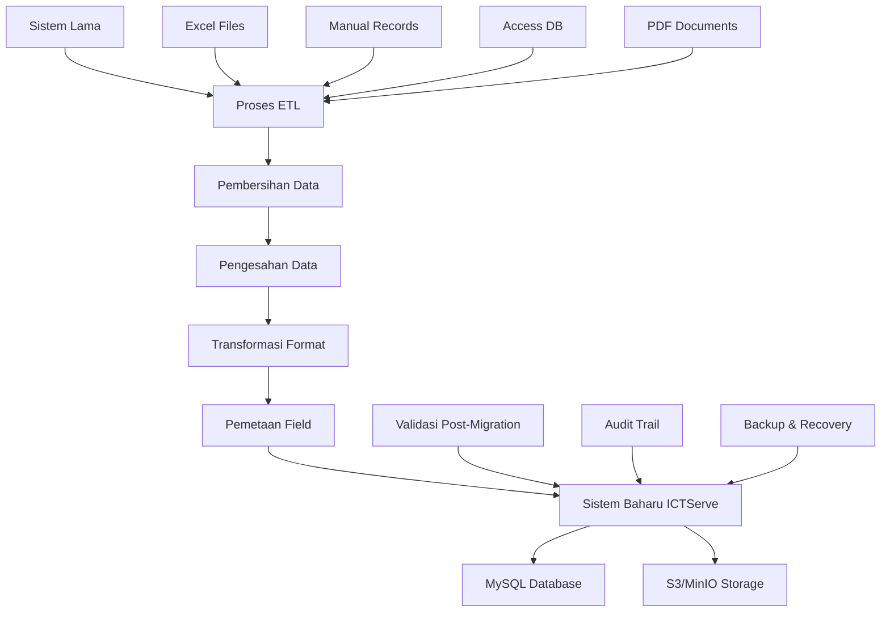
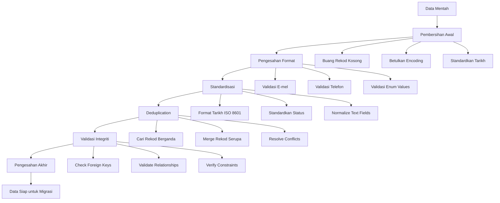
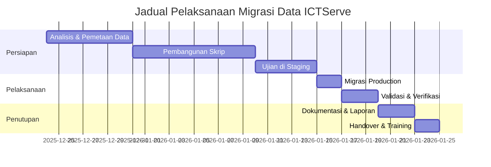

# D05 DOKUMEN PELAN MIGRASI DATA

**SISTEM ICTSERVE**

*(Sistem Pengurusan Helpdesk dan Pinjaman Aset ICT)*

| | |
| :--- | :--- |
| **NAMA AGENSI** | : Bahagian Pengurusan Maklumat (BPM) |
| **NAMA AGENSI INDUK** | : Kementerian Pelancongan, Seni dan Budaya Malaysia (MOTAC) |
| **TARIKH DOKUMEN** | : 23 Disember 2025 |
| **VERSI DOKUMEN** | : 4.0.0 |

---

## i. Keterangan Dokumen

*Seksyen ini adalah ruangan untuk menyatakan secara ringkas keterangan berkenaan dokumen yang disediakan dengan merujuk kepada piawaian antarabangsa yang berkaitan.*

## ii. Semakan dan Pengesahan Dokumen

**SEMAKAN DOKUMEN**

| Disemak Oleh | Jawatan | Tandatangan | Tarikh Semakan |
| :--- | :--- | :--- | :--- |
| Ketua Pembangun Sistem | Pegawai Sistem Maklumat Gred F41 | [Tandatangan Digital] | 23 Disember 2025 |
| Penganalisis Data Kanan | Pegawai Sistem Maklumat Gred F44 | [Tandatangan Digital] | 23 Disember 2025 |
| Pakar Keselamatan Data | Pegawai Keselamatan ICT Gred F41 | [Tandatangan Digital] | 23 Disember 2025 |

**PENGESAHAN DOKUMEN**

| Disahkan Oleh | Jawatan | Tandatangan | Tarikh Semakan |
| :--- | :--- | :--- | :--- |
| Ketua Bahagian Pengurusan Maklumat | Pegawai Tadbir Diplomatik Gred M54 | [Tandatangan Digital] | 23 Disember 2025 |
| Pengarah ICT | Pegawai Tadbir Diplomatik Gred M52 | [Tandatangan Digital] | 23 Disember 2025 |

## iii. Kawalan Dokumen

**KAWALAN DOKUMEN**

| No. Versi | Tarikh | Ringkasan Pindaan | Penyedia |
| :--- | :--- | :--- | :--- |
| 1.0.0 | 15 September 2025 | Versi awal pelan migrasi data | Pasukan BPM |
| 2.0.0 | 17 Oktober 2025 | Penyeragaman mengikut KRISA (struktur template) | Pasukan BPM |
| 4.0.0 | 24 Disember 2025 | Semakan editorial dan penyelarasan kandungan mengikut template rasmi | Pasukan BPM |

## iv. Kandungan

1. [TUJUAN](#1-tujuan) ... 5
2. [LATAR BELAKANG](#2-latar-belakang) ... 6
3. [OBJEKTIF MIGRASI](#3-objektif-migrasi) ... 7
4. [SKOP MIGRASI](#4-skop-migrasi) ... 8
5. [PENDEKATAN MIGRASI](#5-pendekatan-migrasi) ... 10
6. [PASUKAN PROJEK](#6-pasukan-projek) ... 15
7. [JADUAL PELAKSANAAN](#7-jadual-pelaksanaan) ... 17
8. [PENUTUP](#8-penutup) ... 19
9. [LAMPIRAN](#9-lampiran) ... 21

## v. Senarai Gambarajah

- Gambarajah 5.1: Aliran Kerja Migrasi Data ... 11
- Gambarajah 5.2: Proses Pembersihan dan Pengesahan Data ... 13
- Gambarajah 7.1: Jadual Pelaksanaan Migrasi ... 18

## vi. Senarai Jadual

- Jadual 4.1: Skop Data untuk Migrasi ... 9
- Jadual 5.1: Pemetaan Data Sumber ke Destinasi ... 14
- Jadual 6.1: Struktur Pasukan Projek ... 16
- Jadual 7.1: Jadual Terperinci Pelaksanaan ... 17
- Jadual 8.1: Faktor Kritikal Kejayaan ... 20

## vii. Definisi dan Akronim

### a. Akronim

| Akronim | Keterangan |
| :--- | :--- |
| API | Application Programming Interface |
| BPM | Bahagian Pengurusan Maklumat |
| CSV | Comma-Separated Values |
| DMP | Data Migration Plan (Pelan Migrasi Data) |
| ERD | Entity Relationship Diagram |
| ETL | Extract, Transform, Load |
| FK | Foreign Key |
| ICT | Information and Communication Technology |
| KRISA | Kerangka Rujukan ICT Sektor Awam |
| MAMPU | Unit Pemodenan Tadbiran dan Perancangan Pengurusan Malaysia |
| MOTAC | Kementerian Pelancongan, Seni dan Budaya Malaysia |
| MTBF | Mean Time Between Failure |
| MTTR | Mean Time To Recover |
| PDPA | Personal Data Protection Act |
| RPO | Recovery Point Objective |
| RTO | Recovery Time Objective |
| SLA | Service Level Agreement |
| SQL | Structured Query Language |

### b. Definisi

| Terma/Istilah | Definisi |
| :--- | :--- |
| Migrasi Data | Proses pemindahan data dari sistem lama ke sistem baharu dengan memastikan integriti dan kualiti data |
| Pembersihan Data | Proses mengenal pasti dan membetulkan data yang tidak tepat, tidak lengkap, atau tidak konsisten |
| Pemetaan Data | Proses menentukan hubungan antara elemen data dalam sistem sumber dan destinasi |
| Audit Trail | Rekod kronologi aktiviti sistem yang membolehkan jejak audit untuk tujuan keselamatan dan pematuhan |

## viii. Sumber Rujukan

1. **ISO 8000-2:2020** - Data quality - Part 2: Vocabulary
2. **ISO/IEC 27701:2019** - Security techniques - Extension to ISO/IEC 27001 and ISO/IEC 27002 for privacy information management
3. **RFC 5322** - Internet Message Format (Format E-mel)
4. **ISO 8601:2019** - Date and time - Representations for information interchange
5. **ISO/IEC/IEEE 12207:2017** - Systems and software engineering - Software life cycle processes
6. **MAMPU (2019)**. Kerangka Rujukan ICT Sektor Awam (KRISA) Versi 2.0
7. **Akta Perlindungan Data Peribadi 2010** - Personal Data Protection Act Malaysia
8. **KRISA** – Kerangka Rujukan ICT Sektor Awam (rujukan umum)
9. **Akta Perlindungan Data Peribadi 2010 (PDPA)** – Rujukan umum keperluan privasi data

---

## 1. TUJUAN

Dokumen Pelan Migrasi Data ini bertujuan untuk:

1. **Menyediakan Panduan Komprehensif**: Memberikan panduan terperinci untuk migrasi data dari sistem lama ke Sistem ICTServe yang baharu dengan memastikan integriti, kualiti, dan keselamatan data sepanjang proses migrasi.

2. **Memastikan Pematuhan Standard**: Memastikan proses migrasi mematuhi piawaian antarabangsa ISO 8000 (kualiti data), ISO/IEC 27701 (pengurusan privasi maklumat), dan keperluan PDPA 2010 Malaysia.

3. **Memastikan Keberkesanan Migrasi**: Melaksanakan strategi migrasi yang berstruktur bagi meminimumkan risiko, memastikan integriti data, dan menyokong operasi perniagaan.

4. **Mengurangkan Risiko**: Mengenal pasti dan mengurangkan risiko yang berkaitan dengan kehilangan data, kerosakan data, dan gangguan operasi semasa proses migrasi.

5. **Memastikan Kontinuiti Perniagaan**: Memastikan operasi helpdesk dan pinjaman aset ICT dapat diteruskan dengan gangguan minimum semasa dan selepas migrasi.

## 2. LATAR BELAKANG

Bahagian Pengurusan Maklumat (BPM) MOTAC kini menggunakan sistem manual dan separuh automatik untuk menguruskan aduan helpdesk ICT dan permohonan pinjaman aset. Sistem sedia ada terdiri daripada:

- **Sistem Manual**: Borang kertas, fail PDF, dan dokumen cetak untuk rekod tiket helpdesk dan permohonan pinjaman
- **Sistem Digital Terhad**: Microsoft Excel, CSV, dan pangkalan data Access untuk penjejakan inventori aset
- **Komunikasi E-mel**: Koordinasi kelulusan dan notifikasi melalui e-mel tidak berstruktur
- **Penyimpanan Tidak Berpusat**: Data tersebar di pelbagai lokasi tanpa backup terpusat

**Cabaran Sistem Sedia Ada:**

- Tiada jejak audit yang sistematik
- Kesukaran dalam pelaporan dan analisis trend
- Proses kelulusan yang perlahan dan tidak konsisten
- Risiko kehilangan data dan dokumen
- Tiada integrasi antara sistem yang berbeza

**Keperluan Sistem Baharu:**
Sistem ICTServe baharu akan menyediakan platform bersepadu dengan ciri-ciri asas berikut:

- Aliran kerja kelulusan automatik yang tersusun
- Jejak audit menyeluruh untuk pemantauan dan pematuhan
- Antara muka mesra pengguna yang menyokong operasi harian

## 3. OBJEKTIF MIGRASI

### 3.1. Objektif Utama

1. **Pemindahan Data Lengkap**: Memindahkan semua data berkaitan helpdesk, pinjaman aset, dan inventori dari sistem lama ke sistem baharu tanpa kehilangan atau kerosakan data.

2. **Penyambungan Data Sejarah**: Menghubungkan rekod sejarah dengan akaun staf yang akan didaftarkan dalam sistem baharu melalui padanan e-mel.

3. **Pematuhan Keselamatan**: Memastikan semua data peribadi dan sensitif dimigrasi dengan pematuhan kepada keperluan keselamatan dan privasi yang berkaitan.

### 3.2. Objektif Khusus

1. **Migrasi Profil Staf**: Memindahkan data staf MOTAC ke jadual `users` dengan medan baharu untuk menyokong pendaftaran kendiri dan penyambungan akaun.

2. **Penyambungan Berasaskan E-mel**: Menghubungkan submission tetamu terdahulu dengan akaun staf melalui padanan e-mel automatik.

3. **Penubuhan Audit Trail**: Menyediakan rekod jejak audit untuk pemantauan dan pematuhan.

## 4. SKOP MIGRASI

### 4.1. Data yang Akan Dimigrasi

| Kategori Data | Sumber | Destinasi | Keutamaan |
| :--- | :--- | :--- | :--- |
| **Profil Staf MOTAC** | Direktori HR, Excel | `users` table | Tinggi |
| **Rekod Tiket Helpdesk** | Borang manual, Excel | `helpdesk_tickets` | Tinggi |
| **Permohonan Pinjaman Aset** | Borang manual, Excel | `loan_applications` | Tinggi |
| **Inventori Aset ICT** | Excel, Access DB | `assets`, `asset_categories` | Tinggi |
| **Data Bahagian/Unit** | Direktori organisasi | `divisions`, `grades` | Sederhana |
| **Rekod Kelulusan** | E-mel, dokumen | `loan_approvals` | Sederhana |
| **Dokumen Sokongan** | PDF, gambar | S3/MinIO storage | Rendah |

**Jadual 4.1: Skop Data untuk Migrasi**

### 4.2. Data yang Tidak Dimigrasi

- **Kata laluan lama**: Semua pengguna akan menggunakan kata laluan baharu
- **Session data**: Data sesi dari sistem lama tidak relevan
- **Log sistem lama**: Hanya audit trail penting akan dimigrasi
- **Data ujian**: Data ujian dan development tidak akan dimigrasi
- **Dokumen arkib**: Dokumen lebih dari 7 tahun akan diarkibkan secara berasingan

### 4.3. Transformasi Data

**Gambarajah 5.1: Aliran Kerja Migrasi Data**

## 5. PENDEKATAN MIGRASI

### 5.1. Metodologi Migrasi

Migrasi akan menggunakan pendekatan **Big Bang dengan Rollback Capability** yang melibatkan:

1. **Persiapan Menyeluruh**: Analisis data, pembersihan, dan ujian di persekitaran staging
2. **Migrasi Serentak**: Pemindahan semua data dalam satu operasi terjadual
3. **Validasi Segera**: Pengesahan integriti data serta-merta selepas migrasi
4. **Rollback Ready**: Keupayaan untuk kembali ke sistem lama jika diperlukan

### 5.2. Proses Pembersihan dan Pengesahan Data

**Gambarajah 5.2: Proses Pembersihan dan Pengesahan Data**

### 5.3. Pemetaan Data Terperinci

| Data Sumber | Field Sumber | Data Destinasi | Field Destinasi | Transformasi |
| :--- | :--- | :--- | :--- | :--- |
| **Staff Directory** | staff_name | users | name | Trim, Title Case |
| | staff_email | users | email | Lowercase, Validate @motac.gov.my |
| | staff_id | users | staff_number | String, Optional |
| | department_code | users | division_code | Lookup divisions table |
| | - | users | email_verified_at | Set to NOW() |
| | - | users | role | Set to 'staff' |
| **Helpdesk Records** | ticket_no | helpdesk_tickets | ticket_number | Format HD-YYYYMM-XXXX |
| | submitter_email | helpdesk_tickets | guest_email + user_id | Link via email matching |
| | issue_desc | helpdesk_tickets | description | Clean HTML, Max 65535 chars |
| | priority_level | helpdesk_tickets | priority | Map: 1→low, 2→medium, 3→high, 4→critical |
| **Loan Records** | loan_ref | loan_applications | reference | Format LA-YYYYMM-XXXX |
| | applicant_email | loan_applications | applicant_email + user_id | Link via email matching |
| | loan_status | loan_applications | status | Map to enum values |
| **Asset Inventory** | asset_tag | assets | asset_code | Uppercase, Unique |
| | asset_name | assets | name | Trim, Max 255 chars |
| | category | assets | category_id | Lookup asset_categories |

**Jadual 5.1: Pemetaan Data Sumber ke Destinasi**

### 5.4. Skrip dan Alat Migrasi

**Laravel Artisan Commands:**

- `migrate:staff-users` - Import staf ke jadual users
- `migrate:helpdesk-tickets` - Import rekod tiket helpdesk
- `migrate:loan-applications` - Import permohonan pinjaman
- `migrate:assets` - Import inventori aset
- `migrate:link-submissions` - Sambung submissions dengan user_id
- `migrate:setup-audit` - Sediakan jadual audit berlapis

**Ciri-ciri Skrip:**

- Progress tracking dengan progress bar
- Batch processing untuk dataset besar
- Error handling dan logging komprehensif
- Dry-run mode untuk ujian
- Rollback capability
- Real-time validation

## 6. PASUKAN PROJEK

### 6.1. Struktur Organisasi Pasukan

**KETUA PASUKAN MIGRASI**

- **Nama**: Ketua Bahagian Pengurusan Maklumat
- **Jawatan**: Pegawai Tadbir Diplomatik Gred M54
- **Tanggungjawab**: Penyeliaan keseluruhan, kelulusan keputusan utama, komunikasi dengan pihak pengurusan

**PASUKAN TEKNIKAL**

- **Ketua Pasukan Teknikal**
  - **Nama**: Ketua Pembangun Sistem
  - **Jawatan**: Pegawai Sistem Maklumat Gred F41
  - **Tanggungjawab**: Koordinasi teknikal, quality assurance, deployment
  
- **Ahli Pasukan Teknikal**:
  - **Pembangun Kanan**: Pegawai Sistem Maklumat Gred F44
    - *Fungsi*: Pembangunan skrip migrasi, ETL processes, database management
  - **Penganalisis Data**: Pegawai Sistem Maklumat Gred F41
    - *Fungsi*: Data mapping, cleansing, validation, quality control
  - **Pakar Keselamatan**: Pegawai Keselamatan ICT Gred F41
    - *Fungsi*: Security compliance, PDPA adherence, encryption, audit trail

**PASUKAN PERUNDING ICT**

- **SUBJECT MATTER EXPERT (SME)**
  - **Pakar Domain Helpdesk**
    - **Nama**: Ketua Unit Sokongan ICT
    - **Jawatan**: Pegawai Sistem Maklumat Gred F44
    - *Fungsi*: Migration rules untuk helpdesk, business logic validation
  
  - **Pakar Domain Aset**
    - **Nama**: Ketua Unit Pengurusan Aset
    - **Jawatan**: Pegawai Tadbir Gred N41
    - *Fungsi*: Asset categorization, loan workflow validation
  
  - **Pakar Keselamatan Data**
    - **Nama**: Pegawai Keselamatan Data
    - **Jawatan**: Pegawai Keselamatan ICT Gred F41
    - *Fungsi*: Data privacy compliance, PDPA requirements, security protocols

| Peranan | Nama/Jawatan | Tanggungjawab Utama |
| :--- | :--- | :--- |
| **Ketua Projek** | Ketua BPM (M54) | Penyeliaan, kelulusan, komunikasi strategik |
| **Ketua Teknikal** | Ketua Pembangun (F41) | Koordinasi teknikal, QA, deployment |
| **Pembangun Kanan** | Pegawai Sistem (F44) | Skrip migrasi, ETL, database |
| **Penganalisis Data** | Pegawai Sistem (F41) | Pemetaan data, pembersihan, validasi |
| **Pakar Keselamatan** | Pegawai Keselamatan (F41) | Pematuhan PDPA, encryption, audit |
| **SME Helpdesk** | Ketua Unit Sokongan (F44) | Business rules helpdesk |
| **SME Aset** | Ketua Unit Aset (N41) | Workflow pinjaman, kategorisasi |
| **SME Keselamatan** | Pegawai Keselamatan (F41) | Privacy compliance, security |

**Jadual 6.1: Struktur Pasukan Projek**

### 6.2. Tanggungjawab dan Autoriti

**Ketua Pasukan**: Autoriti penuh untuk keputusan migrasi, komunikasi dengan pihak pengurusan, kelulusan perubahan skop

**Pasukan Teknikal**: Pelaksanaan teknikal, pembangunan skrip, ujian, deployment, dokumentasi teknikal

**SME**: Validasi business rules, pengesahan data domain, sokongan user acceptance testing

## 7. JADUAL PELAKSANAAN

### 7.1. Fasa dan Tempoh Pelaksanaan

**Gambarajah 7.1: Jadual Pelaksanaan Migrasi**

### 7.2. Jadual Terperinci

| Fasa | Aktiviti | Tempoh | Tarikh Mula | Tarikh Tamat | PIC |
| :--- | :--- | :--- | :--- | :--- | :--- |
| **Persiapan** | Analisis data sumber | 3 hari | 24 Dis 2025 | 26 Dis 2025 | Penganalisis Data |
| | Pemetaan field dan transformasi | 2 hari | 27 Dis 2025 | 28 Dis 2025 | Penganalisis Data |
| | Pembersihan data awal | 2 hari | 29 Dis 2025 | 30 Dis 2025 | Penganalisis Data |
| | Pembangunan skrip migrasi | 7 hari | 31 Dis 2025 | 6 Jan 2026 | Pembangun Kanan |
| | Ujian keselamatan dan PDPA | 3 hari | 7 Jan 2026 | 9 Jan 2026 | Pakar Keselamatan |
| | Ujian di persekitaran staging | 3 hari | 10 Jan 2026 | 12 Jan 2026 | Ketua Teknikal |
| | Validasi dengan SME | 2 hari | 13 Jan 2026 | 14 Jan 2026 | SME Team |
| **Pelaksanaan** | Backup sistem sedia ada | 0.5 hari | 15 Jan 2026 | 15 Jan 2026 | Ketua Teknikal |
| | Migrasi data production | 1 hari | 15 Jan 2026 | 15 Jan 2026 | Pasukan Teknikal |
| | Validasi integriti data | 1 hari | 16 Jan 2026 | 16 Jan 2026 | Penganalisis Data |
| | Ujian fungsional sistem | 1 hari | 17 Jan 2026 | 17 Jan 2026 | SME Team |
| **Penutupan** | Dokumentasi hasil migrasi | 2 hari | 18 Jan 2026 | 19 Jan 2026 | Ketua Teknikal |
| | Laporan akhir dan audit | 1 hari | 20 Jan 2026 | 20 Jan 2026 | Ketua Projek |
| | Handover dan latihan | 2 hari | 21 Jan 2026 | 22 Jan 2026 | Pasukan Lengkap |

**Jadual 7.1: Jadual Terperinci Pelaksanaan**

### 7.3. Milestone Kritikal

1. **Milestone 1**: Pemetaan data lengkap dan skrip migrasi siap (14 Jan 2026)
2. **Milestone 2**: Ujian staging berjaya dan validasi SME selesai (14 Jan 2026)
3. **Milestone 3**: Migrasi production selesai dan data divalidasi (16 Jan 2026)
4. **Milestone 4**: Sistem baharu operasi penuh dan handover selesai (22 Jan 2026)

## 8. PENUTUP

### 8.1. Faktor Kritikal Kejayaan

| Faktor | Keterangan | Metrik Kejayaan |
| :--- | :--- | :--- |
| **Kualiti Data** | Data dimigrasi tanpa kehilangan atau kerosakan | >99% data integrity, <1% error rate |
| **Pematuhan Keselamatan** | Semua keperluan PDPA dan keselamatan dipenuhi | 100% compliance audit pass |
| **Prestasi Sistem** | Sistem baharu berfungsi dengan prestasi optimum | <2s response time, >99.5% uptime |
| **Penerimaan Pengguna** | Staf dapat menggunakan sistem baharu dengan mudah | >90% user satisfaction score |
| **Kontinuiti Operasi** | Gangguan operasi diminimumkan | <4 hours total downtime |
| **Dokumentasi Lengkap** | Semua proses dan hasil didokumentasikan | 100% documentation completeness |

**Jadual 8.1: Faktor Kritikal Kejayaan**

### 8.2. Risiko dan Mitigasi

**Risiko Tinggi:**

- **Kehilangan Data**: Mitigasi melalui backup berlapis dan ujian menyeluruh
- **Kebocoran Data Peribadi**: Mitigasi melalui encryption dan access control ketat
- **Kegagalan Sistem**: Mitigasi melalui rollback plan dan disaster recovery

**Risiko Sederhana:**

- **Prestasi Rendah**: Mitigasi melalui optimisasi database dan caching
- **Kesukaran Pengguna**: Mitigasi melalui latihan dan dokumentasi pengguna

### 8.3. Langkah Seterusnya

Selepas migrasi berjaya, langkah seterusnya termasuk:

1. **Pemantauan Berterusan**: Monitoring prestasi dan kestabilan sistem
2. **Latihan Pengguna**: Program latihan komprehensif untuk semua pengguna
3. **Penambahbaikan Berterusan**: Feedback collection dan system enhancement
4. **Audit Berkala**: Regular security dan compliance audit
5. **Backup dan Recovery**: Pelaksanaan backup schedule dan disaster recovery testing

### 8.4. Kesimpulan

Pelan Migrasi Data ini menyediakan roadmap komprehensif untuk pemindahan data ke Sistem ICTServe baharu. Dengan pendekatan yang sistematik, pasukan yang berpengalaman, dan pematuhan kepada standard antarabangsa, migrasi ini dijangka akan berjaya dengan risiko minimum dan faedah maksimum kepada operasi BPM MOTAC.

Kejayaan migrasi ini akan membolehkan MOTAC menikmati sistem yang lebih cekap, selamat, dan user-friendly yang menyokong operasi helpdesk dan pinjaman aset ICT dengan lebih berkesan.

## 9. LAMPIRAN

### 9.1. Senarai Dokumen Rujukan

- **D00_SYSTEM_OVERVIEW.md v3.6.1** - Gambaran keseluruhan sistem
- **D04_SOFTWARE_DESIGN_DOCUMENT.md v3.6.1** - Dokumen rekabentuk perisian
- **D06_DATA_MIGRATION_SPECIFICATION.md** - Spesifikasi teknikal migrasi
- **D09_DATABASE_DOCUMENTATION.md** - Dokumentasi pangkalan data
- **PDPA 2010 Compliance Checklist** - Senarai semak pematuhan PDPA

### 9.2. Template dan Borang

- **Data Mapping Template** - Template untuk pemetaan data
- **Migration Test Plan** - Pelan ujian migrasi
- **Risk Assessment Form** - Borang penilaian risiko
- **Change Request Form** - Borang permintaan perubahan

### 9.3. Skrip dan Kod Sampel

- **Sample Migration Scripts** - Contoh skrip migrasi Laravel
- **Data Validation Queries** - Query SQL untuk validasi data
- **Rollback Procedures** - Prosedur rollback sistem

---

**TAMAT DOKUMEN / END OF DOCUMENT**

*Dokumen ini adalah hak milik Kementerian Pelancongan, Seni dan Budaya Malaysia (MOTAC) dan tertakluk kepada Akta Rahsia Rasmi 1972.*
