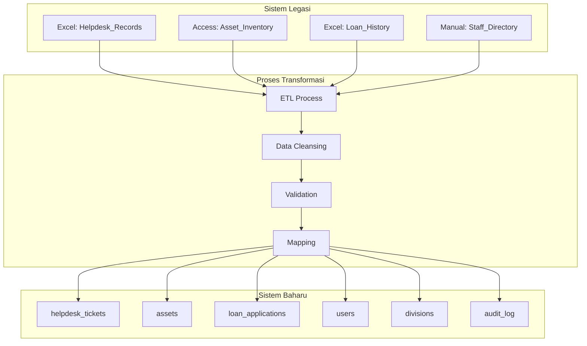
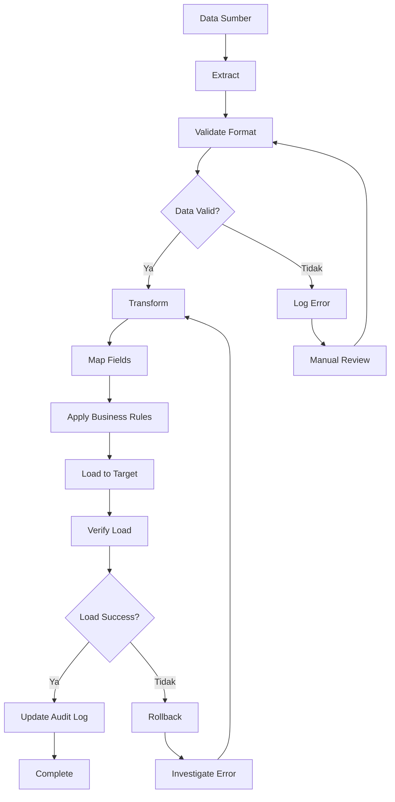
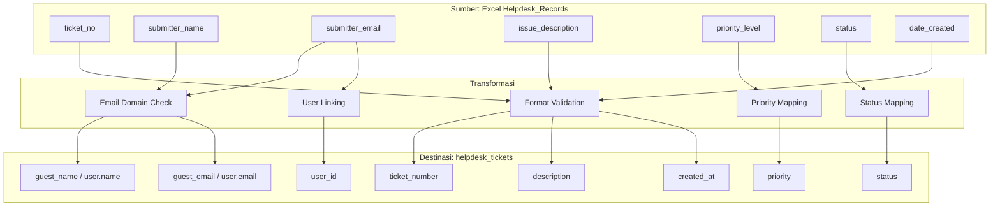

# D06 DOKUMEN SPESIFIKASI MIGRASI DATA

**SISTEM ICTSERVE**

*(Sistem Pengurusan Helpdesk dan Pinjaman Aset ICT)*

| | |
| :--- | :--- |
| **NAMA AGENSI** | : Bahagian Pengurusan Maklumat (BPM) |
| **NAMA AGENSI INDUK** | : Kementerian Pelancongan, Seni dan Budaya Malaysia (MOTAC) |
| **TARIKH DOKUMEN** | : 23 Disember 2025 |
| **VERSI DOKUMEN** | : 4.0.0 |

---

## i. Keterangan Dokumen

Dokumen ini menyatakan Spesifikasi Migrasi Data yang akan dirujuk semasa fasa pembangunan Sistem ICTServe. Ia bertujuan untuk menerangkan secara terperinci tujuan, maklumat sistem yang terlibat, maklumat data serta rangkaian sistem legasi, pemetaan data, pemetaan kod rujukan dan peraturan bisnes.

Dokumen ini mematuhi piawaian ISO 8000 untuk kualiti data, ISO/IEC 38505-1 untuk tadbir urus data, dan keperluan perlindungan data yang berkaitan.

## ii. Semakan dan Pengesahan Dokumen

**SEMAKAN DOKUMEN**

| Disemak Oleh | Jawatan | Tandatangan | Tarikh Semakan |
| :--- | :--- | :--- | :--- |
| Ketua Pembangun Sistem | Pegawai Sistem Maklumat Gred F41 | [Tandatangan Digital] | 23 Disember 2025 |
| Penganalisis Data Kanan | Pegawai Sistem Maklumat Gred F44 | [Tandatangan Digital] | 23 Disember 2025 |
| Pakar Keselamatan Data | Pegawai Keselamatan ICT Gred F41 | [Tandatangan Digital] | 23 Disember 2025 |

**PENGESAHAN DOKUMEN**

| Disahkan Oleh | Jawatan | Tandatangan | Tarikh Semakan |
| :--- | :--- | :--- | :--- |
| Ketua Bahagian Pengurusan Maklumat | Pegawai Tadbir Diplomatik Gred M54 | [Tandatangan Digital] | 23 Disember 2025 |
| Pengarah ICT | Pegawai Tadbir Diplomatik Gred M52 | [Tandatangan Digital] | 23 Disember 2025 |

## iii. Kawalan Dokumen

**KAWALAN DOKUMEN**

| No. Versi | Tarikh | Ringkasan Pindaan | Penyedia |
| :--- | :--- | :--- | :--- |
| 1.0.0 | 15 September 2025 | Versi awal spesifikasi migrasi data | Pasukan Pembangunan BPM |
| 2.0.0 | 17 Oktober 2025 | Penyeragaman mengikut standard KRISA | Pasukan BPM |
| 4.0.0 | 24 Disember 2025 | Semakan editorial dan penyelarasan kandungan mengikut template rasmi | Pasukan Pembangunan BPM |

## iv. Kandungan

1. [TUJUAN DOKUMEN](#1-tujuan-dokumen) ... 5
2. [MAKLUMAT SISTEM YANG TERLIBAT](#2-maklumat-sistem-yang-terlibat) ... 6
3. [PEMETAAN JADUAL](#3-pemetaan-jadual) ... 9
4. [PERATURAN BISNES](#4-peraturan-bisnes) ... 12
5. [PEMETAAN DATA](#5-pemetaan-data) ... 15
6. [PEMETAAN KOD](#6-pemetaan-kod) ... 20
7. [PEMETAAN REKOD (DATA)](#7-pemetaan-rekod-data) ... 23
8. [LAMPIRAN](#8-lampiran) ... 26

## v. Senarai Gambarajah

- Gambarajah 3.1: Pemetaan Jadual Sistem Legasi ke Sistem Baharu ... 10
- Gambarajah 3.2: Aliran Transformasi Data ... 11
- Gambarajah 5.1: Proses Pemetaan Data Hibrid ... 16

## vi. Senarai Jadual

- Jadual 2.1: Maklumat Sistem Legasi ... 7
- Jadual 2.2: Maklumat Sistem Baharu ... 8
- Jadual 4.1: Peraturan Bisnes Migrasi ... 13
- Jadual 5.1: Pemetaan Data Helpdesk ... 17
- Jadual 5.2: Pemetaan Data Pinjaman Aset ... 18
- Jadual 6.1: Pemetaan Kod Status ... 21

## vii. Definisi dan Akronim

### a. Akronim

| Akronim | Keterangan |
| :--- | :--- |
| API | Application Programming Interface |
| BPM | Bahagian Pengurusan Maklumat |
| DBMS | Database Management System |
| ETL | Extract, Transform, Load |
| ICT | Information and Communication Technology |
| KRISA | Kerangka Rujukan ICT Sektor Awam |
| MOTAC | Kementerian Pelancongan, Seni dan Budaya Malaysia |
| PDPA | Personal Data Protection Act |
| SQL | Structured Query Language |

### b. Definisi

| Terma/Istilah | Definisi |
| :--- | :--- |
| Migrasi Data | Proses pemindahan data dari sistem lama ke sistem baharu dengan transformasi yang diperlukan |
| Pemetaan Data | Proses menentukan hubungan antara elemen data dalam sistem sumber dan destinasi |
| Kualiti Data | Ukuran ketepatan, kelengkapan, konsistensi, dan kebolehpercayaan data |

## viii. Sumber Rujukan

1. **ISO 8000-2:2020** - Data quality - Part 2: Vocabulary
2. **ISO/IEC 38505-1:2017** - Governance of data
3. **Akta Perlindungan Data Peribadi 2010** - Personal Data Protection Act Malaysia
4. **MAMPU (2019)**. Kerangka Rujukan ICT Sektor Awam (KRISA) Versi 2.0
5. **Polisi Keselamatan Siber (PKS) MOTAC** - Rujukan umum keperluan keselamatan
6. **Pelan Strategik Pendigitalan MOTAC (PSPM) 2022-2026** - Rujukan umum pelan strategik
7. **D05_PELAN_MIGRASI_DATA.md v3.6.1** - Pelan migrasi data

---

## 1. TUJUAN DOKUMEN

Dokumen Spesifikasi Migrasi Data ini bertujuan untuk:

1. **Menyediakan Spesifikasi Teknikal Terperinci**: Memberikan panduan teknikal yang komprehensif untuk proses migrasi data dari sistem lama ke Sistem ICTServe baharu.

2. **Memastikan Pematuhan Standard**: Memastikan proses migrasi mematuhi piawaian ISO 8000 (kualiti data) dan PDPA 2010 Malaysia.

3. **Menyokong Pendekatan Fleksibel**: Menyediakan spesifikasi untuk migrasi yang menyokong akses fleksibel.

4. **Mengurangkan Risiko Migrasi**: Menyediakan panduan terperinci untuk mengurangkan risiko kehilangan data dan ketidakkonsistenan.

## 2. MAKLUMAT SISTEM YANG TERLIBAT

### Sistem Legasi

**a) Maklumat Sistem Legasi**

| Bil | Modul | Data | Fungsi | Tahun Mula | Tahun Tamat | Bahasa | Jenis | Penyelenggaraan | Server | OS | IP | Zon |
| :--- | :--- | :--- | :--- | :--- | :--- | :--- | :--- | :--- | :--- | :--- | :--- | :--- |
| 1 | Helpdesk Manual | Tiket helpdesk | Pengurusan aduan | 2020 | 2025 | Manual/Excel | SA | Inhouse | Workstation | Windows 10 | 192.168.1.100 | LAN |
| 2 | Asset Management | Inventori aset | Pengurusan aset | 2019 | 2025 | Excel/Access | SA | Inhouse | Workstation | Windows 10 | 192.168.1.101 | LAN |
| 3 | Loan Tracking | Rekod pinjaman | Penjejakan pinjaman | 2021 | 2025 | Excel | SA | Inhouse | Workstation | Windows 10 | 192.168.1.102 | LAN |

**Jadual 2.1: Maklumat Sistem Legasi**

**b) Maklumat Pangkalan Data Sistem Legasi**

| Nama | DBMS | Volume Data | Arkitektur | Kepatuhan DDSA | 1GovNet | Rangkaian Lain | Catatan |
| :--- | :--- | :--- | :--- | :--- | :--- | :--- | :--- |
| Helpdesk_Records | Excel/CSV | ~500 rekod | Decentral | Tidak | Tidak | LAN | Fail manual tersebar |
| Asset_Inventory | Access DB | ~200 aset | Decentral | Tidak | Tidak | LAN | Database Access 2019 |
| Loan_History | Excel | ~300 rekod | Decentral | Tidak | Tidak | LAN | Spreadsheet manual |

### Sistem Baharu

**a) Maklumat Sistem Baharu**

| Bil | Modul | Data | Fungsi | Tahun Mula | Bahasa | Jenis | Penyelenggaraan | Server | OS | IP | Zon |
| :--- | :--- | :--- | :--- | :--- | :--- | :--- | :--- | :--- | :--- | :--- | :--- |
| 1 | ICTServe Helpdesk | Tiket helpdesk hibrid | Pengurusan aduan terpusat | 2026 | Laravel 12/PHP 8.4 | WB | Inhouse | MOTAC-ICT-01 | Ubuntu 22.04 | 10.1.1.10 | DMZ |
| 2 | ICTServe Asset Loan | Pinjaman aset hibrid | Pengurusan pinjaman | 2026 | Laravel 12/PHP 8.4 | WB | Inhouse | MOTAC-ICT-01 | Ubuntu 22.04 | 10.1.1.10 | DMZ |
| 3 | ICTServe Admin | Panel pentadbir | Pengurusan sistem | 2026 | Filament 4.3/Laravel | WB | Inhouse | MOTAC-ICT-01 | Ubuntu 22.04 | 10.1.1.10 | DMZ |

**Jadual 2.2: Maklumat Sistem Baharu**

**b) Maklumat Pangkalan Data Sistem Baharu**

| Nama | DBMS | Volume Data | Arkitektur | Kepatuhan DDSA | 1GovNet | Rangkaian Lain | Catatan |
| :--- | :--- | :--- | :--- | :--- | :--- | :--- | :--- |
| ictserve_production | MySQL 8.0 | ~1000 rekod (anggaran) | Central | Ya | Ya | MOTAC LAN | Database terpusat dengan backup |
| ictserve_files | S3/MinIO | ~100GB | Hybrid | Ya | Ya | Cloud Storage | Penyimpanan fail dan lampiran |

## 3. PEMETAAN JADUAL

### 3.1. Pemetaan Jadual Utama



**Gambarajah 3.1: Pemetaan Jadual Sistem Legasi ke Sistem Baharu**

### 3.2. Aliran Transformasi Data



**Gambarajah 3.2: Aliran Transformasi Data**

## 4. PERATURAN BISNES

### 4.1. Peraturan Migrasi Umum

| Bil | Peraturan | Keterangan | Implikasi |
| :--- | :--- | :--- | :--- |
| 1 | Integriti Data | Semua data mesti dipindah tanpa kehilangan atau kerosakan | Backup penuh sebelum migrasi, validasi post-migration |
| 2 | Pematuhan PDPA | Data peribadi mesti dilindungi sepanjang proses | Encryption, access control, audit trail |
| 3 | Seni Bina Hibrid | Sistem mesti menyokong akses tetamu dan authenticated | Nullable user_id, guest tracking fields |
| 4 | Kualiti Data | Data mesti memenuhi standard ISO 8000 | Validation rules, cleansing process |
| 5 | Audit Trail | Semua perubahan mesti direkod | Dual audit system (Laravel Auditing + Activity Log) |

**Jadual 4.1: Peraturan Bisnes Migrasi**

### 4.2. Peraturan Khusus Seni Bina Hibrid

1. **Migrasi Staf ke Users Table**:
   - Staf MOTAC dimigrasikan ke jadual `users` dengan role 'staff'
   - E-mel mesti berakhir dengan @motac.gov.my
   - `email_verified_at` ditetapkan kepada NOW() (auto-verified)

2. **Penyambungan Submission Sejarah**:
   - Submission tetamu terdahulu disambung ke akaun staf melalui padanan e-mel
   - Jika tiada padanan, submission kekal sebagai guest (user_id = NULL)
   - Kira bilangan submission yang disambung dalam `guest_submissions_linked`

3. **Pemeliharaan Data Guest**:
   - Submission dengan user_id = NULL dikekalkan sebagai guest submissions
   - Tiada tindakan diperlukan untuk submission guest yang tidak disambung

## 5. PEMETAAN DATA

### 5.1. Pemetaan Data Helpdesk



**Gambarajah 5.1: Proses Pemetaan Data Hibrid**

| Field Sumber | Field Destinasi | Transformasi | Validasi |
| :--- | :--- | :--- | :--- |
| ticket_no | ticket_number | Format HD-YYYYMM-XXXX | Unique, not null |
| submitter_name | guest_name (jika guest) / user.name (jika staff) | Trim, title case | Max 255 chars |
| submitter_email | guest_email (jika guest) / user.email (jika staff) | Lowercase, link to user_id | Valid email format |
| submitter_phone | guest_phone (jika guest) / user.phone (jika staff) | Format +60XXXXXXXXX | Malaysian format |
| department | guest_division (jika guest) / division_id (jika staff) | Map to division code | Valid division |
| issue_description | description | Clean HTML, trim | Min 10 chars |
| priority_level | priority | Map 1→low, 2→medium, 3→high, 4→critical | Valid enum |
| status | status | Map to system enum | Valid status |
| date_created | created_at | ISO 8601 format | Valid timestamp |

**Jadual 5.1: Pemetaan Data Helpdesk**

### 5.2. Pemetaan Data Pinjaman Aset

| Field Sumber | Field Destinasi | Transformasi | Validasi |
| :--- | :--- | :--- | :--- |
| loan_ref | application_number | Format LA-YYYYMM-XXXX | Unique, not null |
| applicant_name | applicant_name | Trim, title case | Max 255 chars |
| applicant_email | applicant_email + user_id link | Lowercase, link to user | Valid email |
| applicant_phone | applicant_phone | Format +60XXXXXXXXX | Malaysian format |
| staff_id | staff_id | Preserve original | Max 20 chars |
| grade | grade | Map to standard grades | Valid grade |
| division | division_id | Map to divisions table | Valid division |
| purpose | purpose | Clean text | Min 10 chars |
| loan_start | loan_start_date | ISO date format | Valid date |
| loan_end | loan_end_date | ISO date format | After start date |
| status | status | Map to system enum | Valid status |

**Jadual 5.2: Pemetaan Data Pinjaman Aset**

## 6. PEMETAAN KOD

### 6.1. Pemetaan Kod Status Helpdesk

| Kod Lama | Keterangan Lama | Kod Baharu | Keterangan Baharu |
| :--- | :--- | :--- | :--- |
| 1 | Baru | open | Tiket baharu dibuka |
| 2 | Dalam Proses | in_progress | Sedang diproses |
| 3 | Menunggu Maklumat | pending_user | Menunggu respons pengguna |
| 4 | Selesai | resolved | Masalah diselesaikan |
| 5 | Tutup | closed | Tiket ditutup |

**Jadual 6.1: Pemetaan Kod Status Helpdesk**

### 6.2. Pemetaan Kod Keutamaan

| Kod Lama | Keterangan Lama | Kod Baharu | Keterangan Baharu |
| :--- | :--- | :--- | :--- |
| 1 | Rendah | low | Keutamaan rendah |
| 2 | Sederhana | medium | Keutamaan sederhana |
| 3 | Tinggi | high | Keutamaan tinggi |
| 4 | Kritikal | critical | Keutamaan kritikal |

### 6.3. Pemetaan Kod Status Pinjaman

| Kod Lama | Keterangan Lama | Kod Baharu | Keterangan Baharu |
| :--- | :--- | :--- | :--- |
| PENDING | Menunggu Kelulusan | pending_supervisor_approval | Menunggu kelulusan penyelia |
| APPROVED | Diluluskan | approved | Permohonan diluluskan |
| REJECTED | Ditolak | rejected | Permohonan ditolak |
| COLLECTED | Diambil | on_loan | Aset sedang dipinjam |
| RETURNED | Dipulang | returned | Aset telah dipulangkan |

## 7. PEMETAAN REKOD (DATA)

### 7.1. Proses Pemetaan Rekod

```mermaid
graph TD
    A[Baca Rekod Sumber] --> B[Validate Format]
    B --> C{Format Valid?}
    
    C -->|Tidak| D[Log Error]
    C -->|Ya| E[Apply Code Mapping]
    
    E --> F[Check Email Domain]
    F --> G{@motac.gov.my?}
    
    G -->|Ya| H[Link to User Account]
    G -->|Tidak| I[Keep as Guest]
    
    H --> J[Set user_id]
    I --> K[Set user_id = NULL]
    
    J --> L[Apply Business Rules]
    K --> L
    
    L --> M[Validate Constraints]
    M --> N{Valid?}
    
    N -->|Tidak| O[Log Validation Error]
    N -->|Ya| P[Insert to Target Table]
    
    P --> Q[Update Audit Log]
    Q --> R[Complete]
    
    D --> S[Manual Review Required]
    O --> S
```

### 7.2. Contoh Pemetaan Rekod Helpdesk

**Rekod Sumber (Excel):**

```
ticket_no: HD001
submitter_name: Ahmad Ibrahim
submitter_email: ahmad.ibrahim@motac.gov.my
issue_description: Komputer tidak boleh start
priority_level: 2
status: 1
date_created: 2025-01-15
```

**Rekod Destinasi (MySQL):**

```sql
INSERT INTO helpdesk_tickets (
    ticket_number, user_id, guest_name, guest_email,
    description, priority, status, created_at
) VALUES (
    'HD-202501-0001', 123, NULL, NULL,
    'Komputer tidak boleh start', 'medium', 'open', '2025-01-15 00:00:00'
);
```

### 7.3. Validasi Post-Migration

**Query Validasi Jumlah Rekod:**

```sql
-- Semak jumlah rekod helpdesk
SELECT COUNT(*) as total_tickets FROM helpdesk_tickets;

-- Semak jumlah rekod dengan user_id (staff)
SELECT COUNT(*) as staff_tickets FROM helpdesk_tickets WHERE user_id IS NOT NULL;

-- Semak jumlah rekod guest
SELECT COUNT(*) as guest_tickets FROM helpdesk_tickets WHERE user_id IS NULL;
```

**Query Validasi Integriti:**

```sql
-- Semak foreign key integrity
SELECT COUNT(*) as orphaned_records 
FROM helpdesk_tickets ht 
LEFT JOIN users u ON ht.user_id = u.id 
WHERE ht.user_id IS NOT NULL AND u.id IS NULL;
```

## 8. LAMPIRAN

### 8.1. Contoh Format Data Sumber

**A. Format Excel Helpdesk Records:**

- Nama Fail: `Helpdesk_Records_2025.xlsx`
- Sheet: `Tickets`
- Header Row: Row 1
- Data Rows: Row 2 onwards

**B. Format Access Asset Inventory:**

- Nama Fail: `Asset_Inventory.accdb`
- Table: `Assets`
mary Key: `AssetID`

### 8.2. Skrip SQL Migrasi

**A. Create Target Tables:**

```sql
-- Rujuk database/migrations/ untuk struktur lengkap
-- Contoh: 2025_11_03_043900_create_helpdesk_tickets_table.php
```

**B. Data Validation Queries:**

```sql
-- Semak email domain compliance
SELECT COUNT(*) FROM users WHERE email NOT LIKE '%@motac.gov.my';

-- Semak duplicate ticket numbers
SELECT ticket_number, COUNT(*) FROM helpdesk_tickets GROUP BY ticket_number HAVING COUNT(*) > 1;
```

### 8.3. Checklist Migrasi

- [ ] Backup sistem sumber lengkap
- [ ] Validate data format dan quality
- [ ] Test migration scripts di staging
- [ ] Execute migration dengan monitoring
- [ ] Validate post-migration data integrity
- [ ] Update audit logs
- [ ] Generate migration report
- [ ] User acceptance testing
- [ ] Go-live approval

### 8.4. Maklumat Hubungan

**Pasukan Migrasi:**

- **Ketua Projek**: <ketua.bpm@motac.gov.my>
- **Ketua Teknikal**: <teknikal.bpm@motac.gov.my>
- **Sokongan 24/7**: +603-8891-4000

**Dokumentasi Rujukan:**

- D05_PELAN_MIGRASI_DATA.md - Pelan strategik migrasi
- D09_DATABASE_DOCUMENTATION.md - Dokumentasi pangkalan data
- Laravel Migration Files - Struktur jadual target

---

**TAMAT DOKUMEN / END OF DOCUMENT**

*Dokumen ini adalah hak milik Kementerian Pelancongan, Seni dan Budaya Malaysia (MOTAC) dan tertakluk kepada Akta Rahsia Rasmi 1972.*
