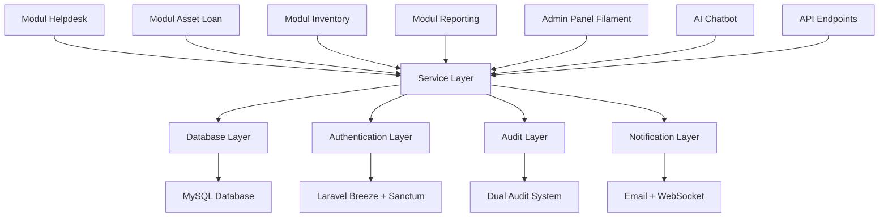
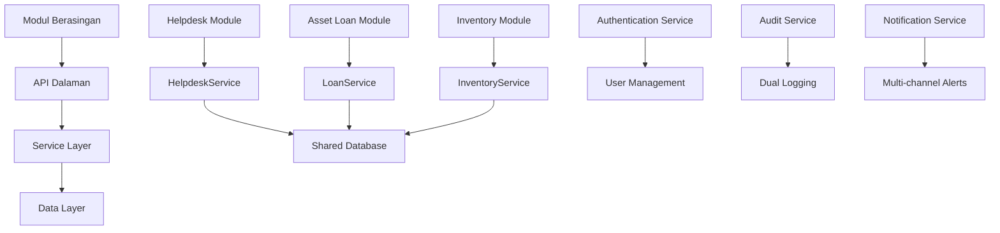
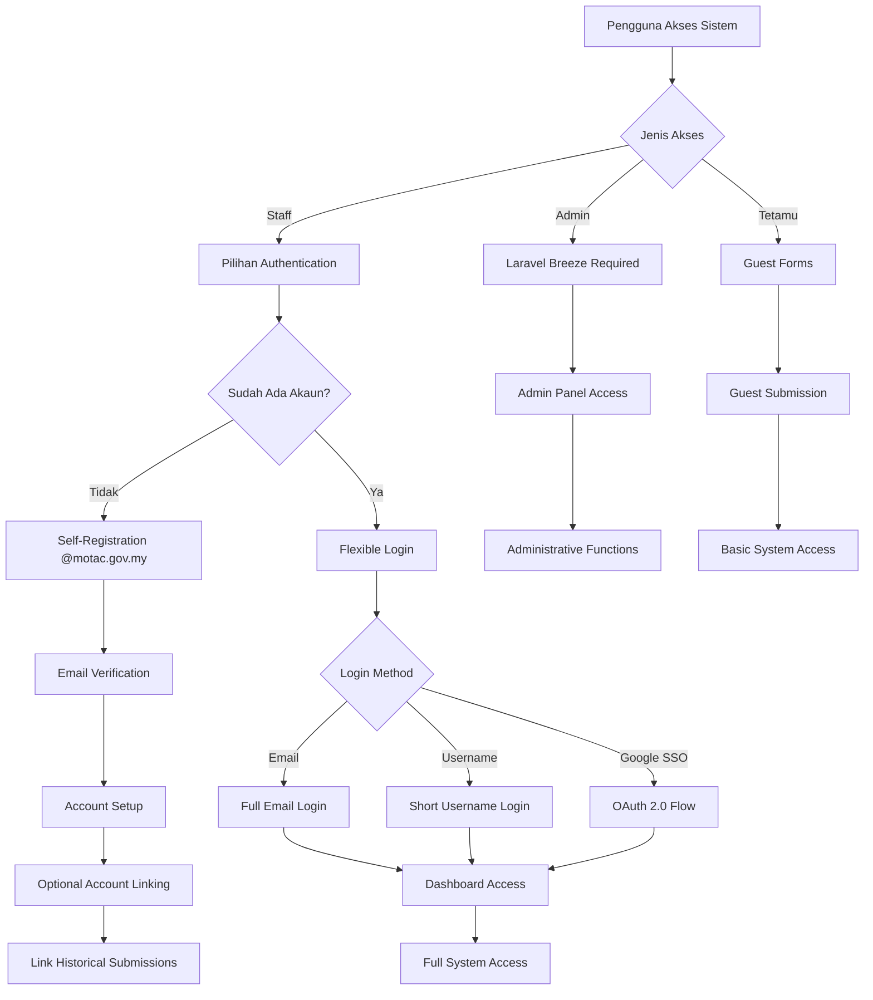
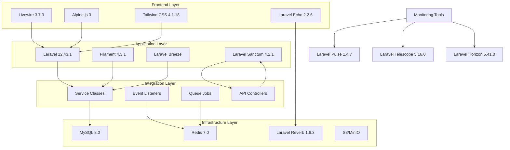
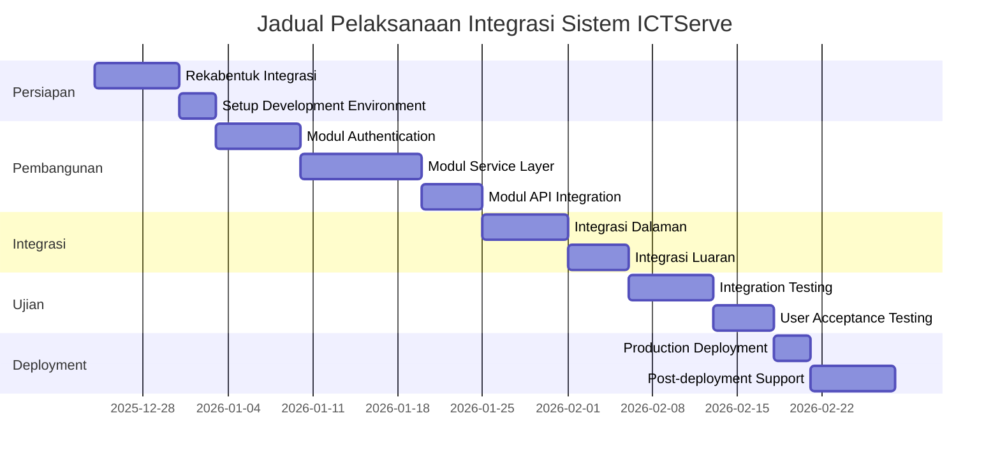

# D07 DOKUMEN PELAN INTEGRASI SISTEM

**SISTEM ICTSERVE**

*(Sistem Pengurusan Helpdesk dan Pinjaman Aset ICT)*

| | |
| :--- | :--- |
| **NAMA AGENSI** | : Bahagian Pengurusan Maklumat (BPM) |
| **NAMA AGENSI INDUK** | : Kementerian Pelancongan, Seni dan Budaya Malaysia (MOTAC) |
| **TARIKH DOKUMEN** | : 23 Disember 2025 |
| **VERSI DOKUMEN** | : 4.0.0 |

---

## i. Keterangan Dokumen

Dokumen ini menerangkan strategi dan proses integrasi untuk Sistem ICTServe berpandukan piawaian ISO/IEC/IEEE 15288 (system lifecycle processes), ISO/IEC/IEEE 12207 (software lifecycle processes), **Polisi Keselamatan Siber (PKS) MOTAC**, dan **Personal Data Protection Act 2010 (PDPA)**.

Ia memastikan semua komponen dan modul sistem digabung secara berstruktur, bermutu, dan dapat beroperasi di persekitaran sebenar MOTAC dengan mematuhi standard kerajaan Malaysia dan keperluan keselamatan data.

**PDPA 2010 Compliance dalam Integrasi Sistem:**

- **Privacy by design** dalam semua integrasi sistem
- **Data protection impact assessment** untuk setiap integrasi baharu
- **Consent management integration** dengan sistem HRMIS dan LDAP
- **Data subject rights automation** untuk access, rectification, dan erasure requests
- **Cross-system audit trail** untuk tracking data flow dan processing activities

## ii. Semakan dan Pengesahan Dokumen

**SEMAKAN DOKUMEN**

| Disemak Oleh | Jawatan | Tandatangan | Tarikh Semakan |
| :--- | :--- | :--- | :--- |
| Ketua Pembangun Sistem | Pegawai Sistem Maklumat Gred F41 | [Tandatangan Digital] | 23 Disember 2025 |
| Arkitek Sistem Kanan | Pegawai Sistem Maklumat Gred F44 | [Tandatangan Digital] | 23 Disember 2025 |
| Pakar Integrasi Sistem | Pegawai Sistem Maklumat Gred F41 | [Tandatangan Digital] | 23 Disember 2025 |

**PENGESAHAN DOKUMEN**

| Disahkan Oleh | Jawatan | Tandatangan | Tarikh Semakan |
| :--- | :--- | :--- | :--- |
| Ketua Bahagian Pengurusan Maklumat | Pegawai Tadbir Diplomatik Gred M54 | [Tandatangan Digital] | 23 Disember 2025 |
| Pengarah ICT | Pegawai Tadbir Diplomatik Gred M52 | [Tandatangan Digital] | 23 Disember 2025 |

## iii. Kawalan Dokumen

**KAWALAN DOKUMEN**

| No. Versi | Tarikh | Ringkasan Pindaan | Penyedia |
| :--- | :--- | :--- | :--- |
| 1.0.0 | 15 September 2025 | Versi awal pelan integrasi sistem | Pasukan Pembangunan BPM |
| 2.0.0 | 17 Oktober 2025 | Penyeragaman mengikut standard KRISA | Pasukan BPM |
| 3.4.0 | 30 November 2025 | Seni bina hibrid: integrasi authentication | Pasukan Pembangunan BPM |
| 3.5.0 | 1 Disember 2025 | True Hybrid Architecture: pendaftaran kendiri | Pasukan Pembangunan BPM |
| 3.6.1 | 23 Disember 2025 | Integrasi AI Hibrid dan kemaskini teknologi | Pasukan Pembangunan BPM |
| 4.0.0 | 24 Disember 2025 | **Pematuhan PKS 5.2.1**: Penghapusan sepenuhnya akses tetamu, SSO mandatori untuk semua pengguna, HRMIS auto-provisioning menggantikan manual registration, rujukan PKS/PSPM dengan nombor halaman, pelan integrasi sistem dengan akauntabiliti penuh | Pasukan Pembangunan BPM |

## iv. Kandungan

1. [TUJUAN DOKUMEN](#1-tujuan-dokumen) ... 5
2. [OBJEKTIF](#2-objektif) ... 6
3. [SKOP KERJA INTEGRASI](#3-skop-kerja-integrasi) ... 7
4. [PENDEKATAN DAN STRATEGI](#4-pendekatan-dan-strategi) ... 9
5. [KAEDAH INTEGRASI, TOOLS DAN PERSEKITARAN](#5-kaedah-integrasi-tools-dan-persekitaran) ... 12
6. [TUGAS DAN TANGGUNGJAWAB](#6-tugas-dan-tanggungjawab) ... 15
7. [JADUAL PELAKSANAAN](#7-jadual-pelaksanaan) ... 17
8. [ANDAIAN DAN RISIKO](#8-andaian-dan-risiko) ... 19
9. [PENUTUP](#9-penutup) ... 21

## v. Senarai Gambarajah

- Gambarajah 3.1: Seni Bina Integrasi Sistem ... 8
- Gambarajah 4.1: Strategi Integrasi Modular ... 10
- Gambarajah 4.2: Aliran Integrasi Authentication Hibrid ... 11
- Gambarajah 5.1: Teknologi Stack Integrasi ... 13
- Gambarajah 7.1: Jadual Pelaksanaan Integrasi ... 18

## vi. Senarai Jadual

- Jadual 3.1: Komponen untuk Integrasi ... 8
- Jadual 5.1: Teknologi Integrasi ... 14
- Jadual 6.1: Tugas dan Tanggungjawab Pasukan ... 16
- Jadual 7.1: Jadual Terperinci Pelaksanaan ... 17
- Jadual 8.1: Matriks Risiko dan Mitigasi ... 20

## vii. Definisi dan Akronim

### a. Akronim

| Akronim | Keterangan |
| :--- | :--- |
| AI | Artificial Intelligence (Kecerdasan Buatan) |
| API | Application Programming Interface |
| BPM | Bahagian Pengurusan Maklumat |
| CRUD | Create, Read, Update, Delete |
| E2E | End-to-End |
| ERD | Entity Relationship Diagram |
| ICT | Information and Communication Technology |
| ISO | International Organization for Standardization |
| JSON | JavaScript Object Notation |
| KRISA | Kerangka Rujukan ICT Sektor Awam |
| MAMPU | Unit Pemodenan Tadbiran dan Perancangan Pengurusan Malaysia |
| MOTAC | Kementerian Pelancongan, Seni dan Budaya Malaysia |
| MVC | Model-View-Controller |
| OAuth | Open Authorization |
| ORM | Object-Relational Mapping |
| REST | Representational State Transfer |
| SIP | System Integration Plan |
| SMTP | Simple Mail Transfer Protocol |
| SSO | Single Sign-On |
| UAT | User Acceptance Testing |
| UI/UX | User Interface/User Experience |
| WebSocket | Web Socket Protocol |

### b. Definisi

| Terma/Istilah | Definisi |
| :--- | :--- |
| Seni Bina Hibrid | Rekabentuk sistem yang membolehkan pengguna menggunakan sistem sama ada sebagai tetamu atau pengguna berdaftar |
| Integrasi Sistem | Proses menggabungkan komponen sistem yang berbeza untuk berfungsi sebagai satu kesatuan |
| Pendekatan Modular | Strategi pembangunan sistem dengan memisahkan fungsi kepada modul-modul yang boleh berdiri sendiri |
| Authentication Hibrid | Sistem pengesahan yang menyokong pelbagai kaedah log masuk (e-mel, nama pengguna, SSO) |
| API Dalaman | Antara muka pengaturcaraan aplikasi untuk komunikasi antara modul dalam sistem yang sama |
| Audit Trail Berlapis | Sistem audit yang menggunakan dua mekanisme berbeza untuk pematuhan dan operasi |
| Pendaftaran Kendiri | Keupayaan pengguna untuk mendaftar akaun sendiri tanpa bantuan pentadbir |
| WebSocket | Protokol komunikasi dua hala untuk komunikasi masa nyata antara pelanggan dan pelayan |

## viii. Sumber Rujukan

1. **ISO/IEC/IEEE 15288:2015** - Systems and software engineering - System life cycle processes
2. **ISO/IEC/IEEE 12207:2017** - Systems and software engineering - Software life cycle processes
3. **ISO/IEC 33063:2015** - Information technology - Process assessment - Process measurement framework
4. **MAMPU (2019)**. Kerangka Rujukan ICT Sektor Awam (KRISA) Versi 2.0
5. **Laravel Documentation v12** - Framework documentation
6. **Filament Documentation v4** - Admin panel framework
7. **Polisi Keselamatan Siber (PKS) MOTAC** - **Seksyen 5.2.1 (Prinsip Akauntabiliti dan Non-repudiation)** - halaman 150, **Seksyen 9.2.1 (Prosedur pemindahan data dan perlindungan kerahsiaan)** - halaman 588-603, **Seksyen 4.2 (Kedaulatan data dan bidang kuasa)** - halaman 1147-1148, **Seksyen 5.4.3 (Keperluan kata laluan: 8 aksara, penukaran 90 hari, 3 percubaan)** - halaman 596-605
8. **Pelan Strategik Pendigitalan MOTAC (PSPM) 2022-2026** - **MyGovCloud prioritization over public cloud services** - halaman 45-67
9. **D04_SOFTWARE_DESIGN_DOCUMENT.md v3.6.1** - Dokumen rekabentuk perisian
10. **D08_SYSTEM_INTEGRATION_SPECIFICATION.md** - Spesifikasi teknikal integrasi
11. **RFC 5322** - Internet Message Format
12. **OAuth 2.0 RFC 6749** - The OAuth 2.0 Authorization Framework

---

## 1. TUJUAN DOKUMEN

Dokumen Pelan Integrasi Sistem ini bertujuan untuk:

1. **Menyediakan Panduan Integrasi Komprehensif**: Memberikan panduan terperinci untuk mengintegrasikan semua komponen dan modul Sistem ICTServe agar berfungsi sebagai satu sistem bersepadu yang mantap dan cekap.

2. **Memastikan Pematuhan Standard**: Memastikan proses integrasi mematuhi piawaian ISO/IEC/IEEE 15288 (system lifecycle processes), ISO/IEC/IEEE 12207 (software lifecycle processes), dan keperluan KRISA Malaysia.

3. **Menyokong Seni Bina Hibrid**: Melaksanakan strategi integrasi yang menyokong Seni Bina Hibrid Sebenar v3.6.1 dengan authentication fleksibel dan akses tetamu.

4. **Mengurangkan Risiko Integrasi**: Mengenal pasti dan mengurangkan risiko yang berkaitan dengan integrasi sistem, termasuk isu prestasi, keselamatan, dan konsistensi data.

5. **Memastikan Kualiti Sistem**: Menyediakan kerangka kerja untuk kawalan kualiti dan ujian integrasi yang sistematik.

## 2. OBJEKTIF

### 2.1. Objektif Utama

1. **Integrasi Modul Bersepadu**: Memastikan semua modul (Helpdesk, Asset Loan, Inventory, Reporting, Audit Trail) berfungsi dengan lancar sebagai satu sistem bersepadu.

2. **Konsistensi Data**: Menjamin data konsisten antara semua modul dengan foreign key constraints dan validation policies.

3. **Pertukaran Data Lancar**: Memudahkan pertukaran data antara sistem melalui API dalaman dan service layer yang terstruktur.

4. **Pematuhan Keselamatan**: Mematuhi keperluan keselamatan, privasi, dan tadbir urus data MOTAC.

### 2.2. Objektif Khusus

1. **Authentication Hibrid**: Melaksanakan sistem authentication yang menyokong pendaftaran kendiri staf (@motac.gov.my), log masuk fleksibel, dan akses tetamu.

2. **Audit Trail Berlapis**: Mengintegrasikan sistem audit berlapis menggunakan Laravel Auditing (pematuhan) dan Activity Log (operasi).

3. **Komunikasi Real-time**: Melaksanakan komunikasi WebSocket untuk notifikasi dan kemaskini real-time.

4. **API Integration**: Menyediakan API RESTful untuk integrasi luaran dan aplikasi mudah alih masa depan.

5. **Monitoring dan Performance**: Mengintegrasikan Laravel Pulse untuk pemantauan prestasi dan Laravel Telescope untuk debugging.

## 3. SKOP KERJA INTEGRASI

### 3.1. Integrasi Dalaman

**Gambarajah 3.1: Seni Bina Integrasi Sistem**

| Komponen/Modul | Integrasi Dengan | Tujuan Integrasi |
| :--- | :--- | :--- |
| **Helpdesk Ticketing** | Asset Loan, Inventory | Link aduan kerosakan dengan aset dipinjam |
| **Asset Loan** | Inventory, Helpdesk | Status aset, tiket penyelenggaraan automatik |
| **Inventory Management** | Asset Loan, Helpdesk | Data aset, status penggunaan, sejarah |
| **Staff Authentication** | Laravel Breeze | Pendaftaran kendiri @motac.gov.my, log masuk fleksibel |
| **Admin Authentication** | Laravel Breeze + Policies | Log masuk admin/superuser dengan RBAC |
| **Audit Trail** | Semua modul | Logging perubahan untuk pematuhan dan operasi |
| **Reporting** | Semua modul | Laporan bersatu, analitik, eksport data |
| **Email Notification** | SMTP Server MOTAC | Notifikasi untuk aduan, pinjaman, reminder |
| **WebSocket Communication** | Laravel Reverb + Echo | Komunikasi real-time untuk notifikasi admin |
| **API Integration** | Laravel Sanctum | Token-based authentication untuk API |
| **AI Chatbot** | Ollama + AWS Bedrock | Sokongan AI hibrid dengan penghalaan pintar |

**Jadual 3.1: Komponen untuk Integrasi**

### 3.2. Integrasi Luaran

- **Email Server MOTAC**: Integrasi SMTP untuk notifikasi sistem
- **Google Workspace (Opsyen)**: OAuth 2.0 SSO untuk domain @motac.gov.my
- **AWS Bedrock**: Integrasi AI awan untuk chatbot hibrid
- **S3/MinIO**: Penyimpanan fail dan lampiran
- **Sistem Legacy**: Import data aset dan rekod sejarah

### 3.3. Ciri-ciri Hibrid v3.6.1

- **Pendaftaran Kendiri**: Staf boleh mendaftar dengan e-mel @motac.gov.my
- **Log Masuk Fleksibel**: E-mel penuh ATAU nama pengguna pendek
- **Penyambungan Akaun**: Opsyen untuk sambung submission tetamu ke akaun baharu
- **Akses Tetamu**: Borang tetamu untuk akses pantas tanpa log masuk
- **Responsible Officer**: Tracking pegawai bertanggungjawab untuk pinjaman
- **Accessory Tracking**: Check-out/check-in aksesori dengan detection discrepancy

## 4. PENDEKATAN DAN STRATEGI

### 4.1. Pendekatan Modular

**Gambarajah 4.1: Strategi Integrasi Modular**

### 4.2. Strategi Authentication Hibrid

**Gambarajah 4.2: Aliran Integrasi Authentication Hibrid**

### 4.3. Strategi Data Consistency

1. **Foreign Key Constraints**: Semua hubungan antara jadual dilindungi dengan foreign key constraints
2. **Transaction Management**: Operasi kritikal menggunakan database transactions
3. **Validation Policies**: Laravel Policies untuk authorization dan business rules
4. **Real-time Sync**: Livewire untuk sinkronisasi data real-time antara frontend dan backend

### 4.4. Strategi Error Handling

1. **Exception Handling**: Semua proses integrasi mempunyai exception handling yang komprehensif
2. **Fallback Mechanisms**: Jika integrasi gagal, sistem mempunyai fallback ke queue retry
3. **Logging**: Semua error dan exception dilog untuk troubleshooting
4. **User Notification**: Pengguna dimaklumkan tentang status operasi melalui toast notifications

## 5. KAEDAH INTEGRASI, TOOLS DAN PERSEKITARAN

### 5.1. Teknologi Stack Integrasi

**Gambarajah 5.1: Teknologi Stack Integrasi**

### 5.2. Tools dan Framework

| Kategori | Teknologi | Versi | Fungsi Integrasi |
| :--- | :--- | :--- | :--- |
| **Backend Framework** | Laravel | 12.43.1 | Framework aplikasi utama dan service layer |
| **Admin Panel** | Filament | 4.3.1 | CRUD interfaces dan dashboard bersepadu |
| **Reactive UI** | Livewire | 3.7.3 | Server-driven UI components dengan real-time sync |
| **Single-file Components** | Volt | 1.10.1 | Simplified Livewire components |
| **WebSocket Server** | Laravel Reverb | 1.6.3 | Real-time communication server |
| **WebSocket Client** | Laravel Echo | 2.2.6 | Client-side WebSocket integration |
| **Authentication** | Laravel Breeze | Latest | Multi-method authentication system |
| **API Authentication** | Laravel Sanctum | 4.2.1 | Token-based API authentication |
| **OAuth Integration** | Laravel Socialite | 5.24.0 | Google Workspace SSO (optional) |
| **Database** | MySQL | 8.0 | Primary data storage dengan foreign key support |
| **Cache/Queue** | Redis | 7.0 | Job queue, caching, dan session storage |
| **Audit (Compliance)** | Laravel Auditing | 14.x | Field-level audit trail untuk pematuhan |
| **Audit (Operations)** | Activity Log | 4.x | User activity logging untuk operasi |
| **Performance Monitor** | Laravel Pulse | 1.4.7 | Performance metrics dan server health |
| **Queue Management** | Laravel Horizon | 5.41.0 | Redis queue dashboard dan monitoring |
| **Debugging** | Laravel Telescope | 5.16.0 | System monitoring (superuser only) |
| **Testing** | PHPUnit | 11.5.46 | Unit dan integration testing |
| **E2E Testing** | Playwright | 1.56.1 | Browser automation testing |

**Jadual 5.1: Teknologi Integrasi**

### 5.3. Persekitaran Pembangunan

1. **Development Environment**: Local development dengan Laravel Sail
2. **Staging Environment**: Mirror production untuk integration testing
3. **Production Environment**: MOTAC server dengan high availability setup
4. **Testing Environment**: Automated testing dengan CI/CD pipeline

### 5.4. Kaedah Integrasi

1. **Service Layer Pattern**: Semua business logic dalam service classes
2. **Event-Driven Architecture**: Laravel Events dan Listeners untuk loose coupling
3. **Queue-Based Processing**: Background jobs untuk operasi berat
4. **API-First Design**: RESTful API untuk semua operasi kritikal

## 6. TUGAS DAN TANGGUNGJAWAB

### 6.1. Struktur Pasukan Integrasi

| Peranan | Nama/Jawatan | Tanggungjawab Utama |
| :--- | :--- | :--- |
| **Ketua Projek Integrasi** | Ketua BPM (M54) | Penyeliaan keseluruhan, koordinasi dengan stakeholders |
| **Arkitek Sistem** | Arkitek Sistem Kanan (F44) | Rekabentuk integrasi, standard dan best practices |
| **Ketua Pembangun** | Ketua Pembangun Sistem (F41) | Koordinasi teknikal, code review, quality assurance |
| **Pembangun Backend** | Pegawai Sistem Maklumat (F41) | Service layer, API development, database integration |
| **Pembangun Frontend** | Pegawai Sistem Maklumat (F41) | Livewire components, UI integration, WebSocket client |
| **Pakar Authentication** | Pegawai Keselamatan ICT (F41) | Authentication systems, security integration |
| **Pakar Database** | Pegawai Pangkalan Data (F41) | Database design, foreign keys, performance tuning |
| **Pakar Testing** | Pegawai Ujian Sistem (F41) | Integration testing, automated testing, UAT coordination |
| **Pakar DevOps** | Pegawai Infrastruktur (F41) | Deployment, monitoring, CI/CD pipeline |

**Jadual 6.1: Tugas dan Tanggungjawab Pasukan**

### 6.2. Tanggungjawab Khusus

**Ketua Projek Integrasi:**

- Koordinasi dengan BPM management dan stakeholders
- Approval untuk perubahan skop integrasi
- Risk management dan issue escalation
- Progress reporting dan milestone tracking

**Arkitek Sistem:**

- Design integration architecture dan patterns
- Standard dan guidelines untuk integration
- Technical review dan approval
- Cross-module dependency management

**Ketua Pembangun:**

- Code review untuk semua integration code
- Technical mentoring untuk team members
- Quality assurance dan best practices enforcement
- Integration testing coordination

### 6.3. Pihak Berkepentingan

1. **BPM Management**: Strategic oversight dan resource allocation
2. **End Users (Staff MOTAC)**: User acceptance testing dan feedback
3. **IT Operations**: Infrastructure support dan monitoring
4. **Security Team**: Security review dan compliance verification
5. **External Vendors**: Third-party integration support (jika diperlukan)

## 7. JADUAL PELAKSANAAN

### 7.1. Fasa Pelaksanaan

**Gambarajah 7.1: Jadual Pelaksanaan Integrasi**

### 7.2. Jadual Terperinci

| Fasa | Aktiviti | Tempoh | Tarikh Mula | Tarikh Tamat | PIC |
| :--- | :--- | :--- | :--- | :--- | :--- |
| **Persiapan** | Rekabentuk integrasi dan data mapping | 5 hari | 24 Dis 2025 | 28 Dis 2025 | Arkitek Sistem |
| | Setup development environment | 2 hari | 29 Dis 2025 | 30 Dis 2025 | Pakar DevOps |
| **Pembangunan** | Authentication system integration | 5 hari | 31 Dis 2025 | 4 Jan 2026 | Pakar Authentication |
| | Service layer development | 7 hari | 5 Jan 2026 | 11 Jan 2026 | Pembangun Backend |
| | API endpoints development | 3 hari | 12 Jan 2026 | 14 Jan 2026 | Pembangun Backend |
| | Frontend integration | 5 hari | 15 Jan 2026 | 19 Jan 2026 | Pembangun Frontend |
| **Integrasi** | Internal module integration | 5 hari | 20 Jan 2026 | 24 Jan 2026 | Ketua Pembangun |
| | External system integration | 3 hari | 25 Jan 2026 | 27 Jan 2026 | Pakar Integrasi |
| | WebSocket integration | 2 hari | 28 Jan 2026 | 29 Jan 2026 | Pembangun Frontend |
| **Ujian** | Unit dan integration testing | 5 hari | 30 Jan 2026 | 3 Feb 2026 | Pakar Testing |
| | Performance testing | 2 hari | 4 Feb 2026 | 5 Feb 2026 | Pakar Testing |
| | User acceptance testing | 3 hari | 6 Feb 2026 | 8 Feb 2026 | End Users + Pakar Testing |
| **Deployment** | Production deployment | 2 hari | 9 Feb 2026 | 10 Feb 2026 | Pakar DevOps |
| | Post-deployment monitoring | 5 hari | 11 Feb 2026 | 15 Feb 2026 | Pasukan Lengkap |

**Jadual 7.1: Jadual Terperinci Pelaksanaan**

### 7.3. Milestone Kritikal

1. **Milestone 1**: Authentication system siap dan diuji (4 Jan 2026)
2. **Milestone 2**: Service layer dan API endpoints siap (14 Jan 2026)
3. **Milestone 3**: Integrasi dalaman selesai dan berfungsi (24 Jan 2026)
4. **Milestone 4**: Semua ujian lulus dan sistem siap untuk production (8 Feb 2026)
5. **Milestone 5**: Production deployment berjaya dan sistem operasi penuh (15 Feb 2026)

## 8. ANDAIAN DAN RISIKO

### 8.1. Andaian Projek

1. **Infrastruktur**: Server MOTAC dan infrastruktur rangkaian tersedia dan stabil
2. **Sumber Manusia**: Pasukan pembangunan mempunyai kemahiran Laravel dan teknologi berkaitan
3. **Data Legacy**: Data sistem lama boleh diakses dan dalam format yang boleh diproses
4. **Stakeholder Support**: Sokongan penuh dari BPM management dan end users
5. **Third-party Services**: Email server MOTAC dan Google Workspace (jika digunakan) berfungsi dengan baik

### 8.2. Matriks Risiko dan Mitigasi

| Risiko | Tahap | Kebarangkalian | Impak | Strategi Mitigasi |
| :--- | :--- | :--- | :--- | :--- |
| **Data tidak konsisten antara modul** | Tinggi | Sederhana | Tinggi | Foreign key constraints, transaction management, validation policies |
| **Gagal sambung ke email server** | Sederhana | Rendah | Sederhana | Queue retry mechanism, error notification, fallback ke manual |
| **Performance degradation** | Sederhana | Sederhana | Tinggi | Database optimization, caching strategy, load testing |
| **Authentication system failure** | Tinggi | Rendah | Tinggi | Multiple authentication methods, fallback mechanisms, comprehensive testing |
| **WebSocket connection issues** | Rendah | Sederhana | Rendah | Reconnection strategy, fallback ke polling, graceful degradation |
| **Third-party API failures** | Sederhana | Sederhana | Sederhana | Circuit breaker pattern, retry logic, alternative providers |
| **Security vulnerabilities** | Tinggi | Rendah | Tinggi | Security review, penetration testing, regular updates |
| **Integration complexity** | Sederhana | Tinggi | Sederhana | Modular approach, comprehensive documentation, phased implementation |

**Jadual 8.1: Matriks Risiko dan Mitigasi**

### 8.3. Strategi Mitigasi Khusus

**Untuk Data Consistency:**

- Implement database transactions untuk operasi kritikal
- Regular data integrity checks
- Automated backup dan recovery procedures

**Untuk Performance Issues:**

- Load testing pada setiap milestone
- Database query optimization
- Caching strategy implementation
- Monitoring dan alerting system

**Untuk Security Concerns:**

- Regular security audits
- Input validation dan sanitization
- Role-based access control implementation
- Encryption untuk data sensitif

## 9. PENUTUP

### 9.1. Faktor Kritikal Kejayaan

1. **Kualiti Integrasi**: Semua modul berfungsi dengan lancar sebagai satu sistem bersepadu
2. **Prestasi Sistem**: Response time memenuhi target (<2s untuk operasi biasa)
3. **Keselamatan Data**: Tiada kebocoran data atau security breach
4. **Penerimaan Pengguna**: User satisfaction score >90% dalam UAT
5. **Kestabilan Sistem**: Uptime >99.5% selepas deployment
6. **Pematuhan Standard**: 100% compliance dengan ISO dan KRISA requirements

### 9.2. Kriteria Kejayaan Teknikal

- **Integration Test Coverage**: Minimum 80% untuk kod kritikal
- **Performance Benchmarks**: API response time <200ms, page load <2s
- **Security Compliance**: Pass semua security audit requirements
- **Data Integrity**: 100% foreign key integrity, tiada data corruption
- **User Experience**: WCAG 2.2 AA compliance, intuitive navigation

### 9.3. Manfaat Jangka Panjang

1. **Kecekapan Operasi**: Pengurangan masa pemprosesan aduan dan pinjaman aset
2. **Transparensi**: Audit trail lengkap untuk semua operasi sistem
3. **Skalabiliti**: Sistem boleh dikembangkan untuk keperluan masa depan
4. **Integrasi Mudah**: API-ready untuk integrasi dengan sistem lain
5. **Pengalaman Pengguna**: Interface yang user-friendly dan responsive

### 9.4. Langkah Seterusnya

Selepas integrasi berjaya, langkah seterusnya termasuk:

1. **Monitoring Berterusan**: Pemantauan prestasi dan kestabilan sistem
2. **Latihan Pengguna**: Program latihan komprehensif untuk semua pengguna
3. **Penambahbaikan Berterusan**: Feedback collection dan system enhancement
4. **Integrasi Lanjutan**: Sambungan dengan sistem MOTAC yang lain
5. **Mobile App Development**: Pembangunan aplikasi mudah alih menggunakan API

### 9.5. Kesimpulan

Pelan Integrasi Sistem ini menyediakan roadmap komprehensif untuk mengintegrasikan semua komponen Sistem ICTServe. Dengan pendekatan modular, teknologi moden, dan pematuhan kepada standard antarabangsa, integrasi ini dijangka akan menghasilkan sistem yang mantap, selamat, dan mudah digunakan untuk operasi BPM MOTAC.

Kejayaan integrasi ini akan membolehkan MOTAC menikmati sistem yang lebih cekap dan bersepadu untuk pengurusan helpdesk dan pinjaman aset ICT, sambil menyediakan asas yang kukuh untuk pembangunan sistem masa depan.

---

**TAMAT DOKUMEN / END OF DOCUMENT**

*Dokumen ini adalah hak milik Kementerian Pelancongan, Seni dan Budaya Malaysia (MOTAC) dan tertakluk kepada Akta Rahsia Rasmi 1972.*
