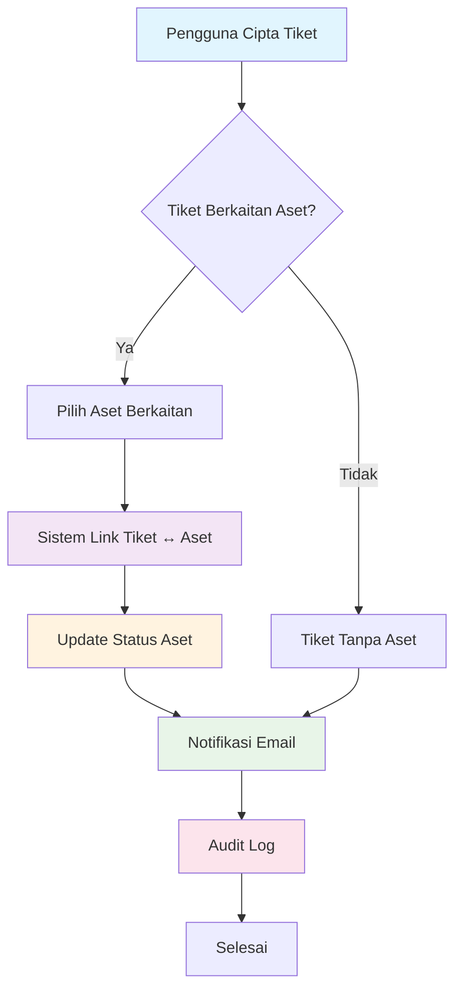
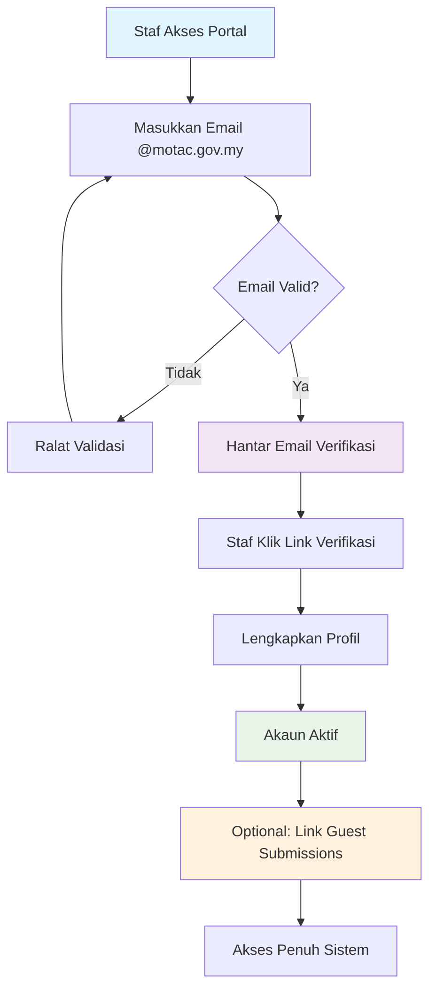
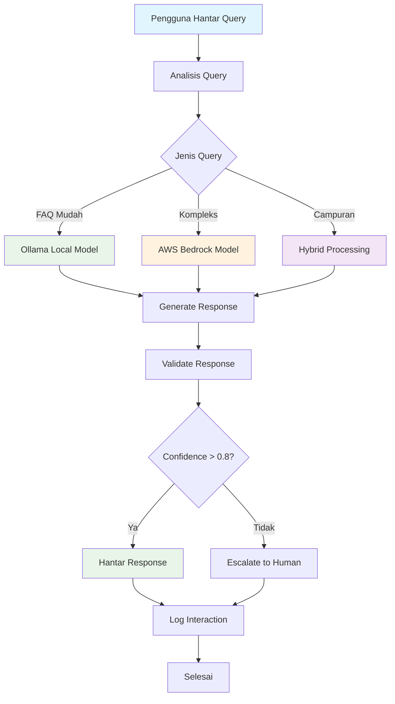
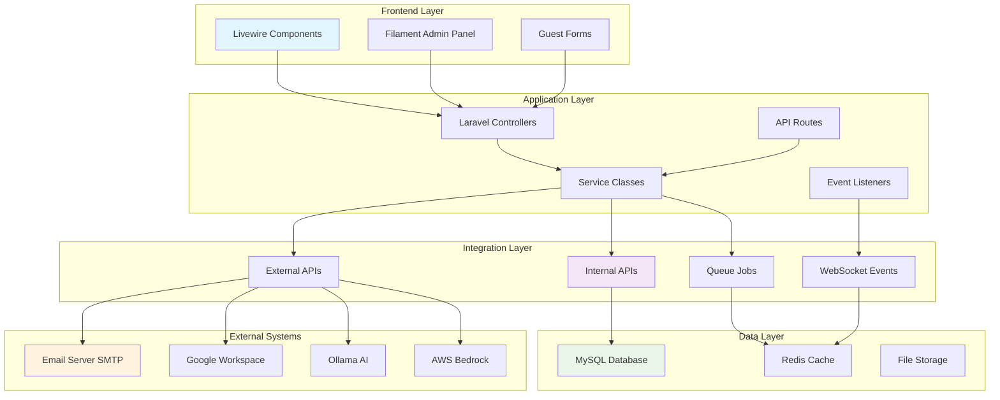

# D08 DOKUMEN SPESIFIKASI INTEGRASI DATA

**SISTEM ICTSERVE**

*(Sistem Pengurusan Helpdesk dan Pinjaman Aset ICT)*

| | |
| :--- | :--- |
| **NAMA AGENSI** | : Bahagian Pengurusan Maklumat (BPM) |
| **NAMA AGENSI INDUK** | : Kementerian Pelancongan, Seni dan Budaya Malaysia (MOTAC) |
| **TARIKH DOKUMEN** | : 23 Disember 2025 |
| **VERSI DOKUMEN** | : 3.7.0 |

---

## i. Keterangan Dokumen

Dokumen ini menyatakan spesifikasi integrasi data sistem ICTServe yang akan dirujuk semasa fasa pembangunan sistem. Ia bertujuan untuk menerangkan secara terperinci tujuan, skop, gambaran keseluruhan, analisis-analisis keperluan sistem, maklumat dan proses bagi perisian yang akan dibangunkan. Dokumen ini mematuhi piawaian ISO/IEC/IEEE 15288:2015 (Systems and software engineering — System life cycle processes), ISO/IEC/IEEE 15289:2019 (Systems and software engineering — Content of life-cycle information items), dan ISO/IEC TS 24748-6:2016 (Systems and software engineering — Life cycle management — Part 6: System integration).

## ii. Semakan dan Pengesahan Dokumen

**SEMAKAN DOKUMEN**

| Disemak Oleh | Jawatan | Tandatangan | Tarikh Semakan |
| :--- | :--- | :--- | :--- |
| Ketua Pembangun Sistem | Pegawai Teknologi Maklumat F41 | | 23 Disember 2025 |
| Penganalisis Sistem | Pegawai Teknologi Maklumat F29 | | 23 Disember 2025 |

**PENGESAHAN DOKUMEN**

| Disahkan Oleh | Jawatan | Tandatangan | Tarikh Semakan |
| :--- | :--- | :--- | :--- |
| Ketua BPM | Pegawai Teknologi Maklumat F54 | | 23 Disember 2025 |
| Pengarah ICT | Pegawai Teknologi Maklumat JUSA C | | 23 Disember 2025 |

## iii. Kawalan Dokumen

**KAWALAN DOKUMEN**

| No. Versi | Tarikh | Ringkasan Pindaan | Penyedia |
| :--- | :--- | :--- | :--- |
| 1.0.0 | September 2025 | Versi awal spesifikasi integrasi data sistem | Pasukan BPM |
| 2.0.0 | 17 Oktober 2025 | Penyeragaman mengikut D00-D18, SemVer, cross-reference | Pasukan BPM |
| 2.1.0 | 6 Januari 2025 | Kemaskini teknologi: Laravel Reverb 1.6.3, Laravel Echo 2.2.6 untuk real-time WebSocket | Pasukan BPM |
| 2.2.0 | 29 November 2025 | Kemaskini teknologi: Laravel 12.43.1, Filament 4.3.1, Livewire 3.7.3, Tailwind 4.1.18 | Pasukan BPM |
| 3.2.0 | 29 November 2025 | Hapus LDAP/SSO; klarifikasi Guest-First (staf guna guest forms tanpa authentication) | Pasukan BPM |
| 3.3.0 | 29 November 2025 | Penyelarasan penuh Guest-First: hapus semua rujukan LDAP/SSO/User Sync. Hanya admin/superuser authenticate | Pasukan BPM |
| 3.4.0 | 30 November 2025 | Hybrid Architecture v3.4.0: Restore LDAP/SSO integration sebagai optional authentication untuk staff | Pasukan BPM |
| 3.5.0 | 1 Disember 2025 | True Hybrid Architecture v3.5.0: Self-registration (@motac.gov.my), flexible login, optional guest-to-account linking, dual audit system, enhanced features | Pasukan BPM |
| 3.6.1 | 17 Disember 2025 | Kemaskini teknologi stack: Laravel 12.43.1, Livewire 3.7.3, Laravel Pulse 1.4.7, Laravel Reverb 1.6.3, Laravel Sanctum 4.2.1, Laravel Socialite 5.24.0, PHPUnit 11.5.46, Tailwind CSS 4.1.18, Laravel MCP 0.3.4, Laravel Prompts 0.3.8, Larastan 3.8.1, Laravel Pint 1.26.0, Laravel Telescope 5.16.0, Laravel Horizon 5.41.0 | Pasukan BPM |
| 3.7.0 | 15 Disember 2025 | AI Chatbot Integration: Tambah spesifikasi integrasi AI (Ollama API, AWS Bedrock API, model routing, RAG pipeline, streaming responses, MCP server) | Pasukan BPM |

## iv. Kandungan

1. [TUJUAN DOKUMEN](#1-tujuan-dokumen)
2. [KEPERLUAN INTEGRASI](#2-keperluan-integrasi)
3. [KAEDAH INTEGRASI DATA](#3-kaedah-integrasi-data)
4. [PEMETAAN DATA](#4-pemetaan-data)
5. [PROSES PERTUKARAN DATA](#5-proses-pertukaran-data)
6. [REKA BENTUK SENIBINA INTEGRASI](#6-reka-bentuk-senibina-integrasi)

## v. Senarai Gambarajah

| No. | Nama Gambarajah | Muka Surat |
| :--- | :--- | :--- |
| 6.1 | Senibina Integrasi Sistem ICTServe | 15 |
| 6.2 | Aliran Data Integrasi Modul | 16 |
| 6.3 | Integrasi API RESTful | 17 |
| 6.4 | Integrasi Sistem Luaran | 18 |
| 6.5 | Integrasi AI Chatbot (Cloud Hybrid) | 19 |
| 6.6 | Aliran Proses Integrasi Data | 20 |

## vi. Senarai Jadual

| No. | Nama Jadual | Muka Surat |
| :--- | :--- | :--- |
| 2.1 | Keperluan Integrasi Sistem | 8 |
| 3.1 | Spesifikasi Servis Integrasi | 9 |
| 3.2 | Data Struktur Integrasi | 10 |
| 4.1 | Pemetaan Data Sistem Sumber ke Sasaran | 11 |
| 6.1 | Teknologi Stack Integrasi | 14 |

## vii. Definisi dan Akronim

### a. Akronim

| Akronim | Keterangan |
| :--- | :--- |
| API | Application Programming Interface |
| BPM | Bahagian Pengurusan Maklumat |
| CRUD | Create, Read, Update, Delete |
| CSV | Comma-Separated Values |
| ETL | Extract, Transform, Load |
| HTTP | HyperText Transfer Protocol |
| HTTPS | HyperText Transfer Protocol Secure |
| ICT | Information and Communication Technology |
| JSON | JavaScript Object Notation |
| MOTAC | Kementerian Pelancongan, Seni dan Budaya Malaysia |
| MCP | Model Context Protocol |
| OAuth | Open Authorization |
| RAG | Retrieval-Augmented Generation |
| REST | Representational State Transfer |
| SMTP | Simple Mail Transfer Protocol |
| SSO | Single Sign-On |
| TLS | Transport Layer Security |
| UAT | User Acceptance Testing |
| UI | User Interface |
| UX | User Experience |
| WebSocket | Web Socket Protocol |

### b. Definisi

| Terma/Istilah | Definisi |
| :--- | :--- |
| **Integrasi Data** | Proses menggabungkan data dari sumber yang berbeza untuk memberikan pandangan yang bersatu kepada pengguna |
| **Spesifikasi Integrasi** | Dokumen yang mendefinisikan keperluan teknikal dan kriteria untuk integrasi sistem |
| **Interface Specification** | Definisi antara muka antara komponen sistem yang berbeza |
| **True Hybrid Architecture** | Seni bina sistem yang menggabungkan pendekatan guest-first dengan authentication pilihan untuk staf |
| **RESTful API** | Antara muka pengaturcaraan aplikasi yang mengikuti prinsip REST (Representational State Transfer) |
| **Token Authentication** | Kaedah pengesahan menggunakan token digital untuk akses API |
| **Data Mapping** | Proses memetakan medan data dari sistem sumber kepada sistem sasaran |
| **Audit Trail** | Rekod kronologi aktiviti sistem untuk tujuan audit dan kepatuhan |
| **Cloud Hybrid AI** | Seni bina AI yang menggabungkan pemprosesan tempatan (Ollama) dengan perkhidmatan awan (AWS Bedrock) |

## viii. Sumber Rujukan

1. ISO/IEC/IEEE 15288:2015 - Systems and software engineering — System life cycle processes
2. ISO/IEC/IEEE 15289:2019 - Systems and software engineering — Content of life-cycle information items (documentation)
3. ISO/IEC TS 24748-6:2016 - Systems and software engineering — Life cycle management — Part 6: System integration
4. D00_SYSTEM_OVERVIEW.md - Gambaran Keseluruhan Sistem ICTServe
5. D07_SYSTEM_INTEGRATION_PLAN.md - Pelan Integrasi Sistem
6. D11_TECHNICAL_DESIGN_DOCUMENTATION.md - Dokumentasi Rekabentuk Teknikal
7. D18_AI_CHATBOT_OLLAMA_BEDROCK.md - Integrasi AI Chatbot (Cloud Hybrid AI)
8. Laravel Framework Documentation v12.x
9. Filament Admin Panel Documentation v4.x
10. Livewire Documentation v3.x

---

## 1. TUJUAN DOKUMEN

Dokumen ini bertujuan untuk:

1. **Mendefinisikan spesifikasi teknikal integrasi** untuk Sistem Helpdesk & ICT Asset Loan BPM MOTAC (ICTServe)
2. **Menyediakan panduan implementasi** bagi pasukan pembangunan untuk melaksanakan integrasi data yang konsisten dan selamat
3. **Memastikan pematuhan standard** ISO/IEC/IEEE 15288, 15289, dan TS 24748-6 dalam proses integrasi sistem
4. **Menetapkan kriteria kualiti** untuk pengujian dan validasi integrasi data

**Kumpulan Sasaran Dokumen:**

- Pasukan Pembangunan Sistem BPM MOTAC
- Penganalisis Sistem dan Arkitek Perisian
- Pentadbir Sistem dan DevOps Engineer
- Pihak Berkepentingan Teknikal (Technical Stakeholders)

**Andaian, Batasan dan Kekangan:**

- Sistem beroperasi dalam persekitaran True Hybrid Architecture v3.5.0
- Integrasi menggunakan teknologi Laravel 12.x dan ekosistemnya
- Semua komunikasi data melalui protokol HTTPS/TLS untuk keselamatan
- Integrasi terhad kepada sistem dalaman MOTAC dan tidak melibatkan API awam

## 2. KEPERLUAN INTEGRASI

Sistem ICTServe memerlukan integrasi yang komprehensif antara modul dalaman dan sistem luaran untuk memastikan operasi yang lancar dan data yang konsisten.

| Bil | Rujukan Fungsi | Rujukan Aktiviti | Nama Sistem Sumber | Pemilik Maklumat | Keterangan Maklumat yang dihantar | Tujuan Penggunaan Maklumat |
| :--- | :--- | :--- | :--- | :--- | :--- | :--- |
| 1 | F01 - Pengurusan Tiket | A01 - Cipta Tiket Helpdesk | Modul Helpdesk | BPM MOTAC | Data tiket (subjek, penerangan, kategori, keutamaan) | Pengurusan aduan dan permintaan sokongan ICT |
| 2 | F02 - Pengurusan Aset | A02 - Pinjaman Aset ICT | Modul Asset Loan | BPM MOTAC | Data permohonan pinjaman (pemohon, aset, tempoh) | Pengurusan pinjaman peralatan ICT |
| 3 | F03 - Inventori Aset | A03 - Kemaskini Status Aset | Modul Inventory | BPM MOTAC | Status aset (tersedia, dipinjam, rosak, penyelenggaraan) | Pengesanan dan pengurusan aset ICT |
| 4 | F04 - Pengesahan Pengguna | A04 - Self-Registration Staf | Laravel Breeze | BPM MOTAC | Data pengguna (@motac.gov.my, profil, peranan) | Pengesahan identiti dan kawalan akses |
| 5 | F05 - Notifikasi Email | A05 - Hantar Notifikasi | Email Server MOTAC | BPM MOTAC | Template email, penerima, kandungan | Komunikasi automatik dengan pengguna |
| 6 | F06 - Audit Trail | A06 - Log Aktiviti | Laravel Auditing | BPM MOTAC | Rekod perubahan data, aktiviti pengguna | Kepatuhan audit dan keselamatan |
| 7 | F07 - Monitoring Prestasi | A07 - Pantau Sistem | Laravel Pulse | BPM MOTAC | Metrik prestasi, kesihatan server | Pemantauan dan optimisasi sistem |
| 8 | F08 - API Authentication | A08 - Token Management | Laravel Sanctum | BPM MOTAC | Token akses, skop kebenaran | Keselamatan API dan integrasi luaran |
| 9 | F09 - SSO Google (Pilihan) | A09 - OAuth Login | Google Workspace | Google/MOTAC | Profil pengguna @motac.gov.my | Kemudahan log masuk alternatif |
| 10 | F10 - AI Chatbot | A10 - Respons Automatik | Ollama + AWS Bedrock | BPM MOTAC | Query pengguna, konteks dokumen | Sokongan automatik dan FAQ |

## 3. KAEDAH INTEGRASI DATA

### 3.1. Integrasi Dalaman (Internal Integration)

**Servis Integrasi Modul Helpdesk ↔ Asset Loan:**

| Perkara | Perincian |
| :--- | :--- |
| **Nama Servis** | TicketAssetLinkingService |
| **Keterangan** | Menghubungkan tiket helpdesk dengan aset yang berkaitan untuk pengurusan penyelenggaraan |
| **Kaedah Integrasi** | Laravel Eloquent Relationships + API Internal |
| **URL Web Service** | `/api/v1/ticket-asset/link` |
| **Request** | `POST {"ticket_id": 1001, "asset_id": 2001, "relationship_type": "maintenance"}` |
| **Respond** | `{"success": true, "link_id": 3001, "created_at": "2025-12-23T10:30:00Z"}` |

**Data yang terlibat:**

| Nama | Jenis | Saiz | Nullable | Rules |
| :--- | :--- | :--- | :--- | :--- |
| ticket_id | integer | 11 | No | exists:helpdesk_tickets,id |
| asset_id | integer | 11 | No | exists:assets,id |
| relationship_type | string | 50 | No | in:maintenance,damage,replacement |
| notes | text | 65535 | Yes | max:1000 |
| created_by | integer | 11 | No | exists:users,id |

### 3.2. Integrasi Luaran (External Integration)

**Servis Integrasi Email SMTP:**

| Perkara | Perincian |
| :--- | :--- |
| **Nama Servis** | EmailNotificationService |
| **Keterangan** | Menghantar notifikasi email untuk status tiket dan permohonan pinjaman |
| **Kaedah Integrasi** | Laravel Mail + SMTP Protocol |
| **URL Web Service** | Internal Laravel Queue System |
| **Request** | `Mail::to($user)->send(new TicketStatusNotification($ticket))` |
| **Respond** | Queue Job Status + Email Delivery Confirmation |

**Data yang terlibat:**

| Nama | Jenis | Saiz | Nullable | Rules |
| :--- | :--- | :--- | :--- | :--- |
| recipient_email | string | 255 | No | email,required |
| subject | string | 255 | No | required,max:255 |
| template_name | string | 100 | No | required,exists:email_templates |
| template_data | json | 65535 | Yes | valid_json |
| priority | enum | - | No | in:low,normal,high |

### 3.3. Integrasi AI Chatbot (Cloud Hybrid)

**Servis Integrasi Ollama + AWS Bedrock:**

| Perkara | Perincian |
| :--- | :--- |
| **Nama Servis** | HybridAIChatbotService |
| **Keterangan** | Menyediakan respons automatik menggunakan model AI tempatan (Ollama) dan awan (AWS Bedrock) |
| **Kaedah Integrasi** | HTTP API + Model Context Protocol (MCP) |
| **URL Web Service** | `/api/v1/ollama/faq/query` |
| **Request** | `POST {"query": "Bagaimana cara memohon pinjaman laptop?", "context": "faq"}` |
| **Respond** | `{"response": "Untuk memohon pinjaman laptop...", "model_used": "ollama:llama3.2", "confidence": 0.95}` |

**Data yang terlibat:**

| Nama | Jenis | Saiz | Nullable | Rules |
| :--- | :--- | :--- | :--- | :--- |
| query | text | 2000 | No | required,max:2000 |
| context | string | 50 | Yes | in:faq,helpdesk,general |
| session_id | string | 100 | Yes | uuid |
| user_id | integer | 11 | Yes | exists:users,id |
| model_preference | string | 50 | Yes | in:ollama,bedrock,auto |

## 4. PEMETAAN DATA

### 4.1. Pemetaan Data Sistem Legacy ke ICTServe

| Sistem yang memohon (request) | | | | Data yang diterima | | | |
| :--- | :--- | :--- | :--- | :--- | :--- | :--- | :--- |
| **Nama Medan** | **Jenis** | **Saiz** | **Keterangan** | **Nama Medan** | **Jenis** | **Saiz** | **Keterangan** |
| asset_no | varchar | 20 | Nombor aset lama | tag_id | varchar | 50 | Tag ID aset baharu |
| staff_id | varchar | 10 | ID staf lama | staff_number | varchar | 20 | Nombor staf baharu |
| request_date | date | - | Tarikh permohonan | created_at | timestamp | - | Tarikh cipta dengan masa |
| status_code | char | 1 | Kod status (A/P/R) | status | enum | - | Status penuh (APPROVED/PENDING/REJECTED) |
| description | text | 255 | Penerangan ringkas | description | longtext | 65535 | Penerangan terperinci |

### 4.2. Pemetaan Data Integrasi Modul

| Modul Helpdesk | | | | Modul Asset Loan | | | |
| :--- | :--- | :--- | :--- | :--- | :--- | :--- | :--- |
| **Nama Medan** | **Jenis** | **Saiz** | **Keterangan** | **Nama Medan** | **Jenis** | **Saiz** | **Keterangan** |
| ticket_number | varchar | 20 | Nombor tiket unik | reference_number | varchar | 20 | Nombor rujukan pinjaman |
| category_id | integer | 11 | Kategori masalah | asset_category_id | integer | 11 | Kategori aset |
| priority | enum | - | Keutamaan tiket | urgency | enum | - | Keperluan segera |
| assigned_to | integer | 11 | Pegawai yang ditugaskan | approved_by | integer | 11 | Pegawai yang meluluskan |
| resolution | longtext | 65535 | Penyelesaian masalah | return_notes | longtext | 65535 | Nota pemulangan |

## 5. PROSES PERTUKARAN DATA

### 5.1. Aliran Proses Integrasi Tiket ↔ Aset

### 5.2. Aliran Proses Self-Registration Staf

### 5.3. Aliran Proses AI Chatbot (Cloud Hybrid)

**Peraturan Pertukaran Data:**

1. **Validasi Data**: Semua data mesti lulus validasi Laravel sebelum disimpan
2. **Transactional Integrity**: Operasi rentas modul menggunakan database transactions
3. **Rate Limiting**: API calls terhad kepada 100 requests/minute per token
4. **Error Handling**: Automatic retry untuk failed integrations dengan exponential backoff
5. **Audit Compliance**: Semua pertukaran data dilog untuk audit trail

## 6. REKA BENTUK SENIBINA INTEGRASI

### 6.1. Senibina Keseluruhan Sistem

### 6.2. Teknologi Stack Integrasi

| Komponen | Teknologi | Versi | Fungsi |
| :--- | :--- | :--- | :--- |
| **Framework Backend** | Laravel | 12.43.1 | Core application framework |
| **Admin Interface** | Filament | 4.3.1 | CRUD operations dan dashboard |
| **Reactive UI** | Livewire | 3.7.3 | Server-driven UI components |
| **Single-file Components** | Volt | 1.10.1 | Simplified Livewire components |
| **Real-time Communication** | Laravel Reverb | 1.6.3 | WebSocket server |
| **WebSocket Client** | Laravel Echo | 2.2.6 | Client-side WebSocket integration |
| **CSS Framework** | Tailwind CSS | 4.1.18 | Utility-first styling |
| **Database** | MySQL | 8.x | Primary data storage |
| **Cache & Queue** | Redis | 7.x | Caching dan job queue |
| **Testing Framework** | PHPUnit | 11.5.46 | Unit dan integration testing |
| **E2E Testing** | Playwright | 1.57.0 | Browser automation testing |
| **Static Analysis** | Larastan | 3.8.1 | PHP code analysis |
| **Code Formatting** | Laravel Pint | 1.26.0 | PSR-12 code style |
| **Permissions** | Spatie Permission | 6.23 | Role-based access control |
| **Audit (Compliance)** | Laravel Auditing | 14.x | Field-level audit trail |
| **Audit (Operations)** | Activity Log | 4.x | User activity logging |
| **Performance Monitoring** | Laravel Pulse | 1.4.7 | System performance metrics |
| **API Authentication** | Laravel Sanctum | 4.2.1 | Token-based API security |
| **OAuth Integration** | Laravel Socialite | 5.24.0 | Google Workspace SSO |
| **System Debugging** | Laravel Telescope | 5.16.0 | Application monitoring |
| **Queue Management** | Laravel Horizon | 5.41.0 | Redis queue monitoring |
| **AI Integration** | Laravel MCP | 0.3.4 | Model Context Protocol |
| **CLI Interactions** | Laravel Prompts | 0.3.8 | Interactive command prompts |

### 6.3. Infrastruktur Integrasi

**Persekitaran Pembangunan:**

- Docker containers untuk konsistensi persekitaran
- Laravel Sail untuk development environment
- Git version control dengan branching strategy
- Automated testing pipeline (PHPUnit + Playwright)

**Persekitaran Pengeluaran:**

- Load balancer untuk high availability
- Database replication untuk backup
- Redis cluster untuk scalability
- SSL/TLS certificates untuk keselamatan
- Monitoring dan alerting system

**Keperluan Rangkaian:**

- HTTPS/TLS 1.3 untuk semua komunikasi
- Firewall rules untuk restrict access
- VPN access untuk remote administration
- Bandwidth minimum 100 Mbps untuk optimal performance

**Keselamatan Integrasi:**

- API rate limiting (100 requests/minute)
- Token-based authentication (Laravel Sanctum)
- Data encryption at-rest dan in-transit
- Regular security audits dan penetration testing
- OWASP compliance untuk web application security

---

**TAMAT DOKUMEN / END OF DOCUMENT**

*Dokumen ini adalah hak milik Kementerian Pelancongan, Seni dan Budaya Malaysia (MOTAC) dan tertakluk kepada Akta Rahsia Rasmi 1972.*
