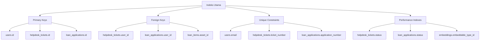
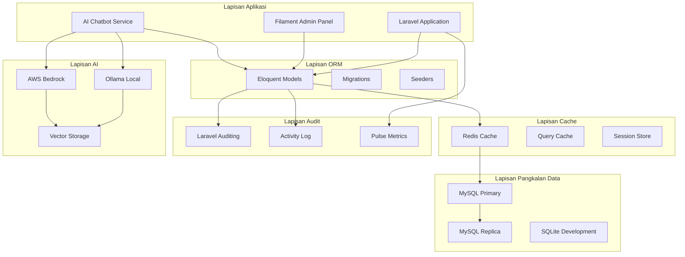
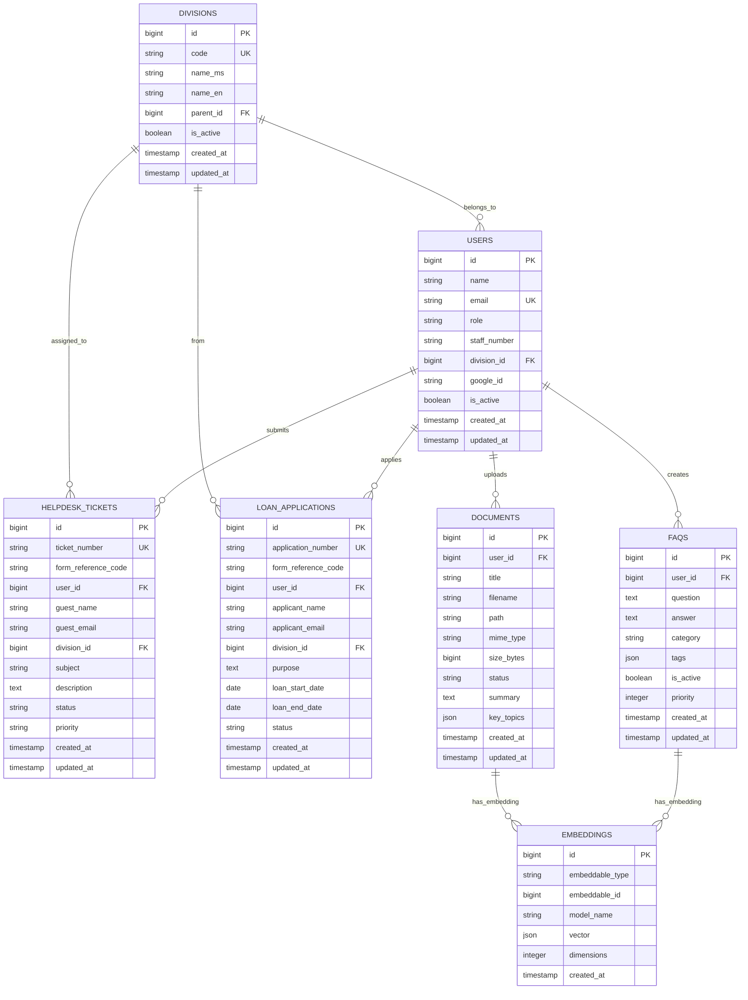

# D09 DOKUMENTASI PANGKALAN DATA

**SISTEM ICTSERVE**

*(Sistem Pengurusan Helpdesk dan Pinjaman Aset ICT)*

| | |
| :--- | :--- |
| **NAMA AGENSI** | : Bahagian Pengurusan Maklumat (BPM) |
| **NAMA AGENSI INDUK** | : Kementerian Pelancongan, Seni dan Budaya Malaysia (MOTAC) |
| **TARIKH DOKUMEN** | : 23 Disember
| **VERSI DOKUMEN** | : 3.6.1 |

---

## i. Keterangan Dokumen

Dokumen ini menyediakan dokumentasi komprehensif bagi struktur pangkalan data Sistem ICTServe yang dibangunkan mengikut piawaian ISO 8000 (Kualiti Data), IEEE 1016:2009 (Huraian Reka Bentuk Perisian), ISO/IEC 27701 (Pengurusan Privasi), dan garis panduan KRISA MAMPU. Dokumen ini merangkumi definisi jadual, hubungan data, piawaian kualiti, dan prosedur pengurusan pangkalan data untuk sistem dalaman MOTAC.

## ii. Semakan dan Pengesahan Dokumen

**SEMAKAN DOKUMEN**

| Disemak Oleh | Jawatan | Tandatangan | Tarikh Semakan |
| :--- | :--- | :--- | :--- |
| Ketua Pembangun Sistem | Pegawai Teknologi Maklumat F41 | [Tandatangan Digital] | 23 Disember 2025 |
| Penganalisis Sistem Senior | Pegawai Teknologi Maklumat F44 | [Tandatangan Digital] | 23 Disember 2025 |

**PENGESAHAN DOKUMEN**

| Disahkan Oleh | Jawatan | Tandatangan | Tarikh Semakan |
| :--- | :--- | :--- | :--- |
| Ketua Bahagian Pengurusan Maklumat | Pegawai Teknologi Maklumat F54 | [Tandatangan Digital] | 23 Disember 2025 |
| Pengarah Teknologi Maklumat | Pegawai Teknologi Maklumat JUSA C | [Tandatangan Digital] | 23 Disember 2025 |

## iii. Kawalan Dokumen

**KAWALAN DOKUMEN**

| No. Versi | Tarikh | Ringkasan Pindaan | Penyedia |
| :--- | :--- | :--- | :--- |
| 1.0.0 | 15 September 2025 | Versi awal dokumentasi pangkalan data | Pasukan Pembangunan BPM |
| 2.0.0 | 17 Oktober 2025 | Penyeragaman mengikut D00-D14, SemVer, cross-reference | Pasukan Pembangunan BPM |
| 3.2.0 | 29 November 2025 | Kemaskini teknologi: Laravel 12.43.1, Filament 4.3.1, MySQL 8.0 | Pasukan Pembangunan BPM |
| 3.5.0 | 1 Disember 2025 | True Hybrid Architecture: Tambah jadual Sanctum, Pulse, Google SSO | Pasukan Pembangunan BPM |
| 3.6.1 | 23 Disember 2025 | Cloud Hybrid AI Architecture: Integrasi D18 AI Chatbot, tambah jadual AI | Pasukan Pembangunan BPM |

## iv. Kandungan

1. [PENGENALAN](#1-pengenalan) ... 3
2. [RINGKASAN MAKLUMAT PANGKALAN DATA FIZIKAL](#2-ringkasan-maklumat-pangkalan-data-fizikal-yang-dibangunkan) ... 4
3. [SKRIP PANGKALAN DATA](#3-skrip-pangkalan-data) ... 15
4. [LAMPIRAN](#4-lampiran) ... 16

## v. Senarai Gambarajah

- Gambarajah 1: Seni Bina Pangkalan Data ICTServe ... 5
- Gambarajah 2: Hubungan Jadual Sistem Utama ... 8
- Gambarajah 3: Hubungan Jadual AI Hybrid ... 10
- Gambarajah 4: Aliran Data Audit Dwi-Sistem ... 12

## vi. Senarai Jadual

- Jadual 1: Teknologi Pangkalan Data ... 4
- Jadual 2: Senarai Jadual Utama ... 6
- Jadual 3: Definisi Medan Jadual Users ... 7
- Jadual 4: Piawaian Kualiti Data ... 13

## vii. Definisi dan Akronim

### a. Akronim

| Akronim | Keterangan |
| :--- | :--- |
| AI | Artificial Intelligence (Kecerdasan Buatan) |
| API | Application Programming Interface |
| BPM | Bahagian Pengurusan Maklumat |
| ERD | Entity Relationship Diagram |
| FK | Foreign Key (Kunci Asing) |
| KRISA | Kerangka Reka Bentuk dan Seni Bina Sistem Aplikasi |
| MAMPU | Unit Pemodenan Tadbiran dan Perancangan Pengurusan Malaysia |
| MOTAC | Kementerian Pelancongan, Seni dan Budaya Malaysia |
| ORM | Object-Relational Mapping |
| PDPA | Personal Data Protection Act |
| PK | Primary Key (Kunci Utama) |
| RAG | Retrieval-Augmented Generation |
| RDBMS | Relational Database Management System |
| SSO | Single Sign-On |

### b. Definisi

| Terma/Istilah | Definisi |
| :--- | :--- |
| Cloud Hybrid AI | Seni bina AI hibrid yang menggunakan model tempatan (Ollama) dan awan (AWS Bedrock) |
| Dual Audit System | Sistem audit dwi-lapisan menggunakan owen-it/laravel-auditing dan spatie/laravel-activitylog |
| Embedding Vector | Representasi vektor bagi teks untuk carian semantik |
| Guest Submission | Penyerahan borang oleh pengguna tanpa akaun berdaftar |
| Hybrid Architecture | Seni bina sistem yang menyokong pengguna berdaftar dan tetamu |
| Nullable FK | Foreign Key yang membenarkan nilai NULL untuk sokongan tetamu |
| Polymorphic Relationship | Hubungan pangkalan data yang membolehkan satu model berkaitan dengan pelbagai model lain |
| True Hybrid | Seni bina yang menyokong sepenuhnya operasi staf dan tetamu dalam satu sistem |

## viii. Sumber Rujukan

1. ISO 8000:2022 - Data Quality Management Systems
2. IEEE 1016:2009 - Standard for Information Technology - Systems Design - Software Design Descriptions
3. ISO/IEC 27701:2019 - Privacy Information Management Systems
4. ISO/IEC 38505-1:2017 - Information Technology Governance
5. Garis Panduan KRISA MAMPU v2.1.0
6. Manual Reka Bentuk Digital Kerajaan Malaysia (MDGDM)
7. Digital Document Standard Architecture (DDSA)
8. Laravel Framework Documentation v12.x
9. MySQL 8.0 Reference Manual
10. Personal Data Protection Act 2010 (PDPA)

---

## 1. PENGENALAN

Sistem ICTServe merupakan sistem pengurusan helpdesk dan pinjaman aset dalaman yang dibangunkan khusus untuk Kementerian Pelancongan, Seni dan Budaya Malaysia (MOTAC). Sistem ini menggunakan seni bina Cloud Hybrid AI yang menggabungkan teknologi tempatan dan awan untuk menyediakan perkhidmatan yang cekap dan selamat.

Dokumen ini menerangkan struktur pangkalan data fizikal yang menyokong operasi sistem, termasuk jadual utama, hubungan data, piawaian kualiti, dan prosedur pengurusan. Pangkalan data direka bentuk mengikut prinsip True Hybrid Architecture yang menyokong kedua-dua pengguna berdaftar (staf MOTAC) dan tetamu dalam satu sistem bersepadu.

Sistem ini dilengkapi dengan kemampuan AI hibrid melalui integrasi D18 AI Chatbot yang menggunakan model tempatan (Ollama) untuk operasi asas dan model awan (AWS Bedrock) untuk analisis kompleks, sambil mematuhi keperluan keselamatan dan privasi data kerajaan Malaysia.

## 2. RINGKASAN MAKLUMAT PANGKALAN DATA FIZIKAL YANG DIBANGUNKAN

### 2.1. Teknologi Pangkalan Data

| Komponen | Teknologi | Versi | Fungsi |
| :--- | :--- | :--- | :--- |
| RDBMS Produksi | MySQL | 8.0.x | Pangkalan data utama produksi |
| RDBMS Pembangunan | SQLite | 3.x | Pangkalan data pembangunan/ujian |
| ORM | Laravel Eloquent | 12.43.1 | Object-Relational Mapping |
| Migrasi Skema | Laravel Migrations | 12.43.1 | Kawalan versi skema |
| Caching | Redis | 7.x | Cache pertanyaan dan sesi |
| Audit Pematuhan | Laravel Auditing | 14.x | Jejak audit peringkat medan |
| Audit Operasi | Activity Log | 4.x | Log aktiviti pengguna |
| Pemantauan Prestasi | Laravel Pulse | 1.4.7 | Metrik prestasi dan kesihatan pelayan |
| Pengesahan API | Laravel Sanctum | 4.2.1 | Pengesahan token API |
| Kawalan Akses | Spatie Permission | 6.23 | Kawalan akses berasaskan peranan |
| AI Tempatan | Ollama Server | Terkini | LLM tempatan untuk FAQ Bot |
| AI Awan | AWS Bedrock | Terkini | Model Claude untuk analisis kompleks |
| Carian Vektor | MySQL JSON | 8.0.x | Penyimpanan embedding dan carian semantik |

### 2.2. Maklumat Pangkalan Data Fizikal

**a) Pangkalan data yang digunakan:**

- Produksi: MySQL 8.0.x dengan InnoDB storage engine
- Pembangunan: SQLite 3.x untuk kemudahan pembangunan
- Cache: Redis 7.x untuk cache aplikasi dan sesi

**b) Peruntukan ruang jadual:**

- Tablespace utama: `ictserve_main` (100GB awal, auto-extend)
- Tablespace audit: `ictserve_audit` (50GB awal, auto-extend)
- Tablespace AI: `ictserve_ai` (25GB awal, auto-extend)

**c) Nama pangkalan data:**

- Produksi: `ictserve_production`
- Pembangunan: `ictserve_development`
- Ujian: `ictserve_testing`

**d) Bilangan jadual dan view:**

- Jadual utama: 32 jadual
- View: 8 view untuk laporan
- Stored procedures: 12 prosedur

**e) Stored procedures:**

- `sp_generate_ticket_number()` - Jana nombor tiket unik
- `sp_generate_application_number()` - Jana nombor permohonan pinjaman
- `sp_cleanup_expired_tokens()` - Pembersihan token luput
- `sp_ai_conversation_cleanup()` - Pembersihan perbualan AI luput
- `sp_audit_data_retention()` - Pengurusan pengekalan data audit

**f) Maklumat jadual dan medan yang mengandungi INDEX:**



**g) Senarai pengguna yang mempunyai kawalan akses:**

| Pengguna | Peranan | Akses Jadual | Kebenaran |
| :--- | :--- | :--- | :--- |
| `ictserve_app` | Aplikasi | Semua jadual | SELECT, INSERT, UPDATE, DELETE |
| `ictserve_readonly` | Laporan | Semua jadual | SELECT sahaja |
| `ictserve_backup` | Sandaran | Semua jadual | SELECT, LOCK TABLES |
| `ictserve_admin` | Pentadbir | Semua jadual | Semua kebenaran |
| `ictserve_ai` | AI Service | Jadual AI | SELECT, INSERT, UPDATE |

### 2.3. Seni Bina Pangkalan Data



### 2.4. Senarai Jadual Utama

| Jadual | Fungsi | Jenis |
| :--- | :--- | :--- |
| users | Akaun pengguna staf dan pentadbir | Sistem |
| divisions | Rujukan bahagian/unit MOTAC | Rujukan |
| helpdesk_tickets | Rekod tiket helpdesk | Transaksi |
| helpdesk_comments | Komen pentadbir terhadap tiket | Transaksi |
| helpdesk_attachments | Fail lampiran tiket | Transaksi |
| loan_applications | Permohonan pinjaman aset | Transaksi |
| loan_items | Item aset dalam permohonan | Transaksi |
| loan_transactions | Pengeluaran dan pemulangan aset | Transaksi |
| loan_transaction_accessories | Aksesori check-out/check-in | Transaksi |
| loan_approvals | Rekod kelulusan e-mel | Transaksi |
| status_tokens | Token semakan status tetamu | Sistem |
| personal_access_tokens | Token API Sanctum | Sistem |
| audits | Jejak audit peringkat medan | Audit |
| activity_log | Log aktiviti pengguna | Audit |
| pulse_aggregates | Metrik prestasi agregat | Pemantauan |
| pulse_entries | Entri metrik prestasi | Pemantauan |
| pulse_values | Nilai metrik prestasi | Pemantauan |
| faqs | Pangkalan pengetahuan FAQ AI | AI |
| documents | Dokumen untuk analisis AI | AI |
| document_chunks | Chunks dokumen untuk RAG | AI |
| embeddings | Vector embeddings untuk carian semantik | AI |
| message_logs | Log interaksi AI dengan pengguna | AI |
| bedrock_conversations | Pengurusan perbualan AI | AI |
| auto_reply_templates | Template auto-reply AI | AI |
| auto_reply_drafts | Draf auto-reply yang dijana AI | AI |

## 3. SKRIP PANGKALAN DATA

### 3.1. Skrip Penciptaan Pangkalan Data

Skrip pangkalan data diuruskan melalui sistem migrasi Laravel yang menyediakan kawalan versi skema yang sistematik. Semua skrip disimpan dalam direktori `database/migrations/` dengan format penamaan yang standard.

### 3.2. Migrasi Utama

**Migrasi Sistem Asas:**

```sql
-- 2025_11_03_043832_create_divisions_table.php
-- 2025_11_03_043900_create_users_table.php
-- 2025_11_03_043924_create_helpdesk_tickets_table.php
-- 2025_11_03_043935_create_loan_applications_table.php
```

**Migrasi AI Hybrid (v3.6.1):**

```sql
-- 2025_12_15_100000_create_faqs_table.php
-- 2025_12_15_100001_create_documents_table.php
-- 2025_12_15_100002_create_document_chunks_table.php
-- 2025_12_15_100003_create_embeddings_table.php
-- 2025_12_15_100004_create_message_logs_table.php
-- 2025_12_15_100005_create_bedrock_conversations_table.php
-- 2025_12_15_100006_create_auto_reply_templates_table.php
-- 2025_12_15_100007_create_auto_reply_drafts_table.php
```

### 3.3. Skrip Indeks dan Optimisasi

```sql
-- Indeks prestasi untuk carian
CREATE INDEX idx_helpdesk_status_priority ON helpdesk_tickets(status, priority);
CREATE INDEX idx_loan_status_date ON loan_applications(status, created_at);
CREATE INDEX idx_embeddings_search ON embeddings(embeddable_type, embeddable_id);

-- Indeks untuk AI semantic search
CREATE INDEX idx_faqs_category_active ON faqs(category, is_active);
CREATE INDEX idx_documents_status_date ON documents(status, created_at);
CREATE INDEX idx_message_logs_conversation ON message_logs(conversation_id, created_at);
```

### 3.4. Skrip Stored Procedures

```sql
-- Prosedur jana nombor tiket
DELIMITER //
CREATE PROCEDURE sp_generate_ticket_number()
BEGIN
    DECLARE next_number INT;
    DECLARE ticket_number VARCHAR(20);
    
    SELECT COALESCE(MAX(CAST(SUBSTRING(ticket_number, 9) AS UNSIGNED)), 0) + 1
    INTO next_number
    FROM helpdesk_tickets
    WHERE ticket_number LIKE CONCAT('HD', YEAR(NOW()), LPAD(MONTH(NOW()), 2, '0'), '%');
    
    SET ticket_number = CONCAT('HD', YEAR(NOW()), LPAD(MONTH(NOW()), 2, '0'), LPAD(next_number, 4, '0'));
    
    SELECT ticket_number;
END //
DELIMITER ;
```

## 4. LAMPIRAN

### A. Rajah Hubungan Entiti (ERD)



### B. Piawaian Kualiti Data

| Aspek | Piawaian | Implementasi |
| :--- | :--- | :--- |
| Ketepatan | 99.9% | Validasi input, constraint database |
| Kelengkapan | 95% medan wajib | Validation rules, required fields |
| Konsistensi | Format seragam | Enum values, standardized formats |
| Kesahihan | Data valid | Foreign key constraints, check constraints |
| Keunikan | Tiada duplikasi | Unique indexes, business logic validation |
| Keterkinian | Data terkini | Timestamp tracking, automated updates |

### C. Prosedur Sandaran dan Pemulihan

**Jadual Sandaran Harian:**

- 00:00 - Sandaran penuh pangkalan data
- 06:00, 12:00, 18:00 - Sandaran incremental
- Pengekalan: 30 hari untuk sandaran harian, 12 bulan untuk sandaran bulanan

**Prosedur Pemulihan:**

1. Hentikan perkhidmatan aplikasi
2. Pulihkan pangkalan data dari sandaran terkini
3. Jalankan skrip migrasi jika perlu
4. Sahkan integriti data
5. Mulakan semula perkhidmatan

### D. Senarai Rujukan Dokumen Berkaitan

- D00_SYSTEM_OVERVIEW.md - Gambaran keseluruhan sistem
- D08_SYSTEM_INTEGRATION_SPECIFICATION.md - Spesifikasi integrasi sistem
- D18_AI_CHATBOT_OLLAMA_BEDROCK.md - Dokumentasi AI Chatbot
- GLOSSARY.md - Glosari istilah sistem

---

**TAMAT DOKUMEN / END OF DOCUMENT**

*Dokumen ini adalah hak milik Kementerian Pelancongan, Seni dan Budaya Malaysia (MOTAC) dan tertakluk kepada Akta Rahsia Rasmi 1972.*
