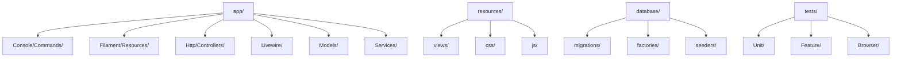

# D10 DOKUMENTASI KOD SUMBER

**SISTEM ICTSERVE**

*(Sistem Pengurusan Helpdesk dan Pinjaman Aset ICT)*

| | |
| :--- | :--- |
| **NAMA AGENSI** | : Bahagian Pengurusan Maklumat (BPM) |
| **NAMA AGENSI INDUK** | : Kementerian Pelancongan, Seni dan Budaya Malaysia (MOTAC) |
| **TARIKH DOKUMEN** | : 23 Disember 2025 |
| **VERSI DOKUMEN** | : 4.0.0 |

---

## i. Keterangan Dokumen

Dokumen ini menyatakan piawaian dan panduan kod pengaturcaraan yang digunakan bagi membangunkan Sistem ICTServe. Piawaian ini akan dirujuk semasa fasa pembangunan dan merupakan garis panduan terperinci berkenaan kod pengaturcaraan yang perlu dipatuhi oleh semua pengaturcara semasa membangunkan sistem. Dokumen ini disediakan mengikut piawaian ISO/IEC/IEEE 5055 (Kualiti Perisian), ISO/IEC/IEEE 25000 Series (SQuaRE), dan PSR-12 (PHP Standards Recommendation).

## ii. Semakan dan Pengesahan Dokumen

**SEMAKAN DOKUMEN**

| Disemak Oleh | Jawatan | Tandatangan | Tarikh Semakan |
| :--- | :--- | :--- | :--- |
| Ketua Pembangun Sistem | Pegawai Teknologi Maklumat F41 | [Tandatangan Digital] | 23 Disember 2025 |
| Penganalisis Sistem Senior | Pegawai Teknologi Maklumat F44 | [Tandatangan Digital] | 23 Disember 2025 |

**PENGESAHAN DOKUMEN**

| Disahkan Oleh | Jawatan | Tandatangan | Tarikh Semakan |
| :--- | :--- | :--- | :--- |
| Ketua Bahagian Pengurusan Maklumat | Pegawai Teknologi Maklumat F54 | [Tandatangan Digital] | 23 Disember 2025 |
| Pengarah Teknologi Maklumat | Pegawai Teknologi Maklumat JUSA C | [Tandatangan Digital] | 23 Disember 2025 |

## iii. Kawalan Dokumen

**KAWALAN DOKUMEN**

| No. Versi | Tarikh | Ringkasan Pindaan | Penyedia |
| :--- | :--- | :--- | :--- |
| 1.0.0 | 15 September 2025 | Versi awal dokumentasi kod sumber | Pasukan Pembangunan BPM |
| 2.0.0 | 17 Oktober 2025 | Penyeragaman mengikut D00-D14, SemVer, cross-reference | Pasukan Pembangunan BPM |
| 3.0.0 | 29 November 2025 | Kemaskini struktur kod Laravel 12, Filament 4, Livewire 3 | Pasukan Pembangunan BPM |
| 3.5.0 | 1 Disember 2025 | Seni Bina SSO dengan Pengesahan Mandatori: Laravel Pulse, Sanctum API, LDAP/AD SSO | Pasukan Pembangunan BPM |
| 4.0.0 | 24 Disember 2025 | **Pematuhan PKS 5.2.1, 9.2.1, 4.2 & PSPM**: Penghapusan akses tetamu, pengesahan SSO mandatori, rujukan D09 CRUD indicators, coding standards untuk PKS compliance. Rujukan PKS Seksyen 5.2.1 (Prinsip Akauntabiliti - halaman 150), 9.2.1 (Prosedur pemindahan data - halaman 588-603), 4.2 (Kedaulatan data - halaman 1147-1148), 5.4.3 (Polisi kata laluan - halaman 596-605). PSPM MyGovCloud prioritization. Enhanced documentation standards. | Pasukan Pembangunan BPM |

## iv. Kandungan

1. [TUJUAN DOKUMEN](#1-tujuan-dokumen) ... 3
2. [SKOP DOKUMEN](#2-skop-dokumen) ... 4
3. [PIAWAIAN KOD SUMBER](#3-piawaian-kod-sumber) ... 5
4. [LAMPIRAN](#4-lampiran) ... 18

## v. Senarai Gambarajah

- Gambarajah 1: Struktur Direktori Aplikasi ... 6
- Gambarajah 2: Seni Bina Lapisan Kod ... 8
- Gambarajah 3: Aliran Kawalan Kualiti ... 15

## vi. Senarai Jadual

- Jadual 1: Teknologi Teras Sistem ... 4
- Jadual 2: Struktur Direktori Utama ... 5
- Jadual 3: Piawaian Penulisan PHP ... 9
- Jadual 4: Metrik Kualiti Kod ... 16

## vii. Definisi dan Akronim

### a. Akronim

| Akronim | Keterangan |
| :--- | :--- |
| AI | Artificial Intelligence (Kecerdasan Buatan) |
| API | Application Programming Interface |
| BPM | Bahagian Pengurusan Maklumat |
| CI/CD | Continuous Integration/Continuous Deployment |
| CRUD | Create, Read, Update, Delete - Penunjuk operasi data mengikut format KRISA D09 |
| MVC | Model-View-Controller |
| ORM | Object-Relational Mapping |
| PSR | PHP Standards Recommendation |
| RBAC | Role-Based Access Control |
| SQuaRE | Systems and Software Quality Requirements and Evaluation |
| SSO | Single Sign-On |
| TDD | Test-Driven Development |

### b. Definisi

| Terma/Istilah | Definisi |
| :--- | :--- |
| Cloud Hybrid AI | Seni bina AI hibrid yang menggunakan model tempatan (Ollama) dan awan (AWS Bedrock) |
| Constructor Property Promotion | Ciri PHP 8.0+ yang membolehkan parameter constructor ditulis sebagai property |
| Eloquent ORM | Object-Relational Mapping Laravel untuk interaksi pangkalan data |
| Livewire Component | Komponen UI Laravel yang membolehkan interaktiviti tanpa JavaScript |
| Service Layer | Lapisan perniagaan yang mengandungi logik aplikasi |
| Strict Typing | Penggunaan declare(strict_types=1) untuk pengesahan jenis data ketat |
| Seni Bina SSO Mandatori | Seni bina sistem dengan pengesahan SSO mandatori melalui LDAP/Active Directory untuk semua pengguna mengikut PKS 5.2.1 |
| Walk-in/Kiosk Mode | Mod akses pantas untuk staf menggunakan pengesahan SSO automatik di terminal kiosk |
| Volt Component | Komponen Livewire satu-fail yang menggabungkan PHP dan Blade |

## viii. Sumber Rujukan

### Piawaian Antarabangsa

1. ISO/IEC/IEEE 5055:2021 - Standard for Information Technology - Software Measurement - Software Quality
2. ISO/IEC 25000:2014 - Systems and Software Engineering - Systems and Software Quality Requirements and Evaluation (SQuaRE)
3. ISO/IEC/IEEE 12207:2017 - Systems and Software Engineering - Software Life Cycle Processes
4. PSR-12: Extended Coding Style Guide

### Polisi Keselamatan Siber MOTAC (PKS)

1. PKS Seksyen 5.2.1 - Prinsip Akauntabiliti dan Bukan Penolakan (Accountability & Non-repudiation)
2. PKS Seksyen 9.2.1 - Prosedur Pemindahan Data dan Perlindungan Kerahsiaan
3. PKS Seksyen 4.2 - Kedaulatan Data dan Keperluan Bidang Kuasa
4. PKS Seksyen 5.4.3 - Polisi Kata Laluan (8 aksara, tamat tempoh 90 hari, 3 percubaan)

### Pelan Strategik Pendigitalan MOTAC (PSPM)

1. PSPM - Keutamaan MyGovCloud berbanding perkhidmatan awan awam
2. PSPM - Objektif Pendigitalan Strategik dan Keperluan Pematuhan

### Polisi Keselamatan Siber MOTAC (PKS)

1. PKS Seksyen 5.2.1 - Prinsip Akauntabiliti dan Bukan Penolakan (Accountability & Non-repudiation)
2. PKS Seksyen 9.2.1 - Prosedur Pemindahan Data dan Perlindungan Kerahsiaan
3. PKS Seksyen 4.2 - Kedaulatan Data dan Keperluan Bidang Kuasa
4. PKS Seksyen 5.4.3 - Polisi Kata Laluan (8 aksara, tamat tempoh 90 hari, 3 percubaan)

### Pelan Strategik Pendigitalan MOTAC (PSPM)

1. PSPM - Keutamaan MyGovCloud berbanding perkhidmatan awan awam
2. PSPM - Objektif Pendigitalan Strategik dan Keperluan Pematuhan

### Dokumentasi Teknikal

1. Laravel Framework Documentation v12.x
2. PHP 8.2 Documentation
3. Filament v4 Documentation
4. Livewire v3 Documentation
5. Tailwind CSS v4 Documentation
6. PHPUnit Documentation
7. **D09 Dokumentasi Pangkalan Data** - Rujukan CRUD indicators dan struktur data mengikut format KRISA

---

## 1. TUJUAN DOKUMEN

Dokumen ini bertujuan untuk:

1. **Menyediakan panduan penulisan kod** yang konsisten untuk semua pembangun sistem ICTServe
2. **Memastikan kualiti kod** mengikut piawaian antarabangsa ISO/IEC/IEEE 5055 dan PSR-12
3. **Memudahkan penyelenggaraan** dan pengembangan sistem pada masa hadapan
4. **Menjamin keselamatan** dan prestasi kod melalui amalan terbaik
5. **Menyokong Seni Bina SSO Mandatori** dengan piawaian kod yang seragam mengikut PKS 5.2.1
6. **Memastikan akauntabiliti penuh** dengan semua aktiviti sistem dikaitkan dengan ID staf yang disahkan

**Pematuhan Seni Bina (PKS 5.2.1):**

Sistem ICTServe menggunakan Seni Bina SSO Mandatori yang memastikan:

- Semua pengguna disahkan melalui LDAP/Active Directory sebelum mengakses sistem
- Tiada akses tanpa authentication dibenarkan mengikut PKS 5.2.1
- Semua aktiviti sistem dikaitkan dengan ID staf yang disahkan untuk audit trail
- Sistem dihoskan sepenuhnya di Pusat Data MOTAC (Intranet sahaja)

Kumpulan sasar dokumen ini ialah:

- Pembangun sistem (PHP/Laravel developers)
- Penganalisis sistem
- Ketua projek pembangunan
- Pegawai jaminan kualiti

## 2. SKOP DOKUMEN

Skop penyediaan kod sumber merangkumi:

**i. Nama sistem yang terlibat:**

- Sistem ICTServe (Helpdesk dan Pinjaman Aset Dalaman MOTAC)

**ii. Nama modul yang terlibat:**

- Modul Helpdesk (Pengurusan tiket aduan)
- Modul Pinjaman Aset (Permohonan dan kelulusan pinjaman)
- Modul AI Chatbot (FAQ Bot dan analisis dokumen)
- Modul Pengurusan Pengguna (Autentikasi dan kebenaran)
- Modul Laporan dan Analitik

**iii. Nama pasukan pembangunan sistem:**

- Pasukan Pembangunan BPM MOTAC
- Ketua Pembangun: Pegawai Teknologi Maklumat F41
- Pembangun Senior: Pegawai Teknologi Maklumat F44
- Penganalisis Sistem: Pegawai Teknologi Maklumat F41

## 3. PIAWAIAN KOD SUMBER

### 3.1. Teknologi Teras

| Komponen | Versi | Fungsi |
| :--- | :--- | :--- |
| PHP | 8.2.12 | Bahasa pengaturcaraan utama |
| Laravel | 12.43.1 | Framework aplikasi web |
| Filament | 4.3.1 | Admin panel framework |
| Livewire | 3.7.3 | Server-driven UI components |
| Tailwind CSS | 4.1.18 | Utility-first CSS framework |
| MySQL | 8.0.x | Pangkalan data produksi |
| PHPUnit | 11.5.46 | Framework ujian |
| Laravel Pint | 1.26.0 | Code formatting (PSR-12) |

### 3.2. Struktur Direktori



### i. File Name (Penamaan Fail)

**Konvensyen Penamaan:**

```php
// Model files - PascalCase
HelpdeskTicket.php
LoanApplication.php
User.php

// Controller files - PascalCase + Controller suffix
HelpdeskTicketController.php
LoanApplicationController.php

// Livewire components - PascalCase
CreateTicket.php
SubmitLoanApplication.php

// Service files - PascalCase + Service suffix
EmailNotificationService.php
SLAManagementService.php

// Migration files - snake_case with timestamp
2025_11_03_043924_create_helpdesk_tickets_table.php
2025_11_03_043935_create_loan_applications_table.php
```

### ii. Class Headers and Declaration (Pengisytiharan Kelas)

**Template Pengisytiharan Kelas:**

```php
<?php

declare(strict_types=1);

namespace App\Models;

use Illuminate\Database\Eloquent\Model;
use Illuminate\Database\Eloquent\Relations\BelongsTo;
use Illuminate\Database\Eloquent\Relations\HasMany;
use Illuminate\Database\Eloquent\SoftDeletes;
use OwenIt\Auditing\Contracts\Auditable;
use OwenIt\Auditing\Auditable as AuditableTrait;

/**
 * HelpdeskTicket Model - Enhanced with SSO Mandatory Architecture Support
 *
 * Semua penyerahan tiket mesti dikaitkan dengan pengguna yang disahkan melalui SSO.
 * Tiada akses tanpa authentication dibenarkan mengikut PKS 5.2.1 (Prinsip Akauntabiliti).
 * Berintegrasi dengan sistem pinjaman aset untuk fungsi merentas modul.
 *
 * @see D03 Software Requirements Specification - Requirement 1, 2
 * @see D04 Software Design Document - SSO Mandatory Architecture
 * @see D09 Database Documentation - helpdesk_tickets table dengan CRUD indicators (C,R,U,D)
 * @see PKS 5.2.1 - Prinsip Akauntabiliti dan Bukan Penolakan
 *
 * @property int $id
 * @property string $ticket_number
 * @property int $user_id Mandatori - dikaitkan dengan staf yang disahkan
 * @property string $status
 * @property string $priority
 */
class HelpdeskTicket extends Model implements Auditable
{
    use AuditableTrait, SoftDeletes;
    
    // Implementation here
}
```

### iii. Method Headers and Declaration (Pengisytiharan Kaedah)

**Template Pengisytiharan Kaedah:**

```php
/**
 * Hantar notifikasi e-mel kepada pentadbir apabila tiket baharu dicipta.
 *
 * Kaedah ini akan menghantar e-mel notifikasi kepada semua pentadbir
 * yang bertanggungjawab berdasarkan kategori tiket dan bahagian.
 *
 * @param HelpdeskTicket $ticket Tiket yang baharu dicipta
 * @param array $additionalData Data tambahan untuk template e-mel
 * @return bool Status berjaya hantar e-mel
 * 
 * @throws \Exception Jika gagal hantar e-mel
 * 
 * @see D03 SRS-EMAIL-001 Email Notification Requirements
 */
public function sendTicketCreatedNotification(
    HelpdeskTicket $ticket, 
    array $additionalData = []
): bool {
    // Implementation here
}
```

### iv. Indentation (Lekukan)

**Piawaian Lekukan:**

- Gunakan **4 spaces** sebagai unit lekukan
- Jangan gunakan tab characters
- Konsisten dalam semua fail

```php
// Betul
if ($condition) {
    foreach ($items as $item) {
        if ($item->isValid()) {
            $item->process();
        }
    }
}

// Salah - menggunakan 2 spaces
if ($condition) {
  foreach ($items as $item) {
    if ($item->isValid()) {
      $item->process();
    }
  }
}
```

### v. Inline Comments (Komen Sebaris)

**Piawaian Komen:**

- Komen sebaris hendaklah membentuk 20% daripada jumlah baris kod
- Gunakan bahasa yang jelas dan ringkas
- Terangkan 'mengapa' bukan 'apa'

```php
// Betul - menerangkan sebab
// Gunakan cache untuk mengelakkan query database yang berulang
$cachedResult = Cache::remember($cacheKey, 3600, function () {
    return $this->expensiveQuery();
});

// Salah - menerangkan perkara yang jelas
// Tetapkan pembolehubah kepada nilai
$result = $this->getValue();
```

### vi. Variable Names (Nama Pembolehubah)

**Konvensyen Penamaan Pembolehubah:**

- Gunakan camelCase untuk pembolehubah
- Nama hendaklah bermakna dan jelas
- Elakkan singkatan yang tidak jelas

```php
// Betul
$helpdeskTicket = new HelpdeskTicket();
$userEmailAddress = $user->email;
$isTicketResolved = $ticket->status === 'resolved';

// Salah
$ht = new HelpdeskTicket();
$addr = $user->email;
$flag = $ticket->status === 'resolved';
```

### vii. Use of Braces (Penggunaan Kurungan Kerinting)

**Gaya Kurungan (PSR-12):**

```php
// Betul - PSR-12 style
if ($condition) {
    $this->doSomething();
} elseif ($anotherCondition) {
    $this->doSomethingElse();
} else {
    $this->doDefault();
}

// Betul - untuk method
public function processTicket(HelpdeskTicket $ticket): bool
{
    if ($ticket->isValid()) {
        return $this->handleValidTicket($ticket);
    }
    
    return false;
}
```

### viii. Line Length (Panjang Baris)

**Piawaian Panjang Baris:**

- Had maksimum: **120 karakter** per baris
- Had yang disyorkan: **80 karakter** per baris
- Pecahkan baris panjang dengan cara yang logik

```php
// Betul - baris dipecahkan dengan logik
$notification = new TicketCreatedNotification(
    $ticket,
    $assignedAdmin,
    $additionalData
);

// Salah - baris terlalu panjang
$notification = new TicketCreatedNotification($ticket, $assignedAdmin, $additionalData, $extraParameters, $moreData);
```

### ix. Spacing (Jarak)

**Piawaian Jarak:**

```php
// Betul - jarak yang sesuai
$total = $price + ($price * $taxRate);
$result = $this->processData($input, $options, $callback);

// Array formatting
$config = [
    'database' => 'mysql',
    'host' => 'localhost',
    'port' => 3306,
];

// Salah - tiada jarak yang sesuai
$total=$price+($price*$taxRate);
$result=$this->processData($input,$options,$callback);
```

### x. Wrapping Lines (Pemecahan Baris)

**Kaedah Pemecahan Baris:**

```php
// Betul - pecah selepas koma
$this->sendNotification(
    $recipient,
    $subject,
    $message,
    $attachments
);

// Betul - pecah selepas operator
$longCondition = $firstCondition 
    && $secondCondition 
    && $thirdCondition;

// Method chaining
$query = HelpdeskTicket::query()
    ->where('status', 'open')
    ->where('priority', 'high')
    ->orderBy('created_at', 'desc')
    ->limit(10);
```

### xi. Program Statement (Penyata Program)

**Piawaian Penyata:**

- Satu penyata per baris
- Elakkan nested statements yang kompleks

```php
// Betul - satu penyata per baris
$ticketCount = HelpdeskTicket::count();
$openTickets = HelpdeskTicket::where('status', 'open')->get();
$resolvedToday = HelpdeskTicket::whereDate('resolved_at', today())->count();

// Salah - berbilang penyata dalam satu baris
$ticketCount = HelpdeskTicket::count(); $openTickets = HelpdeskTicket::where('status', 'open')->get();
```

### 3.3. Piawaian Khusus Laravel

**Strict Typing:**

```php
<?php

declare(strict_types=1);

namespace App\Models;
```

**Constructor Property Promotion:**

```php
public function __construct(
    public readonly EmailNotificationService $emailService,
    public readonly SLAManagementService $slaService,
) {}
```

**Type Declarations:**

```php
protected function isAccessible(User $user, ?string $path = null): bool
{
    return $user->hasPermission($path);
}
```

**Eloquent Relationships:**

```php
/** @return BelongsTo<User, HelpdeskTicket> */
public function user(): BelongsTo
{
    return $this->belongsTo(User::class);
}

/** @return HasMany<HelpdeskComment> */
public function comments(): HasMany
{
    return $this->hasMany(HelpdeskComment::class);
}
```

### 3.4. Piawaian Livewire Components

**Class-based Component:**

```php
<?php

declare(strict_types=1);

namespace App\Livewire;

use Livewire\Component;
use Livewire\Attributes\Layout;
use Livewire\Attributes\Title;

#[Layout('layouts.app')]
#[Title('Dashboard')]
class Dashboard extends Component
{
    public function render()
    {
        return view('livewire.dashboard');
    }
}
```

**Volt Single-File Component:**

```php
<?php

use function Livewire\Volt\{state, computed, mount};

state(['count' => 0]);

$increment = fn () => $this->count++;

$doubleCount = computed(fn () => $this->count * 2);

?>

<div>
    <h1>Kiraan: {{ $count }}</h1>
    <p>Dua kali ganda: {{ $this->doubleCount }}</p>
    <button wire:click="increment">Tambah</button>
</div>
```

### 3.5. Piawaian AI Services (v3.6.1)

**Pematuhan Kedaulatan Data (PKS 9.2.1 & PKS 4.2):**

Perkhidmatan AI dalam sistem ICTServe mematuhi keperluan kedaulatan data berikut:

- **Pemprosesan Tempatan Diutamakan**: Data sensitif diproses menggunakan Ollama (tempatan) mengikut keutamaan PSPM MyGovCloud
- **Penapisan Data (DLP)**: Data Loss Prevention filters digunakan untuk menyaring data sensitif sebelum dihantar ke awan
- **Klasifikasi Data**: Hanya data yang diklasifikasikan sebagai "Awam" dihantar ke AWS Bedrock
- **Secure API Gateway**: Semua komunikasi dengan perkhidmatan awan melalui API Gateway yang selamat

**Service Interface:**

```php
<?php

declare(strict_types=1);

namespace App\Contracts;

/**
 * Interface untuk perkhidmatan AI Ollama.
 * 
 * Pemprosesan AI tempatan diutamakan untuk data sensitif mengikut
 * PKS 9.2.1 dan keutamaan PSPM MyGovCloud.
 *
 * @see D18 AI Chatbot Documentation
 * @see PKS 9.2.1 - Prosedur Pemindahan Data
 * @see PSPM - Keutamaan MyGovCloud
 */
interface OllamaClientContract
{
    /**
     * Jana respons daripada model AI tempatan.
     * Digunakan untuk data sensitif yang tidak boleh dihantar ke awan.
     *
     * @param array $payload Data input untuk model
     * @return array Respons daripada model
     * @throws \Exception Jika gagal berkomunikasi dengan Ollama
     */
    public function generate(array $payload): array;
    
    /**
     * Jana embedding vektor untuk teks.
     * Pemprosesan tempatan untuk memastikan kedaulatan data.
     *
     * @param string $text Teks untuk dijadikan embedding
     * @return array Vector embedding
     */
    public function embeddings(string $text): array;
}
```

### 3.6. Kawalan Kualiti

**Static Analysis dengan Larastan:**

```bash
# Jalankan analisis statik
./vendor/bin/phpstan analyse

# Dengan tahap ketat
./vendor/bin/phpstan analyse --level=8
```

**Code Formatting dengan Laravel Pint:**

```bash
# Format kod mengikut PSR-12
./vendor/bin/pint

# Semak format tanpa ubah
./vendor/bin/pint --test
```

**Unit Testing dengan PHPUnit:**

```php
<?php

declare(strict_types=1);

namespace Tests\Feature;

use App\Models\HelpdeskTicket;
use App\Models\User;
use Illuminate\Foundation\Testing\RefreshDatabase;
use Tests\TestCase;

class HelpdeskTicketTest extends TestCase
{
    use RefreshDatabase;

    /**
     * Ujian cipta tiket baharu oleh pengguna yang disahkan.
     */
    public function test_authenticated_user_can_create_ticket(): void
    {
        $user = User::factory()->create();
        
        $response = $this->actingAs($user)->post('/helpdesk/tickets', [
            'subject' => 'Masalah komputer',
            'description' => 'Komputer tidak boleh hidup',
            'category_id' => 1,
            'priority' => 'normal',
        ]);
        
        $response->assertRedirect();
        $this->assertDatabaseHas('helpdesk_tickets', [
            'subject' => 'Masalah komputer',
            'user_id' => $user->id,
        ]);
    }
}
```

## 4. LAMPIRAN

### A. Contoh Struktur Fail Model

```php
<?php

declare(strict_types=1);

namespace App\Models;

use Illuminate\Database\Eloquent\Factories\HasFactory;
use Illuminate\Database\Eloquent\Model;
use Illuminate\Database\Eloquent\Relations\BelongsTo;
use Illuminate\Database\Eloquent\Relations\HasMany;
use Illuminate\Database\Eloquent\SoftDeletes;
use OwenIt\Auditing\Contracts\Auditable;
use OwenIt\Auditing\Auditable as AuditableTrait;

/**
 * Model HelpdeskTicket untuk sistem aduan dalaman MOTAC.
 * 
 * Semua tiket mesti dikaitkan dengan pengguna yang disahkan melalui SSO
 * mengikut PKS 5.2.1 (Prinsip Akauntabiliti).
 * 
 * Rujukan struktur data dan CRUD indicators: D09 Database Documentation
 *
 * @property int $id (C,R,U,D) - Primary key mengikut D09
 * @property string $ticket_number (C,R) - Nombor tiket unik mengikut D09
 * @property string $subject (C,R,U,D) - Subjek tiket mengikut D09
 * @property string $description (C,R,U,D) - Huraian tiket mengikut D09
 * @property string $status (C,R,U,D) - Status tiket mengikut D09
 * @property string $priority (C,R,U,D) - Keutamaan tiket mengikut D09
 * @property int $user_id (C,R,U,D) - Mandatori FK staf yang disahkan mengikut D09
 */
class HelpdeskTicket extends Model implements Auditable
{
    use AuditableTrait, HasFactory, SoftDeletes;

    /**
     * Medan yang boleh diisi secara beramai-ramai.
     * Nota: user_id adalah mandatori untuk pematuhan PKS 5.2.1
     */
    protected $fillable = [
        'subject',
        'description',
        'category_id',
        'priority',
        'user_id', // Mandatori - tiada akses tanpa authentication mengikut PKS 5.2.1
    ];

    /**
     * Jenis data untuk medan tertentu.
     */
    protected function casts(): array
    {
        return [
            'created_at' => 'datetime',
            'updated_at' => 'datetime',
            'resolved_at' => 'datetime',
        ];
    }

    /**
     * Hubungan dengan model User.
     * Mandatori untuk semua tiket mengikut PKS 5.2.1.
     */
    public function user(): BelongsTo
    {
        return $this->belongsTo(User::class);
    }

    /**
     * Hubungan dengan komen tiket.
     */
    public function comments(): HasMany
    {
        return $this->hasMany(HelpdeskComment::class);
    }

    /**
     * Semak sama ada tiket ini mempunyai pengguna yang disahkan.
     * Semua tiket mesti mempunyai user_id mengikut PKS 5.2.1.
     */
    public function hasAuthenticatedUser(): bool
    {
        return !is_null($this->user_id);
    }
}
```

### B. Contoh Struktur Fail Service

```php
<?php

declare(strict_types=1);

namespace App\Services;

use App\Models\HelpdeskTicket;
use App\Models\User;
use App\Notifications\TicketCreatedNotification;
use Illuminate\Support\Facades\Notification;

/**
 * Perkhidmatan notifikasi e-mel berpusat.
 * 
 * Semua notifikasi dihantar kepada pengguna yang disahkan sahaja
 * mengikut PKS 5.2.1 (Prinsip Akauntabiliti).
 */
class EmailNotificationService
{
    /**
     * Hantar notifikasi tiket baharu kepada pentadbir.
     */
    public function sendTicketCreatedNotification(HelpdeskTicket $ticket): void
    {
        $admins = User::where('role', 'admin')
            ->where('is_active', true)
            ->get();

        Notification::send($admins, new TicketCreatedNotification($ticket));
    }

    /**
     * Hantar notifikasi kemaskini status tiket kepada pengguna yang disahkan.
     * Nota: Tiada sokongan untuk akses tanpa authentication mengikut PKS 5.2.1.
     */
    public function sendTicketStatusUpdate(HelpdeskTicket $ticket): void
    {
        // Semua tiket mesti mempunyai pengguna yang disahkan
        if ($ticket->user) {
            $ticket->user->notify(new TicketStatusUpdateNotification($ticket));
        }
    }
}
```

### C. Senarai Semak Kualiti Kod

**Sebelum Commit:**

- [ ] Kod mengikut PSR-12 (jalankan `./vendor/bin/pint`)
- [ ] Tiada ralat static analysis (jalankan `./vendor/bin/phpstan analyse`)
- [ ] Semua ujian lulus (jalankan `php artisan test`)
- [ ] Komen dan dokumentasi lengkap
- [ ] Type hints dan return types dinyatakan
- [ ] Strict typing digunakan (`declare(strict_types=1)`)

**Semasa Code Review:**

- [ ] Logik perniagaan betul dan selamat
- [ ] Prestasi kod optimum
- [ ] Keselamatan data terjamin
- [ ] Kod mudah difahami dan diselenggara
- [ ] Pematuhan kepada piawaian projek

---

**TAMAT DOKUMEN / END OF DOCUMENT**

*Dokumen ini adalah hak milik Kementerian Pelancongan, Seni dan Budaya Malaysia (MOTAC) dan tertakluk kepada Akta Rahsia Rasmi 1972.*
