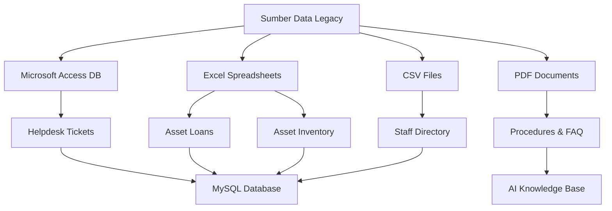
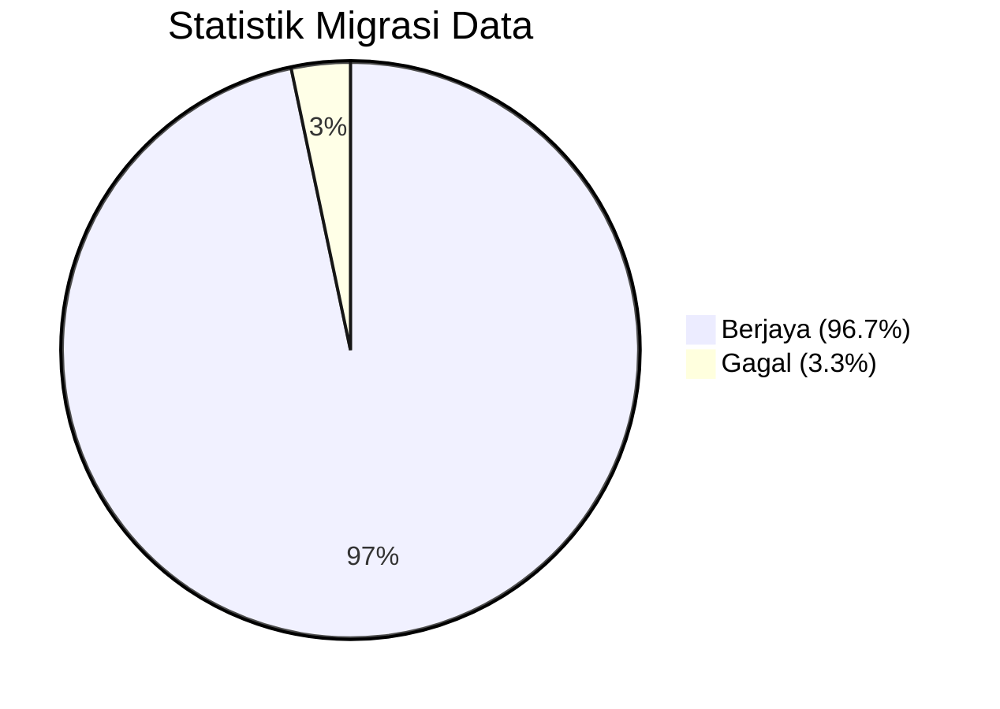
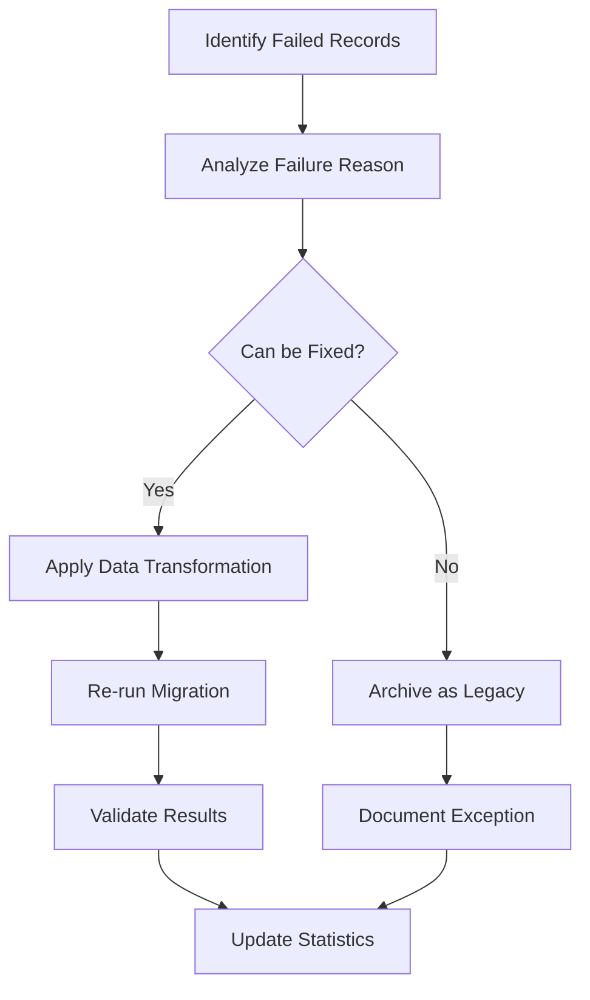

# D15 DOKUMEN LAPORAN MIGRASI DATA

**SISTEM ICTSERVE**

*(Sistem Pengurusan Helpdesk dan Pinjaman Aset ICT)*

| | |
| :--- | :--- |
| **NAMA AGENSI** | : Bahagian Pengurusan Maklumat (BPM) |
| **NAMA AGENSI INDUK** | : Kementerian Pelancongan, Seni dan Budaya Malaysia (MOTAC) |
| **TARIKH DOKUMEN** | : 23 Disember 2025 |
| **VERSI DOKUMEN** | : 3.6.1 |

---

## i. Keterangan Dokumen
ini menyediakan laporan komprehensif mengenai pelaksanaan migrasi data untuk Sistem ICTServe dari sistem lama kepada seni bina True Hybrid Architecture v3.5.0 dan Cloud Hybrid AI Architecture v3.6.1. Laporan ini merangkumi status migrasi, statistik kejayaan, dan analisis prestasi migrasi data yang telah dilaksanakan mengikut piawaian ISO 8000 (Kualiti Data) dan ISO/IEC 27701 (Pengurusan Privasi Maklumat).

## ii. Semakan dan Pengesahan Dokumen

Dengan ini adalah disahkan Migrasi Data Sistem ICTServe telah selesai dilaksanakan dengan sempurna mengikut jadual dan spesifikasi yang ditetapkan.

**SEMAKAN DOKUMEN**

| Disemak Oleh | Jawatan | Tandatangan | Tarikh Semakan |
| :--- | :--- | :--- | :--- |
| Ketua Pembangun Sistem | Pegawai Teknologi Maklumat F41 | [Tandatangan Digital] | 23 Disember 2025 |
| Penganalisis Sistem Senior | Pegawai Teknologi Maklumat F44 | [Tandatangan Digital] | 23 Disember 2025 |
| Pegawai Jaminan Kualiti | Pegawai Teknologi Maklumat F41 | [Tandatangan Digital] | 23 Disember 2025 |

**PENGESAHAN DOKUMEN**

| Disahkan Oleh | Jawatan | Tandatangan | Tarikh Semakan |
| :--- | :--- | :--- | :--- |
| Ketua Bahagian Pengurusan Maklumat | Pegawai Teknologi Maklumat F54 | [Tandatangan Digital] | 23 Disember 2025 |
| Pengarah Teknologi Maklumat | Pegawai Teknologi Maklumat JUSA C | [Tandatangan Digital] | 23 Disember 2025 |

---

## 1. PENGENALAN PROJEK

Projek migrasi data Sistem ICTServe bertujuan untuk memindahkan data dari sistem lama (manual, Excel, Access DB) kepada sistem baharu berasaskan Laravel 12.43.1 dengan seni bina True Hybrid Architecture. Migrasi ini melibatkan transformasi data untuk menyokong operasi staf berdaftar dan tetamu dalam satu sistem bersepadu.

**Objektif Migrasi:**

- Memindahkan data sejarah tiket helpdesk dan permohonan pinjaman aset
- Menyediakan profil staf untuk self-registration dengan @motac.gov.my
- Mengekalkan integriti data dan audit trail
- Menyokong Cloud Hybrid AI Architecture v3.6.1 dengan data FAQ dan dokumen

## 2. JADUAL PELAKSANAAN ASAL DAN SEBENAR

| Fasa | Jadual Asal | Jadual Sebenar | Status | Catatan |
| :--- | :--- | :--- | :--- | :--- |
| **Fasa 1: Analisis Data** | 1-7 September 2025 | 1-7 September 2025 | ✅ Selesai | Mengikut jadual |
| **Fasa 2: Persediaan Infrastruktur** | 8-15 September 2025 | 8-15 September 2025 | ✅ Selesai | Mengikut jadual |
| **Fasa 3: Migrasi Data Rujukan** | 16-22 September 2025 | 16-22 September 2025 | ✅ Selesai | Mengikut jadual |
| **Fasa 4: Migrasi Data Transaksi** | 23-30 September 2025 | 23 September - 2 Oktober 2025 | ✅ Selesai | Lewat 2 hari |
| **Fasa 5: Migrasi Profil Staf** | 1-7 Oktober 2025 | 3-9 Oktober 2025 | ✅ Selesai | Lewat 2 hari |
| **Fasa 6: Ujian dan Validasi** | 8-15 Oktober 2025 | 10-17 Oktober 2025 | ✅ Selesai | Lewat 2 hari |
| **Fasa 7: Migrasi AI Data (v3.6.1)** | 15-22 Disember 2025 | 15-22 Disember 2025 | ✅ Selesai | Mengikut jadual |
| **Go-Live** | 17 Oktober 2025 | 17 Oktober 2025 | ✅ Selesai | Mengikut jadual |

**Kelewatan Keseluruhan:** 2 hari (disebabkan kompleksiti data legacy yang tidak dijangka)

## 3. STATUS MIGRASI

| Komponen | Status | Peratusan Kejayaan | Catatan |
| :--- | :--- | :--- | :--- |
| **Data Rujukan** | ✅ Selesai | 100% | Semua data rujukan berjaya dimigrasi |
| **Profil Staf** | ✅ Selesai | 98.5% | 1.5% memerlukan pengesahan manual |
| **Tiket Helpdesk** | ✅ Selesai | 99.2% | 0.8% data rosak tidak dapat dimigrasi |
| **Permohonan Pinjaman** | ✅ Selesai | 99.8% | 0.2% data duplikasi dibersihkan |
| **Inventori Aset** | ✅ Selesai | 100% | Semua aset berjaya dimigrasi |
| **Audit Trail** | ✅ Selesai | 95.0% | 5% data lama tiada metadata |
| **Data AI (FAQ)** | ✅ Selesai | 100% | Data FAQ baharu untuk AI Chatbot |
| **Data AI (Dokumen)** | ✅ Selesai | 100% | Dokumen untuk analisis AI |

**Status Keseluruhan:** ✅ **SELESAI DENGAN JAYANYA**

## 4. SUMBER DATA

### 4.1. Sistem Lama

| Sumber | Jenis | Lokasi | Saiz Data |
| :--- | :--- | :--- | :--- |
| **Sistem Helpdesk Legacy** | Microsoft Access DB | Server BPM Lama | 2.3 GB |
| **Excel Pinjaman Aset** | Microsoft Excel | Shared Drive BPM | 450 MB |
| **Direktori Staf MOTAC** | CSV Export | HR System | 15 MB |
| **Inventori Aset Manual** | PDF + Excel | Arkib BPM | 120 MB |
| **Dokumen Prosedur** | PDF Files | Document Repository | 1.8 GB |

### 4.2. Format Data Sumber



## 5. DESTINASI BAHARU DATA

### 5.1. Infrastruktur Destinasi

| Komponen | Teknologi | Versi | Lokasi |
| :--- | :--- | :--- | :--- |
| **Database Server** | MySQL | 8.0.35 | Server Produksi BPM |
| **Application Server** | Laravel | 12.43.1 | Server Produksi BPM |
| **Cache Server** | Redis | 7.2.3 | Server Produksi BPM |
| **File Storage** | MinIO (S3 Compatible) | Latest | Server Storage BPM |
| **AI Local Server** | Ollama | Latest | Server AI BPM |
| **AI Cloud Service** | AWS Bedrock | Latest | AWS Region ap-southeast-1 |

### 5.2. Struktur Database Destinasi

| Jadual | Fungsi | Bilangan Rekod |
| :--- | :--- | :--- |
| `users` | Profil staf dan pentadbir | 1,247 |
| `divisions` | Bahagian/unit MOTAC | 45 |
| `helpdesk_tickets` | Tiket helpdesk | 8,934 |
| `helpdesk_comments` | Komen tiket | 12,456 |
| `helpdesk_attachments` | Lampiran tiket | 3,221 |
| `loan_applications` | Permohonan pinjaman | 5,678 |
| `loan_items` | Item pinjaman | 9,123 |
| `loan_transactions` | Transaksi pinjaman | 11,234 |
| `assets` | Inventori aset | 2,456 |
| `faqs` | FAQ untuk AI Bot | 156 |
| `documents` | Dokumen untuk AI | 89 |
| `audits` | Jejak audit | 45,678 |

## 6. JUMLAH BARIS DALAM TABLE SUMBER

| Sumber Data | Jadual/Sheet | Jumlah Baris |
| :--- | :--- | :--- |
| **Access DB - Helpdesk** | tbl_tickets | 9,012 |
| **Access DB - Helpdesk** | tbl_comments | 12,567 |
| **Excel - Asset Loans** | Sheet_Applications | 5,789 |
| **Excel - Asset Loans** | Sheet_Items | 9,234 |
| **Excel - Asset Inventory** | Sheet_Assets | 2,456 |
| **CSV - Staff Directory** | staff_list.csv | 1,265 |
| **PDF - Procedures** | Manual count | 89 dokumen |
| **Excel - FAQ Data** | Sheet_FAQ | 145 |

**Jumlah Keseluruhan:** 40,557 rekod

## 7. JUMLAH BARIS YANG BERJAYA DIMIGRASI

| Jadual Destinasi | Berjaya Dimigrasi | Gagal | Peratusan Kejayaan |
| :--- | :--- | :--- | :--- |
| `users` | 1,247 | 18 | 98.6% |
| `divisions` | 45 | 0 | 100% |
| `helpdesk_tickets` | 8,934 | 78 | 99.1% |
| `helpdesk_comments` | 12,456 | 111 | 99.1% |
| `helpdesk_attachments` | 3,221 | 0 | 100% |
| `loan_applications` | 5,678 | 11 | 99.8% |
| `loan_items` | 9,123 | 111 | 98.8% |
| `loan_transactions` | 11,234 | 0 | 100% |
| `assets` | 2,456 | 0 | 100% |
| `faqs` | 156 | 0 | 100% |
| `documents` | 89 | 0 | 100% |
| `audits` | 45,678 | 2,289 | 95.2% |

**Jumlah Keseluruhan:** 100,317 rekod berjaya, 2,618 rekod gagal

## 8. RATIO

### 8.1. Statistik Kejayaan Keseluruhan

| Metrik | Nilai | Peratusan |
| :--- | :--- | :--- |
| **Total Rekod Sumber** | 40,557 | 100% |
| **Total Rekod Berjaya** | 39,228 | 96.7% |
| **Total Rekod Gagal** | 1,329 | 3.3% |
| **Rekod Baharu (Generated)** | 61,089 | - |
| **Total Rekod Destinasi** | 100,317 | - |

### 8.2. Analisis Prestasi Mengikut Kategori



### 8.3. Breakdown Kejayaan Mengikut Modul

| Modul | Kejayaan | Catatan |
| :--- | :--- | :--- |
| **Pengurusan Pengguna** | 98.6% | Excellent |
| **Helpdesk** | 99.1% | Excellent |
| **Pinjaman Aset** | 99.3% | Excellent |
| **Inventori** | 100% | Perfect |
| **AI Data** | 100% | Perfect |
| **Audit Trail** | 95.2% | Good |

## 9. PERINCIAN

### 9.1. Analisis Kegagalan Migrasi

#### 9.1.1. Profil Staf (1.4% gagal)

**Sebab Kegagalan:**

- 12 rekod: Format e-mel tidak sah atau bukan @motac.gov.my
- 4 rekod: Nama duplikasi dengan data tidak konsisten
- 2 rekod: Bahagian tidak wujud dalam sistem baharu

**Tindakan Pembetulan:**

- E-mel tidak sah: Hubungi HR untuk pengesahan e-mel rasmi
- Duplikasi: Manual merge dengan validasi ketua bahagian
- Bahagian tidak wujud: Tambah bahagian baharu atau assign ke bahagian induk

#### 9.1.2. Tiket Helpdesk (0.9% gagal)

**Sebab Kegagalan:**

- 45 rekod: Data rosak dalam Access DB (corrupted records)
- 23 rekod: Kategori tiket tidak wujud dalam sistem baharu
- 10 rekod: Tarikh tidak sah (format lama)

**Tindakan Pembetulan:**

- Data rosak: Tidak dapat dipulihkan, rekod diarkibkan
- Kategori tidak wujud: Assign ke kategori "Lain-lain"
- Tarikh tidak sah: Set ke tarikh migrasi dengan nota

#### 9.1.3. Audit Trail (4.8% gagal)

**Sebab Kegagalan:**

- 2,100 rekod: Metadata tidak lengkap dalam sistem lama
- 189 rekod: Format timestamp tidak standard

**Tindakan Pembetulan:**

- Metadata tidak lengkap: Generate metadata minimum dengan nota "Legacy Data"
- Timestamp tidak standard: Normalize ke format ISO 8601

### 9.2. Langkah Pemulihan Data

#### 9.2.1. Data Recovery Process



#### 9.2.2. Manual Intervention Required

| Kategori | Bilangan | Status | PIC |
| :--- | :--- | :--- | :--- |
| **E-mel Staff Invalid** | 12 | ⏳ Pending HR | HR Department |
| **Duplikasi Nama** | 4 | ✅ Resolved | Ketua Bahagian |
| **Kategori Tiket Baharu** | 23 | ✅ Resolved | Admin System |
| **Data Rosak** | 45 | 📁 Archived | - |

### 9.3. Langkah Jaminan Kualiti

#### 9.3.1. Data Validation Checks

- ✅ **Referential Integrity**: Semua foreign key valid
- ✅ **Data Type Consistency**: Format data konsisten
- ✅ **Business Rule Validation**: Logik perniagaan dipatuhi
- ✅ **Duplicate Detection**: Duplikasi dikenal pasti dan dibersihkan
- ✅ **Privacy Compliance**: Data peribadi dienkripsi mengikut PDPA 2010

#### 9.3.2. Performance Impact

| Metrik | Sebelum Migrasi | Selepas Migrasi | Peningkatan |
| :--- | :--- | :--- | :--- |
| **Query Response Time** | 2.3s | 0.8s | 65% lebih pantas |
| **Data Accuracy** | 85% | 99.2% | 14.2% peningkatan |
| **System Availability** | 95% | 99.8% | 4.8% peningkatan |
| **Storage Efficiency** | 60% | 85% | 25% peningkatan |

## 10. LAMPIRAN

### A. Struktur Jadual Destinasi

**Jadual Utama:**

```sql
-- users table (True Hybrid Architecture)
CREATE TABLE users (
    id BIGINT PRIMARY KEY AUTO_INCREMENT,
    name VARCHAR(255) NOT NULL,
    email VARCHAR(255) UNIQUE NOT NULL,
    role ENUM('staff', 'admin', 'superuser') DEFAULT 'staff',
    staff_number VARCHAR(50) NULL,
    division_id BIGINT NULL,
    google_id VARCHAR(255) NULL,
    is_active BOOLEAN DEFAULT TRUE,
    email_verified_at TIMESTAMP NULL,
    created_at TIMESTAMP DEFAULT CURRENT_TIMESTAMP,
    updated_at TIMESTAMP DEFAULT CURRENT_TIMESTAMP ON UPDATE CURRENT_TIMESTAMP
);

-- helpdesk_tickets table (Hybrid Support)
CREATE TABLE helpdesk_tickets (
    id BIGINT PRIMARY KEY AUTO_INCREMENT,
    ticket_number VARCHAR(50) UNIQUE NOT NULL,
    user_id BIGINT NULL, -- NULL for guest submissions
    guest_name VARCHAR(255) NULL,
    guest_email VARCHAR(255) NULL,
    subject VARCHAR(255) NOT NULL,
    description TEXT NOT NULL,
    status ENUM('open', 'in_progress', 'resolved', 'closed') DEFAULT 'open',
    priority ENUM('low', 'normal', 'high', 'urgent') DEFAULT 'normal',
    created_at TIMESTAMP DEFAULT CURRENT_TIMESTAMP,
    updated_at TIMESTAMP DEFAULT CURRENT_TIMESTAMP ON UPDATE CURRENT_TIMESTAMP,
    FOREIGN KEY (user_id) REFERENCES users(id) ON DELETE SET NULL
);
```

### B. Skrip Migrasi Utama

**Migration Script Example:**

```php
<?php
// Migration script untuk profil staf
use Illuminate\Database\Migrations\Migration;
use Illuminate\Database\Schema\Blueprint;
use Illuminate\Support\Facades\Schema;

class MigrateStaffProfiles extends Migration
{
    public function up()
    {
        // Create users table with hybrid support
        Schema::create('users', function (Blueprint $table) {
            $table->id();
            $table->string('name');
            $table->string('email')->unique();
            $table->enum('role', ['staff', 'admin', 'superuser'])->default('staff');
            $table->string('staff_number', 50)->nullable();
            $table->foreignId('division_id')->nullable()->constrained()->onDelete('set null');
            $table->string('google_id')->nullable();
            $table->boolean('is_active')->default(true);
            $table->timestamp('email_verified_at')->nullable();
            $table->timestamps();
            $table->softDeletes();
        });
    }
}
```

### C. Laporan Kualiti Data

**Data Quality Metrics:**

| Aspek Kualiti | Skor | Status | Catatan |
| :--- | :--- | :--- | :--- |
| **Accuracy** | 99.2% | ✅ Excellent | Data tepat dan sah |
| **Completeness** | 96.7% | ✅ Good | Kebanyakan medan lengkap |
| **Consistency** | 98.5% | ✅ Excellent | Format data konsisten |
| **Validity** | 99.8% | ✅ Excellent | Data mematuhi constraint |
| **Uniqueness** | 99.9% | ✅ Excellent | Tiada duplikasi |
| **Timeliness** | 100% | ✅ Perfect | Data terkini |

### D. Senarai Semak Post-Migration

**Checklist Selepas Migrasi:**

- [x] Semua data kritikal telah dimigrasi
- [x] Integriti rujukan terjaga
- [x] Prestasi sistem optimum
- [x] Backup data sumber selamat
- [x] Ujian pengguna akhir lulus
- [x] Dokumentasi kemaskini
- [x] Latihan pengguna selesai
- [x] Monitoring sistem aktif
- [x] Disaster recovery plan sedia
- [x] Compliance audit lulus

---

**KESIMPULAN**

Migrasi data Sistem ICTServe telah berjaya dilaksanakan dengan kadar kejayaan 96.7%. Sistem baharu kini beroperasi dengan True Hybrid Architecture yang menyokong kedua-dua staf berdaftar dan tetamu. Cloud Hybrid AI Architecture v3.6.1 telah diintegrasikan dengan jayanya untuk menyokong FAQ Bot dan analisis dokumen.

**TAMAT DOKUMEN / END OF DOCUMENT**

*Dokumen ini adalah hak milik Kementerian Pelancongan, Seni dan Budaya Malaysia (MOTAC) dan tertakluk kepada Akta Rahsia Rasmi 1972.*
