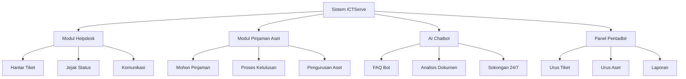

# D17 DOKUMEN MANUAL PENGGUNA SISTEM

**SISTEM ICTSERVE**

*(Sistem Pengurusan Helpdesk dan Pinjaman Aset ICT)*

| | |
| :--- | :--- |
| **NAMA AGENSI** | : Bahagian Pengurusan Maklumat (BPM) |
| **NAMA AGENSI INDUK** | : Kementerian Pelancongan, Seni dan Budaya Malaysia (MOTAC) |
| **TARIKH DOKUMEN** | : 23 Disember 2025 |
| **VERSI DOKUMEN** | : 3.6.1 |

---

## i. Keterangan Dokumen

Dokumen ini menyediakan panduan lengkap untungguna Sistem ICTServe yang merangkumi prosedur penggunaan, fungsi sistem, dan arahan langkah demi langkah untuk mengakses dan menggunakan sistem. Manual ini disediakan mengikut piawaian WCAG 2.2 AA untuk kebolehcapaian dan mematuhi garis panduan kegunaan sistem kerajaan Malaysia.

## ii. Kawalan Dokumen

**KAWALAN DOKUMEN**

| No. Versi | Tarikh | Ringkasan Pindaan | Penyedia |
| :--- | :--- | :--- | :--- |
| 1.0.0 | 15 September 2025 | Versi awal manual pengguna | Pasukan Pembangunan BPM |
| 2.0.0 | 17 Oktober 2025 | Kemaskini untuk True Hybrid Architecture | Pasukan Pembangunan BPM |
| 3.5.0 | 1 Disember 2025 | Tambah panduan Google SSO dan self-registration | Pasukan Pembangunan BPM |
| 3.6.1 | 23 Disember 2025 | Integrasi AI Chatbot dan Bahasa Melayu sahaja | Pasukan Pembangunan BPM |

## iii. Kandungan

1. [PENGENALAN](#1-pengenalan) ... 3
2. [OVERVIEW SISTEM](#2-overview-sistem) ... 5
3. [KETERANGAN FUNGSI SISTEM](#3-keterangan-fungsi-sistem) ... 7
4. [ARAHAN PENGGUNAAN SISTEM](#4-arahan-penggunaan-sistem) ... 12
5. [PENGENDALIAN RALAT](#5-pengendalian-ralat) ... 20

## iv. Senarai Gambarajah

- Gambarajah 1: Aliran Pengguna Sistem ICTServe ... 6
- Gambarajah 2: Proses Penyerahan Tiket Helpdesk ... 9
- Gambarajah 3: Proses Permohonan Pinjaman Aset ... 11
- Gambarajah 4: Interaksi dengan AI Chatbot ... 14

## v. Senarai Jadual

- Jadual 1: Jenis Pengguna dan Akses ... 5
- Jadual 2: Senarai Fungsi Utama ... 8
- Jadual 3: Status Tiket dan Maknanya ... 10
- Jadual 4: Kod Ralat Biasa ... 21

---

## 1. PENGENALAN

Manual Pengguna Sistem ICTServe mengandungi semua maklumat penting bagi pengguna untuk menggunakan sepenuhnya sistem pengurusan helpdesk dan pinjaman aset dalaman MOTAC. Manual ini termasuklah penerangan tentang fungsi sistem dan keupayaan, prosedur langkah demi langkah untuk akses sistem dan kaedah penggunaannya, serta panduan penggunaan AI Chatbot untuk sokongan automatik.

### 1.1. Tujuan dan Skop

**Tujuan:**

- Menyediakan panduan komprehensif untuk semua jenis pengguna sistem
- Memastikan pengguna dapat menggunakan sistem dengan berkesan
- Mengurangkan keperluan sokongan teknikal melalui dokumentasi yang jelas

**Skop:**

- Panduan untuk staf MOTAC (pengguna berdaftar)
- Panduan untuk tetamu (pengguna tidak berdaftar)
- Panduan untuk pentadbir sistem
- Penggunaan AI Chatbot untuk FAQ dan sokongan

### 1.2. Organisasi Manual

Manual ini disusun mengikut aliran penggunaan sistem:

- **Bahagian 1-2**: Pengenalan dan gambaran keseluruhan sistem
- **Bahagian 3**: Penerangan fungsi-fungsi utama sistem
- **Bahagian 4**: Arahan langkah demi langkah penggunaan
- **Bahagian 5**: Pengendalian masalah dan ralat

### 1.3. Maklumat Untuk Dihubungi

**Sokongan Teknikal:**

- **Helpdesk BPM MOTAC**: 03-xxxx-xxxx (Waktu Pejabat)
- **E-mel Sokongan**: <helpdesk@motac.gov.my>
- **Sistem Sokongan**: Gunakan fungsi "Hantar Tiket" dalam sistem
- **AI Chatbot**: Tersedia 24/7 untuk soalan asas dan FAQ

**Pegawai Bertanggungjawab:**

- **Ketua BPM**: Pegawai Teknologi Maklumat F54
- **Pentadbir Sistem**: Pegawai Teknologi Maklumat F44
- **Sokongan Pengguna**: Pegawai Teknologi Maklumat F41

### 1.4. Rujukan Projek

Dokumen berkaitan yang boleh dirujuk:

- D00_SYSTEM_OVERVIEW.md - Gambaran keseluruhan sistem
- D03_SOFTWARE_REQUIREMENTS_SPECIFICATION.md - Keperluan sistem
- D15_LANGUAGE_MS_EN.md - Panduan bahasa (Bahasa Melayu sahaja)
- D18_AI_CHATBOT_OLLAMA_BEDROCK.md - Dokumentasi AI Chatbot

### 1.5. Fungsi Utama Sistem

Sistem ICTServe menyokong operasi harian BPM MOTAC melalui:

**Pengurusan Helpdesk:**

- Penyerahan tiket aduan ICT
- Penjejakan status tiket
- Komunikasi dengan pentadbir
- Penyelesaian masalah teknikal

**Pengurusan Pinjaman Aset:**

- Permohonan pinjaman peralatan ICT
- Proses kelulusan bertingkat
- Penjejakan status permohonan
- Pengurusan pemulangan aset

**Sokongan AI:**

- FAQ Bot untuk soalan biasa
- Analisis dokumen automatik
- Cadangan penyelesaian masalah
- Sokongan 24/7

### 1.6. Glosari

| Istilah | Definisi |
| :--- | :--- |
| **AI Chatbot** | Sistem kecerdasan buatan untuk menjawab soalan dan memberikan sokongan |
| **Helpdesk** | Sistem sokongan teknikal untuk mengendalikan aduan dan masalah ICT |
| **Hybrid Architecture** | Seni bina sistem yang menyokong pengguna berdaftar dan tetamu |
| **Self-Registration** | Pendaftaran automatik untuk staf dengan e-mel @motac.gov.my |
| **SSO** | Single Sign-On - log masuk sekali untuk akses berbilang sistem |
| **Staf MOTAC** | Pegawai MOTAC yang mempunyai e-mel rasmi @motac.gov.my |
| **Tetamu** | Pengguna yang menggunakan sistem tanpa pendaftaran akaun |
| **Tiket** | Rekod aduan atau permintaan sokongan teknikal |

## 2. OVERVIEW SISTEM

### 2.1. Tujuan

Sistem ICTServe dibangunkan untuk:

- Menyelaraskan proses sokongan ICT dalam MOTAC
- Menyediakan platform bersepadu untuk helpdesk dan pinjaman aset
- Meningkatkan kecekapan pengurusan sumber ICT
- Menyediakan sokongan AI untuk penyelesaian masalah pantas
- Memastikan pematuhan kepada piawaian keselamatan kerajaan

### 2.2. Keterangan Sistem

Sistem ICTServe menggunakan True Hybrid Architecture yang membolehkan:

**Akses Fleksibel:**

- Staf MOTAC boleh log masuk dengan akaun rasmi
- Tetamu boleh menggunakan sistem tanpa pendaftaran
- Sokongan Google SSO untuk kemudahan akses

**Fungsi Utama:**



**Jenis Pengguna:**

| Jenis Pengguna | Akses | Fungsi Utama |
| :--- | :--- | :--- |
| **Tetamu** | Tanpa log masuk | Hantar tiket, mohon pinjaman, semak status |
| **Staf MOTAC** | Log masuk dengan @motac.gov.my | Semua fungsi tetamu + dashboard peribadi |
| **Pentadbir** | Log masuk dengan kebenaran admin | Urus tiket, kelulusan, laporan |
| **Superuser** | Log masuk dengan kebenaran penuh | Semua fungsi + konfigurasi sistem |

## 3. KETERANGAN FUNGSI SISTEM

### 3.1. Senarai Fungsi Sistem

| Fungsi | Pengguna | Keterangan |
| :--- | :--- | :--- |
| **Penyerahan Tiket Helpdesk** | Semua | Hantar aduan atau permintaan sokongan ICT |
| **Penjejakan Status Tiket** | Semua | Semak status dan kemajuan tiket |
| **Permohonan Pinjaman Aset** | Semua | Mohon pinjaman peralatan ICT |
| **Penjejakan Status Pinjaman** | Semua | Semak status permohonan pinjaman |
| **AI FAQ Bot** | Semua | Dapatkan jawapan pantas untuk soalan biasa |
| **Dashboard Peribadi** | Staf/Admin | Lihat ringkasan tiket dan pinjaman peribadi |
| **Pengurusan Tiket** | Admin | Proses dan selesaikan tiket helpdesk |
| **Kelulusan Pinjaman** | Admin | Luluskan atau tolak permohonan pinjaman |
| **Pengurusan Aset** | Admin | Urus inventori dan status aset |
| **Laporan dan Analitik** | Admin | Jana laporan prestasi dan statistik |

### 3.2. Perincian Keterangan bagi Fungsi Sistem

#### 3.2.1. Penyerahan Tiket Helpdesk

**Tujuan:** Membolehkan pengguna menghantar aduan atau permintaan sokongan ICT

**Pengawalan:** Tiada had bilangan tiket untuk staf, had 5 tiket sehari untuk tetamu

**Input yang diperlukan:**

- Nama penghantar
- E-mel hubungan
- Subjek aduan
- Keterangan terperinci masalah
- Kategori masalah (perkakasan, perisian, rangkaian, dll.)
- Tahap keutamaan (rendah, normal, tinggi, kritikal)
- Lampiran (opsional)

**Output yang dijangka:**

- Nombor tiket unik (format: HD[YYYY][MM][0001-9999])
- E-mel pengesahan
- Token semakan status (untuk tetamu)

**Hubungan dengan fungsi lain:**

- Berkait dengan sistem notifikasi e-mel
- Terintegrasi dengan AI Chatbot untuk cadangan penyelesaian
- Berkait dengan pengurusan aset jika melibatkan perkakasan

#### 3.2.2. Permohonan Pinjaman Aset

**Tujuan:** Membolehkan staf memohon pinjaman peralatan ICT untuk tugasan rasmi

**Pengawalan:** Hanya staf MOTAC yang layak, perlu kelulusan ketua bahagian

**Input yang diperlukan:**

- Maklumat pemohon (nama, jawatan, bahagian)
- Jenis aset yang diperlukan
- Tempoh pinjaman
- Tujuan penggunaan
- Lokasi penggunaan
- Pegawai bertanggungjawab (jika berbeza)

**Output yang dijangka:**

- Nombor permohonan unik (format: LA[YYYY][MM][0001-9999])
- E-mel pengesahan
- E-mel kelulusan kepada ketua bahagian
- Notifikasi status kepada pemohon

#### 3.2.3. AI FAQ Bot

**Tujuan:** Menyediakan jawapan pantas untuk soalan biasa dan sokongan 24/7

**Keupayaan:**

- Menjawab soalan dalam Bahasa Melayu
- Carian semantik dalam pangkalan pengetahuan
- Cadangan penyelesaian berdasarkan masalah serupa
- Penghalaan kepada pentadbir jika diperlukan

**Jenis soalan yang boleh dijawab:**

- Prosedur pinjaman aset
- Masalah ICT biasa
- Polisi dan garis panduan
- Status sistem dan penyelenggaraan

## 4. ARAHAN PENGGUNAAN SISTEM

### 4.1. Log Masuk Sistem

#### 4.1.1. Akses Sebagai Tetamu

1. **Buka pelayar web** dan navigasi ke alamat sistem ICTServe
2. **Pilih "Gunakan Sebagai Tetamu"** di halaman utama
3. **Pilih perkhidmatan** yang diperlukan:
   - Hantar Tiket Helpdesk
   - Mohon Pinjaman Aset
   - Semak Status (dengan token)
   - Tanya AI Chatbot

#### 4.1.2. Log Masuk Staf MOTAC

**Kaedah 1: Self-Registration**

1. **Klik "Daftar Akaun Baharu"** di halaman log masuk
2. **Masukkan e-mel rasmi** (@motac.gov.my)
3. **Lengkapkan maklumat profil**:
   - Nama penuh
   - Nombor staf (opsional)
   - Bahagian/Unit
   - Jawatan
4. **Sahkan e-mel** melalui pautan yang dihantar
5. **Log masuk** dengan e-mel dan kata laluan

**Kaedah 2: Google SSO**

1. **Klik "Log Masuk dengan Google"**
2. **Pilih akaun Google** yang berkaitan dengan @motac.gov.my
3. **Berikan kebenaran** untuk akses sistem
4. **Lengkapkan profil** jika kali pertama

**Kaedah 3: Log Masuk Biasa**

1. **Masukkan e-mel** dan **kata laluan**
2. **Klik "Log Masuk"**
3. **Akses dashboard** peribadi

### 4.2. Proses Pengoperasian Sistem

#### 4.2.1. Menghantar Tiket Helpdesk

**Langkah 1: Akses Borang Tiket**

- Tetamu: Klik "Hantar Tiket" di halaman utama
- Staf: Klik "Tiket Baharu" di dashboard

**Langkah 2: Isi Maklumat Asas**

```
Nama: [Masukkan nama penuh]
E-mel: [Masukkan e-mel yang sah]
Telefon: [Nombor telefon untuk dihubungi]
Bahagian: [Pilih dari senarai atau tulis manual]
```

**Langkah 3: Keterangan Masalah**

```
Subjek: [Ringkasan masalah dalam 1 baris]
Kategori: [Pilih: Perkakasan/Perisian/Rangkaian/Lain-lain]
Keutamaan: [Rendah/Normal/Tinggi/Kritikal]
Keterangan: [Terangkan masalah dengan terperinci]
```

**Langkah 4: Lampiran (Opsional)**

- Klik "Pilih Fail" untuk melampirkan skrin tangkap atau dokumen
- Saiz maksimum: 10MB per fail
- Format yang diterima: PDF, JPG, PNG, DOC, DOCX

**Langkah 5: Hantar dan Pengesahan**

- Semak semula maklumat
- Klik "Hantar Tiket"
- Catat nombor tiket dan token status (untuk tetamu)

#### 4.2.2. Memohon Pinjaman Aset

**Langkah 1: Akses Borang Permohonan**

- Klik "Mohon Pinjaman Aset" di halaman utama atau dashboard

**Langkah 2: Maklumat Pemohon**

```
Nama: [Nama penuh pemohon]
E-mel: [E-mel rasmi @motac.gov.my]
Nombor Staf: [Nombor staf MOTAC]
Jawatan: [Jawatan semasa]
Bahagian: [Bahagian/Unit kerja]
Gred: [Gred jawatan]
```

**Langkah 3: Butiran Permohonan**

```
Jenis Aset: [Pilih dari senarai atau nyatakan]
Kuantiti: [Bilangan unit diperlukan]
Tarikh Mula: [Tarikh mula pinjaman]
Tarikh Tamat: [Tarikh akhir pinjaman]
Tujuan: [Terangkan tujuan penggunaan]
Lokasi: [Tempat penggunaan aset]
```

**Langkah 4: Pegawai Bertanggungjawab**

- Pilih "Saya sendiri" atau nyatakan pegawai lain
- Jika pegawai lain, masukkan maklumat lengkap

**Langkah 5: Hantar Permohonan**

- Semak semula maklumat
- Klik "Hantar Permohonan"
- Catat nombor permohonan

#### 4.2.3. Menggunakan AI Chatbot

**Langkah 1: Akses Chatbot**

- Klik ikon chat di sudut kanan bawah
- Atau pilih "Tanya AI" di menu utama

**Langkah 2: Mulakan Perbualan**

```
Contoh soalan yang boleh ditanya:
- "Bagaimana cara memohon pinjaman laptop?"
- "Kenapa komputer saya lambat?"
- "Apa polisi penggunaan aset ICT?"
- "Bagaimana cara semak status tiket?"
```

**Langkah 3: Interaksi Lanjutan**

- AI akan memberikan jawapan dalam Bahasa Melayu
- Boleh bertanya soalan susulan
- Jika AI tidak dapat membantu, akan cadangkan hubungi pentadbir

#### 4.2.4. Menyemak Status

**Untuk Tetamu:**

1. Klik "Semak Status" di halaman utama
2. Masukkan token status yang diterima melalui e-mel
3. Lihat kemajuan tiket atau permohonan

**Untuk Staf:**

1. Log masuk ke dashboard
2. Lihat senarai tiket dan permohonan di halaman utama
3. Klik pada item untuk melihat butiran

### 4.3. Penamatan dan Pengoperasi Semula Sistem

#### 4.3.1. Log Keluar

**Staf yang telah log masuk:**

1. Klik nama pengguna di sudut kanan atas
2. Pilih "Log Keluar"
3. Sistem akan kembali ke halaman utama

**Tetamu:**

- Tutup pelayar atau navigasi ke laman web lain
- Tiada proses log keluar khusus diperlukan

#### 4.3.2. Sesi Tamat Tempoh

- Sesi staf akan tamat selepas 2 jam tidak aktif
- Sistem akan paparkan amaran 5 minit sebelum tamat
- Klik "Sambung Sesi" untuk memanjangkan

#### 4.3.3. Pemulihan Sesi

Jika sesi terputus secara tidak dijangka:

1. Muat semula halaman pelayar
2. Log masuk semula jika diperlukan
3. Data yang belum disimpan mungkin hilang
4. Gunakan fungsi "Simpan Draf" untuk mengelakkan kehilangan data

## 5. PENGENDALIAN RALAT

### 5.1. Mesej Ralat Biasa

| Kod Ralat | Mesej | Maksud | Penyelesaian |
| :--- | :--- | :--- | :--- |
| **E001** | "E-mel tidak sah" | Format e-mel salah | Pastikan format e-mel betul (<contoh@motac.gov.my>) |
| **E002** | "Medan wajib kosong" | Ada medan yang tidak diisi | Isi semua medan yang bertanda * |
| **E003** | "Fail terlalu besar" | Lampiran melebihi 10MB | Kecilkan saiz fail atau gunakan format lain |
| **E004** | "Token tidak sah" | Token status salah/luput | Semak semula token atau minta token baharu |
| **E005** | "Sesi tamat tempoh" | Sesi pengguna telah luput | Log masuk semula |
| **E006** | "Akses ditolak" | Tiada kebenaran akses | Hubungi pentadbir untuk kebenaran |
| **E007** | "Sistem dalam penyelenggaraan" | Sistem sedang dikemaskini | Cuba lagi kemudian atau hubungi sokongan |
| **E008** | "Rangkaian terputus" | Masalah sambungan internet | Semak sambungan internet dan cuba lagi |

### 5.2. Langkah Penyelesaian Masalah

#### 5.2.1. Masalah Log Masuk

**Masalah:** Tidak dapat log masuk
**Penyelesaian:**

1. Pastikan e-mel dan kata laluan betul
2. Semak caps lock tidak aktif
3. Cuba reset kata laluan
4. Bersihkan cache pelayar
5. Hubungi pentadbir jika masih gagal

**Masalah:** E-mel pengesahan tidak diterima
**Penyelesaian:**

1. Semak folder spam/junk
2. Pastikan e-mel @motac.gov.my aktif
3. Minta hantar semula e-mel pengesahan
4. Hubungi IT support jika masih tiada

#### 5.2.2. Masalah Penyerahan Borang

**Masalah:** Borang tidak dapat dihantar
**Penyelesaian:**

1. Semak semua medan wajib telah diisi
2. Pastikan sambungan internet stabil
3. Cuba muat semula halaman
4. Gunakan pelayar yang berbeza
5. Hubungi sokongan teknikal

**Masalah:** Lampiran tidak dapat dimuat naik
**Penyelesaian:**

1. Semak saiz fail tidak melebihi 10MB
2. Pastikan format fail disokong
3. Cuba kompres fail
4. Gunakan format PDF untuk dokumen
5. Hubungi pentadbir jika masih gagal

#### 5.2.3. Masalah AI Chatbot

**Masalah:** AI tidak memberikan jawapan yang tepat
**Penyelesaian:**

1. Cuba tulis soalan dengan lebih jelas
2. Gunakan kata kunci yang spesifik
3. Tanya dalam Bahasa Melayu
4. Jika masih tidak membantu, hubungi pentadbir

### 5.3. Bantuan Helpdesk

#### 5.3.1. Saluran Sokongan

**Sokongan Dalam Talian:**

- **AI Chatbot**: Tersedia 24/7 untuk soalan asas
- **Sistem Tiket**: Hantar tiket untuk masalah teknikal
- **E-mel**: <helpdesk@motac.gov.my>

**Sokongan Telefon:**

- **Waktu Pejabat**: Isnin - Jumaat, 8:00 AM - 5:00 PM
- **Nombor**: 03-xxxx-xxxx (sambungan helpdesk)
- **Kecemasan**: Hubungi pentadbir sistem terus

#### 5.3.2. Maklumat Yang Perlu Disediakan

Apabila menghubungi sokongan, sediakan:

- Nama dan jawatan
- E-mel yang digunakan
- Keterangan masalah yang terperinci
- Langkah yang telah dicuba
- Skrin tangkap ralat (jika ada)
- Nombor tiket (jika berkaitan)

#### 5.3.3. Masa Respons Sokongan

| Tahap Keutamaan | Masa Respons | Masa Penyelesaian |
| :--- | :--- | :--- |
| **Kritikal** | 1 jam | 4 jam |
| **Tinggi** | 4 jam | 1 hari kerja |
| **Normal** | 1 hari kerja | 3 hari kerja |
| **Rendah** | 2 hari kerja | 5 hari kerja |

---

**PENUTUP**

Manual ini akan dikemaskini mengikut keperluan dan perubahan sistem. Untuk versi terkini, sila rujuk sistem atau hubungi pentadbir. Sebarang cadangan penambahbaikan manual ini boleh dihantar melalui sistem tiket.

**TAMAT DOKUMEN / END OF DOCUMENT**

*Dokumen ini adalah hak milik Kementerian Pelancongan, Seni dan Budaya Malaysia (MOTAC) dan tertakluk kepada Akta Rahsia Rasmi 1972.*
