# D17 DOKUMEN MANUAL PENGGUNA SISTEM (PENTADBIR)

**SISTEM ICTSERVE**

*(Sistem Pengurusan Helpdesk dan Pinjaman Aset ICT)*

| | |
| :--- | :--- |
| **NAMA AGENSI** | : Bahagian Pengurusan Maklumat (BPM) |
| **NAMA AGENSI INDUK** | : Kementerian Pelancongan, Seni dan Budaya Malaysia (MOTAC) |
| **TARIKH DOKUMEN** | : 23 Disember 2025 |
| **VERSI DOKUMEN** | : 3.6.1 |

---

## i. Kengan Dokumen

Manual ini adalah panduan rasmi **Pentadbir Sistem (Admin/Superuser)** untuk ICTServe versi 3.6.1. Ia menerangkan operasi harian menggunakan panel pentadbiran Filament, meliputi pengurusan tiket aduan, pinjaman aset, inventori, peranan pengguna, automasi AI hibrid (Ollama + Bedrock), laporan, serta pemantauan prestasi. Dokumen ini disediakan mengikut piawaian KRISA MAMPU dan garis panduan keselamatan sistem kerajaan Malaysia.

**Sistem ini mematuhi Polisi Keselamatan Siber (PKS) MOTAC** dengan **SSO Authentication wajib** mengikut PKS 5.2.1 untuk memastikan akauntabiliti penuh. **HRMIS-integrated auto-provisioning** menggantikan manual registration untuk memastikan hanya staf aktif yang dapat mengakses sistem.

**PENTING**: Sistem ini **tidak lagi menyokong akses tetamu (Guest Mode)**. Semua pengguna mesti melalui **"Walk-in/Kiosk Mode using SSO authentication"** untuk memastikan setiap aktiviti dapat dikesan kepada staf yang bertanggungjawab mengikut PKS 5.2.1.

## ii. Semakan dan Pengesahan Dokumen

**SEMAKAN DOKUMEN**

| Disemak Oleh | Jawatan | Tandatangan | Tarikh Semakan |
| :--- | :--- | :--- | :--- |
| Ketua Pembangun Sistem | Pegawai Teknologi Maklumat F41 | [Tandatangan Digital] | 23 Disember 2025 |
| Penganalisis Sistem Senior | Pegawai Teknologi Maklumat F44 | [Tandatangan Digital] | 23 Disember 2025 |
| Pegawai Keselamatan Sistem | Pegawai Teknologi Maklumat F41 | [Tandatangan Digital] | 23 Disember 2025 |

**PENGESAHAN DOKUMEN**

| Disahkan Oleh | Jawatan | Tandatangan | Tarikh Semakan |
| :--- | :--- | :--- | :--- |
| Ketua Bahagian Pengurusan Maklumat | Pegawai Teknologi Maklumat F54 | [Tandatangan Digital] | 23 Disember 2025 |
| Pengarah Teknologi Maklumat | Pegawai Teknologi Maklumat JUSA C | [Tandatangan Digital] | 23 Disember 2025 |

## iii. Kawalan Dokumen

**KAWALAN DOKUMEN**

| No. Versi | Tarikh | Ringkasan Pindaan | Penyedia |
| :--- | :--- | :--- | :--- |
| 1.0.0 | 15 September 2025 | Versi awal manual pentadbir | Pasukan Pembangunan BPM |
| 2.0.0 | 17 Oktober 2025 | Kemaskini untuk True Hybrid Architecture | Pasukan Pembangunan BPM |
| 3.5.0 | 1 Disember 2025 | Tambah panduan Laravel Pulse, Sanctum API, Google SSO | Pasukan Pembangunan BPM |
| 3.6.1 | 23 Disember 2025 | Integrasi Cloud Hybrid AI dan Bahasa Melayu sahaja | Pasukan Pembangunan BPM |

## iv. Kandungan

1. [PENGENALAN](#1-pengenalan) ... 4
2. [KEPERLUAN SISTEM](#2-keperluan-sistem) ... 6
3. [AKSES DAN KONFIGURASI](#3-akses-dan-konfigurasi) ... 7
4. [PENGURUSAN PENGGUNA](#4-pengurusan-pengguna) ... 9
5. [PENGURUSAN HELPDESK](#5-pengurusan-helpdesk) ... 11
6. [PENGURUSAN ASET DAN PINJAMAN](#6-pengurusan-aset-dan-pinjaman) ... 14
7. [MODUL AI DAN AUTOMASI](#7-modul-ai-dan-automasi) ... 17
8. [LAPORAN DAN ANALISIS](#8-laporan-dan-analisis) ... 19
9. [PENYELENGGARAAN DAN SOKONGAN](#9-penyelenggaraan-dan-sokongan) ... 21
10. [PENYELESAIAN MASALAH](#10-penyelesaian-masalah) ... 22

## v. Senarai Gambarajah

- Gambarajah 1: Seni Bina Sistem ICTServe untuk Pentadbir ... 5
- Gambarajah 2: Aliran Kerja Pengurusan Tiket ... 12
- Gambarajah 3: Proses Check-in/Check-out Aset ... 15
- Gambarajah 4: Integrasi AI Hibrid ... 18
- Gambarajah 5: Dashboard Pemantauan Prestasi ... 20

## vi. Senarai Jadual

- Jadual 1: Peranan Pengguna dan Kebenaran ... 4
- Jadual 2: Keperluan Sistem Minimum ... 6
- Jadual 3: Status Tiket dan Tindakan ... 13
- Jadual 4: Jenis Aset dan Kategori ... 16
- Jadual 5: Metrik Prestasi Sistem ... 20

## vii. Definisi dan Akronim

### a. Akronim

| Akronim | Keterangan |
| :--- | :--- |
| AI | Artificial Intelligence (Kecerdasan Buatan) |
| API | Application Programming Interface |
| BPM | Bahagian Pengurusan Maklumat |
| MOTAC | Kementerian Pelancongan, Seni dan Budaya Malaysia |
| RBAC | Role-Based Access Control |
| SLA | Service Level Agreement (Perjanjian Tahap Perkhidmatan) |
| SSO | Single Sign-On |
| 2FA | Two-Factor Authentication |
| OTP | One-Time Password |
| CRUD | Create, Read, Update, Delete |
| QR | Quick Response (Kod Respons Pantas) |

### b. Definisi

| Terma/Istilah | Definisi |
| :--- | :--- |
| **Admin** | Peranan pentadbir operasi harian (tiket, aset, pengguna) |
| **Cloud Hybrid AI** | Seni bina AI yang menggunakan model tempatan (Ollama) dan awan (AWS Bedrock) |
| **Dual Audit** | Gabungan log aktiviti dan log audit bagi mematuhi integriti data |
| **Filament Panel** | Antara muka pentadbiran (Filament v4) untuk menguruskan sistem |
| **HRMIS Auto-Provisioning** | Sistem pendaftaran automatik yang menyegerakkan dengan HR System untuk pengesahan status pekerjaan aktif |
| **Laravel Pulse** | Sistem pemantauan prestasi dan kesihatan aplikasi Laravel |
| **SSO Authentication** | Single Sign-On - log masuk sekali menggunakan LDAP/Active Directory MOTAC untuk akses sistem |
| **Superuser** | Peranan pentadbir dengan akses penuh termasuk konfigurasi sistem |
| **True Hybrid Architecture** | Seni bina yang menyokong sepenuhnya operasi staf dan Walk-in/Kiosk Mode dengan SSO authentication |
| **Walk-in/Kiosk Mode** | Mod akses untuk pengguna walk-in yang masih memerlukan SSO authentication (menggantikan Guest Mode) |

## viii. Sumber Rujukan

### a. Sumber Rujukan Keselamatan

1. **Polisi Keselamatan Siber (PKS) MOTAC** - **Seksyen 5.2.1 (Prinsip Akauntabiliti dan Non-repudiation)** - halaman 150, **Seksyen 9.2.1 (Prosedur pemindahan data dan perlindungan kerahsiaan)** - halaman 588-603, **Seksyen 4.2 (Kedaulatan data dan bidang kuasa)** - halaman 1147-1148, **Seksyen 5.4.3 (Keperluan kata laluan: 8 aksara, penukaran 90 hari, 3 percubaan)** - halaman 596-605
2. **Personal Data Protection Act 2010 (PDPA)** - Malaysian data protection legislation dengan pematuhan eksplisit
3. **WCAG 2.2 AA** - Web Content Accessibility Guidelines Level AA
4. **MyGOV Digital Service Standards v2.1.0** - Malaysian Government Digital Service Standards

### b. Sumber Rujukan Teknikal

1. D03_SOFTWARE_REQUIREMENTS_SPECIFICATION.md - Spesifikasi Keperluan Sistem
2. D04_SOFTWARE_DESIGN_DOCUMENT.md - Dokumen Rekabentuk Sistem
3. D09_DATABASE_DOCUMENTATION.md - Dokumentasi Pangkalan Data
4. D18_AI_CHATBOT_OLLAMA_BEDROCK.md - Dokumentasi AI Chatbot
5. Laravel Filament v4 Documentation
6. Laravel Pulse Documentation
7. Garis Panduan Keselamatan Sistem Kerajaan Malaysia
8. KRISA MAMPU Standards v2.1.0

---

## 1. PENGENALAN

### 1.1. Tujuan dan Skop

**Tujuan Manual:**
Manual ini bertujuan memberi panduan operasi kepada **Pentadbir Sistem (Admin/Superuser)** untuk mengurus ICTServe v3.6.1, termasuk:

- Konfigurasi panel pentadbiran Filament
- Pengurusan kitaran hayat tiket Helpdesk dan SLA
- Pengurusan inventori aset dan proses pinjaman
- Pengurusan akaun pengguna, peranan, dan keselamatan
- Konfigurasi modul AI dan auto-reply
- Penjanaan laporan dan pemantauan prestasi

**Skop Manual:**

- Akses ke Panel Pentadbiran Filament v4
- Operasi CRUD untuk semua modul sistem
- Konfigurasi keselamatan dan audit
- Pemantauan prestasi melalui Laravel Pulse
- Integrasi AI Hibrid (Ollama + AWS Bedrock)

### 1.2. Organisasi Manual

Manual ini disusun mengikut aliran kerja pentadbir:

- **Bahagian 1-3**: Pengenalan, keperluan, dan akses sistem
- **Bahagian 4-6**: Pengurusan data utama (pengguna, tiket, aset)
- **Bahagian 7-8**: Automasi AI dan analisis prestasi
- **Bahagian 9-10**: Penyelenggaraan dan penyelesaian masalah

### 1.3. Maklumat Untuk Dihubungi

**Sokongan Teknikal Dalaman:**

- **Ketua BPM**: Pegawai Teknologi Maklumat F54
- **Pentadbir Sistem Senior**: Pegawai Teknologi Maklumat F44
- **Sokongan Teknikal**: Pegawai Teknologi Maklumat F41
- **E-mel Sokongan**: <admin@motac.gov.my> (dalaman)

**Sokongan Kecemasan:**

- **Hotline BPM**: 03-xxxx-xxxx (sambungan 2000)
- **WhatsApp Kecemasan**: +60xx-xxx-xxxx (untuk isu kritikal sahaja)

### 1.4. Rujukan Projek

Dokumen berkaitan yang perlu dirujuk:

- D00_SYSTEM_OVERVIEW.md - Gambaran keseluruhan sistem
- D03_SOFTWARE_REQUIREMENTS_SPECIFICATION.md - Keperluan fungsional
- D04_SOFTWARE_DESIGN_DOCUMENT.md - Rekabentuk sistem
- D09_DATABASE_DOCUMENTATION.md - Struktur pangkalan data
- D18_AI_CHATBOT_OLLAMA_BEDROCK.md - Konfigurasi AI

### 1.5. Fungsi Utama Sistem

**Peranan dan Kebenaran:**

| Peranan | Kebenaran | Akses Khusus |
| :--- | :--- | :--- |
| **Superuser** | Semua fungsi sistem | Laravel Telescope, Pulse, konfigurasi sistem |
| **Admin** | Pengurusan operasi harian | Tiket, aset, pinjaman, pengguna, laporan |
| **Staff** | Akses terhad | Dashboard peribadi, penyerahan borang |
| **Walk-in/Kiosk Mode** | SSO authentication diperlukan | Penyerahan tiket dan permohonan dengan SSO sahaja |

### 1.6. Glosari

Rujuk seksyen vii.b untuk definisi lengkap istilah teknikal yang digunakan dalam manual ini.

## 2. KEPERLUAN SISTEM

### 2.1. Keperluan Perkakasan

| Komponen | Minimum | Disyorkan |
| :--- | :--- | :--- |
| **Pemproses** | Intel Core i3 / AMD Ryzen 3 | Intel Core i5 / AMD Ryzen 5 |
| **RAM** | 4GB | 8GB atau lebih |
| **Storan** | 500MB ruang kosong | 2GB ruang kosong |
| **Paparan** | 1366x768 | 1920x1080 atau lebih tinggi |
| **Rangkaian** | Broadband 10Mbps | Broadband 50Mbps |

### 2.2. Keperluan Perisian

| Perisian | Versi | Keperluan |
| :--- | :--- | :--- |
| **Sistem Operasi** | Windows 10/11, macOS 10.15+, Linux | Terkini |
| **Pelayar Web** | Chrome 90+, Firefox 88+, Edge 90+ | Terkini |
| **PDF Reader** | Adobe Reader, Browser PDF | Untuk laporan |
| **Antivirus** | Windows Defender atau setara | Aktif |

### 2.3. Keperluan Rangkaian

**Sambungan:**

- Intranet MOTAC (akses dalaman)
- Internet (untuk AI Cloud dan kemaskini)
- VPN (untuk akses luar pejabat)

**Keselamatan:**

- Firewall aktif
- HTTPS wajib (TLS 1.3)
- Sertifikat SSL yang sah

### 2.4. Keperluan Keselamatan

**Autentikasi:**

- Akaun admin/superuser sahaja
- 2FA disyorkan untuk akaun berisiko tinggi
- Kata laluan kompleks (minimum 12 karakter)

**Kawalan Akses:**

- IP whitelisting untuk akses kritikal
- Session timeout (2 jam)
- Audit trail untuk semua tindakan

## 3. AKSES DAN KONFIGURASI

### 3.1. Log Masuk Pentadbir

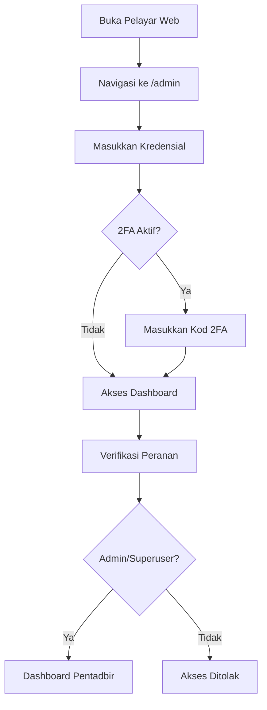

**Langkah Log Masuk:**

1. **Buka pelayar web** dan navigasi ke `https://ictserve.motac.gov.my/admin`
2. **Masukkan kredensial:**
   - E-mel: [nama]@motac.gov.my
   - Kata laluan: [kata laluan selamat]
3. **Kod 2FA** (jika diaktifkan):
   - Masukkan kod dari aplikasi authenticator
   - Atau gunakan SMS OTP
4. **Klik "Log Masuk"**
5. **Verifikasi akses** - sistem akan semak peranan pengguna

### 3.2. Dashboard Pentadbir

**Komponen Dashboard:**

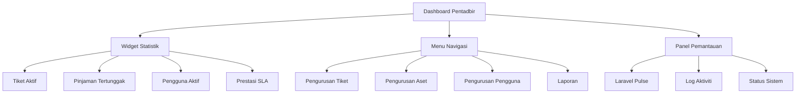

**Widget Utama:**

- **Statistik Tiket**: Terbuka, Dalam Proses, Selesai, Tertunggak
- **Status Aset**: Tersedia, Dipinjam, Lewat Tempoh, Dalam Penyelenggaraan
- **Pematuhan SLA**: Peratusan tiket yang diselesaikan dalam masa SLA
- **Prestasi AI**: Statistik penggunaan chatbot dan auto-reply

**Menu Navigasi:**

- Pengurusan Tiket Helpdesk
- Pengurusan Aset dan Pinjaman
- Pengurusan Pengguna dan Peranan
- Konfigurasi AI dan Automasi
- Laporan dan Analitik
- Tetapan Sistem (Superuser sahaja)

## 4. PENGURUSAN PENGGUNA

### 4.1. Senarai Pengguna

**Akses Senarai Pengguna:**

1. Dari dashboard, klik **"Pengurusan Pengguna"**
2. Lihat senarai lengkap pengguna dengan maklumat:
   - Nama dan e-mel
   - Peranan (Staff/Admin/Superuser)
   - Status (Aktif/Tidak Aktif)
   - Tarikh daftar terakhir
   - Bilangan tiket/pinjaman

**Fungsi Carian dan Penapis:**

- Cari mengikut nama atau e-mel
- Tapis mengikut peranan
- Tapis mengikut status aktif
- Susun mengikut tarikh daftar

### 4.2. Tambah/Kemaskini Pengguna

**Menambah Pengguna Baharu:**

1. **Klik "Tambah Pengguna"**
2. **Isi maklumat asas:**

   ```
   Nama Penuh: [Nama lengkap pengguna]
   E-mel: [nama]@motac.gov.my
   Nombor Staf: [Nombor staf MOTAC]
   Bahagian: [Pilih dari senarai]
   Jawatan: [Jawatan semasa]
   ```

3. **Tetapkan peranan:**
   - Staff: Akses asas (dashboard peribadi)
   - Admin: Pengurusan operasi harian
   - Superuser: Akses penuh sistem

4. **Konfigurasi keselamatan:**
   - Kata laluan sementara
   - Paksa tukar kata laluan pada log masuk pertama
   - Aktifkan 2FA (opsional)

5. **Simpan dan hantar e-mel jemputan**

**Mengemaskini Pengguna:**

1. **Pilih pengguna** dari senarai
2. **Klik "Edit"**
3. **Kemaskini maklumat** yang diperlukan
4. **Simpan perubahan**

**Menyahaktifkan Pengguna:**

- Tukar status kepada "Tidak Aktif"
- Pengguna tidak dapat log masuk tetapi data dikekalkan
- Untuk pemadaman kekal, hubungi Superuser

### 4.3. Pengurusan Peranan (RBAC)

**Hierarki Peranan:**

```mermaid
graph TD
    A[Superuser] --> B[Admin]
    B --> C[Staff]
    C --> D[Walk-in/Kiosk Mode (SSO Required)]
    
    A --> A1[Semua Kebenaran]
    A --> A2[Konfigurasi Sistem]
    A --> A3[Laravel Telescope]
    A --> A4[Audit Penuh]
    
    B --> B1[Pengurusan Operasi]
    B --> B2[Tiket & Aset]
    B --> B3[Laporan]
    
    C --> C1[Dashboard Peribadi]
    C --> C2[Penyerahan Borang]
    
    D --> D1[SSO Authentication Required]
    D --> D2[Borang Sahaja]
```

**Kebenaran Mengikut Peranan:**

| Fungsi | Walk-in/Kiosk Mode | Staff | Admin | Superuser |
| :--- | :---: | :---: | :---: | :---: |
| **Hantar Tiket** | ✅ (SSO Required) | ✅ | ✅ | ✅ |
| **Mohon Pinjaman** | ✅ (SSO Required) | ✅ | ✅ | ✅ |
| **Dashboard Peribadi** | ❌ | ✅ | ✅ | ✅ |
| **Urus Tiket** | ❌ | ❌ | ✅ | ✅ |
| **Urus Aset** | ❌ | ❌ | ✅ | ✅ |
| **Urus Pengguna** | ❌ | ❌ | ✅ | ✅ |
| **Laporan** | ❌ | ❌ | ✅ | ✅ |
| **Konfigurasi Sistem** | ❌ | ❌ | ❌ | ✅ |
| **Laravel Telescope** | ❌ | ❌ | ❌ | ✅ |

## 5. PENGURUSAN HELPDESK

### 5.1. Senarai Tiket

**Akses Senarai Tiket:**

1. Dari dashboard, klik **"Pengurusan Tiket"**
2. Lihat senarai tiket dengan maklumat:
   - Nombor tiket (HD[YYYY][MM][0001-9999])
   - Penghantar (nama dan e-mel)
   - Subjek dan kategori
   - Status dan keutamaan
   - Tarikh cipta dan kemaskini terakhir
   - SLA status (dalam masa/lewat)

**Penapis dan Carian:**

- Tapis mengikut status (Terbuka, Dalam Proses, Selesai, Ditutup)
- Tapis mengikut keutamaan (Rendah, Normal, Tinggi, Kritikal)
- Tapis mengikut kategori masalah
- Cari mengikut nombor tiket atau nama penghantar
- Tapis mengikut julat tarikh

### 5.2. Kemaskini Status Tiket

**Aliran Kerja Tiket:**

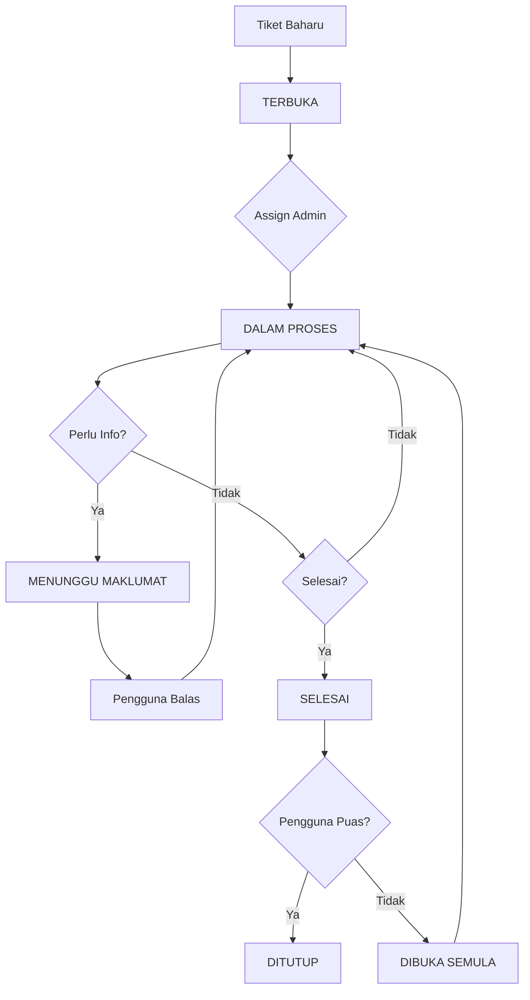

**Langkah Menguruskan Tiket:**

1. **Buka tiket** dari senarai
2. **Semak butiran:**
   - Keterangan masalah
   - Lampiran (jika ada)
   - Sejarah komunikasi
   - SLA countdown

3. **Assign tiket:**
   - Pilih admin yang bertanggungjawab
   - Tetapkan keutamaan jika perlu
   - Tambah tag untuk kategorisasi

4. **Tambah respons:**
   - Tulis balasan kepada pengguna
   - Atau tambah nota dalaman (tidak kelihatan kepada pengguna)
   - Lampirkan fail sokongan jika perlu

5. **Kemaskini status:**
   - **Dalam Proses**: Sedang diuruskan
   - **Menunggu Maklumat**: Perlu respons pengguna
   - **Selesai**: Masalah telah diselesaikan
   - **Ditutup**: Tiket selesai dan ditutup

### 5.3. Konfigurasi Kategori dan SLA

**Pengurusan Kategori Tiket:**

| Kategori | SLA Respons | SLA Penyelesaian | Keterangan |
| :--- | :--- | :--- | :--- |
| **Perkakasan** | 2 jam | 1 hari kerja | Masalah komputer, printer, dll |
| **Perisian** | 4 jam | 2 hari kerja | Aplikasi, sistem operasi |
| **Rangkaian** | 1 jam | 4 jam | Internet, intranet, WiFi |
| **Keselamatan** | 30 minit | 2 jam | Isu keselamatan kritikal |
| **Lain-lain** | 1 hari | 3 hari kerja | Permintaan umum |

**Konfigurasi SLA:**

1. Akses **"Tetapan Sistem"** (Superuser sahaja)
2. Pilih **"Konfigurasi SLA"**
3. Tetapkan masa respons dan penyelesaian untuk setiap kategori
4. Konfigurasi notifikasi automatik untuk pelanggaran SLA
5. Simpan tetapan

**Pemantauan SLA:**

- Dashboard menunjukkan peratusan pematuhan SLA
- Notifikasi automatik untuk tiket yang hampir melanggar SLA
- Laporan bulanan prestasi SLA

## 6. PENGURUSAN ASET DAN PINJAMAN

### 6.1. Inventori Aset

**Akses Inventori:**

1. Dari dashboard, klik **"Pengurusan Aset"**
2. Lihat senarai aset dengan maklumat:
   - Kod aset dan nama
   - Kategori dan jenama
   - Status (Tersedia, Dipinjam, Rosak, Penyelenggaraan)
   - Lokasi semasa
   - Sejarah pinjaman

**Menambah Aset Baharu:**

1. **Klik "Tambah Aset"**
2. **Isi maklumat aset:**

   ```
   Nama Aset: [Contoh: Laptop Dell Latitude 5520]
   Kategori: [Laptop/Desktop/Printer/Projector/dll]
   Jenama: [Dell/HP/Canon/dll]
   Model: [Latitude 5520]
   Nombor Siri: [Nombor siri dari pengilang]
   ```

3. **Maklumat teknikal:**

   ```
   Spesifikasi: [CPU, RAM, Storage, dll]
   Tahun Beli: [2024]
   Nilai Asal: [RM 3,500.00]
   Vendor: [Nama syarikat pembekal]
   ```

4. **Lokasi dan status:**

   ```
   Lokasi: [Bilik Server/Stor ICT/dll]
   Status: [Tersedia]
   Catatan: [Maklumat tambahan]
   ```

5. **Jana kod QR** untuk aset
6. **Simpan** maklumat aset

### 6.2. Pengurusan Permohonan Pinjaman

**Senarai Permohonan:**

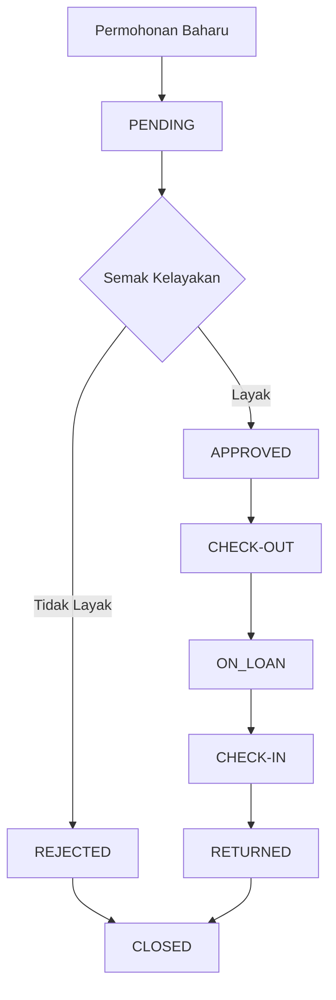

**Status Permohonan:**

| Status | Keterangan | Tindakan Admin |
| :--- | :--- | :--- |
| **PENDING** | Menunggu kelulusan | Semak dan luluskan/tolak |
| **APPROVED** | Diluluskan, menunggu ambil | Proses check-out |
| **REJECTED** | Ditolak | Hantar notifikasi sebab |
| **ON_LOAN** | Sedang dipinjam | Pantau tarikh pulang |
| **OVERDUE** | Lewat pulang | Hantar peringatan |
| **RETURNED** | Telah dipulangkan | Tutup permohonan |

**Memproses Permohonan:**

1. **Buka permohonan** dari senarai
2. **Semak butiran:**
   - Maklumat pemohon
   - Aset yang dimohon
   - Tempoh pinjaman
   - Tujuan penggunaan
   - Pegawai bertanggungjawab

3. **Buat keputusan:**
   - **Luluskan**: Jika memenuhi syarat
   - **Tolak**: Jika tidak memenuhi syarat atau aset tidak tersedia

4. **Hantar notifikasi** kepada pemohon

### 6.3. Proses Check-in/Check-out Aset

**Proses Check-out:**

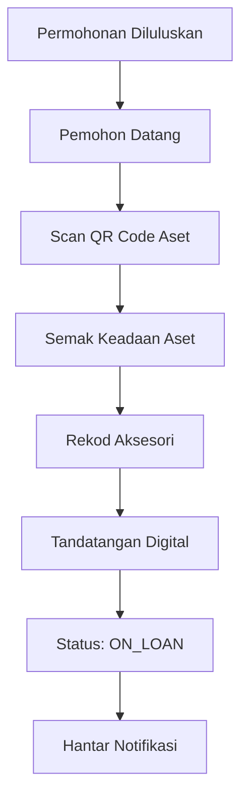

**Langkah Check-out:**

1. **Buka permohonan** berstatus APPROVED
2. **Klik "Check-Out"**
3. **Scan kod QR aset** atau pilih manual
4. **Semak keadaan aset:**
   - Fizikal (baik/rosak)
   - Kelengkapan (charger, beg, dll)
   - Fungsi (hidup/mati)

5. **Rekod aksesori:**
   - ✅ Beg laptop
   - ✅ Charger/adapter
   - ✅ Tetikus
   - ✅ Kabel (HDMI/VGA/USB)
   - ✅ Remote (untuk projector)
   - ❌ Lain-lain: [nyatakan]

6. **Sahkan pegawai bertanggungjawab:**
   - Jika pemohon sendiri: auto-fill
   - Jika pegawai lain: masukkan maklumat

7. **Tandatangan digital** pemohon
8. **Simpan** - status bertukar ke ON_LOAN

**Proses Check-in:**

1. **Cari permohonan** menggunakan nombor atau scan QR
2. **Klik "Check-In"**
3. **Semak keadaan aset:**
   - Bandingkan dengan keadaan semasa check-out
   - Rekod sebarang kerosakan
   - Ambil gambar jika perlu

4. **Semak aksesori:**
   - Tandakan aksesori yang dipulangkan
   - Rekod aksesori yang hilang/rosak

5. **Jika ada masalah:**
   - Rekod dalam sistem
   - Jana tiket helpdesk automatik
   - Notifikasi pemohon tentang caj (jika berkenaan)

6. **Tandatangan digital** pemohon
7. **Simpan** - status bertukar ke RETURNED

## 7. MODUL AI DAN AUTOMASI

### 7.1. Konfigurasi Chatbot FAQ

**Seni Bina AI Hibrid:**

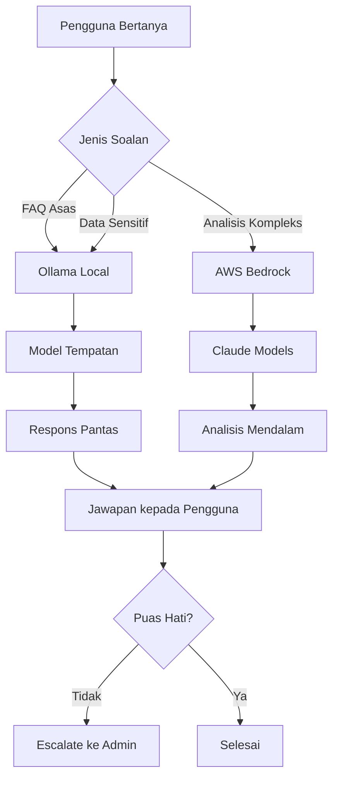

**Pengurusan FAQ:**

1. **Akses "Pengurusan AI"** dari menu utama
2. **Pilih "FAQ Management"**
3. **Tambah FAQ baharu:**

   ```
   Soalan: [Bagaimana cara memohon pinjaman laptop?]
   Jawapan: [Langkah-langkah terperinci...]
   Kategori: [Pinjaman Aset]
   Tag: [laptop, pinjaman, prosedur]
   Status: [Aktif]
   ```

4. **Kemaskini FAQ sedia ada:**
   - Edit soalan atau jawapan
   - Tambah tag untuk carian yang lebih baik
   - Aktifkan/nyahaktifkan FAQ

5. **Pantau prestasi FAQ:**
   - Lihat soalan yang kerap ditanya
   - Analisis kepuasan pengguna
   - Kenal pasti gap dalam knowledge base

**Konfigurasi Model AI:**

| Model | Kegunaan | Konfigurasi |
| :--- | :--- | :--- |
| **Ollama (Local)** | FAQ asas, data sensitif | Model: llama2, Temperature: 0.7 |
| **AWS Bedrock Claude** | Analisis kompleks | Model: Claude-3, Max tokens: 1000 |

### 7.2. Templat Auto-Reply

**Sistem Auto-Reply:**

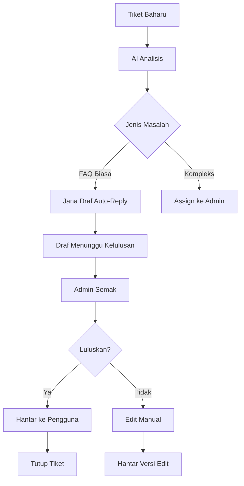

**Menguruskan Auto-Reply:**

1. **Akses "Auto-Reply Management"**
2. **Lihat draf yang menunggu:**
   - Tiket yang berkaitan
   - Draf jawapan AI
   - Tahap keyakinan AI
   - Masa dijana

3. **Semak draf:**
   - Baca jawapan yang dijana
   - Semak ketepatan maklumat
   - Pastikan nada yang sesuai

4. **Buat keputusan:**
   - **Luluskan & Hantar**: Jika jawapan tepat
   - **Edit & Hantar**: Jika perlu penambahbaikan
   - **Tolak**: Jika tidak sesuai, assign ke admin

5. **Pantau keberkesanan:**
   - Kadar penerimaan pengguna
   - Masa penyelesaian
   - Feedback pengguna

**Templat Auto-Reply:**

| Kategori | Template | Contoh |
| :--- | :--- | :--- |
| **Password Reset** | Panduan reset kata laluan | "Untuk reset kata laluan, sila..." |
| **Printer Issue** | Troubleshooting printer | "Cuba langkah berikut..." |
| **Network Problem** | Semakan rangkaian | "Semak sambungan WiFi..." |
| **Software Install** | Panduan pemasangan | "Untuk memasang perisian..." |

## 8. LAPORAN DAN ANALISIS

### 8.1. Penjanaan Laporan

**Jenis Laporan Tersedia:**

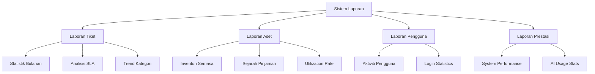

**Menjana Laporan:**

1. **Akses "Laporan"** dari menu utama
2. **Pilih jenis laporan:**
   - Laporan Tiket Helpdesk
   - Laporan Pinjaman Aset
   - Laporan Prestasi Sistem
   - Laporan Aktiviti Pengguna

3. **Tetapkan parameter:**

   ```
   Julat Tarikh: [01/12/2025 - 31/12/2025]
   Format: [PDF/Excel/CSV]
   Kategori: [Semua/Perkakasan/Perisian/dll]
   Status: [Semua/Aktif/Selesai]
   ```

4. **Klik "Jana Laporan"**
5. **Muat turun** fail yang dijana

**Laporan Automatik:**

- Laporan bulanan dihantar automatik ke e-mel admin
- Laporan mingguan prestasi SLA
- Alert untuk trend yang tidak normal

### 8.2. Pemantauan Prestasi (Laravel Pulse)

**Dashboard Pulse:**

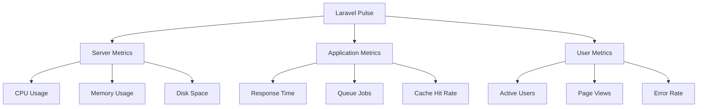

**Metrik Prestasi:**

| Metrik | Target | Amaran | Kritikal |
| :--- | :--- | :--- | :--- |
| **Response Time** | < 500ms | > 1s | > 3s |
| **CPU Usage** | < 70% | > 80% | > 90% |
| **Memory Usage** | < 80% | > 90% | > 95% |
| **Queue Jobs** | < 100 pending | > 500 | > 1000 |
| **Error Rate** | < 1% | > 5% | > 10% |

**Menggunakan Pulse:**

1. **Akses Pulse** dari dashboard admin
2. **Pantau metrik real-time:**
   - Beban pelayan semasa
   - Masa respons aplikasi
   - Status queue jobs
   - Pengguna aktif

3. **Analisis trend:**
   - Lihat graf prestasi 24 jam
   - Kenal pasti masa puncak penggunaan
   - Pantau trend jangka panjang

4. **Alert dan tindakan:**
   - Terima notifikasi jika metrik melebihi had
   - Ambil tindakan pencegahan
   - Hubungi sokongan teknikal jika perlu

## 9. PENYELENGGARAAN DAN SOKONGAN

### 9.1. Log Audit

**Sistem Dual Audit:**

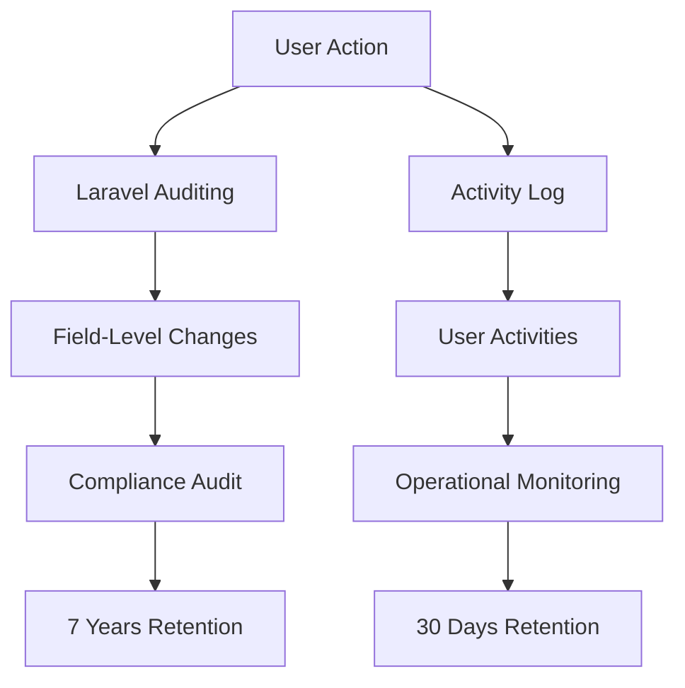

**Jenis Log Audit:**

| Jenis | Kandungan | Retention | Tujuan |
| :--- | :--- | :--- | :--- |
| **Laravel Auditing** | Perubahan data field-level | 7 tahun | Compliance PDPA |
| **Activity Log** | Aktiviti pengguna | 30 hari | Monitoring operasi |
| **System Log** | Error dan performance | 90 hari | Troubleshooting |
| **Security Log** | Login attempts, access | 1 tahun | Keselamatan |

**Mengakses Log Audit:**

1. **Akses "Log Audit"** (Superuser sahaja)
2. **Pilih jenis log:**
   - Audit Trail (perubahan data)
   - Activity Log (aktiviti pengguna)
   - System Log (error sistem)
   - Security Log (keselamatan)

3. **Tapis log:**

   ```
   Tarikh: [01/12/2025 - 31/12/2025]
   Pengguna: [admin@motac.gov.my]
   Tindakan: [CREATE/UPDATE/DELETE]
   Model: [HelpdeskTicket/User/Asset]
   ```

4. **Eksport log** untuk analisis lanjut

### 9.2. Hubungi Sokongan Teknikal

**Saluran Sokongan:**

| Tahap | Saluran | Masa Respons | Kegunaan |
| :--- | :--- | :--- | :--- |
| **L1 - Asas** | Sistem tiket | 4 jam | Masalah pengguna biasa |
| **L2 - Teknikal** | E-mel admin | 2 jam | Isu konfigurasi |
| **L3 - Kritikal** | Telefon hotline | 30 minit | System down, security |
| **L4 - Kecemasan** | WhatsApp | 15 minit | Disaster recovery |

**Maklumat untuk Sokongan:**

Apabila menghubungi sokongan, sediakan:

- **Maklumat sistem**: Versi, browser, OS
- **Keterangan masalah**: Langkah yang menyebabkan error
- **Screenshot**: Tangkapan skrin error message
- **Log files**: Export dari Pulse/Telescope jika ada
- **Impact**: Bilangan pengguna terjejas
- **Urgency**: Tahap kecemasan (Low/Medium/High/Critical)

## 10. PENYELESAIAN MASALAH

### 10.1. Masalah Lazim

**Masalah Login:**

| Masalah | Sebab | Penyelesaian |
| :--- | :--- | :--- |
| **Cannot login** | Wrong credentials | Reset password, check email format |
| **2FA not working** | Time sync issue | Sync device time, regenerate 2FA |
| **Session expired** | Timeout reached | Login again, extend session |
| **Access denied** | Wrong role | Check user role, contact superuser |

**Masalah Prestasi:**

| Gejala | Kemungkinan Sebab | Tindakan |
| :--- | :--- | :--- |
| **Sistem lambat** | High server load | Check Pulse metrics, restart services |
| **Timeout errors** | Database overload | Check slow queries, optimize |
| **Queue stuck** | Redis connection | Restart queue workers |
| **Memory errors** | Resource exhaustion | Clear cache, restart application |

**Masalah AI:**

| Masalah | Sebab | Penyelesaian |
| :--- | :--- | :--- |
| **AI tidak respons** | Ollama server down | Check Ollama service status |
| **Jawapan tidak tepat** | Outdated knowledge base | Update FAQ database |
| **Auto-reply gagal** | Template error | Check template configuration |
| **Bedrock error** | API limit/credentials | Check AWS credentials and limits |

**Langkah Troubleshooting:**

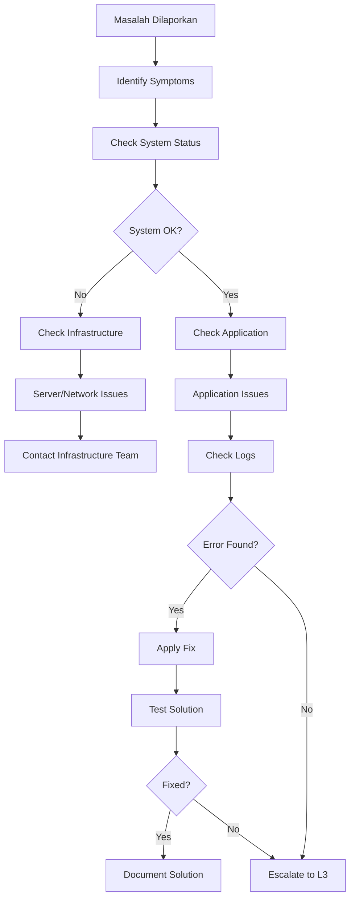

**Prosedur Kecemasan:**

1. **Assess Impact**: Tentukan tahap kecemasan
2. **Immediate Action**: Ambil tindakan segera jika perlu
3. **Notify Stakeholders**: Maklumkan kepada pengguna terjejas
4. **Escalate**: Hubungi sokongan mengikut tahap
5. **Document**: Rekod masalah dan penyelesaian
6. **Follow-up**: Pastikan masalah tidak berulang

---

**PENUTUP**

Manual pentadbir ini akan dikemaskini mengikut keperluan dan perubahan sistem. Untuk sokongan lanjut atau cadangan penambahbaikan, sila hubungi pasukan BPM MOTAC melalui saluran yang ditetapkan.

**TAMAT DOKUMEN / END OF DOCUMENT**

*Dokumen ini adalah hak milik Kementerian Pelancongan, Seni dan Budaya Malaysia (MOTAC) dan tertakluk kepada Akta Rahsia Rasmi 1972.*
