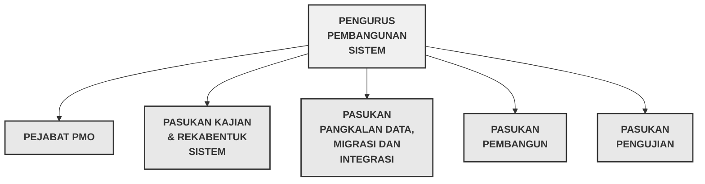
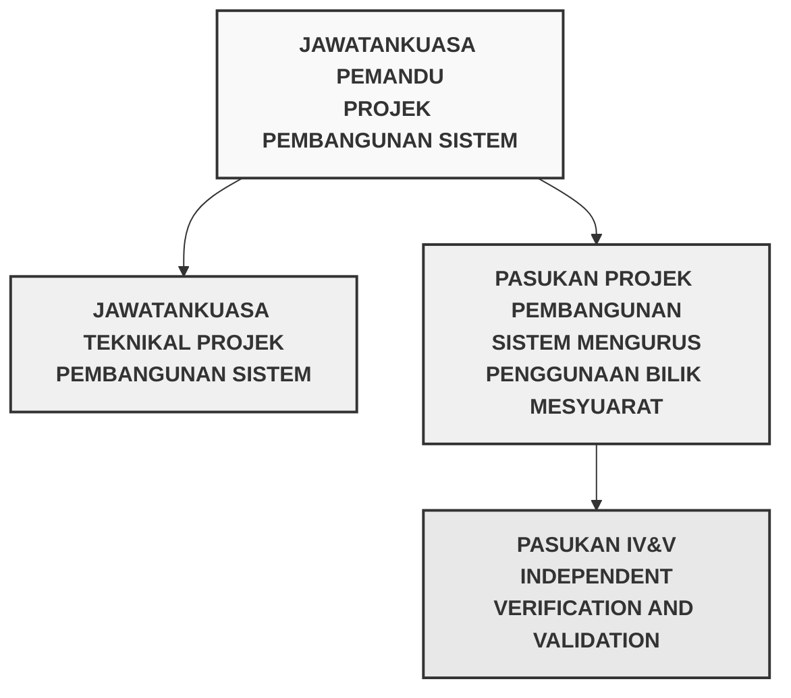
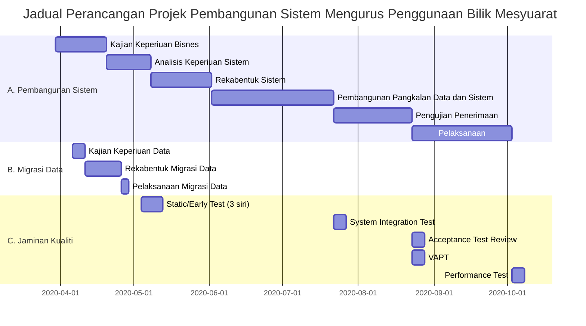

# PELAN PEMBANGUNAN SISTEM (PPS)

**Rujukan:** SMPBM / PPS  
**Tajuk:** Pelan Pembangunan Sistem (PPS)  
**Mukasurat:** 1

---

## MAKLUMAT DOKUMEN

| Perkara | Butiran |
| :--- | :--- |
| **Nama Projek** | Sistem Mengurus Penggunaan Bilik Mesyuarat |
| **Nama Agensi** | MAMPU |
| **Agensi Induk** | Jabatan Perdana Menteri |
| **Versi Dokumen** | 1.0 |
| **Tarikh Dokumen** | 30 MAC 2020 |

---

## KETERANGAN DOKUMEN

Dokumen ini merupakan pelan bagi perancangan dan pembangunan **Sistem Mengurus Penggunaan Bilik Mesyuarat**. Ia bertujuan untuk menerangkan secara terperinci pendekatan dan perancangan pembangunan sistem aplikasi yang akan dibangunkan merangkumi serahan projek, pengendalian projek, perancangan proses teknikal seperti pendekatan projek, perkakasan dan perisian yang akan digunakan, dokumen-dokumen yang akan disediakan serta jadual pelaksanaan pembangunan Sistem Mengurus Penggunaan Bilik Mesyuarat.

---

## SEMAKAN DAN PENGESAHAN DOKUMEN

### Disemak Oleh

| Nama | Jawatan | Tandatangan | Tarikh |
| :--- | :--- | :--- | :--- |
| [Nama Penyemak] | Pengurus Projek | | |

### Disahkan Oleh

| Nama | Jawatan | Tandatangan | Tarikh |
| :--- | :--- | :--- | :--- |
| [Nama Pemilik Bisnes] | Pengarah Bahagian | | |

---

## KAWALAN DOKUMEN

| No. Versi | Tarikh | Ringkasan Pindaan | Penyedia |
| :---: | :---: | :--- | :--- |
| 1.0 | 20 Mac 2020 | Dokumen versi pertama selesai disediakan | Pn Nik Zalbiha binti Nik Mat |

---

## KANDUNGAN

1. [PENGENALAN](#pengenalan)
   - 1.1 [Tujuan Projek](#tujuan-projek)
   - 1.2 [Skop Projek](#skop-projek)
   - 1.3 [Serahan Projek](#serahan-projek)

2. [PENGENDALIAN PROJEK PEMBANGUNAN APLIKASI](#pengendalian-projek-pembangunan-aplikasi)
   - 2.1 [Model Proses](#model-proses)
   - 2.2 [Struktur Organisasi Pasukan Projek](#struktur-organisasi-pasukan-projek)
   - 2.3 [Peranan dan Tanggungjawab](#peranan-dan-tanggungjawab)

3. [PROSES PENGURUSAN](#proses-pengurusan)
   - 3.1 [Andaian, Kebergantungan, Kekangan](#andaian-kebergantungan-kekangan)
   - 3.2 [Risiko](#risiko)
   - 3.3 [Pemantauan dan Kawalan](#pemantauan-dan-kawalan)

4. [PROSES TEKNIKAL](#proses-teknikal)
   - 4.1 [Pendekatan, Teknik dan Alat Bantu](#pendekatan-teknik-dan-alat-bantu)
   - 4.2 [Dokumen Aplikasi](#dokumen-aplikasi)
   - 4.3 [Dokumen Sokongan](#dokumen-sokongan)

5. [PAKEJ KERJA, JADUAL DAN PERUNTUKAN](#pakej-kerja-jadual-dan-peruntukan)
   - 5.1 [Pakej Kerja, Kebergantungan dan Keperiuan Sumber](#pakej-kerja-kebergantungan-dan-keperiuan-sumber)
   - 5.2 [Peruntukan Kos](#peruntukan-kos)
   - 5.3 [Jadual Perancangan](#jadual-perancangan)

6. [KOMPONEN TAMBAHAN](#komponen-tambahan)
   - 6.1 [Pelan Keselamatan](#pelan-keselamatan)
   - 6.2 [Pelan Latihan Teknikal](#pelan-latihan-teknikal)

---

# 1. PENGENALAN

## 1.1 Tujuan Projek

Projek Pembangunan Sistem Mengurus Penggunaan Bilik Mesyuarat adalah merupakan inisiatif baru bagi menambahbaik Sistem Pengurusan Bilik Mesyuarat sedia ada bagi menangani isu-isu semasa dalam pentadbiran dan pengurusan bilik mesyuarat dengan teratur dan efisyen. Antara isu-isu yang perlu diberi perhatian dan ditangani dengan adanya Sistem Mengurus Penggunaan Bilik Mesyuarat adalah:

a) Semakan kekosongan dan kesediaan bilik mesyuarat yang diperoleh oleh warga hanya boleh merujuk kepada Pegawai Tadbir yang tugaskan sahaja. Ini bergantung sepenuhnya kepada Pegawai Tadbir dalam kelulusan penggunaan bilik.

b) Sering berlaku pertindihan tempahan bilik mesyuarat disebabkan oleh kesilapan yang dilakukan oleh Pegawai Tadbir semasa proses kelulusan tempahan.

c) Bilik mesyuarat tidak digunakan sepenuhnye kerana proses pembatalan segera tidak dilakukan kerana bergantung kepada tindakan Pegawai Tadbir.

d) Laporan kerosakan bilik mesyuarat tidak disalurkan dengan segera kepada unit selenggara menyebabkan bilik mesyuarat tidak boleh digunakan atau penggunaan tidak sempurna. Status kesediaan bilik mesyuarat sukar dipantau.

e) Laporan penggunaan bilik mesyuarat adalah tidak tepat bagi perancangan keperiuan pejabat.

## 1.2 Skop Projek

Antara skop projek yang perlu diambilkira adalah:

a) Semua bilik merangkumi bilik mesyuarat dan bilik perbincangan yang sediakan oleh agensi, dan data bilik mesyuarat sedia ada perlu dimigrasikan dari sistem sedia ada.

b) Permohonan penggunaan bilik boleh dilakukan secara atas talian pada bila-bila masa oleh semua warga agensi dan kelulusan dilakukan oleh pegawai tadbir.

c) Sistem yang akan dibangunkan perlu berinteraksi dengan Sistem Selepgara Aset agensi bagi pelaporan kerosakan bilik dengan kadar segera.

d) Sistem berupaya menjana laporan yang diperoleh oleh pengurusan agensi bagi tujuan perancangan keperiuan.

## 1.3 Serahan Projek

**Jadual 1** merupakan senarai serahan projek dan peringkat pegawai yang bertanggungjawab dalam menyedia dan mengesah/melulus dokumen. Setiap dokumen perlu diserahkan dengan salinan softcopy dan 1 salinan dokumen ditandatangani.

### Jadual 1: Senarai Serahan Projek

| Bil | Nama Serahan | Penyedia | Pengesah |
| :--- | :--- | :--- | :--- |
| 1. | Spesifikasi Keperluan Bisnes (BRS) | Pasukan Kajian Keperluan & Rekabentuk | Pemilik Bisnes ☐ Timbalan Penolong Pengarah, Unit Aset, BKP |
| 2. | Spesifikasi Keperluan Sistem (SRS) | Pasukan Kajian Keperluan & Rekabentuk | |
| 3. | Spesifikasi Rekabentuk Sistem (SDS) | Pasukan Kajian Keperluan & Rekabentuk | Pemilik Bisnes ☐ Timbalan Penolong Pengarah, Unit Aset, BKP |
| 4. | Pelan Migrasi Data | Pasukan Pangkalan Data, Migrasi dan Integrasi data | Pengurusan Pembangunan Sistem |
| 5. | Spesifikasi Migrasi Data | Pasukan Pangkalan Data, Migrasi dan Integrasi data | Pengurusan Pembangunan Sistem |
| 6. | Pelan Integrasi Sistem | Pasukan Pangkalan Data, Migrasi dan Integrasi data | Pengurusan Pembangunan Sistem |
| 7. | Spesifikasi Integrasi Sistem | Pasukan Pangkalan Data, Migrasi dan Integrasi data | Pengurusan Pembangunan Sistem |
| 8. | Pelan Induk Ujian Sistem | Pasukan Pengujian | Pengurusan Pembangunan Sistem |
| 9. | Laporan Ujian Penerimaan (UAT, PAT dan FAT) | Pasukan Pengujian | Pengurusan Pembangunan Sistem |
| 10. | Dokumentasi Kod Sumber dan Pangkalan Data | Pasukan Pembangun | Pengurusan Pembangunan Sistem |
| 11. | Manual Pengguna | Pasukan Kajian Keperluan & Rekabentuk | Pengurusan Pembangunan Sistem |

---

# 2. PENGENDALIAN PROJEK PEMBANGUNAN APLIKASI

Penetapan pengendalian projek adalah penting bagi memastikan projek dapat dilaksanakan dengan lancar dan teratur.

## 2.1 Model Proses

### a) Proses Pembangunan

Pembangunan Sistem dilaksana sepenuhnye secara dalaman oleh pegawai IT agensi. Pelaksanaan pembangunan projek dilakukan mengikut modul. Pembangunan modul ini perlu mengambilkira keperiuan integrasi data antara modul dilaksanakan.

### b) Metodologi Pembangunan

Pembangunan sistem dilakukan melalui pendekatan **Rapid Application Development** yang merangkumi 4 fasa utama iaitu merancang keperluan, reka bentuk sistem, pembangunan dan pelaksanaan. Skop dan liputan keperiuan bisnes perlu didokumen dan dimaktamad terlebih dahulu sebelum **prototype** dibangunkan. Penglibatan dan kerjasama rapat antara pasukan pembangunan dan **subject matter expert (SME)** bisnes adalah diperiukan dalam tempoh pembangunan serta pasukan pembangunan yang mahir adalah faktor kejayaan projek.

### c) Standard

Standard mendokumentasi serahan adalah merujuk kepada Panduan Kejuruteraan Sistem Aplikasi Sektor Awam (KRISA) yang dikeluarkan oleh pihak Kerajaan. Di akhir fasa pembangunan projek, pasukan perlu melengkapkan dokumentasi serahan yang diperoleh seperti yang dinyatakan dalam para 1.3.

## 2.2 Struktur Organisasi Pasukan Projek

Struktur organisasi pasukan pembangunan sistem aplikasi ini diketua oleh Pengurus Pembangunan Sistem dan dibantukan oleh 5 pasukan utama seperti di Rajah 1 di bawah.

**Rajah 1: Organisasi Pasukan Projek**

## 2.3 Peranan dan Tanggungjawab

Berdasarkan struktur organisasi pasukan projek di atas, **Jadual 2** menerangkan keahlian dan tanggungjawab pasukan.

### Jadual 2: Peranan dan Tanggungjawab

| **PASUKAN** | **KEAHLIAN** | **TANGGUNGJAWAB** |
| :--- | :--- | :--- |
| **PENGURUS PEMBANGUNAN SISTEM** | Pn Rohiza Ahmad Timbalan Pengarah (Pembangunan Sistem) Bahagian Perunding ICT, MAMPU | ☐ Merancang, mengurus dan memantau pembangunan projek ☐ Melaporkan kemajuan projek kepada Pengurusan atasan agensi dan juga tadbir urus projek |
| **PEJABAT PMO** | Pn Nik Zalbiha binti Nik Mat Ketua Penolong Pengarah | ☐ Menanggani isu dan masalah dalam projek pembangunan sistem ☐ Mengesah dokumentasi serahan sistem ☐ Membantu Pengurus Pembangunan Sistem ☐ Menyedia laporan kemajuan projek ☐ Mengurus program berkaitan aktiviti projek pembangunan ☐ Mentadbir dokumentasi serahan |
| **PASUKAN KAJIAN & REKABENTUK SISTEM** | Muhammad Hadri Bin Basri Penolong Pengarah Kanan, BPI ☐ Nik Zalbiha binti Nik Mat Ketua Penolong Pengarah Kanan, BPI | ☐ Melaksanakan kajian keperiuan bisnes dan penguna, menganalisis dan merekabentuk sistem ☐ Menyediakan dokumentasi BRS, SRS dan SDS ☐ Menyediakan Manual Pengguna sistem yang dibangunkan. |
| **PASUKAN PANGKALAN DATA, MIGRASI DAN INTEGRASI** | Pn. Nur Sharmini Alexander Penolong Pengarah Kanan, BPI ☐ YBrs. Dr Razatulshima Binti Ghazali Penolong Pengarah Kanan, BPI | ☐ Merekabentuk Pangkalan Data logika dan mendokumentasikan ☐ Membangun Pangkalan Data Fizikal ☐ Menyediakan Pelan dan Spesifikasi keperiuan Migrasi Data ☐ Menyediakan Pelan dan Spesifikasi Keperiuan Integrasi Data |
| **PASUKAN PEMBANGUN** | Pn. Nor Zulati Binti Embong, PPTM, BPI ☐ Cik Ruzana bt Awaludi PPTM, BPI | ☐ Membangunkan pemprogram sistem sepertimasa Spesifikasi Rekabentuk Sistem (SDS), Spesifikasi Migrasi Data dan Spesifikasi Integrasi Data ☐ Melaksana Ujian Sistem ☐ Menyediakan dokumentasi kod sumber dan Pangkalan data |
| **PASUKAN SUBJECT MATTER EXPERT (SME)** | En Sabahan bin Mohd Timbalan Pengarah, BKP ☐ Pn Shulaihi binti Kamal Penolong Pengarah, Unit Pentadbiran, BKP ☐ Pn Yanti bin Yaacon, Penolong Pengarah, Unit Selenggara Aset, BKP | ☐ Menyampaikan semua keperiuan fungsi bisnes yang diperoleh untuk pembangunan sistem ☐ Menyemak spesifikasi keperiuan bisnes (BRS) dan keperiuan sistem (SRS). ☐ Melaksanakan ujian penerimaan |
| **PASUKAN PENGUJIAN** | Cik Myzatul Akmam Binti Sapaat Ketua Penolong Pengarah, BPI ☐ Pn Sri Lakshmi a/p Kanniah Ketua Penolong Pengarah, BPI | ☐ Menyediakan Pelan ujian penerimaan dan Laporan Ujian setiap kali sesi ujian penerimaan dilakukan (UAT, PAT, FAT) ☐ Mengurus Ujian Penerimaan Pengguna |
| **PEMILIK SISTEM** | En. Ahmad Marzuki Pengarah Bahagian Khidmat Pengurusan | ☐ Mengesah penerimaan segala dokumentasi serahan sistem ☐ Menerima sistem yang dibangun |

---

# 3. PROSES PENGURUSAN

## 3.1 Andaian, Kebergantungan, Kekangan

### a) Andaian

Pembangunan sistem berjaya dilaksanakan dalam tempoh yang telah ditetapkan dengan andaian bahawa:

i) Pemilik proses jelas dengan matlamat dan fungsi bisnes yang akan dibangunkan.

ii) Ahli Pasukan Projek perlu memberi komitmen sepenuh masa dan tiada pertukaran pegawai dalam tempoh projek.

iii) **Subject Matter Expert (SME)** dapat memperuntukkan masa dan perlu bekerjasama dalam pelaksanaan projek ini.

iv) Tiada sebarang perubahan kepada prosidur kerja sepanjang tempoh pembangunan dan pelaksanaan projek.

### b) Kebergantungan

Kejayaan pembangunan sistem adalah sangat bergantung kepada perkara berikut:

i) Perolehan dan kesediaan persekitaran sistem mengikut masa yang diperiukan.

ii) Setiap ahli pasukan adalah mempunyai kemahiran dalam bidang tugas masing-masing.

iii) Komitmen pasukan dan ketersediaan platform MyGDX dalam pembangunan dan pelaksanaan integrasi sistem.

### c) Kekangan

Tiada kekangan khusus yang membawa kepada ketidak jayaan pembangunan sistem dalam tempoh yang ditetapkan dengan andaian pasukan pembangunan sistem adalah berkemahiran dan penglibatan sepenuh masa, disamping kerjasama daripada SME yang komited.

## 3.2 Risiko

Risiko dalam pembangunan sistem adalah perlu diberi perhatian demi kejayaan pembangunan sistem. Risiko dalam pembangunan sistem terbahagi kepada 2 kategori iaitu risiko dalam dan risiko luaran. Senarai risiko dalaman dan risiko luaran yang dikenalpasti, tahap kemungkinan dan pelan mitigasi adalah seperti di **Jadual 3**.

### Jadual 3: Risiko dan Pelan Mitigasi

#### RISIKO DALAMAN

| Bil | Risiko | Tahap Risiko | Pelan Mitigasi |
| :--- | :--- | :---: | :--- |
| 1 | Pertukaran SME yang membawa kepada inisiatif baru dalam keperiuan sistem | Tinggi | Sekira ada pertambahan/perubahan ciri-ciri sistem yang melibatkan tempoh pembangunan, jadual pelaksanaan perlu dikaji semula dan perlu mendapat persetujuan dari Jawatankuasa Teknikal Projek. |
| 2 | Pertukaran ahli Pasukan Projek yang mahir dalam tempoh pembangunan | Sederhana | Pertukaran perlu dimaklumkan dengan lebih awal dengan pengganti segera dan terdapat masa/tempoh untuk laksana pemindahan tugas |
| 3 | Tiada komitmen dari pihak ketua dalam integrasi sistem | Tinggi | Pihak ketiga perlu dimaktum dan mendapat kerjasama dari awal projek. Pasukan tetap perlu dilantik dan bersedia dalam proses dan pendekatan integrasi sistem yang akan dilaksanakan. |

#### RISIKO LUARAN

| Bil | Risiko | Tahap Risiko | Pelan Mitigasi |
| :--- | :--- | :---: | :--- |
| 1 | Perubahan kepada Peraturan Kerajaan dalam pentadbiran aset (Bilk Mesyuarat) | Tinggi | Perubahan fungsi bisnis/sistem akan mengubah pelan pembangunan. Perlu dibentang dalam Jawatankuasa Pemandu Projek untuk persetujuan. |
| 2 | Perolehan persekitaran sistem dan serta persiaan yang diperoleh tidak diluluskan pengguna | Tinggi | Mengenalpasti keperiuan dari awal dan mendapat kelulusan secara bertulis danpada pihak pembekal (PDSA) |

### Tahap Risiko

| Tahap Risiko | Keterangan |
| :--- | :--- |
| Tinggi | Risiko tinggi, pelan tindakan yang lengkap dan teratur diperlukan untuk kelulusan penggurusan projek |
| Sederhana | Risiko sederhana, perlu diurusdan diberi perhatian oleh Pengurus Pembangunan Sistem |
| Rendah | Risiko rendah, hanya diuruskan oleh pasukan mengikut prosidur. |

## 3.3 Pemantauan dan Kawalan

### a) Struktur Tadbir Urus

Struktur pelaporan dan kawalan bagi projek ini adalah dibahagi kepada 2 peringkat iaitu kawalan dari aspek kemajuan projek dan kawalan dari aspek kualiti produk. **Rajah 2** merupakan struktur pelaporan dan kawalan Pembangunan sistem.

**Rajah 2: Struktur Pelaporan dan Kawalan Pembangunan Sistem**

**i) Kawalan projek, pasukan perlu melaporkan kepada Jawatankuasa Teknikal Projek dan seterusnya kepada Jawatankuasa Pemandu Projek mengikut kawalan projek yang digariskan dalam Panduan Pengurusan Projek ICT (PriSA). Pelaporan ini perlulah merangkumi status pembangunan dan isu-isu dalam proses pembangunan sistem yang perlu diputuskan. Sekiranya ujudnya permintaan diluar spesifikasi, apakah lindakan perlu dibuat, dipantau dan perlu dikawai.**

**ii) Kawalan produk dilaksanakan oleh Pasukan IV&V yang dilantik untuk melihat dan mengawal kualiti serahan yang di hasilkan sepanjang tempoh projek. Kawalan produk adalah melalui aktiviti-aktiviti validasi dan varifikasi yang ditetapkan berdasarkan permintaan dan keperiuan pengguna yang dipersetujui. Kawalan produk ini dibawah kawalan Pengurus/Ketua Pembangunan Sistem.**

### b) Kaedah Pelaporan

Kaedah pelaporan adalah melalui mesyuarat pasukan atau mesyuarat jawatankuasa yang diaturkan dan kekerapan adalah seperti di **Jadual 4** dibawah.

### Jadual 4: Kekerapan Pelaporan

| Bil | **PERINGKAT PELAPORAN** | **KEKERAPAN SETAHUN** |
| :--- | :--- | :--- |
| 1 | Pasukan Projek | Setiap 2 minggu |
| 2 | Jawatankuasa Teknikal Projek | Setiap 1 bulan |
| 3 | Jawatankuasa Pemandu Projek | Setiap 3 bulan |

### c) Template Pelaporan

Oleh kerana projek ini dilaksanakan secara dalaman sepenuhnye dan menguna pakat infrastruktur ICT sedia ada, maka 2 jenis pelaporan yang perlu dikemukakan adalah:

#### i) Pencapaian Status Fizikal Pembangunan Projek

Berdasarkan serahan, ianya perlu disampaikan dalam bentuk s-curve sasaran vs pencapaian, serta template pencapaian seperti **Jadual 5**.

### Jadual 5: Template Pelaporan Status Pembangunan

| **AKTIVITI SERAHAN** | **TARIKH PELAKSANAAN** | **% WAJARAN** | **% SELESAI** | **CATATAN STATUS** |
| :--- | :--- | :--- | :--- | :--- |
| | | | | |
| | | | | |
| | | | | |
| | | | | |
| | | | | |
| | | | | |

#### ii) Senarai isu-isu yang perlu keputusan

**Jadual 6** adalah format pelaporan.

### Jadual 6: Template Pelaporan Isu

| Bil | **ISU-ISU** | **CADANGAN / ALTERNATIF PENYELESAIAN** |
| :--- | :--- | :--- |
| | | |
| | | |
| | | |
| | | |
| | | |
| | | |

---

# 4. PROSES TEKNIKAL

## 4.1 Pendekatan, Teknik dan Alat Bantu

Persekitaran sistem, tools dan perisian, metodologi dan pendekatan penentuan kualiti sistem yang akan digunakan dalam pembangunan sistem ini adalah:

### a) Persekitaran sistem

Bagi tujuan projek pembangunan sistem ini memerlukan 3 persekitaran sistem iaitu **Persekitaran Pembangunan** bagi tujuan pembangunan dan pengujian integrasi modul/unit; **Persekitaran Pengujian (staging)** bagi tujuan ujian penerimaan pengguna (UAT) ; dan **Persekitaran Produksi** bagi tujuan aktiviti PAT, FAT dan pelaksanaan sistem. Spesifikasi asas bagi setiap persekitaran ini adalah seperti jadual berikut:

### Jadual 7: Keperiuan Persekitaran Sistem

| Bil | **JENIS PERALATAN** | **SPESIFIKASI** | **KUANTITI** |
| :--- | :--- | :--- | :--- |
| 1 | **Development Server** | **Apps** Memory : 13GB CPU : 20vCPU Hard Disk : 100GB OS : Red Hat Enterprise Linux **Server Application** : Apache version 2.4 **Network** : DMZ **Database** Memory : 65GB CPU : 2vCPU Hard Disk : Disk1: 100GB, Disk2 : 300GB OS : Red Hat Enterprise Linux **Server Application** : PostgreSQL 9.6 **Storage** : 1TB (storage server) **Network** : Secure | 1 Unit |
| 2 | **Staging Server** | **App** Memory : 13GB CPU : 20vCPU Hard Disk : 100GB OS : Red Hat Enterprise Linux **Server Application** : Apache version 2.4 **Network** : DMZ **Database** Memory : 65GB CPU : 2vCPU Hard Disk : Disk1: 100GB Disk2-500GB OS : Red Hat Enterprise Linux **Server Application** : PostgreSQL 12.2 **Storage** : 1TB (storage server) **Network** : Secure | 1 Unit |
| 3 | **Production Server** | **App** Memory : 13GB CPU : 20vCPU Hard Disk : 100GB OS : Red Hat Enterprise Linux **Server Application** : Apache version 2.4 **Network** : DMZ **Database** Memory : 65GB CPU : 2vCPU Hard Disk : Disk1: 100GB Disk2-500GB OS : Red Hat Enterprise Linux **Server Application** : PostgreSQL 12.2 **Storage** : 8TB (storage server) **Network** : Secure | 1 Unit |

### b) Tools Perisian

Tools yang akan digunakan dalam menyokong proses pembangunan sistem dan kawalan projek adalah seperti berikut:

### Jadual 8: Tools dan Perisian

| Bil | **AKTIVITI PEMBANGUNAN** | **TOOLS/PERISIAN** |
| :--- | :--- | :--- |
| 1. | Analisis | ☐ Pemodelan sistem - Virtual Paradigm / Draw IO |
| 2. | Reka bentuk | ☐ GUI Prototype - Pencil 3.1.0 ☐ Arkitektur Sistem dan Maklumat - Virtual Paradigm / Draw IO |
| 3. | Pembangunan Sistem | ☐ Bahasa pengaturcaraan asas - Java programming dan PHP programming (API) ☐ Framework - Angular Framework dan Spring Boot Frameworks 4.0 |
| 4. | Pembangunan Pangkalan Data | ☐ PostgreSQL |
| 5. | Pengurusan Projek | ☐ Microsoft Project |
| 6. | Pengurusan Isu | ☐ JIRA Core |
| 7. | Pengujian Sistem | ☐ Pengujian Prestasi Sistem- JMeter |

### c) Pendekatan Jaminan Kualiti

Objektif diadakan jaminan kualiti adalah untuk menyemak dan memperbaiki kesilapan yang dikenalpasti dari awal serahan dan sistem aplikasi yang dibangunkan memenuhi keperiuan pengguna dan memastikan prestasi dn ketahanan sistem adalah mengikut kualiti yang ditetapkan. Skop aktiviti jaminan kualiti terhadap serahan adalah seperti jadual di bawah dan setiap aktiviti yang dilakukan dibuitkan dengan laporan yang konfrensif.

### Jadual 9: Senarai Aktiviti Jaminan Kualiti Sistem

| Bil | **AKTIVITI** | **KETERANGAN** |
| :--- | :--- | :--- |
| 1 | **Static/Early Test** | Semakan terhadap semua dokumen serahan sebelum pembangunan sistem seperti BRS, SRS, SDS dan skrip ujian mengikut standard dan memenuh keperiuan. |
| 2 | **System Integration Test** | Menyemak ciri-ciri dan fungsi sistem bagi memastikan memenuhi spesifikasi yang ditetapkan. |
| 3 | **Performance Test** | Menilai prestasi sistem (Load and stress test) yang dibangunkan terhadap spesifikasi bukan keperiuan yang ditetapkan. |
| 4 | **Vulnerability Assessment and Penetration Test (VAPT)** | Ujian VAPT dilakukan untuk memastikan infrastruktur ICT dan aplikasi dikonfigurasi dengan selamat dan berkesan terhadap ancaman. |
| 5 | **Acceptance Test Review** | Mengkaji kesempurnaan Ujian Penerimaan (UAT) Sistem. Ini adalah untuk memastikan modul atau integrasi yang dibangunkan bersedia untuk meneruskan ke fasa seterusnya. |

---

## 4.2 Dokumen Aplikasi

Senarai dokumentasi berkaiatan pembangunan sistem yang perlu disediakan adalah merujuk kepada senarai dokumen serahan di para 1.3 dan jadual di bawah.

### Jadual 10: Senarai Dokumen Aplikasi

| **AKTIVITI** | **DOKUMENTASI SISTEM APLIKASI** |
| :--- | :--- |
| **Kajian Keperiuan** | 1. Spesifikasi Keperiuan Bisnes (BRS) |
| **Analisis** | 2. Spesifikasi Keperiuan Sistem (SRS) |
| **Rekabentuk** | 3. Spesifikasi Rekabentuk Sistem (SDS) |
| **Migrasi** | 4. Pelan Migrasi Data 5. Spesifikasi Migrasi Data 6. Laporan Migrasi Data |
| **Integrasi** | 7. Pelan Integrasi Sistem 8. Spesifikasi Integrasi Sistem |
| **Pembangunan** | 9. Dokumen Kod Sumber 10. Dokumen Pangkalan Data |
| **Ujian Penerimaan** | 11. Pelan Induk Ujian Sistem 12. Dokumen persediaan ujian (Test Senario, Test case, Test data) 13. Laporan Ujian Penerimaan (UAT) 14. Laporan Ujian Provisional (PAT) 15. Laporan Ujian Akhir (FAT) |
| **Pelaksanaan** | 16. Manual Pengguna |
| **Jaminan Kualiti (V&V)** | 17. Laporan setiap aktiviti berikut: a. **Static/Early Test** b. **System Integration Test** c. **Performance Test** d. **Vulnerability Assessment and Penetration Test** e. **Acceptance Test Review** |

---

## 4.3 Dokumen Sokongan

Antara dokumen-dokumen sokongan yang berkaiatan dalam menjaayakan pembangunan dan pelaksanaan sistem adalah seperti jadual di bawah.

### Jadual 11: Senarai Dokumen Sokongan

| Bil | **NAMA DOKUMEN** | **KETERANGAN** |
| :--- | :--- | :--- |
| 1. | **SOP Pentadbiran Bilik Mesyuarat** | Prosidur yang menerangkan tanggungjawab dan peranan pihak-pihak yang terlibat dalam proses pentadbiran bilik mesyuarat |
| 2. | **Senarai Semak Instalasi Sistem (Deployment)** | Prosidur yang ditetapkan oleh unit operasi dalam deployment sistem daripada persekitaran pembangunan/staging kepada persekitaran operasi |
| 3. | **Pelan Pengurusan Perubahan** | Pelan yang dirancang untuk persediaan penggunaan seperti program kesedaran dan pelan latihan pengguna, serta pelan peluasan penggunaan sistem. |

---

# 5. PAKEJ KERJA, JADUAL DAN PERUNTUKAN

## 5.1 Pakej Kerja, Kebergantungan dan Keperiuan Sumber

**Jadual 12** menerangkan 3 pakej kerja utama iaitu Pembangunan Sistem, Migrasi Data dan Jaminan Kualiti Sistem dengan keperiuan sumber, tempoh pelaksanaan aktiviti serta kebergantungan antara aktiviti.

### Jadual 12: Pakej Kerja Projek Pembangunan dan keperiuan sumber

| Bil | **PAKEJ & AKTIVITI** | **SUMBER** | **TEMPOH** | **KEBERGANTUNGAN** |
| :--- | :--- | :--- | :--- | :--- |
| **A** | **PEMBANGUNAN SISTEM** | | | |
| 1. | Kajian Keperiuan Bisnes | 2 PTM (F48/44) | 21 hari | |
| 2. | Analisis Keperiuan Sistem | | 18 hari | A.1 |
| 3. | Rekabentuk Sistem | | 25 hari | A.2 |
| 4. | Pembangunan Pangkalan Data dan Sistem | 1 PTM (F41) 2 PPTM | 50 hari | A.3 |
| 5. | Pengujian Penerimaan | 2 PTM (F48/44) | 32 hari | A.4 |
| 6. | Pelaksanaan | 1 PTM (F44) | 41 hari | A.5 |
| **B** | **MIGRASI DATA** | | | |
| 1. | Kajian Keperiuan Data | 2 PTM (F44) | 5 hari | |
| 2. | Rekabentuk Migrasi Data | | 15 hari | B.1 |
| 3. | Pelaksanaan Migrasi Data | | 3 hari | B.2 & A.5 |
| **C** | **JAMINAN KUALITI SISTEM** | | | |
| 1 | Static/Early Test (3 siri) | 2 PTM (F44) | 9 hari | A.1, A.2, A.3 |
| 2 | System Integration Test | | 5 hari | A.4 |
| 3 | Acceptance Test Review | | 5 hari | A.5 |
| 4 | Vulnerability Assessment and Penetration Test (VAPT) | | 5 hari | A.5 |
| 5 | Performance Test | | 5 hari | A.6 |

---

## 5.2 Peruntukan Kos

Pembangunan Sistem adalah secara dalaman oleh pegawai IT agensi dan perkhidmatan menggunakan pelan cloud-hosting di Pusat Data Sektor Awam (PDSA) dan menggunakan perisian komuniti bagi semua persekitaran sistem. Oleh itu, tiada kos peruntukan tambahan untuk pembangunan dan pelaksanaan sistem.

---

## 5.3 Jadual Perancangan

Tempoh pelaksanaan pembangunan sistem adalah selama 7 bulan merangkumi 3 pakej kerja utama iaitu Pembangunan Sistem, Migrasi Data dan Jaminan Kualiti sistem. **Lampiran 1** menunjukkan Jadual Perancangan Projek yang memaparkan secara terperinci setiap aktiviti di bawah pakej kerja dan kebergantungan aktiviti antara pakej.

### Lampiran 1: Jadual Perancangan Pembangunan Sistem Mengurus Penggunaan Bilik Mesyuarat

---

# 6. KOMPONEN TAMBAHAN

## 6.1 Pelan Keselamatan

Sila rujuk kepada **Information Security Management Plan (ISMP)** untukplan keselamatan projek.

---

## 6.2 Pelan Latihan Teknikal

Latihan praktkal perlu dilaksanakan sebelum aktiviti pembangunan sistem bagi memastikan pegawai IT yang akan melaksanakan aktiviti pembangunan adalah mahir dengan penggunaan tools dan perisian yang ditetapkan. Jadual di bawah adalah pelan latihan yang diperoleh.

### Jadual 13: Pelan Latihan Teknikal

| Bil | **NAMA LATIHAN** | **SESI** | **KUMPULAN SASARAN** | **BIL. PERSONEL** |
| :--- | :--- | :--- | :--- | :--- |
| 1 | Virtual Paradigm / Draw IO | 1 | Pasukan Kajian & Rekabentuk Pasukan Pangkalan data Data | 4 |
| 2 | Pencil | 1 | Pasukan Rekabentuk | 2 |
| 3 | Angular framework Spring Boot framework | 2 | Pasukan Pembangunan | 3 |
| 4 | PostgreSQL | 1 | Pasukan Pangkalan data Data | 2 |
| 5 | JIRA Core | 1 | Pasukan Operasi PMO | 3 |
| 7 | JMeter | 1 | Pasukan Jaminan Kualiti | 2 |

---

## SEMAKAN DAN PENGESAHAN DOKUMEN

### Disemak Oleh

| Nama | Jawatan | Tandatangan | Tarikh |
| :--- | :--- | :--- | :--- |
| [Nama Penyemak] | [Jawatan] | | |

### Disahkan Oleh

| Nama | Jawatan | Tandatangan | Tarikh |
| :--- | :--- | :--- | :--- |
| [Nama Pemilik Bisnes] | [Jawatan] | | |

---

## KAWALAN DOKUMEN

| No. Versi | Tarikh | Ringkasan Pindaan | Penyedia |
| :---: | :---: | :--- | :--- |
| 1.0 | 20 Mac 2020 | Dokumen versi pertama selesai disediakan | Pn Nik Zalbiha binti Nik Mat |

---

**Status**: ✅ Dokumentasi Lengkap - Pelan Pembangunan Sistem (PPS)  
**Rujukan Dokumen**: SMPBM / PPS  
**Versi**: 1.0  
**Tarikh Terakhir Dikemaskini**: 30 Mac 2020
