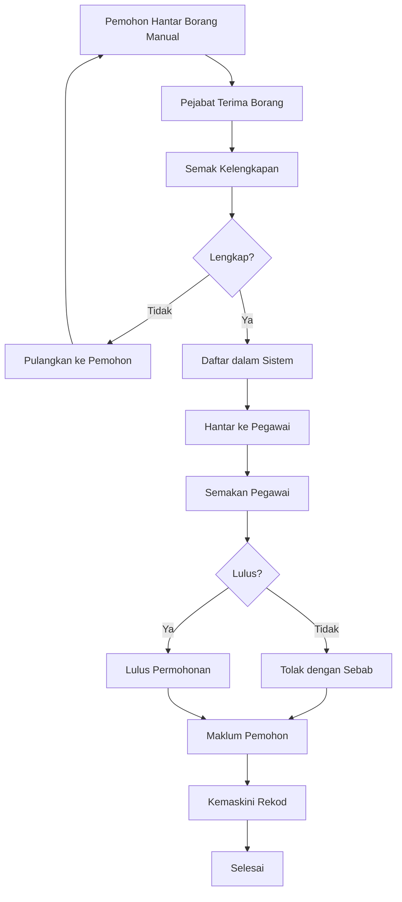
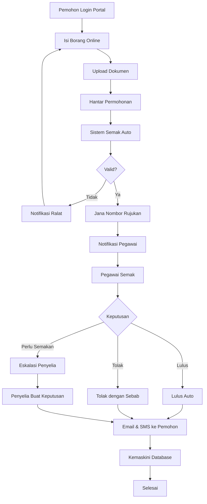
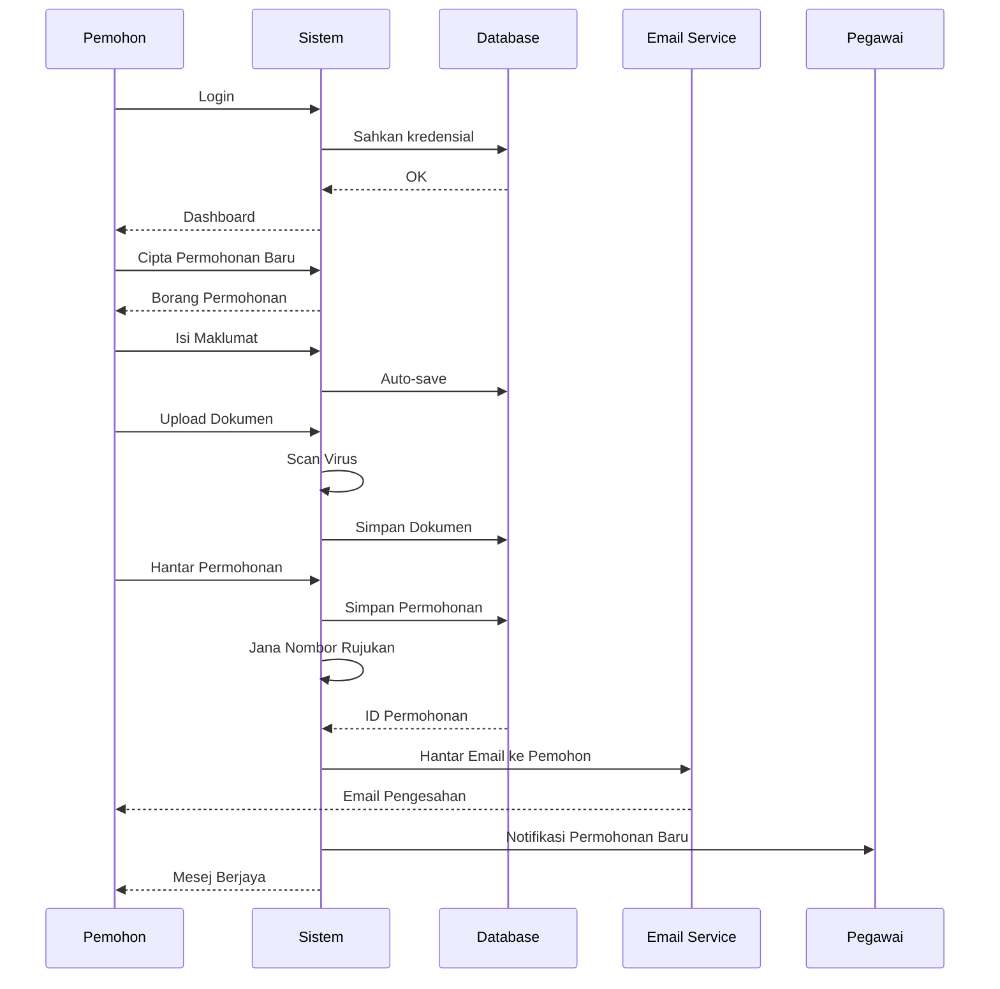
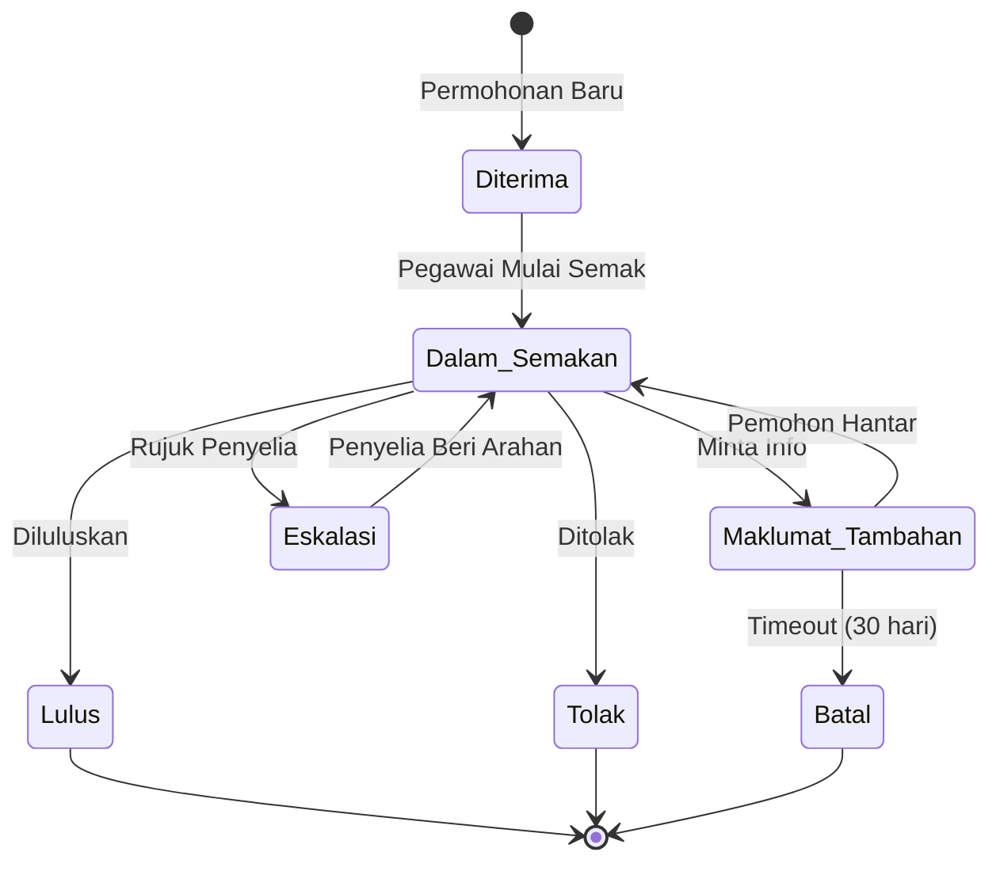
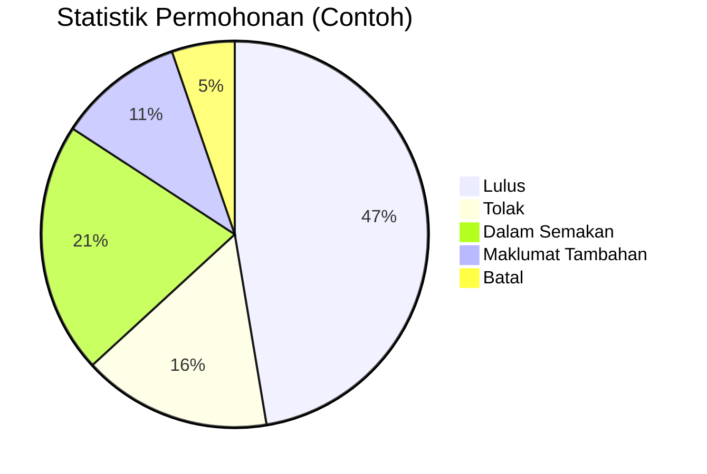
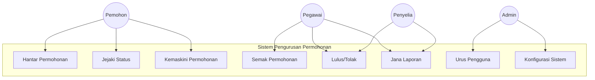
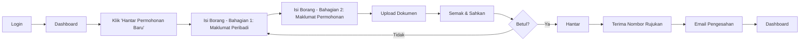
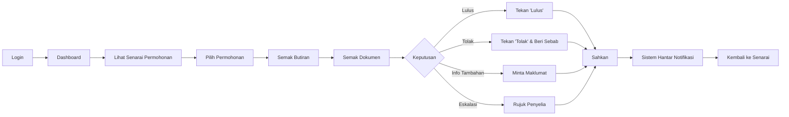
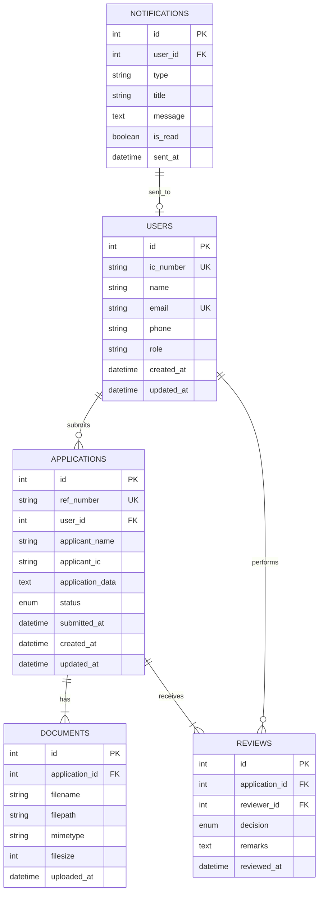

# D02-SPESIFIKASI KEPERLUAN BISNES (BRS)
# Business Requirements Specification Sample

**Document ID:** D02-SPESIFIKASI_KEPERLUAN_BISNES_SAMPLE  
**Project:** SISTEM PENGURUSAN PERMOHONAN BARU (SNPBM)  
**System Name:** Malaysian Electronic Government Application (MABPAM) SNPBM/BRS  
**Version:** 1.0  
**Status:** RASMI (Official)  
**Prepared For:** MAMPU (Malaysian Administrative Modernisation and Management Planning Unit)  
**Date:** December 24, 2025

---

## Kandungan / Table of Contents

1. [Rekod Kawalan Dokumen](#rekod-kawalan-dokumen)
2. [Pengenalan](#pengenalan)
3. [Keperluan Bisnes](#keperluan-bisnes)
4. [Keperluan Fungsian](#keperluan-fungsian)
5. [Keperluan Bukan Fungsian](#keperluan-bukan-fungsian)
6. [Spesifikasi Keperluan UI/UX](#spesifikasi-keperluan-uiux)
7. [Lampiran](#lampiran)

---

## Rekod Kawalan Dokumen
### Document Control Record

| Versi | Tarikh | Penerangan | Disediakan Oleh | Disahkan Oleh |
|-------|--------|------------|----------------|---------------|
| 0.1 | 2025-01-15 | Draf awal | Pasukan Pembangunan | - |
| 0.2 | 2025-02-20 | Semakan pertama | Pasukan Pembangunan | Ketua Projek |
| 1.0 | 2025-03-10 | Versi akhir untuk kelulusan | Ketua Projek | Pengarah ICT |

### Senarai Pengedaran / Distribution List

| Nama | Jawatan | Organisasi | Tarikh Terima |
|------|---------|------------|---------------|
| En. Ahmad bin Abdullah | Pengarah ICT | MAMPU | 2025-03-15 |
| Pn. Siti binti Mohamed | Ketua Projek | MAMPU | 2025-03-15 |
| En. Kumar a/l Raman | Pengurus Teknikal | Vendor | 2025-03-15 |

---

## 1. Pengenalan
### Introduction

### 1.1 Tujuan Dokumen

Dokumen Spesifikasi Keperluan Bisnes (BRS) ini bertujuan untuk:

1. **Mendokumentasikan** keperluan bisnes yang telah dikenalpasti untuk Sistem Pengurusan Permohonan Baru (SNPBM)
2. **Menyediakan** rujukan untuk pembangunan sistem
3. **Memastikan** pemahaman yang sama antara semua pihak berkepentingan
4. **Menjadi** asas untuk pembangunan dokumen teknikal yang lain

### 1.2 Skop Projek

Sistem Pengurusan Permohonan Baru (SNPBM) akan merangkumi:

- Modul pengurusan permohonan baru
- Modul pengesahan dan kelulusan
- Modul pelaporan dan analitik
- Integrasi dengan sistem sedia ada

### 1.3 Definisi, Akronim dan Singkatan

| Istilah | Definisi |
|---------|----------|
| BRS | Business Requirements Specification - Spesifikasi Keperluan Bisnes |
| SNPBM | Sistem Pengurusan Permohonan Baru |
| MAMPU | Malaysian Administrative Modernisation and Management Planning Unit |
| UI/UX | User Interface/User Experience |
| API | Application Programming Interface |
| CRUD | Create, Read, Update, Delete |

### 1.4 Rujukan

1. D01 - Project Charter
2. D03 - Software Requirements Specification (SRS)
3. Garis Panduan Pembangunan Aplikasi Kerajaan 2024
4. MyGovEA Framework v2.0
5. PDPA 2010 (Personal Data Protection Act)

### 1.5 Gambaran Keseluruhan Dokumen

Dokumen ini dibahagikan kepada beberapa bahagian utama:

- **Bahagian 2:** Keperluan Bisnes
- **Bahagian 3:** Keperluan Fungsian
- **Bahagian 4:** Keperluan Bukan Fungsian
- **Bahagian 5:** Spesifikasi Keperluan UI/UX
- **Bahagian 6:** Lampiran

---

## 2. Keperluan Bisnes
### Business Requirements

### 2.1 Objektif Bisnes

#### 2.1.1 Objektif Utama

1. **Meningkatkan kecekapan** proses pengurusan permohonan
2. **Mengurangkan masa pemprosesan** sebanyak 50%
3. **Meningkatkan ketelusan** dalam proses kelulusan
4. **Memudahkan akses** untuk pemohon

#### 2.1.2 Objektif Sokongan

- Mengurangkan penggunaan kertas
- Meningkatkan keselamatan data
- Memudahkan penjanaan laporan
- Menyokong integrasi dengan sistem lain

### 2.2 Latar Belakang Bisnes

SNPBM dibangunkan untuk menggantikan sistem manual yang sedia ada. Sistem manual menghadapi beberapa cabaran:

- Proses yang lambat dan tidak efisien
- Kesukaran dalam pengesanan status permohonan
- Risiko kehilangan dokumen
- Kesukaran dalam penjanaan laporan

### 2.3 Proses Bisnes Semasa



### 2.4 Proses Bisnes Baharu (To-Be)



### 2.5 Pihak Berkepentingan (Stakeholders)

| Kategori | Pihak Berkepentingan | Peranan | Kepentingan |
|----------|---------------------|---------|-------------|
| Utama | Pemohon | Pengguna akhir | Hantar dan jejaki permohonan |
| Utama | Pegawai Penyemak | Pentadbir | Semak dan luluskan permohonan |
| Sokongan | Penyelia | Pentadbir | Kelulusan akhir |
| Sokongan | Pentadbir Sistem | Teknikal | Pengurusan sistem |
| Luar | MAMPU | Pemantau | Pemantauan prestasi |

---

## 3. Keperluan Fungsian
### Functional Requirements

### 3.1 Keperluan Fungsian Umum

#### FR-001: Pengurusan Pengguna

**Keterangan:** Sistem mesti dapat menguruskan maklumat pengguna

| Bil. | Aktiviti | Entiti (Table) & Atribut | Bil. FTR | Bil. DET |
|------|----------|-------------------------|----------|----------|
| 1 | Jana Laporan Pengguna Berdaftar | `users` - id, nama, email, tarikh_daftar | 1 | 4 |
| 2 | Hantar Makluman Email Pendaftaran Berjaya | `users`, `email_logs` | 1 | 5 |

**Maklumat Permohonan:**

- Nombor Permohonan (Dijumlahkan)
- Tarikh Permohonan (Bulan Semasa)
- Status Permohonan

**Maklumat Bilik Mesyuarat:**

1. Nama Bilik Mesyuarat
2. Tarikh Kelulusan
3. Status Kelulusan (Diluluskan)

#### FR-002: Pengurusan Permohonan

**Keterangan:** Sistem mesti membolehkan pemohon menghantar permohonan baru

**Subkeperluan:**

##### FR-002.1: Cipta Permohonan Baru

- Sistem menyediakan borang permohonan dalam talian
- Medan wajib: Nama, No. KP, Alamat, Telefon, Email
- Validasi format data (email, no. telefon, IC)
- Jana nombor rujukan unik secara automatik

##### FR-002.2: Simpan Draf

- Pemohon boleh simpan draf permohonan
- Sistem simpan setiap perubahan (auto-save setiap 30 saat)
- Pemohon boleh sambung permohonan kemudian

##### FR-002.3: Muat Naik Dokumen Sokongan

- Format dokumen yang diterima: PDF, JPG, PNG
- Saiz maksimum setiap fail: 5MB
- Jumlah maksimum fail: 10 dokumen
- Sistem scan untuk virus

##### FR-002.4: Hantar Permohonan

- Pemohon sahkan maklumat sebelum hantar
- Sistem jana nombor rujukan
- Hantar email pengesahan kepada pemohon
- Hantar notifikasi kepada pegawai penyemak



#### FR-003: Pengurusan Semakan

**Keterangan:** Sistem mesti membolehkan pegawai menyemak permohonan

**Subkeperluan:**

##### FR-003.1: Senarai Permohonan

- Pegawai melihat senarai permohonan yang perlu disemak
- Paparan mengikut keutamaan (FIFO, tarikh akhir, jenis)
- Penapis: Status, tarikh, pemohon
- Carian: Nombor rujukan, nama pemohon

##### FR-003.2: Lihat Butiran Permohonan

- Pegawai dapat melihat semua maklumat permohonan
- Muat turun dokumen sokongan
- Lihat sejarah permohonan (timeline)
- Lihat ulasan pegawai sebelumnya (jika ada)

##### FR-003.3: Buat Keputusan

- Pegawai boleh:
  - Lulus permohonan
  - Tolak permohonan (wajib beri sebab)
  - Minta maklumat tambahan dari pemohon
  - Eskalasi kepada penyelia
- Sistem rekod keputusan dengan timestamp
- Hantar notifikasi kepada pemohon



#### FR-004: Pengurusan Laporan

**Keterangan:** Sistem mesti menjana pelbagai jenis laporan

##### FR-004.1: Laporan Bulanan

- Jumlah permohonan diterima
- Jumlah permohonan diluluskan
- Jumlah permohonan ditolak
- Purata masa pemprosesan
- Export: PDF, Excel, CSV

##### FR-004.2: Laporan Prestasi Pegawai

- Bilangan permohonan disemak per pegawai
- Purata masa semakan
- Nisbah kelulusan/penolakan
- Carta prestasi bulanan

##### FR-004.3: Dashboard Eksekutif

- Paparan grafik real-time
- KPI utama
- Trend permohonan
- Status sistem



### 3.2 Matriks Kebolehkesanan Keperluan
### Requirements Traceability Matrix

| ID Keperluan | Nama | Keutamaan | Status | Modul | Ujian |
|--------------|------|-----------|--------|-------|-------|
| FR-001 | Pengurusan Pengguna | Tinggi | Selesai | User Management | UT-001 |
| FR-002 | Pengurusan Permohonan | Kritikal | Dalam Pembangunan | Application | UT-002 |
| FR-003 | Pengurusan Semakan | Kritikal | Dalam Pembangunan | Review | UT-003 |
| FR-004 | Pengurusan Laporan | Sederhana | Rancangan | Reports | UT-004 |

### 3.3 Use Case Diagram



---

## 4. Keperluan Bukan Fungsian
### Non-Functional Requirements

### 4.1 Keperluan Prestasi (Performance)

#### NFR-001: Masa Respons

- **Halaman web**: Paparan dalam 2 saat
- **Carian**: Hasil dalam 3 saat
- **Laporan**: Jana dalam 10 saat untuk data 1 tahun
- **API**: Respons dalam 500ms (95th percentile)

#### NFR-002: Throughput

- Sistem boleh mengendalikan 1000 pengguna serentak
- 500 transaksi per minit
- 10,000 permohonan baru per hari

#### NFR-003: Skalabiliti

- Horizontal scaling untuk web server
- Database replication untuk read-heavy operations
- Load balancer untuk pengedaran trafik

### 4.2 Keperluan Kebolehgunaan (Usability)

#### NFR-004: Antara Muka Pengguna

- Reka bentuk responsif (mobile, tablet, desktop)
- Sokongan pelbagai pelayar (Chrome, Firefox, Safari, Edge)
- Accessible mengikut WCAG 2.1 Level AA
- Dwi-bahasa (Bahasa Malaysia & English)

#### NFR-005: Pembelajaran

- Pengguna baru boleh hantar permohonan dalam 10 minit
- Manual pengguna dalam format PDF dan video
- Bantuan kontekstual (tooltips, help text)
- FAQ section

### 4.3 Keperluan Keselamatan (Security)

#### NFR-006: Pengesahan Pengguna (Authentication)

- Login menggunakan email/IC dan kata laluan
- Sokongan 2FA (Two-Factor Authentication)
- Integrasi dengan MyID (optional)
- Session timeout selepas 30 minit tidak aktif

#### NFR-007: Kebenaran Akses (Authorization)

- Role-Based Access Control (RBAC)
- Roles: Pemohon, Pegawai, Penyelia, Admin
- Audit trail untuk semua operasi sensitif

#### NFR-008: Enkripsi

- HTTPS (TLS 1.2 atau lebih tinggi)
- Enkripsi data sensitif dalam database (AES-256)
- Enkripsi kata laluan (bcrypt dengan salt)

#### NFR-009: Perlindungan Data

- Pematuhan PDPA 2010
- Backup data harian
- Retention policy: 7 tahun
- Secure delete untuk data yang expired

### 4.4 Keperluan Kebolehpercayaan (Reliability)

#### NFR-010: Ketersediaan (Availability)

- Uptime: 99.5% (excluding scheduled maintenance)
- Maintenance window: Minggu ke-2 setiap bulan, 12am-4am
- Maximum downtime: 4 jam per bulan

#### NFR-011: Disaster Recovery

- Recovery Time Objective (RTO): 4 jam
- Recovery Point Objective (RPO): 1 jam
- Backup site (cold standby)

### 4.5 Keperluan Penyelenggaraan (Maintainability)

#### NFR-012: Kod

- Clean code practices
- Documentation untuk semua modul
- Unit test coverage minimum 70%
- Code review wajib sebelum merge

#### NFR-013: Deployment

- Continuous Integration/Continuous Deployment (CI/CD)
- Automated testing
- Blue-green deployment strategy
- Rollback capability

### 4.6 Keperluan Keserasian (Compatibility)

#### NFR-014: Integrasi

- RESTful API untuk integrasi
- SOAP web services untuk sistem legacy
- Webhook untuk notifikasi real-time
- Support untuk LDAP/Active Directory

#### NFR-015: Platform

- Backend: PHP 8.1+, Laravel 11
- Database: MySQL 8.0+ / PostgreSQL 13+
- Cache: Redis 6+
- Queue: Laravel Queue (Redis driver)

### 4.7 Keperluan Undang-undang (Legal/Regulatory)

#### NFR-016: Pematuhan

- Akta Perlindungan Data Peribadi 2010
- Garis Panduan MyGovEA
- Akta Rahsia Rasmi 1972
- Akta Komputer 1997

---

## 5. Spesifikasi Keperluan UI/UX
### UI/UX Requirements Specification

### 5.1 Prinsip Reka Bentuk

#### 5.1.1 Prinsip Utama

1. **Mudah dan Intuitif**: Interface yang jelas dan mudah difahami
2. **Konsisten**: Gunakan corak reka bentuk yang konsisten
3. **Responsif**: Berfungsi pada semua saiz skrin
4. **Accessible**: Boleh digunakan oleh OKU
5. **Efficient**: Minimakan langkah untuk selesaikan tugas

#### 5.1.2 Design System

- Ikuti MAMPU Design System Guidelines
- Gunakan MyGov design tokens
- Consistent spacing: 4px base unit
- Color palette: Government-approved colors

### 5.2 Layout dan Navigasi

#### 5.2.1 Header

- Logo organisasi (kiri atas)
- Menu navigasi (tengah)
- Profil pengguna dan logout (kanan atas)
- Breadcrumb navigation
- Notification indicator

```
┌─────────────────────────────────────────────────────┐
│ [Logo]  Dashboard  Permohonan  Laporan  [👤 Logout]│
├─────────────────────────────────────────────────────┤
│ Laman Utama > Permohonan > Senarai                  │
└─────────────────────────────────────────────────────┘
```

#### 5.2.2 Sidebar (untuk Pemohon)

- Dashboard
- Permohonan Saya
- Hantar Permohonan Baru
- Profil
- Bantuan

#### 5.2.3 Content Area

- Tajuk halaman (H1)
- Action buttons (kanan atas)
- Filters dan search
- Kandungan utama
- Pagination (jika berkenaan)

#### 5.2.4 Footer

- Pautan berguna
- Maklumat hubungan
- Hak cipta
- Versi sistem

### 5.3 Komponen UI Utama

#### 5.3.1 Borang Input

```
Nama Penuh *
┌─────────────────────────────────────────┐
│ Ahmad bin Abdullah                      │
└─────────────────────────────────────────┘
ℹ️ Masukkan nama penuh seperti dalam MyKad

No. Kad Pengenalan *
┌─────────────────────────────────────────┐
│ 850101-10-5678                          │
└─────────────────────────────────────────┘

[ Hantar ]  [ Simpan Draf ]  [ Batal ]
```

**Keperluan:**

- Label yang jelas dengan asterisk (*) untuk medan wajib
- Placeholder text untuk panduan
- Validation inline (real-time)
- Error message yang jelas
- Help text/tooltip jika perlu

#### 5.3.2 Senarai/Table

```
┌────────────────────────────────────────────────────────────────┐
│ [🔍 Cari...] [📅 Tarikh ▼] [📊 Status ▼] [+ Permohonan Baru] │
├────────────────────────────────────────────────────────────────┤
│ No.   │ Tarikh      │ Pemohon        │ Status    │ Tindakan   │
├───────┼─────────────┼────────────────┼───────────┼────────────┤
│ 00123 │ 2025-03-15  │ Ahmad Abdullah │ 🟡 Semakan│ [Lihat]    │
│ 00124 │ 2025-03-14  │ Siti Mohamed   │ 🟢 Lulus  │ [Lihat]    │
│ 00125 │ 2025-03-13  │ Kumar Raman    │ 🔴 Tolak  │ [Lihat]    │
├───────┴─────────────┴────────────────┴───────────┴────────────┤
│                « 1 2 3 4 5 »   Menunjukkan 1-20 dari 100     │
└────────────────────────────────────────────────────────────────┘
```

**Keperluan:**

- Sortable columns
- Filtering options
- Search functionality
- Color-coded status indicators
- Action buttons (view, edit, delete)
- Pagination dengan maklumat jumlah rekod

#### 5.3.3 Status Indicator

| Status | Warna | Icon | Keterangan |
|--------|-------|------|------------|
| Diterima | 🔵 Biru | ✓ | Permohonan baru diterima |
| Dalam Semakan | 🟡 Kuning | 🔄 | Sedang disemak |
| Lulus | 🟢 Hijau | ✓ | Diluluskan |
| Tolak | 🔴 Merah | ✗ | Ditolak |
| Maklumat Tambahan | 🟠 Oren | ℹ️ | Perlu info tambahan |
| Batal | ⚫ Abu | - | Dibatalkan |

#### 5.3.4 Modal/Dialog

```
┌───────────────────────────────────────────┐
│  Sahkan Tindakan               [✕]        │
├───────────────────────────────────────────┤
│                                           │
│  ⚠️ Adakah anda pasti mahu menolak       │
│     permohonan ini?                       │
│                                           │
│  Sila berikan sebab penolakan:            │
│  ┌─────────────────────────────────────┐ │
│  │                                     │ │
│  │                                     │ │
│  └─────────────────────────────────────┘ │
│                                           │
│         [ Batal ]  [ Sahkan Tolak ]       │
└───────────────────────────────────────────┘
```

#### 5.3.5 File Upload

```
┌─────────────────────────────────────────────────┐
│ 📎 Muat Naik Dokumen                           │
├─────────────────────────────────────────────────┤
│                                                 │
│   ┌─────────────────────────────────────────┐  │
│   │  Drag and drop atau klik untuk pilih    │  │
│   │             [📁 Pilih Fail]              │  │
│   └─────────────────────────────────────────┘  │
│                                                 │
│   Format: PDF, JPG, PNG | Max 5MB per fail    │
│                                                 │
│   Dokumen dimuat naik:                          │
│   ✓ salinan_ic.pdf (1.2 MB)         [❌]       │
│   ✓ sijil_kelahiran.pdf (850 KB)    [❌]       │
│                                                 │
│   2 / 10 dokumen                                │
└─────────────────────────────────────────────────┘
```

### 5.4 Aliran Pengguna (User Flows)

#### 5.4.1 Aliran Pemohon: Hantar Permohonan Baru



#### 5.4.2 Aliran Pegawai: Semak Permohonan



### 5.5 Wireframes Utama

#### 5.5.1 Dashboard Pemohon

```
┌────────────────────────────────────────────────────────────┐
│ [Logo]  Dashboard  Permohonan  Bantuan      [👤 Ahmad ▼]  │
├────────────────────────────────────────────────────────────┤
│                                                            │
│  Selamat datang, Ahmad bin Abdullah                        │
│                                                            │
│  ┌──────────────┬──────────────┬──────────────┐           │
│  │ 📝           │ ⏳           │ ✓            │           │
│  │ Jumlah       │ Dalam        │ Diluluskan   │           │
│  │ Permohonan   │ Semakan      │              │           │
│  │ 12           │ 3            │ 8            │           │
│  └──────────────┴──────────────┴──────────────┘           │
│                                                            │
│  [+ Hantar Permohonan Baru]                                │
│                                                            │
│  Permohonan Terkini                                        │
│  ┌────────────────────────────────────────────────────┐   │
│  │ REF-00123  │ Dalam Semakan │ 2025-03-15  │ [Lihat]│   │
│  │ REF-00122  │ Lulus         │ 2025-03-10  │ [Lihat]│   │
│  │ REF-00121  │ Tolak         │ 2025-03-05  │ [Lihat]│   │
│  └────────────────────────────────────────────────────┘   │
│                                                            │
└────────────────────────────────────────────────────────────┘
```

#### 5.5.2 Borang Permohonan (Multi-Step)

```
┌────────────────────────────────────────────────────────────┐
│ Permohonan Baru                                            │
├────────────────────────────────────────────────────────────┤
│                                                            │
│  [1. Maklumat ●]  [2. Dokumen ○]  [3. Semak ○]            │
│                                                            │
│  Maklumat Peribadi                                         │
│  ──────────────────                                        │
│                                                            │
│  Nama Penuh *                                              │
│  ┌────────────────────────────────────────────────┐       │
│  │                                                │       │
│  └────────────────────────────────────────────────┘       │
│                                                            │
│  No. Kad Pengenalan *                                      │
│  ┌────────────────────────────────────────────────┐       │
│  │                                                │       │
│  └────────────────────────────────────────────────┘       │
│                                                            │
│  Email *                                                   │
│  ┌────────────────────────────────────────────────┐       │
│  │                                                │       │
│  └────────────────────────────────────────────────┘       │
│                                                            │
│  No. Telefon *                                             │
│  ┌────────────────────────────────────────────────┐       │
│  │                                                │       │
│  └────────────────────────────────────────────────┘       │
│                                                            │
│         [ Simpan Draf ]           [ Seterusnya > ]         │
│                                                            │
└────────────────────────────────────────────────────────────┘
```

#### 5.5.3 Dashboard Pegawai

```
┌────────────────────────────────────────────────────────────┐
│ [Logo]  Dashboard  Permohonan  Laporan     [👤 Pegawai ▼] │
├────────────────────────────────────────────────────────────┤
│                                                            │
│  Dashboard Pegawai                                         │
│                                                            │
│  ┌─────────┬─────────┬─────────┬─────────┐               │
│  │ 📥 15   │ ⏱️ 4.5h │ 👍 85%  │ ⚡ 25   │               │
│  │ Pending │ Avg     │ Approval│ Today   │               │
│  │         │ Time    │ Rate    │         │               │
│  └─────────┴─────────┴─────────┴─────────┘               │
│                                                            │
│  Permohonan Menunggu Semakan                               │
│  [🔍 Cari] [Status ▼] [Tarikh ▼] [+ Penapis Lanjutan]    │
│                                                            │
│  ┌──────┬───────────┬─────────────┬────────┬──────────┐   │
│  │ Ref  │ Tarikh    │ Pemohon     │ Status │ Tindakan │   │
│  ├──────┼───────────┼─────────────┼────────┼──────────┤   │
│  │ 00123│ 2025-03-15│ Ahmad...    │🟡 New  │ [Semak]  │   │
│  │ 00124│ 2025-03-14│ Siti...     │🟡 New  │ [Semak]  │   │
│  │ 00125│ 2025-03-13│ Kumar...    │🟠 Info │ [Semak]  │   │
│  └──────┴───────────┴─────────────┴────────┴──────────┘   │
│                                                            │
│  Carta Trend Permohonan (7 hari lepas)                     │
│  ┌────────────────────────────────────────────────────┐   │
│  │     📊                                             │   │
│  │  20 ││                                             │   │
│  │  15 ││ ││                                          │   │
│  │  10 ││ ││ ││ ││                                    │   │
│  │   5 ││ ││ ││ ││ ││ ││ ││                          │   │
│  │   0 ─────────────────────                          │   │
│  │     Mon Tue Wed Thu Fri Sat Sun                    │   │
│  └────────────────────────────────────────────────────┘   │
│                                                            │
└────────────────────────────────────────────────────────────┘
```

### 5.6 Keperluan Responsif

#### 5.6.1 Desktop (≥ 1024px)

- Sidebar kekal
- Paparan penuh semua kolum table
- Multi-column layout untuk borang

#### 5.6.2 Tablet (768px - 1023px)

- Sidebar boleh collapse
- Table horizontal scroll jika perlu
- 2-column layout untuk borang

#### 5.6.3 Mobile (< 768px)

- Hamburger menu
- Table dalam card view
- Single column layout
- Bottom navigation untuk tindakan utama

```
Mobile View Example:
┌──────────────────────┐
│ ☰ Dashboard     [🔔] │
├──────────────────────┤
│                      │
│ Permohonan REF-00123 │
│ ┌──────────────────┐ │
│ │ Status: Dalam    │ │
│ │ Semakan          │ │
│ │                  │ │
│ │ Tarikh: 15/03/25 │ │
│ │                  │ │
│ │ [Lihat Butiran]  │ │
│ └──────────────────┘ │
│                      │
│ Permohonan REF-00122 │
│ ┌──────────────────┐ │
│ │ Status: Lulus    │ │
│ │                  │ │
│ │ Tarikh: 10/03/25 │ │
│ │                  │ │
│ │ [Lihat Butiran]  │ │
│ └──────────────────┘ │
│                      │
├──────────────────────┤
│ [🏠] [📝] [📊] [👤] │
└──────────────────────┘
```

### 5.7 Keperluan Accessibility (WCAG 2.1 Level AA)

#### 5.7.1 Perceivable (Dapat Dirasai)

- **Alt text** untuk semua imej
- **Contrast ratio** minimum 4.5:1 untuk teks normal
- **Contrast ratio** minimum 3:1 untuk teks besar (≥18pt)
- **Video** mesti ada subtitle/caption
- **Audio** mesti ada transcript

#### 5.7.2 Operable (Boleh Dioperasikan)

- **Keyboard navigation** untuk semua fungsi
- **Focus indicators** yang jelas
- **Skip links** untuk navigasi pantas
- **No time limits** atau boleh dilanjutkan
- **No seizure triggers** (no flashing > 3 times/second)

#### 5.7.3 Understandable (Boleh Difahami)

- **Bahasa** yang jelas dan mudah
- **Error messages** yang membantu
- **Labels** yang jelas untuk borang
- **Consistent navigation** merentasi sistem

#### 5.7.4 Robust (Teguh)

- **Valid HTML** markup
- **ARIA labels** yang sesuai
- **Compatible** dengan screen readers (NVDA, JAWS)
- **Progressive enhancement**

---

## 6. Lampiran
### Appendices

### Lampiran A: Glosari

| Istilah | Definisi |
|---------|----------|
| API | Application Programming Interface - Antara muka untuk komunikasi antara sistem |
| CRUD | Create, Read, Update, Delete - Operasi asas pangkalan data |
| Dashboard | Paparan ringkasan maklumat penting |
| KPI | Key Performance Indicator - Penunjuk prestasi utama |
| MAMPU | Malaysian Administrative Modernisation and Management Planning Unit |
| PDPA | Personal Data Protection Act 2010 |
| RBAC | Role-Based Access Control - Kawalan akses berasaskan peranan |
| REST | Representational State Transfer - Gaya seni bina API |
| SLA | Service Level Agreement - Perjanjian tahap perkhidmatan |
| SNPBM | Sistem Pengurusan Permohonan Baru |
| SSO | Single Sign-On - Log masuk tunggal |
| UI/UX | User Interface/User Experience |
| WCAG | Web Content Accessibility Guidelines |

### Lampiran B: Rujukan Dokumen

1. **D01 - Project Charter**
   - Objektif projek
   - Skop projek
   - Pihak berkepentingan

2. **D03 - Software Requirements Specification (SRS)**
   - Keperluan teknikal terperinci
   - Spesifikasi API
   - Database schema

3. **Garis Panduan MyGovEA v2.0**
   - Seni bina kerajaan elektronik
   - Standard integrasi
   - Security guidelines

4. **MAMPU Design System**
   - UI components library
   - Design tokens
   - Brand guidelines

5. **PDPA 2010 Guidelines**
   - Data protection requirements
   - Privacy policy
   - Consent management

### Lampiran C: Matriks RACI

Matriks RACI (Responsible, Accountable, Consulted, Informed) untuk aktiviti projek:

| Aktiviti | Pemohon | Pegawai | Penyelia | Admin | Teknikal |
|----------|---------|---------|----------|-------|----------|
| Hantar Permohonan | R/A | I | I | - | - |
| Semak Permohonan | I | R/A | C | - | - |
| Lulus/Tolak | I | R | A | - | - |
| Eskalasi | I | R | A | - | - |
| Urus Pengguna | - | C | C | R/A | R |
| Konfigurasi Sistem | - | C | C | R | A |
| Penyelenggaraan | I | I | C | R | A |
| Jana Laporan | C | R/A | R/A | C | - |

**Keterangan:**

- **R (Responsible)**: Bertanggungjawab melaksanakan
- **A (Accountable)**: Akauntable untuk keputusan akhir
- **C (Consulted)**: Perlu dirujuk sebelum keputusan
- **I (Informed)**: Perlu dimaklumkan selepas keputusan

### Lampiran D: Model Data Ringkas



### Lampiran E: Senarai API Endpoints (Ringkas)

#### Authentication

- `POST /api/v1/auth/login` - Log masuk
- `POST /api/v1/auth/logout` - Log keluar
- `POST /api/v1/auth/register` - Daftar pengguna baru
- `POST /api/v1/auth/forgot-password` - Reset kata laluan

#### Applications

- `GET /api/v1/applications` - Senarai permohonan
- `POST /api/v1/applications` - Cipta permohonan baru
- `GET /api/v1/applications/{id}` - Butiran permohonan
- `PUT /api/v1/applications/{id}` - Kemaskini permohonan
- `DELETE /api/v1/applications/{id}` - Padam permohonan (draf sahaja)
- `POST /api/v1/applications/{id}/submit` - Hantar permohonan

#### Reviews

- `GET /api/v1/applications/{id}/reviews` - Sejarah semakan
- `POST /api/v1/applications/{id}/reviews` - Buat semakan baru
- `PUT /api/v1/reviews/{id}` - Kemaskini semakan

#### Documents

- `POST /api/v1/applications/{id}/documents` - Upload dokumen
- `GET /api/v1/documents/{id}` - Muat turun dokumen
- `DELETE /api/v1/documents/{id}` - Padam dokumen

#### Reports

- `GET /api/v1/reports/summary` - Laporan ringkasan
- `GET /api/v1/reports/monthly` - Laporan bulanan
- `GET /api/v1/reports/performance` - Laporan prestasi

### Lampiran F: Contoh JSON Response

#### Butiran Permohonan

```json
{
  "status": "success",
  "data": {
    "id": 123,
    "ref_number": "REF-2025-00123",
    "applicant": {
      "name": "Ahmad bin Abdullah",
      "ic_number": "850101-10-5678",
      "email": "ahmad@example.com",
      "phone": "0123456789"
    },
    "status": "dalam_semakan",
    "submitted_at": "2025-03-15T10:30:00Z",
    "application_data": {
      "purpose": "Permohonan lesen perniagaan",
      "description": "Kedai runcit di Taman ABC"
    },
    "documents": [
      {
        "id": 1,
        "filename": "salinan_ic.pdf",
        "filesize": 1258291,
        "uploaded_at": "2025-03-15T10:25:00Z"
      },
      {
        "id": 2,
        "filename": "sijil_kelahiran.pdf",
        "filesize": 870400,
        "uploaded_at": "2025-03-15T10:26:00Z"
      }
    ],
    "reviews": [
      {
        "id": 1,
        "reviewer": "Puan Siti binti Mohamed",
        "decision": "info_required",
        "remarks": "Sila kemukakan salinan perjanjian sewa premis",
        "reviewed_at": "2025-03-16T14:20:00Z"
      }
    ],
    "created_at": "2025-03-15T09:00:00Z",
    "updated_at": "2025-03-16T14:20:00Z"
  }
}
```

### Lampiran G: Kod Warna Status

| Status | Hex Code | RGB | Kegunaan |
|--------|----------|-----|----------|
| Primary | #003893 | rgb(0, 56, 147) | Butang utama, tajuk |
| Success (Lulus) | #28a745 | rgb(40, 167, 69) | Status lulus, mesej berjaya |
| Warning (Semakan) | #ffc107 | rgb(255, 193, 7) | Status dalam semakan |
| Danger (Tolak) | #dc3545 | rgb(220, 53, 69) | Status tolak, mesej ralat |
| Info | #17a2b8 | rgb(23, 162, 184) | Maklumat tambahan |
| Secondary | #6c757d | rgb(108, 117, 125) | Teks sekunder |
| Background | #f8f9fa | rgb(248, 249, 250) | Background halaman |

### Lampiran H: Senarai Semak Pembangunan

#### Fasa 1: Analisis (2 minggu)

- [ ] Pengesahan keperluan dengan stakeholders
- [ ] Finalize UI/UX wireframes
- [ ] Review dan approval BRS
- [ ] Setup development environment

#### Fasa 2: Design (3 minggu)

- [ ] Database schema design
- [ ] API specification
- [ ] Security architecture
- [ ] Integration design dengan sistem sedia ada

#### Fasa 3: Pembangunan (10 minggu)

- [ ] Module 1: User Management (2 minggu)
- [ ] Module 2: Application Management (3 minggu)
- [ ] Module 3: Review & Approval (3 minggu)
- [ ] Module 4: Reporting (2 minggu)

#### Fasa 4: Ujian (4 minggu)

- [ ] Unit testing
- [ ] Integration testing
- [ ] UAT (User Acceptance Testing)
- [ ] Performance testing
- [ ] Security testing

#### Fasa 5: Deployment (2 minggu)

- [ ] Staging deployment
- [ ] Production deployment
- [ ] Data migration (jika ada)
- [ ] Training pengguna

---

## Tandatangan & Kelulusan
### Signatures & Approvals

| Peranan | Nama | Tandatangan | Tarikh |
|---------|------|-------------|--------|
| Disediakan oleh: | En. Kumar a/l Raman | _____________ | _________ |
| Disemak oleh: | Pn. Siti binti Mohamed | _____________ | _________ |
| Diluluskan oleh: | En. Ahmad bin Abdullah | _____________ | _________ |

---

**Nota:** Dokumen ini adalah harta intelek MAMPU dan tidak boleh digunakan tanpa kebenaran bertulis.

**Hak Cipta © 2025 MAMPU. Hak Cipta Terpelihara.**

---

**Akhir Dokumen / End of Document**
