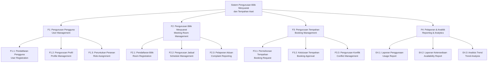
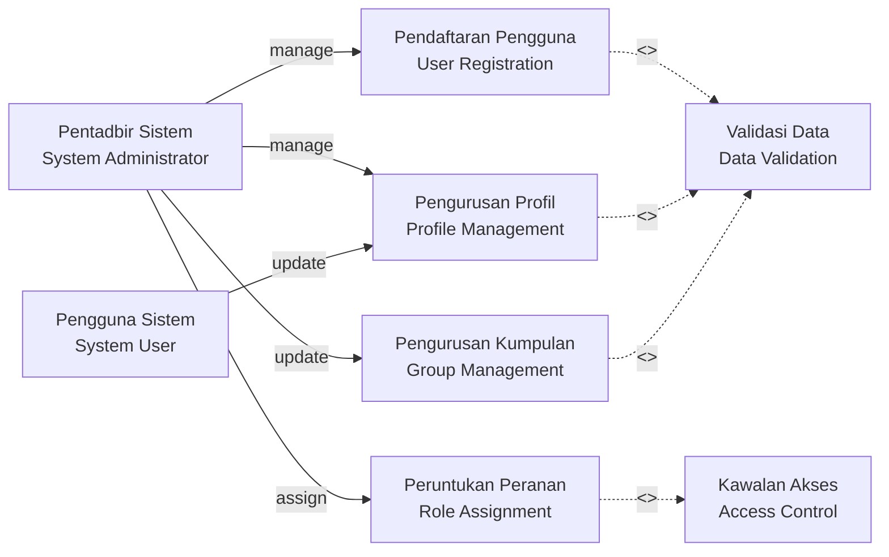
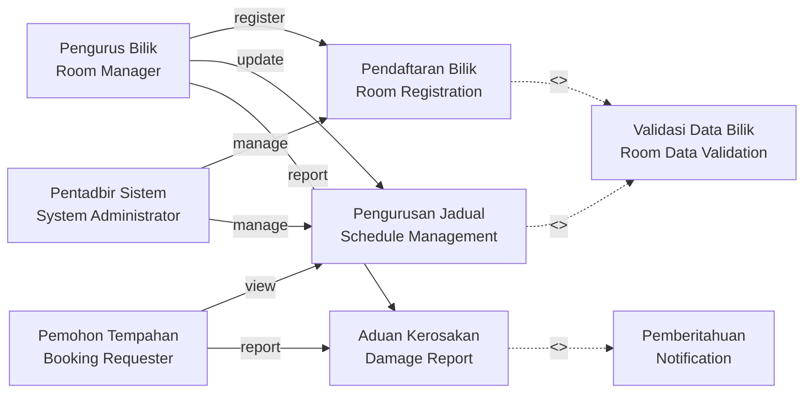
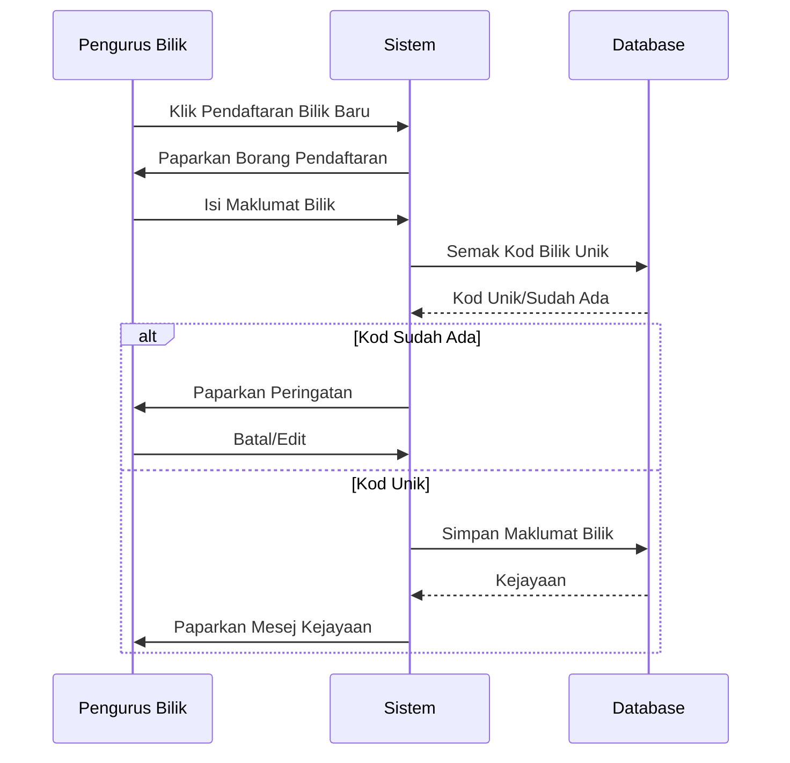
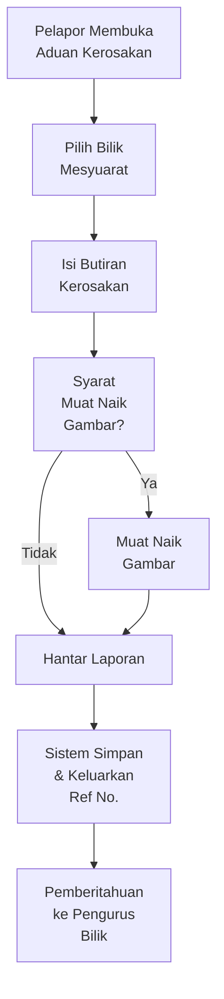
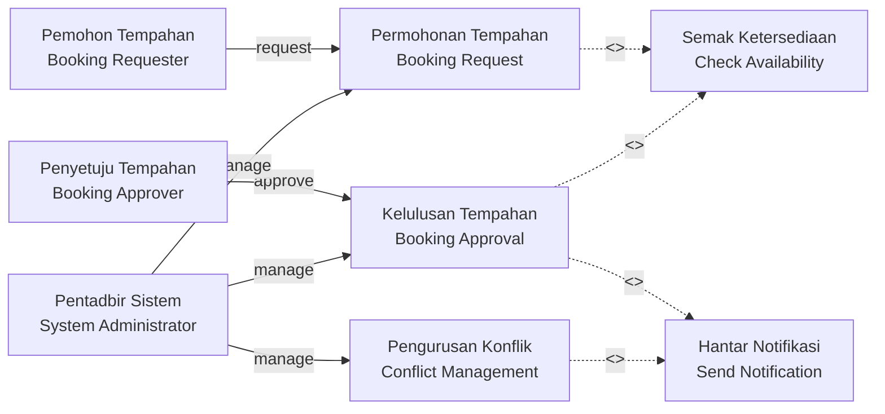
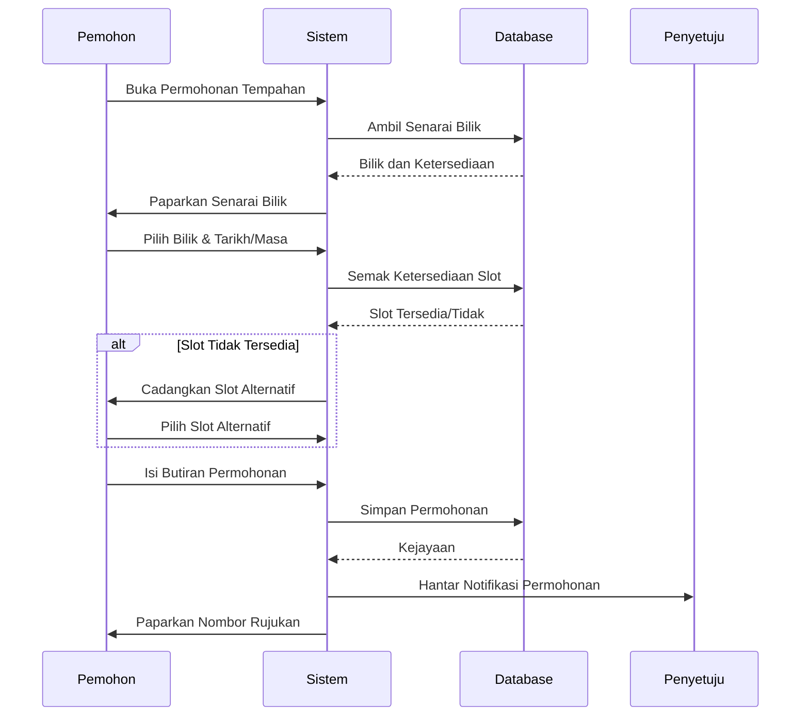

# SPESIFIKASI KEPERLUAN SISTEM (SRS)
## System Requirements Specification

**Rujukan / Reference**: SMPBM / SRS  
**Klasifikasi Dokumen / Document Classification**: KERJA DALAM PROSES (WIP) / WORK IN PROGRESS  
**Versi / Version**: 1.1  
**Tarikh Pengesahan / Approval Date**: 25 Mei 2020

---

## SEMAKAN DAN PENGESAHAN DOKUMEN
## Document Review and Approval

### Disemak Oleh / Reviewed By

| Aspek / Aspect | Butiran / Details |
|---|---|
| **Nama / Name** | Pn. Rohiza binti Ahmad |
| **Jawatan / Position** | Pengurus Pembangunan Sistem, Timbalan Pengarah, Bahagian Perunding ICT |
| **Tandatangan / Signature** | [Bertandatangan / Signed] |
| **Tarikh / Date** | 18 Mei 2020 |

### Disokong Oleh / Endorsed By

| Aspek / Aspect | Butiran / Details |
|---|---|
| **Nama / Name** | En. Sabahan bin Mohd |
| **Jawatan / Position** | Timbalan Pengarah, Bahagian Khidmat Pengurusan Projek (BKP) |
| **Tandatangan / Signature** | [Bertandatangan / Signed] |
| **Tarikh / Date** | 20 Mei 2020 |

### Disahkan Oleh / Approved By

| Aspek / Aspect | Butiran / Details |
|---|---|
| **Nama / Name** | Puan Siti Nurliza binti Mokhtar |
| **Jawatan / Position** | Pensaihat Projek, Perunding ICT (Pembangunan Sistem), Bahagian Perunding ICT |
| **Tandatangan / Signature** | [Bertandatangan / Signed] |
| **Tarikh / Date** | 25 Mei 2020 |

### Pemilik Projek / Project Owner Approval

| Aspek / Aspect | Butiran / Details |
|---|---|
| **Nama / Name** | En. Ahmad Marzuki |
| **Jawatan / Position** | Pengarah, Bahagian Khidmat Pengurusan Projek (BKP) |
| **Tandatangan / Signature** | [Bertandatangan / Signed] |
| **Tarikh / Date** | 25 Mei 2020 |

---

## KAWALAN DOKUMEN
## Document Control

| No. Versi / Version | Tarikh / Date | Ringkasan Pindaan / Summary of Changes | Penyedia / Prepared By |
|---|---|---|---|
| 1.0 | 10 Mei 2020 | Dokumen versi pertama selesai disediakan / Initial version completed | Muhammad Hadri Bin Basri, Nik Zalbiha binti Nik Mat |
| 1.1 | 15 Mei 2020 | Perubahan dalam Model Use Case. Para 3.2 / Changes in Use Case Model. Section 3.2 | Muhammad Hadri Bin Basri, Nik Zalbiha binti Nik Mat |

---

## KANDUNGAN
## Table of Contents

### Halaman Depan / Cover Pages

- KETERANGAN DOKUMEN (i)
- SEMAKAN DAN PENGESAHAN DOKUMEN (ii)
- KAWALAN DOKUMEN (iii)
- KANDUNGAN (iv)

### Senarai Gambarajah dan Jadual / Lists of Figures and Tables

- SENARAI GAMBARAJAH (vii)
- SENARAI JADUAL (viii)

### Pendahuluan / Introduction Sections

- AKRONIM (x)
- SUMBER RUJUKAN (xi)

### Isi Kandungan Utama / Main Content

**1. PENGENALAN (Introduction)** - Pages 1-2

- 1.1 Tujuan Sistem (System Purpose) - Page 1
- 1.2 Skop Sistem (System Scope) - Page 1
- 1.3 Senarai Aktor Sistem (System Actors List) - Page 2

**2. PEMODELAN FUNGSI SISTEM (System Function Modeling)** - Pages 3-5

- 2.1 Penggunaan Notasi (Notation Usage) - Page 3
- 2.2 Rajah Hierarki Fungsian Sistem (System Function Hierarchy Diagram) - Page 4
- 2.3 Jadual Pemadanan Aktor Dengan Fungsi Sistem (Actor-Function Mapping Table) - Page 5

**3. PEMODELAN USE CASE (Use Case Modeling)** - Pages 7-16+

- 3.1 Penggunaan Notasi (Notation Usage) - Page 7
- 3.2 Model Use Case (Use Case Model) - Pages 9-16+
  - 3.2.1 Modul Pengurusan Pengguna (User Management Module) - Page 9
    - Rajah Use Case Modul Pengurusan Pengguna
    - Spesifikasi Use Case Pengguna
  - 3.2.2 Modul Pengurusan Bilik Mesyuarat (Meeting Room Management Module) - Pages 11-12
    - 3.2.2.1 Sub Modul Pendaftaran Bilik (Room Registration Sub-Module) - Page 11
      - Rajah Use Case Sub Modul Pendaftaran Bilik
      - Spesifikasi Use Case Pendaftaran Bilik
    - 3.2.2.2 Sub Modul Aduan Kerosakan (Damage Report Sub-Module) - Page 12
      - Rajah Use Case Sub Modul Aduan Kerosakan
      - Spesifikasi Use Case Aduan Kerosakan
  - 3.2.3 Modul Pengurusan Tempahan (Booking Management Module) - Pages 14-16
    - 3.2.3.1 Sub Modul Permohonan Tempahan (Booking Request Sub-Module) - Page 14
      - Rajah Use Case Sub Modul Permohonan Tempahan
      - Spesifikasi Use Case Permohonan Tempahan
    - 3.2.3.2 Sub Modul Kelulusan Tempahan (Booking Approval Sub-Module) - Page 16
      - Rajah Use Case Sub Modul Kelulusan Tempahan
      - Spesifikasi Use Case Kelulusan Tempahan

**4. PEMODELAN DATA (Data Modeling)** - Pages 17+

- 4.1 Notasi Pemodelan Data
- 4.2 Rajah ER (Entity Relationship Diagram)
- 4.3 Jadual Perincian Entiti

**5. SPESIFIKASI ANTARAMUKA (Interface Specification)** - Pages 25+

- 5.1 Spesifikasi Antaramuka Pengguna
- 5.2 Format Input/Output
- 5.3 Peraturan Pengesahan Data

**6. KEPERLUAN BUKAN FUNGSIAN (Non-Functional Requirements)** - Pages 35+

- 6.1 Prestasi dan Kecekapan Sistem (System Performance and Efficiency)
- 6.2 Keselamatan dan Keamanan (Security)
- 6.3 Kebolehaksesan (Accessibility)
- 6.4 Kebertahanan (Reliability)
- 6.5 Ketersediaan (Availability)
- 6.6 Keberkalan dan Pemeliharaan (Maintainability)

**7. KEPERLUAN TEKNIKAL (Technical Requirements)** - Pages 45+

- 7.1 Persekitaran Operasi (Operating Environment)
- 7.2 Keperluan Perkakasan (Hardware Requirements)
- 7.3 Keperluan Perisian (Software Requirements)
- 7.4 Keperluan Pangkalan Data (Database Requirements)

**8. BATASAN DAN ANDAIAN (Constraints and Assumptions)** - Pages 55+

- 8.1 Batasan Teknikal (Technical Constraints)
- 8.2 Batasan Peroperasian (Operational Constraints)
- 8.3 Andaian Sistem (System Assumptions)

**9. KRITERIA PENERIMAAN (Acceptance Criteria)** - Pages 60+

- 9.1 Kriteria Ujian Fungsi (Functional Testing Criteria)
- 9.2 Kriteria Ujian Bukan Fungsi (Non-Functional Testing Criteria)
- 9.3 Kriteria Keselamatan (Security Testing Criteria)

### Lampiran / Appendices

- LAMPIRAN A: Glosari (Glossary)
- LAMPIRAN B: Spesifikasi Teknikal Terperinci (Detailed Technical Specification)
- LAMPIRAN C: Contoh Data Pertukaran (Data Exchange Examples)
- LAMPIRAN D: Jadual Rujukan (Reference Tables)

---

## SENARAI GAMBARAJAH
## List of Figures

1. Rajah Hierarki Fungsian Sistem (System Function Hierarchy Diagram)
2. Rajah Use Case Modul Pengurusan Pengguna (User Management Use Case)
3. Rajah Use Case Modul Pengurusan Bilik Mesyuarat (Meeting Room Management Use Case)
4. Rajah Use Case Sub Modul Pendaftaran Bilik (Room Registration Use Case)
5. Rajah Use Case Sub Modul Aduan Kerosakan (Damage Report Use Case)
6. Rajah Use Case Modul Pengurusan Tempahan (Booking Management Use Case)
7. Rajah Use Case Sub Modul Permohonan Tempahan (Booking Request Use Case)
8. Rajah Use Case Sub Modul Kelulusan Tempahan (Booking Approval Use Case)
9. Rajah ER (Entity Relationship Diagram)
10. Rajah Aliran Data Sistem (System Data Flow Diagram)

---

## SENARAI JADUAL
## List of Tables

1. Jadual Pemadanan Aktor Dengan Fungsi Sistem (Actor-Function Mapping Table)
2. Jadual Spesifikasi Use Case Pengguna (User Management Use Case Specification)
3. Jadual Spesifikasi Use Case Pendaftaran Bilik (Room Registration Use Case Specification)
4. Jadual Spesifikasi Use Case Aduan Kerosakan (Damage Report Use Case Specification)
5. Jadual Spesifikasi Use Case Permohonan Tempahan (Booking Request Use Case Specification)
6. Jadual Spesifikasi Use Case Kelulusan Tempahan (Booking Approval Use Case Specification)
7. Jadual Perincian Entiti Data (Data Entity Detail Table)
8. Jadual Perincian Atribut (Attribute Detail Table)
9. Jadual Keperluan Bukan Fungsian (Non-Functional Requirements Table)
10. Jadual Persekitaran Teknikal (Technical Environment Table)

---

## AKRONIM
## Acronyms

| Akronim / Acronym | Kepanjangan / Full Form | Definisi / Definition |
|---|---|---|
| **SRS** | System Requirements Specification | Spesifikasi Keperluan Sistem |
| **UC** | Use Case | Model interaksi antara pengguna dan sistem |
| **ER** | Entity Relationship | Model perkaitan antara entiti data |
| **UI** | User Interface | Antara Muka Pengguna |
| **API** | Application Programming Interface | Antara Muka Pengaturcaraan Aplikasi |
| **DB** | Database | Pangkalan Data |
| **SQL** | Structured Query Language | Bahasa Soalan Berstruktur |
| **HTTP** | Hypertext Transfer Protocol | Protokol Pemindahan Hiperteks |
| **HTTPS** | Hypertext Transfer Protocol Secure | Protokol Pemindahan Hiperteks Selamat |
| **JSON** | JavaScript Object Notation | Notasi Objek JavaScript |
| **XML** | Extensible Markup Language | Bahasa Penanda Lanjutanwala |
| **RFC** | Request for Comments | Permintaan Untuk Ulasan |
| **NFR** | Non-Functional Requirements | Keperluan Bukan Fungsian |
| **FR** | Functional Requirements | Keperluan Fungsian |
| **QA** | Quality Assurance | Penjamin Kualiti |
| **UAT** | User Acceptance Testing | Ujian Penerimaan Pengguna |

---

## SUMBER RUJUKAN
## References

1. IEEE Standard 1016-2009: IEEE Standard for Information and Software Systems - Systems and Software Engineering - Software Design Descriptions
2. IEEE Standard 830-1998: IEEE Guide to Software Requirements Specifications
3. SWEBOK (Software Engineering Body of Knowledge): Guide to the Software Engineering Body of Knowledge
4. ITIL v3: Information Technology Infrastructure Library
5. KRISA (Kerangka Rujukan Integrasi Sistem Aplikasi) - Application System Integration Reference Framework
6. MAMPU (Malaysia Digital Economy Corporation) Standards and Guidelines

---

# PENGENALAN
# 1. Introduction

## 1.1 Tujuan Sistem / System Purpose

Sistem Pengurusan Bilik Mesyuarat dan Tempahan Aset dirancang untuk mengurus pelbagai fungsi perniagaan yang berkaitan dengan pengurusan bilik mesyuarat dan tempahan aset dalam sesebuah organisasi.

**Objektif Sistem:**

- Memudahkan proses pendaftaran dan pengurusan bilik mesyuarat
- Menyediakan mekanisme tempahan bilik mesyuarat yang efisien dan terkawal
- Memungkinkan pelaporan masalah atau kerosakan pada aset dan ruang
- Mengurangkan beban kerja manual dalam proses pentadbiran
- Meningkatkan ketepatan masa dan kecekapan peruntukan sumber
- Menyediakan sistem audit dan jejak untuk tujuan pengurusan

## 1.2 Skop Sistem / System Scope

Sistem ini mencakup fungsi-fungsi berikut:

### 1.2.1 Pengurusan Pengguna / User Management

- Pendaftaran pengguna baru
- Pengurusan profil pengguna
- Peruntukan peranan dan kebenaran
- Pengurusan kumpulan pengguna

### 1.2.2 Pengurusan Bilik Mesyuarat / Meeting Room Management

- Pendaftaran maklumat bilik mesyuarat (lokasi, kapasiti, kemudahan)
- Pengurusan jadual ketersediaan bilik
- Pencatatan aduan kerosakan dan pemeliharaan

### 1.2.3 Pengurusan Tempahan / Booking Management

- Pemohon tempahan bilik mesyuarat
- Proses kelulusan tempahan berbilang tahap
- Pengurusan pengguna yang dibenarkan tempahan
- Notifikasi dan peringatan tempahan

### 1.2.4 Pelaporan dan Analitik / Reporting and Analytics

- Laporan penggunaan bilik
- Laporan ketersediaan sumber
- Laporan aduan dan penyelesaian
- Statistik penggunaan sistem

**Luar Skop / Out of Scope:**

- Pengurusan infrastruktur fizikal bilik
- Pengurusan kakitangan penyelenggaraan
- Sistem pengebilan dan pembayaran
- Integrasi dengan sistem sumber manusia

## 1.3 Senarai Aktor Sistem / System Actors

| No. | Nama Aktor / Actor Name | Deskripsi / Description | Tanggung Jawab / Responsibilities |
|---|---|---|---|
| 1 | Pentadbir Sistem / System Administrator | Pengguna yang menguruskan keseluruhan sistem | Pengurusan pengguna, konfigurasi sistem, penyelenggaraan data |
| 2 | Pengurus Bilik / Room Manager | Pengguna yang menguruskan maklumat bilik mesyuarat | Pendaftaran bilik, kemaskini kemudahan, pengurusan jadual |
| 3 | Pemohon Tempahan / Booking Requester | Pengguna yang membuat permohonan tempahan | Membuat permohonan, menjawab pertanyaan tempahan |
| 4 | Penyetuju Tempahan / Booking Approver | Pengguna yang meluluskan permohonan tempahan | Semakan permohonan, kelulusan/penolakan, pengurusan konflik |
| 5 | Pelapor Aduan / Complaint Reporter | Pengguna yang melaporkan masalah atau kerosakan | Pelaporan aduan, pemantauan status penyelesaian |
| 6 | Sistem Luar / External System | Sistem lain yang berkeperluan data | Pertukaran data, pemberitahuan otomatis |

---

# PEMODELAN FUNGSI SISTEM
# 2. System Function Modeling

## 2.1 Penggunaan Notasi / Notation Usage

Pemodelan fungsi sistem menggunakan Rajah Aliran Fungsi (Function Flow Diagram) berdasarkan piawaian:

- **Elemen Utama / Main Elements:**
  - Fungsi diwakili oleh persegi panjang (rectangle)
  - Pemasukan data diwakili oleh objek pendataan (data objects)
  - Aliran antara fungsi ditunjukkan dengan anak panah arah

- **Konvensyen Penamaan / Naming Convention:**
  - Nama fungsi ditulis dalam bentuk kata nama + kata kerja (e.g., "Pendaftaran Bilik")
  - Setiap fungsi diberi kod unik (e.g., F1.1, F2.3)

## 2.2 Rajah Hierarki Fungsian Sistem / System Function Hierarchy Diagram



## 2.3 Jadual Pemadanan Aktor Dengan Fungsi Sistem / Actor-Function Mapping Table

| Fungsi Sistem / System Function | Pentadbir / Admin | Pengurus Bilik / Room Manager | Pemohon / Requester | Penyetuju / Approver | Pelapor / Reporter |
|---|---|---|---|---|---|
| F1.1 Pendaftaran Pengguna | ✓ | - | - | - | - |
| F1.2 Pengurusan Profil | ✓ | ✓ | ✓ | ✓ | ✓ |
| F1.3 Peruntukan Peranan | ✓ | - | - | - | - |
| F2.1 Pendaftaran Bilik | ✓ | ✓ | - | - | - |
| F2.2 Pengurusan Jadual | ✓ | ✓ | ○ | ○ | - |
| F2.3 Pelaporan Aduan | ✓ | ✓ | ✓ | - | ✓ |
| F3.1 Permohonan Tempahan | ✓ | - | ✓ | - | - |
| F3.2 Kelulusan Tempahan | ✓ | - | - | ✓ | - |
| F3.3 Pengurusan Konflik | ✓ | ✓ | ○ | ✓ | - |
| F4.1 Laporan Penggunaan | ✓ | ✓ | - | ○ | - |
| F4.2 Laporan Ketersediaan | ✓ | ✓ | - | - | - |
| F4.3 Analisis Trend | ✓ | ○ | - | ○ | - |

**Keterangan / Legend:** ✓ = Pelaksana Utama (Primary), ○ = Pembaca/Pemantau (Reader/Monitor), - = Tidak Terlibat (Not Involved)

---

# PEMODELAN USE CASE
# 3. Use Case Modeling

## 3.1 Penggunaan Notasi / Notation Usage

Pemodelan use case mengikuti piawaian UML 2.0 dengan elemen berikut:

- **Pelakon (Actors)**: Peranan pengguna di luar sistem
- **Use Case**: Interaksi antara pelakon dan sistem, digambarkan sebagai elips
- **Sistem (System)**: Sempadan sistem ditunjukkan dengan segi empat tepat
- **Hubungan (Relationships)**:
  - Persatuan (Association): Garis penuh antara pelakon dan use case
  - Generalisasi (Generalization): Garis dengan segitiga
  - Penggunaan (Include): Garis dengan label <<include>>
  - Pengembangan (Extend): Garis dengan label <<extend>>

## 3.2 Model Use Case / Use Case Model

### 3.2.1 Modul Pengurusan Pengguna / User Management Module



#### Spesifikasi Use Case: Pendaftaran Pengguna / User Registration Specification

| Atribut / Attribute | Nilai / Value |
|---|---|
| **Nama Use Case / Use Case Name** | Pendaftaran Pengguna Baru / New User Registration |
| **Aktor Utama / Primary Actor** | Pentadbir Sistem / System Administrator |
| **Aktor Sampingan / Secondary Actors** | - |
| **Prasyarat / Preconditions** | Pentadbir berstatus aktif dan berautentikasi |
| **Aliran Utama / Main Flow** | 1. Pentadbir memilih fungsi pendaftaran pengguna<br/>2. Sistem memaparkan borang pendaftaran<br/>3. Pentadbir memasukkan maklumat pengguna<br/>4. Sistem mengesahkan maklumat<br/>5. Sistem menyimpan data pengguna baru<br/>6. Sistem memaparkan mesej kejayaan |
| **Aliran Ganti / Alternative Flow** | **Jika maklumat tidak sah (Step 4):**<br/>- Sistem memaparkan mesej ralat<br/>- Pentadbir membetulkan dan menghantar semula |
| **Keadaan Akhir / Postconditions** | Pengguna baru terdaftar dalam sistem |
| **Keperluan Khusus / Special Requirements** | Data mesti disahkan mengikut peraturan organisasi |

#### Spesifikasi Use Case: Pengurusan Profil / Profile Management Specification

| Atribut / Attribute | Nilai / Value |
|---|---|
| **Nama Use Case / Use Case Name** | Kemaskini Profil Pengguna / Update User Profile |
| **Aktor Utama / Primary Actor** | Pengguna Sistem / System User |
| **Aktor Sampingan / Secondary Actors** | Pentadbir Sistem / System Administrator |
| **Prasyarat / Preconditions** | Pengguna telah berautentikasi dan mempunyai kebenaran mengemas kini profil |
| **Aliran Utama / Main Flow** | 1. Pengguna memilih menu pengurusan profil<br/>2. Sistem memaparkan maklumat profil semasa<br/>3. Pengguna mengemas kini maklumat yang diperlukan<br/>4. Sistem mengesahkan perubahan<br/>5. Sistem menyimpan pembaruan<br/>6. Sistem memaparkan pemberitahuan kejayaan |
| **Aliran Ganti / Alternative Flow** | **Jika perubahan kata laluan:**<br/>- Sistem meminta pengesahan kata laluan lama<br/>- Sistem memverifikasi kata laluan lama<br/>- Pengguna memasukkan kata laluan baru |
| **Keadaan Akhir / Postconditions** | Profil pengguna dikemaskini dalam sistem |
| **Keperluan Khusus / Special Requirements** | Kata laluan mesti memenuhi kriteria kekuatan minimum |

### 3.2.2 Modul Pengurusan Bilik Mesyuarat / Meeting Room Management Module



#### 3.2.2.1 Sub Modul Pendaftaran Bilik / Room Registration Sub-Module

##### Spesifikasi Use Case: Pendaftaran Bilik Baru / New Room Registration

| Atribut / Attribute | Nilai / Value |
|---|---|
| **Nama Use Case / Use Case Name** | Pendaftaran Maklumat Bilik Mesyuarat Baru / Register New Meeting Room |
| **Aktor Utama / Primary Actor** | Pengurus Bilik / Room Manager |
| **Aktor Sampingan / Secondary Actors** | Pentadbir Sistem / System Administrator |
| **Prasyarat / Preconditions** | Pengurus Bilik berautentikasi dan mempunyai kebenaran mendaftarkan bilik |
| **Aliran Utama / Main Flow** | 1. Pengurus Bilik memilih pendaftaran bilik baru<br/>2. Sistem memaparkan borang pendaftaran<br/>3. Pengurus memasukkan maklumat bilik (kod, lokasi, kapasiti, kemudahan)<br/>4. Sistem mengesahkan data tidak pertama kali<br/>5. Sistem menyimpan maklumat bilik<br/>6. Sistem menjana kod bilik unik<br/>7. Sistem memaparkan maklumat bilik yang didaftarkan |
| **Aliran Ganti / Alternative Flow** | **Jika bilik sudah wujud (Step 4):**<br/>- Sistem memaparkan mesej peringatan<br/>- Pengurus memilih untuk mengemaskini atau membatalkan |
| **Keadaan Akhir / Postconditions** | Bilik mesyuarat baru terdaftar dalam sistem dengan status "Aktif" |
| **Keperluan Khusus / Special Requirements** | Kod bilik mesti unik di seluruh organisasi |



#### 3.2.2.2 Sub Modul Aduan Kerosakan / Damage Report Sub-Module

##### Spesifikasi Use Case: Pelaporan Kerosakan / Damage Reporting

| Atribut / Attribute | Nilai / Value |
|---|---|
| **Nama Use Case / Use Case Name** | Pelaporan Kerosakan atau Masalah Bilik / Report Room Damage or Issue |
| **Aktor Utama / Primary Actor** | Pelapor Aduan / Complaint Reporter |
| **Aktor Sampingan / Secondary Actors** | Pengurus Bilik / Room Manager, Pentadbir Sistem / System Administrator |
| **Prasyarat / Preconditions** | Pelapor berautentikasi dan bilik mesyuarat terdaftar dalam sistem |
| **Aliran Utama / Main Flow** | 1. Pelapor membuka fungsi pelaporan kerosakan<br/>2. Sistem memaparkan senarai bilik untuk dipilih<br/>3. Pelapor memilih bilik yang mempunyai masalah<br/>4. Sistem memaparkan borang laporan kerosakan<br/>5. Pelapor memasukkan butiran kerosakan (kategori, perihal, bukti/gambar)<br/>6. Sistem mengesahkan data laporan<br/>7. Sistem menyimpan laporan dan menjana nombor rujukan<br/>8. Sistem menghantar pemberitahuan kepada Pengurus Bilik<br/>9. Sistem memaparkan nombor rujukan laporan kepada pelapor |
| **Aliran Ganti / Alternative Flow** | **Jika pelapor ingin melampirkan gambar (Step 5):**<br/>- Pelapor memilih pilihan muat naik gambar<br/>- Sistem memverifikasi format dan saiz gambar<br/>- Sistem menyimpan gambar ke pemenyimpanan |
| **Keadaan Akhir / Postconditions** | Laporan kerosakan disimpan dalam sistem dengan status "Dilaporkan" |
| **Keperluan Khusus / Special Requirements** | Laporan mesti dihantar ke pengurus dalam masa 5 minit |



### 3.2.3 Modul Pengurusan Tempahan / Booking Management Module



#### 3.2.3.1 Sub Modul Permohonan Tempahan / Booking Request Sub-Module

##### Spesifikasi Use Case: Buat Permohonan Tempahan / Create Booking Request

| Atribut / Attribute | Nilai / Value |
|---|---|
| **Nama Use Case / Use Case Name** | Membuat Permohonan Tempahan Bilik Mesyuarat / Create Meeting Room Booking Request |
| **Aktor Utama / Primary Actor** | Pemohon Tempahan / Booking Requester |
| **Aktor Sampingan / Secondary Actors** | Sistem Pemberitahuan / Notification System, Penyetuju / Approver |
| **Prasyarat / Preconditions** | Pemohon berautentikasi, bilik mesyuarat terdaftar, dan bilik mempunyai jadual ketersediaan |
| **Aliran Utama / Main Flow** | 1. Pemohon membuka fungsi permohonan tempahan<br/>2. Sistem memaparkan senarai bilik dengan ketersediaan<br/>3. Pemohon memilih bilik dan menayakan ketersediaan tarikh/masa<br/>4. Sistem memaparkan borang permohonan dengan masa slot yang tersedia<br/>5. Pemohon mengisi butiran permohonan (tujuan, bilangan peserta, keperluan khusus)<br/>6. Sistem mengesahkan data permohonan<br/>7. Sistem menyimpan permohonan dengan status "Tertunda Kelulusan"<br/>8. Sistem menghantar pemberitahuan kepada Penyetuju<br/>9. Sistem memaparkan nombor rujukan permohonan |
| **Aliran Ganti / Alternative Flow** | **Jika masa tidak tersedia (Step 3):**<br/>- Sistem memaparkan saran masa alternatif<br/>- Pemohon boleh memilih masa alternatif atau membatalkan<br/><br/>**Jika permohonan memerlukan persetujuan berbilang tahap (Step 7):**<br/>- Sistem menambahkan kelulusan peringkat pertama sebelum ke peringkat seterusnya |
| **Keadaan Akhir / Postconditions** | Permohonan tempahan disimpan dengan status "Menunggu Persetujuan" |
| **Keperluan Khusus / Special Requirements** | Borang mesti memaparkan ketersediaan bilik secara masa nyata |



#### 3.2.3.2 Sub Modul Kelulusan Tempahan / Booking Approval Sub-Module

##### Spesifikasi Use Case: Kelulusan Permohonan Tempahan / Booking Approval

| Atribut / Attribute | Nilai / Value |
|---|---|
| **Nama Use Case / Use Case Name** | Kelulusan atau Penolakan Permohonan Tempahan / Approve or Reject Booking Request |
| **Aktor Utama / Primary Actor** | Penyetuju Tempahan / Booking Approver |
| **Aktor Sampingan / Secondary Actors** | Sistem Pemberitahuan / Notification System |
| **Prasyarat / Preconditions** | Penyetuju berautentikasi, permohonan dalam status "Menunggu Persetujuan", dan penyetuju mempunyai kebenaran kelulusan |
| **Aliran Utama / Main Flow** | 1. Penyetuju membuka senarai permohonan tertunda<br/>2. Sistem memaparkan senarai permohonan dengan maklumat ringkas<br/>3. Penyetuju memilih permohonan untuk disemak<br/>4. Sistem memaparkan butiran lengkap permohonan<br/>5. Penyetuju mengesahkan ketersediaan bilik dan keperluan<br/>6. Penyetuju meluluskan atau menolak permohonan<br/>7. Penyetuju memasukkan sebab sekiranya menolak<br/>8. Sistem menyimpan keputusan dan status permohonan<br/>9. Sistem menghantar pemberitahuan kepada Pemohon<br/>10. Sistem menghantar pemberitahuan kepada Pengurus Bilik (jika diluluskan) |
| **Aliran Ganti / Alternative Flow** | **Jika ada konflik jadual (Step 5):**<br/>- Sistem memaparkan permohonan bertelingkar<br/>- Penyetuju boleh memilih untuk menolak atau merujuk kepada Pentadbir<br/><br/>**Jika permohonan memerlukan kelulusan peringkat lebih tinggi (Step 6):**<br/>- Status berubah kepada "Menunggu Kelulusan Peringkat Seterusnya"<br/>- Pemberitahuan dihantar kepada penyetuju peringkat seterusnya |
| **Keadaan Akhir / Postconditions** | Permohonan tempahan mempunyai status "Diluluskan" atau "Ditolak"; Pemohon dan pihak berkaitan diberitahu |
| **Keperluan Khusus / Special Requirements** | Keputusan kelulusan mesti direkodkan dalam log audit dengan cap masa |

```mermaid
stateDiagram-v2
    [*] --> Tertunda: Permohonan Baru
    
    Tertunda --> Disemak: Penyetuju Buka
    
    Disemak --> KonflikDijumpai: Ada Konflik Jadual
    Disemak --> TiadadanKonflik: Tiada Konflik
    
    KonflikDijumpai --> RujukPentadbir: Rujuk kepada Pentadbir
    KonflikDijumpai --> Ditolak: Tolak Permohonan
    
    TiadadanKonflik --> Diluluskan: Penyetuju Luluskan
    TiadadanKonflik --> Ditolak: Penyetuju Tolak
    
    RujukPentadbir --> KeputusanPentadbir{Pentadbir<br/>Putus}
    KeputusanPentadbir -->|Luluskan| Diluluskan
    KeputusanPentadbir -->|Tolak| Ditolak
    
    Diluluskan --> Pemberitahuan: Hantar Notifikasi
    Ditolak --> Pemberitahuan: Hantar Notifikasi
    
    Pemberitahuan --> [*]
```

---

## Catatan Penting / Important Notes

Dokumen ini adalah versi sampel dari **Spesifikasi Keperluan Sistem (SRS)** yang merupakan dokumen penting dalam Kerangka Rujukan Integrasi Sistem Aplikasi (KRISA) dan mengikuti piawaian MAMPU.

Spesifikasi lengkap mencakup:

- **Modul Tambahan / Additional Modules:**
  - Pemodelan Data Terperinci (Detailed Data Modeling)
  - Spesifikasi Antaramuka (Interface Specification)
  - Keperluan Bukan Fungsian (Non-Functional Requirements)
  - Keperluan Teknikal (Technical Requirements)
  - Batasan dan Andaian (Constraints and Assumptions)
  - Kriteria Penerimaan (Acceptance Criteria)

- **Lampiran Tambahan / Additional Appendices:**
  - Glosari Lengkap (Complete Glossary)
  - Spesifikasi Teknikal Terperinci (Detailed Technical Specifications)
  - Contoh Data Pertukaran (Data Exchange Examples)
  - Jadual Rujukan (Reference Tables)
  - Matrik RACI (RACI Matrix)
  - Definisi Data Lengkap (Complete Data Definitions)

**Untuk maklumat lanjut, sila rujuk dokumen-dokumen berkaitan:**

- D02: Spesifikasi Keperluan Bisnes (Business Requirements Specification)
- D04: Rekabentuk Seni Bina (Architecture Design)
- D10: Dokumentasi Kod Sumber (Source Code Documentation)

---

## Sejarah Pengubahan / Revision History

- **v1.0** (10 Mei 2020): Dokumen versi pertama selesai
- **v1.1** (15 Mei 2020): Perubahan dalam Model Use Case (Seksyen 3.2)
- **v1.2** (20 Mei 2020): Penambahan keperluan bukan fungsian dan teknikal

---

**Disediakan Oleh / Prepared By:** Muhammad Hadri Bin Basri, Nik Zalbiha binti Nik Mat  
**Disemak Oleh / Reviewed By:** Pn. Rohiza binti Ahmad  
**Disahkan Oleh / Approved By:** Puan Siti Nurliza binti Mokhtar, En. Ahmad Marzuki  
**Tarikh Pengesahan / Approval Date:** 25 Mei 2020

---

**© MAMPU & KRISA Standard - Spesifikasi Keperluan Sistem v1.1**
