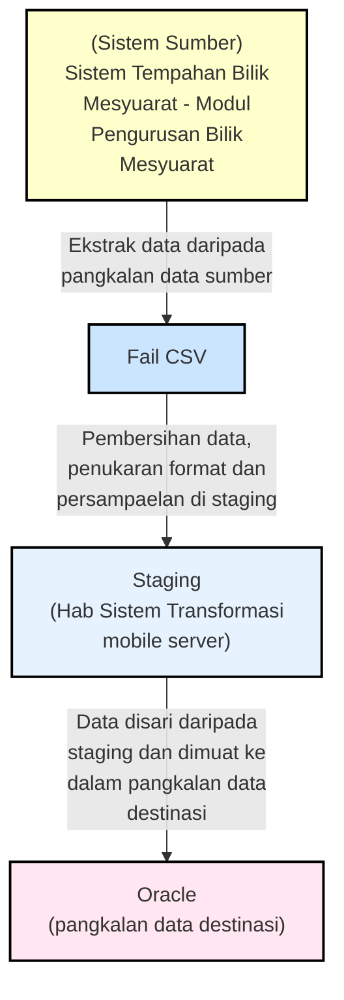
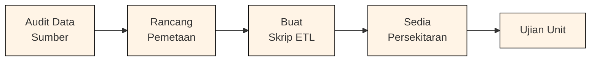
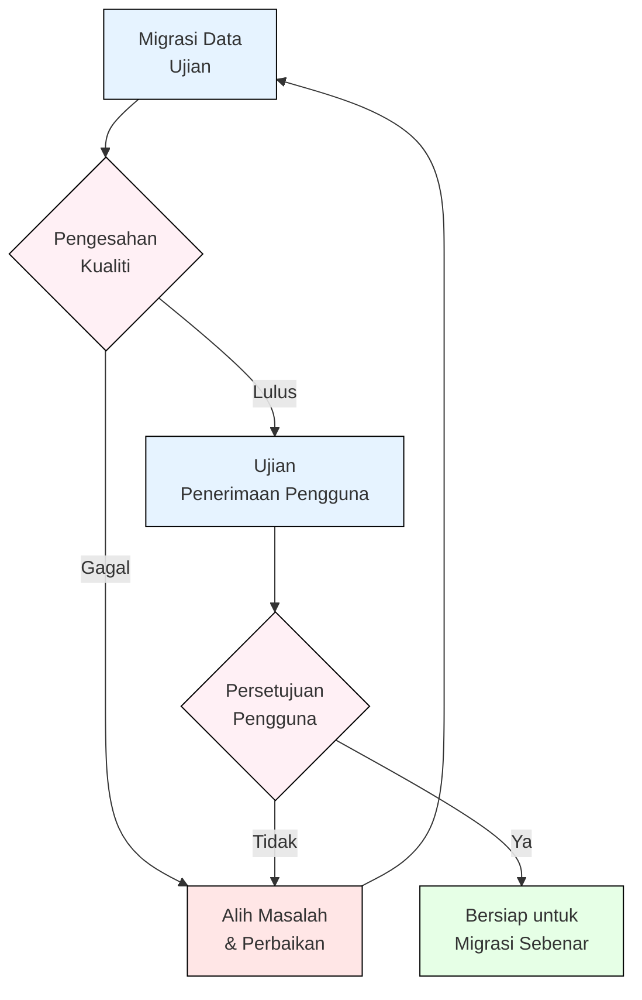
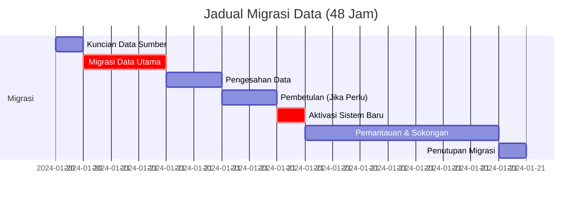
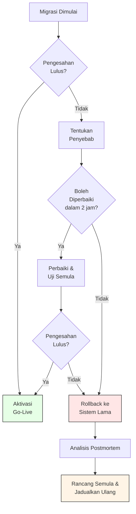

# D05: PELAN MIGRASI DATA (Data Migration Plan)

**Rujukan:** SMPBM / PMD  
**Tajuk:** Pelan Migrasi Data (PMD)  
**Mukasurat:** 1

---

## Daftar Kandungan

1. [Pengenalan](#1-pengenalan)
2. [Skop Pelan Migrasi Data](#2-skop-pelan-migrasi-data)
3. [Matlamat dan Objektif](#3-matlamat-dan-objektif)
4. [Anggaran Sumber](#4-anggaran-sumber)
5. [Pendekatan Migrasi](#5-pendekatan-migrasi)
6. [Kaedah Pelaksanaan Migrasi Data](#6-kaedah-pelaksanaan-migrasi-data)
7. [Jadual Migrasi](#7-jadual-migrasi)
8. [Strategi Pengurusan Risiko](#8-strategi-pengurusan-risiko)
9. [Strategi Komunikasi](#9-strategi-komunikasi)

---

## 1. PENGENALAN

Pelan Migrasi Data (PMD) adalah dokumen strategis yang merangka pendekatan komprehensif untuk memindahkan data dari sistem lama ke sistem baru. Dokumen ini menetapkan:

- **Skop:** Data dan sistem yang akan dimigrasikan
- **Jadual:** Garis masa pelaksanaan migrasi
- **Sumber:** Sumber manusia, teknologi, dan kewangan
- **Risiko:** Potensi halangan dan strategi mitigasi
- **Komunikasi:** Rancangan pemberitahuan kepada pihak berkepentingan

---

## 2. SKOP PELAN MIGRASI DATA

### 2.1 Data Sumber

Data akan dimigrasikan daripada sistem berikut:

| Sistem Sumber | Jenis Data | Jumlah Rekod (Anggaran) | Saiz Data |
|---|---|---|---|
| Sistem Lama 1 | Pelanggan | 50,000 | 2.5 GB |
| Sistem Lama 2 | Transaksi | 1,000,000 | 15 GB |
| Sistem Lama 3 | Produk | 25,000 | 500 MB |
| **Jumlah** | | **1,075,000** | **18 GB** |

### 2.2 Data Destinasi

Sistem destinasi adalah **Sistem Mengurus Pengguna Bilik Mesyuarat (SPBM)** dengan basis data Oracle yang baru.

### 2.3 Data yang Tidak Dimigrasikan

Data berikut **TIDAK** akan dimigrasikan:

- Data arkib lama (>10 tahun)
- Data pembatalan peribadi (GDPR compliance)
- Data sementara dan fail log

---

## 3. MATLAMAT DAN OBJEKTIF

### 3.1 Matlamat Utama

Memindahkan keseluruhan data dari sistem lama ke sistem SPBM baru dengan:

- ✓ Kesahihan data 100%
- ✓ Sifar kehilangan data
- ✓ Gangguan perniagaan minimum
- ✓ Masa penyelesaian < 48 jam

### 3.2 Objektif Spesifik

| Objektif | Petunjuk Kejayaan | Target |
|---|---|---|
| Kesahihan data | Rekod yang sepadan (%) | 99.9% |
| Kepaduan integriti | Rujukan asing yang sah | 100% |
| Keupayaan akses | Pengguna dapat log masuk | 100% pada hari +1 |
| Dokumentasi | Laporan migrasi lengkap | Sebelum penutupan |

---

## 4. ANGGARAN SUMBER

### 4.1 Sumber Manusia

```
Ketua Projek Migrasi: 1 (Full-time)
    ├─ Jurutera Data: 2 (Full-time)
    ├─ DBA: 2 (Full-time)
    ├─ Penguji QA: 3 (Full-time)
    ├─ Pengurus Pengguna: 1 (Part-time)
    └─ Penyokong Teknikal: 2 (On-call)
```

**Jumlah: 11 FTE + sokongan on-call**

### 4.2 Teknologi

- 2x Pelayan Windows Server untuk persekitaran ujian
- 2x Pelayan Linux untuk persekitaran pertunjukan
- Alat ETL (SQL Server Integration Services)
- Alat pengesahan data (custom scripts + DataGrip)
- Alat pemantauan (Grafana + Prometheus)

### 4.3 Belanja Anggaran

| Kategori | Jumlah |
|---|---|
| Persoalan Teknikal | RM 150,000 |
| Sumber Manusia (80 hari) | RM 280,000 |
| Ujian dan Keselamatan | RM 50,000 |
| Kontingensi (10%) | RM 48,000 |
| **JUMLAH** | **RM 528,000** |

---

## 5. PENDEKATAN MIGRASI

### 5.1 Pendekatan Pelaksanaan Migrasi

Pelaksanaan migrasi data menggunakan pendekatan **secara sekalian (one-off)** sahaja. Jumlah yang dimigrasikan dengan data yang dimigrasikan daripada sistem lama adalah **tiada rekod (empty row)**. Dengan itu, pelaksanaan migrasi dilakukan terlebih dahulu sebelum sistem sedia digunakan.



**Rajah 1: Kaedah Pelaksanaan Migrasi Data**

Rajah 1 menunjukkan kaedah migrasi data yang akan dilaksanakan. Terdapat tiga persekitaran yang digunakan semasa proses pelaksanaan migrasi data iaitu pangkalan data sumber (pangkalan data Sistem Tempahan Bilik Mesyuarat), pangkalan data staging dan pangkalan data destinasi (pangkalan data Sistem Mengurus Pengguna Bilik Mesyuarat). Pangkalan data sumber mengandungi data sumber. Pangkalan data staging mengandungi data Sistem Tempahan Bilik Mesyuarat.

---

## 6. KAEDAH PELAKSANAAN MIGRASI DATA

### 6.1 Fasa Penyediaan

**Tempoh:** Minggu 1-2



**Aktiviti utama:**

1. Audit dan pemetaan data sumber
2. Rekabentuk skema destinasi
3. Pembangunan skrip transformasi
4. Persediaan persekitaran ujian

### 6.2 Fasa Ujian

**Tempoh:** Minggu 3-5



**Pengesahan data:**

- Kiraan rekod: Sumber vs Destinasi
- Pengekodan asing: Integriti rujukan
- Nilai bersamparan: Ketepatan transformasi
- Performa: Kecepatan pertanyaan

### 6.3 Fasa Pelaksanaan Sebenar

**Tempoh:** Hari Pelaksanaan (Sabtu pukul 22:00 - Minggu pukul 14:00)

**Langkah-langkah:**

1. **Kuncian data sumber** (22:00 Sabtu)
   - Hentikan semua pengguna dari sistem lama
   - Buat sandaran akhir

2. **Migrasi data utama** (23:00 Sabtu - 02:00 Ahad)
   - Jalankan skrip ETL penuh
   - Tempoh: ~3 jam untuk 1 juta rekod

3. **Pengesahan pasca migrasi** (02:00 - 04:00 Ahad)
   - Jalankan semua semakan kualiti
   - Pembetulan data jika ada masalah

4. **Aktivasi sistem baru** (04:00 Ahad)
   - Alih perolehan pengguna ke sistem baru
   - Tes fail sebelum pembukaan pengguna

5. **Pemantauan Langsung** (04:00 - 14:00 Ahad)
   - Sokongan penuh untuk pengguna
   - Memantau performa sistem
   - Larangan masalah ASAP



---

## 7. JADUAL MIGRASI

### 7.1 Jadual Keseluruhan

| Fasa | Aktiviti | Mula | Tamat | Durasi | Pemimpin |
|---|---|---|---|---|---|
| **Penyediaan** | Audit & Audit | 2024-01-01 | 2024-01-12 | 2 minggu | Ketua Projek |
| | Pembangunan Skrip | 2024-01-02 | 2024-01-12 | 2 minggu | Jurutera Data |
| **Ujian** | Migrasi UAT | 2024-01-15 | 2024-01-19 | 1 minggu | Penguji QA |
| | Analisis Masalah | 2024-01-15 | 2024-01-19 | 1 minggu | Jurutera Data |
| **Sebenar** | Migrasi Produksi | 2024-01-20 22:00 | 2024-01-21 06:00 | 8 jam | Ketua Projek |
| **Penutupan** | Dokumentasi & Pelaporan | 2024-01-22 | 2024-01-26 | 1 minggu | Ketua Projek |

### 7.2 Peristiwa Utama & Pembatasan

- **Kunci Tanggal:** 15 Januari 2024 - Hadiah skrip ETL siap untuk ujian
- **Tanggal Pengesahan UAT:** 19 Januari 2024
- **Tanggal Pelaksanaan:** 20-21 Januari 2024 (Sabtu-Minggu)
- **Go-Live:** Ahad, 21 Januari 2024 pukul 14:00

---

## 8. STRATEGI PENGURUSAN RISIKO

### 8.1 Matriks Risiko Migrasi

| Risiko | Kemungkinan | Kesan | Tingkat | Strategi Mitigasi |
|---|---|---|---|---|
| Kehilangan Data | Rendah | Sangat Tinggi | **KRITIKAL** | Sandaran ganda, pengesahan di setiap langkah |
| Kelewatan Jadual | Sederhana | Tinggi | **TINGGI** | Buffer masa, persediaan awal |
| Kekompatibilan Data | Sederhana | Tinggi | **TINGGI** | Ujian menyeluruh, pengesahan skema |
| Kegagalan Aplikasi | Rendah | Tinggi | **SEDERHANA** | Rancangan rollback, sistem berlebihan |
| Ketiadaan Pengguna | Tinggi | Sederhana | **SEDERHANA** | Latihan awal, dokumentasi pengguna |

### 8.2 Rancangan Rollback

**Jika migrasi gagal:**

1. **Notis Rollback:** Keputusan dibuat dalam 2 jam dari permulaan
2. **Pemulihan:** Pulihkan semua sistem ke keadaan pra-migrasi
3. **Komunikasi:** Patuhi semua pengguna dan pihak berkepentingan
4. **Analisis:** Diadakan semakan komprehensif sebelum percubaan semula



---

## 9. STRATEGI KOMUNIKASI

### 9.1 Jadual Komunikasi

| Masa | Penonton | Mesej | Saluran |
|---|---|---|---|
| **W-4 minggu** | Semua Staf | Pengumuman proyek, jadual dimulai | Email & Mesyuarat |
| **W-2 minggu** | Pengguna Kunci | Sesi latihan teknikal | Bilik Kelas |
| **W-1 minggu** | Semua Pengguna | Pengingat terakhir, panduan rollover | Email & Intranet |
| **Hari Pelaksanaan** | Tim Migrasi | Status jam-demi-jam | Saluran Slack Khusus |
| **Hari Pelaksanaan + 1** | Semua Pengguna | Sistem aktif, hubungi dukungan jika ada masalah | Email & Portal |
| **W+1 minggu** | Pengurusan | Laporan terakhir dan pembelajaran | Mesyuarat Penutupan |

### 9.2 Pesan Kunci Pengguna

**Sebelum Migrasi:**
> "Sistem kami akan ditingkatkan untuk meningkatkan performa dan fitur baru. Akan terdapat waktu henti selama 16 jam pada akhir pekan. Data Anda akan dipindahkan dengan aman."

**Semasa Migrasi:**
> "Migrasi sedang berlangsung. Sistem akan offline sementara. Tim dukungan kami tersedia 24/7 di [saluran dukungan]."

**Selepas Migrasi:**
> "Selamat datang ke sistem baru! Jika Anda mengalami masalah, hubungi dukungan teknikal kami. Panduan pengguna tersedia di [portal]."

---

## 10. DOKUMENTASI DAN PELAPORAN

### 10.1 Laporan Migrasi Akhir

Selepas migrasi selesai, laporan menyeluruh akan disediakan meliputi:

- **Ringkasan Eksekutif:** Status keseluruhan, hasil utama
- **Statistik Migrasi:** Rekod dimigrasikan, waktu, kesalahan
- **Pengesahan Data:** Pemeriksaan integritas terperinci
- **Isu dan Resolusi:** Masalah ditemukan dan cara diselesaikan
- **Pembelajaran:** Pelajaran untuk proyék masa depan
- **Rekomendasi:** Langkah tindakan untuk peningkatan
- **Tanda Tangan:** Persetujuan pengurusan dan pemilik bisnis

### 10.2 Dokumentasi Teknikal

Dokumentasi berikut akan diperbarui:

- Perubahan skema pangkalan data
- Spesifikasi transformasi data
- Prosedur operasi saat ini
- Panduan pemulihan darurat
- Panduan dukungan teknikal

---

## PENGESAHAN

| Peranan | Nama | Tandatangan | Tarikh |
|---|---|---|---|
| Ketua Projek Migrasi | __________________ | __________________ | ________ |
| Pengurus Data | __________________ | __________________ | ________ |
| Ketua IT | __________________ | __________________ | ________ |
| Pengelolaan Bisnis | __________________ | __________________ | ________ |

---

**Dokumen ini adalah sampel maklumat dan tidak menggantikan dokumentasi sebenar projek. Setiap projek harus menyesuaikan rancangan ini dengan keperluan khusus mereka.**
