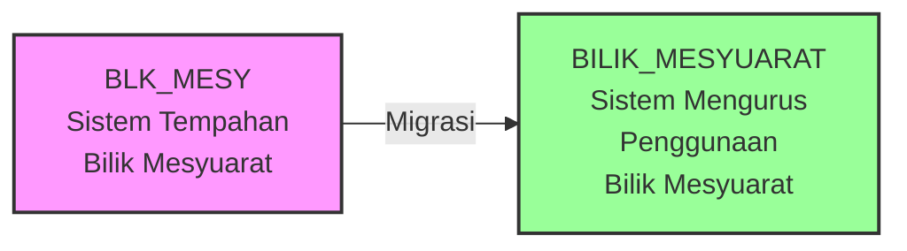
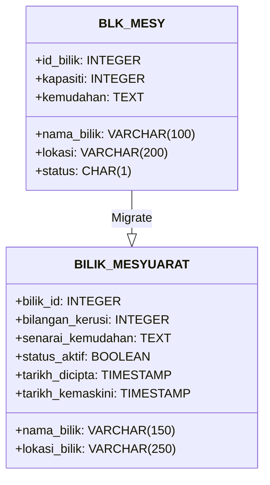
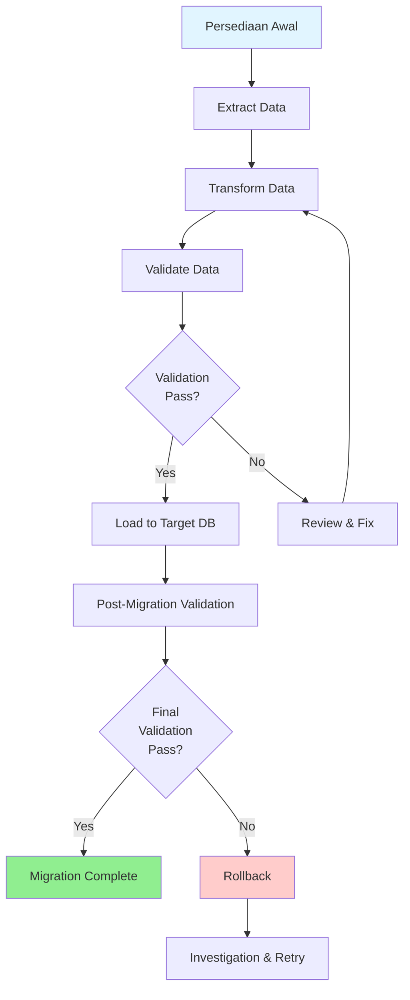
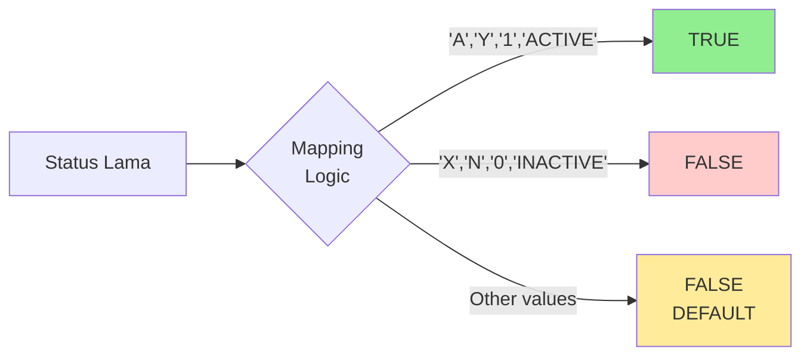
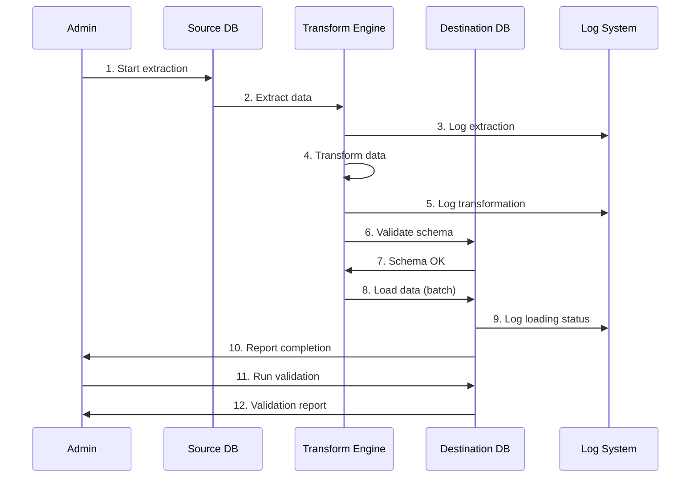
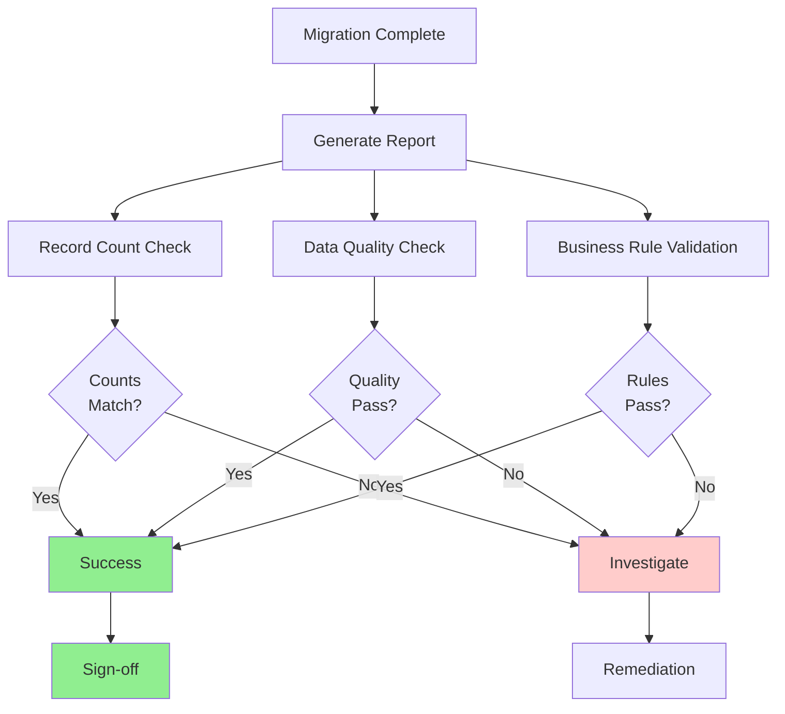
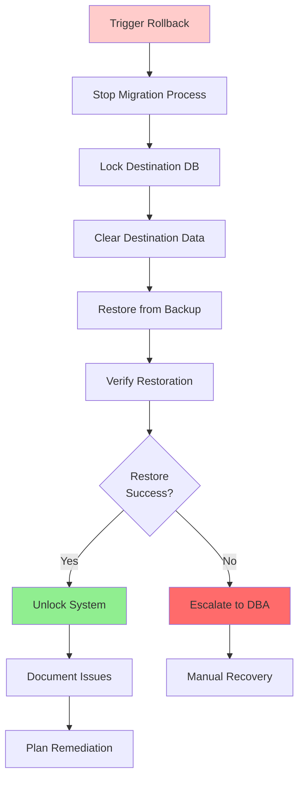
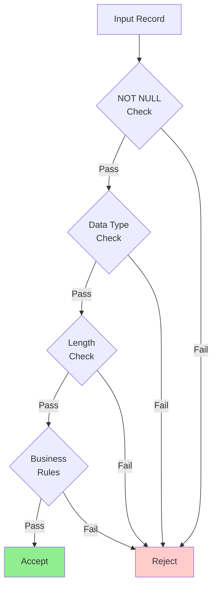
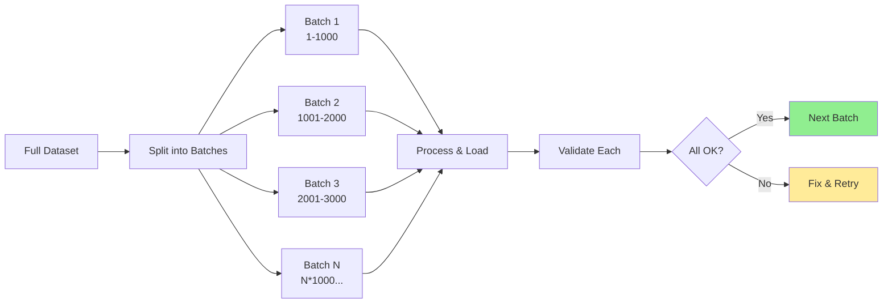

# D06 - DOKUMEN SPESIFIKASI MIGRASI DATA (SMD)
## Data Migration Specification Document

**Rujukan:** SMPBM / SMD  
**Tajuk:** Spesifikasi Migrasi Data (SMD)  
**Mukasurat:** 1-17

---

## DOKUMEN INI MENGANDUNGI MAKLUMAT YANG SULIT DAN TERHAD

**PERINGATAN:**
Dokumen ini mengandungi maklumat sulit dan terhad yang memiliki hak cipta terpelihara. Tiada bahagian daripada dokumen ini boleh diterbitkan semula atau dipindahkan dalam apa jua bentuk atau dengan apa cara sekalipun, sama ada secara elektronik, mekanikal, melalui fotokopi, rakaman atau lain-lain tanpa kebenaran bertulis terlebih dahulu daripada pihak MAMPU.

**HAKCIPTA TERPELIHARA © 2008 MAMPU**

**Edisi:** [Edisi]  
**Tarikh Efektif:** [Tarikh Efektif]

---

## KANDUNGAN

### 1. PENGENALAN
1.1 Tujuan Dokumen  
1.2 Skop Dokumen  
1.3 Objektif  
1.4 Definisi, Akronim dan Singkatan

### 2. SUMBER RUJUKAN

### 3. PEMETAAN JADUAL

#### Jadual 4: Pemetaan jadual antara sistem legasi dengan sistem baharu

| BIL. | JADUAL PANGKALAN DATA SUMBER (Sistem Tempahan Bilik Mesyuarat) | JADUAL PANGKALAN DATA DESTINASI (Sistem Mengurus Penggunaan Bilik Mesyuarat) |
|------|----------------------------------------------------------------|-------------------------------------------------------------------------------|
| 1. | BLK_MESY | BILIK_MESYUARAT |

---

## 1. PENGENALAN

### 1.1 Tujuan Dokumen

Dokumen Spesifikasi Migrasi Data (SMD) bertujuan untuk menyediakan spesifikasi yang lengkap bagi proses migrasi data dari sistem lama ke sistem baharu. Dokumen ini menerangkan:

- Pemetaan jadual antara sistem legasi dengan sistem baharu
- Transformasi data yang diperlukan
- Prosedur dan strategi migrasi
- Validasi dan verifikasi data selepas migrasi

### 1.2 Skop Dokumen

Dokumen ini merangkumi:

- Pemetaan struktur pangkalan data
- Spesifikasi medan dan jenis data
- Peraturan transformasi data
- Prosedur pengesahan data
- Pelan rollback dan recovery

### 1.3 Objektif

Objektif utama dokumen ini adalah:

1. Memastikan kelancaran proses migrasi data
2. Menjaga integriti dan ketepatan data semasa migrasi
3. Meminimumkan downtime sistem
4. Menyediakan dokumentasi lengkap untuk rujukan dan audit

### 1.4 Definisi, Akronim dan Singkatan

| Akronim/Singkatan | Keterangan |
|-------------------|------------|
| SMD | Spesifikasi Migrasi Data |
| SMPBM | Sistem Mengurus Penggunaan Bilik Mesyuarat |
| ERD | Entity Relationship Diagram |
| MAMPU | Malaysian Administrative Modernisation and Management Planning Unit |

---

## 2. SUMBER RUJUKAN

Dokumen-dokumen rujukan yang berkaitan dengan Spesifikasi Migrasi Data:

1. **Dokumen Spesifikasi Keperluan Perisian (SRS)**
   - Kod Rujukan: [Kod SRS]
   - Versi: [Versi SRS]

2. **Dokumen Reka Bentuk Pangkalan Data**
   - Kod Rujukan: [Kod Database Design]
   - Versi: [Versi Database Design]

3. **Dokumen Pelan Migrasi Data**
   - Kod Rujukan: D05
   - Versi: [Versi D05]

4. **Standard dan Garis Panduan MAMPU**
   - Garis Panduan Pembangunan Sistem
   - Standard Pengurusan Data

---

## 3. PEMETAAN JADUAL

### 3.1 Pemetaan Jadual Antara Sistem Legasi dengan Sistem Baharu

Berdasarkan ERD bagi kedua-dua sistem, Jadual 4 merupakan senarai jadual dalam Sistem Tempahan Bilik Mesyuarat (sistem legasi) yang terlibat dalam pemetaan dengan jadual-jadual di dalam pangkalan data Sistem Mengurus Penggunaan Bilik Mesyuarat (sistem baharu).

#### Jadual 4: Pemetaan Jadual Antara Sistem Legasi dengan Sistem Baharu



| BIL. | JADUAL PANGKALAN DATA SUMBER | JADUAL PANGKALAN DATA DESTINASI |
|------|------------------------------|----------------------------------|
| 1. | BLK_MESY | BILIK_MESYUARAT |

### 3.2 Pemetaan Medan (Field Mapping)

#### 3.2.1 Jadual BLK_MESY ke BILIK_MESYUARAT



**Pemetaan Medan Terperinci:**

| MEDAN SUMBER (BLK_MESY) | MEDAN DESTINASI (BILIK_MESYUARAT) | JENIS TRANSFORMASI | NOTA |
|-------------------------|-----------------------------------|-------------------|------|
| id_bilik | bilik_id | Direct mapping | Primary key |
| nama_bilik | nama_bilik | Direct mapping | Panjang maksimum meningkat 100→150 |
| lokasi | lokasi_bilik | Direct mapping | Panjang maksimum meningkat 200→250 |
| kapasiti | bilangan_kerusi | Direct mapping | Nama medan diubah |
| kemudahan | senarai_kemudahan | Direct mapping | Nama medan diubah |
| status | status_aktif | Type conversion | CHAR(1) → BOOLEAN: 'A'/'Y'=TRUE, 'X'/'N'=FALSE |
| - | tarikh_dicipta | Generate new | Timestamp masa migrasi |
| - | tarikh_kemaskini | Generate new | Timestamp masa migrasi |

---

## 4. STRATEGI MIGRASI

### 4.1 Pendekatan Migrasi



### 4.2 Fasa-fasa Migrasi

#### 4.2.1 Fasa 1: Persediaan (Preparation Phase)

- Backup lengkap sistem sumber
- Setup pangkalan data destinasi
- Verifikasi koneksi dan permissions
- Setup monitoring tools

#### 4.2.2 Fasa 2: Ekstraksi (Extraction Phase)

- Extract data dari jadual sumber
- Log semua data yang diekstrak
- Verifikasi jumlah rekod

#### 4.2.3 Fasa 3: Transformasi (Transformation Phase)

- Aplikasi peraturan transformasi
- Konversi jenis data
- Normalisasi data
- Penjanaan nilai default untuk medan baharu

#### 4.2.4 Fasa 4: Validasi (Validation Phase)

- Semak integriti data
- Verifikasi constraint dan foreign keys
- Validasi business rules
- Pengesanan dan pembetulan anomali

#### 4.2.5 Fasa 5: Loading (Loading Phase)

- Load data ke pangkalan data destinasi
- Verifikasi setiap batch
- Maintain transaction logs

#### 4.2.6 Fasa 6: Verifikasi Akhir (Final Verification Phase)

- Reconciliation report
- Data quality assessment
- User acceptance testing
- Sign-off dokumentasi

### 4.3 Peraturan Transformasi Data

#### 4.3.1 Transformasi Status

**Peraturan:**

```sql
CASE 
    WHEN status IN ('A', 'Y', '1', 'ACTIVE') THEN TRUE
    WHEN status IN ('X', 'N', '0', 'INACTIVE') THEN FALSE
    ELSE FALSE
END
```



#### 4.3.2 Penjanaan Timestamp

**Peraturan:**

```sql
-- Untuk medan baharu yang tidak wujud dalam sistem lama
tarikh_dicipta = CURRENT_TIMESTAMP
tarikh_kemaskini = CURRENT_TIMESTAMP
```

---

## 5. PROSEDUR MIGRASI

### 5.1 Pre-Migration Checklist

- [ ] Backup lengkap pangkalan data sumber telah dibuat
- [ ] Pangkalan data destinasi telah disediakan dan diuji
- [ ] Semua skrip migrasi telah disemak dan diuji di persekitaran UAT
- [ ] Downtime window telah dipersetujui dengan stakeholders
- [ ] Rollback plan telah disediakan dan diuji
- [ ] Notification kepada users telah dihantar
- [ ] Monitoring tools telah disediakan

### 5.2 Migration Steps



**Langkah-langkah Pelaksanaan:**

1. **Initiate Migration Process**

   ```bash
   ./migration-script.sh --start --config=migration.conf
   ```

2. **Extract Data from Source**

   ```sql
   SELECT * FROM BLK_MESY 
   WHERE status = 'A' 
   ORDER BY id_bilik;
   ```

3. **Transform and Load**

   ```sql
   INSERT INTO BILIK_MESYUARAT (
       bilik_id,
       nama_bilik,
       lokasi_bilik,
       bilangan_kerusi,
       senarai_kemudahan,
       status_aktif,
       tarikh_dicipta,
       tarikh_kemaskini
   )
   SELECT 
       id_bilik,
       nama_bilik,
       lokasi,
       kapasiti,
       kemudahan,
       CASE WHEN status IN ('A', 'Y') THEN TRUE ELSE FALSE END,
       CURRENT_TIMESTAMP,
       CURRENT_TIMESTAMP
   FROM staging.BLK_MESY_TEMP;
   ```

4. **Validate Counts**

   ```sql
   SELECT 
       'Source' as source_type, 
       COUNT(*) as record_count 
   FROM BLK_MESY
   UNION ALL
   SELECT 
       'Destination' as source_type, 
       COUNT(*) as record_count 
   FROM BILIK_MESYUARAT;
   ```

### 5.3 Post-Migration Validation

#### 5.3.1 Data Integrity Checks

```sql
-- Check for orphaned records
SELECT * FROM BILIK_MESYUARAT b
WHERE NOT EXISTS (
    SELECT 1 FROM BLK_MESY s 
    WHERE s.id_bilik = b.bilik_id
);

-- Validate data counts
SELECT 
    (SELECT COUNT(*) FROM BLK_MESY) as source_count,
    (SELECT COUNT(*) FROM BILIK_MESYUARAT) as dest_count,
    (SELECT COUNT(*) FROM BLK_MESY) - 
    (SELECT COUNT(*) FROM BILIK_MESYUARAT) as difference;
```

#### 5.3.2 Reconciliation Report



---

## 6. ROLLBACK STRATEGY

### 6.1 Rollback Conditions

Rollback perlu dilakukan jika:

- Data count mismatch > 5%
- Critical validation errors terdeteksi
- Business rules violations
- Database corruption terdeteksi
- Stakeholder request untuk rollback

### 6.2 Rollback Process



### 6.3 Rollback Commands

```sql
-- Step 1: Create rollback backup point
CREATE TABLE BILIK_MESYUARAT_ROLLBACK AS 
SELECT * FROM BILIK_MESYUARAT;

-- Step 2: Truncate destination table if needed
TRUNCATE TABLE BILIK_MESYUARAT CASCADE;

-- Step 3: Restore from backup
RESTORE DATABASE destination_db 
FROM backup_file 
WITH RECOVERY;

-- Step 4: Verify restoration
SELECT COUNT(*), MIN(bilik_id), MAX(bilik_id) 
FROM BILIK_MESYUARAT;
```

---

## 7. DATA QUALITY RULES

### 7.1 Validation Rules



### 7.2 Data Quality Metrics

| Metric | Threshold | Action if Failed |
|--------|-----------|------------------|
| Completeness | 98% | Review missing data |
| Accuracy | 95% | Data cleansing required |
| Consistency | 99% | Investigate inconsistencies |
| Timeliness | Within 4 hours | Escalate to management |
| Uniqueness | 100% | Remove duplicates |

---

## 8. PERFORMANCE CONSIDERATIONS

### 8.1 Batch Processing



**Recommended Batch Size:** 1,000 - 5,000 records per batch

### 8.2 Performance Tuning

- **Disable Indexes** during bulk load
- **Disable Triggers** temporarily
- **Increase Transaction Log Size**
- **Use BULK INSERT** operations
- **Parallel Processing** where possible

---

## 9. SECURITY AND COMPLIANCE

### 9.1 Data Security During Migration

- Encryption of data in transit
- Secure credential management
- Access control and auditing
- Data masking for sensitive information
- Compliance with PDPA requirements

### 9.2 Audit Trail

```sql
CREATE TABLE MIGRATION_AUDIT_LOG (
    log_id SERIAL PRIMARY KEY,
    migration_batch VARCHAR(50),
    table_name VARCHAR(100),
    operation VARCHAR(20),
    record_count INTEGER,
    status VARCHAR(20),
    error_message TEXT,
    executed_by VARCHAR(100),
    execution_timestamp TIMESTAMP DEFAULT CURRENT_TIMESTAMP
);
```

---

## 10. APPENDIX

### 10.1 Sample Data

**Before Migration (BLK_MESY):**

```
| id_bilik | nama_bilik | lokasi | kapasiti | kemudahan | status |
|----------|------------|--------|----------|-----------|--------|
| 1 | Bilik Mesyuarat A | Tingkat 3 | 20 | Projector, Whiteboard | A |
| 2 | Bilik Mesyuarat B | Tingkat 5 | 15 | LCD, Sound System | X |
```

**After Migration (BILIK_MESYUARAT):**

```
| bilik_id | nama_bilik | lokasi_bilik | bilangan_kerusi | senarai_kemudahan | status_aktif | tarikh_dicipta | tarikh_kemaskini |
|----------|------------|--------------|-----------------|-------------------|--------------|----------------|------------------|
| 1 | Bilik Mesyuarat A | Tingkat 3 | 20 | Projector, Whiteboard | TRUE | 2024-01-15 10:00:00 | 2024-01-15 10:00:00 |
| 2 | Bilik Mesyuarat B | Tingkat 5 | 15 | LCD, Sound System | FALSE | 2024-01-15 10:00:05 | 2024-01-15 10:00:05 |
```

### 10.2 Contact Information

**Migration Team:**

- Migration Lead: [Nama]
- Database Administrator: [Nama]
- Quality Assurance: [Nama]
- Project Manager: [Nama]

**Escalation Contact:**

- Level 1: [Contact]
- Level 2: [Contact]
- Level 3: [Contact]

---

## MAKLUMAT SEMAKAN DOKUMEN

| Versi | Tarikh | Disediakan Oleh | Disemak Oleh | Diluluskan Oleh | Catatan |
|-------|--------|-----------------|--------------|-----------------|---------|
| 1.0 | [Tarikh] | [Nama] | [Nama] | [Nama] | Versi awal |
| 1.1 | [Tarikh] | [Nama] | [Nama] | [Nama] | Kemaskini berdasarkan feedback |

---

## PENUTUP

Dokumen Spesifikasi Migrasi Data ini menyediakan panduan lengkap untuk proses migrasi data dari Sistem Tempahan Bilik Mesyuarat (sistem legasi) ke Sistem Mengurus Penggunaan Bilik Mesyuarat (sistem baharu). Semua pihak yang terlibat dalam proses migrasi perlu mematuhi prosedur dan garis panduan yang dinyatakan dalam dokumen ini.

Sebarang pertanyaan atau keperluan untuk penjelasan lanjut boleh dirujuk kepada ketua pasukan migrasi atau pengurus projek.

---

**TAMAT DOKUMEN**

**Rujukan:** SMPBM / SMD  
**Hakcipta Terpelihara © 2008 MAMPU**
