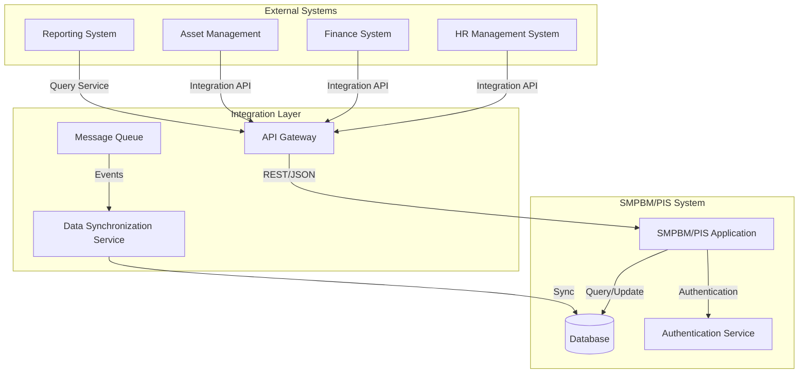
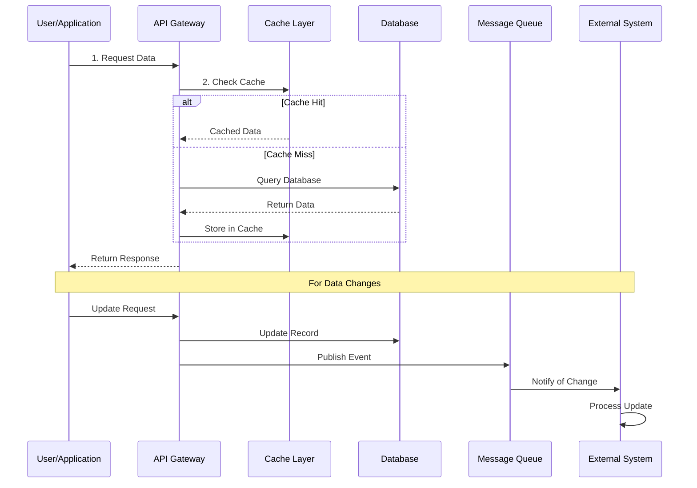
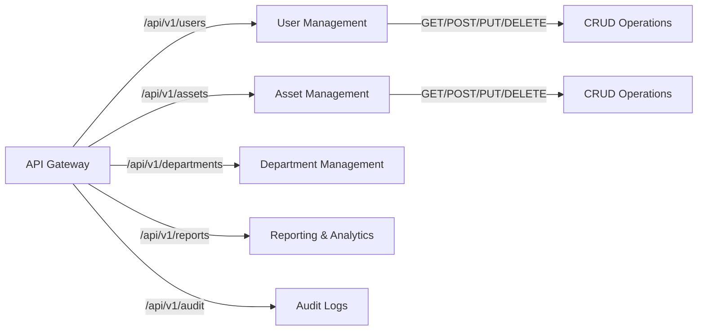
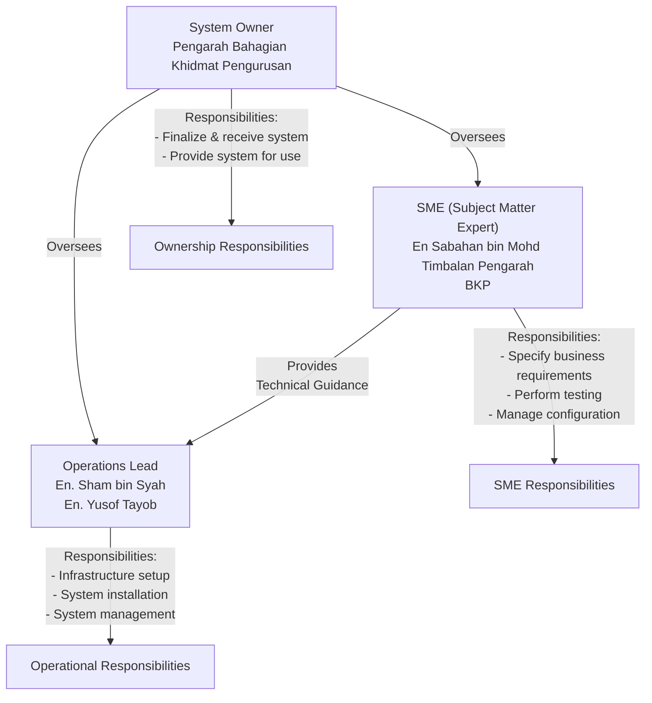
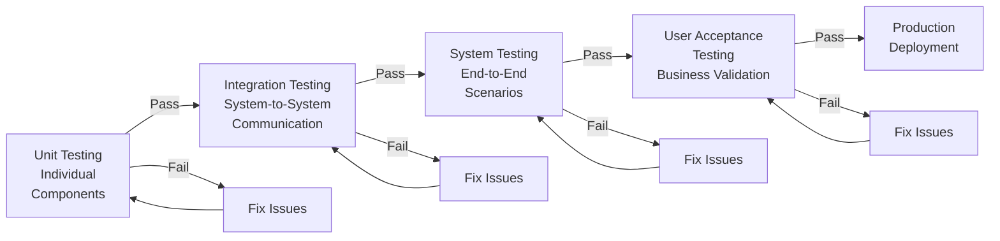
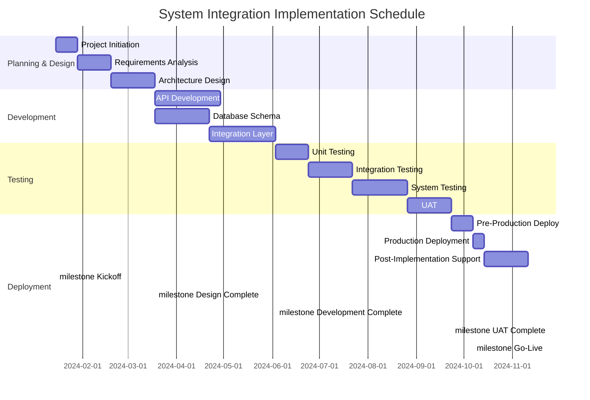
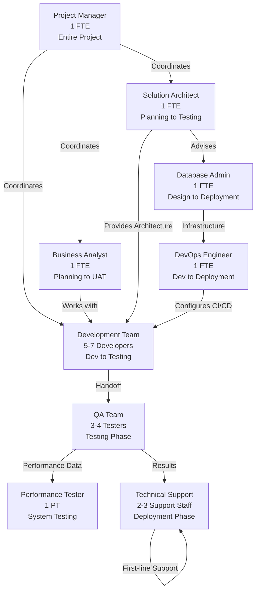

# D07: DOKUMEN PELAN INTEGRASI SISTEM (SAMPLE)

## Document Information

| Item | Details |
|------|---------|
| **Document Code** | D07 |
| **Title** | Dokumen Pelan Integrasi Sistem (System Integration Plan Document) |
| **Status** | Sample Documentation |
| **Applicable to** | SMPBM / PIS |
| **Classification** | Technical Planning |

---

## Table of Contents

1. [Executive Summary](#1-executive-summary)
2. [Introduction](#2-introduction)
3. [System Architecture Overview](#3-system-architecture-overview)
4. [Data Integration Strategy](#4-data-integration-strategy)
5. [Technical Specifications](#5-technical-specifications)
6. [Security and Compliance](#6-security-and-compliance)
7. [Testing and Validation](#7-testing-and-validation)
8. [Implementation Schedule](#8-implementation-schedule)

---

## 1. Executive Summary

The System Integration Plan (Pelan Integrasi Sistem) document provides a comprehensive strategy for integrating the SMPBM/PIS system with existing organizational infrastructure. This plan outlines:

- Integration objectives and scope
- Technical architecture and components
- Data flow and mapping specifications
- Security requirements and compliance measures
- Testing procedures and validation methods
- Implementation timeline and resource allocation

---

## 2. Introduction

### 2.1 Purpose

The purpose of this document is to establish a detailed plan for integrating the SMPBM/PIS system into the organization's IT environment, ensuring seamless data exchange, system communication, and operational continuity.

### 2.2 Scope

This integration plan covers:

- All interconnected systems and applications
- Data exchange protocols and mechanisms
- API specifications and interfaces
- Security and authentication mechanisms
- Performance requirements and optimization
- Disaster recovery and business continuity aspects

### 2.3 Document Organization

This document is structured to provide:

- Technical specifications for integration
- Detailed implementation procedures
- Clear responsibilities and timelines
- Quality assurance protocols
- Risk mitigation strategies

---

## 3. System Architecture Overview

### 3.1 System Integration Architecture

The SMPBM/PIS integration follows a modular architecture designed to facilitate seamless communication between systems while maintaining security and data integrity.



### 3.2 Key Components

The integration architecture comprises the following key components:

| Component | Function | Interface |
|-----------|----------|-----------|
| **API Gateway** | Central point for system-to-system communication | REST APIs, JSON payloads |
| **Message Queue** | Asynchronous event processing | AMQP, RabbitMQ |
| **Data Synchronization Service** | Real-time data sync between systems | Database triggers, scheduled jobs |
| **Authentication Service** | User identity and access management | OAuth 2.0, JWT |
| **Reporting Service** | Generate integrated reports and dashboards | SQL queries, data warehousing |

---

## 4. Data Integration Strategy

### 4.1 Data Flow Diagram



### 4.2 Data Mapping Specifications

All integrated systems follow standardized data mapping to ensure consistency:

- **Entity Mapping**: SMPBM entities map to corresponding external system entities
- **Field Mapping**: Standard field definitions across all systems
- **Data Type Mapping**: Conversion rules for different data types
- **Validation Rules**: Applied at integration points

---

## 5. Technical Specifications

### 5.1 API Specifications

#### REST API Standards

- **Protocol**: HTTPS/HTTP 2.0
- **Data Format**: JSON
- **Authentication**: OAuth 2.0 + JWT
- **Rate Limiting**: 1000 requests/hour per application
- **Timeout**: 30 seconds standard, 60 seconds for batch operations

#### API Endpoint Categories



### 5.2 Database Integration

#### Connection Specifications

- **Type**: SQL Server / MySQL
- **Connection Pooling**: Enabled (min: 5, max: 50 connections)
- **Backup Strategy**: Daily incremental, Weekly full backup
- **Replication**: Master-Slave for high availability
- **Encryption**: TLS 1.2+ for all connections

#### Stored Procedures and Views

Critical integration views and procedures:

```sql
-- Example: User Activity Sync Procedure
CREATE PROCEDURE sp_SyncUserActivity
    @LastSyncTime DATETIME
AS
BEGIN
    SELECT user_id, action, timestamp
    FROM user_audit_log
    WHERE timestamp > @LastSyncTime
    ORDER BY timestamp ASC
END
```

### 5.3 Message Queue Configuration

- **Technology**: RabbitMQ / Apache Kafka
- **Message Format**: JSON
- **Queue Types**: Standard queues for events, Priority queues for critical updates
- **Retention**: 7 days or 1GB (whichever comes first)
- **Acknowledgment**: Manual ACK for reliability

---

## 6. Security and Compliance

### 6.1 Subject Matter Expert (SME) and Operational Roles

The integration requires dedicated resources with specific expertise:



### 6.2 Security Requirements

#### Authentication & Authorization

- **Multi-factor Authentication (MFA)**: Enabled for all admin users
- **Role-Based Access Control (RBAC)**: Granular permission management
- **Single Sign-On (SSO)**: Integration with organizational SSO (if available)
- **Session Timeout**: 30 minutes of inactivity for standard users, 60 minutes for admins

#### Data Security

- **Encryption at Rest**: AES-256 for all sensitive data
- **Encryption in Transit**: TLS 1.2+ for all network communication
- **Data Masking**: PII fields masked in non-production environments
- **Key Management**: Centralized key management service (Azure Key Vault / AWS KMS)

#### Audit & Compliance

- **Audit Logging**: All system activities logged with timestamp and user ID
- **Log Retention**: 1 year minimum for compliance
- **Compliance Standards**: Adherence to PDPA, ISO 27001, OWASP Top 10
- **Regular Security Audits**: Quarterly penetration testing and vulnerability assessments

---

## 7. Testing and Validation

### 7.1 Testing Strategy

The integration testing follows a comprehensive multi-phase approach:



### 7.2 Test Cases and Scenarios

#### Critical Test Scenarios

| Scenario | Test Case | Expected Result |
|----------|-----------|-----------------|
| **User Authentication** | Login with valid credentials | User authenticated, access granted |
| **Data Synchronization** | Update record in source system | Update reflected in all integrated systems within 5 seconds |
| **API Rate Limiting** | Send 1001 requests in 1 hour | Request 1001 rejected with 429 status |
| **Database Failover** | Primary DB goes offline | Secondary DB takes over, no data loss |
| **Error Handling** | Invalid request to API | Appropriate HTTP status + error message returned |
| **Security** | Attempt unauthorized access | Access denied, incident logged |

### 7.3 Performance Benchmarks

- **API Response Time**: < 200ms for 95% of requests
- **Data Synchronization Latency**: < 5 seconds for all updates
- **System Availability**: 99.5% uptime SLA
- **Concurrent Users**: Support for minimum 500 simultaneous users
- **Transaction Throughput**: Minimum 1000 transactions/second

---

## 8. Implementation Schedule

### 8.1 Project Timeline

The integration project spans multiple phases with clear milestones and deliverables:



### 8.2 Implementation Phases

#### Phase 1: Planning & Design (Jan - Mar 2024)

- **Deliverables**: Project charter, requirements document, architecture diagram, design specifications
- **Resources**: Project Manager, Business Analyst, Solution Architect
- **Key Activities**: Stakeholder interviews, system analysis, technical design reviews

#### Phase 2: Development (Mar - Jun 2024)

- **Deliverables**: Source code, API documentation, database schema, configuration files
- **Resources**: Development team (5-7 developers), Database Administrator, DevOps Engineer
- **Key Activities**: Coding, code reviews, documentation, build setup

#### Phase 3: Testing (Jun - Sep 2024)

- **Deliverables**: Test plans, test cases, bug reports, test coverage reports
- **Resources**: QA team (3-4 testers), Performance testing specialist
- **Key Activities**: Functional testing, integration testing, performance testing, UAT

#### Phase 4: Deployment (Sep - Oct 2024)

- **Deliverables**: Deployment plan, runbook, release notes, training materials
- **Resources**: DevOps team, System Administrator, Technical Support team
- **Key Activities**: Pre-prod validation, production deployment, post-go-live support

### 8.3 Resource Allocation



### 8.4 Critical Success Factors

| Factor | Description | Responsibility |
|--------|-------------|-----------------|
| **Stakeholder Engagement** | Active involvement from all departments | Project Manager |
| **Clear Requirements** | Well-defined, documented requirements | Business Analyst |
| **Technical Excellence** | Following best practices and standards | Solution Architect |
| **Quality Assurance** | Comprehensive testing at all levels | QA Lead |
| **Change Management** | Smooth transition with minimal disruption | Project Manager |
| **Risk Management** | Proactive identification and mitigation | Project Manager |

---

## Approval and Sign-Off

This System Integration Plan has been prepared by the technical team and requires approval from:

1. **Business Owner**: ______________________________ Date: ________
2. **Technical Lead**: ______________________________ Date: ________
3. **IT Director**: ______________________________ Date: ________

---

## Document History

| Version | Date | Author | Changes |
|---------|------|--------|---------|
| 1.0 | 2024-01-15 | Technical Team | Initial draft |
| 1.1 | 2024-02-01 | Technical Team | Updated after review |
| 2.0 | 2024-03-15 | Project Manager | Final approved version |

---

## Appendices

### Appendix A: Technical Terms and Definitions

- **API**: Application Programming Interface
- **CRUD**: Create, Read, Update, Delete operations
- **JWT**: JSON Web Token for authentication
- **OAuth 2.0**: Industry standard authorization protocol
- **RBAC**: Role-Based Access Control
- **REST**: Representational State Transfer architecture
- **SLA**: Service Level Agreement
- **SSO**: Single Sign-On authentication
- **TLS**: Transport Layer Security

### Appendix B: References

- Organization IT Security Policy
- System Integration Standards and Guidelines
- OWASP Top 10 Security Requirements
- ISO 27001 Information Security Management
- PDPA (Personal Data Protection Act) Compliance Requirements

### Appendix C: Contact Information

**For Technical Questions:**

- Solution Architect: [Name] - [Email]
- Project Manager: [Name] - [Email]

**For Business Questions:**

- Business Owner: [Name] - [Email]
- Stakeholder Representative: [Name] - [Email]

---

**Document Classification**: Internal Use  
**Last Updated**: 2024-03-15  
**Next Review Date**: 2024-06-15
