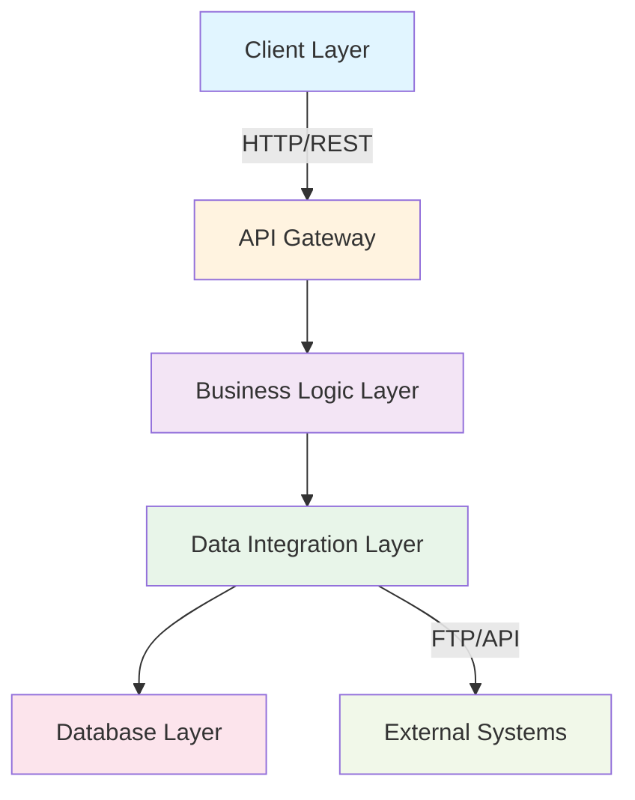
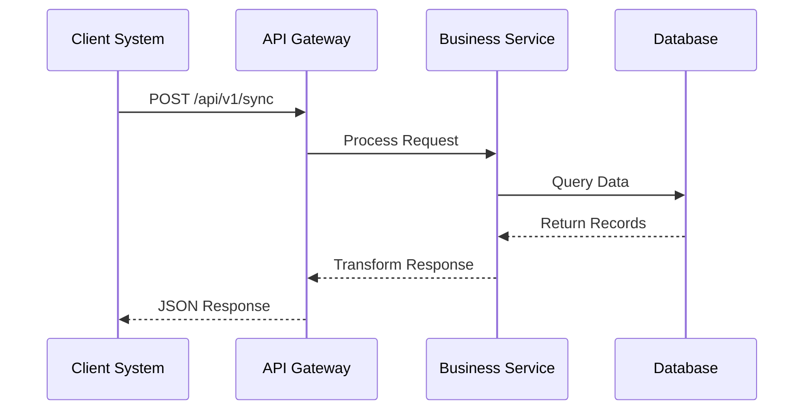
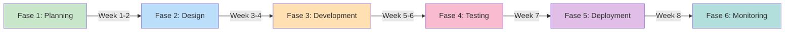
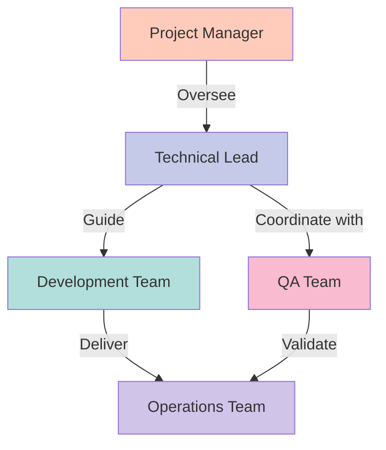
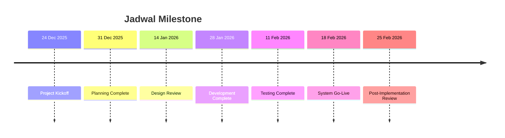
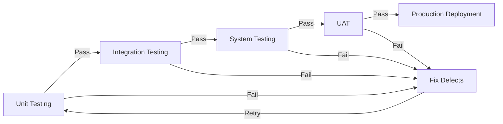
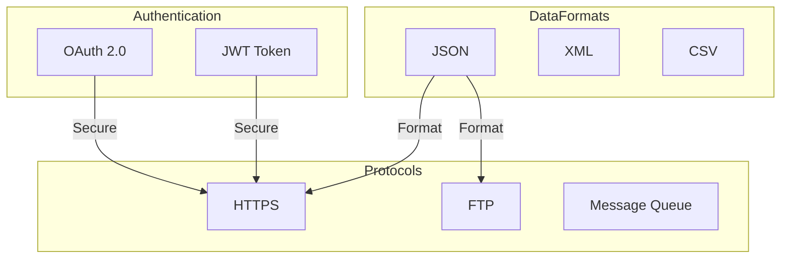

# D08 DOKUMEN SPESIFIKASI INTEGRASI SISTEM (SIS)

**Penanggung Jawab**: SMPBM / SIS  
**Tujuan**: Spesifikasi Integrasi Sistem (SIS)  
**Mukasurat**: vii

---

## DAFTAR ISI

### Halaman

1. **Sampul Depan** ......................................................... i
2. **Lembar Pengesahan** ................................................. iii
3. **Daftar Isi** ........................................................... v
4. **Pendahuluan** ......................................................... 1
5. **Spesifikasi Integrasi Sistem** ..................................... 2
6. **Pendekatan Integrasi Sistem** .................................... 4
7. **Tim Pengembang** .................................................... 5
8. **Jadwal Integrasi** .................................................. 6
9. **Kesimpulan** ......................................................... 7

---

## DAFTAR SINGKATAN

### Akronim

| Akronim | Keterangan |
|---------|-----------|
| CSV | Comma-Separated Values |
| FTP | File Transfer Protocol |
| SME | Subject Matter Expert |
| RDMS | Relational Database Management System |
| API | Application Programming Interface |
| Restful | Representational state transfer |
| JSON | JavaScript Object Notation |
| MySQL | My Structured Query Language |
| PHP | PHP Hypertext Preprocessor |

---

## 1. PENDAHULUAN

### 1.1 Latar Belakang

Dokumen Spesifikasi Integrasi Sistem (SIS) ini disusun sebagai bagian dari proses pengembangan sistem informasi. Integrasi sistem merupakan komponen kritis dalam memastikan bahwa berbagai modul dan komponen sistem dapat bekerja bersama dengan lancar dan efisien.

### 1.2 Tujuan

Tujuan dari dokumen ini adalah untuk:

- Mendeskripsikan spesifikasi teknis integrasi antar sistem
- Mendefinisikan standar dan protokol komunikasi
- Memastikan kompatibilitas antar platform
- Menyediakan panduan implementasi

### 1.3 Ruang Lingkup

Dokumen ini mencakup:

- Arsitektur integrasi sistem
- Standar komunikasi data
- Interface sistem
- Protokol pertukaran data

---

## 2. SPESIFIKASI INTEGRASI SISTEM

### 2.1 Arsitektur Integrasi



### 2.2 Standar Komunikasi

#### 2.2.1 Protokol Transfer Data

- **HTTP/HTTPS**: Untuk komunikasi web
- **FTP**: Untuk transfer file batch
- **REST API**: Untuk komunikasi sistem
- **JSON**: Format data terstruktur

#### 2.2.2 Format Data

Data yang ditransfer menggunakan format terstruktur:

```json
{
  "id": "SYS001",
  "timestamp": "2025-12-24T10:30:00Z",
  "data": {
    "record_type": "INTEGRATION",
    "status": "SUCCESS",
    "records": []
  },
  "checksum": "hash_value"
}
```

---

## 3. INTERFACE SISTEM

### 3.1 API Endpoints

| Endpoint | Metode | Deskripsi |
|----------|--------|-----------|
| `/api/v1/sync` | POST | Sinkronisasi data |
| `/api/v1/status` | GET | Status integrasi |
| `/api/v1/config` | GET | Konfigurasi sistem |
| `/api/v1/validate` | POST | Validasi data |

### 3.2 Struktur Request



---

## 4. PENDEKATAN INTEGRASI SISTEM

### 4.1 Strategi Integrasi

Integrasi sistem dilakukan melalui beberapa pendekatan:

1. **Point-to-Point Integration**
   - Koneksi langsung antar sistem
   - Cocok untuk sistem dengan jumlah terbatas

2. **Hub-and-Spoke Integration**
   - Sistem pusat mengatur komunikasi
   - Skalabilitas lebih baik

3. **Event-Driven Integration**
   - Berbasis peristiwa
   - Real-time processing

### 4.2 Tahapan Implementasi



---

## 5. TIM PENGEMBANG

### 5.1 Struktur Tim

| Posisi | Nama | Kontak |
|--------|------|--------|
| Project Manager | [Nama PM] | [Email] |
| Technical Lead | [Nama TL] | [Email] |
| Developer 1 | [Nama Dev1] | [Email] |
| Developer 2 | [Nama Dev2] | [Email] |
| QA Lead | [Nama QA] | [Email] |

### 5.2 Tanggungjawab Tim



---

## 6. JADWAL INTEGRASI

### 6.1 Timeline Proyek

| Fase | Durasi | Periode | Status |
|------|--------|---------|--------|
| Planning | 2 minggu | 24/12 - 31/12/2025 | In Progress |
| Design | 2 minggu | 1/1 - 14/1/2026 | Scheduled |
| Development | 2 minggu | 15/1 - 28/1/2026 | Scheduled |
| Testing | 2 minggu | 29/1 - 11/2/2026 | Scheduled |
| Deployment | 1 minggu | 12/2 - 18/2/2026 | Scheduled |
| Monitoring | 1 minggu | 19/2 - 25/2/2026 | Scheduled |

### 6.2 Milestone Penting



---

## 7. KRITERIA KEBERHASILAN

### 7.1 Metrik Sukses

| Kriteria | Target | Minimum |
|----------|--------|---------|
| System Uptime | 99.9% | 99.5% |
| Data Sync Success Rate | 100% | 98% |
| Response Time | < 500ms | < 1000ms |
| Error Rate | < 0.1% | < 0.5% |

### 7.2 Quality Assurance



---

## 8. RISIKO DAN MITIGASI

### 8.1 Identifikasi Risiko

| Risiko | Probabilitas | Impact | Mitigasi |
|--------|--------------|--------|----------|
| Delay integrasi API | Medium | High | Parallel development |
| Data loss | Low | Critical | Backup & recovery plan |
| Kompatibilitas DB | Medium | Medium | Version testing |
| Security issues | Medium | Critical | Security audit |

---

## 9. KESIMPULAN

### 9.1 Ringkasan

Dokumen Spesifikasi Integrasi Sistem (D08) ini telah mendefinisikan:

- Arsitektur integrasi yang komprehensif
- Standar komunikasi yang jelas
- Tim dan jadwal implementasi
- Kriteria keberhasilan yang terukur

### 9.2 Rekomendasi

1. Implementasi mengikuti timeline yang telah ditetapkan
2. Monitoring berkelanjutan selama fase testing
3. Koordinasi lintas tim untuk memastikan keberhasilan
4. Dokumentasi proses untuk referensi masa depan

### 9.3 Tindak Lanjut

- Review dokumen setiap minggu
- Update status berdasarkan progress
- Eskalasi risiko yang muncul
- Koordinasi dengan stakeholder

---

## LAMPIRAN

### A. DETAIL TEKNIS API



### B. ENVIRONMENT SETUP

| Environment | Host | Port | Status |
|-------------|------|------|--------|
| Development | localhost | 8000 | Active |
| Staging | staging.local | 443 | Active |
| Production | api.domain.com | 443 | Ready |

### C. KONTAK SUPPORT

- **Technical Support**: <tech-support@domain.com>
- **Project Manager**: <pm@domain.com>
- **Emergency Contact**: +62-XXX-XXXX-XXXX

---

**Dokumen ini adalah properti SMPBM / SIS dan bersifat CONFIDENTIAL**

Disiapkan oleh: [Nama Penyusun]  
Disetujui oleh: [Nama Persetuju]  
Tanggal: 24 Desember 2025  
Versi: 1.0

---
