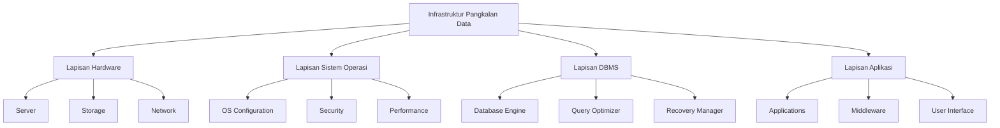
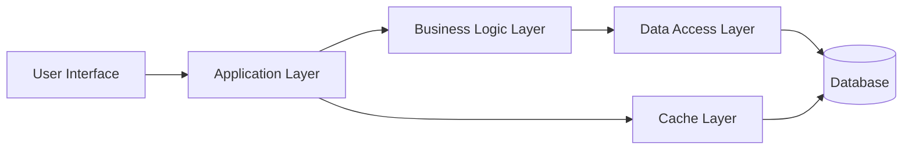
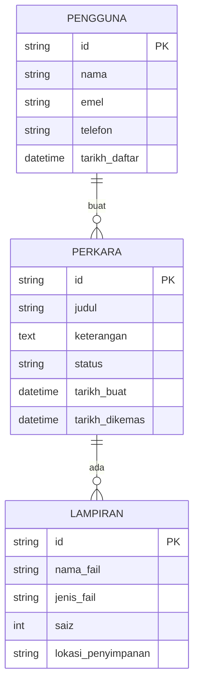
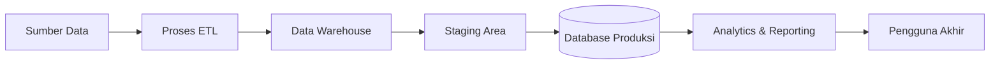
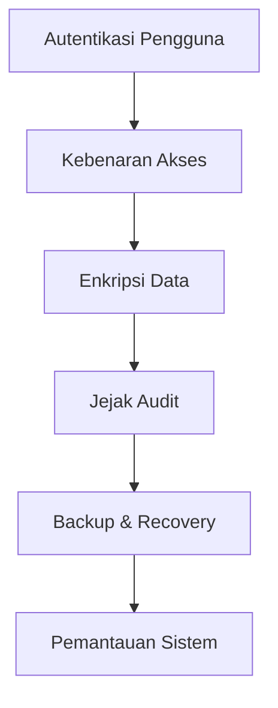
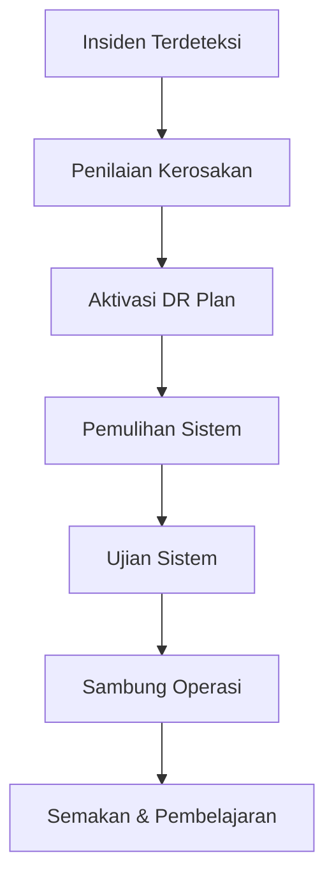
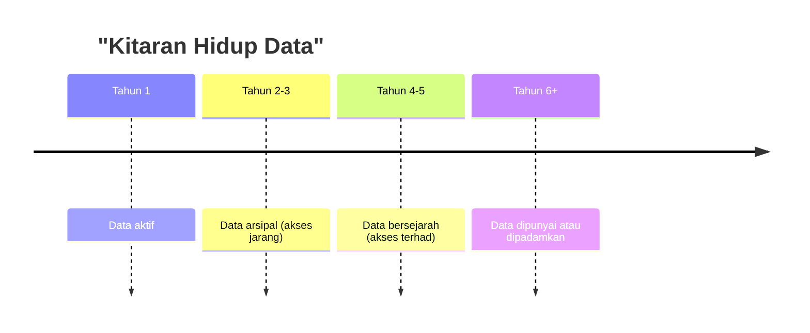

# D09 - Dokumen Pangkalan Data (Database Document)
## Data Platform Documentation - Sample

**Institusi**: Kementerian Pendidikan Malaysia (Kementerian Pusat)  
**Organisasi**: SMPBM / DPD  
**Judul**: Dokumen Pangkalan Data  
**Versi**: VI  
**Status**: Official Template & Sample

---

## Table of Contents

1. [Jadual (Table of Contents)](#jadual)
2. [Akronim (Acronyms)](#akronim)
3. [Makluman Infrastruktur Pangkalan Data](#makluman-infrastruktur)
4. [Makluman Pangkalan Data](#makluman-pangkalan-data)

---

## Jadual

### Senarai Jadual

| No. | Jadual | Muka Surat |
|-----|--------|-----------|
| 1 | Makluman Infrastruktur Pangkalan Data | 1 |
| 2 | Makluman Pangkalan Data | 1 |

---

## Akronim

### Senarai Singkatan

| Akronim | Keterangan |
|--------|-----------|
| IP | Internet Protocol |

---

## Makluman Infrastruktur Pangkalan Data

Infrastruktur pangkalan data merupakan komponen asas yang menyokong keseluruhan operasi sistem maklumat sesebuah organisasi. Dokumentasi ini menggariskan spesifikasi teknikal, seni bina, dan keperluan untuk pelaksanaan pangkalan data yang efisien dan selamat.

### Komponen Infrastruktur

Infrastruktur pangkalan data terdiri daripada beberapa lapisan teknikal:



#### Spesifikasi Sistem

**Server Requirements:**

- Minimum processor: 2.4 GHz dual-core
- RAM: 8 GB minimum (16 GB recommended)
- Storage: SSD minimum 256 GB
- Network: Dedicated gigabit connection

**Backup & Recovery:**

- Daily incremental backups
- Weekly full backups
- Recovery Time Objective (RTO): < 4 hours
- Recovery Point Objective (RPO): < 1 hour

---

## Makluman Pangkalan Data

Makluman pangkalan data mengandungi butiran lengkap mengenai struktur, skema, dan peraturan data yang digunakan dalam sistem organisasi.

### Seni Bina Pangkalan Data



### Skema Pangkalan Data



### Model Data Relasional

**Jadual: PENGGUNA**

| Kolom | Jenis | Keterangan |
|-------|-------|-----------|
| id | VARCHAR(50) | Kunci utama |
| nama | VARCHAR(100) | Nama pengguna |
| emel | VARCHAR(100) | Alamat emel |
| telefon | VARCHAR(15) | Nombor telefon |
| tarikh_daftar | DATETIME | Tarikh pendaftaran |

**Jadual: PERKARA**

| Kolom | Jenis | Keterangan |
|-------|-------|-----------|
| id | VARCHAR(50) | Kunci utama |
| id_pengguna | VARCHAR(50) | Kunci asing (PENGGUNA) |
| judul | VARCHAR(255) | Tajuk perkara |
| keterangan | TEXT | Penerangan terperinci |
| status | VARCHAR(20) | Status perkara |
| tarikh_buat | DATETIME | Tarikh penciptaan |
| tarikh_dikemas | DATETIME | Tarikh kemaskini |

**Jadual: LAMPIRAN**

| Kolom | Jenis | Keterangan |
|-------|-------|-----------|
| id | VARCHAR(50) | Kunci utama |
| id_perkara | VARCHAR(50) | Kunci asing (PERKARA) |
| nama_fail | VARCHAR(255) | Nama fail |
| jenis_fail | VARCHAR(50) | Format fail |
| saiz | INT | Saiz dalam bait |
| lokasi_penyimpanan | VARCHAR(500) | Lokasi penyimpanan |

### Aliran Data



### Keselamatan Pangkalan Data

Mekanisme keselamatan berlapis:



#### Protokol Keselamatan

1. **Autentikasi**
   - LDAP integration untuk pengguna korporat
   - Multi-factor authentication untuk akses sensitif
   - Session timeout: 30 minit ketiadaan aktiviti

2. **Enkripsi**
   - SSL/TLS untuk transmisi data
   - AES-256 untuk penyimpanan sensitif
   - Hash algoritma SHA-256 untuk kata laluan

3. **Kawalan Akses**
   - Role-Based Access Control (RBAC)
   - Principle of Least Privilege
   - Pemisahan tugas

4. **Audit & Logging**
   - Semua akses dicatat
   - Perubahan data dijejak
   - Log disimpan selama 1 tahun

### Strategi Pemulihan Bencana



**RTO dan RPO Target:**

- RTO: 4 jam
- RPO: 1 jam

### Prestasi & Optimasi

**Metrik Prestasi:**

```mermaid
xychart-beta
    title "Prestasi Pangkalan Data"
    x-axis [Jan, Feb, Mar, Apr, May, Jun]
    y-axis "Uptime %" 99, 99.5, 100
    line [99.2, 99.5, 99.8, 99.9, 99.95, 99.98]
```

**Indeks dan Optimasi:**

| Jadual | Indeks | Jenis | Faedah |
|--------|--------|-------|--------|
| PERKARA | idx_status | Tunggal | Carian pantas by status |
| PERKARA | idx_tarikh | Tunggal | Urutan kronologi |
| PERKARA | idx_pengguna_status | Komposit | Pertanyaan gabungan cepat |
| LAMPIRAN | idx_perkara | Tunggal | Gabungan pantas |

### Polisi Retensi Data



**Panduan Retensi:**

- Data transaksi aktif: 1 tahun online
- Data arsipal: 2-3 tahun (cold storage)
- Data bersejarah: 3-5 tahun (backup sahaja)
- Penghapusan: Selepas 5 tahun (dengan kelulusan)

### Pemantauan dan Penyelenggaraan

```mermaid
gantt
    title "Jadual Penyelenggaraan Rutin"
    section Harian
    Health Check :a1, 00:00, 24h
    section Mingguan
    Pemeriksaan Indeks :crit, a2, 2024-01-01, 7d
    Analisis Pertanyaan Lambat :a3, 2024-01-01, 7d
    section Bulanan
    Analisis Ruang Disk :crit, a4, 2024-01-01, 30d
    Semakan Backup :a5, 2024-01-01, 30d
    section Tahunan
    Upgrade Keselamatan :crit, a6, 2024-01-01, 365d
    Ujian DR Komprehensif :a7, 2024-01-01, 365d
```

---

## Glosari

| Istilah | Definisi |
|--------|----------|
| **Database** | Koleksi data terstruktur yang disimpan elektronik dan boleh diakses |
| **Schema** | Struktur atau rancangan logik pangkalan data |
| **Index** | Struktur data untuk pencarian data yang lebih cepat |
| **Backup** | Salinan data untuk pemulihan sekiranya kehilangan data |
| **Recovery** | Proses memulihkan sistem ke keadaan sebelum kegagalan |
| **RTO** | Recovery Time Objective - masa maksimum untuk pemulihan |
| **RPO** | Recovery Point Objective - data maksimum yang boleh hilang |
| **RBAC** | Role-Based Access Control - kawalan akses berdasarkan peranan |
| **Encryption** | Penukaran data kepada format yang tidak boleh dibaca tanpa kunci |
| **Audit Trail** | Rekod lengkap semua aktiviti sistem untuk tujuan keselamatan |

---

## Lampiran: Senarai Semak Penyelenggaraan

### Senarai Semak Harian

- [ ] Sistem berjalan dengan normal
- [ ] Tiada ralat kritikal dalam log
- [ ] Semua perkhidmatan aktif
- [ ] Disk space mencukupi (> 20% bebas)

### Senarai Semak Mingguan

- [ ] Prestasi query diperiksa
- [ ] Indeks dianalisis untuk fragmentasi
- [ ] Backup berjaya diselesaikan
- [ ] Kelewatan log diperiksa

### Senarai Semak Bulanan

- [ ] Analisis penggunaan ruang
- [ ] Ujian pemulihan backup
- [ ] Audit keselamatan
- [ ] Ulasan prestasi keseluruhan

---

**Dokumen ini adalah sampel daripada D09 - Dokumen Pangkalan Data**  
**Versi: VI | Tarikh Terakhir Dikemas: 2024**  
**Penulis: Kementerian Pendidikan Malaysia (SMPBM/DPD)**

---
