# KRISA ICTServe Mermaid Diagram Index

**SISTEM ICTSERVE**

*(Sistem Pengurusan Helpdesk dan Pinjaman Aset ICT)*

| | |
| :--- | :--- |
| **NAMA AGENSI** | : Bahagian Pengurusan Maklumat (BPM) |
| **NAMA AGENSI INDUK** | : Kementerian Pelancongan, Seni dan Budaya Malaysia (MOTAC) |
| **TARIKH DOKUMEN** | : 23 Disember 2025 |
| **VERSI DOKUMEN** | : 1.0 |

---

## i. Keterangan Dokumen

Dokumen ini menyediakan indeks komprehensif semua diagram Mermaid yang terdapat dalam dokumen KRISA ICTServe yang telah dipiawai. Ia bertujuan sebagai rujukan pantas untuk semua visualisasi sistem, aliran kerja, dan seni bina yang digunakan dalam dokumentasi sistem.

---

## ii. Senarai Dokumen KRISA

### **D01 - Pelan Pembangunan Sistem**
**Fail:** `D01_KRISA_ICTSERVE_PELAN_PEMBANGUNAN_SISTEM.md`

#### Diagram Gantt - Jadual Pembangunan Sistem

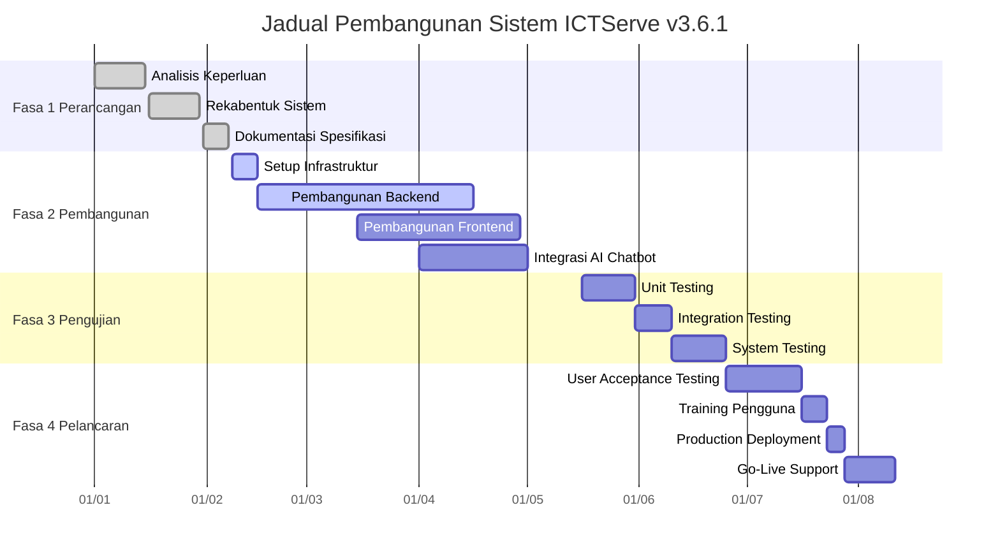
```mermaid
gantt
    title Jadual Pembangunan Sistem ICTServe v3.6.1
    dateFormat YYYY-MM-DD
    axisFormat %d/%m
    
    section Fasa 1 Perancangan
    Analisis Keperluan        :done, analisis, 2025-01-01, 2025-01-15
    Rekabentuk Sistem         :done, rekabentuk, 2025-01-16, 2025-01-30
    Dokumentasi Spesifikasi   :done, dok-spec, 2025-01-31, 2025-02-07
    
    section Fasa 2 Pembangunan
    Setup Infrastruktur      :active, infra, 2025-02-08, 7d
    Pembangunan Backend      :active, backend, 2025-02-15, 60d
    Pembangunan Frontend     :frontend, 2025-03-15, 45d
    Integrasi AI Chatbot     :ai-bot, 2025-04-01, 30d
    
    section Fasa 3 Pengujian
    Unit Testing             :testing, 2025-05-16, 15d
    Integration Testing      :integration, after testing, 10d
    System Testing           :sys-test, after integration, 15d
    
    section Fasa 4 Pelancaran
    User Acceptance Testing  :uat, after sys-test, 21d
    Training Pengguna        :training, after uat, 7d
    Production Deployment    :deploy, after training, 5d
    Go-Live Support          :support, after deploy, 14d
```

#### Diagram Aliran - Metodologi Pembangunan

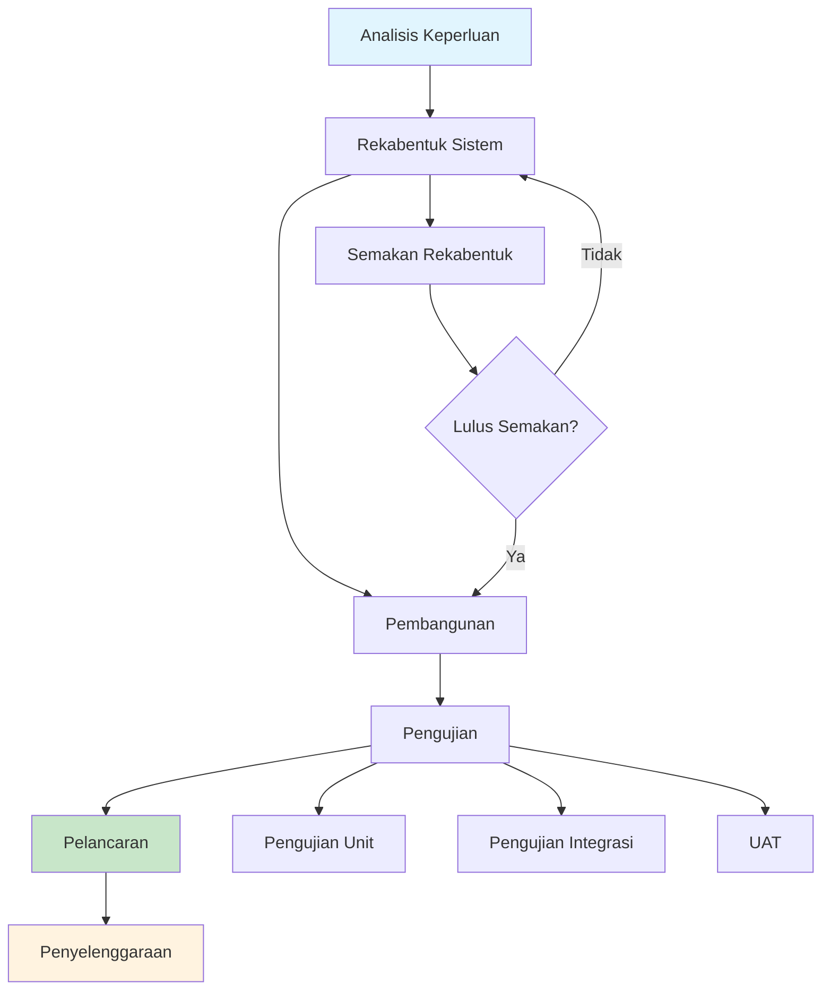
```mermaid
flowchart TD
    A["Analisis Keperluan"] --> B["Rekabentuk Sistem"]
    B --> C["Pembangunan"]
    C --> D["Pengujian"]
    D --> E["Pelancaran"]
    E --> F["Penyelenggaraan"]
    
    B --> G["Semakan Rekabentuk"]
    G --> H{Lulus Semakan?}
    H -->|Ya| C
    H -->|Tidak| B
    
    D --> I["Pengujian Unit"]
    D --> J["Pengujian Integrasi"]
    D --> K["UAT"]
    
    style A fill:#e1f5fe
    style E fill:#c8e6c9
    style F fill:#fff3e0
```

---

### **D02 - Spesifikasi Keperluan Bisnes**
**Fail:** `D02_KRISA_ICTSERVE_SPESIFIKASI_KEPERLUAN_BISNES.md`

#### Diagram Organisasi - Struktur BPM MOTAC

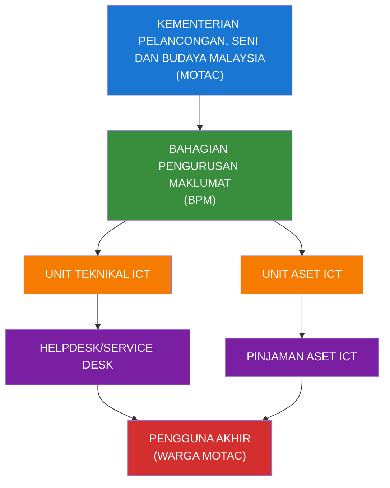
```mermaid
graph TD
    A["KEMENTERIAN PELANCONGAN, SENI DAN BUDAYA MALAYSIA<br/>(MOTAC)"] --> B["BAHAGIAN PENGURUSAN MAKLUMAT<br/>(BPM)"]
    
    B --> C["UNIT TEKNIKAL ICT"]
    B --> D["UNIT ASET ICT"]
    
    C --> E["HELPDESK/SERVICE DESK"]
    D --> F["PINJAMAN ASET ICT"]
    
    E --> G["PENGGUNA AKHIR<br/>(WARGA MOTAC)"]
    F --> G
    
    style A fill:#1976d2,color:#fff
    style B fill:#388e3c,color:#fff
    style C fill:#f57c00,color:#fff
    style D fill:#f57c00,color:#fff
    style E fill:#7b1fa2,color:#fff
    style F fill:#7b1fa2,color:#fff
    style G fill:#d32f2f,color:#fff
```

#### Diagram Proses Bisnes - Aliran Kerja Utama

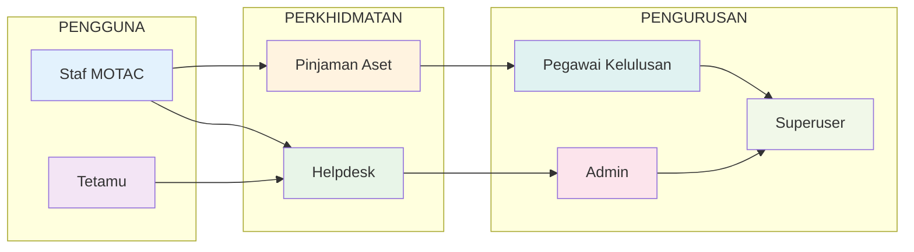
```mermaid
flowchart LR
    subgraph "PENGGUNA"
        U1["Staf MOTAC"]
        U2["Tetamu"]
    end
    
    subgraph "PERKHIDMATAN"
        S1["Helpdesk"]
        S2["Pinjaman Aset"]
    end
    
    subgraph "PENGURUSAN"
        M1["Admin"]
        M2["Superuser"]
        M3["Pegawai Kelulusan"]
    end
    
    U1 --> S1
    U2 --> S1
    U1 --> S2
    
    S1 --> M1
    S2 --> M3
    M1 --> M2
    M3 --> M2
    
    style U1 fill:#e3f2fd
    style U2 fill:#f3e5f5
    style S1 fill:#e8f5e8
    style S2 fill:#fff3e0
    style M1 fill:#fce4ec
    style M2 fill:#f1f8e9
    style M3 fill:#e0f2f1
```

---

### **D03 - Spesifikasi Keperluan Sistem**
**Fail:** `D03_KRISA_ICTSERVE_SPESIFIKASI_KEPERLUAN_SISTEM.md`

#### Diagram Use Case - Keperluan Fungsian

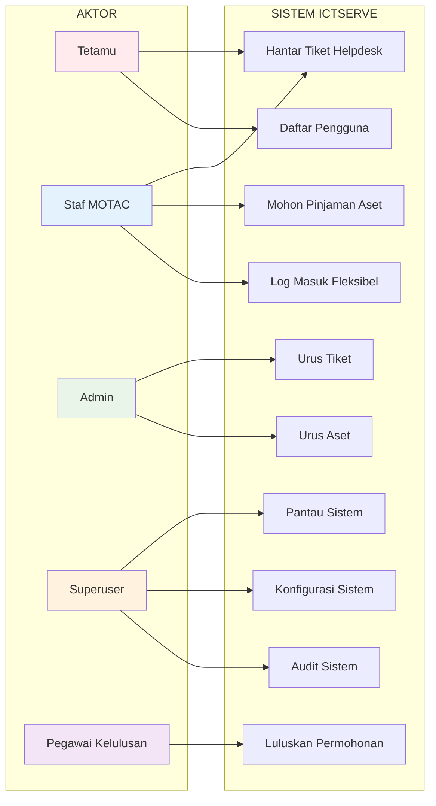
```mermaid
graph LR
    subgraph "AKTOR"
        A1["Tetamu"]
        A2["Staf MOTAC"]
        A3["Admin"]
        A4["Superuser"]
        A5["Pegawai Kelulusan"]
    end
    
    subgraph "SISTEM ICTSERVE"
        UC1["Hantar Tiket Helpdesk"]
        UC2["Mohon Pinjaman Aset"]
        UC3["Daftar Pengguna"]
        UC4["Log Masuk Fleksibel"]
        UC5["Urus Tiket"]
        UC6["Urus Aset"]
        UC7["Luluskan Permohonan"]
        UC8["Pantau Sistem"]
        UC9["Konfigurasi Sistem"]
        UC10["Audit Sistem"]
    end
    
    A1 --> UC1
    A1 --> UC3
    A2 --> UC1
    A2 --> UC2
    A2 --> UC4
    A3 --> UC5
    A3 --> UC6
    A4 --> UC8
    A4 --> UC9
    A4 --> UC10
    A5 --> UC7
    
    style A1 fill:#ffebee
    style A2 fill:#e3f2fd
    style A3 fill:#e8f5e8
    style A4 fill:#fff3e0
    style A5 fill:#f3e5f5
```

#### Diagram Aliran Data - Proses Utama

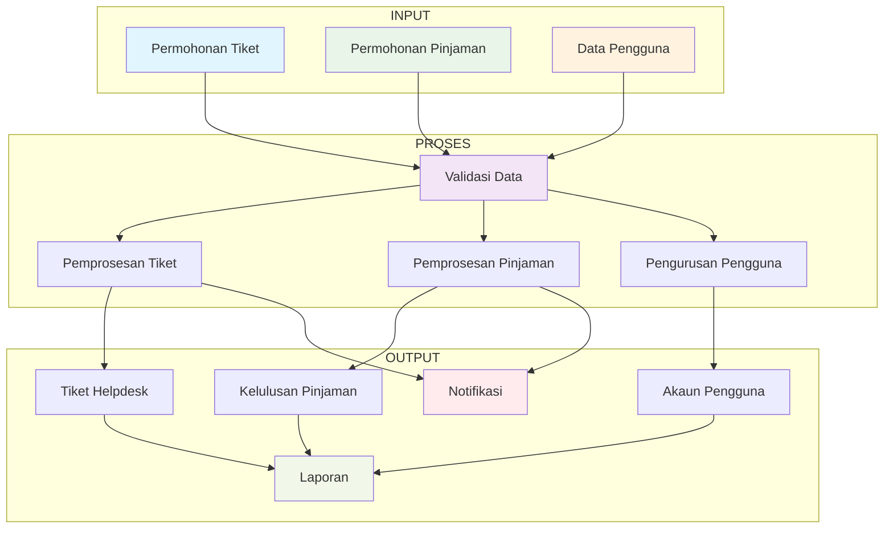
```mermaid
flowchart TD
    subgraph "INPUT"
        I1["Permohonan Tiket"]
        I2["Permohonan Pinjaman"]
        I3["Data Pengguna"]
    end
    
    subgraph "PROSES"
        P1["Validasi Data"]
        P2["Pemprosesan Tiket"]
        P3["Pemprosesan Pinjaman"]
        P4["Pengurusan Pengguna"]
    end
    
    subgraph "OUTPUT"
        O1["Tiket Helpdesk"]
        O2["Kelulusan Pinjaman"]
        O3["Akaun Pengguna"]
        O4["Notifikasi"]
        O5["Laporan"]
    end
    
    I1 --> P1
    I2 --> P1
    I3 --> P1
    
    P1 --> P2
    P1 --> P3
    P1 --> P4
    
    P2 --> O1
    P2 --> O4
    P3 --> O2
    P3 --> O4
    P4 --> O3
    
    O1 --> O5
    O2 --> O5
    O3 --> O5
    
    style I1 fill:#e1f5fe
    style I2 fill:#e8f5e8
    style I3 fill:#fff3e0
    style P1 fill:#f3e5f5
    style O4 fill:#ffebee
    style O5 fill:#f1f8e9
```

---

### **D04 - Spesifikasi Rekabentuk Sistem**
**Fail:** `D04_KRISA_ICTSERVE_SPESIFIKASI_REKABENTUK_SISTEM.md`

#### Diagram Seni Bina - True Hybrid Architecture

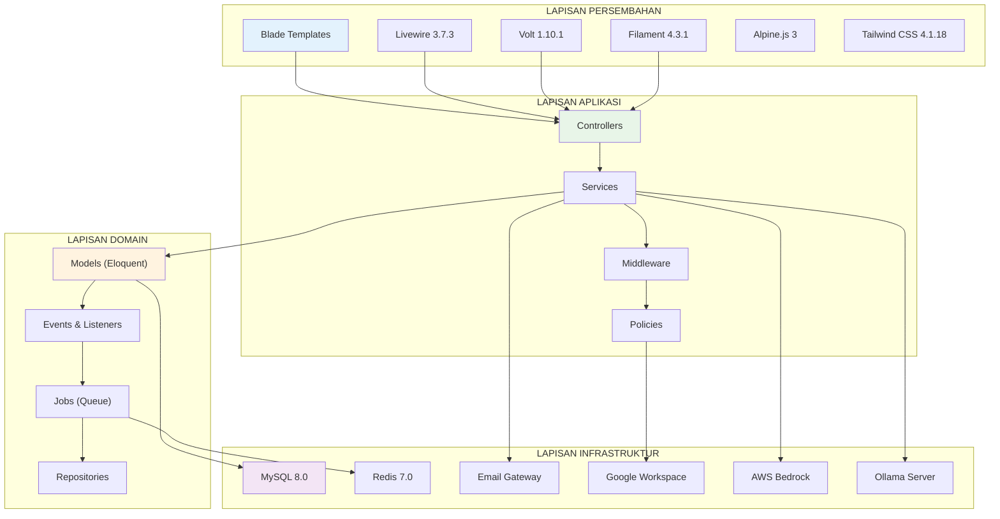
```mermaid
graph TB
    subgraph "LAPISAN PERSEMBAHAN"
        L1["Blade Templates"]
        L2["Livewire 3.7.3"]
        L3["Volt 1.10.1"]
        L4["Filament 4.3.1"]
        L5["Alpine.js 3"]
        L6["Tailwind CSS 4.1.18"]
    end
    
    subgraph "LAPISAN APLIKASI"
        A1["Controllers"]
        A2["Services"]
        A3["Middleware"]
        A4["Policies"]
    end
    
    subgraph "LAPISAN DOMAIN"
        D1["Models (Eloquent)"]
        D2["Events & Listeners"]
        D3["Jobs (Queue)"]
        D4["Repositories"]
    end
    
    subgraph "LAPISAN INFRASTRUKTUR"
        I1["MySQL 8.0"]
        I2["Redis 7.0"]
        I3["Email Gateway"]
        I4["Google Workspace"]
        I5["AWS Bedrock"]
        I6["Ollama Server"]
    end
    
    L1 --> A1
    L2 --> A1
    L3 --> A1
    L4 --> A1
    
    A1 --> A2
    A2 --> A3
    A3 --> A4
    
    A2 --> D1
    D1 --> D2
    D2 --> D3
    D3 --> D4
    
    D1 --> I1
    D3 --> I2
    A2 --> I3
    A4 --> I4
    A2 --> I5
    A2 --> I6
    
    style L1 fill:#e3f2fd
    style A1 fill:#e8f5e8
    style D1 fill:#fff3e0
    style I1 fill:#f3e5f5
```

#### Diagram Komponen - Modul Sistem

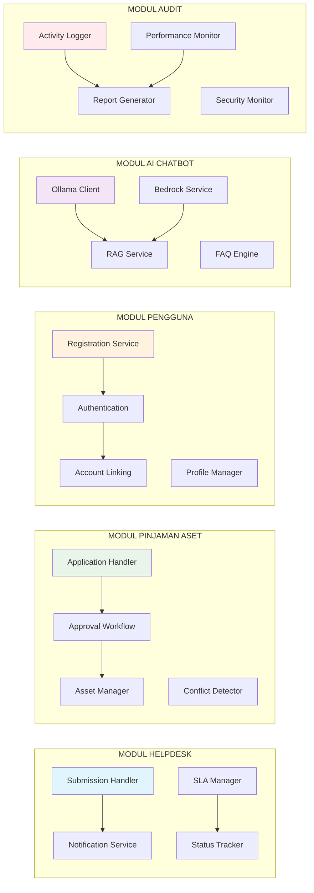
```mermaid
graph LR
    subgraph "MODUL HELPDESK"
        H1["Submission Handler"]
        H2["SLA Manager"]
        H3["Status Tracker"]
        H4["Notification Service"]
    end
    
    subgraph "MODUL PINJAMAN ASET"
        P1["Application Handler"]
        P2["Approval Workflow"]
        P3["Asset Manager"]
        P4["Conflict Detector"]
    end
    
    subgraph "MODUL PENGGUNA"
        U1["Registration Service"]
        U2["Authentication"]
        U3["Account Linking"]
        U4["Profile Manager"]
    end
    
    subgraph "MODUL AI CHATBOT"
        AI1["Ollama Client"]
        AI2["Bedrock Service"]
        AI3["RAG Service"]
        AI4["FAQ Engine"]
    end
    
    subgraph "MODUL AUDIT"
        AU1["Activity Logger"]
        AU2["Performance Monitor"]
        AU3["Security Monitor"]
        AU4["Report Generator"]
    end
    
    H1 --> H4
    H2 --> H3
    P1 --> P2
    P2 --> P3
    U1 --> U2
    U2 --> U3
    AI1 --> AI3
    AI2 --> AI3
    AU1 --> AU4
    AU2 --> AU4
    
    style H1 fill:#e1f5fe
    style P1 fill:#e8f5e8
    style U1 fill:#fff3e0
    style AI1 fill:#f3e5f5
    style AU1 fill:#ffebee
```

---

### **D05 - Pelan Migrasi Data**
**Fail:** `D05_KRISA_ICTSERVE_PELAN_MIGRASI_DATA.md`

#### Diagram Aliran Migrasi - Proses Migrasi Data

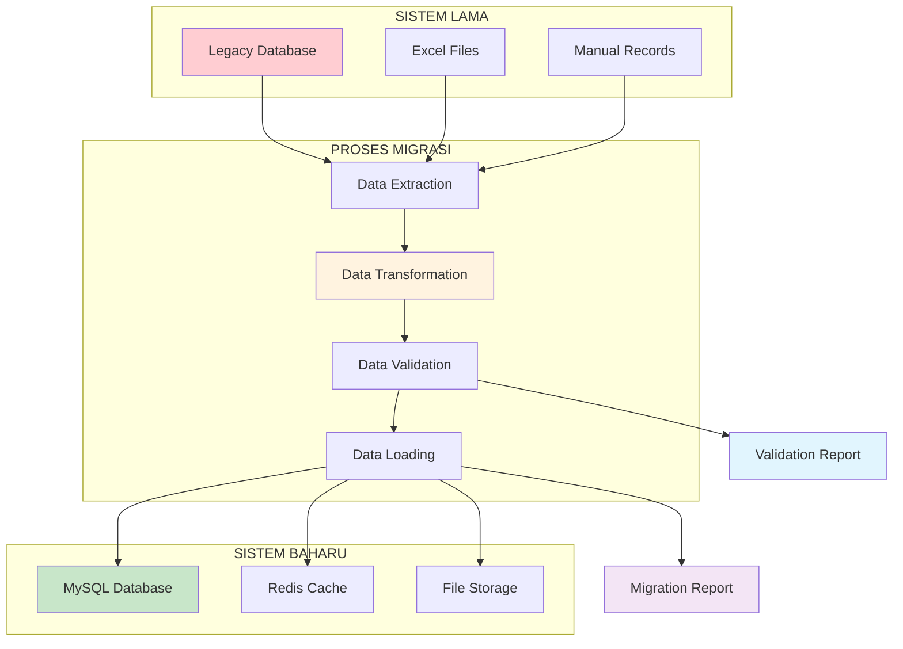
```mermaid
flowchart TD
    subgraph "SISTEM LAMA"
        OLD1["Legacy Database"]
        OLD2["Excel Files"]
        OLD3["Manual Records"]
    end
    
    subgraph "PROSES MIGRASI"
        M1["Data Extraction"]
        M2["Data Transformation"]
        M3["Data Validation"]
        M4["Data Loading"]
    end
    
    subgraph "SISTEM BAHARU"
        NEW1["MySQL Database"]
        NEW2["Redis Cache"]
        NEW3["File Storage"]
    end
    
    OLD1 --> M1
    OLD2 --> M1
    OLD3 --> M1
    
    M1 --> M2
    M2 --> M3
    M3 --> M4
    
    M4 --> NEW1
    M4 --> NEW2
    M4 --> NEW3
    
    M3 --> V1["Validation Report"]
    M4 --> V2["Migration Report"]
    
    style OLD1 fill:#ffcdd2
    style M2 fill:#fff3e0
    style NEW1 fill:#c8e6c9
    style V1 fill:#e1f5fe
    style V2 fill:#f3e5f5
```

#### Diagram Jadual Migrasi - Timeline

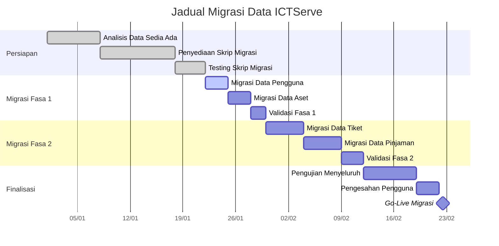
```mermaid
gantt
    title Jadual Migrasi Data ICTServe
    dateFormat YYYY-MM-DD
    axisFormat %d/%m
    
    section Persiapan
    Analisis Data Sedia Ada    :done, prep1, 2025-01-01, 7d
    Penyediaan Skrip Migrasi   :done, prep2, after prep1, 10d
    Testing Skrip Migrasi      :done, prep3, after prep2, 4d
    
    section Migrasi Fasa 1
    Migrasi Data Pengguna      :active, mig1, after prep3, 3d
    Migrasi Data Aset          :mig2, after mig1, 3d
    Validasi Fasa 1            :val1, after mig2, 2d
    
    section Migrasi Fasa 2
    Migrasi Data Tiket         :mig3, after val1, 5d
    Migrasi Data Pinjaman      :mig4, after mig3, 5d
    Validasi Fasa 2            :val2, after mig4, 3d
    
    section Finalisasi
    Pengujian Menyeluruh       :test, after val2, 7d
    Pengesahan Pengguna        :approval, after test, 3d
    Go-Live Migrasi            :milestone, golive, after approval, 1d
```

---

### **D06 - Spesifikasi Migrasi Data**
**Fail:** `D06_KRISA_ICTSERVE_SPESIFIKASI_MIGRASI_DATA.md`

#### Diagram Pemetaan Data - Struktur Jadual

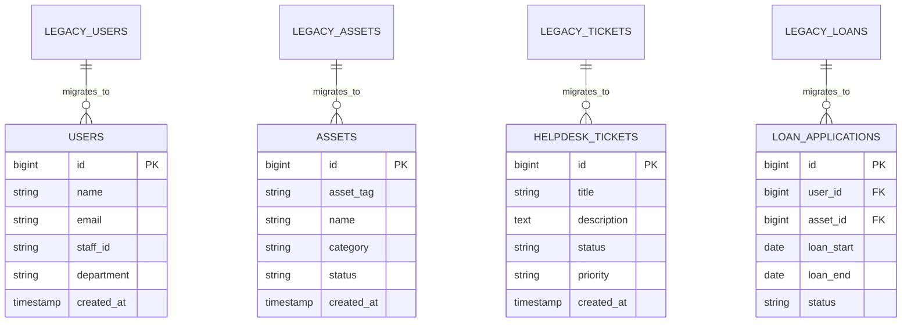
```mermaid
erDiagram
    LEGACY_USERS ||--o{ USERS : migrates_to
    LEGACY_ASSETS ||--o{ ASSETS : migrates_to
    LEGACY_TICKETS ||--o{ HELPDESK_TICKETS : migrates_to
    LEGACY_LOANS ||--o{ LOAN_APPLICATIONS : migrates_to
    
    USERS {
        bigint id PK
        string name
        string email
        string staff_id
        string department
        timestamp created_at
    }
    
    ASSETS {
        bigint id PK
        string asset_tag
        string name
        string category
        string status
        timestamp created_at
    }
    
    HELPDESK_TICKETS {
        bigint id PK
        string title
        text description
        string status
        string priority
        timestamp created_at
    }
    
    LOAN_APPLICATIONS {
        bigint id PK
        bigint user_id FK
        bigint asset_id FK
        date loan_start
        date loan_end
        string status
    }
```

#### Diagram Transformasi Data - Proses ETL

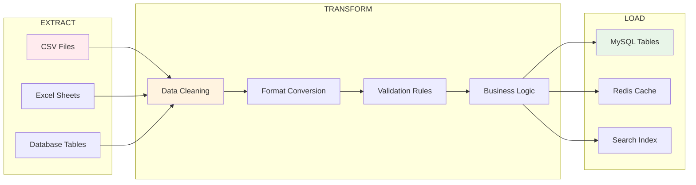
```mermaid
flowchart LR
    subgraph "EXTRACT"
        E1["CSV Files"]
        E2["Excel Sheets"]
        E3["Database Tables"]
    end
    
    subgraph "TRANSFORM"
        T1["Data Cleaning"]
        T2["Format Conversion"]
        T3["Validation Rules"]
        T4["Business Logic"]
    end
    
    subgraph "LOAD"
        L1["MySQL Tables"]
        L2["Redis Cache"]
        L3["Search Index"]
    end
    
    E1 --> T1
    E2 --> T1
    E3 --> T1
    
    T1 --> T2
    T2 --> T3
    T3 --> T4
    
    T4 --> L1
    T4 --> L2
    T4 --> L3
    
    style E1 fill:#ffebee
    style T1 fill:#fff3e0
    style L1 fill:#e8f5e8
```

---

### **D07 - Pelan Integrasi Sistem**
**Fail:** `D07_KRISA_ICTSERVE_PELAN_INTEGRASI_SISTEM.md`

#### Diagram Integrasi - Sistem Luaran

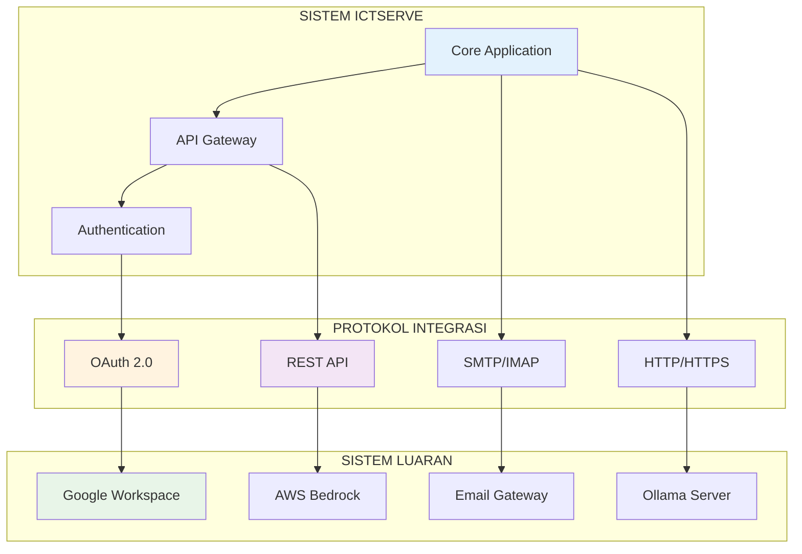
```mermaid
graph TB
    subgraph "SISTEM ICTSERVE"
        CORE["Core Application"]
        API["API Gateway"]
        AUTH["Authentication"]
    end
    
    subgraph "SISTEM LUARAN"
        GWS["Google Workspace"]
        EMAIL["Email Gateway"]
        BEDROCK["AWS Bedrock"]
        OLLAMA["Ollama Server"]
    end
    
    subgraph "PROTOKOL INTEGRASI"
        OAUTH["OAuth 2.0"]
        SMTP["SMTP/IMAP"]
        REST["REST API"]
        HTTP["HTTP/HTTPS"]
    end
    
    CORE --> API
    API --> AUTH
    
    AUTH --> OAUTH
    OAUTH --> GWS
    
    CORE --> SMTP
    SMTP --> EMAIL
    
    API --> REST
    REST --> BEDROCK
    
    CORE --> HTTP
    HTTP --> OLLAMA
    
    style CORE fill:#e3f2fd
    style GWS fill:#e8f5e8
    style OAUTH fill:#fff3e0
    style REST fill:#f3e5f5
```

#### Diagram Aliran Integrasi - Proses Komunikasi

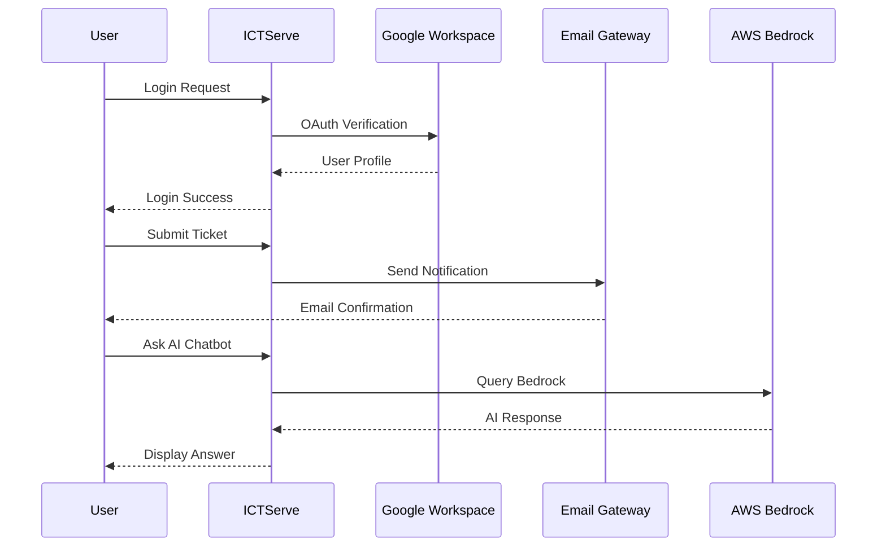
```mermaid
sequenceDiagram
    participant U as User
    participant S as ICTServe
    participant G as Google Workspace
    participant E as Email Gateway
    participant A as AWS Bedrock
    
    U->>S: Login Request
    S->>G: OAuth Verification
    G-->>S: User Profile
    S-->>U: Login Success
    
    U->>S: Submit Ticket
    S->>E: Send Notification
    E-->>U: Email Confirmation
    
    U->>S: Ask AI Chatbot
    S->>A: Query Bedrock
    A-->>S: AI Response
    S-->>U: Display Answer
```

---

### **D08 - Spesifikasi Integrasi Data**
**Fail:** `D08_KRISA_ICTSERVE_SPESIFIKASI_INTEGRASI_DATA.md`

#### Diagram API - Endpoint Structure

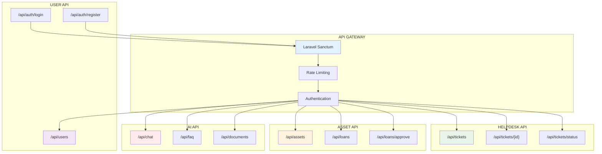
```mermaid
graph TD
    subgraph "API GATEWAY"
        GW["Laravel Sanctum"]
        RATE["Rate Limiting"]
        AUTH["Authentication"]
    end
    
    subgraph "HELPDESK API"
        H1["/api/tickets"]
        H2["/api/tickets/{id}"]
        H3["/api/tickets/status"]
    end
    
    subgraph "ASSET API"
        A1["/api/assets"]
        A2["/api/loans"]
        A3["/api/loans/approve"]
    end
    
    subgraph "USER API"
        U1["/api/users"]
        U2["/api/auth/login"]
        U3["/api/auth/register"]
    end
    
    subgraph "AI API"
        AI1["/api/chat"]
        AI2["/api/faq"]
        AI3["/api/documents"]
    end
    
    GW --> RATE
    RATE --> AUTH
    
    AUTH --> H1
    AUTH --> H2
    AUTH --> H3
    
    AUTH --> A1
    AUTH --> A2
    AUTH --> A3
    
    AUTH --> U1
    U2 --> GW
    U3 --> GW
    
    AUTH --> AI1
    AUTH --> AI2
    AUTH --> AI3
    
    style GW fill:#e3f2fd
    style H1 fill:#e8f5e8
    style A1 fill:#fff3e0
    style U1 fill:#f3e5f5
    style AI1 fill:#ffebee
```

#### Diagram Format Data - JSON Schema

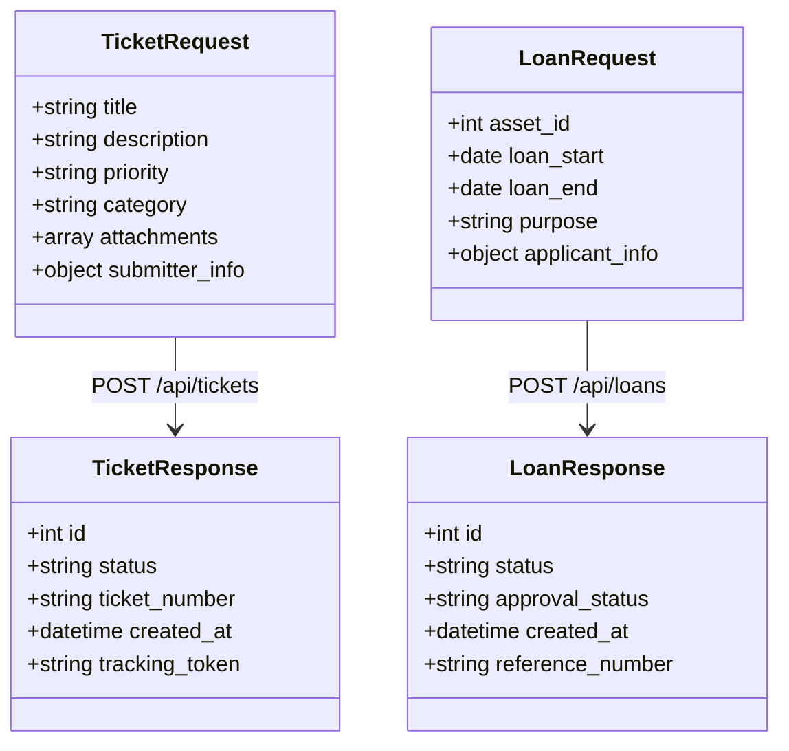
```mermaid
classDiagram
    class TicketRequest {
        +string title
        +string description
        +string priority
        +string category
        +array attachments
        +object submitter_info
    }
    
    class TicketResponse {
        +int id
        +string status
        +string ticket_number
        +datetime created_at
        +string tracking_token
    }
    
    class LoanRequest {
        +int asset_id
        +date loan_start
        +date loan_end
        +string purpose
        +object applicant_info
    }
    
    class LoanResponse {
        +int id
        +string status
        +string approval_status
        +datetime created_at
        +string reference_number
    }
    
    TicketRequest --> TicketResponse : POST /api/tickets
    LoanRequest --> LoanResponse : POST /api/loans
```

---

### **D09 - Dokumentasi Pangkalan Data**
**Fail:** `D09_KRISA_ICTSERVE_DOKUMENTASI_PANGKALAN_DATA.md`

#### Diagram ERD - Struktur Pangkalan Data

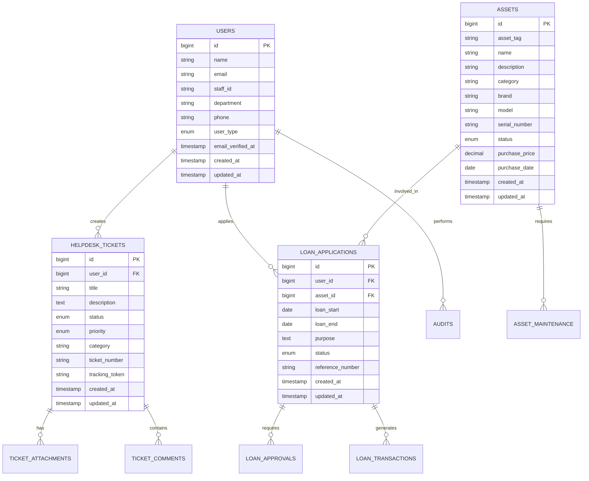
```mermaid
erDiagram
    USERS ||--o{ HELPDESK_TICKETS : creates
    USERS ||--o{ LOAN_APPLICATIONS : applies
    USERS ||--o{ AUDITS : performs
    
    ASSETS ||--o{ LOAN_APPLICATIONS : involved_in
    ASSETS ||--o{ ASSET_MAINTENANCE : requires
    
    HELPDESK_TICKETS ||--o{ TICKET_ATTACHMENTS : has
    HELPDESK_TICKETS ||--o{ TICKET_COMMENTS : contains
    
    LOAN_APPLICATIONS ||--o{ LOAN_APPROVALS : requires
    LOAN_APPLICATIONS ||--o{ LOAN_TRANSACTIONS : generates
    
    USERS {
        bigint id PK
        string name
        string email
        string staff_id
        string department
        string phone
        enum user_type
        timestamp email_verified_at
        timestamp created_at
        timestamp updated_at
    }
    
    HELPDESK_TICKETS {
        bigint id PK
        bigint user_id FK
        string title
        text description
        enum status
        enum priority
        string category
        string ticket_number
        string tracking_token
        timestamp created_at
        timestamp updated_at
    }
    
    ASSETS {
        bigint id PK
        string asset_tag
        string name
        string description
        string category
        string brand
        string model
        string serial_number
        enum status
        decimal purchase_price
        date purchase_date
        timestamp created_at
        timestamp updated_at
    }
    
    LOAN_APPLICATIONS {
        bigint id PK
        bigint user_id FK
        bigint asset_id FK
        date loan_start
        date loan_end
        text purpose
        enum status
        string reference_number
        timestamp created_at
        timestamp updated_at
    }
```

#### Diagram Indeks - Optimasi Prestasi

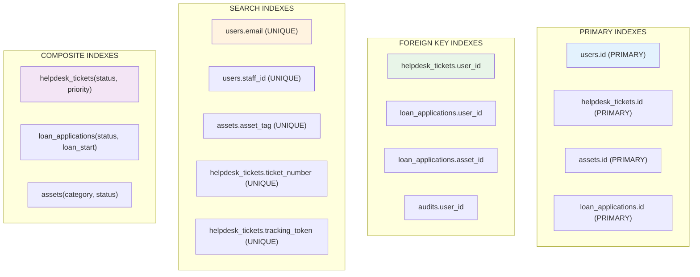
```mermaid
graph TD
    subgraph "PRIMARY INDEXES"
        P1["users.id (PRIMARY)"]
        P2["helpdesk_tickets.id (PRIMARY)"]
        P3["assets.id (PRIMARY)"]
        P4["loan_applications.id (PRIMARY)"]
    end
    
    subgraph "FOREIGN KEY INDEXES"
        F1["helpdesk_tickets.user_id"]
        F2["loan_applications.user_id"]
        F3["loan_applications.asset_id"]
        F4["audits.user_id"]
    end
    
    subgraph "SEARCH INDEXES"
        S1["users.email (UNIQUE)"]
        S2["users.staff_id (UNIQUE)"]
        S3["assets.asset_tag (UNIQUE)"]
        S4["helpdesk_tickets.ticket_number (UNIQUE)"]
        S5["helpdesk_tickets.tracking_token (UNIQUE)"]
    end
    
    subgraph "COMPOSITE INDEXES"
        C1["helpdesk_tickets(status, priority)"]
        C2["loan_applications(status, loan_start)"]
        C3["assets(category, status)"]
    end
    
    style P1 fill:#e3f2fd
    style F1 fill:#e8f5e8
    style S1 fill:#fff3e0
    style C1 fill:#f3e5f5
```

---

### **D10 - Dokumentasi Kod Sumber**
**Fail:** `D10_KRISA_ICTSERVE_DOKUMENTASI_KOD_SUMBER.md`

#### Diagram Struktur Kod - Organisasi Direktori

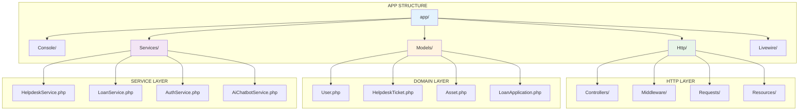
```mermaid
graph TD
    subgraph "APP STRUCTURE"
        APP["app/"]
        CONSOLE["Console/"]
        HTTP["Http/"]
        MODELS["Models/"]
        SERVICES["Services/"]
        LIVEWIRE["Livewire/"]
    end
    
    subgraph "HTTP LAYER"
        CONTROLLERS["Controllers/"]
        MIDDLEWARE["Middleware/"]
        REQUESTS["Requests/"]
        RESOURCES["Resources/"]
    end
    
    subgraph "DOMAIN LAYER"
        USER_MODEL["User.php"]
        TICKET_MODEL["HelpdeskTicket.php"]
        ASSET_MODEL["Asset.php"]
        LOAN_MODEL["LoanApplication.php"]
    end
    
    subgraph "SERVICE LAYER"
        HELPDESK_SERVICE["HelpdeskService.php"]
        LOAN_SERVICE["LoanService.php"]
        AUTH_SERVICE["AuthService.php"]
        AI_SERVICE["AiChatbotService.php"]
    end
    
    APP --> CONSOLE
    APP --> HTTP
    APP --> MODELS
    APP --> SERVICES
    APP --> LIVEWIRE
    
    HTTP --> CONTROLLERS
    HTTP --> MIDDLEWARE
    HTTP --> REQUESTS
    HTTP --> RESOURCES
    
    MODELS --> USER_MODEL
    MODELS --> TICKET_MODEL
    MODELS --> ASSET_MODEL
    MODELS --> LOAN_MODEL
    
    SERVICES --> HELPDESK_SERVICE
    SERVICES --> LOAN_SERVICE
    SERVICES --> AUTH_SERVICE
    SERVICES --> AI_SERVICE
    
    style APP fill:#e3f2fd
    style HTTP fill:#e8f5e8
    style MODELS fill:#fff3e0
    style SERVICES fill:#f3e5f5
```

#### Diagram Kelas - Model Relationships

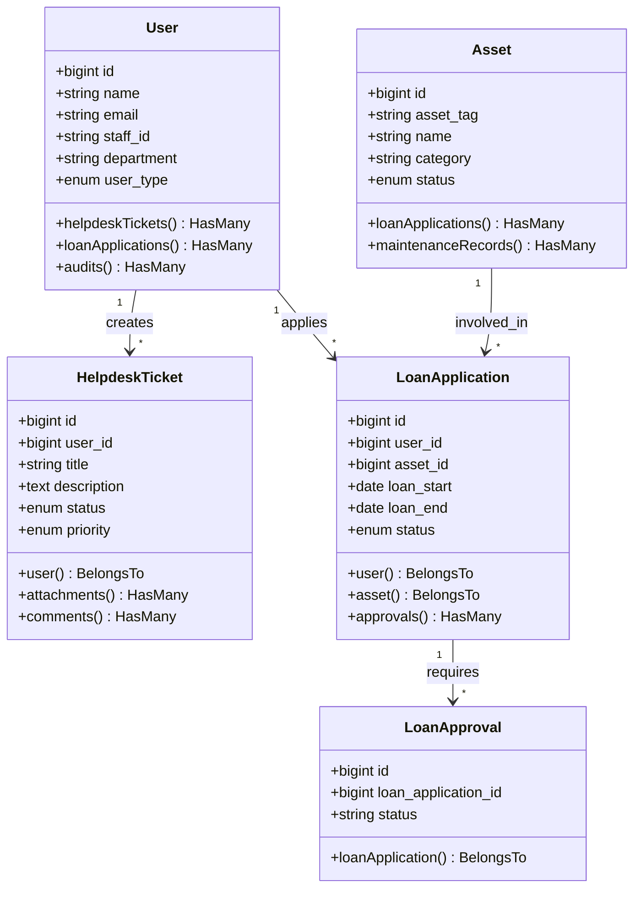
```mermaid
classDiagram
    class User {
        +bigint id
        +string name
        +string email
        +string staff_id
        +string department
        +enum user_type
        +helpdeskTickets() HasMany
        +loanApplications() HasMany
        +audits() HasMany
    }
    
    class HelpdeskTicket {
        +bigint id
        +bigint user_id
        +string title
        +text description
        +enum status
        +enum priority
        +user() BelongsTo
        +attachments() HasMany
        +comments() HasMany
    }
    
    class Asset {
        +bigint id
        +string asset_tag
        +string name
        +string category
        +enum status
        +loanApplications() HasMany
        +maintenanceRecords() HasMany
    }
    
    class LoanApplication {
        +bigint id
        +bigint user_id
        +bigint asset_id
        +date loan_start
        +date loan_end
        +enum status
        +user() BelongsTo
        +asset() BelongsTo
        +approvals() HasMany
    }
    
    class LoanApproval {
        +bigint id
        +bigint loan_application_id
        +string status
        +loanApplication() BelongsTo
    }
    
    User "1" --> "*" HelpdeskTicket : creates
    User "1" --> "*" LoanApplication : applies
    Asset "1" --> "*" LoanApplication : involved_in
    LoanApplication "1" --> "*" LoanApproval : requires
```

---

### **D15 - Laporan Migrasi Data**
**Fail:** `D15_KRISA_ICTSERVE_LAPORAN_MIGRASI_DATA.md`

#### Diagram Statistik Migrasi - Hasil Migrasi

```mermaid
pie title Statistik Migrasi Data ICTServe
    "Berjaya Migrasi" : 96.7
    "Gagal Migrasi" : 2.1
    "Memerlukan Tindakan Manual" : 1.2
```

#### Diagram Aliran Laporan - Proses Pelaporan

```mermaid
flowchart TD
    subgraph "SUMBER DATA"
        S1["Migration Logs"]
        S2["Validation Reports"]
        S3["Error Logs"]
        S4["Performance Metrics"]
    end
    
    subgraph "PEMPROSESAN"
        P1["Data Aggregation"]
        P2["Statistical Analysis"]
        P3["Report Generation"]
    end
    
    subgraph "OUTPUT LAPORAN"
        O1["Executive Summary"]
        O2["Technical Report"]
        O3["Error Analysis"]
        O4["Recommendations"]
    end
    
    S1 --> P1
    S2 --> P1
    S3 --> P1
    S4 --> P1
    
    P1 --> P2
    P2 --> P3
    
    P3 --> O1
    P3 --> O2
    P3 --> O3
    P3 --> O4
    
    style S1 fill:#e1f5fe
    style P1 fill:#e8f5e8
    style O1 fill:#fff3e0
```

---

### **D17 - Manual Pengguna Sistem**
**Fail:** `D17_KRISA_ICTSERVE_MANUAL_PENGGUNA_SISTEM.md`

#### Diagram Aliran Pengguna - Proses Login

```mermaid
flowchart TD
    START["Pengguna Akses Sistem"] --> CHOICE{"Pilih Mod Akses"}
    
    CHOICE -->|Tetamu| GUEST["Akses Sebagai Tetamu"]
    CHOICE -->|Staf| LOGIN["Log Masuk"]
    
    GUEST --> GUEST_FORM["Isi Borang Manual"]
    LOGIN --> AUTH_CHECK{"Pengesahan"}
    
    AUTH_CHECK -->|Berjaya| DASHBOARD["Dashboard Utama"]
    AUTH_CHECK -->|Gagal| LOGIN
    
    GUEST_FORM --> SUBMIT["Hantar Permohonan"]
    DASHBOARD --> SERVICES["Akses Perkhidmatan"]
    
    SUBMIT --> CONFIRMATION["Pengesahan & Token"]
    SERVICES --> HELPDESK["Helpdesk"]
    SERVICES --> LOANS["Pinjaman Aset"]
    
    style START fill:#e3f2fd
    style CHOICE fill:#fff3e0
    style DASHBOARD fill:#e8f5e8
    style CONFIRMATION fill:#f3e5f5
```

#### Diagram Navigasi - Struktur Menu

```mermaid
graph TD
    MAIN["Dashboard Utama"] --> HELPDESK["Helpdesk"]
    MAIN --> LOANS["Pinjaman Aset"]
    MAIN --> PROFILE["Profil"]
    MAIN --> CHAT["AI Chatbot"]
    
    HELPDESK --> H1["Hantar Tiket"]
    HELPDESK --> H2["Tiket Saya"]
    HELPDESK --> H3["Status Tiket"]
    
    LOANS --> L1["Mohon Pinjaman"]
    LOANS --> L2["Permohonan Saya"]
    LOANS --> L3["Sejarah Pinjaman"]
    
    PROFILE --> P1["Maklumat Peribadi"]
    PROFILE --> P2["Tukar Kata Laluan"]
    PROFILE --> P3["Tetapan Notifikasi"]
    
    CHAT --> C1["FAQ Bot"]
    CHAT --> C2["Sokongan Langsung"]
    
    style MAIN fill:#e3f2fd
    style HELPDESK fill:#e8f5e8
    style LOANS fill:#fff3e0
    style PROFILE fill:#f3e5f5
    style CHAT fill:#ffebee
```

---

### **D17_ADMIN - Manual Pengguna Sistem (Pentadbir)**
**Fail:** `D17_KRISA_ICTSERVE_MANUAL_PENGGUNA_SISTEM_ADMIN.md`

#### Diagram Panel Admin - Struktur Pentadbiran

```mermaid
graph TD
    ADMIN["Panel Pentadbir"] --> USERS["Pengurusan Pengguna"]
    ADMIN --> TICKETS["Pengurusan Tiket"]
    ADMIN --> ASSETS["Pengurusan Aset"]
    ADMIN --> REPORTS["Laporan"]
    ADMIN --> SETTINGS["Tetapan Sistem"]
    
    USERS --> U1["Senarai Pengguna"]
    USERS --> U2["Tambah Pengguna"]
    USERS --> U3["Audit Pengguna"]
    
    TICKETS --> T1["Semua Tiket"]
    TICKETS --> T2["Tugasan Tiket"]
    TICKETS --> T3["SLA Monitoring"]
    
    ASSETS --> A1["Inventori Aset"]
    ASSETS --> A2["Tambah Aset"]
    ASSETS --> A3["Penyelenggaraan"]
    
    REPORTS --> R1["Dashboard KPI"]
    REPORTS --> R2["Laporan Prestasi"]
    REPORTS --> R3["Export Data"]
    
    SETTINGS --> S1["Konfigurasi Sistem"]
    SETTINGS --> S2["Pengurusan Peranan"]
    SETTINGS --> S3["Tetapan Email"]
    
    style ADMIN fill:#1976d2,color:#fff
    style USERS fill:#388e3c,color:#fff
    style TICKETS fill:#f57c00,color:#fff
    style ASSETS fill:#7b1fa2,color:#fff
    style REPORTS fill:#d32f2f,color:#fff
    style SETTINGS fill:#455a64,color:#fff
```

#### Diagram Aliran Kerja Admin - Proses Pengurusan

```mermaid
sequenceDiagram
    participant A as Admin
    participant S as Sistem
    participant U as Pengguna
    participant E as Email
    
    A->>S: Log Masuk Admin
    S-->>A: Dashboard Admin
    
    A->>S: Semak Tiket Baharu
    S-->>A: Senarai Tiket
    
    A->>S: Tugaskan Tiket
    S->>E: Notifikasi Tugasan
    E-->>U: Email Pemberitahuan
    
    A->>S: Kemaskini Status
    S->>E: Notifikasi Status
    E-->>U: Email Kemaskini
    
    A->>S: Jana Laporan
    S-->>A: Laporan Prestasi
```

---

## iii. Kesimpulan

Indeks diagram Mermaid ini menyediakan rujukan komprehensif untuk semua visualisasi yang terdapat dalam dokumentasi KRISA ICTServe. Setiap diagram direka untuk membantu pemahaman sistem dari pelbagai perspektif - teknikal, bisnes, dan pengguna.

Diagram-diagram ini boleh digunakan untuk:

- Pemahaman seni bina sistem
- Dokumentasi proses bisnes
- Panduan pembangunan
- Latihan pengguna
- Audit dan semakan sistem

---

**TAMAT DOKUMEN / END OF DOCUMENT**

*Dokumen ini adalah hak milik Kementerian Pelancongan, Seni dan Budaya Malaysia (MOTAC) dan tertakluk kepada Akta Rahsia Rasmi 1972.*
