Use Case Diagrams (UC-ICT-XX format)
Data Flow Diagrams (DFD-ICT-XX format)
Entity Relationship Diagram (ERD)

UC-ICT-PP: Pengurusan Pengguna (User Management)

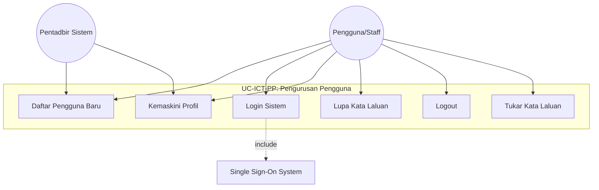

UC-ICT-HD: Pengurusan Helpdesk

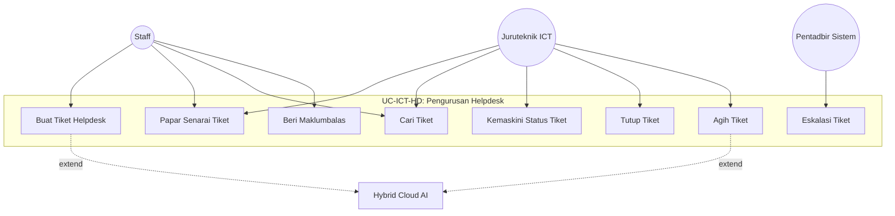

UC-ICT-AL: Pengurusan Pinjaman Aset (Asset Loan Management)

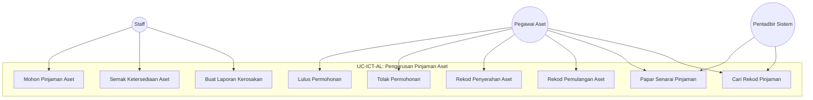

UC-ICT-IM: Pengurusan Inventori (Inventory Management)

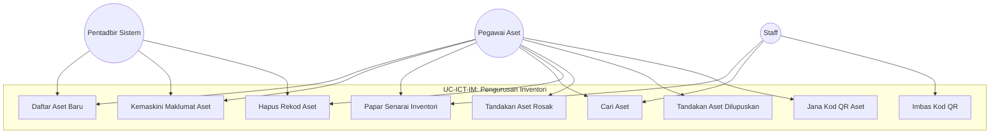

UC-ICT-DL: Dashboard & Laporan

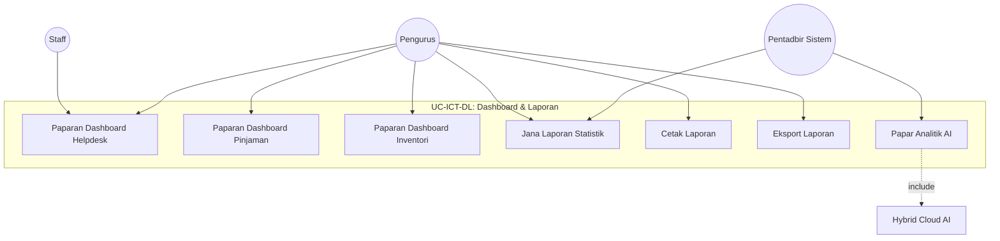

UC-ICT-PS: Pentadbiran Sistem (System Administration)

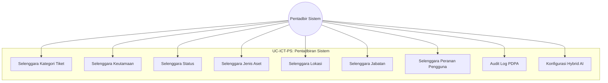

Data Flow Diagrams

DFD-ICT-0: Context Diagram (Vertical Layout)

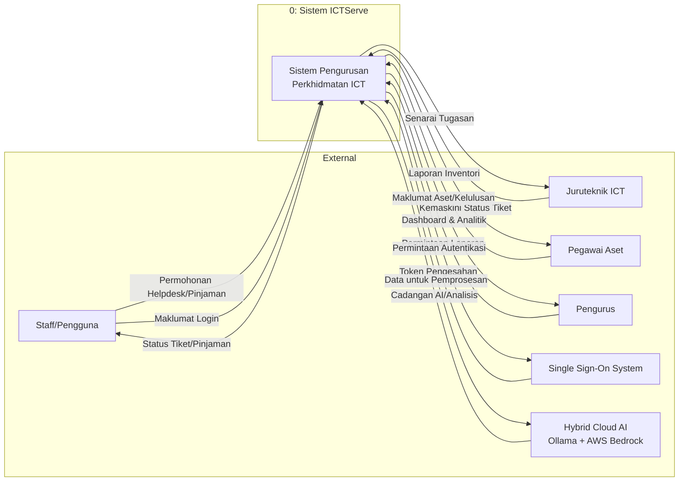

DFD-ICT-PP: Level 1 - Pengurusan Pengguna

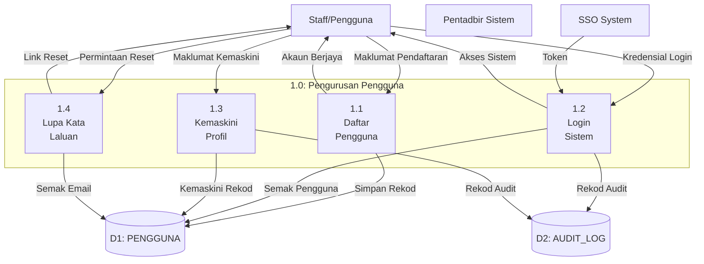

DFD-ICT-HD: Level 1 - Pengurusan Helpdesk

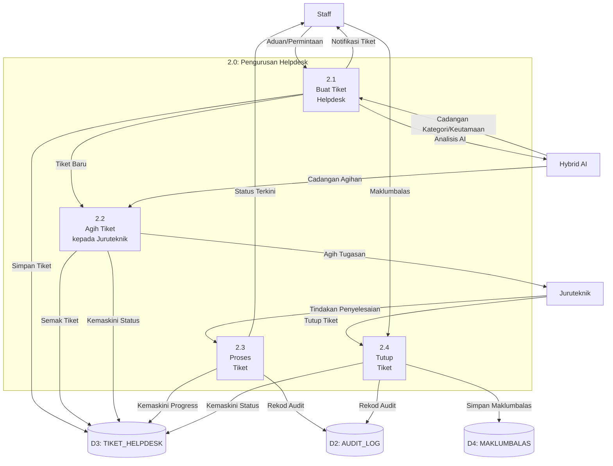

DFD-ICT-AL: Level 1 - Pengurusan Pinjaman Aset

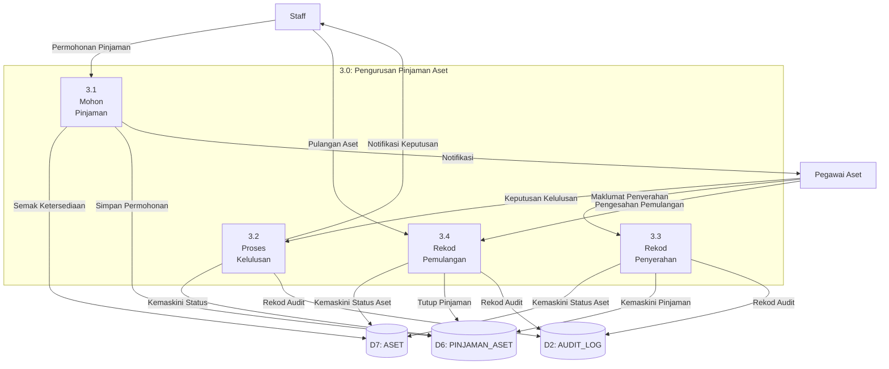

DFD-ICT-IM: Level 1 - Pengurusan Inventori

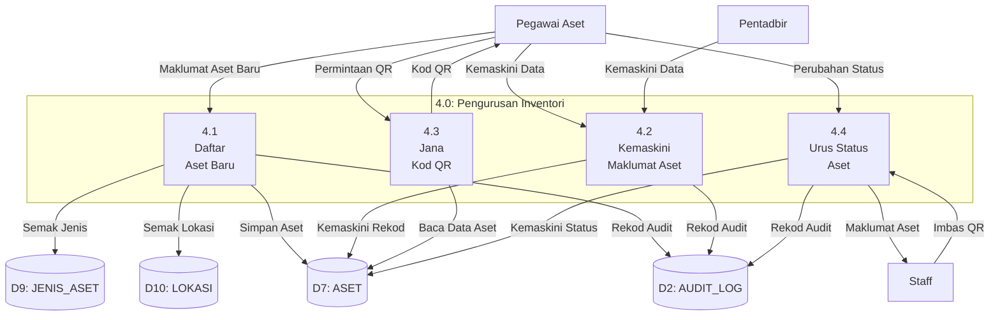

Entity Relationship Diagram (ERD)

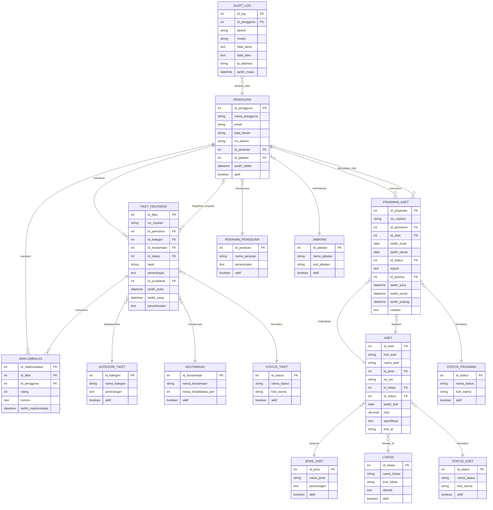

Implementation Notes:
For your D03 document, you should:

Section 3 (Use Case Modeling) - Include all 6 use case diagrams above with descriptions for each use case
Section 4 (Information Modeling) - Include the ERD diagram with complete data dictionary tables
Section 5 (System Process Modeling) - Include the Context Diagram and all Level 1 DFDs

Additional diagrams you may need:

Function Hierarchy Diagram (SF-ICT) - Tree structure showing all modules and functions
Actor-Function Mapping Tables - Matrix showing which roles can access which functions