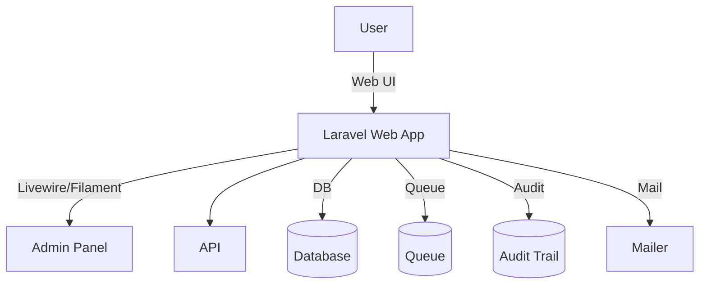

# Aliran Sistem Pinjaman Aset ICT (Asset Loan System Flow)

Dokumen ini menerangkan aliran proses, seni bina, pemetaan keperluan, dan kawalan kualiti bagi modul Pinjaman Aset ICT. Bahasa utama ialah Bahasa Melayu dengan sedikit istilah Inggeris bagi kejelasan.

Nota Penting: Sistem ini adalah untuk kegunaan dalaman MOTAC sahaja (internal use only). Tidak untuk kegunaan orang awam.

## Maklumat Dokumen (Document Information)

- Versi: 2.1.1 (SemVer)
- Tarikh Kemaskini: 31 Oktober 2025
- Status: Aktif — Diseragamkan mengikut D00–D15
- Klasifikasi: Terhad — Dalaman MOTAC
- Bahasa: Bahasa Melayu (utama), English (teknikal)
- Pematuhan Piawaian: ISO/IEC/IEEE 12207, 29148; PDPA 2010; WCAG 2.2 AA
- Rujukan D-Docs: D00, D02, D03, D04, D05–D06, D07–D08, D09, D11, D12–D14

## 1. Ringkasan Modul (Module Overview)

- Tujuan: Mengurus permohonan, kelulusan, pengeluaran (issuance), penggunaan, dan pemulangan aset ICT.
- Pengguna Sasaran: Staf MOTAC, Pegawai Penyokong/Pelulus, Staf BPM, Pentadbir Sistem.
- Teknologi: Laravel 12, PHP 8.2, Livewire v3, Filament v4, Tailwind CSS, Vite, Redis Queue (optional), MySQL.

## 2. Seni Bina (Architecture)



Rasional Reka Bentuk (Design Rationale):
- Struktur modular (Models, Policies, Services, Observers).
- RBAC (role-based access control) dengan polisi Laravel.
- Audit trail untuk semua tindakan kritikal.
- Pemprosesan asinkron untuk notifikasi/peringatan.

## 3. Aliran Proses (Process Flow)

1) Pemohon mengisi borang pinjaman aset ICT dan menyerahkan (submit).
2) Sistem menjana nombor permohonan dan memetakan rantaian kelulusan (division/grade/threshold).
3) Pelulus menyemak dan meluluskan/menolak.
4) Staf BPM menyediakan aset dan merekod pengeluaran (issued_by, issued_at, items/accessories).
5) Sistem menghantar peringatan (reminder) sebelum tarikh tamat.
6) Pemohon memulangkan aset; Staf BPM merekod penerimaan (returned_by, returned_at, pemeriksaan).
7) Transaksi ditutup; audit trail lengkap disimpan.

Status utama: `Draft` → `Submitted` → `Under_Review` → `Approved/Rejected` → `Ready_Issuance` → `Issued` → `In_Use` → `Return_Due` → `Returned` → `Completed`.

## 4. Pemetaan Keperluan (Requirements Mapping)

Contoh RTM (ringkas):

- SRS-LOAN-001: Cipta permohonan pinjaman → Controller `store` → Ujian `LoanApplicationTest::testCreate` — Status: Selesai (Done)
- SRS-LOAN-002: Aliran kelulusan berperingkat → Policy/Service → Ujian `LoanApprovalTest` — Status: Selesai
- SRS-LOAN-003: Audit trail lengkap → Observer/Events → Ujian `AuditTrailTest` — Status: Selesai
- SRS-LOAN-004: Rate limiting API (jika ada API) → Middleware → Ujian API — Status: Jika Berkaitan

Rujukan RTM penuh: `docs/rtm/loan_requirements_rtm.csv` (D03 ↔ D04 ↔ Kod ↔ Ujian).

## 5. Pangkalan Data & Kualiti Data (Database & Data Quality)

Entiti utama dan hubungan (contoh):

```mermaid
erDiagram
    USERS ||--o LOAN_APPLICATIONS : has
    LOAN_APPLICATIONS ||--o LOAN_ITEMS : contains
    LOAN_APPLICATIONS ||--o LOAN_APPROVALS : approved_by
    EQUIPMENT ||--o LOAN_ITEMS : item
    USERS ||--o AUDIT_LOGS : logs
```

Standard Kualiti (ISO 8000):
- Validasi medan (format e-mel, tarikh logik, enum status).
- Kekangan Unik (unique) dan FK (foreign key) konsisten.
- Auditability: `audit_logs` lengkap (user, event, old/new, IP, user_agent).
- Retensi: dasar simpanan dan arkib selaras PDPA (7 tahun, jika ditetapkan organisasi).

## 6. Integrasi (Integration)

- API dalaman untuk pemilihan aset dinamik/lookup (jika diperlukan oleh UI).
- Notifikasi e‑mel (queued) untuk serahan, kelulusan, peringatan pemulangan.
- Ujian integrasi menggunakan Postman/PHPUnit Feature Tests.

## 7. UI/UX & Aksesibiliti (UI/UX & Accessibility)

- Rujuk D12–D14 untuk panduan reka bentuk, komponen, dan gaya.
- Gunakan Filament v4 untuk panel pentadbir; Tailwind CSS untuk gaya; Livewire v3 untuk interaksi.
- Pematuhan WCAG 2.2 AA: label ARIA, navigasi papan kekunci, kontras, fokus jelas.

## 8. Ujian & Audit Log (Testing & Audit)

- Unit: model `LoanApplication`, `Equipment`, helpers.
- Feature: aliran cipta → lulus/tolak → pengeluaran → pemulangan.
- Integrasi: notifikasi/e‑mel, queue, rate-limit (jika ada).
- Audit Log: pemeriksaan log aktiviti dan jejak perubahan setiap status kritikal.

## 9. Operasi & Rollback (Operations)

- Queue: `php artisan queue:work` (prioriti `notifications,default`).
- Cache/Optimasi: `php artisan config:cache`, `route:cache`, `view:cache`.
- Rollback: sediakan pelan rollback bertulis untuk perubahan major (rujuk D01 §9.3).

## 10. Sejarah Revisi (Changelog)

- 2.1.1 (31-10-2025): Kemaskini BM + istilah Inggeris, laraskan ke Laravel 12/Filament v4/Livewire v3, perapian (tidy) encoding, tambah notis dalaman.
- 2.1.0 (17-10-2025): Versi terdahulu dimigrasi dan diseragamkan.

