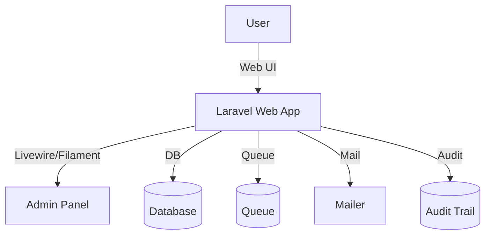

# Aliran Sistem Helpdesk (Helpdesk System Flow)

Dokumen ini menghuraikan aliran proses, komponen teknikal, dan kawalan kualiti bagi modul Helpdesk/Tiket ICT. Bahasa utama ialah Bahasa Melayu dengan sedikit istilah Inggeris untuk kejelasan.

Nota Penting: Sistem ini adalah untuk kegunaan dalaman MOTAC sahaja (internal use only). Tidak untuk kegunaan orang awam.

## Maklumat Dokumen (Document Information)

- Versi: 2.1.1 (SemVer)
- Tarikh Kemaskini: 31 Oktober 2025
- Status: Aktif — Diseragamkan mengikut D00–D15
- Klasifikasi: Terhad — Dalaman MOTAC
- Bahasa: Bahasa Melayu (utama), English (teknikal)
- Pematuhan Piawaian: ISO/IEC/IEEE 12207, 29148; PDPA 2010; WCAG 2.2 AA
- Rujukan D-Docs: D00, D02, D03, D04, D07–D08, D09, D10, D11, D12–D14

## 1. Ringkasan Modul (Module Overview)

- Tujuan: Mengurus aduan kerosakan ICT, permintaan bantuan, penugasan agen, dan penyelesaian.
- Pengguna Sasaran: Staf MOTAC (pemohon), Agen Sokongan IT, Staf BPM, Pentadbir Sistem.
- Teknologi: Laravel 12, PHP 8.2, Livewire v3, Filament v4, Tailwind CSS, Vite, MySQL, Redis Queue (optional).

## 2. Seni Bina (Architecture)

Rasional: Struktur modular, RBAC melalui Policies, audit trail diaktifkan, dan queue untuk notifikasi.

## 3. Aliran Proses (Process Flow)

1) Pengguna cipta tiket (isian borang, kategori isu, penerangan).
2) Sistem menugaskan tiket kepada agen (automatik atau manual) dan menetapkan SLA.
3) Agen memproses tiket (status: `Baru` → `Ditugaskan` → `Dalam_Proses`).
4) Jika maklumat tidak mencukupi, status ke `Menunggu_Pengguna` (request for info).
5) Apabila selesai, agen tandakan `Selesai`; pengguna mengesahkan `Disahkan`.
6) Sistem menutup tiket (`Ditutup`) dan menyimpan audit trail lengkap.

## 4. Komponen Teknikal (Technical Components)

- Livewire/Volt komponen borang tiket dan senarai tiket.
- Model: `HelpdeskTicket`, `HelpdeskAttachment`, `Category` (contoh).
- Polisi: `HelpdeskTicketPolicy` untuk `view`, `create`, `update`, `close`.
- Notifikasi E‑mel: `TicketCreated`, `TicketAssigned`, `TicketResolved`, `TicketClosed`.
- Audit Trail: event `created`, `updated`, `status_changed` dicatat dengan `user`, `time`, `IP`, `user_agent`.

## 5. Pematuhan & Aksesibiliti (Compliance & Accessibility)

- PDPA: PII dienkripsi jika perlu; akses terhad mengikut peranan.
- Aksesibiliti WCAG 2.2 AA: label ARIA, navigasi papan kekunci, kontras minima 4.5:1.
- Log Audit & Retensi: simpan log aktiviti dan data mengikut dasar retensi organisasi.

## 6. Ujian (Testing)

- Unit: validasi model, helpers.
- Feature: cipta tiket, kemaskini status, eskalasi SLA.
- Integrasi: e‑mel/queue, peranan dan polisi akses.

## 7. RTM (Traceability)

- RTM penuh: `docs/rtm/helpdesk_requirements_rtm.csv`.
- Contoh: `SRS-HELP-001` → `HelpdeskTicketController@store` → `HelpdeskTicketTest::testCreateTicket`.

## 8. Operasi (Operations)

- Queue Worker: `php artisan queue:work` untuk notifikasi dan kerja latar.
- Optimasi: `php artisan config:cache`, `route:cache`, `view:cache`.

## 9. Sejarah Revisi (Changelog)

- 2.1.1 (31-10-2025): Susun semula kandungan, terjemah penuh BM + istilah Inggeris, kemaskini Laravel 12/Filament v4/Livewire v3, tambah notis dalaman.
- 2.1.0 (17-10-2025): Versi terdahulu dimigrasi dan diseragamkan.

