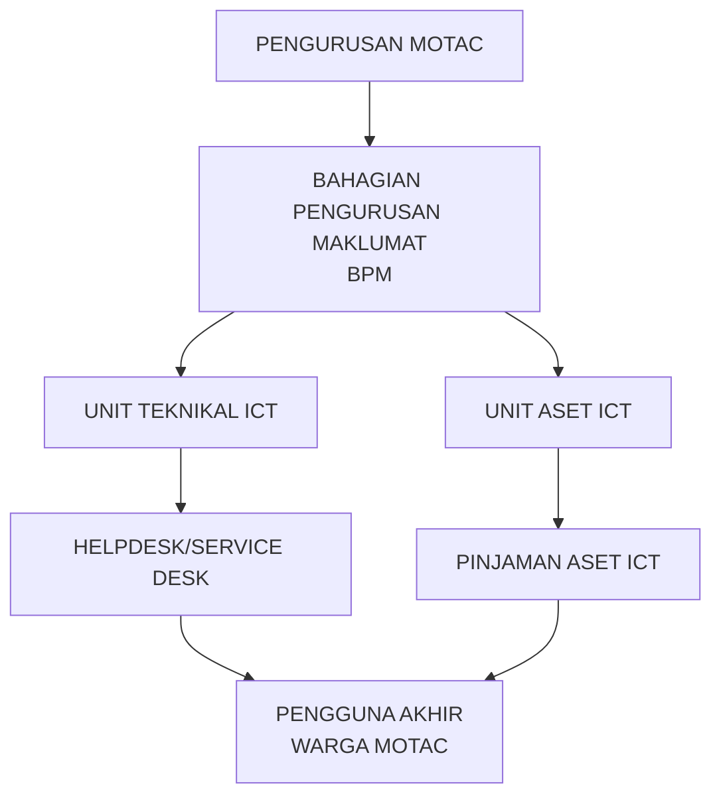
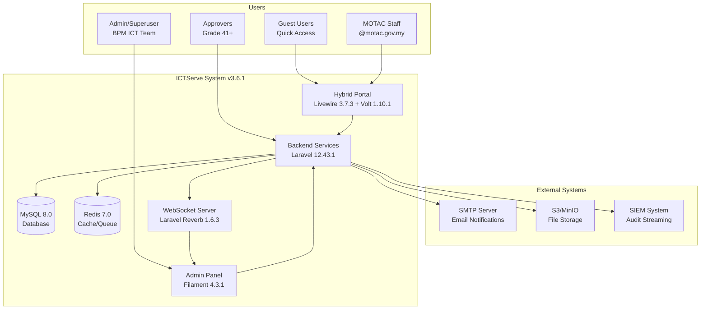
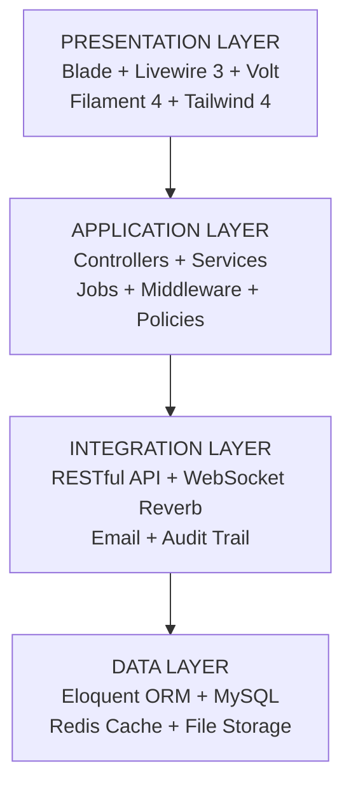
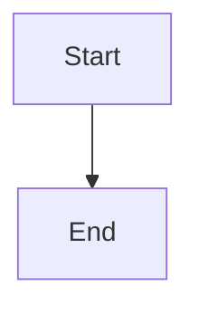

# ICTServe System Diagrams

All diagrams extracted from D00-D18 documentation in Mermaid format.

## D02 - Business Requirements Specification

### 1. Stakeholder Relationship Diagram

**File**: `D02-stakeholder-relationship.mmd`


### 2. Business Architecture
**File**: `D02-business-architecture.mmd`

### 3. Information Architecture
**File**: `D02-information-architecture.mmd`

### 4. Business Function Hierarchy
**File**: `D02-business-function-hierarchy.mmd`

## D04 - Software Design Document

### 1. System Context Diagram
**File**: `D04-system-context.mmd`


### 2. Component Diagram
**File**: `D04-component-diagram.mmd`

### 3. Deployment Architecture
**File**: `D04-deployment-architecture.mmd`

### 4. Guest User Journey
**File**: `D04-guest-flow.mmd`

### 5. Approval Workflow
**File**: `D04-approval-workflow.mmd`

## D11 - Technical Design Documentation

### 5. System Layers
**File**: `D11-system-layers.mmd`


### 6. AI Fallback Chain
**File**: `D11-fallback-chain.mmd`

### 7. Deployment Architecture
**File**: `D11-deployment-architecture.mmd`

## D12 - UI/UX Design Guide

### 8. Layout Hierarchy (Guest/Auth/Admin)
**File**: `D12-layout-hierarchy.mmd`

## D16 - Broadcasting Setup

### 9. Broadcasting Workflow
**File**: `D16-broadcasting-workflow.mmd`

## D18 - AI Chatbot (Ollama + Bedrock)

### 10. System Architecture
**File**: `D18-system-architecture.mmd`

### 11. Service Layer Architecture
**File**: `D18-service-layer-architecture.mmd`

### 12. Cost Optimization Flow
**File**: `D18-cost-optimization-flow.mmd`

## Usage

### Viewing Diagrams

1. **VS Code**: Install "Markdown Preview Mermaid Support" extension
2. **GitHub**: Renders automatically in markdown files
3. **Online**: Use https://mermaid.live/ to view/edit

### Embedding in Documentation

```markdown

```

## File Locations

All diagram files are stored in `docs/_reference/` with `.mmd` extension:

- D02-stakeholder-relationship.mmd
- D02-business-architecture.mmd
- D02-information-architecture.mmd
- D02-business-function-hierarchy.mmd
- D04-system-context.mmd
- D04-component-diagram.mmd
- D04-deployment-architecture.mmd
- D04-guest-flow.mmd
- D04-approval-workflow.mmd
- D11-system-layers.mmd
- D11-fallback-chain.mmd
- D11-deployment-architecture.mmd
- D12-layout-hierarchy.mmd
- D16-broadcasting-workflow.mmd
- D18-system-architecture.mmd
- D18-service-layer-architecture.mmd
- D18-cost-optimization-flow.mmd

## Standards

- **Format**: Mermaid (`.mmd`)
- **Naming**: `D##-description.mmd`
- **Language**: Technical terms in English, labels in Bahasa Melayu where appropriate
- **Version**: Aligned with D00-D18 v3.6.1
